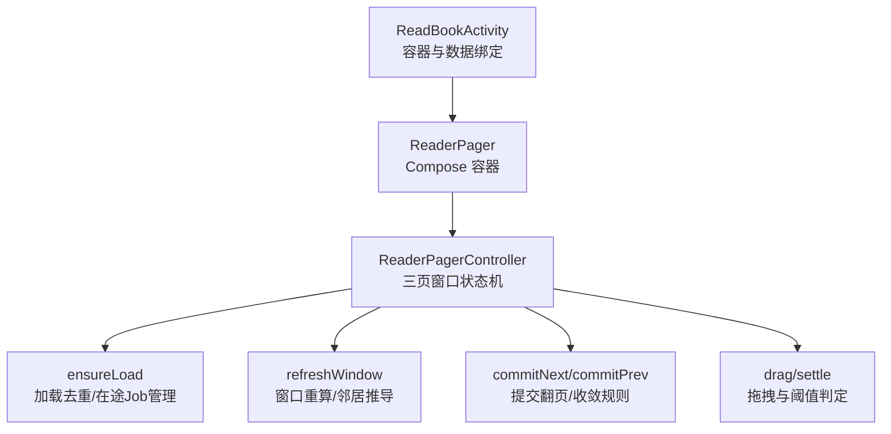
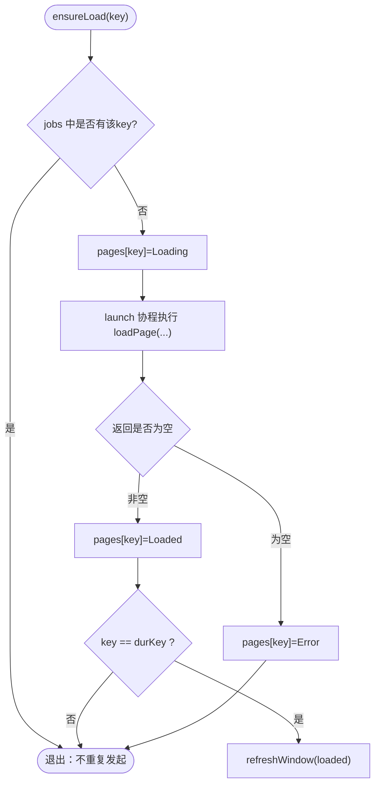
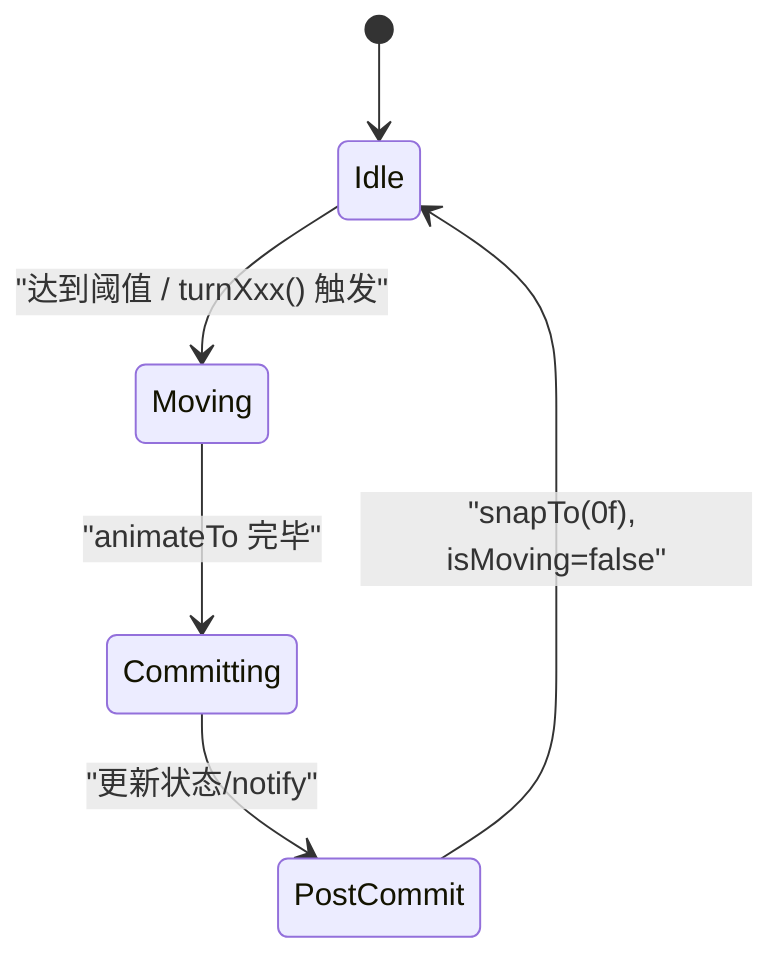
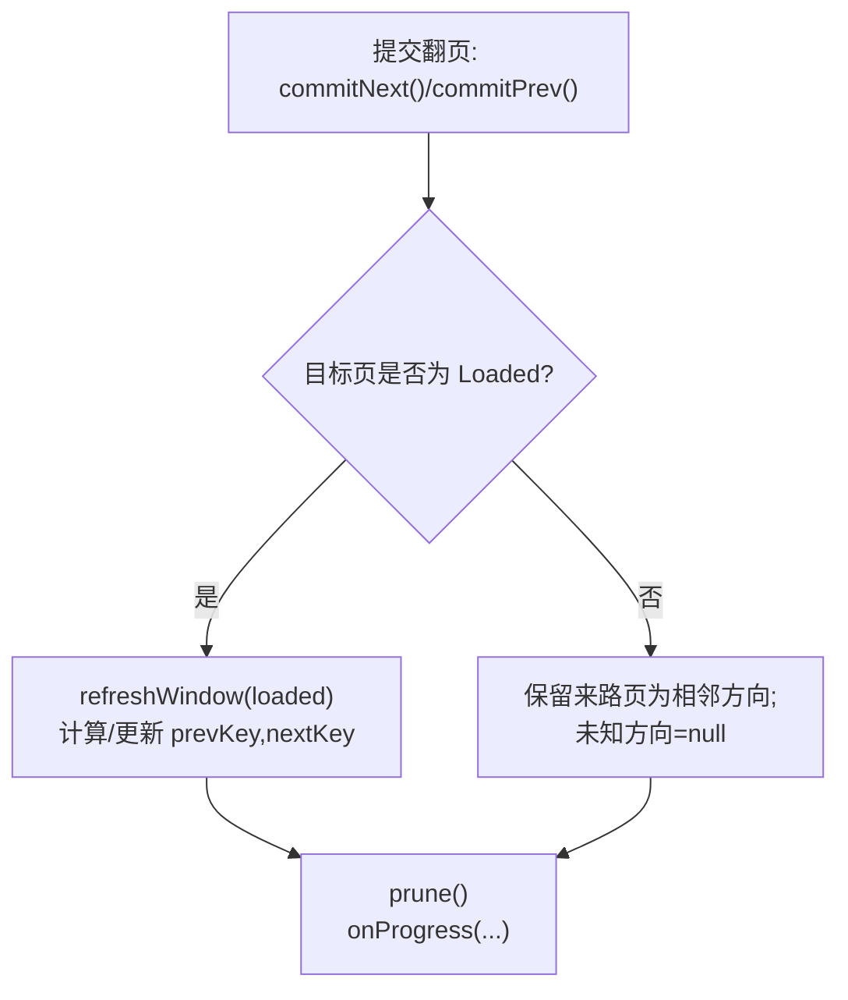
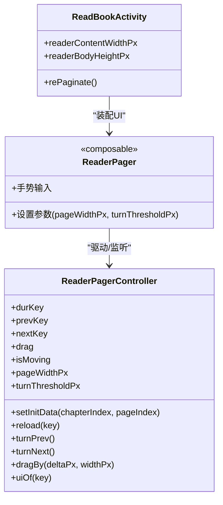

# 翻页控制器

<cite>
**本文档引用的文件**
- [ReaderPager.kt](file://module_book/src/main/java/com/ebook/book/reader/ReaderPager.kt)
- [ReadBookActivity.kt](file://module_book/src/main/java/com/ebook/book/ReadBookActivity.kt)
- [ReaderPagerControllerTest.kt](file://module_book/src/test/java/com/ebook/book/reader/ReaderPagerControllerTest.kt)
</cite>

## 目录
1. 引言
2. 项目结构
3. 核心组件
4. 架构总览
5. 详细组件分析
6. 依赖分析
7. 性能考量
8. 故障排查指南
9. 结论

## 引言
本文件聚焦阅读器的“三页窗口状态机”实现，系统化解析 ReaderPagerController 的翻页控制逻辑。文档重点覆盖：durKey/prevKey/nextKey 的管理、页面加载去重与在途 Job、竞态处理、拖拽手势与阈值判断、动画锁、哨兵页码与章节首末页请求、失败重试、目标页未 Loaded 时的窗口收敛规则以及自指保护等关键技术细节。为便于理解，配套提供架构图、流程图与时序图，并以测试用例验证边界行为。

## 项目结构
阅读器以 Compose UI 重构，翻页核心位于 ReaderPager.kt；调用入口与布局尺寸测量在 ReadBookActivity.kt；完整的三页状态机语义通过单测 ReaderPagerControllerTest.kt 锁定。



图示来源
- [ReaderPager.kt:112-347](file://module_book/src/main/java/com/ebook/book/reader/ReaderPager.kt#L112-L347)
- [ReadBookActivity.kt:82-124](file://module_book/src/main/java/com/ebook/book/ReadBookActivity.kt#L82-L124)

章节来源
- [ReaderPager.kt:64-347](file://module_book/src/main/java/com/ebook/book/reader/ReaderPager.kt#L64-L347)
- [ReadBookActivity.kt:82-124](file://module_book/src/main/java/com/ebook/book/ReadBookActivity.kt#L82-L124)
- [ReaderPagerControllerTest.kt:40-196](file://module_book/src/test/java/com/ebook/book/reader/ReaderPagerControllerTest.kt#L40-L196)

## 核心组件
- ReaderPageKey：页标识（章节索引 + 页码）。页码支持普通序号与“哨兵页码”（章节首页/末页），由加载后解析为真实页码。
- ReaderPageUi：单页渲染状态，包含 Loading/Error/Loaded。Loaded 携带分页后的正文片段及分页元信息。
- ReaderPagerController：三页窗口状态机与生命周期管理。维护 durKey（当前）、prevKey（前）、nextKey（后）三个键，负责加载去重、动画控制与窗口收敛。

章节来源
- [ReaderPager.kt:64-149](file://module_book/src/main/java/com/ebook/book/reader/ReaderPager.kt#L64-L149)

## 架构总览
三页窗口的交互流程可抽象为：用户操作或程序化指令 → 进入手势阶段（drag） → 根据阈值判定方向 → 切换 durKey → 如果新 durKey 已 Loaded 则立即刷新邻居（prevKey/nextKey），否则先保留来路作为相邻方向、未知方向置空，待加载完成后自动补全。

```mermaid
sequenceDiagram
    participant U as "用户/按键"
    participant P as "ReaderPagerController"
    participant L as "loadPage(数据源)"
    U->>P: "turnNext()/turnPrev() 或 dragBy(...)/settle(...)"
    P->>P: "isMoving 检查/动画锁定"
    alt 拖拽手势达到阈值
        P->>P: "设置 isMoving=true; animateTo(...)"
        P->>P: "commitNext()/commitPrev()"
        opt 新durKey已Loaded
            P->>P: "refreshWindow(loaded)"
        else 未Loaded
            P->>P: "保留来路为相邻方向; 未知方向=null"
        end
        P->>P: "prune(); onProgress(...)"
    else 未达到阈值
        P->>P: "动画回退/取消翻页"
    end
    Note over P,L: "ensureLoad按key去重,完成回调命中key==durKey时刷新窗口"
```

图示来源
- [ReaderPager.kt:158-347](file://module_book/src/main/java/com/ebook/book/reader/ReaderPager.kt#L158-L347)

## 详细组件分析

### 三页窗口状态机与 durKey/prevKey/nextKey 机制
- durKey：当前显示页。初次打开使用“哨兵页码”，由加载结果解析成具体页码。
- prevKey/nextKey：上一页/下一页标识。无相邻时为 null。
- 窗口模型：下一页绘制在当前页之下（向后翻时当前页左移露出）；上一页绘制在当前页之上（向前翻时从左侧滑入覆盖）。
- 窗口收敛规则：当提交翻页的目标页尚未 Loaded（Loading 或 Error）时，无法准确推导其前后邻居，因此“保留来路页作为相邻方向，未知方向收敛为 null”，保证三键互不相同，防止自指导致的翻页空转。
- 自指保护：严格避免 nextKey/prevKey 等于当前页自身，从而避免“翻页动画结束但画面不动”的空转现象。

章节来源
- [ReaderPager.kt:92-146](file://module_book/src/main/java/com/ebook/book/reader/ReaderPager.kt#L92-L146)
- [ReaderPager.kt:308-337](file://module_book/src/main/java/com/ebook/book/reader/ReaderPager.kt#L308-L337)

### 加载策略与异步控制
- 页面标识去重：确保Load(key.chapterIndex, key.pageIndex)不会重复触发。jobs 保存在途任务；pages 缓存 Loading/Error/Loaded。
- 在途 Job 管理：每个 key 对应一个协程。完成时需校验是否仍为登记任务，防止中途被替换导致“孤儿 Job 覆盖旧窗口”。
- 成功回调时机：当某个 page 加载完成且其 key 恰好是当前的 durKey，立即触发 refreshWindow 补全窗口邻居。
- 失败重试：reload(key) 会取消并重新发起 ensureLoad(key)。
- 进度上报：onProgress(chapterIndex, pageIndex) 用于更新菜单标题与滑条。



图示来源
- [ReaderPager.kt:176-200](file://module_book/src/main/java/com/ebook/book/reader/ReaderPager.kt#L176-L200)

章节来源
- [ReaderPager.kt:176-200](file://module_book/src/main/java/com/ebook/book/reader/ReaderPager.kt#L176-L200)
- [ReaderPager.kt:158-174](file://module_book/src/main/java/com/ebook/book/reader/ReaderPager.kt#L158-L174)

### 拖拽手势、阈值与动画锁
- 拖拽：drag 为 Animatable 横向位移，正负号决定前翻/后翻；ReaderPager 组合层负责收集 gesture 并调用 dragBy(deltaPx, widthPx)。
- 阈值：turnThresholdPx 为“翻页成功阈值”（30dp 换算），在 settle(totalDx) 中比较 totalDx 与阈值判定方向。
- 动画期手势锁：isMoving=true 期间禁止新的 turnPrev/turnNext 触发，防止并发动画；动画结束统一复位 drag=0f 与 isMoving=false。



图示来源
- [ReaderPager.kt:222-260](file://module_book/src/main/java/com/ebook/book/reader/ReaderPager.kt#L222-L260)
- [ReaderPager.kt:264-294](file://module_book/src/main/java/com/ebook/book/reader/ReaderPager.kt#L264-L294)

章节来源
- [ReaderPager.kt:222-260](file://module_book/src/main/java/com/ebook/book/reader/ReaderPager.kt#L222-L260)
- [ReaderPager.kt:264-294](file://module_book/src/main/java/com/ebook/book/reader/ReaderPager.kt#L264-L294)

### 窗口收敛与自指保护（关键）
- 若 commitNext/commitPrev 发现目标页并非 Loaded，不能仅跳过刷新：必须保留来路页为相邻方向（前进或后退之一），未知方向置空。这保持“可退回刚读过的那页”的不退化体验。
- 严格避免 nextKey/prevKey 指向当前页本身，防止“自指空转”。
- prune() 清理不在窗口内的页和 in-flight job，释放内存。



图示来源
- [ReaderPager.kt:308-347](file://module_book/src/main/java/com/ebook/book/reader/ReaderPager.kt#L308-L347)

章节来源
- [ReaderPager.kt:308-347](file://module_book/src/main/java/com/ebook/book/reader/ReaderPager.kt#L308-L347)

### 哨兵页码与章节首末页处理
- 哨兵页码：pageIndex 取 DBCode 的章节首页/末页标记，表示“需要加载章节的首末页”这一请求语义。具体页码由加载结果解析后再参与窗口邻居推导。
- 首次进入：setInitData 将 durKey 设为章节哨兵，加载完成后自然解析为真实页码，并通过 refreshWindow 推导 prev/next。
- 章节边界：下一章首/上章末分别用相应的哨兵标志位表达，避免超界请求或越界排版。

章节来源
- [ReaderPager.kt:64-70](file://module_book/src/main/java/com/ebook/book/reader/ReaderPager.kt#L64-L70)
- [ReaderPager.kt:158-168](file://module_book/src/main/java/com/ebook/book/reader/ReaderPager.kt#L158-L168)
- [ReaderPager.kt:204-221](file://module_book/src/main/java/com/ebook/book/reader/ReaderPager.kt#L204-L221)

### 错误处理与容错
- 加载失败：pages[key]=Error；提供 reload(key) 主动重试。
- 失败页仍可正常回退：由于收敛规则保留来路页为相邻方向，不会形成“死页”。
- 并发安全：ensureLoad 内对“本协程是否为当前登记任务”进行判等+isActive，避免旧任务覆盖新窗口。

章节来源
- [ReaderPager.kt:176-200](file://module_book/src/main/java/com/ebook/book/reader/ReaderPager.kt#L176-L200)
- [ReaderPager.kt:170-174](file://module_book/src/main/java/com/ebook/book/reader/ReaderPager.kt#L170-L174)
- [ReaderPager.kt:308-337](file://module_book/src/main/java/com/ebook/book/reader/ReaderPager.kt#L308-L337)

### 完整异步时序（带示例场景）
典型流程：
1) setInitData 初始化到章节哨兵页；ensureLoad(durKey) 启动加载；
2) 首次加载完成后，refreshWindow 推导 prev/next（如章节首页无上一页则为 null）；
3) turnNext/dragBy→settle 超过阈值 → 切换到下一页；
4) 若下一页未 Loaded，收敛到 prev 保留来路、next=null；加载完成后 key==durKey，触发 refreshWindow 补齐；
5) turnPrev 同理对称；prune 持续清理窗口外资源。

章节来源
- [ReaderPagerControllerTest.kt:40-196](file://module_book/src/test/java/com/ebook/book/reader/ReaderPagerControllerTest.kt#L40-L196)

## 依赖分析
- Compose 容器（ReaderPager）提供手势输入与布局尺寸测量，注入 pageWidthPx 与 turnThresholdPx；ReaderPagerController 暴露 drag/isMoving 供 UI 驱动与反馈。
- Data Source：ReaderPagerController 通过传入的 loadPage 拉取内容；具体实现位于上层 Activity 侧，此处仅定义签名与约定。
- UI 绑定：ReadBookActivity 组织布局，提供 readerContentWidthPx/bodyHeightPx，驱动排版本身（ReaderTypesetter）与分页策略（由具体加载器输出 durPageIndex 等信息）。



图示来源
- [ReaderPager.kt:112-347](file://module_book/src/main/java/com/ebook/book/reader/ReaderPager.kt#L112-L347)
- [ReadBookActivity.kt:82-124](file://module_book/src/main/java/com/ebook/book/ReadBookActivity.kt#L82-L124)

章节来源
- [ReaderPager.kt:112-347](file://module_book/src/main/java/com/ebook/book/reader/ReaderPager.kt#L112-L347)
- [ReadBookActivity.kt:82-124](file://module_book/src/main/java/com/ebook/book/ReadBookActivity.kt#L82-L124)

## 性能考量
- 加载去重：同一 key 只允许一个在途任务，已在 Loaded 的页不再重复拉取；减少网络/IO 与整章重排成本。
- 内存管理：prune() 定期剔除窗口外的页面状态与未完成的 Job，防止累积。
- 动画与手势：isMoving 保护期避免多动画叠加导致的状态抖动与计算浪费；一次性 snapTo(0f) 归位。
- 懒加载邻居：只有在目标页确认为 Loaded 时才刷新窗口邻居；若未 Loaded，延迟到完成回调再计算，避免无用请求。

章节来源
- [ReaderPager.kt:176-200](file://module_book/src/main/java/com/ebook/book/reader/ReaderPager.kt#L176-L200)
- [ReaderPager.kt:340-346](file://module_book/src/main/java/com/ebook/book/reader/ReaderPager.kt#L340-L346)
- [ReaderPager.kt:240-260](file://module_book/src/main/java/com/ebook/book/reader/ReaderPager.kt#L240-L260)

## 故障排查指南
常见问题与定位建议：
- 翻页后画面不动（空转）：检查是否存在“自指”（prevKey/nextKey 停留在 durKey）。应确认 converge 分支已保留来路作为相邻方向，且不会出现双方向同时为 null。
- 快速回翻闪加载：确认 ensureLoad 中已对 pages[key] 为 Loaded 做短路，不应重抓。
- 失败页卡住：确认 reload(key) 已被调用；同时检查是否在 failure 时仍保留了合理的相邻方向，保证能退回。
- 多次点击触发多重动画：确认 isMoving 有效锁定；动画结束后 reset drag 与 isMoving。
- 进度/菜单标题不更新：确认 onProgress 在每次 durKey 切换后都被正确触发。

章节来源
- [ReaderPager.kt:264-294](file://module_book/src/main/java/com/ebook/book/reader/ReaderPager.kt#L264-L294)
- [ReaderPager.kt:308-347](file://module_book/src/main/java/com/ebook/book/reader/ReaderPager.kt#L308-L347)

## 结论
ReaderPagerController 以严格的三页窗口不变量（三键互异、方向不双空）与“失败/在途页的保守收敛”策略，实现了鲁棒且高性能的翻页体验。结合键级去重、在途 Job 管理与及时回收，既避免了冗余加载又保障了切换流畅度。配合 Compose 手势与动画原语，形成了从交互到状态的闭环控制。测试用例固化了关键边界条件，建议在涉及任何改动前复跑并扩展用例，确保三者并存：能力可用、语义稳定、性能可控。