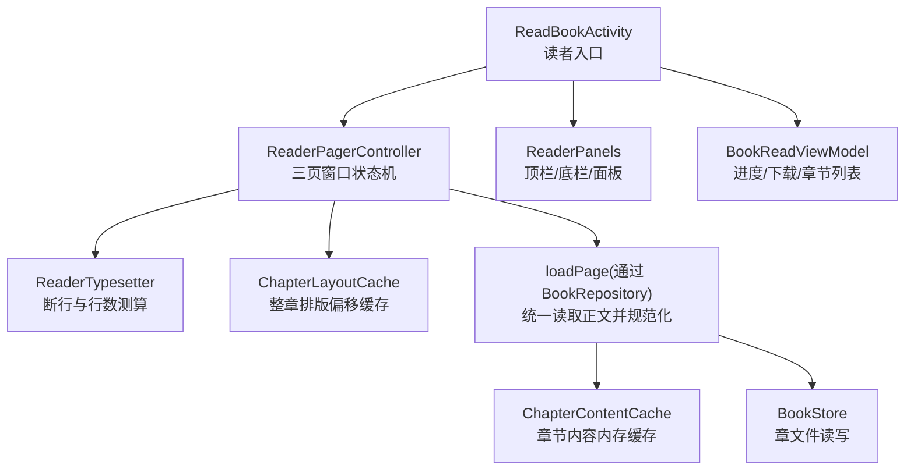
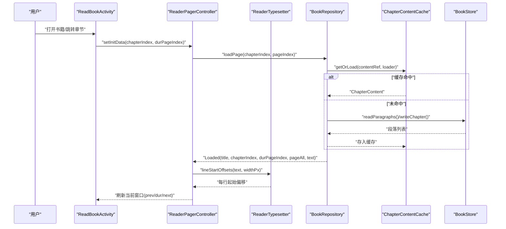
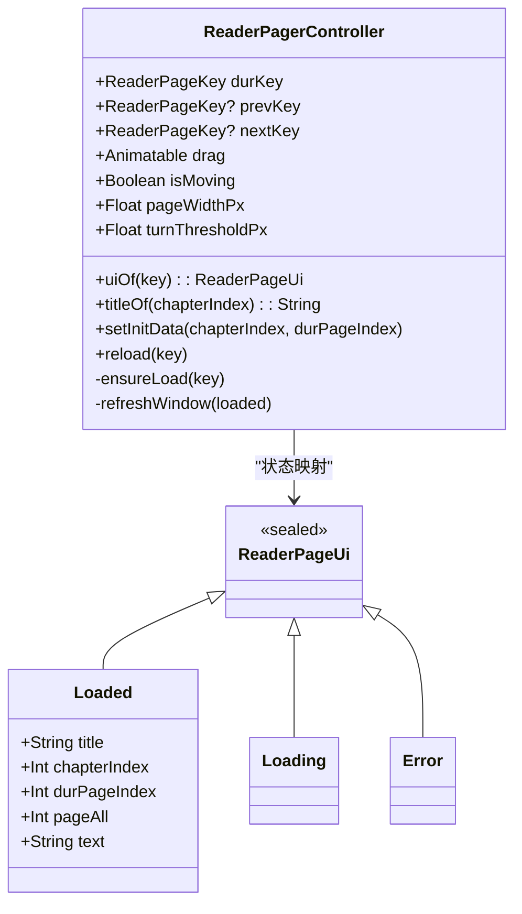
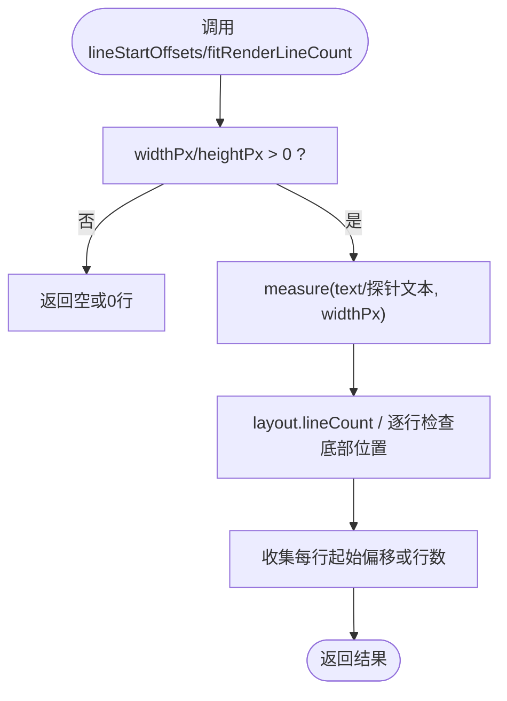
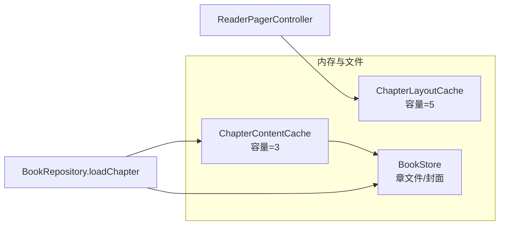
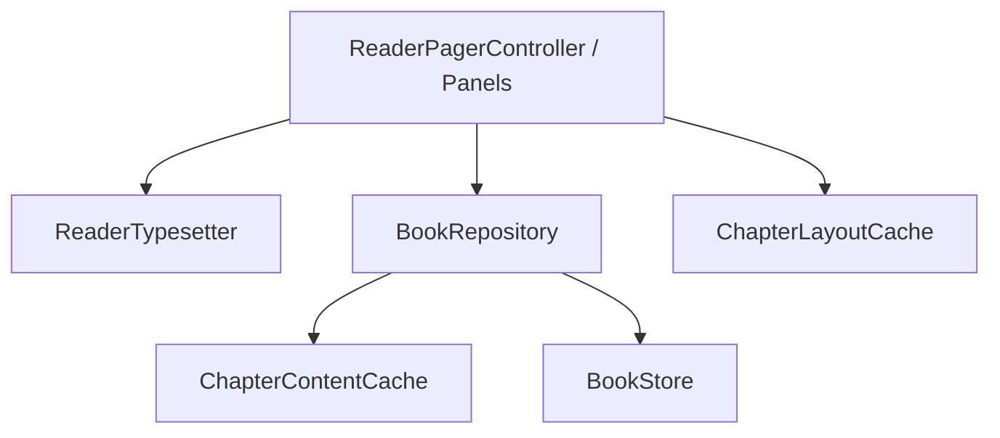

# 阅读器引擎

<cite>
**本文引用的文件 **
- [module_book/ReadBookActivity.kt](file://module_book/src/main/java/com/ebook/book/ReadBookActivity.kt)
- [module_book/reader/ReaderPager.kt](file://module_book/src/main/java/com/ebook/book/reader/ReaderPager.kt)
- [module_book/reader/ReaderTypesetter.kt](file://module_book/src/main/java/com/ebook/book/reader/ReaderTypesetter.kt)
- [module_book/reader/ChapterLayoutCache.kt](file://module_book/src/main/java/com/ebook/book/reader/ChapterLayoutCache.kt)
- [module_book/reader/ReaderPanels.kt](file://module_book/src/main/java/com/ebook/book/reader/ReaderPanels.kt)
- [lib_book_common/store/BookStore.kt](file://lib_book_common/src/main/java/com/ebook/common/store/BookStore.kt)
- [lib_book_common/store/ChapterContentCache.kt](file://lib_book_common/src/main/java/com/ebook/common/store/ChapterContentCache.kt)
- [lib_book_common/repository/BookRepository.kt](file://lib_book_common/src/main/java/com/ebook/common/repository/BookRepository.kt)
- [module_book/mvvm/viewmodel/BookReadViewModel.kt](file://module_book/src/main/java/com/ebook/book/mvvm/viewmodel/BookReadViewModel.kt)
</cite>

## 目录
1. [简介](#简介)
2. [项目结构](#项目结构)
3. [核心组件](#核心组件)
4. [架构总览](#架构总览)
5. [关键组件详解](#关键组件详解)
6. [依赖关系分析](#依赖关系分析)
7. [性能优化策略](#性能优化策略)
8. [故障排查与问题定位](#故障排查与问题定位)
9. [结论](#结论)
10. [附录：API与状态说明](#附录api与状态说明)

## 简介
本引擎实现了电子书阅读器的完整渲染管线：从章节正文读取、规范化、分页切行、三页窗口滑动翻页，到 UI 菜单面板（亮度、字体、设置、章节目录）、进度保存、下载与缓存。其目标是提供高性能、可维护且用户体验良好的阅读体验。

## 项目结构
- 阅读器 UI 与控制位于 module_book 的 reader 包与 ReadBookActivity：包括分页控制器、类型设定器、排版缓存和各类面板。
- 数据与持久化由 lib_book_common 提供：BookRepository 统一章节读取、ChapterContentCache 内存缓存、BookStore 本地章文件存取、WriteTransactionRunner 事务提交。
- ViewModel 层 BookReadViewModel 管理阅读状态、进度、下载等。

图示来源
- [module_book/ReadBookActivity.kt:81-134](file://module_book/src/main/java/com/ebook/book/ReadBookActivity.kt#L81-L134)
- [module_book/reader/ReaderPager.kt:64-147](file://module_book/src/main/java/com/ebook/book/reader/ReaderPager.kt#L64-L147)
- [module_book/reader/ReaderTypesetter.kt:17-135](file://module_book/src/main/java/com/ebook/book/reader/ReaderTypesetter.kt#L17-L135)
- [module_book/reader/ChapterLayoutCache.kt:1-48](file://module_book/src/main/java/com/ebook/book/reader/ChapterLayoutCache.kt#L1-L48)
- [lib_book_common/repository/BookRepository.kt:164-200](file://lib_book_common/src/main/java/com/ebook/common/repository/BookRepository.kt#L164-L200)
- [lib_book_common/store/ChapterContentCache.kt:7-59](file://lib_book_common/src/main/java/com/ebook/common/store/ChapterContentCache.kt#L7-L59)
- [lib_book_common/store/BookStore.kt:15-127](file://lib_book_common/src/main/java/com/ebook/common/store/BookStore.kt#L15-L127)

章节来源
- [module_book/ReadBookActivity.kt:81-214](file://module_book/src/main/java/com/ebook/book/ReadBookActivity.kt#L81-L214)

## 核心组件
- ReaderPagerController：实现“当前页/上一页/下一页”的三页窗口与手势拖动动画；保证页面加载不重复、完成回调归属新窗口、异常重试。
- ReaderTypesetter：唯一排版事实源；测量断行起始偏移并计算可视行数，确保分页与渲染一致性。
- ChapterLayoutCache：按“章 + 字号 + 宽度”为键缓存整章段落起始偏移，避免同章 N 页重排 N 次。
- BookRepository + ChapterContentCache + BookStore：章节读取统一通道，先查内存缓存，再读磁盘/网络，写回规范化的段落列表。
- BookReadViewModel：管理书架条目、更新进度、发起下载任务。
- ReaderPanels：顶栏、底栏与三类面板（亮度、字体、设置）以及下拉章节目录。

章节来源
- [module_book/reader/ReaderPager.kt:64-200](file://module_book/src/main/java/com/ebook/book/reader/ReaderPager.kt#L64-L200)
- [module_book/reader/ReaderTypesetter.kt:17-135](file://module_book/src/main/java/com/ebook/book/reader/ReaderTypesetter.kt#L17-L135)
- [module_book/reader/ChapterLayoutCache.kt:1-48](file://module_book/src/main/java/com/ebook/book/reader/ChapterLayoutCache.kt#L1-L48)
- [lib_book_common/repository/BookRepository.kt:164-200](file://lib_book_common/src/main/java/com/ebook/common/repository/BookRepository.kt#L164-L200)
- [lib_book_common/store/ChapterContentCache.kt:7-59](file://lib_book_common/src/main/java/com/ebook/common/store/ChapterContentCache.kt#L7-L59)
- [lib_book_common/store/BookStore.kt:15-127](file://lib_book_common/src/main/java/com/ebook/common/store/BookStore.kt#L15-L127)
- [module_book/mvvm/viewmodel/BookReadViewModel.kt:21-123](file://module_book/src/main/java/com/ebook/book/mvvm/viewmodel/BookReadViewModel.kt#L21-L123)
- [module_book/reader/ReaderPanels.kt:123-178](file://module_book/src/main/java/com/ebook/book/reader/ReaderPanels.kt#L123-L178)

## 架构总览
阅读器以 Activity 为宿主，Compose 组合出 ReaderPager（含 ReaderPagerController），ReaderTypesetter 负责测量断行，布局缓存与内容缓存降低重算成本；仓库层统一章节获取路径，保障网络与本地书籍一致处理。

图示来源
- [module_book/ReadBookActivity.kt:130-140](file://module_book/src/main/java/com/ebook/book/ReadBookActivity.kt#L130-L140)
- [module_book/reader/ReaderPager.kt:158-200](file://module_book/src/main/java/com/ebook/book/reader/ReaderPager.kt#L158-L200)
- [module_book/reader/ReaderTypesetter.kt:52-81](file://module_book/src/main/java/com/ebook/book/reader/ReaderTypesetter.kt#L52-L81)
- [lib_book_common/repository/BookRepository.kt:164-200](file://lib_book_common/src/main/java/com/ebook/common/repository/BookRepository.kt#L164-L200)
- [lib_book_common/store/ChapterContentCache.kt:37-59](file://lib_book_common/src/main/java/com/ebook/common/store/ChapterContentCache.kt#L37-L59)
- [lib_book_common/store/BookStore.kt:28-38](file://lib_book_common/src/main/java/com/ebook/common/store/BookStore.kt#L28-L38)

## 关键组件详解

### 分页加载机制与三页窗口状态机（ReaderPagerController）
- 窗口模型：当前页（dur）、下一页（next，绘制在当前页之下）、上一页（prev，绘制在当前页之上）。drag 控制横向位移（px）；成功阈值约 30dp；isMoving 锁定手势/程序翻页，防并发动画。
- 去重与归属：在途任务用 ReaderPageKey 登记，已完成 Loaded 的页不再重复请求；翻页后在途任务完成时若 key==durKey 则触发窗口重算。
- 收敛规则：提交翻页时如果目标页仍是 Loading/Error，则保留来路页作为相邻方向，未知方向收敛为 null，维持 prevKey != durKey、nextKey != durKey，避免死循环与“卡死页”。

图示来源
- [module_book/reader/ReaderPager.kt:64-147](file://module_book/src/main/java/com/ebook/book/reader/ReaderPager.kt#L64-L147)
- [module_book/reader/ReaderPager.kt:112-200](file://module_book/src/main/java/com/ebook/book/reader/ReaderPager.kt#L112-L200)

时序要点
- 初始化/跳转：清理在途任务，重置窗口，设置 durKey 并确保加载，立即回调进度驱动 UI。
- 加载中/失败重试：ensureLoad 先判 jobs/pages，已 Loaded 不重抓；异步完成后判断是否仍属于该 key、再置状态。

章节来源
- [module_book/reader/ReaderPager.kt:151-200](file://module_book/src/main/java/com/ebook/book/reader/ReaderPager.kt#L151-L200)

### 内容渲染算法（ReaderTypesetter）
- 断行起始偏移：lineStartOffsets 基于 Compose TextMeasurer 对原文进行测量，返回每一渲染行在原文中的起始偏移列表。仅偏移不拼接子串以避免段落分隔符丢失导致的折行错乱。
- 可视行数测算：fitRenderLineCount 通过逐行读取底部位置计算能容纳的最大行数，避免估算公式带来的像素级偏差。
- 样式共用：readerBodyTextStyle 固定 fontSize、lineHeight、textAlign 与 lineHeightStyle，确保测量端与渲染端一致。

图示来源
- [module_book/reader/ReaderTypesetter.kt:34-81](file://module_book/src/main/java/com/ebook/book/reader/ReaderTypesetter.kt#L34-L81)
- [module_book/reader/ReaderTypesetter.kt:106-135](file://module_book/src/main/java/com/ebook/book/reader/ReaderTypesetter.kt#L106-L135)

章节来源
- [module_book/reader/ReaderTypesetter.kt:17-95](file://module_book/src/main/java/com/ebook/book/reader/ReaderTypesetter.kt#L17-L95)
- [module_book/reader/ReaderTypesetter.kt:106-135](file://module_book/src/main/java/com/ebook/book/reader/ReaderTypesetter.kt#L106-L135)

### 排版与内容缓存策略
- 章节内容缓存（ChapterContentCache）：容量默认 3（当前章+前后各一），键为 content_ref（自带 bookId），支持无效化同一本书的条目，getOrLoad 在锁外执行 loader，减少阻塞。
- 排版偏移缓存（ChapterLayoutCache）：键包含 contentRef/fontSizeSp/widthPx，同步 Map 包装保证并发安全，容量默认 5。
- 文件存储（BookStore）：booksRoot/<bookId>/cNNNNN.txt，UTF-8，段落以 LF 分隔，导入带 .tmp 原子替换；支持删除书/单章、封面写入、对账清理。

图示来源
- [lib_book_common/store/ChapterContentCache.kt:7-59](file://lib_book_common/src/main/java/com/ebook/common/store/ChapterContentCache.kt#L7-L59)
- [module_book/reader/ChapterLayoutCache.kt:1-48](file://module_book/src/main/java/com/ebook/book/reader/ChapterLayoutCache.kt#L1-L48)
- [lib_book_common/store/BookStore.kt:15-127](file://lib_book_common/src/main/java/com/ebook/common/store/BookStore.kt#L15-L127)
- [lib_book_common/repository/BookRepository.kt:164-200](file://lib_book_common/src/main/java/com/ebook/common/repository/BookRepository.kt#L164-L200)

章节来源
- [lib_book_common/store/ChapterContentCache.kt:7-59](file://lib_book_common/src/main/java/com/ebook/common/store/ChapterContentCache.kt#L7-L59)
- [module_book/reader/ChapterLayoutCache.kt:1-48](file://module_book/src/main/java/com/ebook/book/reader/ChapterLayoutCache.kt#L1-L48)
- [lib_book_common/store/BookStore.kt:15-127](file://lib_book_common/src/main/java/com/ebook/common/store/BookStore.kt#L15-L127)

### 阅读进度同步与书签管理
- 进度：BookReadViewModel 将 durChapter/durChapterPage 写入 BookShelfEntity，并通过 BookRepository.saveProgress 落库与事件发射；Activity 进入即保存一次以防崩溃丢进度。
- 书签：UI 面板中提供书签按钮图标与交互入口；代码片段可见书签图标的语义信息定义，具体书签逻辑通常由上层 VM/仓储协同（本文件中主要展示 UI 接入点）。

章节来源
- [module_book/mvvm/viewmodel/BookReadViewModel.kt:33-46](file://module_book/src/main/java/com/ebook/book/mvvm/viewmodel/BookReadViewModel.kt#L33-L46)
- [module_book/reader/ReaderPanels.kt:36-60](file://module_book/src/main/java/com/ebook/book/reader/ReaderPanels.kt#L36-L60)
- [module_book/ReadBookActivity.kt:130-135](file://module_book/src/main/java/com/ebook/book/ReadBookActivity.kt#L130-L135)

### 阅读设置与主题适配
- 字体与背景主题：ReadBookControl 提供字体档位与背景主题切换，内存缓存 + SP 持久化；字体影响 readerBodyTextStyle 的字号与行高。
- 亮度：ReaderPanels 暴露亮度调节面板；Activity 恢复手动亮度并应用至当前窗口。
- 无障碍：ReaderPanels 内多处使用 semantics 提升可访问性描述，便于读屏阅读；进度条等信息带有无障碍范围信息。

章节来源
- [module_book/reader/ReaderPanels.kt:180-318](file://module_book/src/main/java/com/ebook/book/reader/ReaderPanels.kt#L180-L318)
- [module_book/ReadBookActivity.kt:130-135](file://module_book/src/main/java/com/ebook/book/ReadBookActivity.kt#L130-L135)

### 下载与离线缓存
- 下载：BookReadViewModel.startDownload 先入库下载任务，再拉起前台服务 DownloadService；防止系统拒绝启动导致任务丢失。
- 本地书导入与存储：BookStore 提供导入暂存目录与原子 renameTo；ChapterContentCache 负责内存缓冲，提高翻页性能。

章节来源
- [module_book/mvvm/viewmodel/BookReadViewModel.kt:73-90](file://module_book/src/main/java/com/ebook/book/mvvm/viewmodel/BookReadViewModel.kt#L73-L90)
- [lib_book_common/store/BookStore.kt:40-74](file://lib_book_common/src/main/java/com/ebook/common/store/BookStore.kt#L40-L74)
- [lib_book_common/store/ChapterContentCache.kt:7-59](file://lib_book_common/src/main/java/com/ebook/common/store/ChapterContentCache.kt#L7-L59)

### 触摸手势与导航
- 手势：ReaderPagerController 的 Animatable drag 记录横向位移，isMoving 锁定时禁止外部翻页/手势，配合阈值与 settle 动画完成翻页确认；上下滑/点击翻页由面板或控制器组合实现。
- 键盘/音量：Activity 持有 pagerController 引用以便全局按键转发（如音量键翻页）。

章节来源
- [module_book/reader/ReaderPager.kt:92-143](file://module_book/src/main/java/com/ebook/book/reader/ReaderPager.kt#L92-L143)
- [module_book/ReadBookActivity.kt:102-107](file://module_book/src/main/java/com/ebook/book/ReadBookActivity.kt#L102-L107)

## 依赖关系分析
- 低耦合：UI（ReaderPager/ReaderPanels/ReaderTypesetter）依赖抽象的 loadPage 函数，数据层 BookRepository 独立提供；缓存解耦了 IO 与渲染。
- 单一事实源：ReaderTypesetter 同时用于断行与行数测算，杜绝“分行数≠渲染行数”的历史缺陷。
- 线程与并发：ChapterContentCache 用 Mutex 保护，ChapterLayoutCache 用 synchronizedMap 保护并发写；ReaderPagerController 利用协程 Job 身份校验避免覆盖后续任务。

图示来源
- [module_book/reader/ReaderPager.kt:112-200](file://module_book/src/main/java/com/ebook/book/reader/ReaderPager.kt#L112-L200)
- [module_book/reader/ReaderTypesetter.kt:17-135](file://module_book/src/main/java/com/ebook/book/reader/ReaderTypesetter.kt#L17-L135)
- [lib_book_common/repository/BookRepository.kt:164-200](file://lib_book_common/src/main/java/com/ebook/common/repository/BookRepository.kt#L164-L200)
- [lib_book_common/store/ChapterContentCache.kt:21-59](file://lib_book_common/src/main/java/com/ebook/common/store/ChapterContentCache.kt#L21-L59)
- [module_book/reader/ChapterLayoutCache.kt:20-48](file://module_book/src/main/java/com/ebook/book/reader/ChapterLayoutCache.kt#L20-L48)

章节来源
- [lib_book_common/store/ChapterContentCache.kt:21-59](file://lib_book_common/src/main/java/com/ebook/common/store/ChapterContentCache.kt#L21-L59)
- [module_book/reader/ChapterLayoutCache.kt:20-48](file://module_book/src/main/java/com/ebook/book/reader/ChapterLayoutCache.kt#L20-L48)

## 性能优化策略
- 排版重排缓存：ChapterLayoutCache 避免同章翻页重复整章重排（O(章长) 被限制为每章一次，按字号+宽度维度）。
- 内容读取缓存：ChapterContentCache 默认 3 项，避免翻同一章多次开读/解码磁盘。
- 测量器无缓存：rememberTextMeasurer 保持 cacheSize=0，避免跨线程并发改内部状态的风险。
- 并行预加载：ReaderPagerController 在窗口边缘处会 ensureLoad 上一页/下一页，结合布局与内容缓存减少白屏时间。
- 文件存储原子性：BookStore 导入使用 .tmp 目录 + renameTo，避免中途损坏导致的数据不一致。

章节来源
- [module_book/reader/ReaderTypesetter.kt:97-113](file://module_book/src/main/java/com/ebook/book/reader/ReaderTypesetter.kt#L97-L113)
- [module_book/reader/ChapterLayoutCache.kt:8-19](file://module_book/src/main/java/com/ebook/book/reader/ChapterLayoutCache.kt#L8-L19)
- [lib_book_common/store/ChapterContentCache.kt:7-33](file://lib_book_common/src/main/java/com/ebook/common/store/ChapterContentCache.kt#L7-L33)
- [lib_book_common/store/BookStore.kt:40-74](file://lib_book_common/src/main/java/com/ebook/common/store/BookStore.kt#L40-L74)

## 故障排查与问题定位
- 空白/无内容：loadChapter 仅当 paragraphs 非空才写入缓存；空内容将被视为缺失，不会进入缓存造成“假正例”。
- 页数/折行错乱：确保使用 ReaderTypesetter.readerBodyTextStyle 与统一的 TextMeasurer，避免“分行数≠渲染行数”造成的漏行与跳页。
- 卡顿与 CPU 占用：超长章节多页重排会放大开销；优先启用 ChapterLayoutCache 并按需要调大容量或延长失效间隔。
- 下载被拒或任务丢失：务必先入库任务再拉起 DownloadService，避免 targetSdk 配额/后台限制导致任务遗失。
- 权限通知：下载通知需要相应权限；未授权只影响进度展示，不影响下载本身。

章节来源
- [lib_book_common/repository/BookRepository.kt:170-199](file://lib_book_common/src/main/java/com/ebook/common/repository/BookRepository.kt#L170-L199)
- [module_book/reader/ReaderTypesetter.kt:116-135](file://module_book/src/main/java/com/ebook/book/reader/ReaderTypesetter.kt#L116-L135)
- [module_book/reader/ChapterLayoutCache.kt:8-19](file://module_book/src/main/java/com/ebook/book/reader/ChapterLayoutCache.kt#L8-L19)
- [module_book/mvvm/viewmodel/BookReadViewModel.kt:73-90](file://module_book/src/main/java/com/ebook/book/mvvm/viewmodel/BookReadViewModel.kt#L73-L90)

## 结论
本阅读器引擎以“单一排版事实源 + 分层缓存 + 稳定的三页窗口状态机”为核心，实现了高效、鲁棒的翻页体验。通过在 UI 层引入无障碍增强、亮度/字体/主题自适应，以及完善的下载、进度与缓存管理机制，保证了在不同设备与场景下的可读性与性能。未来可按需扩展更精细的多源内容路由、章节元数据管理与更细粒度的主题定制。

## 附录：API与状态说明
- ReaderPageKey：(chapterIndex, pageIndex) 标识一页数据，>=0 为解析后的实际页码，begin/end 哨兵表示章节首尾加载请求。
- ReaderPageUi：Loading/Loading/Error/Loaded 四态，Loaded 携带 title/chapterIndex/durPageIndex/pageAll/text，text 为段落连续子串（不含结尾换行）。
- ReaderPagerController API：setInitData/reload/uiOf/titleOf；属性 durKey/prevKey/nextKey/drag/isMoving/pageWidthPx/turnThresholdPx。
- ReaderTypesetter API：lineStartOffsets/fitRenderLineCount/rememberReaderTypesetter；风格通过 readerBodyTextStyle 配置。
- 缓存 API：ChapterContentCache.getOrLoad/invalidateBook/clear；ChapterLayoutCache.getOrCompute/invalidaBook/clear。
- 存储 API：BookStore.readParagraphs/writeChapter/deleteChapter/deleteBook/reconcile。
- ViewModel API：updateProgress/saveProgress/getChapterTitle/checkInShelf/addToShelf/startDownload/loadChapter。

章节来源
- [module_book/reader/ReaderPager.kt:64-147](file://module_book/src/main/java/com/ebook/book/reader/ReaderPager.kt#L64-L147)
- [module_book/reader/ReaderPager.kt:151-200](file://module_book/src/main/java/com/ebook/book/reader/ReaderPager.kt#L151-L200)
- [module_book/reader/ReaderTypesetter.kt:17-135](file://module_book/src/main/java/com/ebook/book/reader/ReaderTypesetter.kt#L17-L135)
- [lib_book_common/store/ChapterContentCache.kt:21-59](file://lib_book_common/src/main/java/com/ebook/common/store/ChapterContentCache.kt#L21-L59)
- [module_book/reader/ChapterLayoutCache.kt:20-48](file://module_book/src/main/java/com/ebook/book/reader/ChapterLayoutCache.kt#L20-L48)
- [lib_book_common/store/BookStore.kt:15-127](file://lib_book_common/src/main/java/com/ebook/common/store/BookStore.kt#L15-L127)
- [module_book/mvvm/viewmodel/BookReadViewModel.kt:33-123](file://module_book/src/main/java/com/ebook/book/mvvm/viewmodel/BookReadViewModel.kt#L33-L123)