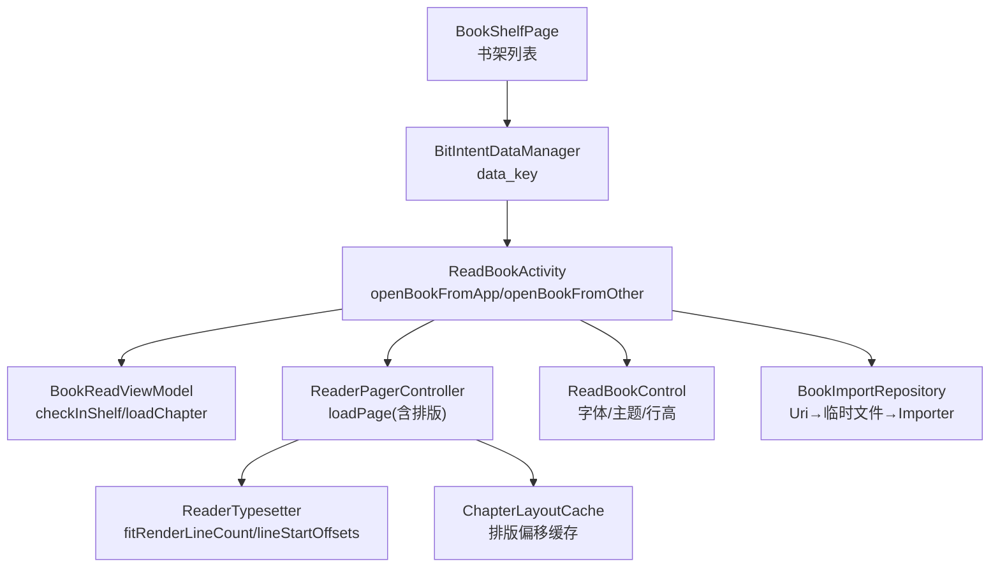
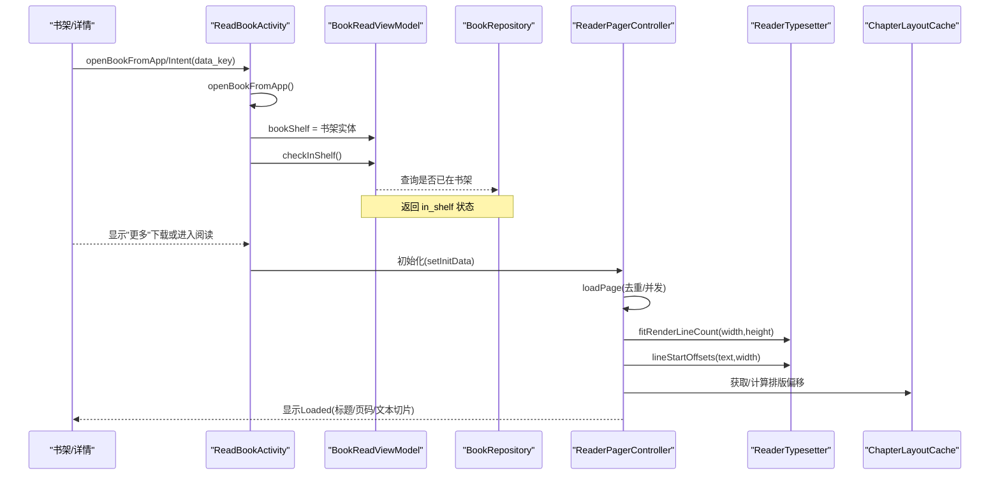
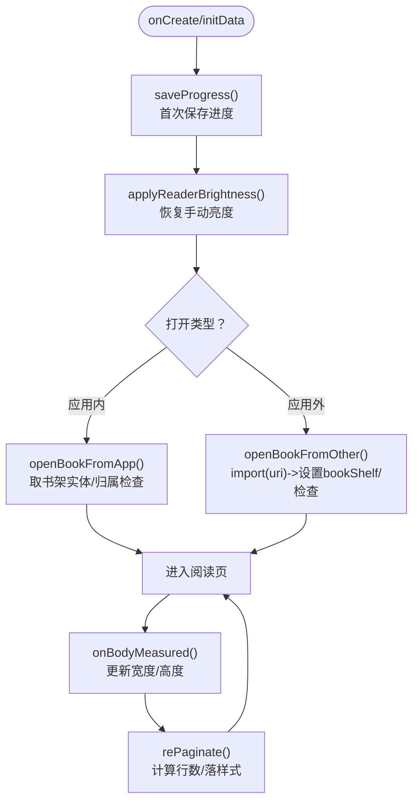
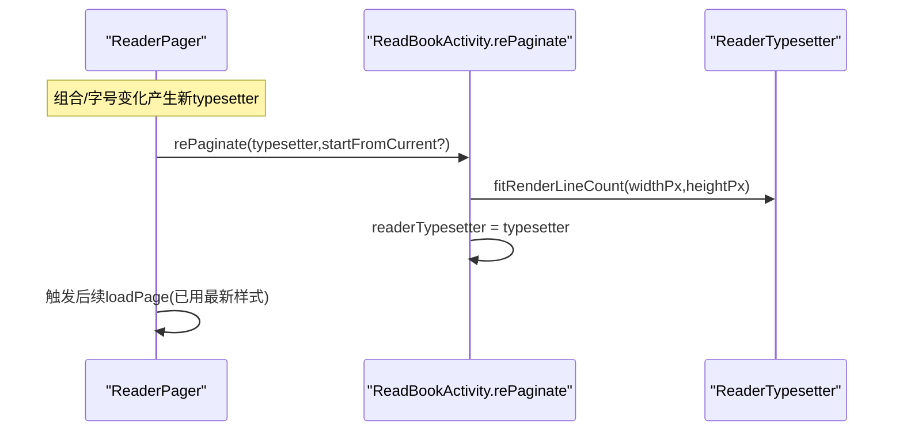
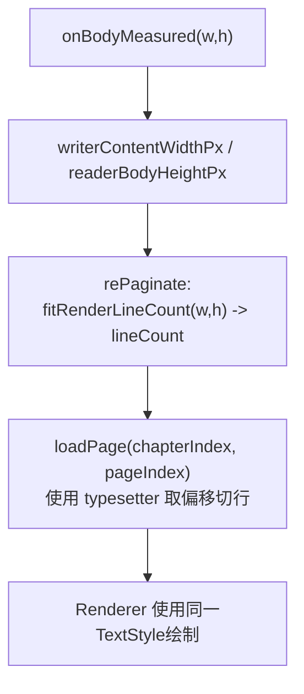
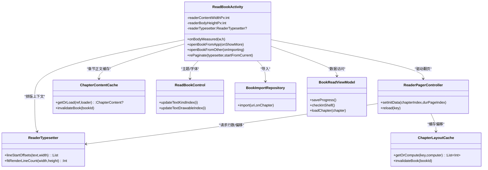
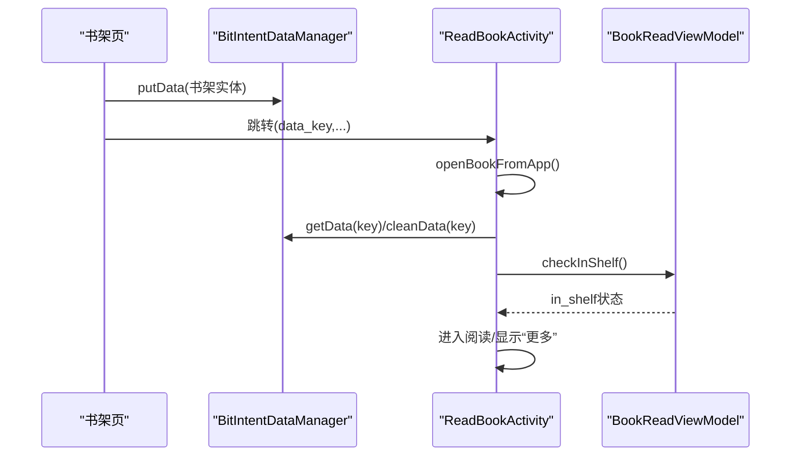
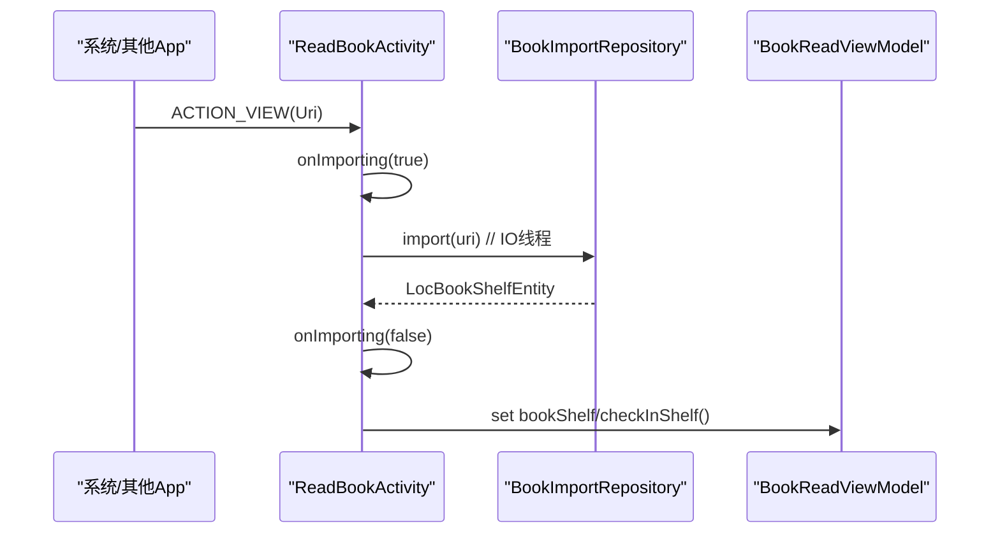

# 阅读活动

<cite>
**本文引用的文件**
- [ReadBookActivity.kt](file://module_book/src/main/java/com/ebook/book/ReadBookActivity.kt)
- [ReaderTypesetter.kt](file://module_book/src/main/java/com/ebook/book/reader/ReaderTypesetter.kt)
- [ReaderPager.kt](file://module_book/src/main/java/com/ebook/book/reader/ReaderPager.kt)
- [ChapterLayoutCache.kt](file://module_book/src/main/java/com/ebook/book/reader/ChapterLayoutCache.kt)
- [ReadBookControl.kt](file://module_book/src/main/java/com/ebook/book/view/ReadBookControl.kt)
- [BookImportRepository.kt](file://module_book/src/main/java/com/ebook/book/repository/BookImportRepository.kt)
- [BitIntentDataManager.kt](file://module_book/src/main/java/com/ebook/book/manager/BitIntentDataManager.kt)
- [BookShelfPage.kt](file://module_book/src/main/java/com/ebook/book/page/BookShelfPage.kt)
- [ChapterContentCache.kt](file://lib_book_common/src/main/java/com/ebook/common/store/ChapterContentCache.kt)
- [BookReadViewModel.kt](file://module_book/src/main/java/com/ebook/book/mvvm/viewmodel/BookReadViewModel.kt)
- [0012-reader-full-light-theme-and-catalog-fast-scroll.md](file://docs/adr/0012-reader-full-light-theme-and-catalog-fast-scroll.md)
</cite>

## 目录
1. [简介](#简介)
2. [项目结构](#项目结构)
3. [核心组件](#核心组件)
4. [架构总览](#架构总览)
5. [关键组件详解](#关键组件详解)
6. [依赖关系分析](#依赖关系分析)
7. [性能考量](#性能考量)
8. [故障排查指南](#故障排查指南)
9. [结论](#结论)
10. [附录：初始化与打开流程图](#附录：初始化与打开流程图)

## 简介
本文聚焦阅读活动的宿主 ReadBookActivity，系统阐述其在阅读器中的职责与实现：启动初始化（进度保存、亮度恢复）、书籍打开机制（应用内打开与应用外导入及归属检查）、排版生命周期（ReaderTypesetter 创建与同步）、尺寸测量回调到分页计算的数据流、主题定制（阅读背景、豁免系统深色模式），以及与 ViewModel、仓库、权限等的集成。文末提供完整的流程图、错误处理策略与调试指南。

## 项目结构
阅读页位于 module_book，主要参与方包括：
- 宿主：ReadBookActivity（Compose 版 Activity，组织翻页、菜单面板、数据加载与状态管理）
- 排版：ReaderTypesetter（排版上下文，提供行偏移与行数测算）
- 渲染与翻页：ReaderPager/ReaderPagerController（三页窗口状态机）
- 缓存：ChapterLayoutCache（同章重排优化）、ChapterContentCache（章节正文内存缓存）
- 控制与持久化：ReadBookControl（字体/背景/交互偏好）、SharedPreferences
- 数据入口：BitIntentDataManager（跨页面大对象传递）、BookImportRepository（外部 Uri 导入）、BookReadViewModel（数据访问与业务编排）
- 书架入口：BookShelfPage 将书架实体通过 BitIntentDataManager 传递给 ReadBookActivity

图表来源
- [BookShelfPage.kt:159-163](file://module_book/src/main/java/com/ebook/book/page/BookShelfPage.kt#L159-L163)
- [BitIntentDataManager.kt:28-41](file://module_book/src/main/java/com/ebook/book/manager/BitIntentDataManager.kt#L28-L41)
- [ReadBookActivity.kt:151-195](file://module_book/src/main/java/com/ebook/book/ReadBookActivity.kt#L151-L195)
- [BookReadViewModel.kt:30-60](file://module_book/src/main/java/com/ebook/book/mvvm/viewmodel/BookReadViewModel.kt#L30-L60)
- [ReaderPager.kt:112-200](file://module_book/src/main/java/com/ebook/book/reader/ReaderPager.kt#L112-L200)
- [ReaderTypesetter.kt:28-81](file://module_book/src/main/java/com/ebook/book/reader/ReaderTypesetter.kt#L28-L81)
- [ChapterLayoutCache.kt:21-49](file://module_book/src/main/java/com/ebook/book/reader/ChapterLayoutCache.kt#L21-L49)
- [ReadBookControl.kt:53-104](file://module_book/src/main/java/com/ebook/book/view/ReadBookControl.kt#L53-L104)
- [BookImportRepository.kt:23-41](file://module_book/src/main/java/com/ebook/book/repository/BookImportRepository.kt#L23-L41)

章节来源
- [BookShelfPage.kt:159-163](file://module_book/src/main/java/com/ebook/book/page/BookShelfPage.kt#L159-L163)
- [BitIntentDataManager.kt:24-43](file://module_book/src/main/java/com/ebook/book/manager/BitIntentDataManager.kt#L24-L43)
- [ReadBookActivity.kt:92-135](file://module_book/src/main/java/com/ebook/book/ReadBookActivity.kt#L92-L135)

## 核心组件
- ReadBookActivity：宿主 UI 与启动流程、体积测量、排版参数落定、打开路径分流（应用内/应用外）
- ReaderTypesetter：分页与渲染的“唯一真相源”，以 Compose TextMeasurer/Density 产出断行与行数；提供 fitRenderLineCount 与 lineStartOffsets
- ReaderPager/ReaderPagerController：三页窗口、去重加载、动画与回退收敛
- ChapterLayoutCache：同章按（内容定位符、字号、宽度）缓存排版偏移，避免重复 O(章长) 重排
- ChapterContentCache：章节正文内存缓存，覆盖当前章与前后各一，减少 IO 开销
- ReadBookControl：字体族、背景主题、点击/按键翻页开关，SP 持久化，内存缓存
- BookImportRepository：外部 Uri 转本地临时文件后交由 LocalBookImporter 解析导入
- BookReadViewModel：进度保存、归属检查、统一章节读取、下载任务编排
- BitIntentDataManager：解决大对象经 Intent 传输 Binder 容量限制的问题

章节来源
- [ReadBookActivity.kt:102-124](file://module_book/src/main/java/com/ebook/book/ReadBookActivity.kt#L102-L124)
- [ReaderTypesetter.kt:28-136](file://module_book/src/main/java/com/ebook/book/reader/ReaderTypesetter.kt#L28-L136)
- [ReaderPager.kt:64-200](file://module_book/src/main/java/com/ebook/book/reader/ReaderPager.kt#L64-L200)
- [ChapterLayoutCache.kt:21-49](file://module_book/src/main/java/com/ebook/book/reader/ChapterLayoutCache.kt#L21-L49)
- [ChapterContentCache.kt:21-58](file://lib_book_common/src/main/java/com/ebook/common/store/ChapterContentCache.kt#L21-L58)
- [ReadBookControl.kt:9-121](file://module_book/src/main/java/com/ebook/book/view/ReadBookControl.kt#L9-L121)
- [BookImportRepository.kt:23-41](file://module_book/src/main/java/com/ebook/book/repository/BookImportRepository.kt#L23-L41)
- [BookReadViewModel.kt:21-105](file://module_book/src/main/java/com/ebook/book/mvvm/viewmodel/BookReadViewModel.kt#L21-L105)

## 架构总览
阅读页由宿主负责“组装与调度”：它负责把从不同入口传来的书籍信息装配为可阅读状态，驱动 ViewModel 做数据准备（进度、归属检查、下载入口等），组合 ReaderPager 进行三页渲染，并通过 ReaderTypesetter 保证“测得出来=排得出=画得出”的一致性。主题方面通过 ReadBookControl 提供独立的阅读背景主题并豁免系统深色模式；布局通过 onSizeChanged 拿到测量值，作为分页输入。

图表来源
- [BookShelfPage.kt:159-163](file://module_book/src/main/java/com/ebook/book/page/BookShelfPage.kt#L159-L163)
- [ReadBookActivity.kt:151-195](file://module_book/src/main/java/com/ebook/book/ReadBookActivity.kt#L151-L195)
- [BookReadViewModel.kt:55-60](file://module_book/src/main/java/com/ebook/book/mvvm/viewmodel/BookReadViewModel.kt#L55-L60)
- [ReaderTypesetter.kt:52-81](file://module_book/src/main/java/com/ebook/book/reader/ReaderTypesetter.kt#L52-L81)
- [ChapterLayoutCache.kt:21-35](file://module_book/src/main/java/com/ebook/book/reader/ChapterLayoutCache.kt#L21-L35)

## 关键组件详解

### ReadBookActivity 初始化流程
- 启动即保存一次进度：确保异常退出不会丢失位置
- 恢复手动亮度：应用级持久化亮度在窗口重建时恢复
- 接收数据：
  - 应用内打开：从 BitIntentDataManager 取书架实体，非本地书触发“更多”入口展示，再执行归属检查
  - 应用外打开：从 Intent data 获取 Uri，写入导入中提示，IO 线程调用 BookImportRepository.import 完成后设置 bookShelf 并归属检查
- 排版相关：
  - onBodyMeasured 记录 readerContentWidthPx 与 readerBodyHeightPx
  - rePaginate(typesetter, startFromCurrent)：依据当前 typesetter 和实测尺寸，先算行数，再写活 readerTypesetter，随后 loadPage 会使用最新样式切分文本，避免“测与画”不一致

图表来源
- [ReadBookActivity.kt:130-141](file://module_book/src/main/java/com/ebook/book/ReadBookActivity.kt#L130-L141)
- [ReadBookActivity.kt:151-195](file://module_book/src/main/java/com/ebook/book/ReadBookActivity.kt#L151-L195)
- [ReadBookActivity.kt:249-256](file://module_book/src/main/java/com/ebook/book/ReadBookActivity.kt#L249-L256)

章节来源
- [ReadBookActivity.kt:130-195](file://module_book/src/main/java/com/ebook/book/ReadBookActivity.kt#L130-L195)

### 书籍打开机制对比

| 特性 | 应用内打开 (openBookFromApp) | 应用外打开 (openBookFromOther) |
|---|---|---|
| 数据来源 | BitIntentDataManager 中的 BookShelfEntity | Intent.data Uri → BookImportRepository.import |
| 处理主流程 | 快速失败保护（key 缺失/类型不符则提示并结束） | 协程+IO 线程导入，成功后回填 bookShelf |
| 本地/网络分支 | 若非本地书(tag!=LOCAL_TAG)，调用 onShowMore 提供下载入口 | 仅本地导入（TXT/EPUB） |
| 归属检查 | 立即 viewModel.checkInShelf() | 导入成功后再 checkInShelf() |
| 失败反馈 | Toast “reader_load_failed” | Toast “text_open_failed” |

章节来源
- [ReadBookActivity.kt:151-195](file://module_book/src/main/java/com/ebook/book/ReadBookActivity.kt#L151-L195)
- [BookImportRepository.kt:23-41](file://module_book/src/main/java/com/ebook/book/repository/BookImportRepository.kt#L23-L41)

### ReaderTypesetter 生命周期与排版同步
- 作用域与创建：Composable 内部使用 rememberReaderTypesetter 生成（携带当前 textSizeSp、lineHeight、Density），用于“分页与渲染同源”
- 重排时机：
  - 初次组合/首次尺寸就绪：rePaginate(typesetter, false) 先算行数，随后 loadPage
  - 用户改变字号/行高：重新生成新的 ReaderTypesetter 并 rePaginate(startFromCurrent=true) 重置窗口
- 同步机制：rePaginate 先把 measured width/height 换算出 lineCount，再把 typesetter 赋值给 Activity.readerTypesetter，使后续 loadPage 切分与渲染共用同一份样式

图表来源
- [ReaderTypesetter.kt:106-113](file://module_book/src/main/java/com/ebook/book/reader/ReaderTypesetter.kt#L106-L113)
- [ReaderTypesetter.kt:28-81](file://module_book/src/main/java/com/ebook/book/reader/ReaderTypesetter.kt#L28-L81)
- [ReadBookActivity.kt:249-256](file://module_book/src/main/java/com/ebook/book/ReadBookActivity.kt#L249-L256)

章节来源
- [ReaderTypesetter.kt:28-136](file://module_book/src/main/java/com/ebook/book/reader/ReaderTypesetter.kt#L28-L136)
- [ReadBookActivity.kt:249-256](file://module_book/src/main/java/com/ebook/book/ReadBookActivity.kt#L249-L256)

### 尺寸测量回调与分页数据流
- readerContentWidthPx：来自 onBodyMeasured，决定断行宽度（TextMeasurer maxWidth）
- readerBodyHeightPx：同上，用于 fitRenderLineCount 判断能放多少行
- 流向：UI 测量 → Activity 字段 → rePaginate 得到 lineCount → loadPage 根据 lineCount 截取原文子串（借助 lineStartOffsets 的偏移）→ Renderer 用相同 TextStyle 画出完全一致的行
- 关键点：禁止在 Loading/Loaded 切换时有高度占位差，否则测算与渲染会错位

图表来源
- [ReadBookActivity.kt:137-141](file://module_book/src/main/java/com/ebook/book/ReadBookActivity.kt#L137-L141)
- [ReadBookActivity.kt:249-256](file://module_book/src/main/java/com/ebook/book/ReadBookActivity.kt#L249-L256)
- [ReaderTypesetter.kt:52-81](file://module_book/src/main/java/com/ebook/book/reader/ReaderTypesetter.kt#L52-L81)

章节来源
- [ReadBookActivity.kt:137-256](file://module_book/src/main/java/com/ebook/book/ReadBookActivity.kt#L137-L256)

### 主题定制与深色模式豁免
- 阅读界面背景主题通过 ReadBookControl 管理（默认白/黄/绿/黑四种），支持持久化与内存缓存
- 阅读模块在宿主中豁免系统深色模式，单独作用域保持浅色主题，确保阅读背景主题不受系统影响（见 ADR-0012）
- 与字体大小、行高的配合：fontSize/lineHeight 变化时会重组新的 ReaderTypesetter 并重排

章节来源
- [ReadBookControl.kt:9-121](file://module_book/src/main/java/com/ebook/book/view/ReadBookControl.kt#L9-L121)
- [0012-reader-full-light-theme-and-catalog-fast-scroll.md:1-200](file://docs/adr/0012-reader-full-light-theme-and-catalog-fast-scroll.md#L1-L200)

### 与其他组件的集成
- ViewModel 交互：
  - updateProgress/saveProgress：记录当前位置并落库
  - checkInShelf/addToShelf：处理归属判定与添加到书架
  - loadChapter：统一本地/网络章节读取入口
- BookRepository：承载书架/下载/缓存等能力（loadChapter、saveProgress、getBookByUrl 等）
- 下载与权限：startDownload 先入库再启动前台服务，若被系统拒绝则提示；与 ADR-0018 的前台服务/dataSync 配额约束对齐
- 进程间/页面间大对象：BitIntentDataManager 避免 Intent extra 过大导致 TransactionTooLargeException

章节来源
- [BookReadViewModel.kt:30-105](file://module_book/src/main/java/com/ebook/book/mvvm/viewmodel/BookReadViewModel.kt#L30-L105)
- [BitIntentDataManager.kt:24-43](file://module_book/src/main/java/com/ebook/book/manager/BitIntentDataManager.kt#L24-L43)

## 依赖关系分析

图表来源
- [ReadBookActivity.kt:102-124](file://module_book/src/main/java/com/ebook/book/ReadBookActivity.kt#L102-L124)
- [ReaderTypesetter.kt:28-81](file://module_book/src/main/java/com/ebook/book/reader/ReaderTypesetter.kt#L28-L81)
- [ReaderPager.kt:112-200](file://module_book/src/main/java/com/ebook/book/reader/ReaderPager.kt#L112-L200)
- [ChapterLayoutCache.kt:21-49](file://module_book/src/main/java/com/ebook/book/reader/ChapterLayoutCache.kt#L21-L49)
- [ChapterContentCache.kt:21-58](file://lib_book_common/src/main/java/com/ebook/common/store/ChapterContentCache.kt#L21-L58)
- [ReadBookControl.kt:53-104](file://module_book/src/main/java/com/ebook/book/view/ReadBookControl.kt#L53-L104)
- [BookImportRepository.kt:23-41](file://module_book/src/main/java/com/ebook/book/repository/BookImportRepository.kt#L23-L41)
- [BookReadViewModel.kt:30-105](file://module_book/src/main/java/com/ebook/book/mvvm/viewmodel/BookReadViewModel.kt#L30-L105)

## 性能考量
- 排版缓存：ChapterLayoutCache 以（contentRef、fontSizeSp、widthPx）为键缓存整章偏移，避免同章每页重排；容量约“当前章+前后两章”的双屏余量
- 正文缓存：ChapterContentCache 容量为3，避免多页并发拉同一章导致的开闭/解码风暴
- 测量器无缓存：rememberTextMeasurer 关闭缓存以避免并发场景下的内部状态问题
- 首屏重排成本：线起始偏移计算是 O(章长)，因此尽量复用缓存并在换字号/宽度时才重排

章节来源
- [ChapterLayoutCache.kt:21-49](file://module_book/src/main/java/com/ebook/book/reader/ChapterLayoutCache.kt#L21-L49)
- [ChapterContentCache.kt:21-58](file://lib_book_common/src/main/java/com/ebook/common/store/ChapterContentCache.kt#L21-L58)
- [ReaderTypesetter.kt:34-40](file://module_book/src/main/java/com/ebook/book/reader/ReaderTypesetter.kt#L34-L40)
- [ReaderTypesetter.kt:97-105](file://module_book/src/main/java/com/ebook/book/reader/ReaderTypesetter.kt#L97-L105)

## 故障排查指南
- 进入阅读页空白且无提示
  - 现象：intent.data_key 缺失或类型不匹配
  - 排查：确认上游是否放入 BitIntentDataManager 并传递 data_key；ReadBookActivity.openBookFromApp 会直接 finish，需查看日志与 Toast
  - 参考：openBookFromApp 快速失败分支
- 翻页时上下页文字接不上
  - 现象：切行与渲染不一致导致某行被裁掉或跳行
  - 排查：确认 onBodyMeasured 确实更新了 readerContentWidthPx/readerBodyHeightPx；rePaginate 是否在字号变化后再次调用；避免加载中/已加载占位高度不一致
- 改字号后页数不变但错位
  - 现象：未触发重排，排版结果仍是旧样式
  - 排查：确认每次字号/行高变化都组合出新的 ReaderTypesetter 且调用了 rePaginate(true/false)
- 导入失败或导入后无法阅读
  - 现象：外部 Uri 无法解析或无对应 Reader
  - 排查：观察 import 异常提示；确认导入成功后再 checkInShelf；注意只有支持 TXT/EPUB 的来源才可成功
- 下载不可用或被系统限制
  - 现象：startForegroundService 被拒或前台服务配额耗尽
  - 排查：按 ADR-0018 走 DownloadService.start 封装；先入库再起服务；遇到限制给出提示

章节来源
- [ReadBookActivity.kt:151-195](file://module_book/src/main/java/com/ebook/book/ReadBookActivity.kt#L151-L195)
- [ReadBookActivity.kt:249-256](file://module_book/src/main/java/com/ebook/book/ReadBookActivity.kt#L249-L256)
- [BookReadViewModel.kt:73-90](file://module_book/src/main/java/com/ebook/book/mvvm/viewmodel/BookReadViewModel.kt#L73-L90)

## 结论
ReadBookActivity 作为阅读器的宿主，承担启动初始化、书籍打开分流、测量与排版同步、主题配置以及跨模块集成的核心职责。通过 ReaderTypesetter 保障“测、排、画”三者一致性；通过 ChapterLayoutCache 与 ChapterContentCache 大幅降低重复代价；通过 ReadBookControl 与宿主主题策略提供独立阅读体验。该体系在保证稳定性的同时具备良好的扩展性，适合在后续演进中进一步增加性能监控与自动化测试用例。

## 附录：初始化与打开流程图

### 应用内打开流程

图表来源
- [BookShelfPage.kt:159-163](file://module_book/src/main/java/com/ebook/book/page/BookShelfPage.kt#L159-L163)
- [BitIntentDataManager.kt:28-41](file://module_book/src/main/java/com/ebook/book/manager/BitIntentDataManager.kt#L28-L41)
- [ReadBookActivity.kt:151-172](file://module_book/src/main/java/com/ebook/book/ReadBookActivity.kt#L151-L172)
- [BookReadViewModel.kt:55-60](file://module_book/src/main/java/com/ebook/book/mvvm/viewmodel/BookReadViewModel.kt#L55-L60)

### 应用外打开流程

图表来源
- [ReadBookActivity.kt:178-195](file://module_book/src/main/java/com/ebook/book/ReadBookActivity.kt#L178-L195)
- [BookImportRepository.kt:23-41](file://module_book/src/main/java/com/ebook/book/repository/BookImportRepository.kt#L23-L41)