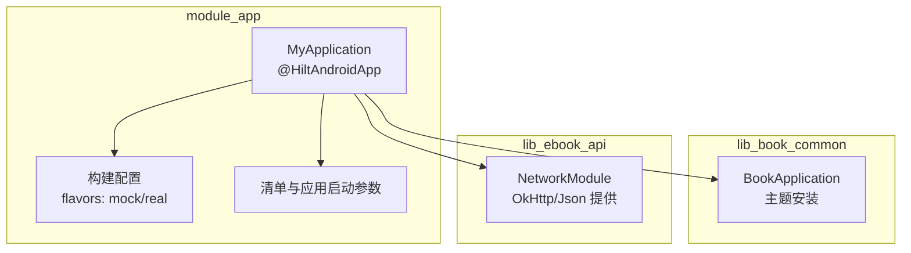
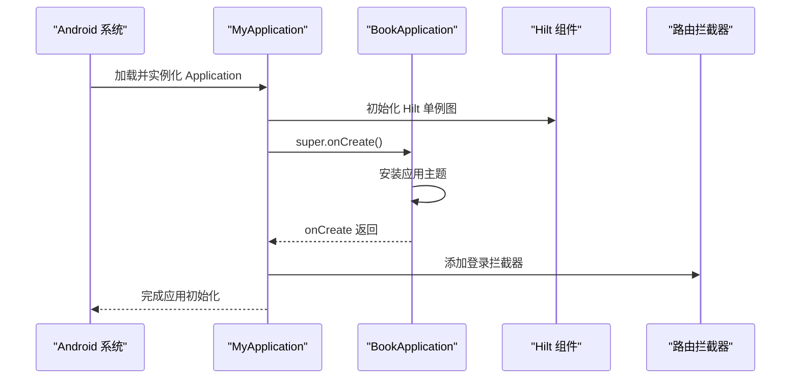
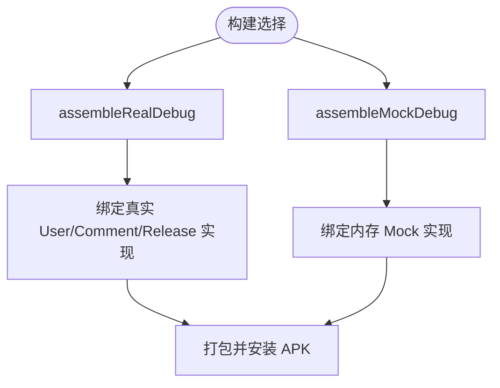
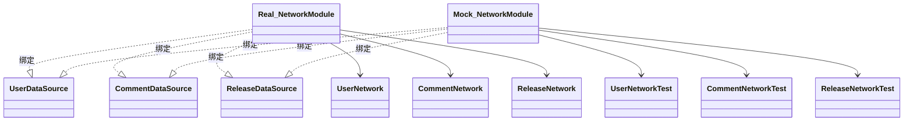
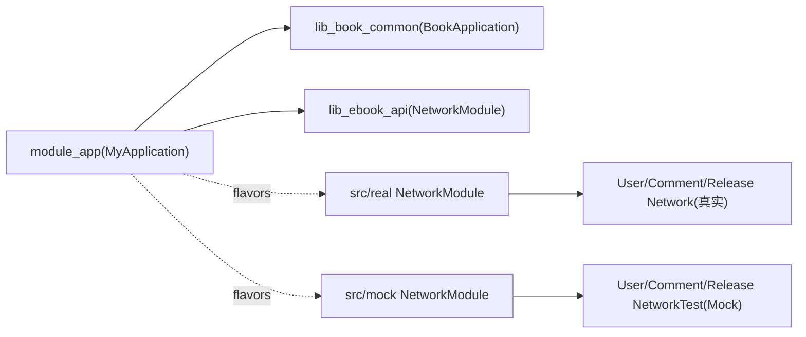

# 应用模块 (module_app)

<cite>
**本文引用的文件**
- [module_app/MyApplication.kt](file://module_app/src/main/java/com/ebook/MyApplication.kt)
- [module_app/build.gradle.kts](file://module_app/build.gradle.kts)
- [lib_book_common/BookApplication.kt](file://lib_book_common/src/main/java/com/ebook/common/BookApplication.kt)
- [module_app/NetworkModule(real).kt](file://module_app/src/real/java/com/ebook/di/NetworkModule.kt)
- [module_app/NetworkModule(mock).kt](file://module_app/src/mock/java/com/ebook/di/NetworkModule.kt)
- [lib_ebook_api/NetworkModule.kt](file://lib_ebook_api/src/main/java/com/ebook/api/utils/NetworkModule.kt)
- [module_app/AndroidManifest.xml](file://module_app/src/main/AndroidManifest.xml)
- [HiltConventionPlugin.kt](file://build-logic/convention/src/main/kotlin/HiltConventionPlugin.kt)
- [AndroidComponentConventionPlugin.kt](file://build-logic/convention/src/main/kotlin/AndroidComponentConventionPlugin.kt)
</cite>

## 目录
1. [简介](#简介)
2. [项目结构](#项目结构)
3. [核心组件](#核心组件)
4. [架构总览](#架构总览)
5. [详细组件分析](#详细组件分析)
6. [依赖关系分析](#依赖关系分析)
7. [性能与可用性考量](#性能与可用性考量)
8. [故障排查指南](#故障排查指南)
9. [结论](#结论)

## 简介
本章节聚焦 module_app，说明 Android 应用入口 MyApplication、Hilt 初始化装配点、基于 flavor network（mock/real）的构建与网络层切换策略、各功能模块集成方式，以及应用级配置（主题安装、路由拦截等）。目标是让开发者在不深入代码的情况下快速理解应用整体组装与运行流程。

## 项目结构
module_app 作为 Android Application 工程，负责：
- 声明 Application、主题和网络安全策略
- 通过 Hilt 启用依赖注入
- 按 productFlavor 选择网络实现（mock/real）
- 在运行时挂载登录拦截器与业务模块

图表来源
- [module_app/MyApplication.kt:1-15](file://module_app/src/main/java/com/ebook/MyApplication.kt#L1-L15)
- [lib_book_common/BookApplication.kt:1-16](file://lib_book_common/src/main/java/com/ebook/common/BookApplication.kt#L1-L16)
- [lib_ebook_api/NetworkModule.kt:19-72](file://lib_ebook_api/src/main/java/com/ebook/api/utils/NetworkModule.kt#L19-L72)
- [module_app/build.gradle.kts:17-25](file://module_app/build.gradle.kts#L17-L25)

章节来源
- [module_app/build.gradle.kts:1-45](file://module_app/build.gradle.kts#L1-L45)
- [module_app/src/main/AndroidManifest.xml:31-43](file://module_app/src/main/AndroidManifest.xml#L31-L43)

## 核心组件
- 应用入口：MyApplication，继承 BookApplication，标记 @HiltAndroidApp，并在 onCreate 中注册路由登录拦截器
- 基类应用：BookApplication，统一安装主题（深浅色与动态取色）
- 网络绑定：NetworkModule 在 mock 与 real 两个 flavor 源集分别绑定不同 DataSource
- 网络基础：lib_ebook_api 的 NetworkModule 提供 Json、AuthAllowedHosts、书源客户端、发布检查客户端

章节来源
- [module_app/MyApplication.kt:8-14](file://module_app/src/main/java/com/ebook/MyApplication.kt#L8-L14)
- [lib_book_common/BookApplication.kt:7-15](file://lib_book_common/src/main/java/com/ebook/common/BookApplication.kt#L7-L15)
- [module_app/src/real/java/com/ebook/di/NetworkModule.kt:24-35](file://module_app/src/real/java/com/ebook/di/NetworkModule.kt#L24-L35)
- [module_app/src/mock/java/com/ebook/di/NetworkModule.kt:26-37](file://module_app/src/mock/java/com/ebook/di/NetworkModule.kt#L26-L37)
- [lib_ebook_api/NetworkModule.kt:19-72](file://lib_ebook_api/src/main/java/com/ebook/api/utils/NetworkModule.kt#L19-L72)

## 架构总览
应用启动时，Android 容器加载 manifest 指定的 Application，创建 Hilt 组件并装配全局对象；随后执行 BookApplication.onCreate 安装 UI 主题，MyApplication.onCreate 挂载路由登录拦截器。模块依赖关系如下：

图表来源
- [module_app/src/main/AndroidManifest.xml:31-43](file://module_app/src/main/AndroidManifest.xml#L31-L43)
- [lib_book_common/BookApplication.kt:7-15](file://lib_book_common/src/main/java/com/ebook/common/BookApplication.kt#L7-L15)
- [module_app/MyApplication.kt:8-14](file://module_app/src/main/java/com/ebook/MyApplication.kt#L8-L14)

## 详细组件分析

### 应用入口与生命周期装配
- MyApplication 为 @HiltAndroidApp，承担 Hilt 根组件作用域
- 继承 BookApplication，确保主题在应用级别统一生效
- 在 onCreate 中加入路由拦截器 LoginInterceptor，统一在未登录时对需登录的路由进行跳转处理
- 清单指定 application 为 com.ebook.MyApplication，同时开启网络明文访问与安全配置文件项，便于调试与服务端联调

章节来源
- [module_app/MyApplication.kt:8-14](file://module_app/src/main/java/com/ebook/MyApplication.kt#L8-L14)
- [lib_book_common/BookApplication.kt:7-15](file://lib_book_common/src/main/java/com/ebook/common/BookApplication.kt#L7-L15)
- [module_app/src/main/AndroidManifest.xml:31-43](file://module_app/src/main/AndroidManifest.xml#L31-L43)
- [lib_book_common/src/main/java/com/ebook/common/interceptor/LoginInterceptor.kt:14-42](file://lib_book_common/src/main/java/com/ebook/common/interceptor/LoginInterceptor.kt#L14-L42)

### Hilt 依赖注入初始化
- Hilt 由约定插件自动为 android application/module 注入 hilt.android 依赖并启用 KSP
- @HiltAndroidApp 注解使 Hilt 在 MyApplication 处生成所需代码
- 全局对象通过 @InstallIn(SingletonComponent::class) 的 Module 提供

章节来源
- [HiltConventionPlugin.kt:24-48](file://build-logic/convention/src/main/kotlin/HiltConventionPlugin.kt#L24-L48)
- [module_app/MyApplication.kt:8-9](file://module_app/src/main/java/com/ebook/MyApplication.kt#L8-L9)
- [module_app/src/real/java/com/ebook/di/NetworkModule.kt:24-35](file://module_app/src/real/java/com/ebook/di/NetworkModule.kt#L24-L35)
- [module_app/src/mock/java/com/ebook/di/NetworkModule.kt:26-37](file://module_app/src/mock/java/com/ebook/di/NetworkModule.kt#L26-L37)

### Product Flavor 差异化构建策略（mock/real）
- 定义 dimension 为 network，并包含 mock 与 real 两种 flavor
- mock flavor 追加 applicationIdSuffix，便于与真实包名并存安装
- 通过该 source set 机制，在不同 flavor 下编译对应的 NetworkModule，实现服务端的“真实后端”与“内存 Mock”无缝切换
- 可分别构建不同变体以适配开发与调试需求

图表来源
- [module_app/build.gradle.kts:17-25](file://module_app/build.gradle.kts#L17-L25)
- [module_app/src/real/java/com/ebook/di/NetworkModule.kt:14-35](file://module_app/src/real/java/com/ebook/di/NetworkModule.kt#L14-L35)
- [module_app/src/mock/java/com/ebook/di/NetworkModule.kt:14-37](file://module_app/src/mock/java/com/ebook/di/NetworkModule.kt#L14-L37)

章节来源
- [module_app/build.gradle.kts:17-25](file://module_app/build.gradle.kts#L17-L25)
- [module_app/src/real/java/com/ebook/di/NetworkModule.kt:14-35](file://module_app/src/real/java/com/ebook/di/NetworkModule.kt#L14-L35)
- [module_app/src/mock/java/com/ebook/di/NetworkModule.kt:14-37](file://module_app/src/mock/java/com/ebook/di/NetworkModule.kt#L14-L37)

### 网络层模块化切换机制
- 通过同名的 NetworkModule 接口分别在 real 和 mock flavor 源码集中提供不同的绑定，Hilt 会在相应构建变体中选择其中一个
- 在 lib_ebook_api 的 NetworkModule 中提供统一的 OkHttp 客户端、JSON、白名单 host 及专用客户端（书源、发布检查）
- 这样上层只需要依赖 DataSource 接口，无需感知后端地址或测试数据切换

图表来源
- [module_app/src/real/java/com/ebook/di/NetworkModule.kt:24-35](file://module_app/src/real/java/com/ebook/di/NetworkModule.kt#L24-L35)
- [module_app/src/mock/java/com/ebook/di/NetworkModule.kt:26-37](file://module_app/src/mock/java/com/ebook/di/NetworkModule.kt#L26-L37)

章节来源
- [module_app/src/real/java/com/ebook/di/NetworkModule.kt:24-35](file://module_app/src/real/java/com/ebook/di/NetworkModule.kt#L24-L35)
- [module_app/src/mock/java/com/ebook/di/NetworkModule.kt:26-37](file://module_app/src/mock/java/com/ebook/di/NetworkModule.kt#L26-L37)
- [lib_ebook_api/NetworkModule.kt:19-72](file://lib_ebook_api/src/main/java/com/ebook/api/utils/NetworkModule.kt#L19-L72)

### 模块集成与独立构建
- module_app 默认集成所有功能模块（main/find/me/book/login）
- 当 isModule=true 时，约定插件将应用的 Manifest 切换为 src/main/module/AndroidManifest.xml，并将 Kotlin 源码目录改为 src/main/test
- 这使各功能模块可按独立 App 运行（用于模块内开发验证），而不改变 module_app 的依赖关系

章节来源
- [module_app/build.gradle.kts:47-63](file://module_app/build.gradle.kts#L47-L63)
- [AndroidComponentConventionPlugin.kt:10-32](file://build-logic/convention/src/main/kotlin/AndroidComponentConventionPlugin.kt#L10-L32)

## 依赖关系分析

图表来源
- [module_app/MyApplication.kt:1-15](file://module_app/src/main/java/com/ebook/MyApplication.kt#L1-L15)
- [lib_book_common/BookApplication.kt:1-16](file://lib_book_common/src/main/java/com/ebook/common/BookApplication.kt#L1-L16)
- [module_app/src/real/java/com/ebook/di/NetworkModule.kt:24-35](file://module_app/src/real/java/com/ebook/di/NetworkModule.kt#L24-L35)
- [module_app/src/mock/java/com/ebook/di/NetworkModule.kt:26-37](file://module_app/src/mock/java/com/ebook/di/NetworkModule.kt#L26-L37)
- [lib_ebook_api/NetworkModule.kt:19-72](file://lib_ebook_api/src/main/java/com/ebook/api/utils/NetworkModule.kt#L19-L72)

章节来源
- [module_app/build.gradle.kts:47-63](file://module_app/build.gradle.kts#L47-L63)

## 性能与可用性考量
- 主题在应用级一次性安装，避免重复包裹带来的 Compose 性能开销
- 通过 Hilt 的 Singleton 提供 OkHttp、Json 等昂贵资源，减少重复构建
- 使用 @Named("source") 的书源专用客户端隔离认证头，降低不必要的鉴权校验开销
- 发布检查使用专用客户端，与书源请求链路解耦，便于独立优化超时与缓存策略

[本节为通用建议，不直接分析具体文件]

## 故障排查指南
- 如果未登录却仍可跳转到需登录页面，优先检查是否已在 onCreate 正确注册路由拦截器，以及目标跳转是否传了 needLogin 标志位
- 若 mock 环境下无法连接后端或服务报错，确认当前构建变体是否为 mock flavor；反之亦然
- 若登录后仍频繁触发登录拦截或出现会话不一致，核查会话持久化是否与拦截器的登录态来源一致（见约定文档中的用户会话镜像要求）
- 若遇到 OkHttp 超时或编码异常，检查对应 Named 客户端是否被错误复用（如发布检查不应复用书源客户端）

章节来源
- [module_app/MyApplication.kt:10-14](file://module_app/src/main/java/com/ebook/MyApplication.kt#L10-L14)
- [lib_book_common/src/main/java/com/ebook/common/interceptor/LoginInterceptor.kt:21-42](file://lib_book_common/src/main/java/com/ebook/common/interceptor/LoginInterceptor.kt#L21-L42)
- [lib_ebook_api/NetworkModule.kt:48-71](file://lib_ebook_api/src/main/java/com/ebook/api/utils/NetworkModule.kt#L48-L71)

## 结论
module_app 是应用的装配中心：通过 @HiltAndroidApp 与 Hilt 约定插件完成依赖注入初始化；通过 BookApplication 统一主题装配；通过 login 路由拦截器统一权限守卫；通过 productFlavor network 实现 mock/real 的网络实现无缝切换。该设计使得业务模块可以面向抽象（DataSource）编程，既保证本地离线开发的稳定性，又支持线上真实服务的平滑接入。