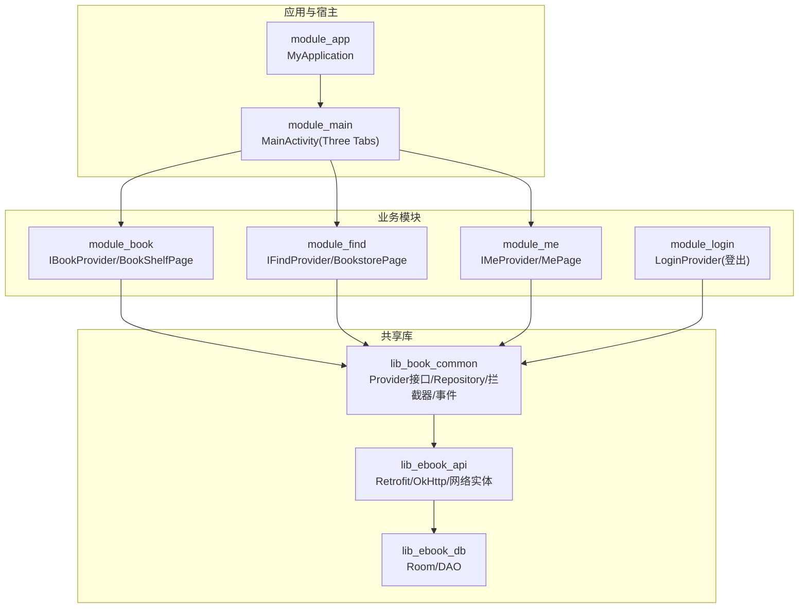
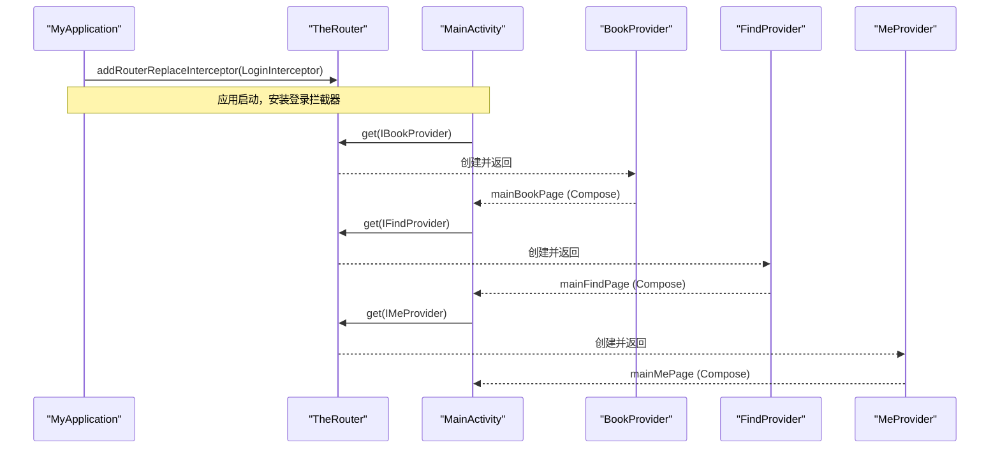
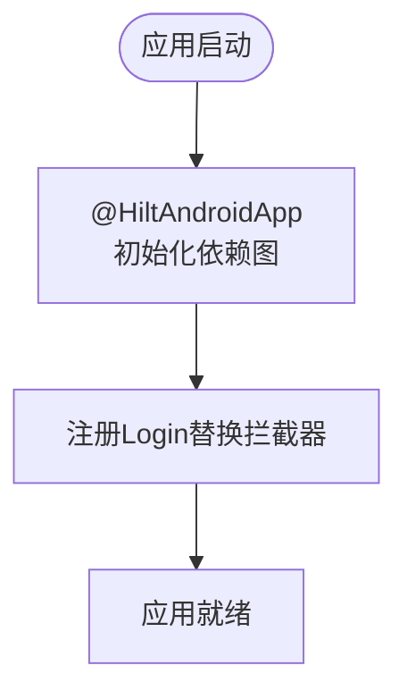
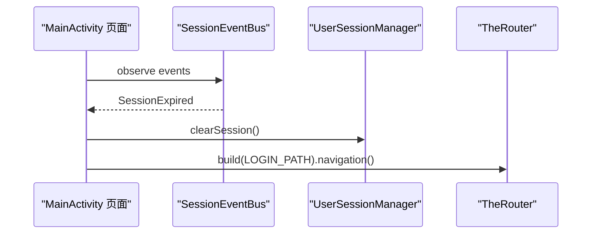
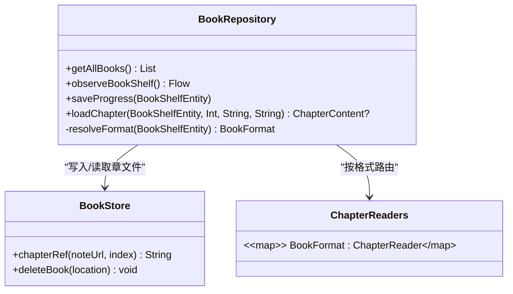
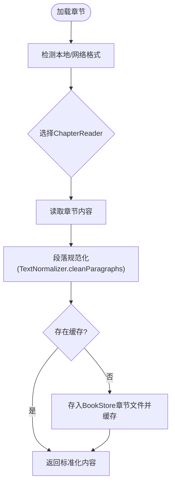
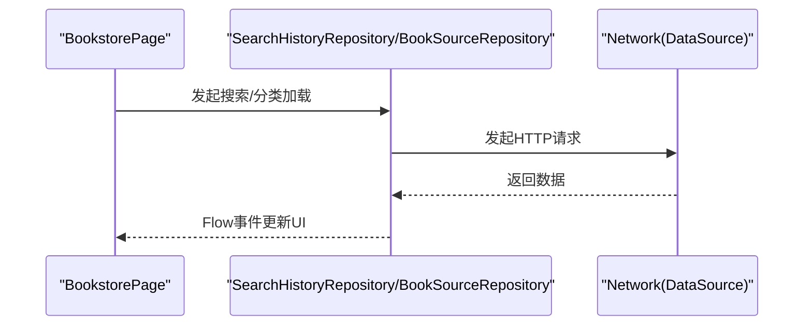
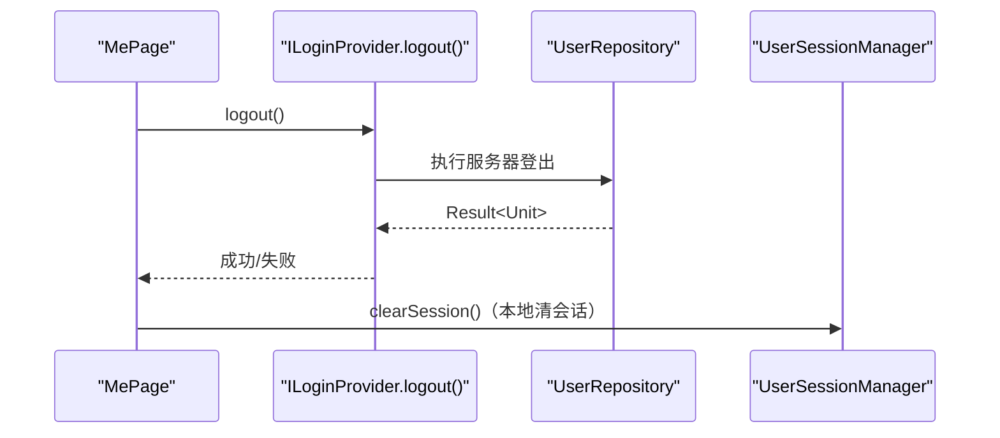
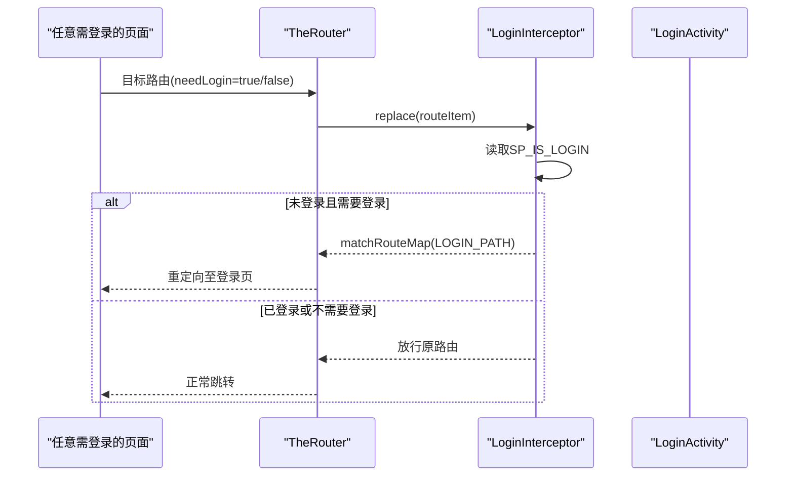
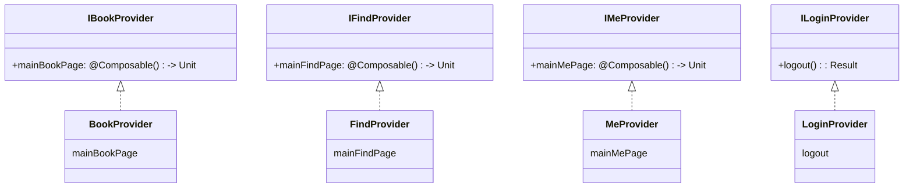

# 核心模块详解

<cite>
**本文引用的文件**   
- [module_app/src/main/java/com/ebook/MyApplication.kt](file://module_app/src/main/java/com/ebook/MyApplication.kt)
- [module_main/src/main/java/com/ebook/main/MainActivity.kt](file://module_main/src/main/java/com/ebook/main/MainActivity.kt)
- [lib_book_common/src/main/java/com/ebook/common/provider/IBookProvider.kt](file://lib_book_common/src/main/java/com/ebook/common/provider/IBookProvider.kt)
- [lib_book_common/src/main/java/com/ebook/common/provider/IFindProvider.kt](file://lib_book_common/src/main/java/com/ebook/common/provider/IFindProvider.kt)
- [lib_book_common/src/main/java/com/ebook/common/provider/IMeProvider.kt](file://lib_book_common/src/main/java/com/ebook/common/provider/IMeProvider.kt)
- [lib_book_common/src/main/java/com/ebook/common/provider/ILoginProvider.kt](file://lib_book_common/src/main/java/com/ebook/common/provider/ILoginProvider.kt)
- [module_book/src/main/java/com/ebook/book/provider/BookProvider.kt](file://module_book/src/main/java/com/ebook/book/provider/BookProvider.kt)
- [module_find/src/main/java/com/ebook/find/provider/FindProvider.kt](file://module_find/src/main/java/com/ebook/find/provider/FindProvider.kt)
- [module_me/src/main/java/com/ebook/me/provider/MeProvider.kt](file://module_me/src/main/java/com/ebook/me/provider/MeProvider.kt)
- [module_login/src/main/java/com/ebook/login/provider/LoginProvider.kt](file://module_login/src/main/java/com/ebook/login/provider/LoginProvider.kt)
- [lib_book_common/src/main/java/com/ebook/common/interceptor/LoginInterceptor.kt](file://lib_book_common/src/main/java/com/ebook/common/interceptor/LoginInterceptor.kt)
- [lib_book_common/src/main/java/com/ebook/common/repository/BookRepository.kt](file://lib_book_common/src/main/java/com/ebook/common/repository/BookRepository.kt)
- [module_app/build.gradle.kts](file://module_app/build.gradle.kts)
</cite>

## 目录
1. [简介](#简介)
2. [项目结构](#项目结构)
3. [核心组件](#核心组件)
4. [架构总览](#架构总览)
5. [详细组件解析](#详细组件解析)
6. [依赖分析](#依赖分析)
7. [性能考量](#性能考量)
8. [故障排查指南](#故障排查指南)
9. [结论](#结论)

## 简介
本文件面向Android小说阅读器的核心模块，系统性阐述模块职责、跨模块交互方式、Provider服务暴露与TheRouter路由机制，并通过类图、调用序列图和流程图给出代码级可视化说明。文档覆盖以下要点：
- module_app 作为应用入口的装配逻辑（Hilt + TheRouter）
- module_main 启动流程与主界面 Tab 导航
- module_book 阅读器能力、书籍管理与统一章节读取管线
- module_find 书城浏览与搜索机制
- module_me 个人中心与服务集成点
- module_login 登录/注册/会话校验（配合全局拦截器）
- 跨模块通过 Provider 接口解耦，路由走 TheRouter，避免直接模块间编译依赖

## 项目结构
整体采用“多业务模块 + 共享库”的分层组织：
- 应用入口：module_app
- 宿主与主容器：module_main（Tab 容器与 NavHost）
- 书业功能域：module_book（书架/阅读）、module_find（书城/搜索）
- 账户与用户域：module_login、module_me（个人设置）
- 共享契约与通用能力：lib_book_common（Provider 接口、领域仓库、拦截器、事件常量等）



**图示来源**
- [module_app/src/main/java/com/ebook/MyApplication.kt:8-14](file://module_app/src/main/java/com/ebook/MyApplication.kt#L8-L14)
- [module_main/src/main/java/com/ebook/main/MainActivity.kt:100-197](file://module_main/src/main/java/com/ebook/main/MainActivity.kt#L100-L197)
- [lib_book_common/src/main/java/com/ebook/common/provider/IBookProvider.kt:1-13](file://lib_book_common/src/main/java/com/ebook/common/provider/IBookProvider.kt#L1-L13)
- [lib_book_common/src/main/java/com/ebook/common/provider/IFindProvider.kt:1-13](file://lib_book_common/src/main/java/com/ebook/common/provider/IFindProvider.kt#L1-L13)
- [lib_book_common/src/main/java/com/ebook/common/provider/IMeProvider.kt:1-13](file://lib_book_common/src/main/java/com/ebook/common/provider/IMeProvider.kt#L1-L13)
- [lib_book_common/src/main/java/com/ebook/common/provider/ILoginProvider.kt:1-19](file://lib_book_common/src/main/java/com/ebook/common/provider/ILoginProvider.kt#L1-L19)

**章节来源**
- [module_app/src/main/java/com/ebook/MyApplication.kt:8-14](file://module_app/src/main/java/com/ebook/MyApplication.kt#L8-L14)
- [module_main/src/main/java/com/ebook/main/MainActivity.kt:100-197](file://module_main/src/main/java/com/ebook/main/MainActivity.kt#L100-L197)

## 核心组件
- 路由与拦截器：在应用初始化时注入 TheRouter 替换拦截器，用于登录鉴权与页面跳转重写
- Provider SPI：跨模块以 Composable () -> Unit 暴露页面，由宿主经 TheRouter 获取并组合
- MVVM 与 Repository：各功能通过 ViewModel 调用 lib_book_common 中的仓库，实现读写与事件发布
- Hilt 注入：Module 内按页面对应 ViewModel 注入仓库；Provider 通过 EntryPoint 桥接 Hilt 资源（如 UserRepositoryEntryPoint）

**章节来源**
- [module_app/src/main/java/com/ebook/MyApplication.kt:8-14](file://module_app/src/main/java/com/ebook/MyApplication.kt#L8-L14)
- [lib_book_common/src/main/java/com/ebook/common/provider/IBookProvider.kt:1-13](file://lib_book_common/src/main/java/com/ebook/common/provider/IBookProvider.kt#L1-L13)
- [module_login/src/main/java/com/ebook/login/provider/LoginProvider.kt:21-35](file://module_login/src/main/java/com/ebook/login/provider/LoginProvider.kt#L21-L35)

## 架构总览
- 入口组装：MyApplication 继承 BookApplication，添加登录替换拦截器，启用 TheRouter 安全访问控制
- 主页导航：MainActivity 使用 Navigation Compose，底部三个 Tab 路由到 IBookProvider/IFindProvider/IMeProvider 返回的 Composable 页面
- 跨模块解耦：模块之间只依赖接口，真实页面组件按需加载，减少耦合与构建成本
- 数据流：ViewModel → Repository → Room/API；状态通过 Flow/SharedFlow 驱动 UI



**图示来源**
- [module_app/src/main/java/com/ebook/MyApplication.kt:8-14](file://module_app/src/main/java/com/ebook/MyApplication.kt#L8-L14)
- [module_main/src/main/java/com/ebook/main/MainActivity.kt:186-194](file://module_main/src/main/java/com/ebook/main/MainActivity.kt#L186-L194)
- [module_book/src/main/java/com/ebook/book/provider/BookProvider.kt:8-14](file://module_book/src/main/java/com/ebook/book/provider/BookProvider.kt#L8-L14)
- [module_find/src/main/java/com/ebook/find/provider/FindProvider.kt:8-19](file://module_find/src/main/java/com/ebook/find/provider/FindProvider.kt#L8-L19)
- [module_me/src/main/java/com/ebook/me/provider/MeProvider.kt:8-20](file://module_me/src/main/java/com/ebook/me/provider/MeProvider.kt#L8-L20)

## 详细组件解析

### module_app：应用入口与配置
- 作用：承载 @HiltAndroidApp，初始化 TheRouter 并注册 LoginInterceptor
- 关键行为：
  - 在应用生命周期中注入登录替换拦截器，未登录需保护的路径会被重定向到登录页
  - 区分 real/mock flavor，统一依赖 common 以及各功能模块（非独立模式）



**章节来源**
- [module_app/src/main/java/com/ebook/MyApplication.kt:8-14](file://module_app/src/main/java/com/ebook/MyApplication.kt#L8-L14)
- [module_app/build.gradle.kts:17-57](file://module_app/build.gradle.kts#L17-L57)

### module_main：启动流程与 Tab 导航
- 主容器负责三个 Tab 的导航与状态保持
- 从 Provider 获取 Composable 页面并交由 NavHost 管理，确保每个 Tab 拥有独立 VM 作用域
- 会话过期处理：订阅 SessionEventBus，发生 SessionExpired 时清除本地会话并跳转登录页



**章节来源**
- [module_main/src/main/java/com/ebook/main/MainActivity.kt:68-79](file://module_main/src/main/java/com/ebook/main/MainActivity.kt#L68-L79)
- [module_main/src/main/java/com/ebook/main/MainActivity.kt:140-197](file://module_main/src/main/java/com/ebook/main/MainActivity.kt#L140-L197)

### module_book：阅读器与书籍管理
- 暴露服务：IBookProvider.mainBookPage → BookShelfPage（书架视图），实际读者页为独立 Activity
- 书籍管理：BookRepository 提供书架 CRUD、阅读进度保存、章节正文统一读取入口（本地/网络同路径），并将变化事件广播给上层



**图示来源**
- [lib_book_common/src/main/java/com/ebook/common/repository/BookRepository.kt:31-200](file://lib_book_common/src/main/java/com/ebook/common/repository/BookRepository.kt#L31-L200)



**图示来源**
- [lib_book_common/src/main/java/com/ebook/common/repository/BookRepository.kt:164-200](file://lib_book_common/src/main/java/com/ebook/common/repository/BookRepository.kt#L164-L200)

**章节来源**
- [module_book/src/main/java/com/ebook/book/provider/BookProvider.kt:8-14](file://module_book/src/main/java/com/ebook/book/provider/BookProvider.kt#L8-L14)
- [lib_book_common/src/main/java/com/ebook/common/repository/BookRepository.kt:57-200](file://lib_book_common/src/main/java/com/ebook/common/repository/BookRepository.kt#L57-L200)

### module_find：书城浏览与搜索
- 暴露服务：IFindProvider.mainFindPage → BookstorePage，作为书城首页
- 搜索与分类：由 BookstorePage 及对应的 ViewModel 驱动，调用 lib_book_common 的网络与规则解析（具体网络实现位于 lib_ebook_api）



**章节来源**
- [module_find/src/main/java/com/ebook/find/provider/FindProvider.kt:8-19](file://module_find/src/main/java/com/ebook/find/provider/FindProvider.kt#L8-L19)

### module_me：个人中心与设置
- 暴露服务：IMeProvider.mainMePage → MePage
- 集成的外部能力：通过 ILoginProvider.logout() 作废服务端会话；其他操作多为本地设置与状态



**章节来源**
- [module_me/src/main/java/com/ebook/me/provider/MeProvider.kt:8-20](file://module_me/src/main/java/com/ebook/me/provider/MeProvider.kt#L8-L20)
- [module_login/src/main/java/com/ebook/login/provider/LoginProvider.kt:21-35](file://module_login/src/main/java/com/ebook/login/provider/LoginProvider.kt#L21-L35)

### module_login：认证与会话校验
- Provider：ILoginProvider 仅对外暴露服务端登出能力，本地会话清理由各调用方统一走 UserSessionManager.clearSession
- 全局拦截：LoginInterceptor 基于 SP_IS_LOGIN 判断是否需要跳转到登录页，可结合路由参数 needLogin 精确控制
- ViewModel：登录/注册/改密流程均由各自 ViewModel 完成，使用协程+Flow



**章节来源**
- [lib_book_common/src/main/java/com/ebook/common/interceptor/LoginInterceptor.kt:10-42](file://lib_book_common/src/main/java/com/ebook/common/interceptor/LoginInterceptor.kt#L10-L42)

### 跨模块交互：Provider + TheRouter
- Provider 定义在 lib_book_common，实现在各业务模块，标注 @ServiceProvider
- 宿主通过 TheRouter.get(Interface::class) 获取服务；页面由宿主 NavHost 组合，ViewModel 生命周期跟随 NavBackStackEntry
- 优势：模块无强耦合，便于独立运行（isModule=true 时单模块独立调试）



**图示来源**
- [lib_book_common/src/main/java/com/ebook/common/provider/IBookProvider.kt:1-13](file://lib_book_common/src/main/java/com/ebook/common/provider/IBookProvider.kt#L1-L13)
- [lib_book_common/src/main/java/com/ebook/common/provider/IFindProvider.kt:1-13](file://lib_book_common/src/main/java/com/ebook/common/provider/IFindProvider.kt#L1-L13)
- [lib_book_common/src/main/java/com/ebook/common/provider/IMeProvider.kt:1-13](file://lib_book_common/src/main/java/com/ebook/common/provider/IMeProvider.kt#L1-L13)
- [lib_book_common/src/main/java/com/ebook/common/provider/ILoginProvider.kt:1-19](file://lib_book_common/src/main/java/com/ebook/common/provider/ILoginProvider.kt#L1-L19)
- [module_book/src/main/java/com/ebook/book/provider/BookProvider.kt:8-14](file://module_book/src/main/java/com/ebook/book/provider/BookProvider.kt#L8-L14)
- [module_find/src/main/java/com/ebook/find/provider/FindProvider.kt:8-19](file://module_find/src/main/java/com/ebook/find/provider/FindProvider.kt#L8-L19)
- [module_me/src/main/java/com/ebook/me/provider/MeProvider.kt:8-20](file://module_me/src/main/java/com/ebook/me/provider/MeProvider.kt#L8-L20)
- [module_login/src/main/java/com/ebook/login/provider/LoginProvider.kt:21-35](file://module_login/src/main/java/com/ebook/login/provider/LoginProvider.kt#L21-L35)

**章节来源**
- [lib_book_common/src/main/java/com/ebook/common/provider/IBookProvider.kt:1-13](file://lib_book_common/src/main/java/com/ebook/common/provider/IBookProvider.kt#L1-L13)
- [lib_book_common/src/main/java/com/ebook/common/provider/IFindProvider.kt:1-13](file://lib_book_common/src/main/java/com/ebook/common/provider/IFindProvider.kt#L1-L13)
- [lib_book_common/src/main/java/com/ebook/common/provider/IMeProvider.kt:1-13](file://lib_book_common/src/main/java/com/ebook/common/provider/IMeProvider.kt#L1-L13)
- [lib_book_common/src/main/java/com/ebook/common/provider/ILoginProvider.kt:1-19](file://lib_book_common/src/main/java/com/ebook/common/provider/ILoginProvider.kt#L1-L19)
- [module_book/src/main/java/com/ebook/book/provider/BookProvider.kt:8-14](file://module_book/src/main/java/com/ebook/book/provider/BookProvider.kt#L8-L14)
- [module_find/src/main/java/com/ebook/find/provider/FindProvider.kt:8-19](file://module_find/src/main/java/com/ebook/find/provider/FindProvider.kt#L8-L19)
- [module_me/src/main/java/com/ebook/me/provider/MeProvider.kt:8-20](file://module_me/src/main/java/com/ebook/me/provider/MeProvider.kt#L8-L20)
- [module_login/src/main/java/com/ebook/login/provider/LoginProvider.kt:21-35](file://module_login/src/main/java/com/ebook/login/provider/LoginProvider.kt#L21-L35)

## 依赖分析
- 依赖方向严格为：功能模块 → lib_book_common → lib_ebook_api → lib_ebook_db
- module_app 在集成模式下依赖全部功能模块；独立模式（isModule=true）下作为独立App，自带 mock source set
- 跨模块解耦通过 TheRouter + Provider 完成，避免模块间直接引用，提高可测试性与可替换性

```mermaid
graph LR
    MAPP["module_app"] --> MCORE["lib_book_common"]
    MAPP -.可选依赖(非isModule)>|MMAIN["module_main"]
    MAPP -.可选依赖(非isModule)>|MB["module_book"]
    MAPP -.可选依赖(非isModule)>|MF["module_find"]
    MAPP -.可选依赖(非isModule)>|MM["module_me"]
    MAPP -.可选依赖(非isModule)>|ML["module_login"]
    MB --> MCORE
    MF --> MCORE
    MM --> MCORE
    ML --> MCORE
    MCORE --> MAPICore["lib_ebook_api"]
    MAPICore --> MDBCore["lib_ebook_db"]
```

**图示来源**
- [module_app/build.gradle.kts:46-57](file://module_app/build.gradle.kts#L46-L57)
- [lib_book_common/src/main/java/com/ebook/common/provider/IBookProvider.kt:1-13](file://lib_book_common/src/main/java/com/ebook/common/provider/IBookProvider.kt#L1-L13)

**章节来源**
- [module_app/build.gradle.kts:17-57](file://module_app/build.gradle.kts#L17-L57)

## 性能考量
- 阅读器章节加载采用流式/惰性读取与内存缓存：
  - loadChapter 仅在首次加载时读取与清洗，后续命中内存缓存，减少IO与CPU
  - 将“段落规范化”置于缓存前，避免重复清洗
- 书架列表观察使用 Flow 而非频繁拉取，避免重复查询数据库
- 统一章节读取管线对本地/网络格式透明，降低维护成本的同时也利于未来扩展多种来源

[本节为通用性能建议与实现解读，不单独列出文件来源]

## 故障排查指南
- 会话过期导致无法访问受保护页面：检查 SessionEventBus.SessionExpired 是否正确消费，是否触发 UserSessionManager.clearSession 并跳回登录页
  - 参考路径：[module_main/src/main/java/com/ebook/main/MainActivity.kt:68-79](file://module_main/src/main/java/com/ebook/main/MainActivity.kt#L68-L79)
- 登录后仍被拦截：确认 SP_IS_LOGIN 是否设置正确，路由参数 needLogin 是否符合预期；查看 LoginInterceptor 日志
  - 参考路径：[lib_book_common/src/main/java/com/ebook/common/interceptor/LoginInterceptor.kt:21-41](file://lib_book_common/src/main/java/com/ebook/common/interceptor/LoginInterceptor.kt#L21-L41)
- Provider 未找到（独立模式）：isModule=true 时缺少目标模块路由占位会导致静默丢失，需在 test/debug 宿主声明占位路由
  - 参考路径：[module_app/build.gradle.kts:46-57](file://module_app/build.gradle.kts#L46-L57)
- 章节正文为空：检查 loadChapter 规范化后是否为空，确认 ChapterReader 实现是否正确提取内容与章节索引
  - 参考路径：[lib_book_common/src/main/java/com/ebook/common/repository/BookRepository.kt:180-200](file://lib_book_common/src/main/java/com/ebook/common/repository/BookRepository.kt#L180-L200)

**章节来源**
- [module_main/src/main/java/com/ebook/main/MainActivity.kt:68-79](file://module_main/src/main/java/com/ebook/main/MainActivity.kt#L68-L79)
- [lib_book_common/src/main/java/com/ebook/common/interceptor/LoginInterceptor.kt:21-41](file://lib_book_common/src/main/java/com/ebook/common/interceptor/LoginInterceptor.kt#L21-L41)
- [module_app/build.gradle.kts:46-57](file://module_app/build.gradle.kts#L46-L57)
- [lib_book_common/src/main/java/com/ebook/common/repository/BookRepository.kt:180-200](file://lib_book_common/src/main/java/com/ebook/common/repository/BookRepository.kt#L180-L200)

## 结论
本方案通过模块化解耦、Provider/SPI 暴露服务能力、TheRouter 统一路由与拦截、MVVM + Repository 的数据流管理，形成了一个低耦合、易扩展的阅读系统。新增功能时：
- UI 页面优先通过 Provider 暴露为 Composable，宿主侧统一组合
- 业务逻辑下沉到仓库与领域模型，避免直接依赖外部模块
- 需要跨模块调用时使用 Provider，避免硬引用，提升可测试性与模块化灵活性
- 若涉及权限/清单变更，遵循 ADR-0022 逐条判据并在集成/独立模式同步修改

该设计显著降低了模块间的耦合度与维护成本，并为新功能的快速落地提供了清晰边界和稳定入口。