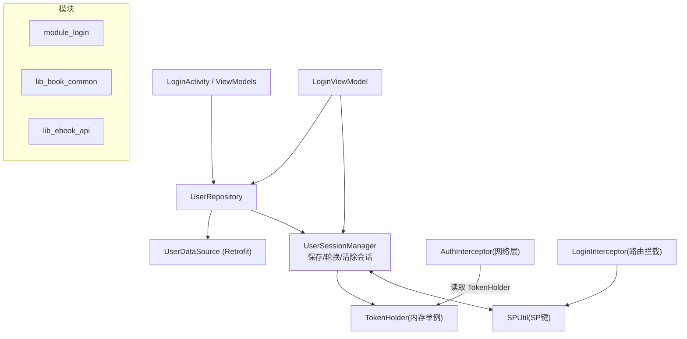
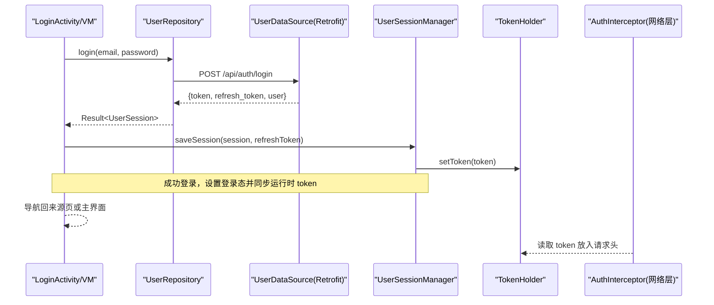
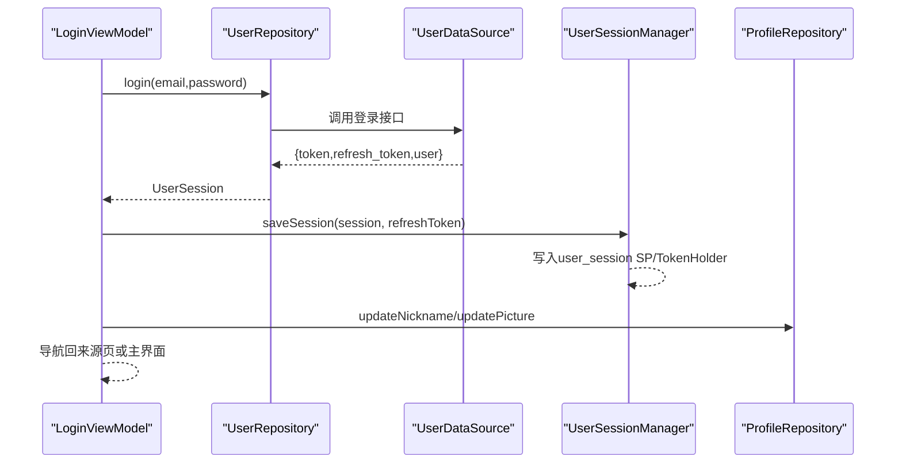
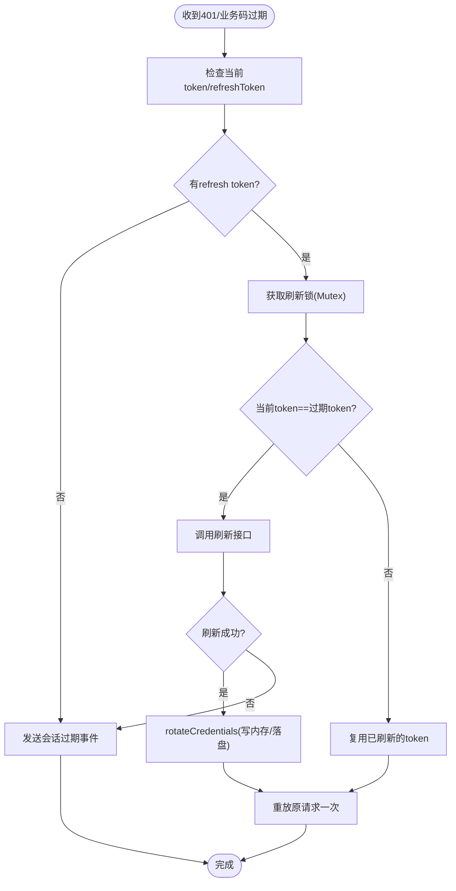
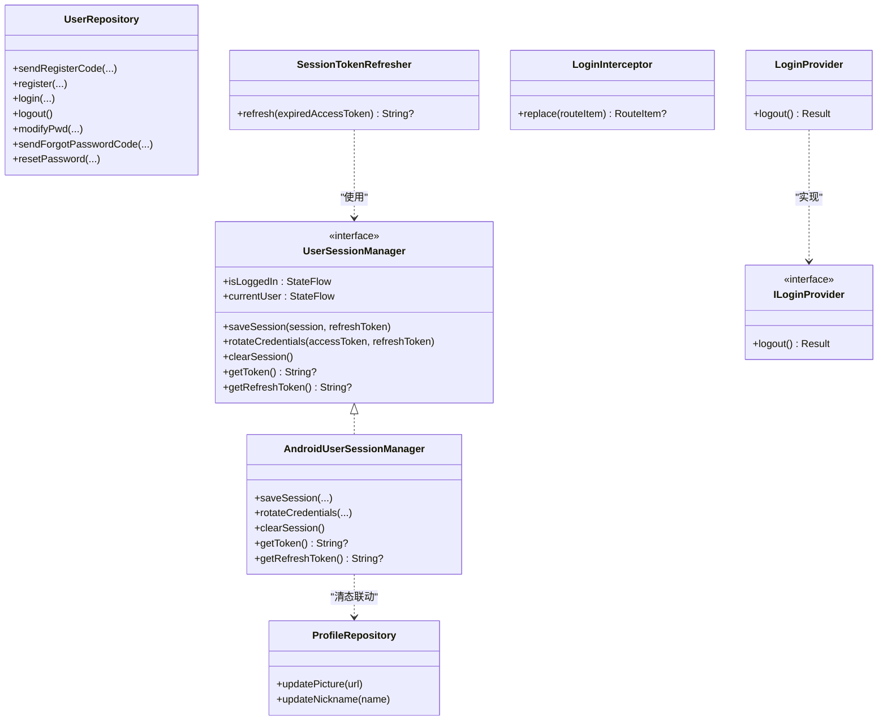
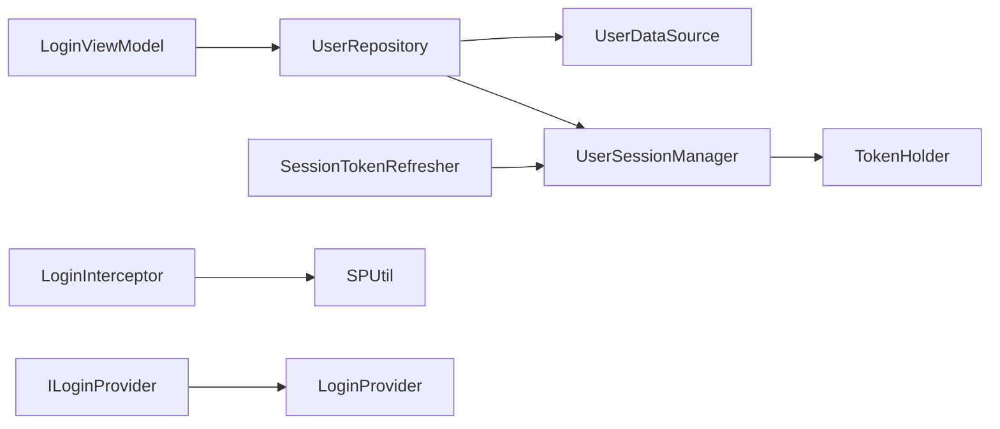

# 登录模块（module_login）

<cite>
**本文引用的文件**
- [LoginProvider.kt](file://module_login/src/main/java/com/ebook/login/provider/LoginProvider.kt)
- [UserRepository.kt](file://module_login/src/main/java/com/ebook/login/repository/UserRepository.kt)
- [ILoginProvider.kt](file://lib_book_common/src/main/java/com/ebook/common/provider/ILoginProvider.kt)
- [LoginInterceptor.kt](file://lib_book_common/src/main/java/com/ebook/common/interceptor/LoginInterceptor.kt)
- [AndroidUserSessionManager.kt](file://lib_book_common/src/main/java/com/ebook/common/domain/AndroidUserSessionManager.kt)
- [UserSessionManager.kt](file://lib_book_common/src/main/java/com/ebook/common/domain/UserSessionManager.kt)
- [UserSession.kt](file://lib_book_common/src/main/java/com/ebook/common/domain/UserSession.kt)
- [SessionTokenRefresher.kt](file://lib_book_common/src/main/java/com/ebook/common/domain/SessionTokenRefresher.kt)
- [SessionModule.kt](file://lib_book_common/src/main/java/com/ebook/common/di/SessionModule.kt)
- [ProfileRepository.kt](file://lib_book_common/src/main/java/com/ebook/common/repository/ProfileRepository.kt)
- [SPUtil.kt](file://lib_book_common/src/main/java/com/ebook/common/util/SPUtil.kt)
- [KeyCode.kt](file://lib_book_common/src/main/java/com/ebook/common/event/KeyCode.kt)
- [LoginActivity.kt](file://module_login/src/main/java/com/ebook/login/LoginActivity.kt)
- [LoginViewModel.kt](file://module_login/src/main/java/com/ebook/login/mvvm/viewmodel/LoginViewModel.kt)
- [LoginRequest.kt](file://lib_ebook_api/src/main/java/com/ebook/api/entity/LoginRequest.kt)
- [LoginDTO.kt](file://lib_ebook_api/src/main/java/com/ebook/api/entity/LoginDTO.kt)
</cite>

## 目录
1. [简介](#简介)
2. [项目结构](#项目结构)
3. [核心组件](#核心组件)
4. [架构总览](#架构总览)
5. [详细组件分析](#详细组件分析)
6. [依赖关系分析](#依赖关系分析)
7. [性能与可靠性考量](#性能与可靠性考量)
8. [故障排查指南](#故障排查指南)
9. [结论](#结论)
10. [附录](#附录)

## 简介
本模块负责用户认证与登录相关的功能，包括邮箱+密码登录、注册、修改密码、忘记密码重置、服务端会话作废等。认证流程通过仓库层对接后端接口，结合 token 管理与网络拦截器实现“请求级”的无感鉴权与静默刷新；会话状态以 UserSessionManager 为中心持久化并对外暴露统一入口，跨模块能力通过 Provider 接口解耦暴露。

## 项目结构
登录模块采用 MVVM + Repository 分层：
- module_login：UI 页面与 ViewModel，以及与登录域相关的 Provider 与仓库。
- lib_book_common：认证会话管理、拦截器、配置文件与 DI 绑定等通用能力。
- lib_ebook_api：网络层 DTO/请求实体与服务接口定义。

图示来源
- [LoginActivity.kt:49-192](file://module_login/src/main/java/com/ebook/login/LoginActivity.kt#L49-L192)
- [LoginViewModel.kt:31-117](file://module_login/src/main/java/com/ebook/login/mvvm/viewmodel/LoginViewModel.kt#L31-L117)
- [UserRepository.kt:26-94](file://module_login/src/main/java/com/ebook/login/repository/UserRepository.kt#L26-L94)
- [AndroidUserSessionManager.kt:28-162](file://lib_book_common/src/main/java/com/ebook/common/domain/AndroidUserSessionManager.kt#L28-L162)
- [LoginInterceptor.kt:14-42](file://lib_book_common/src/main/java/com/ebook/common/interceptor/LoginInterceptor.kt#L14-L42)
- [SPUtil.kt:81-89](file://lib_book_common/src/main/java/com/ebook/common/util/SPUtil.kt#L81-L89)

小节来源
- [AGENTS.md](file://AGENTS.md)

## 核心组件
- 登录与业务 API 封装：UserRepository，对登录/注册/改密/找回/登出做统一适配和异常归一。
- 会话管理：UserSessionManager 接口及其 Android 实现 AndroidUserSessionManager，集中持有登录态、当前会话与 token。
- 令牌刷新：SessionTokenRefresher 实现“双 token”静默刷新，解决 access token 过期时的自动续期。
- 路由拦截：LoginInterceptor 对需要登录的路由进行拦截处理。
- 跨模块能力暴露：ILoginProvider + LoginProvider 提供“服务端注销”能力。
- 个人资料缓存：ProfileRepository 维护昵称与头像的进程内流与本地 SP 镜像。

小节来源
- [UserRepository.kt:26-94](file://module_login/src/main/java/com/ebook/login/repository/UserRepository.kt#L26-L94)
- [UserSessionManager.kt:13-62](file://lib_book_common/src/main/java/com/ebook/common/domain/UserSessionManager.kt#L13-L62)
- [AndroidUserSessionManager.kt:28-162](file://lib_book_common/src/main/java/com/ebook/common/domain/AndroidUserSessionManager.kt#L28-L162)
- [SessionTokenRefresher.kt:41-96](file://lib_book_common/src/main/java/com/ebook/common/domain/SessionTokenRefresher.kt#L41-L96)
- [LoginInterceptor.kt:14-42](file://lib_book_common/src/main/java/com/ebook/common/interceptor/LoginInterceptor.kt#L14-L42)
- [ILoginProvider.kt:3-19](file://lib_book_common/src/main/java/com/ebook/common/provider/ILoginProvider.kt#L3-L19)
- [LoginProvider.kt:11-35](file://module_login/src/main/java/com/ebook/login/provider/LoginProvider.kt#L11-L35)
- [ProfileRepository.kt:12-54](file://lib_book_common/src/main/java/com/ebook/common/repository/ProfileRepository.kt#L12-L54)

## 架构总览
登录模块围绕“认证—会话—请求鉴权”构建：
- 认证阶段：用户输入邮箱/密码，调用 UserRepository.login，服务端返回会话信息与会话双 token。
- 会话建立：LoginViewModel 将结果交给 UserSessionManager.saveSession，写入本地存储并同步 TokenHolder。
- 请求鉴权：OkHttp 的 AuthInterceptor 从 TokenHolder 读取 token，附加到后续请求头；若响应指示 token 过期，触发 SessionTokenRefresher 静默刷新。
- 路由拦截：目标页需登录时，LoginInterceptor 检测 spUtils 中的登录态，未登录则跳转登录页，带来源路径用于登录后回跳。
- 跨模块调用：ILoginProvider.logout 仅暴露服务端侧登出，本地清会话统一走 UserSessionManager.clearSession。

图示来源
- [LoginViewModel.kt:46-116](file://module_login/src/main/java/com/ebook/login/mvvm/viewmodel/LoginViewModel.kt#L46-L116)
- [UserRepository.kt:50-55](file://module_login/src/main/java/com/ebook/login/repository/UserRepository.kt#L50-L55)
- [UserSessionManager.kt:24-30](file://lib_book_common/src/main/java/com/ebook/common/domain/UserSessionManager.kt#L24-L30)
- [AndroidUserSessionManager.kt:61-85](file://lib_book_common/src/main/java/com/ebook/common/domain/AndroidUserSessionManager.kt#L61-L85)

小节来源
- [LoginRequest.kt:1-15](file://lib_ebook_api/src/main/java/com/ebook/api/entity/LoginRequest.kt#L1-L15)
- [LoginDTO.kt:1-16](file://lib_ebook_api/src/main/java/com/ebook/api/entity/LoginDTO.kt#L1-L16)

## 详细组件分析

### 邮箱登录流程与 UI 行为
- LoginActivity 提供邮箱与密码输入，限制密码长度与服务端一致；支持 singleTask 复用实例，避免重复重建导致的事件丢失。
- LoginViewModel 执行：
  - 表单非空校验；
  - 调用 UserRepository.login 发起邮箱+密码登录；
  - 登录成功调用 UserSessionManager.saveSession，使能后续接口自动携带 token；
  - 更新 ProfileRepository 头像与昵称；
  - 根据来源路径智能回退（被拦截来源页）或直接回主界面；
  - 失败时区分“全局已处理会话过期”与业务异常提示。

小节来源
- [LoginActivity.kt:49-192](file://module_login/src/main/java/com/ebook/login/LoginActivity.kt#L49-L192)
- [LoginViewModel.kt:31-117](file://module_login/src/main/java/com/ebook/login/mvvm/viewmodel/LoginViewModel.kt#L31-L117)
- [UserRepository.kt:50-55](file://module_login/src/main/java/com/ebook/login/repository/UserRepository.kt#L50-L55)

#### 序列图：登录端到端调用

图示来源
- [LoginViewModel.kt:46-116](file://module_login/src/main/java/com/ebook/login/mvvm/viewmodel/LoginViewModel.kt#L46-L116)
- [UserRepository.kt:50-55](file://module_login/src/main/java/com/ebook/login/repository/UserRepository.kt#L50-L55)
- [AndroidUserSessionManager.kt:61-85](file://lib_book_common/src/main/java/com/ebook/common/domain/AndroidUserSessionManager.kt#L61-L85)
- [ProfileRepository.kt:30-38](file://lib_book_common/src/main/java/com/ebook/common/repository/ProfileRepository.kt#L30-L38)

小节来源
- [LoginViewModel.kt:46-116](file://module_login/src/main/java/com/ebook/login/mvvm/viewmodel/LoginViewModel.kt#L46-L116)

### 密码管理与安全策略
- 密码不落盘：登录态恢复通过 token，启动不再重放密码；旧版本遗留明文密码在首次启动时清理。
- 登录凭据只保存在服务端返回的 token 体系（access + refresh），客户端不再存取用户密码。

小节来源
- [AndroidUserSessionManager.kt:39-51](file://lib_book_common/src/main/java/com/ebook/common/domain/AndroidUserSessionManager.kt#L39-L51)

### Token 刷新机制（双 token）
- 触发点：当网络请求因 access token 过期而失败时，由 CoroutineAdapter 统一识别并触发刷新（A0230）。
- 互斥并发：使用 Mutex 串行化刷新，避免多线程并发刷新导致 refresh token 提前作废引发后一个请求失败。
- 刷新流程：以 refresh token 调用后端刷新接口，成功后仅更新 token（不更新身份字段），新 refresh token 落盘，access token 仅驻内存并更新至 TokenHolder。
- 幂等保护：冷启动时即使无 access token，也可通过 refresh token 取得新的 access 并继续业务流程。

图示来源
- [SessionTokenRefresher.kt:50-91](file://lib_book_common/src/main/java/com/ebook/common/domain/SessionTokenRefresher.kt#L50-L91)
- [AndroidUserSessionManager.kt:87-98](file://lib_book_common/src/main/java/com/ebook/common/domain/AndroidUserSessionManager.kt#L87-L98)

小节来源
- [SessionTokenRefresher.kt:15-96](file://lib_book_common/src/main/java/com/ebook/common/domain/SessionTokenRefresher.kt#L15-L96)
- [AndroidUserSessionManager.kt:87-98](file://lib_book_common/src/main/java/com/ebook/common/domain/AndroidUserSessionManager.kt#L87-L98)

### 会话状态同步与多镜像一致性
UserSessionManager 的三处“镜像”必须保持一致：
- ① 进程内 StateFlow + TokenHolder
- ② user_session SP 与 spUtils（兼容 LoginInterceptor）
- ③ ProfileRepository 的昵称与头像内存流

clearSession() 会一次性清理这三处；saveSession() 会在登录时同时写入 spUtils 以便 LoginInterceptor 正确识别已登录。

小节来源
- [AndroidUserSessionManager.kt:61-85](file://lib_book_common/src/main/java/com/ebook/common/domain/AndroidUserSessionManager.kt#L61-L85)
- [AndroidUserSessionManager.kt:100-133](file://lib_book_common/src/main/java/com/ebook/common/domain/AndroidUserSessionManager.kt#L100-L133)
- [ProfileRepository.kt:20-53](file://lib_book_common/src/main/java/com/ebook/common/repository/ProfileRepository.kt#L20-L53)
- [SPUtil.kt:81-89](file://lib_book_common/src/main/java/com/ebook/common/util/SPUtil.kt#L81-L89)

### 路由拦截与自动跳转
- LoginInterceptor 基于 SPUtil 中的登录标识判断是否需要拦截到登录页。
- 被拦截页面的原始路径会通过 TheRouter 参数带回，LoginViewModel 登录后根据来源判断“拦截回跳”还是直接回主界面。

小节来源
- [LoginInterceptor.kt:14-42](file://lib_book_common/src/main/java/com/ebook/common/interceptor/LoginInterceptor.kt#L14-L42)
- [LoginViewModel.kt:85-116](file://module_login/src/main/java/com/ebook/login/mvvm/viewmodel/LoginViewModel.kt#L85-L116)
- [KeyCode.kt:15-24](file://lib_book_common/src/main/java/com/ebook/common/event/KeyCode.kt#L15-L24)

### 跨模块解耦：Provider 接口
- ILoginProvider 暴露服务端侧登出能力（作废全部 refresh token），具体实现在 module_login 的 LoginProvider。
- 其他模块不应直接依赖 module_login，而应通过 ILoginProvider 调用 logout()；本地清会话统一调用 UserSessionManager.clearSession()，确保三处镜像同步。

小节来源
- [ILoginProvider.kt:3-19](file://lib_book_common/src/main/java/com/ebook/common/provider/ILoginProvider.kt#L3-L19)
- [LoginProvider.kt:11-35](file://module_login/src/main/java/com/ebook/login/provider/LoginProvider.kt#L11-L35)

### 与其他模块的集成点
- 个人中心模块通过 TheRouter 跳转到登录相关页面，并使用 ILoginProvider.logout 退出后，再由各模块调用 UserSessionManager.clearSession 清理本地。
- SplashActivity/MainActivity 等订阅会话过期事件并统一处置（清理会话、提示、跳转登录页）。

小节来源
- [LoginViewModel.kt:94-113](file://module_login/src/main/java/com/ebook/login/mvvm/viewmodel/LoginViewModel.kt#L94-L113)

### 类与关系图

图示来源
- [UserRepository.kt:26-94](file://module_login/src/main/java/com/ebook/login/repository/UserRepository.kt#L26-L94)
- [UserSessionManager.kt:13-62](file://lib_book_common/src/main/java/com/ebook/common/domain/UserSessionManager.kt#L13-L62)
- [AndroidUserSessionManager.kt:28-162](file://lib_book_common/src/main/java/com/ebook/common/domain/AndroidUserSessionManager.kt#L28-L162)
- [SessionTokenRefresher.kt:41-96](file://lib_book_common/src/main/java/com/ebook/common/domain/SessionTokenRefresher.kt#L41-L96)
- [LoginInterceptor.kt:14-42](file://lib_book_common/src/main/java/com/ebook/common/interceptor/LoginInterceptor.kt#L14-L42)
- [ILoginProvider.kt:3-19](file://lib_book_common/src/main/java/com/ebook/common/provider/ILoginProvider.kt#L3-L19)
- [LoginProvider.kt:11-35](file://module_login/src/main/java/com/ebook/login/provider/LoginProvider.kt#L11-L35)
- [ProfileRepository.kt:12-54](file://lib_book_common/src/main/java/com/ebook/common/repository/ProfileRepository.kt#L12-L54)

小节来源
- [SessionModule.kt:22-37](file://lib_book_common/src/main/java/com/ebook/common/di/SessionModule.kt#L22-L37)

## 依赖关系分析
- 登录流程依赖链路：LoginViewModel → UserRepository → UserDataSource（网络层）→ 服务器。
- 会话持久化与注入：UserSessionManager 接口与 AndroidUserSessionManager 实现由 SessionModule 绑定。
- 令牌刷新：SessionTokenRefresher 依赖 UserSessionManager.getRefreshToken() 与 TokenHolder。
- 路由拦截：LoginInterceptor 依赖 SPUtil 的登录键位作为授权判断依据。
- Provider 能力：ILoginProvider 为跨模块服务边界，避免业务模块强耦合 module_login。

图示来源
- [SessionModule.kt:22-37](file://lib_book_common/src/main/java/com/ebook/common/di/SessionModule.kt#L22-L37)
- [LoginViewModel.kt:31-35](file://module_login/src/main/java/com/ebook/login/mvvm/viewmodel/LoginViewModel.kt#L31-L35)
- [UserRepository.kt:26-31](file://module_login/src/main/java/com/ebook/login/repository/UserRepository.kt#L26-L31)
- [SessionTokenRefresher.kt:41-46](file://lib_book_common/src/main/java/com/ebook/common/domain/SessionTokenRefresher.kt#L41-L46)
- [LoginInterceptor.kt:14-42](file://lib_book_common/src/main/java/com/ebook/common/interceptor/LoginInterceptor.kt#L14-L42)

小节来源
- [AGENTS.md](file://AGENTS.md)

## 性能与可靠性考量
- 刷新互斥：通过 Mutex 保证并发下刷新唯一性，避免重复刷新导致 refresh token 失效而后续请求失败。
- 首请求延迟容忍：冷启动可能无 access token，首个请求经刷新后再重试，提升用户体验。
- 轻量持久化：access token 仅驻内存，降低安全风险与读写开销；refresh token 落盘便于进程重启后恢复。
- 拦截代价低：LoginInterceptor 仅读取少量 spUtils 值，开销可忽略。
- 健壮异常处理：登录失败区分“已全局处理的会话过期”与一般业务异常，减少重复提示与错误跳转。

[本节为通用指导，不直接分析具体代码文件]

## 故障排查指南
- 登录后仍跳转到登录页
  - 检查 clearSession 是否完整清理了三处镜像（user_session SP、spUtils 与 ProfileRepository 内存流）。
- 刷新无效或被服务端拒绝
  - 关注刷新返回数据中 token 是否为空；若为空则视为刷新失败，会上报会话过期事件。
- 请求无 token
  - 确认 UserSessionManager.getToken() 是否返回了最新值（取决于 TokenHolder），并确认 AuthInterceptor 生效的主机白名单是否正确。
- 独立调试宿主退出登录不生效
  - 测试宿主直接操作 spUtils 可能导致不完整清理，建议改为调用 UserSessionManager.clearSession()。

小节来源
- [AndroidUserSessionManager.kt:100-133](file://lib_book_common/src/main/java/com/ebook/common/domain/AndroidUserSessionManager.kt#L100-L133)
- [SessionTokenRefresher.kt:50-91](file://lib_book_common/src/main/java/com/ebook/common/domain/SessionTokenRefresher.kt#L50-L91)
- [LoginViewModel.kt:68-81](file://module_login/src/main/java/com/ebook/login/mvvm/viewmodel/LoginViewModel.kt#L68-L81)

## 结论
登录模块以 UserSessionManager 为核心统一会话与 token 生命周期，配合 SessionTokenRefresher 实现稳定可靠的静默续期；LoginInterceptor 提供透明化的鉴权拦截，ILoginProvider 实现跨模块解耦。整体设计遵循“密码不落盘”“access token 驻内存”“三处镜像一致性”的关键约定，兼顾安全性与可维护性。

[本节为总结，不直接分析具体代码文件]

## 附录

### 扩展点与新认证方式接入指南
- 新增认证类型（如第三方登录）建议：
  - 在 lib_ebook_api 定义新请求 DTO 与服务接口；
  - 在 UserRepository 增加对应方法并返回 UserSession（映射 server 载荷为新领域模型，保留双 token）；
  - 在 Module 层的 ViewModel 调用该仓库方法，成功后统一调用 UserSessionManager.saveSession；
  - 若需特殊处理刷新逻辑，可在 SessionTokenRefresher 中扩展或按需增加钩子（保持 Mutex 互斥与 rotateCredentials 不变）。
  - 不要在此层引入新的密码持久化逻辑，遵守“密码不落盘”原则。

小节来源
- [UserRepository.kt:35-84](file://module_login/src/main/java/com/ebook/login/repository/UserRepository.kt#L35-L84)
- [UserSessionManager.kt:24-42](file://lib_book_common/src/main/java/com/ebook/common/domain/UserSessionManager.kt#L24-L42)
- [SessionTokenRefresher.kt:15-39](file://lib_book_common/src/main/java/com/ebook/common/domain/SessionTokenRefresher.kt#L15-L39)