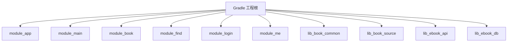
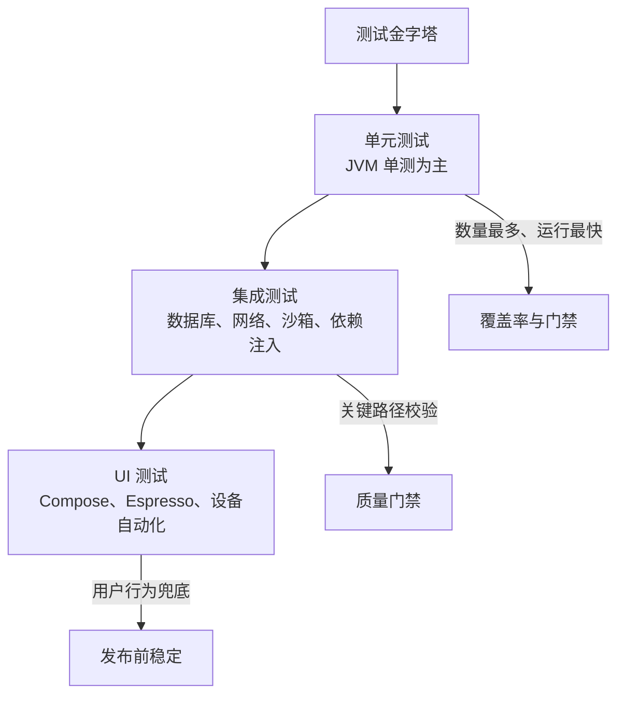
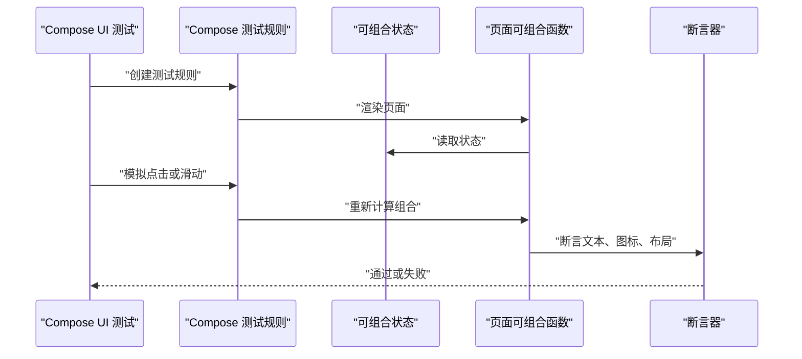
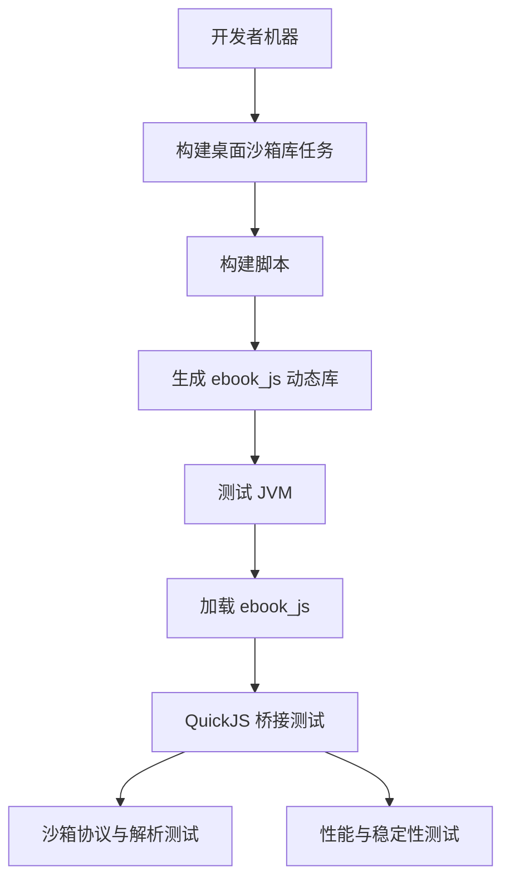
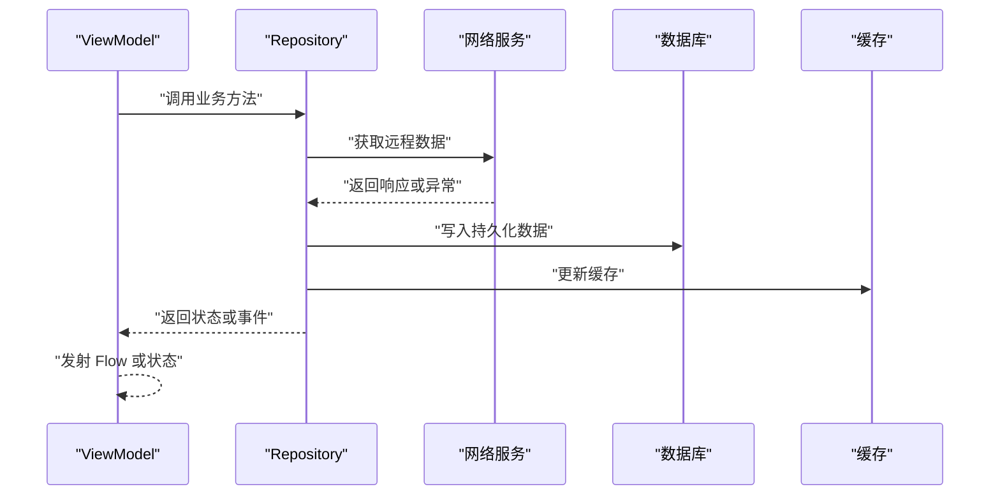
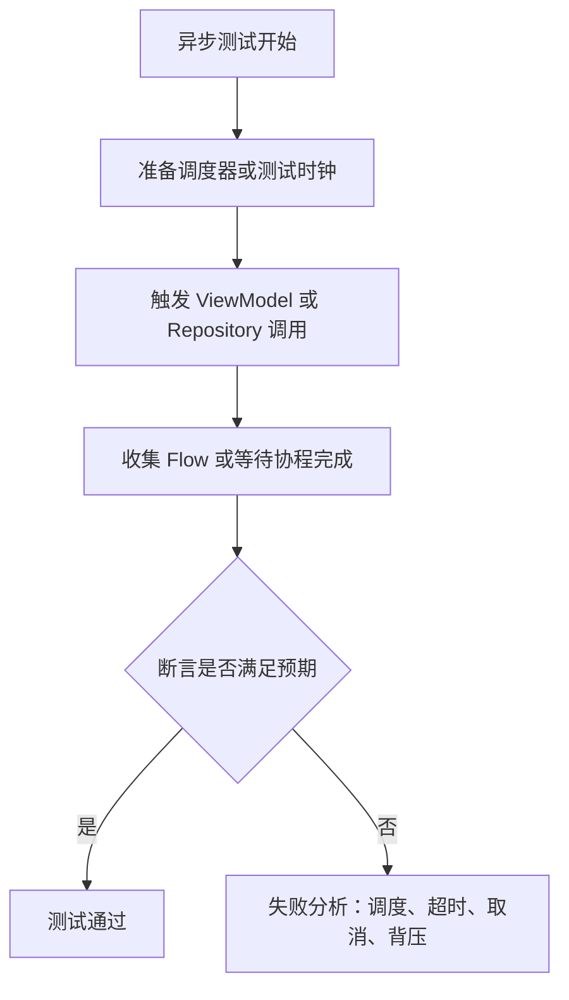

# 测试策略

<cite>
**本文引用的文件**   
- [settings.gradle.kts](file://settings.gradle.kts)
- [build.gradle.kts](file://build.gradle.kts)
- [gradle/libs.versions.toml](file://gradle/libs.versions.toml)
- [lib_book_source/build.gradle.kts](file://lib_book_source/build.gradle.kts)
- [lib_ebook_api/build.gradle.kts](file://lib_ebook_api/build.gradle.kts)
- [module_book/build.gradle.kts](file://module_book/build.gradle.kts)
- [module_find/build.gradle.kts](file://module_find/build.gradle.kts)
- [module_login/build.gradle.kts](file://module_login/build.gradle.kts)
- [module_main/build.gradle.kts](file://module_main/build.gradle.kts)
- [module_me/build.gradle.kts](file://module_me/build.gradle.kts)
</cite>

## 目录
1. [引言](#引言)
2. [项目结构与测试位置总览](#项目结构与测试位置总览)
3. [测试金字塔架构](#测试金字塔架构)
4. [测试框架与工具选型](#测试框架与工具选型)
5. [单元测试策略](#单元测试策略)
6. [集成测试策略](#集成测试策略)
7. [UI 测试策略](#ui-测试策略)
8. [沙箱 JavaScript 执行测试](#沙箱-javascript-执行测试)
9. [ViewModel、Repository 与网络层测试实践](#viewmodel-repository-与网络层测试实践)
10. [测试数据、Mock 与异步测试处理](#测试数据mock-与异步测试处理)
11. [覆盖率、持续集成与质量门禁](#覆盖率持续集成与质量门禁)
12. [常见问题与排错指南](#常见问题与排错指南)
13. [结论](#结论)

## 引言
本测试策略面向 Android 小说阅读器项目的多模块代码库，目标是明确单元测试、集成测试和 UI 测试的组织方式、工具链、执行策略和质量要求。项目采用 Kotlin + Compose + Hilt + Room + Retrofit 的典型现代 Android 架构，并引入 QuickJS 沙箱执行第三方脚本解析书源。测试体系需要覆盖领域逻辑、数据持久化、网络契约、页面渲染、阅读体验以及不信任脚本的安全边界。

## 项目结构与测试位置总览
仓库根通过 `settings.gradle.kts` 聚合应用模块、功能模块和底层库：
- 应用入口：`module_app`
- 功能模块：`module_main`、`module_book`、`module_find`、`module_login`、`module_me`
- 底层库：`lib_book_common`、`lib_book_source`、`lib_ebook_api`、`lib_ebook_db`

每个 Android 模块通常包含：
- `src/main`：生产代码
- `src/test`：JVM 单元测试
- `src/androidTest`：仪器化 UI/集成测试
- 部分模块在 `src/main/test/debug` 或 `src/main/test` 下提供调试测试辅助类，用于本地快速验证流程

**图表来源**
- [settings.gradle.kts:44-65](file://settings.gradle.kts#L44-L65)

**章节来源**
- [settings.gradle.kts:1-65](file://settings.gradle.kts#L1-L65)

## 测试金字塔架构
本项目测试金字塔分为三层：

| 层级 | 目标 | 典型位置 | 关键工具 | 执行速度 | 优先级 |
|---|---|---|---|---|---|
| 单元测试 | 验证纯 Kotlin 逻辑、状态机、数据转换、解析器、规则集合、协程编排 | `*/src/test/java` | JUnit、kotlinx-coroutines-test、Robolectric、Turbine | 快 | 最高 |
| 集成测试 | 验证 DAO 与数据库、Hilt 注入、网络契约、沙箱桥接、真实资源 | `*/src/test/java`（带 Robolectric/Room）和 `*/src/androidTest/java` | Room、SQLite JVM、OkHttp、QuickJS 桥接、AndroidJUnit4 | 中到慢 | 高 |
| UI 测试 | 验证 Compose 页面渲染、交互流程、导航、主题与基线行为 | `*/src/androidTest/java` 与 Compose UI 测试 | Espresso、Compose UI Test、Robolectric 渲染回归 | 慢 | 中高 |

金字塔原则是：大量低成本单元测试保障核心逻辑，少量集成测试保障子系统协作，更少但更真实的 UI 测试保障用户可见行为。

**图表来源**
- [lib_book_source/build.gradle.kts:72-111](file://lib_book_source/build.gradle.kts#L72-L111)
- [module_book/build.gradle.kts:47-100](file://module_book/build.gradle.kts#L47-L100)
- [module_find/build.gradle.kts:49-85](file://module_find/build.gradle.kts#L49-L85)
- [module_login/build.gradle.kts:49-75](file://module_login/build.gradle.kts#L49-L75)
- [module_main/build.gradle.kts:49-75](file://module_main/build.gradle.kts#L49-L75)
- [module_me/build.gradle.kts:60-91](file://module_me/build.gradle.kts#L60-L91)

**章节来源**
- [lib_book_source/build.gradle.kts:1-111](file://lib_book_source/build.gradle.kts#L1-L111)
- [lib_ebook_api/build.gradle.kts:1-64](file://lib_ebook_api/build.gradle.kts#L1-L64)
- [module_book/build.gradle.kts:1-100](file://module_book/build.gradle.kts#L1-L100)
- [module_find/build.gradle.kts:1-85](file://module_find/build.gradle.kts#L1-L85)
- [module_login/build.gradle.kts:1-75](file://module_login/build.gradle.kts#L1-L75)
- [module_main/build.gradle.kts:1-75](file://module_main/build.gradle.kts#L1-L75)
- [module_me/build.gradle.kts:1-91](file://module_me/build.gradle.kts#L1-L91)

## 测试框架与工具选型
项目在版本目录中集中声明测试相关依赖，便于统一升级和管理：

| 用途 | 工具 | 仓库中的体现 |
|---|---|---|
| 基础测试 | JUnit | `junit` 版本与 `androidx-test-ext-junit` |
| 协程测试 | kotlinx-coroutines-test | `kotlinx-coroutines-test` |
| 流式断言 | Turbine | `turbine` 版本定义 |
| Android 环境模拟 | Robolectric | `robolectric` 版本定义 |
| Compose UI 测试 | androidx-compose-ui-test | `androidx-compose-ui-test` 与 `androidx-compose-ui-testManifest` |
| UI 自动化 | Espresso | `androidx-test-espresso-core` |
| 设备自动化 | UIAutomator | `androidx-test-uiautomator` |
| 依赖注入测试 | Hilt Android Testing | `hilt-android-testing` |
| 数据库测试 | Room runtime、sqlite-bundled-jvm | Room 与 SQLite JVM 变体 |
| 截图/渲染回归 | Roborazzi | `roborazzi` 版本定义 |
| HTML/协议数据解析 | JSoup | `jsoup` |
| 网络契约测试 | OkHttp、Retrofit | `okhttp-logging`、`retrofit` |

**章节来源**
- [gradle/libs.versions.toml:1-237](file://gradle/libs.versions.toml#L1-L237)

## 单元测试策略
### 通用原则
- 优先使用 JVM 单元测试，避免启动 Android Framework。
- 对涉及 `Context`、资源、`PackageManager`、Activity/Fragment 生命周期、Composable 渲染的场景，使用 Robolectric。
- 对协程驱动的 ViewModel、Flow、Repository 方法，使用 `kotlinx-coroutines-test` 控制调度器；对 Flow 输出使用 Turbine 进行确定性断言。
- 对 Room DAO 的 SQL 语义，可在单元测试中使用内存数据库或 SQLite JVM 变体做真查询测试。
- 对网络契约和实体序列化，优先使用静态 JSON 资源和 Mock 响应，不发起真实请求。

### 各模块单元测试组织
- `lib_book_common`：领域模型、文本处理、导入协调器、书架管理、存储、仓库、UI 组件预览等单元测试集中在 `lib_book_common/src/test/java`。
- `lib_book_source`：脚本解析器、规则集、沙箱协议、QuickJS 桥接相关单元测试集中在 `lib_book_source/src/test/java`。
- `lib_ebook_api`：实体定义、格式检测、编码拦截器、评论网络契约测试集中在 `lib_ebook_api/src/test/java`。
- `module_book`：阅读进度、翻页控制器、滚动、章节选择、渲染探针、读者主题等单元测试集中在 `module_book/src/test/java`。
- `module_find`：书库合并、搜索视图模型、书源仓库缓存等单元测试集中在 `module_find/src/test/java`。
- `module_me`：书源校验、设置视图模型、缓存模型、更新状态、文档内容等单元测试集中在 `module_me/src/test/java`。
- `module_main`、`module_login`：当前以示例单测和渲染冒烟测试为主，后续可扩展业务逻辑单测。

**章节来源**
- [lib_book_common 测试结构](file://lib_book_common/lib_book_common/src/test/java/com/ebook/common)
- [lib_book_source 测试结构](file://lib_book_source/lib_book_source/src/test/java/com/ebook/source)
- [lib_ebook_api 测试结构](file://lib_ebook_api/lib_ebook_api/src/test/java/com/ebook/api)
- [module_book 测试结构](file://module_book/module_book/src/test/java/com/ebook/book)
- [module_find 测试结构](file://module_find/module_find/src/test/java/com/ebook/find)
- [module_me 测试结构](file://module_me/module_me/src/test/java/com/ebook/me)
- [module_main 测试结构](file://module_main/module_main/src/test/java/com/ebook/main)
- [module_login 测试结构](file://module_login/module_login/src/test/java/com/ebook/login)

## 集成测试策略
集成测试位于 `src/androidTest`，承担以下职责：
- 启动真实 Android 测试运行时 `AndroidJUnitRunner`。
- 验证 Hilt 组件树、依赖注入、数据库迁移、服务绑定、跨模块装配。
- 验证沙箱连接、QuickJS 桥接、脚本解析与宿主通信。
- 验证 Compose UI 页面、导航、主题、用户输入和设备能力。

### 关键配置
- 多数模块在 `defaultConfig.testInstrumentationRunner` 中指定 `androidx.test.runner.AndroidJUnitRunner`。
- `lib_book_source` 的仪器化测试只引入必要的测试依赖，避免拖入完整 Espresso 依赖链。
- `module_book` 的基线仪器测试使用 Hilt 测试脚手架。
- 各功能模块的 `androidTestImplementation` 包含 JUnit 扩展、Espresso Core，必要时追加 UIAutomator。

**章节来源**
- [module_book/build.gradle.kts:1-100](file://module_book/build.gradle.kts#L1-L100)
- [module_find/build.gradle.kts:1-85](file://module_find/build.gradle.kts#L1-L85)
- [module_login/build.gradle.kts:1-75](file://module_login/build.gradle.kts#L1-L75)
- [module_main/build.gradle.kts:1-75](file://module_main/build.gradle.kts#L1-L75)
- [lib_book_source/build.gradle.kts:72-111](file://lib_book_source/build.gradle.kts#L72-L111)

## UI 测试策略
### Compose UI 测试
- 使用 `androidx-compose-ui-test` 与 `androidx-compose-ui-testManifest` 提供的 Compose UI 测试能力。
- 对于需要在 JVM 上加载资源的 Compose 渲染冒烟测试，模块通过 Robolectric 提供 SDK 环境。
- 渲染测试应聚焦关键 UI 分支：空态、错误态、列表项、阅读页布局、主题切换、下载角标、底部导航文案等。
- 推荐将 UI 测试拆为“状态驱动渲染测试”和“用户交互测试”，前者用可组合函数直接调用，后者用 Compose 规则模拟点击、滑动、输入。

### 页面渲染测试
- `module_book`、`module_find`、`module_login`、`module_main`、`module_me` 均开启 `testOptions.unitTests.isIncludeAndroidResources = true`，说明其单元测试或渲染冒烟测试依赖 Android 资源。
- `module_book` 注释明确提到 Compose UI 渲染回归：在 Robolectric 原生图形下真渲染，并通过绘制取像素的方式锁定只有渲染才能发现的缺陷，例如顶栏下载角标被裁掉等问题。

### 用户交互模拟
- 使用 Compose UI Test 的 `SemanticsNodeInteractionsProvider` 进行点击、长按、滑动、输入等交互。
- 使用 `assertHasContentDescription`、`assertText`、`assertIsDisplayed` 等断言语义节点。
- 对于复杂页面，先断言状态再断言渲染结果，避免把 UI 测试变成黑盒快照测试。

**图表来源**
- [module_book/build.gradle.kts:47-100](file://module_book/build.gradle.kts#L47-L100)
- [module_find/build.gradle.kts:49-85](file://module_find/build.gradle.kts#L49-L85)
- [module_login/build.gradle.kts:49-75](file://module_login/build.gradle.kts#L49-L75)
- [module_main/build.gradle.kts:49-75](file://module_main/build.gradle.kts#L49-L75)
- [module_me/build.gradle.kts:60-91](file://module_me/build.gradle.kts#L60-L91)

**章节来源**
- [module_book/build.gradle.kts:47-100](file://module_book/build.gradle.kts#L47-L100)
- [module_find/build.gradle.kts:49-85](file://module_find/build.gradle.kts#L49-L85)
- [module_login/build.gradle.kts:49-75](file://module_login/build.gradle.kts#L49-L75)
- [module_main/build.gradle.kts:49-75](file://module_main/build.gradle.kts#L49-L75)
- [module_me/build.gradle.kts:60-91](file://module_me/build.gradle.kts#L60-L91)

## 沙箱 JavaScript 执行测试
`lib_book_source` 是书源脚本解析与沙箱执行的核心模块，其测试策略需要同时覆盖：
- 脚本解析：JSON 规则、URL 模板、字段映射、分页参数。
- 沙箱协议：控制面帧、HostReply、JsOutcome 等协议对象。
- QuickJS 桥接：JVM 与 QuickJS 内核之间的类型转换、异常传播、性能边界。
- 桌面沙箱库：在开发机上构建动态库，供桌面 JVM 用例加载真实 QuickJS。

### 构建与执行
- `lib_book_source/build.gradle.kts` 定义了 `buildDesktopJsLib` 任务，通过脚本调用外部编译器生成 `ebook_js.dll` 或 `libebook_js.so`。
- 所有测试任务会设置 `java.library.path` 指向构建产物目录，使 `System.loadLibrary("ebook_js")` 能找到沙箱库。
- 若未构建桌面沙箱库，相关测试应按假设跳过，而不是假绿。
- 语料录制参数通过 Gradle 属性透传给测试 JVM，如 `corpus.record`、`corpus.keyword`、`corpus.batch` 等。

**图表来源**
- [lib_book_source/build.gradle.kts:72-111](file://lib_book_source/build.gradle.kts#L72-L111)

**章节来源**
- [lib_book_source/build.gradle.kts:1-111](file://lib_book_source/build.gradle.kts#L1-L111)

## ViewModel、Repository 与网络层测试实践
### ViewModel 测试
- 使用 `kotlinx-coroutines-test` 设置主调度器，使 `viewModelScope` 可被测试驱动。
- 对 `StateFlow`、`SharedFlow`、`Channel` 输出，使用 Turbine 收集并断言事件序列。
- 对异步操作失败、重试、取消、并发场景，分别构造成功、异常、超时、部分成功等用例。
- 对需要 `Context` 或 Android 环境的 ViewModel，使用 Robolectric 并提供最小依赖。

### Repository 测试
- Repository 应隔离网络、数据库、缓存、脚本解析等副作用。
- 使用 Fake Repository、Fake DAO、Mock Service、内存数据库等方式验证编排逻辑。
- 对书源切换、目录同步、章节追加、阅读恢复等复杂流程，编写端到端状态流转测试。
- 对分页、增量更新、去重、冲突合并等算法，重点覆盖边界条件。

### 网络层测试
- `lib_ebook_api` 使用 Retrofit 与 OkHttp，测试应避免真实网络请求。
- 使用静态 JSON 资产或 Mock Response 验证序列化、反序列化、错误码、分页结构。
- 对编码拦截器、认证头、刷新 Token、登录注册等流程，分别验证正常、过期、非法、网络异常分支。
- 对评论接口、用户信息、版本信息等契约，保持 JSON 与实体一致性的契约测试。

**图表来源**
- [lib_ebook_api/build.gradle.kts:1-64](file://lib_ebook_api/build.gradle.kts#L1-L64)
- [module_book/build.gradle.kts:47-100](file://module_book/build.gradle.kts#L47-L100)
- [module_find/build.gradle.kts:49-85](file://module_find/build.gradle.kts#L49-L85)
- [module_me/build.gradle.kts:60-91](file://module_me/build.gradle.kts#L60-L91)

**章节来源**
- [lib_ebook_api/build.gradle.kts:1-64](file://lib_ebook_api/build.gradle.kts#L1-L64)
- [module_book/build.gradle.kts:47-100](file://module_book/build.gradle.kts#L47-L100)
- [module_find/build.gradle.kts:49-85](file://module_find/build.gradle.kts#L49-L85)
- [module_me/build.gradle.kts:60-91](file://module_me/build.gradle.kts#L60-L91)

## 测试数据、Mock 与异步测试处理
### 测试数据管理
- 网络契约测试使用 `lib_ebook_api/src/main/assets` 下的静态 JSON 文件，例如用户登录、注册、评论、版本信息等。
- 沙箱脚本测试可使用语料参数控制批量录制或批处理。
- 数据库测试建议使用内存数据库或固定 schema，保证可重复性。
- UI 测试应尽量使用可配置的测试数据，避免依赖真实账号或随机状态。

### Mock 对象创建
- 对 Repository、Service、DAO、Store、Manager 等外部依赖，优先使用手写 Fake 或 MockK 风格的替身。
- 对 Hilt 注入的组件，在仪器化测试中使用 `@HiltAndroidTest` 和 `HiltAndroidRule`。
- 对 ViewModel 测试，尽量通过构造函数或测试专用注入图传入 Fake 依赖，避免依赖全局单例。

### 异步测试处理
- 使用 `runTest` 或 `StandardTestDispatcher` 控制协程调度。
- 对 Flow 使用 Turbine 的 `awaitItem`、`awaitComplete`、`assertNoMoreItems` 等 API。
- 对超时、取消、背压、重试等场景单独建模。
- 对需要主线程调度的 UI 相关协程，结合 Robolectric 的 Looper 或 Compose UI Test 的规则驱动。

**图表来源**
- [gradle/libs.versions.toml:1-237](file://gradle/libs.versions.toml#L1-L237)
- [lib_ebook_api/build.gradle.kts:49-64](file://lib_ebook_api/build.gradle.kts#L49-L64)
- [lib_book_source/build.gradle.kts:86-111](file://lib_book_source/build.gradle.kts#L86-L111)

**章节来源**
- [lib_ebook_api/build.gradle.kts:1-64](file://lib_ebook_api/build.gradle.kts#L1-L64)
- [lib_book_source/build.gradle.kts:72-111](file://lib_book_source/build.gradle.kts#L72-L111)
- [gradle/libs.versions.toml:1-237](file://gradle/libs.versions.toml#L1-L237)

## 覆盖率、持续集成与质量门禁
### 覆盖率建议
- 单元测试覆盖率作为主要指标，建议领域逻辑、解析器、仓库、ViewModel 达到较高覆盖率。
- UI 测试覆盖率不作为唯一指标，应更注重关键用户路径覆盖。
- 沙箱 JavaScript 测试应覆盖协议边界、异常路径和性能敏感路径，即使覆盖率不是 100%，也应保证安全与稳定性。

### 持续集成建议
- 分阶段执行测试：先跑 JVM 单元测试，再跑集成测试，最后跑 UI 测试。
- 沙箱测试应区分“无桌面库跳过”和“真正失败”，避免误报。
- 对 Compose 渲染回归，建议结合截图对比或像素级断言，但需控制变更频率。
- 对网络契约测试，禁止连真实服务器，必须使用静态资源或 Mock。

### 质量门禁
- 新增或修改公共 API 时，必须补充对应单元测试。
- 改动阅读核心逻辑、翻页、滚动、目录同步、章节更新时，必须补充或更新集成测试。
- 改动 UI 布局、主题、导航时，必须补充或更新 Compose 渲染测试。
- 改动书源脚本解析或沙箱协议时，必须补充协议与桥接测试。
- 建议在 CI 中拒绝覆盖率显著下降、测试失败、渲染回归未确认的提交。

[本节为通用质量建议，不直接分析具体源码文件]

## 常见问题与排错指南
### 找不到 Android 测试 Runner
- 现象：仪器化测试报 `Class not found`。
- 原因：某些模块没有显式引入测试 runner 所需依赖。
- 处理：参考 `lib_book_source/build.gradle.kts`，为仪器化测试引入 `androidx.test.ext.junit`、`androidx.test.core`、`androidx.test.runner`，避免依赖 Espresso 全量链。

### Robolectric 无法读取资源
- 现象：单元测试中访问 `stringResource`、`R.string.*` 失败。
- 原因：未启用 Android 资源合并。
- 处理：在模块 `testOptions.unitTests` 中启用 `isIncludeAndroidResources = true`。

### Compose UI 测试渲染超时
- 现象：使用 `captureToImage` 或类似异步渲染 API 超时。
- 原因：Looper 暂停或未驱动帧提交。
- 处理：使用 Robolectric 原生图形绘制方式，或在 Compose UI Test 中确保 UI 已稳定后再断言。

### 沙箱动态库加载失败
- 现象：QuickJS 桥接测试加载 `ebook_js` 失败。
- 原因：未构建桌面沙箱库或 `java.library.path` 未设置。
- 处理：执行 `buildDesktopJsLib` 任务，并确保测试 JVM 能读取构建产物目录。

### Hilt 注入为空
- 现象：`@Inject` 字段为空。
- 原因：测试变体未启用 KSP 或依赖注入注解未生成。
- 处理：在 `androidTest` 中添加 Hilt 测试依赖和 KSP 处理器，确保测试编译期生成注入代码。

**章节来源**
- [lib_book_source/build.gradle.kts:72-111](file://lib_book_source/build.gradle.kts#L72-L111)
- [module_book/build.gradle.kts:47-100](file://module_book/build.gradle.kts#L47-L100)
- [module_find/build.gradle.kts:49-85](file://module_find/build.gradle.kts#L49-L85)
- [module_login/build.gradle.kts:49-75](file://module_login/build.gradle.kts#L49-L75)
- [module_main/build.gradle.kts:49-75](file://module_main/build.gradle.kts#L49-L75)
- [module_me/build.gradle.kts:60-91](file://module_me/build.gradle.kts#L60-L91)

## 结论
该项目的测试体系应以 JVM 单元测试为基础，以集成测试保障数据、网络、沙箱与依赖注入的正确性，以 Compose UI 测试和用户交互测试兜底用户体验。测试工具链围绕 JUnit、kotlinx-coroutines-test、Turbine、Robolectric、Compose UI Test、Espresso、Hilt Android Testing、Room 和 QuickJS 桥接展开。未来应在现有基础上继续完善 ViewModel 与 Repository 测试、沙箱协议测试、渲染回归测试，并在持续集成中建立明确的测试门禁，确保新功能、重构和安全边界改动都有可靠测试支撑。