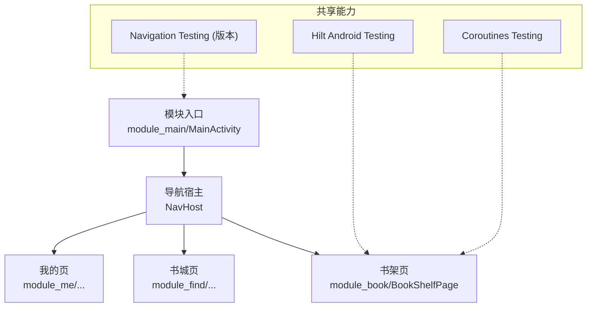
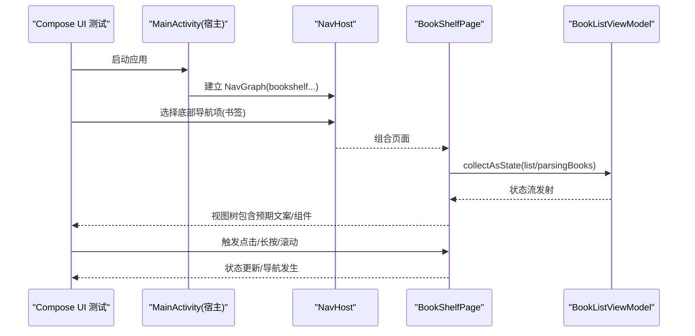
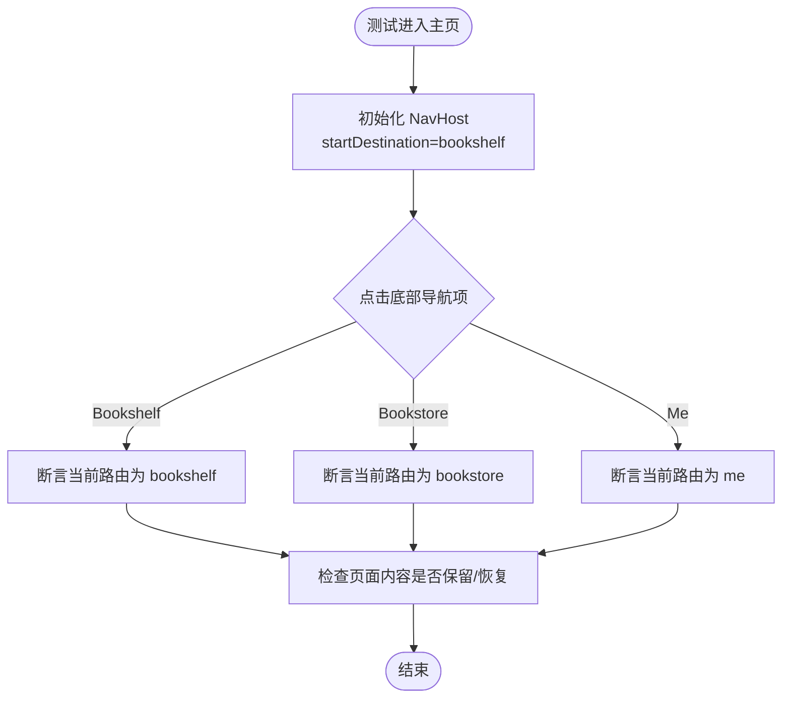
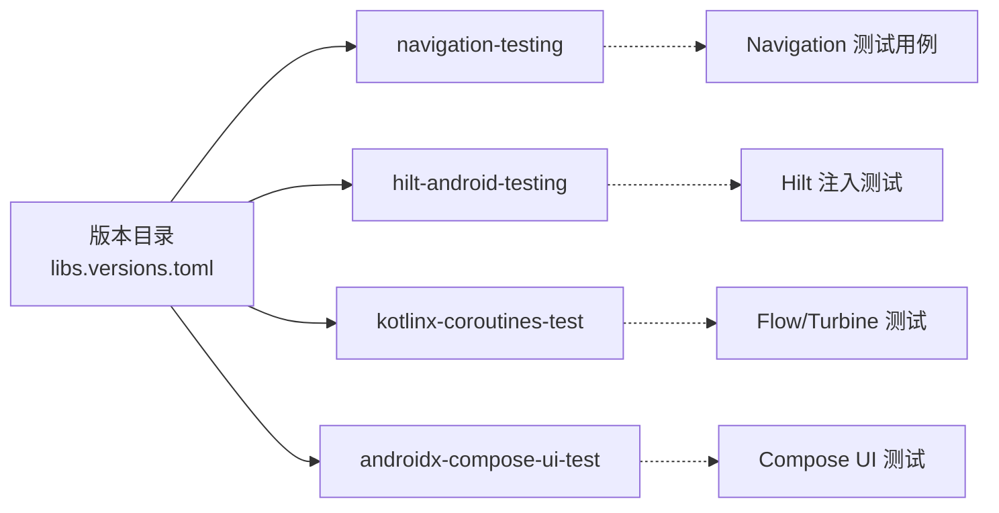

# UI测试

<cite>
**本文件引用的源文件**
- [MainActivity.kt](file://module_main/src/main/java/com/ebook/main/MainActivity.kt)
- [libs.versions.toml](file://gradle/libs.versions.toml)
- [ImportBaselineTest.kt](file://module_book/src/androidTest/java/com/ebook/book/ImportBaselineTest.kt)
- [AndroidInstrumentedTests.kt](file://build-logic/convention/src/main/kotlin/com/xrn1997/convention/AndroidInstrumentedTests.kt)
- [FakeUserSessionManager.kt](file://lib_book_common/src/test/java/com/ebook/common/domain/FakeUserSessionManager.kt)
- [BookShelfPage.kt](file://module_book/src/main/java/com/ebook/book/page/BookShelfPage.kt)
- [test-coverage-todo.md](file://docs/test-coverage-todo.md)
</cite>

## 目录
1. [引言](#引言)
2. [项目结构](#项目结构)
3. [核心组件](#核心组件)
4. [架构总览](#架构总览)
5. [详细组件分析](#详细组件分析)
6. [依赖关系分析](#依赖关系分析)
7. [性能注意事项](#性能注意事项)
8. [故障排查指南](#故障排查指南)
9. [结论](#结论)

## 引言
本文面向本仓库的 Compose UI 测试与界面行为验证实践，目标如下：
- 说明声明式界面的自动化测试方法，覆盖状态驱动、页面跳转、用户交互、主题样式、可访问性与性能等维度。
- 结合项目现状（尚未为 Compose 页面新增 UI 集成测试）给出落地步骤、最佳实践与迁移建议。
- 将现有测试基础设施（JUnit 4 + Hilt 测试 + Robolectric + Turbine + Navigation Testing API 版本）映射到 Compose 测试场景中，确保可实施且不引入破坏性变更。

## 项目结构
本项目采用多模块架构：业务模块（module_app/module_main/module_book/module_find/module_me/module_login）统一依赖共享库 lib_book_common，网络层在 lib_ebook_api，数据持久化在 lib_ebook_db。UI 全部使用 Jetpack Compose；导航基于 Navigation Compose；跨模块路由通过 TheRouter；构建与约定插件集中在 build-logic。

与 UI 测试密切相关的工程点：
- 版本目录集中管理依赖（包括 Navigation Testing、Hilt Testing、Compose Test、Coroutines Test）。
- 各模块已配置 JUnit/Robolectric/Espresso 等基础测试栈；Compose UI 测试依赖存在但尚未启用对应的 androidTest 用例（见“测试覆盖待办”中的条目）。
- MainActivity 定义了三个 Tab 的 NavHost 与路由（bookshelf、bookstore、me），是后续实现 Compose UI 测试的关键入口。
- BookShelfPage 作为典型页面展示了 ViewModel + Flow 的状态驱动模式、刷新绑定与列表渲染，适合做 StateFlow 驱动 UI 的断言示例。

图表来源
- [MainActivity.kt:123-197](file://module_main/src/main/java/com/ebook/main/MainActivity.kt#L123-L197)
- [libs.versions.toml:68-129](file://gradle/libs.versions.toml#L68-L129)

章节来源
- [MainActivity.kt:123-197](file://module_main/src/main/java/com/ebook/main/MainActivity.kt#L123-L197)
- [libs.versions.toml:68-129](file://gradle/libs.versions.toml#L68-L129)

## 核心组件
- 导航与路由
  - NavHost + rememberNavController 定义三个 Tab 路由（bookshelf/bookstore/me），并通过 popUpTo + launchSingleTop + restoreState 维持状态。
  - 跨模块页面以 Provider + TheRouter 组合，便于独立模块调试时占位替换。
- 状态驱动 UI
  - 页面侧通过 collectAsState 订阅 ViewModel 暴露的 Flow（如书架书目、解析中书籍、下载剩余数等）。
  - 列表由 RefreshableList 包裹，刷新信号由 MvvmBinder 绑定并触发 viewModel.refreshData()。
- 测试基础设施
  - JUnit 4、@RunWith(AndroidJUnit4)、@HiltAndroidTest、HiltAndroidRule 已在仪器测试中实践（导入基线测试）。
  - 构建期禁用无 androidTest 项目的仪器测试，避免空跑。
  - 版本目录提供 Navigation Testing、Composables Test、Coroutines Test 等依赖。

章节来源
- [BookShelfPage.kt:77-180](file://module_book/src/main/java/com/ebook/book/page/BookShelfPage.kt#L77-L180)
- [MainActivity.kt:99-197](file://module_main/src/main/java/com/ebook/main/MainActivity.kt#L99-L197)
- [ImportBaselineTest.kt:40-96](file://module_book/src/androidTest/java/com/ebook/book/ImportBaselineTest.kt#L40-L96)
- [AndroidInstrumentedTests.kt:30-35](file://build-logic/convention/src/main/kotlin/com/xrn1997/convention/AndroidInstrumentedTests.kt#L30-L35)
- [libs.versions.toml:68-129](file://gradle/libs.versions.toml#L68-L129)

## 架构总览
Compose UI 测试在该项目中应遵循分层思路：
- 单元/逻辑层：纯 Kotlin/JVM 单测与 Robolectric，用于校验 Flow 转换、数据处理、分页与匹配逻辑（已有大量覆盖）。
- 集成层：Hilt 注入 Fake/Mock 数据源，验证 ViewModel 行为、Repository 边界。
- UI 层（Compose）：基于 Compose UI Test 与 Navigation Testing，操作语义节点、验证显示文本/内容描述、点击/滑动、主题/尺寸适配。
- 性能与稳定性：控制等待策略（waitUntilIdle/awaitEachTransition）、截图回归（可选）、真实设备或模拟器条件执行。

图表来源
- [MainActivity.kt:139-197](file://module_main/src/main/java/com/ebook/main/MainActivity.kt#L139-L197)
- [BookShelfPage.kt:77-180](file://module_book/src/main/java/com/ebook/book/page/BookShelfPage.kt#L77-L180)

## 详细组件分析

### 导航与跳转测试
- 场景要点
  - 验证底部导航切换到不同 Tab 后，当前路由是否正确、页面是否被正确组合。
  - 验证 popUpTo/saveState/restoreState 保持状态的效果（返回栈深度与保留内容）。
  - 针对跨模块页面，优先通过 TheRouter 提供的 Composable Provider 暴露的主页面进行组合，保证独立模式与集成模式一致性。
- 推荐实现步骤
  - 使用 Navigation Compose 测试提供的 NavController 测试工具（版本由 libs.versions.toml 指定），配合 navController.graph.findStartDestination() 等能力断言路由与 back stack。
  - 对 MainActivity 的 NavHost startDestination 及 composable(route) 声明位置进行针对性断言（例如 bookshelf 为起始）。
  - 如需模拟跨模块页面跳转（详情/登录等），可在 module 的 debug 宿主注册占位路由，或使用 TheRouter 拦截替换路径（参考调试 Application 的路径替换实践）。

图表来源
- [MainActivity.kt:139-197](file://module_main/src/main/java/com/ebook/main/MainActivity.kt#L139-L197)

章节来源
- [MainActivity.kt:139-197](file://module_main/src/main/java/com/ebook/main/MainActivity.kt#L139-L197)

### 状态与异步驱动测试（StateFlow/Flow）
- 场景要点
  - 页面由 ViewModel 暴露的 Flow 驱动（书架列表、解析中书籍、下载计数等）。
  - 需保证在状态稳定后再进行断言，避免竞态条件导致的不稳定测试结果。
- 推荐实践
  - 在 Compose 层使用 collectAsState，将 Flow 转为 UI state。
  - 使用 Turbine（版本由版本目录管理）对 ViewModel/Repository 的 Flow 进行单元测试，验证不同输入下的输出序列（例如 refresh/loadMore 后列表变化）。
  - UI 层则通过 waitUntilIdle/awaitEachTransition 等策略让协程执行完成再断言视图树。
- 假实现示例
  - 使用 FakeUserSessionManager 验证会话相关 UI 的行为（登录态/登出态切换、提示等）。

章节来源
- [BookShelfPage.kt:77-180](file://module_book/src/main/java/com/ebook/book/page/BookShelfPage.kt#L77-L180)
- [FakeUserSessionManager.kt:12-72](file://lib_book_common/src/test/java/com/ebook/common/domain/FakeUserSessionManager.kt#L12-L72)

### 用户交互模拟测试（点击/滑动/输入）
- 场景要点
  - 对列表项的单击/长按、顶部栏操作（导入/下载）、滚动加载等行为进行断言。
  - 关注 contentDescription 与字符串资源的一致性，便于凭语义定位元素。
- 推荐实践
  - 使用 Compose UI Test 的 onNodeWithText / onNodeWithContentDescription / onNode(...) 选择器定位。
  - 使用 click/drag/gestures 等方法模拟交互，随后用 waitUntilIdle 等待重组与协程收敛。
  - 对跨模块跳转，可使用 TheRouter 占位/拦截策略，或直接断言发起的 Intent/路由参数完整性。

### 主题与样式测试
- 场景要点
  - 全局主题由 BaseActivity/基类统一装配，禁止在页面内重复包裹 MaterialTheme，避免配色不一致。
  - 阅读器页面为豁免区域（固定浅色作用域），其余一律跟随系统或应用主题。
- 推荐实践
  - 为 Light/Dark 主题编写对比断言，或通过截帧工具（如仓库版本目录中包含的 roborazzi）记录视觉回归。
  - 针对 Window Size Class / Adaptive 支持，使用测试规则设置不同窗口尺寸断言布局表现。

### 测试数据与依赖注入
- 场景要点
  - 使用 Hilt 测试规则（HiltAndroidRule/@HiltAndroidTest）拉起依赖图，配合 Fake/Mock 数据源替代真实服务。
  - 注入方式在仪器测试中已有实践（导入基线测试），可作为 Compose UI 测试的模板。
- 推荐实践
  - 将 Network/Repository 抽象替换为内存实现或预置数据的 Fake 实现。
  - 对 Session/Token 等敏感状态，使用 FakeUserSessionManager 验证登录/登出链路。

章节来源
- [ImportBaselineTest.kt:40-96](file://module_book/src/androidTest/java/com/ebook/book/ImportBaselineTest.kt#L40-L96)
- [FakeUserSessionManager.kt:12-72](file://lib_book_common/src/test/java/com/ebook/common/domain/FakeUserSessionManager.kt#L12-L72)

## 依赖关系分析
- 导航测试相关
  - navigation-testing 由版本目录统一管控，避免版本冲突。
- Hilt 测试
  - hilt-android-testing 提供 @HiltAndroidTest/HiltAndroidRule，已在仪器测试中使用。
- Coroutines 测试
  - kotlinx-coroutines-test 与 Turbine，用于测试 Flow 时序。
- Compose 测试
  - androidx-compose-ui-test 与 ui-test-manifest 已由版本目录集中声明，可按需在各模块按需启用。

图表来源
- [libs.versions.toml:68-129](file://gradle/libs.versions.toml#L68-L129)

章节来源
- [libs.versions.toml:68-129](file://gradle/libs.versions.toml#L68-L129)

## 性能注意事项
- 控制测试耗时
  - 仅挂载必要页面与导航片段；避免无意义的页面切换。
  - 使用 awaitEachTransition/waitUntilIdle 替代固定 sleep，减少不确定等待。
- 最小化资源消耗
  - 使用 Mock/Fake 数据源，屏蔽网络与磁盘 IO 热点。
  - 对图片等资源，测试环境可替换为静态色块/占位符。
- 测量与基准
  - 对于导入等重 IO 流程，可通过类似 ImportBaselineTest 的方式记录基线日志（耗时、章节数、文件大小、native 堆增量），以便评估优化效果。

[本节未直接引用具体代码，仅提供一般性指导]

## 故障排查指南
- 问题：运行时报“无仪器测试需要执行”或跳过测试。
  - 处理：确认模块存在 src/androidTest；约定插件会为缺少该目录的项目禁用仪器测试。
- 问题：页面显示正常但测试断言失败。
  - 处理：等待协程与重组完成；检查 contentDescription 与字符串资源是否与断言一致；确保列表 item key 唯一（LazyColumn 键冲突会抛异常）。
- 问题：Hilt 注入对象为 null。
  - 处理：确保在 test setUp 中调用 hiltRule.inject() 拉起组件树。
- 问题：独立模式下路由未生效。
  - 处理：在 debug 宿主下以 PathReplaceInterceptor 替换目标路由，或在调试 Activity 中注册占位路由，避免 TheRouter 找不到路由静默失败。

章节来源
- [AndroidInstrumentedTests.kt:30-35](file://build-logic/convention/src/main/kotlin/com/xrn1997/convention/AndroidInstrumentedTests.kt#L30-L35)
- [ImportBaselineTest.kt:54-57](file://module_book/src/androidTest/java/com/ebook/book/ImportBaselineTest.kt#L54-L57)
- [test-coverage-todo.md](file://docs/test-coverage-todo.md)

## 结论
当前仓库已具备完善的单测/Robolectric/Flow 测试生态与 Hilt 测试基础，但 Compose UI 层面尚待补充具体的集成测试用例。建议从以下入口逐步推进：
- 以 MainActivity 的 NavHost 为切入点，验证底部导航与路由状态。
- 以 BookShelfPage 为典型页面，覆盖状态驱动、列表刷新、点击/长按、跨模块跳转的参数传递等用例。
- 通过 Hilt 注入 Fake/Mock 数据源，确保测试稳定且可重复。
- 引入 Navigation Testing API 与 Compose UI Test API，按版本目录管理版本，避免漂移。
- 持续维护“测试覆盖待办”，逐步补齐 UI 测试缺口并沉淀截图回归能力。

[本节未直接引用具体代码，仅提供总结性内容]