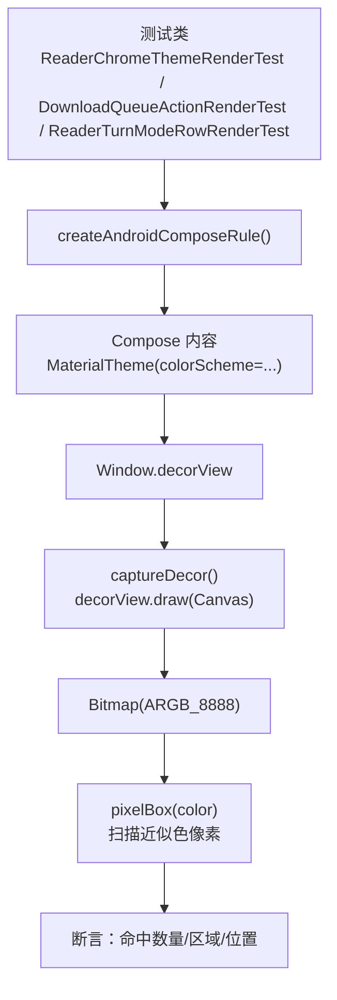
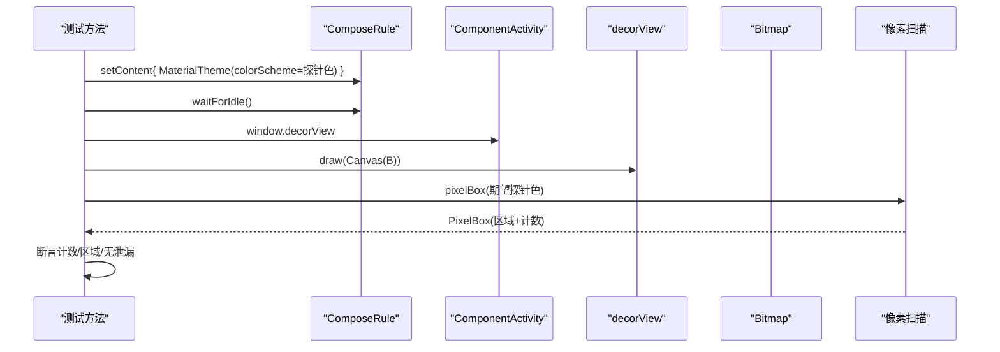
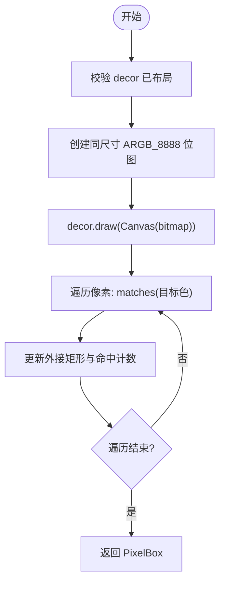
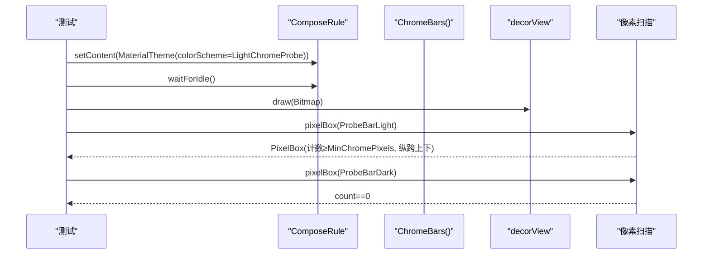
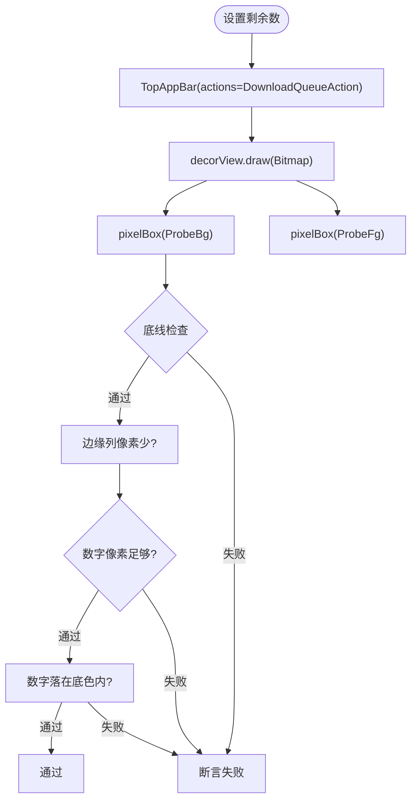
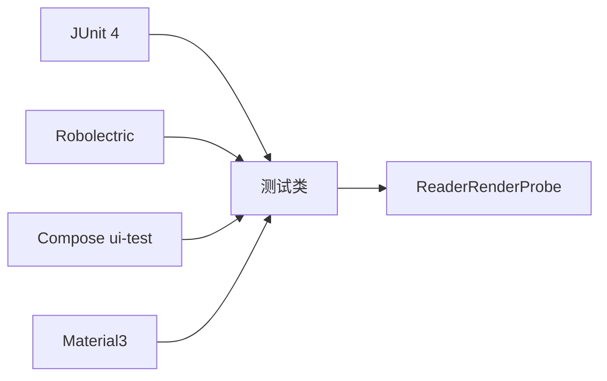

# Compose UI 测试

<cite>
**本文引用的文件**
- [ReaderRenderProbe.kt](file://module_book/src/test/java/com/ebook/book/reader/ReaderRenderProbe.kt)
- [ReaderChromeThemeRenderTest.kt](file://module_book/src/test/java/com/ebook/book/reader/ReaderChromeThemeRenderTest.kt)
- [DownloadQueueActionRenderTest.kt](file://module_book/src/test/java/com/ebook/book/page/DownloadQueueActionRenderTest.kt)
- [ReaderTurnModeRowRenderTest.kt](file://module_book/src/test/java/com/ebook/book/reader/ReaderTurnModeRowRenderTest.kt)
- [build.gradle.kts](file://module_book/build.gradle.kts)
- [libs.versions.toml](file://gradle/libs.versions.toml)
</cite>

## 目录
1. [简介](#简介)
2. [项目结构](#项目结构)
3. [核心组件](#核心组件)
4. [架构总览](#架构总览)
5. [详细组件分析](#详细组件分析)
6. [依赖分析](#依赖分析)
7. [性能与稳定性考量](#性能与稳定性考量)
8. [故障排查指南](#故障排查指南)
9. [结论](#结论)

## 简介
本仓库采用 Robolectric + Compose Testing 的渲染回归测试方案，重点验证“布局正确但像素错误”的问题（例如 Material3 默认颜色导致探针误判、Material3 自带裁剪把角标切掉等）。测试通过 createAndroidComposeRule<ComponentActivity>() 启动 Compose 树，等待空闲后，使用 decorView.draw(Canvas) 将整屏绘制到 Bitmap，再以“探针色 + 容差匹配 + 外接矩形扫描”的方式断言关键区域的像素分布。该方案在 Robolectric 暂停 looper 的场景下避免了 captureToImage 的超时问题，且能捕获被 clip 或主题色覆盖导致的真实渲染缺陷。

## 项目结构
- 测试位于 module_book 的 test source set，包含多个针对阅读器 chrome 层、翻页方式选择行、下载队列角标的渲染测试类。
- 通用取色与像素扫描能力集中在 ReaderRenderProbe.kt，供多个测试复用。
- 构建配置开启 includeAndroidResources 并引入 Robolectric 与 Compose ui-test bundle，保证资源可用与原生图形渲染。

图表来源
- [ReaderChromeThemeRenderTest.kt:41-47](file://module_book/src/test/java/com/ebook/book/reader/ReaderChromeThemeRenderTest.kt#L41-L47)
- [ReaderRenderProbe.kt:25-33](file://module_book/src/test/java/com/ebook/book/reader/ReaderRenderProbe.kt#L25-L33)
- [ReaderRenderProbe.kt:36-54](file://module_book/src/test/java/com/ebook/book/reader/ReaderRenderProbe.kt#L36-L54)

章节来源
- [build.gradle.kts:42-47](file://module_book/build.gradle.kts#L42-L47)
- [libs.versions.toml:67-68](file://gradle/libs.versions.toml#L67-L68)
- [libs.versions.toml:105-106](file://gradle/libs.versions.toml#L105-L106)

## 核心组件
- createAndroidComposeRule<ComponentActivity>()：基于 Compose ui-test-junit4 v2 的规则，启动 ComponentActivity 作为宿主，提供 setContent/waitForIdle 等能力。
- captureDecor(decor: View): Bitmap：将 decorView 同步绘制到 ARGB_8888 的 Bitmap，用于后续像素级分析。
- pixelBox(color: Color): PixelBox：扫描 Bitmap 中与目标 color 近似匹配的像素，计算其外接矩形与命中数；支持容差以抵御抗锯齿与色彩管理带来的偏差。
- ProbeBg / ProbeFg / 探针色策略：用“画面不可能自然出现”的颜色替换 Material3 语义色（如 error/onError、surfaceContainer、primaryContainer/secondaryContainer），确保命中即代表“确实按调板取色”，避免与默认背景撞色造成误判。

章节来源
- [ReaderRenderProbe.kt:25-33](file://module_book/src/test/java/com/ebook/book/reader/ReaderRenderProbe.kt#L25-L33)
- [ReaderRenderProbe.kt:36-78](file://module_book/src/test/java/com/ebook/book/reader/ReaderRenderProbe.kt#L36-L78)
- [ReaderChromeThemeRenderTest.kt:84-100](file://module_book/src/test/java/com/ebook/book/reader/ReaderChromeThemeRenderTest.kt#L84-L100)
- [ReaderTurnModeRowRenderTest.kt:69-85](file://module_book/src/test/java/com/ebook/book/reader/ReaderTurnModeRowRenderTest.kt#L69-L85)
- [DownloadQueueActionRenderTest.kt:65-85](file://module_book/src/test/java/com/ebook/book/page/DownloadQueueActionRenderTest.kt#L65-L85)

## 架构总览
测试流程围绕“主题切换 → 渲染 → 像素采样 → 断言”展开：
- 使用 @RunWith(RobolectricTestRunner::class)、@GraphicsMode(NATIVE)、@Config(sdk, qualifiers) 提供稳定设备规格与原生图形环境。
- 通过 MaterialTheme(colorScheme = ...) 注入探针色，触发 UI 按主题取色。
- waitForIdle() 等待 Compose 空闲，再执行 decorView 绘制与像素扫描。
- 断言包含“命中像素量下限”、“纵向覆盖范围”、“是否被裁剪”、“另一套调板的探针色不应出现”等。

图表来源
- [ReaderChromeThemeRenderTest.kt:84-100](file://module_book/src/test/java/com/ebook/book/reader/ReaderChromeThemeRenderTest.kt#L84-L100)
- [ReaderRenderProbe.kt:25-33](file://module_book/src/test/java/com/ebook/book/reader/ReaderRenderProbe.kt#L25-L33)
- [ReaderRenderProbe.kt:36-54](file://module_book/src/test/java/com/ebook/book/reader/ReaderRenderProbe.kt#L36-L54)

## 详细组件分析

### 渲染探针与像素断言（ReaderRenderProbe）
- captureDecor：先校验 decorView 已布局（宽高>0），再创建同尺寸 ARGB_8888 的 Bitmap 并调用 decor.draw 完成同步绘制。
- pixelBox：双重循环遍历像素，matches 判断 RGB 分量是否在容差范围内，统计命中点的外接矩形与数量；零命中返回空矩形以便断言顺序先判数量再判坐标。
- matches：将 Color 转为 RGB 整数并允许 ±ColorTolerance 偏差，兼容抗锯齿与色彩管理差异。
- PixelBox：封装 left/top/right/bottom/count，并提供 width/height/describe/contains 等辅助。

图表来源
- [ReaderRenderProbe.kt:25-33](file://module_book/src/test/java/com/ebook/book/reader/ReaderRenderProbe.kt#L25-L33)
- [ReaderRenderProbe.kt:36-78](file://module_book/src/test/java/com/ebook/book/reader/ReaderRenderProbe.kt#L36-L78)

章节来源
- [ReaderRenderProbe.kt:25-78](file://module_book/src/test/java/com/ebook/book/reader/ReaderRenderProbe.kt#L25-L78)

### 主题切换渲染测试（ReaderChromeThemeRenderTest）
- 使用 createAndroidComposeRule<ComponentActivity>() 挂载 Chrome 顶栏/底栏，并通过 state 变量在同一 setContent 中切换深浅色主题。
- 将 surfaceContainer 替换为探针色，分别定义 LightChromeProbe/DarkChromeProbe。
- 断言要点：
  - 期望探针色的像素量不低于阈值（MinChromePixels），确保两条栏都被着色。
  - 纵向范围需同时覆盖顶部四分之一与底部四分之三以上，防止仅一条栏翻色。
  - 非期望探针色应零命中，避免主题混用。

图表来源
- [ReaderChromeThemeRenderTest.kt:41-47](file://module_book/src/test/java/com/ebook/book/reader/ReaderChromeThemeRenderTest.kt#L41-L47)
- [ReaderChromeThemeRenderTest.kt:84-100](file://module_book/src/test/java/com/ebook/book/reader/ReaderChromeThemeRenderTest.kt#L84-L100)
- [ReaderChromeThemeRenderTest.kt:106-123](file://module_book/src/test/java/com/ebook/book/reader/ReaderChromeThemeRenderTest.kt#L106-L123)

章节来源
- [ReaderChromeThemeRenderTest.kt:41-135](file://module_book/src/test/java/com/ebook/book/reader/ReaderChromeThemeRenderTest.kt#L41-L135)

### 下载队列角标渲染测试（DownloadQueueActionRenderTest）
- 场景：书架顶栏下载角标在不同剩余位数（3/12/123/1234）下必须完整可见，不被 Material3 IconButton 容器裁剪。
- 探针策略：将 error/onError 替换为 ProbeBg/ProbeFg，避免默认白色数字与背景撞色无法区分。
- 断言要点：
  - 角标底色必须有像素，且宽度/高度不小于最小边长。
  - 右边界不能贴画布边缘（否则被裁）。
  - 左右最外两列底色像素极少（圆角收口），而非齐边切口。
  - 数字像素总量满足“每位至少若干像素 × 位数”。
  - 数字像素必须落在角标底色区域内。

图表来源
- [DownloadQueueActionRenderTest.kt:65-85](file://module_book/src/test/java/com/ebook/book/page/DownloadQueueActionRenderTest.kt#L65-L85)
- [DownloadQueueActionRenderTest.kt:101-121](file://module_book/src/test/java/com/ebook/book/page/DownloadQueueActionRenderTest.kt#L101-L121)
- [DownloadQueueActionRenderTest.kt:132-141](file://module_book/src/test/java/com/ebook/book/page/DownloadQueueActionRenderTest.kt#L132-L141)

章节来源
- [DownloadQueueActionRenderTest.kt:28-202](file://module_book/src/test/java/com/ebook/book/page/DownloadQueueActionRenderTest.kt#L28-L202)

### 翻页方式选择行渲染测试（ReaderTurnModeRowRenderTest）
- 场景：左右翻页/上下滚屏行的图标块底色随深浅色主题切换。
- 探针策略：将 primaryContainer/secondaryContainer 替换为探针色，分别定义浅/深两套 scheme。
- 断言要点：两行的探针色命中数均需超过阈值；另一套调板的探针色应零命中。

章节来源
- [ReaderTurnModeRowRenderTest.kt:25-135](file://module_book/src/test/java/com/ebook/book/reader/ReaderTurnModeRowRenderTest.kt#L25-L135)

### 为什么选择 decorView.draw 而不是 captureToImage
- Robolectric 的 paused looper 不驱动 frame commit 回调，compose 的 captureToImage 走 PixelCopy + frame commit callback，会超时。
- decorView.draw(Canvas) 是同步绘制，同样经过各级 clip 与主题渲染，得到与用户所见一致的位图，适合像素级断言。

章节来源
- [ReaderRenderProbe.kt:11-24](file://module_book/src/test/java/com/ebook/book/reader/ReaderRenderProbe.kt#L11-L24)
- [ReaderChromeThemeRenderTest.kt:31-40](file://module_book/src/test/java/com/ebook/book/reader/ReaderChromeThemeRenderTest.kt#L31-L40)
- [DownloadQueueActionRenderTest.kt:28-42](file://module_book/src/test/java/com/ebook/book/page/DownloadQueueActionRenderTest.kt#L28-L42)

## 依赖分析
- Robolectric：提供 JVM 上的 Android 模拟环境，使测试能在本地快速运行。
- Compose ui-test（ui-test-junit4、ui-test-manifest）：提供 createAndroidComposeRule 与测试用 Activity manifest。
- Material3：测试通过替换 colorScheme 中的语义色来注入探针色，确保 UI 行为符合主题约定。
- JUnit 4：测试框架基础。

图表来源
- [libs.versions.toml:45-68](file://gradle/libs.versions.toml#L45-L68)
- [libs.versions.toml:105-106](file://gradle/libs.versions.toml#L105-L106)
- [build.gradle.kts:75-86](file://module_book/build.gradle.kts#L75-L86)

章节来源
- [libs.versions.toml:45-68](file://gradle/libs.versions.toml#L45-L68)
- [libs.versions.toml:105-106](file://gradle/libs.versions.toml#L105-L106)
- [build.gradle.kts:75-86](file://module_book/build.gradle.kts#L75-L86)

## 性能与稳定性考量
- 像素扫描复杂度：O(W×H)，对典型手机分辨率可接受；建议尽量缩小感兴趣区域或减少重复扫描次数。
- 容差与稳定性：ColorTolerance=6 可抵御抗锯齿与色彩管理带来的微小偏差；若更换字体/密度/主题，需重新评估阈值。
- 资源与设备规格：@Config 固定 SDK 与屏幕密度，提高结果一致性。
- 避免多次 setContent：测试类使用可变状态切换主题，避免重复 setContent 抛出异常。

[本节为通用指导，不直接引用具体文件]

## 故障排查指南
- 像素全零或不符合预期：
  - 确认 decorView 已布局（宽高>0）后再绘制。
  - 确认 waitForIdle() 已调用，等待 Compose 完成一帧。
  - 检查探针色是否过于接近背景或文字色，必要时调整。
- 主题未生效：
  - 确认 MaterialTheme 包裹了被测组件。
  - 确认被替换的语义色确为组件实际使用的角色（如 surfaceContainer、error/onError、primaryContainer/secondaryContainer）。
- 角标被裁剪：
  - 检查 Material3 组件自带的 clip(shape) 行为，必要时调整布局或容器。
  - 通过 edgeColumnHeights 与 CapColumnMaxPx 判断是否为齐边切口。
- captureToImage 超时：
  - 改用 decorView.draw(Canvas) 方案，避免依赖 frame commit。

章节来源
- [ReaderRenderProbe.kt:25-33](file://module_book/src/test/java/com/ebook/book/reader/ReaderRenderProbe.kt#L25-L33)
- [ReaderChromeThemeRenderTest.kt:84-100](file://module_book/src/test/java/com/ebook/book/reader/ReaderChromeThemeRenderTest.kt#L84-L100)
- [DownloadQueueActionRenderTest.kt:101-121](file://module_book/src/test/java/com/ebook/book/page/DownloadQueueActionRenderTest.kt#L101-L121)

## 结论
本项目通过 Robolectric + Compose Testing 的组合，实现了稳定可靠的 Compose UI 渲染回归测试。借助探针色与像素级断言，能够精准捕获“布局正常但像素错误”的问题，尤其是 Material3 主题与裁剪带来的隐性缺陷。统一抽取的 ReaderRenderProbe 提升了复用性与可维护性，配合明确的断言语义与阈值，为后续迭代提供了坚实的质量保障。