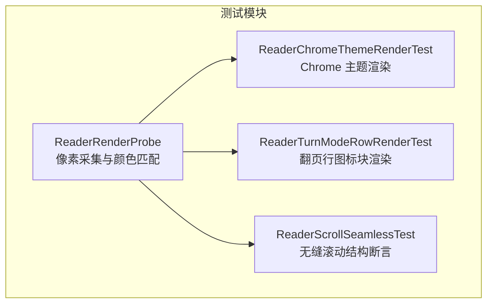
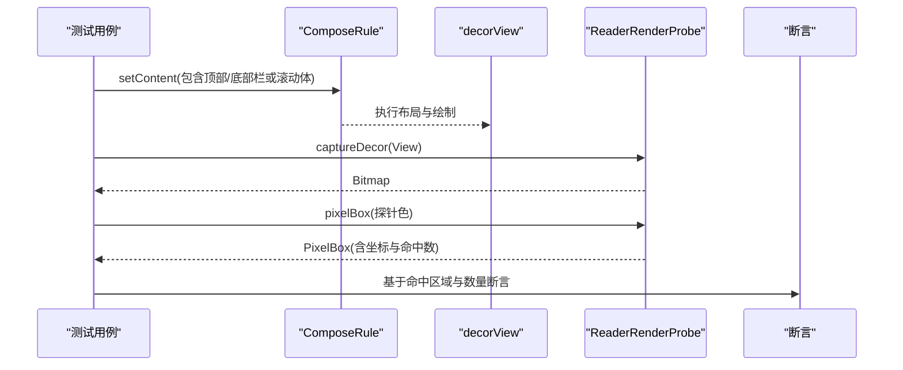
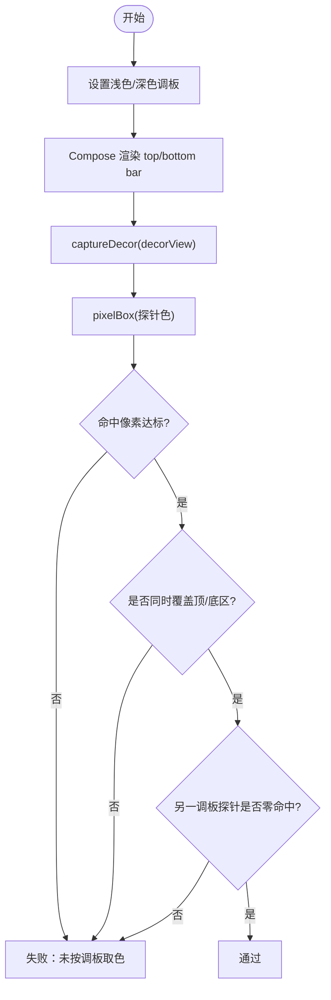
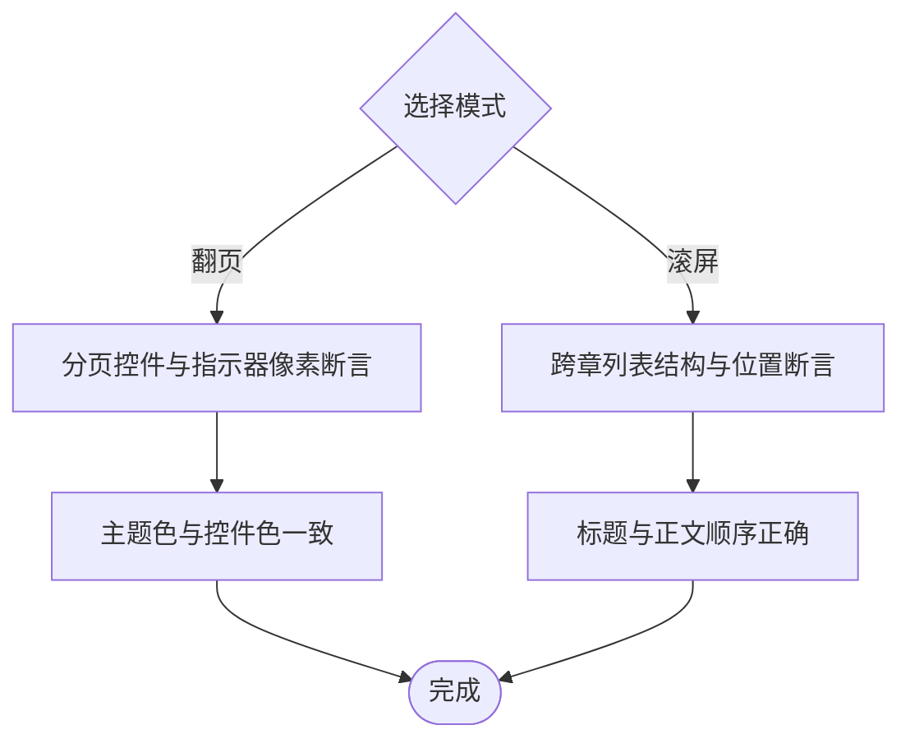
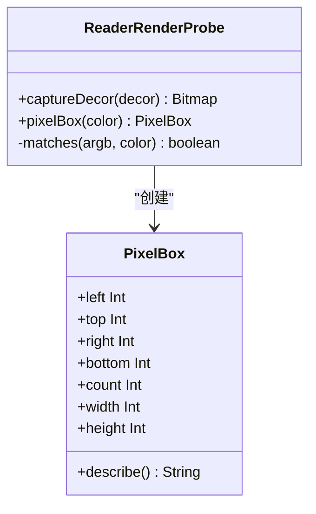
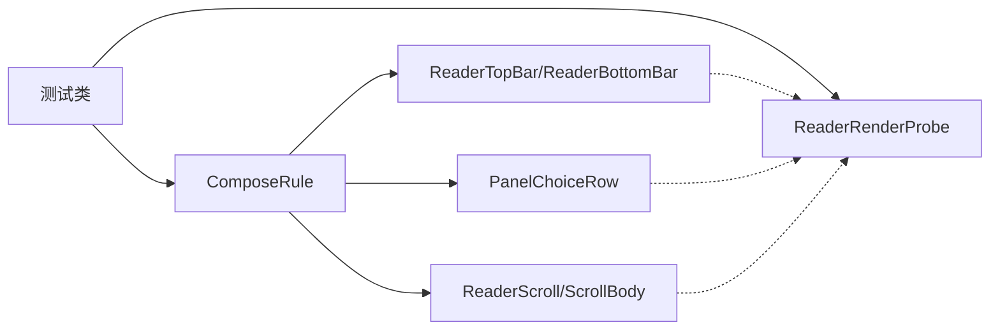

# UI 渲染测试

<cite>
**本文引用的文件**
- [ReaderRenderProbe.kt](file://module_book/src/test/java/com/ebook/book/reader/ReaderRenderProbe.kt)
- [ReaderChromeThemeRenderTest.kt](file://module_book/src/test/java/com/ebook/book/reader/ReaderChromeThemeRenderTest.kt)
- [ReaderTurnModeRowRenderTest.kt](file://module_book/src/test/java/com/ebook/book/reader/ReaderTurnModeRowRenderTest.kt)
- [ReaderScrollSeamlessTest.kt](file://module_book/src/test/java/com/ebook/book/reader/ReaderScrollSeamlessTest.kt)
</cite>

## 目录
1. [引言](#引言)
2. [项目结构](#项目结构)
3. [核心组件](#核心组件)
4. [架构总览](#架构总览)
5. [详细组件分析](#详细组件分析)
6. [依赖分析](#依赖分析)
7. [性能考虑](#性能考虑)
8. [故障排查指南](#故障排查指南)
9. [结论](#结论)
10. [附录：渲染测试用例清单与扩展建议](#附录：渲染测试用例清单与扩展建议)

## 引言
本文件面向“UI 渲染测试”，聚焦阅读器在多种阅读模式下的视觉回归保障。内容覆盖：
- Chrome（控制器层）主题渲染测试：深浅色切换后，顶栏/底栏等 UI 元素颜色是否严格跟随 Material 调板，避免硬编码颜色导致的反常白底或黑底。
- 翻页模式与滚屏模式的渲染差异：布局计算、分页逻辑、滚动行为的视觉验证要点。
- 无缝滚动的测试策略：跨章连续滚动的渲染正确性、锚点定位的准确性验证。
- ReaderRenderProbe 工具类：像素提取、颜色匹配、外接矩形计算等能力如何支撑上述断言。
- 具体渲染测试示例：不同设备密度适配、复杂布局场景的断言方法与实践。

## 项目结构
与 UI 渲染测试直接相关的代码集中在 module_book 的测试源集中，围绕 Compose 测试规则、Robolectric 环境以及自定义探针工具组织：
- 探针工具：ReaderRenderProbe.kt，提供将 decorView 绘制到 Bitmap 的能力，以及按颜色扫描像素并计算命中区域外接矩形的能力。
- 主题渲染测试：ReaderChromeThemeRenderTest.kt 针对控制器层（顶/底栏）的颜色来源进行像素级断言；ReaderTurnModeRowRenderTest.kt 针对翻页方式选择行的图标容器色做同样断言。
- 滚屏模式测试：ReaderScrollSeamlessTest.kt 断言跨章连续列表的结构与位置关系，保证无缝滚动体验。

图表来源
- [ReaderRenderProbe.kt:1-79](file://module_book/src/test/java/com/ebook/book/reader/ReaderRenderProbe.kt#L1-L79)
- [ReaderChromeThemeRenderTest.kt:1-136](file://module_book/src/test/java/com/ebook/book/reader/ReaderChromeThemeRenderTest.kt#L1-L136)
- [ReaderTurnModeRowRenderTest.kt:1-136](file://module_book/src/test/java/com/ebook/book/reader/ReaderTurnModeRowRenderTest.kt#L1-L136)
- [ReaderScrollSeamlessTest.kt:1-159](file://module_book/src/test/java/com/ebook/book/reader/ReaderScrollSeamlessTest.kt#L1-L159)

章节来源
- [ReaderRenderProbe.kt:1-79](file://module_book/src/test/java/com/ebook/book/reader/ReaderRenderProbe.kt#L1-L79)
- [ReaderChromeThemeRenderTest.kt:1-136](file://module_book/src/test/java/com/ebook/book/reader/ReaderChromeThemeRenderTest.kt#L1-L136)
- [ReaderTurnModeRowRenderTest.kt:1-136](file://module_book/src/test/java/com/ebook/book/reader/ReaderTurnModeRowRenderTest.kt#1-L136)
- [ReaderScrollSeamlessTest.kt:1-159](file://module_book/src/test/java/com/ebook/book/reader/ReaderScrollSeamlessTest.kt#L1-L159)

## 核心组件
- ReaderRenderProbe
  - 作用：把装饰视图绘制为位图，并在位图上扫描指定颜色像素，返回命中像素集合的外接矩形及计数，用于“颜色是否来自调板”的像素级断言。
  - 关键点：使用容差匹配抗锯齿带来的微小偏差；对外暴露 pixelBox 与 captureDecor。
- ReaderChromeThemeRenderTest
  - 作用：用替换过的 M3 colorScheme surfaceContainer 作为“探针色”，断言顶栏与底栏都随深浅色调翻转，且另一套调板的探针色不应出现。
- ReaderTurnModeRowRenderTest
  - 作用：对翻页方式选择行的图标容器色进行同样校验，确保两行都从当前调板取色。
- ReaderScrollSeamlessTest
  - 作用：断言上下滚屏模式下，跨章是“一条连续列表”，章节标题与正文顺序正确、无多余“上一章/下一章”链接项，且在块高未知时不塌陷。

章节来源
- [ReaderRenderProbe.kt:11-79](file://module_book/src/test/java/com/ebook/book/reader/ReaderRenderProbe.kt#L11-L79)
- [ReaderChromeThemeRenderTest.kt:23-136](file://module_book/src/test/java/com/ebook/book/reader/ReaderChromeThemeRenderTest.kt#L23-L136)
- [ReaderTurnModeRowRenderTest.kt:25-136](file://module_book/src/test/java/com/ebook/book/reader/ReaderTurnModeRowRenderTest.kt#L25-L136)
- [ReaderScrollSeamlessTest.kt:30-159](file://module_book/src/test/java/com/ebook/book/reader/ReaderScrollSeamlessTest.kt#L30-L159)

## 架构总览
下图展示了渲染测试的调用链：测试通过 Compose Rule 组装页面，利用 Robolectric 渲染出 decorView，再用 ReaderRenderProbe 将界面快照为位图，最后以“探针色”在位图上做像素扫描与几何断言。

图表来源
- [ReaderChromeThemeRenderTest.kt:84-123](file://module_book/src/test/java/com/ebook/book/reader/ReaderChromeThemeRenderTest.kt#L84-L123)
- [ReaderRenderProbe.kt:25-54](file://module_book/src/test/java/com/ebook/book/reader/ReaderRenderProbe.kt#L25-L54)

## 详细组件分析

### 主题渲染测试：Chrome 层
- 目标：顶栏与底栏的底色必须来自当前 colorScheme，不能写死常量色。
- 方法：
  - 构造两套 colorScheme，分别将 surfaceContainer 替换为“探针色”。
  - 渲染后抓取 decorView 位图，计算期望探针色的命中区域。
  - 断言：
    - 命中像素达到阈值（保证两栏都被绘制）。
    - 纵向覆盖范围同时触及顶部与底部区域（防止仅翻了一栏）。
    - 另一套调板的探针色命中数为零（防止漏色）。
- 为什么用像素而非语义：当某处被写回常量色时，语义和布局可能仍然“看起来正确”，只有像素能捕获这类回归。

图表来源
- [ReaderChromeThemeRenderTest.kt:84-123](file://module_book/src/test/java/com/ebook/book/reader/ReaderChromeThemeRenderTest.kt#L84-L123)
- [ReaderRenderProbe.kt:25-54](file://module_book/src/test/java/com/ebook/book/reader/ReaderRenderProbe.kt#L25-L54)

章节来源
- [ReaderChromeThemeRenderTest.kt:23-136](file://module_book/src/test/java/com/ebook/book/reader/ReaderChromeThemeRenderTest.kt#L23-L136)
- [ReaderRenderProbe.kt:11-79](file://module_book/src/test/java/com/ebook/book/reader/ReaderRenderProbe.kt#L11-L79)

### 翻页方式选择行渲染
- 目标：左右翻页与上下滚屏的选择行，其图标容器色必须随当前调板变化。
- 方法：
  - 将 primaryContainer/secondaryContainer 替换为探针色。
  - 渲染后对两个颜色分别扫描，要求两者均达到最小命中像素。
  - 检查另一套调板的两种探针色均零命中。
- 价值：防止某一行被写死颜色，导致深浅色切换后图标块仍显示错误背景。

章节来源
- [ReaderTurnModeRowRenderTest.kt:25-136](file://module_book/src/test/java/com/ebook/book/reader/ReaderTurnModeRowRenderTest.kt#L25-L136)
- [ReaderRenderProbe.kt:11-79](file://module_book/src/test/java/com/ebook/book/reader/ReaderRenderProbe.kt#L11-L79)

### 翻页模式 vs 滚屏模式：渲染差异与断言策略
- 翻页模式（左右翻页）
  - 关注点：每屏边界、分页逻辑、横滑交互。
  - 断言建议：
    - 通过 ReaderRenderProbe 对分页指示器、页码控件、分割线等进行像素采样，验证其在浅/深主题下是否正确着色。
    - 对“上一页/下一页”按钮、进度条、章节切换按钮的背景/前景色进行探针色断言。
- 滚屏模式（上下滚屏）
  - 关注点：跨章连续列表、章节标题与正文顺序、锚点定位。
  - 断言建议：
    - 使用 ReaderScrollSeamlessTest 的思路：断言章节标题位于上一节末块之下，下一章首块位于其标题之下。
    - 断言不存在多余的“上一章/下一章”链接项（由列表本身承担跨章导航）。
    - 在块高未知时，确保占位高度不为零，避免空白或塌陷。

[此图为概念流程，不映射到具体源码]

### 无缝滚动测试策略
- 关键断言：
  - 章节间没有额外链接项，章节标题紧接上一节末块下方。
  - 下一章的首块紧跟在其标题之后。
  - 首次落点应用之前不会错误地将进度写入列表首项所在章节。
  - 块高未知时，渲染体不塌陷为零高度。
- 意义：保证用户从一章滚动到下一章时体验连贯，不会出现错位、空白或重复入口。

章节来源
- [ReaderScrollSeamlessTest.kt:57-159](file://module_book/src/test/java/com/ebook/book/reader/ReaderScrollSeamlessTest.kt#L57-L159)

### ReaderRenderProbe 工具类详解
- 能力：
  - captureDecor：将 decorView 绘制到 ARGB_8888 位图，便于后续像素扫描。
  - pixelBox：遍历像素，统计与目标 Color 近似匹配的像素，并计算命中区域的外接矩形与命中数。
  - matches：在 RGB 空间上以固定容差比较，容忍抗锯齿与色彩管理带来的微小偏差。
  - PixelBox：描述命中区域的 left/top/right/bottom/count，并提供 width/height 与可读描述。
- 设计动机：
  - 避免使用 Compose captureToImage 在 Robolectric 中因 looper 暂停导致的超时问题。
  - 将“某个角色被写回常量”的颜色回归统一为像素级判据，减少 UI 文案/布局正常但颜色错误的漏报。

图表来源
- [ReaderRenderProbe.kt:25-75](file://module_book/src/test/java/com/ebook/book/reader/ReaderRenderProbe.kt#L25-L75)

章节来源
- [ReaderRenderProbe.kt:11-79](file://module_book/src/test/java/com/ebook/book/reader/ReaderRenderProbe.kt#L11-L79)

## 依赖分析
- 测试运行时依赖：
  - Compose Testing JUnit4 v2：用于构建 Compose 树与等待渲染稳定。
  - Robolectric：模拟 Android 环境，配合 @GraphicsMode(NATIVE) 启用原生图形渲染。
- 被测组件依赖：
  - ReaderTopBar/ReaderBottomBar：Chrome 控制层组件，颜色应来自全局 Material 调板。
  - PanelChoiceRow：翻页方式选择行，图标容器色需随调板切换。
  - ReaderScroll/ScrollBody：滚屏模式容器，负责跨章列表结构与锚点行为。
- 工具依赖：
  - ReaderRenderProbe：提供位图捕获与像素扫描能力，是主题与颜色回归的核心基础设施。

图表来源
- [ReaderChromeThemeRenderTest.kt:84-123](file://module_book/src/test/java/com/ebook/book/reader/ReaderChromeThemeRenderTest.kt#L84-L123)
- [ReaderTurnModeRowRenderTest.kt:69-116](file://module_book/src/test/java/com/ebook/book/reader/ReaderTurnModeRowRenderTest.kt#L69-L116)
- [ReaderScrollSeamlessTest.kt:57-159](file://module_book/src/test/java/com/ebook/book/reader/ReaderScrollSeamlessTest.kt#L57-L159)
- [ReaderRenderProbe.kt:25-75](file://module_book/src/test/java/com/ebook/book/reader/ReaderRenderProbe.kt#L25-L75)

章节来源
- [ReaderChromeThemeRenderTest.kt:84-123](file://module_book/src/test/java/com/ebook/book/reader/ReaderChromeThemeRenderTest.kt#L84-L123)
- [ReaderTurnModeRowRenderTest.kt:69-116](file://module_book/src/test/java/com/ebook/book/reader/ReaderTurnModeRowRenderTest.kt#L69-L116)
- [ReaderScrollSeamlessTest.kt:57-159](file://module_book/src/test/java/com/ebook/book/reader/ReaderScrollSeamlessTest.kt#L57-L159)
- [ReaderRenderProbe.kt:25-75](file://module_book/src/test/java/com/ebook/book/reader/ReaderRenderProbe.kt#L25-L75)

## 性能考虑
- 像素扫描复杂度：pixelBox 对位图进行逐像素遍历，时间复杂度 O(W×H)。对于高分辨率屏幕，建议：
  - 限制测试视口尺寸（如 w411dp-h891dp-xhdpi），降低位图大小。
  - 仅在必要区域扫描（可结合坐标裁剪，但当前实现为整图扫描）。
- 渲染开销：Robolectric 开启 NATIVE 图形模式会引入更多系统资源消耗，建议在 CI 中合理并行化测试任务。
- 内存占用：ARGB_8888 位图较大，频繁分配可能造成 GC 压力，建议复用位图或在测试结束后及时释放（框架会自动回收，但在大量测试中需注意）。

## 故障排查指南
- 探针色零命中
  - 可能原因：组件未渲染、颜色未被应用到预期区域、探针色选择不当。
  - 排查步骤：确认窗口已布局（宽高>0），调整探针色或容差，增加最小命中像素阈值。
- 只命中一侧（仅顶栏或仅底栏）
  - 可能原因：另一侧仍使用硬编码颜色或未被组合。
  - 排查步骤：检查 chrome 层组件的主题接入，确保两条栏都从 colorScheme 取色。
- 另一套调板探针色泄漏
  - 可能原因：存在静态缓存或未刷新主题状态。
  - 排查步骤：确保每次切换主题后 waitForIdle，重新渲染后再采样。
- 滚屏模式结构异常
  - 可能原因：章节标题与正文顺序错乱、缺少跨章衔接。
  - 排查步骤：核对 LazyColumn 的 key 与锚点策略，确认块高未知时有占位高度。

章节来源
- [ReaderRenderProbe.kt:25-75](file://module_book/src/test/java/com/ebook/book/reader/ReaderRenderProbe.kt#L25-L75)
- [ReaderChromeThemeRenderTest.kt:84-123](file://module_book/src/test/java/com/ebook/book/reader/ReaderChromeThemeRenderTest.kt#L84-L123)
- [ReaderScrollSeamlessTest.kt:91-159](file://module_book/src/test/java/com/ebook/book/reader/ReaderScrollSeamlessTest.kt#L91-L159)

## 结论
本项目通过 ReaderRenderProbe 提供的像素级能力，结合 Compose 测试与 Robolectric，构建了稳固的 UI 渲染回归防线：
- Chrome 主题渲染测试确保顶/底栏颜色始终来自调板，避免深浅色切换后的反常白/黑底。
- 翻页方式选择行测试确保图标容器色随调板切换，防止单行颜色固化。
- 滚屏模式测试确保跨章连续列表的结构与位置正确，提升无缝滚动体验。
这些测试覆盖了常见的颜色回归与布局回归场景，能够有效降低视觉缺陷流入生产环境的概率。

## 附录：渲染测试用例清单与扩展建议
- 现有用例
  - Chrome 主题渲染：ReaderChromeThemeRenderTest
  - 翻页行渲染：ReaderTurnModeRowRenderTest
  - 滚屏无缝结构：ReaderScrollSeamlessTest
- 可扩展场景
  - 不同设备密度适配：在同一 Config 下扩展多组 qualifiers（如 xxhdpi、xxxhdpi），验证像素比例与命中阈值。
  - 复杂布局验证：对目录抽屉、设置面板、亮度/字体调节控件进行探针色断言。
  - 分页控件验证：对翻页指示器、进度条、页码文本前景色进行像素级断言。
  - 深色模式边框与阴影：在深色主题下验证分隔线与阴影对比度是否符合无障碍要求。
  - 动态主题切换：在运行期切换主题后重采样，确保缓存或状态未污染下一帧。