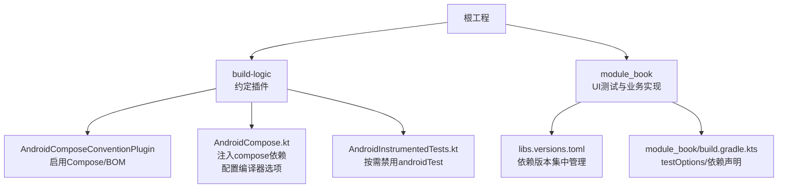
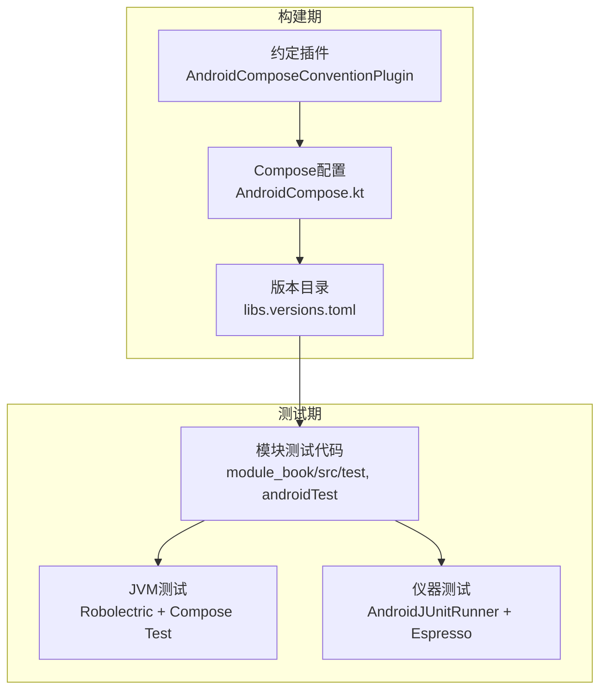
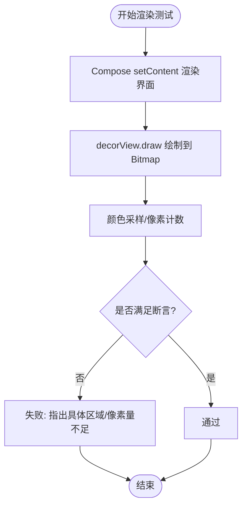
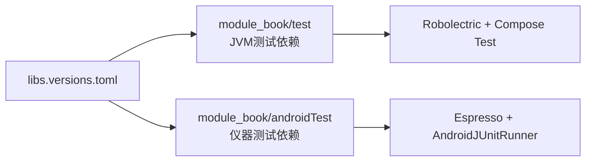

# UI测试

<cite>
**本文引用的文件**
- [README.MD](file://README.MD)
- [AndroidCompose.kt](file://build-logic/convention/src/main/kotlin/com/xrn1997/convention/AndroidCompose.kt)
- [AndroidInstrumentedTests.kt](file://build-logic/convention/src/main/kotlin/com/xrn1997/convention/AndroidInstrumentedTests.kt)
- [AndroidComposeConventionPlugin.kt](file://build-logic/convention/src/main/kotlin/AndroidComposeConventionPlugin.kt)
- [libs.versions.toml](file://gradle/libs.versions.toml)
- [module_book/build.gradle.kts](file://module_book/build.gradle.kts)
- [DownloadQueueActionRenderTest.kt](file://module_book/src/test/java/com/ebook/book/page/DownloadQueueActionRenderTest.kt)
- [ReaderRenderProbe.kt](file://module_book/src/test/java/com/ebook/book/reader/ReaderRenderProbe.kt)
</cite>

## 目录
1. [简介](#简介)
2. [项目结构](#项目结构)
3. [核心组件](#核心组件)
4. [架构总览](#架构总览)
5. [详细组件分析](#详细组件分析)
6. [依赖分析](#依赖分析)
7. [性能考量](#性能考量)
8. [故障排查指南](#故障排查指南)
9. [结论](#结论)
10. [附录](#附录)

## 简介
本文件面向Compose UI测试，围绕“配置与环境搭建、渲染断言、交互与状态验证、页面流程、工具与Mock”五个维度，结合本项目在构建约定、模块依赖与现有测试实践中的事实，给出可落地的策略与最佳实践。项目已全面迁移到Jetpack Compose（含阅读器），并通过约定插件统一注入Compose能力与BOM；测试侧采用Robolectric原生图形模式进行像素级回归，并借助Compose Test API进行语义与布局断言。

## 项目结构
- 构建系统通过build-logic的约定插件为各模块统一开启Compose编译、注入Compose BOM及测试相关依赖；无androidTest源码的模块自动禁用仪器化测试以避免空跑。
- module_book是主要的UI测试落地位置：单元测试使用JVM测试（Robolectric）执行Composable渲染回归；仪器化测试使用AndroidJUnitRunner承载UI自动化用例。
- 版本目录集中管理Compose、Espresso、Hilt测试、Robolectric等依赖版本，确保跨模块一致。

**图示来源**
- [AndroidComposeConventionPlugin.kt:37-58](file://build-logic/convention/src/main/kotlin/AndroidComposeConventionPlugin.kt#L37-L58)
- [AndroidCompose.kt:29-74](file://build-logic/convention/src/main/kotlin/com/xrn1997/convention/AndroidCompose.kt#L29-L74)
- [AndroidInstrumentedTests.kt:30-35](file://build-logic/convention/src/main/kotlin/com/xrn1997/convention/AndroidInstrumentedTests.kt#L30-L35)
- [libs.versions.toml:72-106](file://gradle/libs.versions.toml#L72-L106)
- [module_book/build.gradle.kts:42-96](file://module_book/build.gradle.kts#L42-L96)

**章节来源**
- [AndroidComposeConventionPlugin.kt:37-58](file://build-logic/convention/src/main/kotlin/AndroidComposeConventionPlugin.kt#L37-L58)
- [AndroidCompose.kt:29-74](file://build-logic/convention/src/main/kotlin/com/xrn1997/convention/AndroidCompose.kt#L29-L74)
- [AndroidInstrumentedTests.kt:30-35](file://build-logic/convention/src/main/kotlin/com/xrn1997/convention/AndroidInstrumentedTests.kt#L30-L35)
- [libs.versions.toml:72-106](file://gradle/libs.versions.toml#L72-L106)
- [module_book/build.gradle.kts:42-96](file://module_book/build.gradle.kts#L42-L96)

## 核心组件
- Compose编译与依赖注入
  - 通过约定插件为应用/库模块统一开启Compose，注入Compose BOM与测试所需依赖；仅在存在androidTest时注入androidTestImplementation的BOM，避免多余告警。
  - 支持可选的Compose Compiler指标与报告输出路径，便于质量度量。
- 测试环境与运行器
  - 单元测试：JVM测试，启用Robolectric读取合并资源；用于需要Context/资源的回归场景。
  - 仪器测试：AndroidJUnitRunner作为默认runner，配合Espresso与Compose测试API。
- 像素级渲染验证
  - 通过Robolectric原生图形模式+decorView绘制到Bitmap，再进行颜色采样与边界判定，实现对“被裁剪但布局正确”的缺陷进行捕获。
  - 抽取通用探针工具，复用像素扫描与容差匹配逻辑。

**章节来源**
- [AndroidCompose.kt:32-74](file://build-logic/convention/src/main/kotlin/com/xrn1997/convention/AndroidCompose.kt#L32-L74)
- [module_book/build.gradle.kts:42-96](file://module_book/build.gradle.kts#L42-L96)
- [DownloadQueueActionRenderTest.kt:43-49](file://module_book/src/test/java/com/ebook/book/page/DownloadQueueActionRenderTest.kt#L43-L49)
- [ReaderRenderProbe.kt:25-78](file://module_book/src/test/java/com/ebook/book/reader/ReaderRenderProbe.kt#L25-L78)

## 架构总览
下图展示了Compose UI测试在本项目中的整体协作关系：构建约定提供能力与依赖，模块内编写测试用例，JVM侧用Robolectric做渲染回归，仪器侧用真实设备/模拟器执行端到端流程。

**图示来源**
- [AndroidComposeConventionPlugin.kt:37-58](file://build-logic/convention/src/main/kotlin/AndroidComposeConventionPlugin.kt#L37-L58)
- [AndroidCompose.kt:29-74](file://build-logic/convention/src/main/kotlin/com/xrn1997/convention/AndroidCompose.kt#L29-L74)
- [libs.versions.toml:72-106](file://gradle/libs.versions.toml#L72-L106)
- [module_book/build.gradle.kts:42-96](file://module_book/build.gradle.kts#L42-L96)

## 详细组件分析

### 配置与环境搭建
- 启用Compose与BOM
  - 通过约定插件为模块应用或库统一开启Compose，并注入Compose BOM；androidTest依赖按是否存在androidTest源码决定注入，避免无效告警。
  - 支持设置Compose Compiler指标与报告输出目录，便于定位重组问题。
- 测试运行器与资源
  - 模块默认instrumentation runner为AndroidJUnitRunner；单元测试启用includeAndroidResources以支持读取资源（如字符串）。
  - 测试依赖包含Compose UI测试、Manifest辅助包，以及Hilt测试注解处理器（androidTest需显式声明kspAndroidTest以生成测试组件）。
- Robolectric环境
  - 通过@GraphicsMode(NATIVE)启用原生图形，避免软件渲染差异；结合@Config指定屏幕密度/尺寸以稳定像素断言。

**章节来源**
- [AndroidCompose.kt:32-74](file://build-logic/convention/src/main/kotlin/com/xrn1997/convention/AndroidCompose.kt#L32-L74)
- [module_book/build.gradle.kts:42-96](file://module_book/build.gradle.kts#L42-L96)
- [libs.versions.toml:72-106](file://gradle/libs.versions.toml#L72-L106)

### Compose测试规则初始化与Activity配置
- 测试中通过createAndroidComposeRule<ComponentActivity>()创建Compose测试规则，用于setContent与等待渲染完成。
- 测试Activity使用ComponentActivity作为宿主，无需额外配置即可组合任意Composable进行验证。
- 对主题与配色敏感的用例，可在setContent内覆盖MaterialTheme，将关键色彩替换为探针色，以便像素比对更稳定。

**章节来源**
- [DownloadQueueActionRenderTest.kt:43-94](file://module_book/src/test/java/com/ebook/book/page/DownloadQueueActionRenderTest.kt#L43-L94)

### UI渲染测试（像素级断言）
- 取图方式：调用decorView.draw(Canvas)同步绘制到Bitmap，避免captureToImage在Robolectric下因Looper未驱动而超时的问题。
- 断言策略：
  - 颜色采样：定义探针色，统计近似命中像素的外接矩形与数量，判断是否完整绘制。
  - 边界与裁剪：检测画布边缘列高或右侧贴边，识别被clip裁切的情况。
  - 文本/图标：按字符宽度估算最小像素数，断言数字/图标是否完整可见。
- 通用化：将取图、颜色匹配、外接矩形计算抽离为探针工具，供多个测试复用。

**图示来源**
- [DownloadQueueActionRenderTest.kt:132-186](file://module_book/src/test/java/com/ebook/book/page/DownloadQueueActionRenderTest.kt#L132-L186)
- [ReaderRenderProbe.kt:25-78](file://module_book/src/test/java/com/ebook/book/reader/ReaderRenderProbe.kt#L25-L78)

**章节来源**
- [DownloadQueueActionRenderTest.kt:28-202](file://module_book/src/test/java/com/ebook/book/page/DownloadQueueActionRenderTest.kt#L28-L202)
- [ReaderRenderProbe.kt:11-78](file://module_book/src/test/java/com/ebook/book/reader/ReaderRenderProbe.kt#L11-L78)

### 用户交互测试（手势与事件响应）
- 推荐实践：
  - 使用Compose测试API查找可交互节点并进行点击、长按、滑动等操作，随后waitForIdle等待状态更新。
  - 针对异步加载或动画，使用awaiting条件或延时策略，确保界面处于稳定态后再断言。
  - 对复杂手势（如滑页、缩放）建议使用UiAutomator或Espresso配合Compose节点进行跨层操作。
- 状态变化验证：
  - 通过语义节点查询文本、状态、内容描述等，确认交互后UI状态符合预期。
  - 对于受主题/配色影响的UI，可通过主题覆盖+探针色降低误报。

[本节为通用方法说明，不直接分析具体文件]

### 页面流程测试（导航与工作流）
- 多页面跳转：
  - 基于TheRouter暴露的页面入口，在测试中触发路由跳转；独立模式下需确保占位路由可用。
  - 使用Navigation测试API或Espresso操作返回栈，验证页面顺序与参数传递。
- 导航状态验证：
  - 检查当前页面标题、菜单项、底部导航选中状态等，间接验证导航是否正确。
  - 对鉴权流程，可通过Mock网络或本地状态切换模拟登录态，观察导航结果。
- 用户工作流：
  - 从首页到详情页再到阅读页的端到端路径，建议拆分为多步测试，每步聚焦一个子流程，提高稳定性与可读性。

[本节为通用方法说明，不直接分析具体文件]

### 测试数据与Mock服务
- 资源与数据：
  - 单元测试通过includeAndroidResources读取合并资源；仪器测试可使用assets与测试数据库。
- Mock服务：
  - 网络层通过real/mock双flavor切换；测试中可替换NetworkModule以返回固定响应或错误分支。
  - 对书源解析与沙箱执行器，可通过注入Fake实现隔离外部依赖，保证测试确定性。
- 数据库：
  - 使用内存数据库或预置种子数据进行DAO与Repository层验证，避免磁盘IO影响稳定性。

[本节为通用方法说明，不直接分析具体文件]

### 示例与最佳实践
- 复杂UI组件：
  - 将不可变状态提升到顶层State，减少副作用；使用探针色与像素断言锁定易变细节。
  - 对列表项与动态内容，确保key稳定且唯一，避免重排导致的断言不稳定。
- 动画效果：
  - 对过渡动画，优先使用语义断言而非帧截图；必要时延长等待或使用条件等待。
- 响应式界面：
  - 使用Flow/StateFlow驱动UI状态，测试中通过触发变更并等待稳定态来断言。

[本节为通用方法说明，不直接分析具体文件]

## 依赖分析
- 依赖集中管理：
  - Compose、Espresso、Hilt测试、Robolectric等依赖通过版本目录统一管理，避免版本漂移。
- 测试依赖分层：
  - JVM测试：junit、robolectric、compose ui-test（含manifest）、coroutines test。
  - 仪器测试：espresso-core、androidx test ext junit、hilt android testing（含kspAndroidTest）。
- 模块耦合与内聚：
  - 测试代码位于对应模块的test/androidTest目录，遵循单一职责；通用探针工具抽取到reader包内复用。

**图示来源**
- [libs.versions.toml:72-106](file://gradle/libs.versions.toml#L72-L106)
- [module_book/build.gradle.kts:75-96](file://module_book/build.gradle.kts#L75-L96)

**章节来源**
- [libs.versions.toml:72-106](file://gradle/libs.versions.toml#L72-L106)
- [module_book/build.gradle.kts:75-96](file://module_book/build.gradle.kts#L75-L96)

## 性能考量
- 测试并行与缓存：
  - 合理拆分测试用例，避免单用例过长；利用Gradle并行构建提升CI速度。
- 渲染测试开销：
  - 像素级测试耗时较高，建议仅覆盖高风险组件；批量用例可限定设备规格以减少波动。
- 资源与Mock：
  - 使用内存数据库与静态JSON资产，避免真实I/O；对网络请求一律Mock，缩短测试周期。

[本节提供通用指导，不直接分析具体文件]

## 故障排查指南
- Compose测试超时：
  - 若使用captureToImage遇到超时，改用decorView.draw同步取图（参考现有测试实现）。
- 资源未生效：
  - 确保单元测试开启includeAndroidResources；检查模块build.gradle.kts中testOptions配置。
- 注入为空：
  - androidTest中若使用Hilt测试注解，需显式声明kspAndroidTest以生成测试组件。
- 像素断言不稳定：
  - 调整探针色容差与屏幕密度配置；确保界面完全布局后再取图。

**章节来源**
- [DownloadQueueActionRenderTest.kt:132-186](file://module_book/src/test/java/com/ebook/book/page/DownloadQueueActionRenderTest.kt#L132-L186)
- [ReaderRenderProbe.kt:25-78](file://module_book/src/test/java/com/ebook/book/reader/ReaderRenderProbe.kt#L25-L78)
- [module_book/build.gradle.kts:42-96](file://module_book/build.gradle.kts#L42-L96)

## 结论
本项目通过约定插件与版本目录统一了Compose与测试依赖，形成了稳定的测试基座。在UI测试层面，结合Compose Test API进行语义与交互断言，并利用Robolectric原生图形进行像素级回归，有效捕获“布局正确但被裁剪”等隐蔽问题。建议在后续迭代中继续扩展交互与流程测试，完善Mock策略，逐步提升覆盖率与稳定性。

## 附录
- 快速命令
  - 单元测试：./gradlew test
  - 仪器测试：./gradlew connectedAndroidTest
- 相关文件
  - 构建约定与插件：build-logic
  - 版本目录：gradle/libs.versions.toml
  - 模块测试：module_book/src/test, module_book/src/androidTest

[本节为补充信息，不直接分析具体文件]