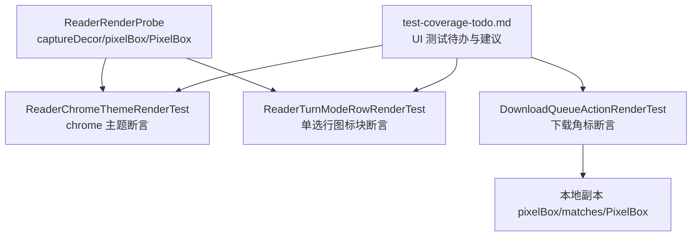
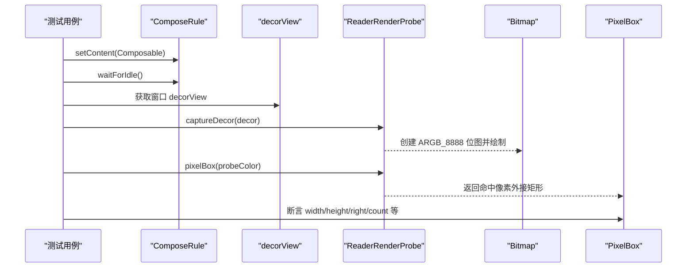
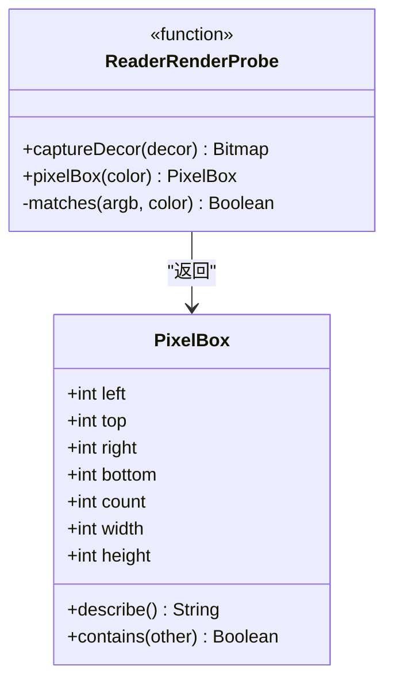
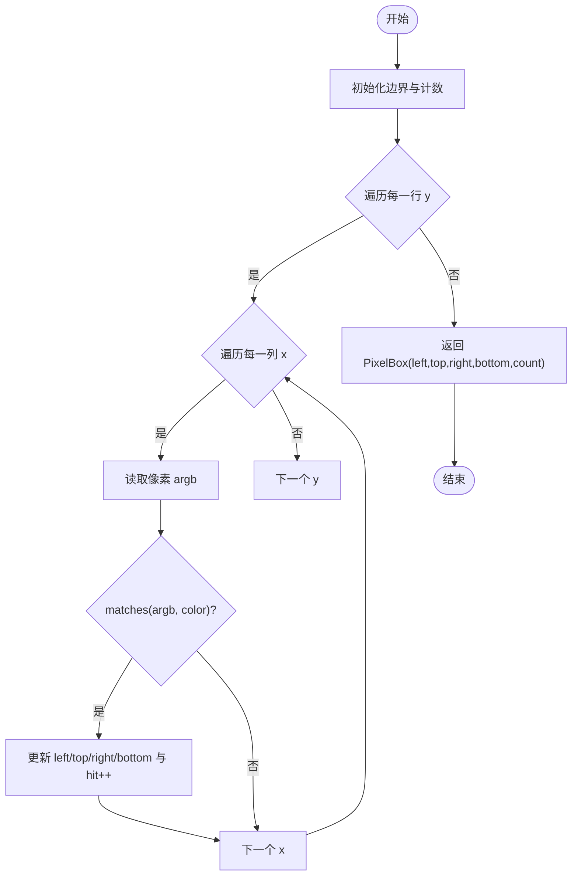
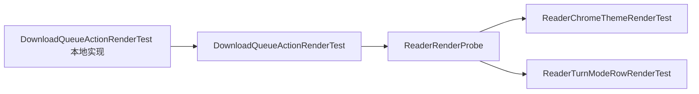

# 测试工具与辅助

<cite>
**本文引用的文件**
- [ReaderRenderProbe.kt](file://module_book/src/test/java/com/ebook/book/reader/ReaderRenderProbe.kt)
- [DownloadQueueActionRenderTest.kt](file://module_book/src/test/java/com/ebook/book/page/DownloadQueueActionRenderTest.kt)
- [ReaderChromeThemeRenderTest.kt](file://module_book/src/test/java/com/ebook/book/reader/ReaderChromeThemeRenderTest.kt)
- [ReaderTurnModeRowRenderTest.kt](file://module_book/src/test/java/com/ebook/book/reader/ReaderTurnModeRowRenderTest.kt)
- [test-coverage-todo.md](file://docs/test-coverage-todo.md)
</cite>

## 目录
1. [简介](#简介)
2. [项目结构](#项目结构)
3. [核心组件](#核心组件)
4. [架构总览](#架构总览)
5. [详细组件分析](#详细组件分析)
6. [依赖关系分析](#依赖关系分析)
7. [性能考量](#性能考量)
8. [故障排查指南](#故障排查指南)
9. [结论](#结论)
10. [附录](#附录)

## 简介
本文件聚焦于为 UI 测试提供的通用工具，尤其是阅读器渲染回归检测的“探针”能力：将 View 绘制到 Bitmap、在像素层按颜色匹配提取目标区域、并以数据对象承载结果。文档围绕 ReaderRenderProbe 工具类展开，解释 captureDecor()、pixelBox()、PixelBox 的设计与实现，说明颜色匹配算法（含容差与抗锯齿考虑）、测试常量（ColorTolerance、BadgeMinSize 等）的设计依据，并给出在不同测试场景中的复用方式与最佳实践。同时总结测试数据准备与 Mock 策略，帮助读者在 Compose/Robolectric 环境下稳定地做像素级断言。

## 项目结构
与本次主题相关的代码集中在 module_book 的测试源集下：
- ReaderRenderProbe.kt：提供通用的装饰视图捕获与像素盒计算能力
- DownloadQueueActionRenderTest.kt：使用像素断言验证下载角标完整渲染
- ReaderChromeThemeRenderTest.kt：验证阅读器 chrome 层随深浅色主题切换
- ReaderTurnModeRowRenderTest.kt：验证翻页方式单选行图标块底色随主题变化
- test-coverage-todo.md：记录 Compose UI 测试现状与补充方向（包括像素断言回路的推荐用法）

图表来源
- [ReaderRenderProbe.kt:1-79](file://module_book/src/test/java/com/ebook/book/reader/ReaderRenderProbe.kt#L1-L79)
- [ReaderChromeThemeRenderTest.kt:1-100](file://module_book/src/test/java/com/ebook/book/reader/ReaderChromeThemeRenderTest.kt#L1-L100)
- [ReaderTurnModeRowRenderTest.kt:1-80](file://module_book/src/test/java/com/ebook/book/reader/ReaderTurnModeRowRenderTest.kt#L1-L80)
- [DownloadQueueActionRenderTest.kt:1-202](file://module_book/src/test/java/com/ebook/book/page/DownloadQueueActionRenderTest.kt#L1-L202)
- [test-coverage-todo.md:71-79](file://docs/test-coverage-todo.md#L71-L79)

章节来源
- [ReaderRenderProbe.kt:1-79](file://module_book/src/test/java/com/ebook/book/reader/ReaderRenderProbe.kt#L1-L79)
- [DownloadQueueActionRenderTest.kt:1-202](file://module_book/src/test/java/com/ebook/book/page/DownloadQueueActionRenderTest.kt#L1-L202)
- [ReaderChromeThemeRenderTest.kt:1-100](file://module_book/src/test/java/com/ebook/book/reader/ReaderChromeThemeRenderTest.kt#L1-L100)
- [ReaderTurnModeRowRenderTest.kt:1-80](file://module_book/src/test/java/com/ebook/book/reader/ReaderTurnModeRowRenderTest.kt#L1-L80)
- [test-coverage-todo.md:71-79](file://docs/test-coverage-todo.md#L71-L79)

## 核心组件
- ReaderRenderProbe：顶层函数与数据类，用于将 decorView 绘制成 Bitmap，并在像素层进行颜色近似匹配，返回命中像素的外接矩形 PixelBox；提供 ColorTolerance 作为颜色匹配容差
- DownloadQueueActionRenderTest：在 Robolectric + @GraphicsMode(NATIVE) 下对书架顶栏下载角标进行像素级断言；该测试内还包含一份独立的 pixelBox/matches/PixelBox 实现，用于演示独立用例的自包含写法
- ReaderChromeThemeRenderTest / ReaderTurnModeRowRenderTest：通过替换 Material3 colorScheme 中的角色色为“探针色”，以像素命中证明 chrome 层控件确实从主题取色而非硬编码常量

章节来源
- [ReaderRenderProbe.kt:11-79](file://module_book/src/test/java/com/ebook/book/reader/ReaderRenderProbe.kt#L11-L79)
- [DownloadQueueActionRenderTest.kt:28-202](file://module_book/src/test/java/com/ebook/book/page/DownloadQueueActionRenderTest.kt#L28-L202)
- [ReaderChromeThemeRenderTest.kt:23-100](file://module_book/src/test/java/com/ebook/book/reader/ReaderChromeThemeRenderTest.kt#L23-L100)
- [ReaderTurnModeRowRenderTest.kt:25-80](file://module_book/src/test/java/com/ebook/book/reader/ReaderTurnModeRowRenderTest.kt#L25-L80)

## 架构总览
下图展示了测试中常见的调用链：Compose 规则设置内容 → 等待布局完成 → 用 decorView.draw 获取位图 → 基于颜色匹配扫描像素 → 得到 PixelBox → 断言尺寸/位置/命中数等属性。

图表来源
- [ReaderRenderProbe.kt:25-54](file://module_book/src/test/java/com/ebook/book/reader/ReaderRenderProbe.kt#L25-L54)
- [DownloadQueueActionRenderTest.kt:65-85](file://module_book/src/test/java/com/ebook/book/page/DownloadQueueActionRenderTest.kt#L65-L85)
- [ReaderChromeThemeRenderTest.kt:84-100](file://module_book/src/test/java/com/ebook/book/reader/ReaderChromeThemeRenderTest.kt#L84-L100)

## 详细组件分析

### ReaderRenderProbe：渲染回归探针
- captureDecor(decor: View): Bitmap
  - 作用：校验 decorView 已布局后，在其尺寸上创建 ARGB_8888 位图，并通过 decor.draw(Canvas(bitmap)) 同步绘制出用户可见画面
  - 设计要点：避免使用 Compose 的 captureToImage（在 Robolectric paused looper 下会超时），改用 View 绘制路径确保可复现
- pixelBox(color: Color): PixelBox
  - 作用：遍历位图像素，统计与 probeColor 近似匹配的像素，并维护左上/右下边界与命中计数，返回外接矩形
  - 复杂度：O(W×H)，W/H 为位图宽高；空间 O(1)（仅保存边界与计数）
- matches(argb, color): Boolean
  - 作用：对 RGB 三通道分别计算绝对差值，并与 ColorTolerance 比较，任一通道超过容差即判不匹配
  - 容差与抗锯齿：ColorTolerance = 6，用于容忍抗锯齿边缘与色彩管理的微小偏差
- PixelBox 数据类
  - 字段：left/top/right/bottom/count
  - 派生：width/height 由边界计算；describe() 便于失败信息输出；contains(other) 可在需要时判断一个区域是否完全落在另一个区域内
- ColorTolerance
  - 含义：颜色匹配容差（RGB 各通道允许 ±N 的误差）
  - 取值依据：抗锯齿边缘与显示色彩管理会带来少量偏差，6 能在保证鲁棒性的同时避免误匹配

图表来源
- [ReaderRenderProbe.kt:25-79](file://module_book/src/test/java/com/ebook/book/reader/ReaderRenderProbe.kt#L25-L79)

章节来源
- [ReaderRenderProbe.kt:11-79](file://module_book/src/test/java/com/ebook/book/reader/ReaderRenderProbe.kt#L11-L79)

### 颜色匹配算法与容差
- 算法流程
  - 将 Compose Color 转为 RGB 整型（乘以 255 并四舍五入）
  - 对每个像素的 R/G/B 分量分别计算与目标色的绝对差
  - 若三个分量的差均小于等于 ColorTolerance，则视为匹配
- 容差设置与抗锯齿
  - ColorTolerance = 6：兼顾抗锯齿导致的边缘混合色与不同设备/驱动的色彩管理差异
  - 对于文字边缘或圆角边界的亚像素混合，该容差能降低误判率，同时保持对“未绘制/被裁剪”的敏感性
- 注意事项
  - 若 probeColor 来自主题角色（如 surfaceContainer/onError），需确保其在当前主题下具有唯一性，避免与背景撞色
  - 若页面使用了深色/浅色两套主题，应分别注入不同的探针色，以保证“另一套主题零命中”的断言有效

图表来源
- [ReaderRenderProbe.kt:36-63](file://module_book/src/test/java/com/ebook/book/reader/ReaderRenderProbe.kt#L36-L63)

章节来源
- [ReaderRenderProbe.kt:36-63](file://module_book/src/test/java/com/ebook/book/reader/ReaderRenderProbe.kt#L36-L63)

### 测试常量与设计决策
- ColorTolerance
  - 定义于 ReaderRenderProbe，统一颜色匹配容差；若某测试有更强/更弱需求，可局部覆盖
- BadgeMinSize
  - 定义于 DownloadQueueActionRenderTest，来源于 Material3 BadgeTokens.LargeSize（dp→px）
  - 用途：断言角标最小边长，防止被容器 clip 切掉导致只剩窄条
- GlyphPixelsPerDigit
  - 定义于 DownloadQueueActionRenderTest，经验下限（约一半数字像素宽度）
  - 用途：断言数字是否完整绘制，防止漏画一位
- CapColumnMaxPx
  - 定义于 DownloadQueueActionRenderTest，限制圆角收口处最外两列的高度上限
  - 用途：区分“齐边切口”（被 clip 切断）与“圆角收口”（自然边界）

章节来源
- [ReaderRenderProbe.kt:77-79](file://module_book/src/test/java/com/ebook/book/reader/ReaderRenderProbe.kt#L77-L79)
- [DownloadQueueActionRenderTest.kt:87-121](file://module_book/src/test/java/com/ebook/book/page/DownloadQueueActionRenderTest.kt#L87-L121)
- [DownloadQueueActionRenderTest.kt:188-200](file://module_book/src/test/java/com/ebook/book/page/DownloadQueueActionRenderTest.kt#L188-L200)

### 使用示例与复用模式
- 通用回路（Robolectric + Compose + 像素断言）
  - 步骤：createAndroidComposeRule → setContent → waitForIdle → 获取 decorView → captureDecor → pixelBox(probeColor) → 断言 PixelBox.width/height/right/count
  - 参考：
    - [ReaderChromeThemeRenderTest.kt:84-100](file://module_book/src/test/java/com/ebook/book/reader/ReaderChromeThemeRenderTest.kt#L84-L100)
    - [ReaderTurnModeRowRenderTest.kt:69-80](file://module_book/src/test/java/com/ebook/book/reader/ReaderTurnModeRowRenderTest.kt#L69-L80)
    - [DownloadQueueActionRenderTest.kt:65-85](file://module_book/src/test/java/com/ebook/book/page/DownloadQueueActionRenderTest.kt#L65-L85)
- 多主题探针色
  - 将 colorScheme 中的关键角色替换为“不可能自然出现”的颜色，命中即证明取自主题；另一套主题的探针色应保持零命中
  - 参考：
    - [ReaderChromeThemeRenderTest.kt:31-39](file://module_book/src/test/java/com/ebook/book/reader/ReaderChromeThemeRenderTest.kt#L31-L39)
    - [ReaderTurnModeRowRenderTest.kt:25-33](file://module_book/src/test/java/com/ebook/book/reader/ReaderTurnModeRowRenderTest.kt#L25-L33)
- 独立用例的自包含实现
  - 当不想引入 ReaderRenderProbe 时，可在测试类中复制 pixelBox/matches/PixelBox 逻辑（见 DownloadQueueActionRenderTest），保持测试隔离与可移植性
  - 参考：
    - [DownloadQueueActionRenderTest.kt:132-186](file://module_book/src/test/java/com/ebook/book/page/DownloadQueueActionRenderTest.kt#L132-L186)

章节来源
- [ReaderChromeThemeRenderTest.kt:84-100](file://module_book/src/test/java/com/ebook/book/reader/ReaderChromeThemeRenderTest.kt#L84-L100)
- [ReaderTurnModeRowRenderTest.kt:69-80](file://module_book/src/test/java/com/ebook/book/reader/ReaderTurnModeRowRenderTest.kt#L69-L80)
- [DownloadQueueActionRenderTest.kt:65-85](file://module_book/src/test/java/com/ebook/book/page/DownloadQueueActionRenderTest.kt#L65-L85)
- [DownloadQueueActionRenderTest.kt:132-186](file://module_book/src/test/java/com/ebook/book/page/DownloadQueueActionRenderTest.kt#L132-L186)

### 测试数据准备与 Mock 策略
- 探针色策略
  - 选择“画面里不可能自然出现”的颜色作为探针色，确保命中即代表“按主题取色”
  - 在深浅色两种主题下分别注入不同探针色，并利用“另一套主题零命中”的断言增强可靠性
- 环境初始化
  - 使用 Robolectric 的 @GraphicsMode(GraphicsMode.Mode.NATIVE) 启用原生图形渲染，使像素断言有效
  - 通过 createAndroidComposeRule<ComponentActivity>() 设置 Compose 内容并等待 idle
- Mock 与假件
  - 本仓库的 Compose UI 像素测试主要关注渲染结果，不直接依赖网络或数据库；如需模拟业务状态，可使用可变 state（如 mutableStateOf）驱动 UI
  - 对于需要复杂状态的业务组件，建议抽取可注入的假件（如 FakeBookSourceManager），以便在纯 JVM 或 Robolectric 中控制行为
- 参考
  - [test-coverage-todo.md:71-79](file://docs/test-coverage-todo.md#L71-L79)

章节来源
- [ReaderChromeThemeRenderTest.kt:23-39](file://module_book/src/test/java/com/ebook/book/reader/ReaderChromeThemeRenderTest.kt#L23-L39)
- [ReaderTurnModeRowRenderTest.kt:25-33](file://module_book/src/test/java/com/ebook/book/reader/ReaderTurnModeRowRenderTest.kt#L25-L33)
- [DownloadQueueActionRenderTest.kt:43-50](file://module_book/src/test/java/com/ebook/book/page/DownloadQueueActionRenderTest.kt#L43-L50)
- [test-coverage-todo.md:71-79](file://docs/test-coverage-todo.md#L71-L79)

## 依赖关系分析
- 模块内依赖
  - ReaderChromeThemeRenderTest / ReaderTurnModeRowRenderTest：可复用 ReaderRenderProbe；也可在测试类内自包含 pixelBox/matches/PixelBox
  - DownloadQueueActionRenderTest：当前采用自包含实现，但可迁移至 ReaderRenderProbe 以提升复用度
- 外部依赖
  - Robolectric：@GraphicsMode(NATIVE) 开启原生渲染
  - Compose Test：createAndroidComposeRule 管理 Compose 生命周期
  - AndroidX Graphics：Bitmap/Canvas/View 绘制

图表来源
- [ReaderRenderProbe.kt:25-79](file://module_book/src/test/java/com/ebook/book/reader/ReaderRenderProbe.kt#L25-L79)
- [ReaderChromeThemeRenderTest.kt:84-100](file://module_book/src/test/java/com/ebook/book/reader/ReaderChromeThemeRenderTest.kt#L84-L100)
- [ReaderTurnModeRowRenderTest.kt:69-80](file://module_book/src/test/java/com/ebook/book/reader/ReaderTurnModeRowRenderTest.kt#L69-L80)
- [DownloadQueueActionRenderTest.kt:132-186](file://module_book/src/test/java/com/ebook/book/page/DownloadQueueActionRenderTest.kt#L132-L186)

章节来源
- [ReaderRenderProbe.kt:25-79](file://module_book/src/test/java/com/ebook/book/reader/ReaderRenderProbe.kt#L25-L79)
- [DownloadQueueActionRenderTest.kt:132-186](file://module_book/src/test/java/com/ebook/book/page/DownloadQueueActionRenderTest.kt#L132-L186)

## 性能考量
- 像素扫描复杂度
  - pixelBox 为 O(W×H)，在大分辨率位图上可能较慢；建议仅在必要时执行，且尽量缩小断言范围（例如先快速检查 count>0，再进一步断言边界）
- 渲染成本
  - decorView.draw 是同步绘制，应避免频繁重绘；在测试中只需一次 captureDecor，随后多次使用同一 Bitmap 进行不同颜色的 pixelBox 查询
- 内存占用
  - ARGB_8888 位图占用较大，测试结束后及时释放（由 GC 回收）；避免在循环中重复创建大位图

[本节为通用指导，不直接分析具体文件]

## 故障排查指南
- 常见问题
  - Robolectric 下 Compose captureToImage 超时：改用 decorView.draw 方式
  - 探针色与背景撞色：更换为“不可能自然出现”的颜色；在另一主题下确保零命中
  - 角标被 clip 切掉：断言右边界 < canvas.width - 1，并结合 CapColumnMaxPx 判断是否为齐边切口
  - 数字少画一位：断言 fg.count ≥ GlyphPixelsPerDigit × digits.length
  - 主题未生效：确认 colorScheme 中的角色色已正确替换为探针色，并在 setConten 后 waitForIdle
- 定位方法
  - 使用 PixelBox.describe() 打印命中区域与像素数，快速判断“未绘制/被裁剪/飘出视口”
  - 分别断言左右两侧边缘列高度，识别 clip 造成的齐边切口
  - 在深浅色两套主题下分别运行，交叉验证

章节来源
- [DownloadQueueActionRenderTest.kt:96-121](file://module_book/src/test/java/com/ebook/book/page/DownloadQueueActionRenderTest.kt#L96-L121)
- [ReaderChromeThemeRenderTest.kt:31-39](file://module_book/src/test/java/com/ebook/book/reader/ReaderChromeThemeRenderTest.kt#L31-L39)
- [ReaderTurnModeRowRenderTest.kt:25-33](file://module_book/src/test/java/com/ebook/book/reader/ReaderTurnModeRowRenderTest.kt#L25-L33)

## 结论
ReaderRenderProbe 提供了稳定、可复用的像素级断言能力，配合 Robolectric 的原生渲染与 Compose 的主题系统，能有效锁住“颜色被写回常量”等隐性回归。通过统一的 ColorTolerance、合理的探针色策略以及清晰的 PixelBox 数据模型，测试既能表达意图又具备鲁棒性。建议在新增 Compose UI 回归测试时优先复用 ReaderRenderProbe，或在无法引入时采用测试类内自包含实现保持一致的判定口径。

[本节为总结性内容，不直接分析具体文件]

## 附录
- 推荐回路
  - Robolectric @GraphicsMode(NATIVE) + createAndroidComposeRule + decorView.draw + pixelBox(probeColor) + 断言 PixelBox.*
- 常量速查
  - ColorTolerance：颜色匹配容差（抗锯齿/色彩管理容忍度）
  - BadgeMinSize：Material3 Badge 最小边长（dp→px）
  - GlyphPixelsPerDigit：每位数字的最小像素下限
  - CapColumnMaxPx：圆角收口处最外两列的高度上限，用于区分齐边切口

[本节为补充信息，不直接分析具体文件]