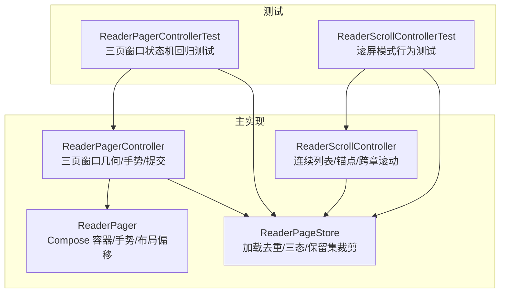
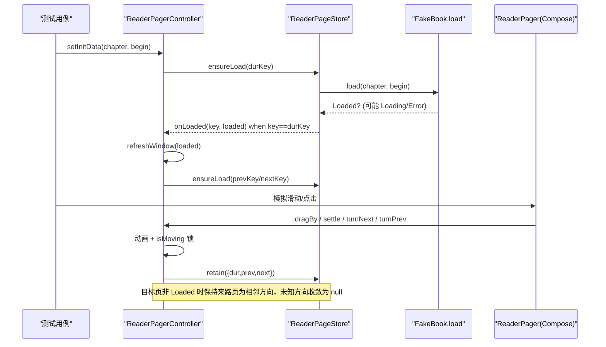
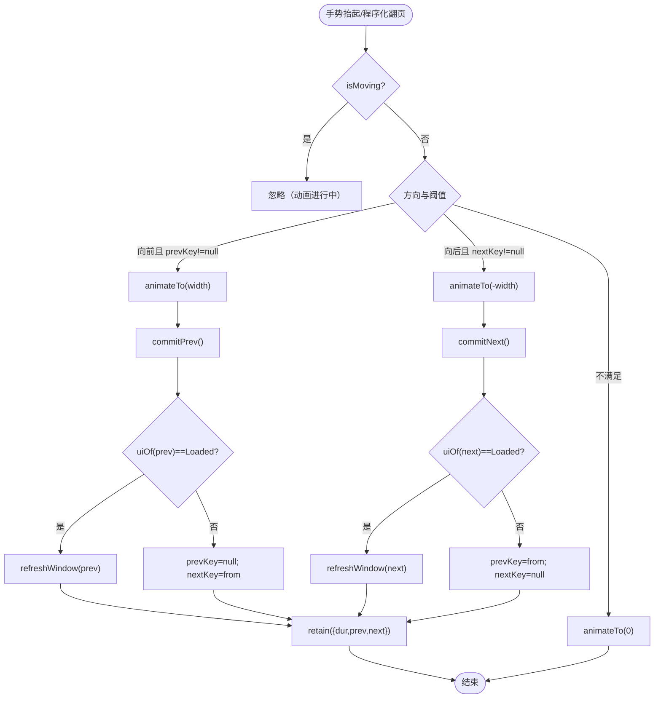
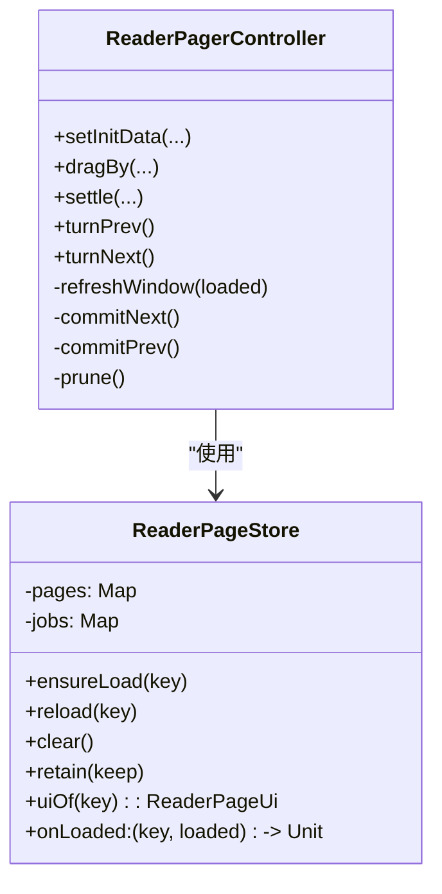
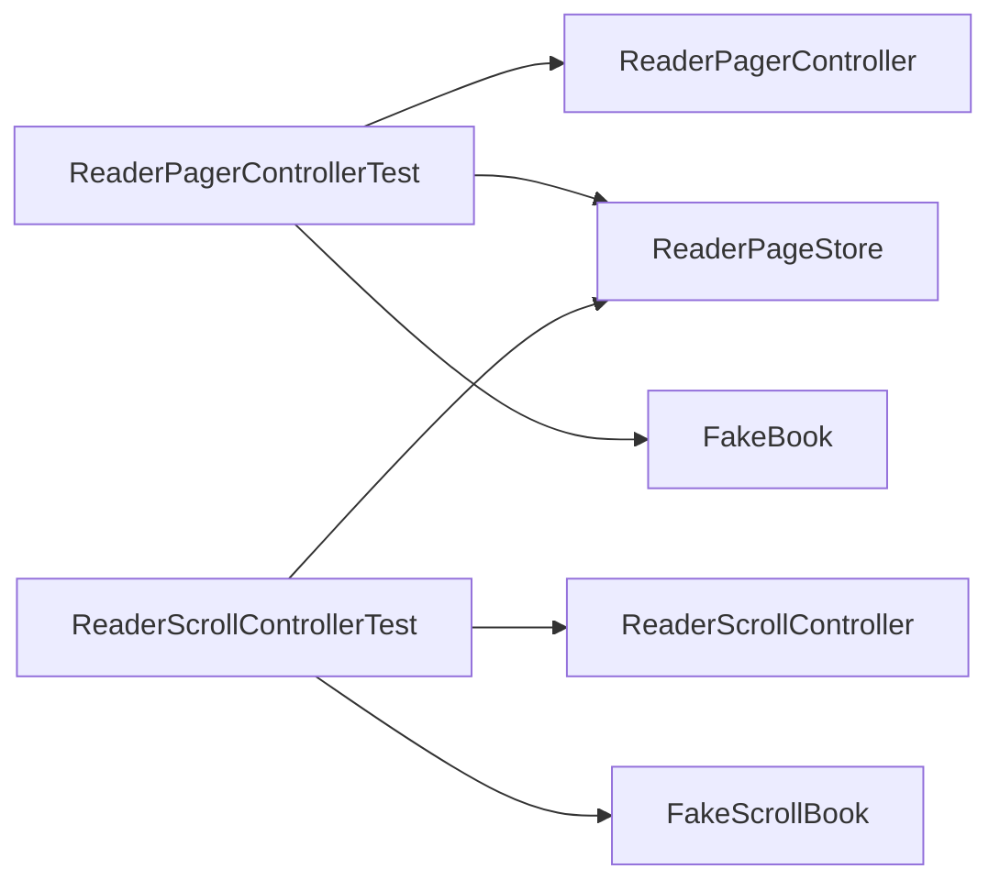

# 用户交互测试

<cite>
**本文引用的文件**
- [ReaderPagerControllerTest.kt](file://module_book/src/test/java/com/ebook/book/reader/ReaderPagerControllerTest.kt)
- [ReaderPager.kt](file://module_book/src/main/java/com/ebook/book/reader/ReaderPager.kt)
- [ReaderPageStore.kt](file://module_book/src/main/java/com/ebook/book/reader/ReaderPageStore.kt)
- [ReaderScrollControllerTest.kt](file://module_book/src/test/java/com/ebook/book/reader/ReaderScrollControllerTest.kt)
- [ReaderScrollController.kt](file://module_book/src/main/java/com/ebook/book/reader/ReaderScrollController.kt)
- [ReaderScrollFakes.kt](file://module_book/src/test/java/com/ebook/book/reader/ReaderScrollFakes.kt)
- [AGENTS.md](file://AGENTS.md)
</cite>

## 目录
1. [简介](#简介)
2. [项目结构](#项目结构)
3. [核心组件](#核心组件)
4. [架构总览](#架构总览)
5. [详细组件分析](#详细组件分析)
6. [依赖关系分析](#依赖关系分析)
7. [性能考量](#性能考量)
8. [故障排查指南](#故障排查指南)
9. [结论](#结论)
10. [附录](#附录)

## 简介
本章节聚焦“阅读器翻页控制器”的用户交互测试实现，重点说明：
- 如何使用 Robolectric 模拟用户手势（滑动、点击）并驱动动画与加载流程；
- 三页窗口状态机在正常翻页、加载失败、回翻重试等场景下的收敛规则与验证策略；
- 虚拟帧时钟 VirtualFrameClock 在无 Choreographer 的 JVM 环境下如何驱动 Compose 动画；
- 假数据模型 FakeBook/FakeScrollBook 的设计要点：如何模拟成功/失败、如何记录请求次数以断言自动重试；
- 给出具体测试示例，覆盖翻页边界处理与错误恢复等关键路径。

## 项目结构
本节围绕阅读器翻页相关的核心代码与测试文件进行定位，便于读者快速对照源码理解测试意图与实现细节。

图表来源
- [ReaderPagerControllerTest.kt:1-290](file://module_book/src/test/java/com/ebook/book/reader/ReaderPagerControllerTest.kt#L1-L290)
- [ReaderPager.kt:61-323](file://module_book/src/main/java/com/ebook/book/reader/ReaderPager.kt#L61-L323)
- [ReaderPageStore.kt:9-98](file://module_book/src/main/java/com/ebook/book/reader/ReaderPageStore.kt#L9-L98)
- [ReaderScrollControllerTest.kt:18-398](file://module_book/src/test/java/com/ebook/book/reader/ReaderScrollControllerTest.kt#L18-L398)
- [ReaderScrollController.kt:14-98](file://module_book/src/main/java/com/ebook/book/reader/ReaderScrollController.kt#L14-L98)

章节来源
- [ReaderPagerControllerTest.kt:1-290](file://module_book/src/test/java/com/ebook/book/reader/ReaderPagerControllerTest.kt#L1-L290)
- [ReaderPager.kt:61-323](file://module_book/src/main/java/com/ebook/book/reader/ReaderPager.kt#L61-L323)
- [ReaderPageStore.kt:9-98](file://module_book/src/main/java/com/ebook/book/reader/ReaderPageStore.kt#L9-L98)
- [ReaderScrollControllerTest.kt:18-398](file://module_book/src/test/java/com/ebook/book/reader/ReaderScrollControllerTest.kt#L18-L398)
- [ReaderScrollController.kt:14-98](file://module_book/src/main/java/com/ebook/book/reader/ReaderScrollController.kt#L14-L98)

## 核心组件
- ReaderPagerController：实现“三页窗口”的几何与手势逻辑，负责 prev/dur/next 三键维护、拖拽与翻页提交、加载完成后的窗口重算与保留集裁剪。
- ReaderPageStore：统一承载页面加载去重、三态（Loading/Error/Loaded）、完成回调以及保留集裁剪，避免重复网络/DB 调用。
- ReaderPager：Compose 层渲染三页窗口，提供触摸手势捕获、点击区域判定、布局期位移与尺寸测量回写。
- ReaderScrollController：滚屏模式控制器，提供连续列表项建模、锚点管理、跨章滚动与进度上报。
- 测试辅助：FakeBook/FakeScrollBook 用于构造可控的加载时序（成功/失败/闸门），并统计每个 key 的请求次数。

章节来源
- [ReaderPager.kt:61-323](file://module_book/src/main/java/com/ebook/book/reader/ReaderPager.kt#L61-L323)
- [ReaderPageStore.kt:9-98](file://module_book/src/main/java/com/ebook/book/reader/ReaderPageStore.kt#L9-L98)
- [ReaderScrollController.kt:14-98](file://module_book/src/main/java/com/ebook/book/reader/ReaderScrollController.kt#L14-L98)
- [ReaderPagerControllerTest.kt:198-290](file://module_book/src/test/java/com/ebook/book/reader/ReaderPagerControllerTest.kt#L198-L290)
- [ReaderScrollFakes.kt:6-44](file://module_book/src/test/java/com/ebook/book/reader/ReaderScrollFakes.kt#L6-L44)

## 架构总览
下图展示翻页控制器与加载仓库之间的交互序列，包括手势触发、动画、提交、加载与窗口重算的关键步骤。

图表来源
- [ReaderPagerControllerTest.kt:42-195](file://module_book/src/test/java/com/ebook/book/reader/ReaderPagerControllerTest.kt#L42-L195)
- [ReaderPager.kt:159-323](file://module_book/src/main/java/com/ebook/book/reader/ReaderPager.kt#L159-L323)
- [ReaderPageStore.kt:44-98](file://module_book/src/main/java/com/ebook/book/reader/ReaderPageStore.kt#L44-L98)

## 详细组件分析

### 翻页控制器（ReaderPagerController）与三页窗口状态机
- 窗口三键：prevKey、durKey、nextKey，保证互不相同且至少一个方向可达。
- 手势与动画：drag 由 Animatable 驱动；settle 基于阈值判定是否翻页；turnPrev/turnNext 提供程序化翻页。
- 提交逻辑：commitNext/commitPrev 在目标页已 Loaded 时直接刷新窗口；否则保留来路页作为相邻方向，未知方向收敛为 null，避免“自指空转”和“回不去”的死页。
- 保留集裁剪：prune 将仓库保留集限制为 {dur, prev, next}，防止内存累积。

图表来源
- [ReaderPager.kt:209-323](file://module_book/src/main/java/com/ebook/book/reader/ReaderPager.kt#L209-L323)

章节来源
- [ReaderPager.kt:89-323](file://module_book/src/main/java/com/ebook/book/reader/ReaderPager.kt#L89-L323)
- [ReaderPagerControllerTest.kt:42-195](file://module_book/src/test/java/com/ebook/book/reader/ReaderPagerControllerTest.kt#L42-L195)

### 加载仓库（ReaderPageStore）与去重/收敛
- 去重策略：按 ReaderPageKey 登记 jobs；已 Loaded 的页不重复抓取；确保在途任务唯一性。
- 完成回调：onLoaded 仅对当前 durKey 生效，从而支持“翻页途中提交的在途任务自动归属新窗口”，无需时间戳过期校验。
- 重试机制：reload 取消旧 job 并重新 ensureLoad；结合窗口收敛规则，回翻再翻回会触发自动重试失败页。
- 保留集裁剪：retain 清理不在保留集中的 pages/jobs，防止内存泄漏。

图表来源
- [ReaderPageStore.kt:9-98](file://module_book/src/main/java/com/ebook/book/reader/ReaderPageStore.kt#L9-L98)
- [ReaderPager.kt:159-323](file://module_book/src/main/java/com/ebook/book/reader/ReaderPager.kt#L159-L323)

章节来源
- [ReaderPageStore.kt:9-98](file://module_book/src/main/java/com/ebook/book/reader/ReaderPageStore.kt#L9-L98)

### 虚拟帧时钟 VirtualFrameClock 的作用
- 背景：Animatable.animateTo 依赖 MonotonicFrameClock 驱动；JVM 单测无 Choreographer，不提供帧时钟会抛异常。
- 方案：VirtualFrameClock 每次 withFrameNanos 固定推进约 16ms（60fps），让 spring 动画在数十帧内收敛且不消耗墙上时间，使测试可确定性推进到 idle。
- 注意：测试需把控制器挂在前台 TestScope；advanceUntilIdle 只推进前台协程，后台任务不会继续执行，因此页面加载必须在测试作用域内完成。

章节来源
- [ReaderPagerControllerTest.kt:239-259](file://module_book/src/test/java/com/ebook/book/reader/ReaderPagerControllerTest.kt#L239-L259)
- [ReaderPagerControllerTest.kt:31-37](file://module_book/src/test/java/com/ebook/book/reader/ReaderPagerControllerTest.kt#L31-L37)

### 假数据模型 FakeBook 与请求计数
- 设计要点：
  - pagesPerChapter 决定每章页数；resolve 对齐哨兵语义（BEGIN→首块/末页）。
  - fail(keys) 标记指定 key 返回 null（失败态）。
  - gates[key] 挂起闸门，用于构造“翻页提交时目标页仍 Loading”的中间态。
  - requests 记录每个 key 的请求次数，用于断言“回翻再翻过来 = 自动重试失败页”。
- 用法：测试中通过 book.fail/gates 精确控制加载结果与时序，配合 advanceUntilIdle 推进协程。

章节来源
- [ReaderPagerControllerTest.kt:198-237](file://module_book/src/test/java/com/ebook/book/reader/ReaderPagerControllerTest.kt#L198-L237)

### 手势模拟与交互测试示例
- 滑动：通过 controller.settle(totalDx) 模拟拖拽抬起；超过阈值则翻页，否则回弹。
- 点击：ReaderPager 内部根据 startX 判断左右三分区调用 turnPrev/turnNext；测试可用程序化 API 等价模拟。
- 典型场景：
  - 正常翻页：窗口按加载结果重算，prev/next 正确推进。
  - 翻到失败页：nextKey 不得自指；prevKey 保留来路页；ui 显示 Error。
  - 失败页上向前拖动：hasPre=true 时允许拖动，避免“被夹死”导致无法回退。
  - 回翻再翻回：失败页被重新加载（自动重试），requests 计数增加。
  - 翻向仍在加载的页：未知去向收敛为 null；加载完成后补全窗口。
  - 窗口重算不重抓已加载页：已 Loaded 的来路页不应闪加载态。

章节来源
- [ReaderPagerControllerTest.kt:42-195](file://module_book/src/test/java/com/ebook/book/reader/ReaderPagerControllerTest.kt#L42-L195)
- [ReaderPager.kt:335-438](file://module_book/src/main/java/com/ebook/book/reader/ReaderPager.kt#L335-L438)

### 滚屏模式对照（ReaderScrollController）
- 虽然本文聚焦翻页控制器，但滚屏模式同样使用 ReaderPageStore 与同一套加载语义，测试覆盖了跨章物化、锚点稳定、保留集按章距裁剪、失败块占位等特性。
- 有助于理解“为什么翻页模式要按三键裁剪、而滚屏模式按章距裁剪”的设计差异。

章节来源
- [ReaderScrollControllerTest.kt:18-398](file://module_book/src/test/java/com/ebook/book/reader/ReaderScrollControllerTest.kt#L18-L398)
- [ReaderScrollController.kt:14-98](file://module_book/src/main/java/com/ebook/book/reader/ReaderScrollController.kt#L14-L98)
- [ReaderScrollFakes.kt:6-44](file://module_book/src/test/java/com/ebook/book/reader/ReaderScrollFakes.kt#L6-L44)

## 依赖关系分析
- 测试对实现的依赖：
  - ReaderPagerControllerTest 依赖 ReaderPagerController、ReaderPageStore、FakeBook、VirtualFrameClock。
  - ReaderScrollControllerTest 依赖 ReaderScrollController、ReaderPageStore、FakeScrollBook。
- 运行时依赖：
  - Robolectric 提供 Context 与资源；不渲染 View，仅运行逻辑与 Compose 动画（借助 VirtualFrameClock）。
- 外部约束：
  - 项目约定使用 JUnit 4、Kotlin Coroutines Test；测试类命名与反引号方法名遵循仓库规范。

图表来源
- [ReaderPagerControllerTest.kt:1-290](file://module_book/src/test/java/com/ebook/book/reader/ReaderPagerControllerTest.kt#L1-L290)
- [ReaderScrollControllerTest.kt:18-398](file://module_book/src/test/java/com/ebook/book/reader/ReaderScrollControllerTest.kt#L18-L398)

章节来源
- [ReaderPagerControllerTest.kt:1-290](file://module_book/src/test/java/com/ebook/book/reader/ReaderPagerControllerTest.kt#L1-L290)
- [ReaderScrollControllerTest.kt:18-398](file://module_book/src/test/java/com/ebook/book/reader/ReaderScrollControllerTest.kt#L18-L398)

## 性能考量
- 去重与缓存：ReaderPageStore 对已 Loaded 的页不再重复抓取，避免快速回翻时的闪烁与冗余 IO。
- 保留集裁剪：翻页模式保留三页窗口；滚屏模式按章距裁剪，减少内存占用同时避免频繁重排。
- 动画与手势：isMoving 锁防止并发动画；drag 仅在布局期读取，避免重组开销。

[本节为通用指导，不直接分析具体文件]

## 故障排查指南
- 常见问题与排查点：
  - 翻页后画面不动：检查 nextKey/prevKey 是否自指或均为 null；确认 commitNext/commitPrev 收敛规则是否正确。
  - 失败页回不去：确认来路页是否保留为相邻方向；检查 retain 是否误删了必要 key。
  - 自动重试未触发：回翻再翻回应重新 ensureLoad；检查 jobs 注销与 onLoaded 回调是否命中 durKey。
  - 动画不收敛：确保 VirtualFrameClock 注入且控制器挂在 TestScope 前台；advanceUntilIdle 能推进协程。
- 建议复现步骤：
  - 构造 FakeBook.fail 某页，进入该页后尝试前后方向操作，断言 prev/next/drag/isMoving 的状态。
  - 使用 gates 制造 Loading 中间态，断言未知方向的收敛为 null，并在完成回调后验证窗口补全。

章节来源
- [ReaderPagerControllerTest.kt:65-195](file://module_book/src/test/java/com/ebook/book/reader/ReaderPagerControllerTest.kt#L65-L195)
- [ReaderPageStore.kt:44-98](file://module_book/src/main/java/com/ebook/book/reader/ReaderPageStore.kt#L44-L98)

## 结论
- 三页窗口状态机的核心在于“提交翻页时目标页未必已 Loaded”的收敛规则：保留来路页、未知方向收敛为 null、三键互异，从而避免空转与死页。
- VirtualFrameClock 使无设备环境的动画测试具备确定性与高效性；测试必须将控制器挂在前台 TestScope 以保证协程推进。
- FakeBook/FakeScrollBook 通过 gates/failures/requests 精准控制加载时序与结果，支撑对自动重试、去重与边界行为的严格断言。
- 滚屏与翻页两种模式共用加载仓库，保证行为一致性与可维护性。

[本节总结全文，不直接分析具体文件]

## 附录
- 项目约定参考：测试使用 JUnit 4、Robolectric、Coroutines Test；命名与风格遵循仓库规范。
- 相关测试文件：
  - 翻页控制器测试：[ReaderPagerControllerTest.kt](file://module_book/src/test/java/com/ebook/book/reader/ReaderPagerControllerTest.kt)
  - 滚屏控制器测试：[ReaderScrollControllerTest.kt](file://module_book/src/test/java/com/ebook/book/reader/ReaderScrollControllerTest.kt)
  - 假书实现：[ReaderPagerControllerTest.kt](file://module_book/src/test/java/com/ebook/book/reader/ReaderPagerControllerTest.kt)、[ReaderScrollFakes.kt](file://module_book/src/test/java/com/ebook/book/reader/ReaderScrollFakes.kt)
  - 主实现：[ReaderPager.kt](file://module_book/src/main/java/com/ebook/book/reader/ReaderPager.kt)、[ReaderPageStore.kt](file://module_book/src/main/java/com/ebook/book/reader/ReaderPageStore.kt)、[ReaderScrollController.kt](file://module_book/src/main/java/com/ebook/book/reader/ReaderScrollController.kt)

章节来源
- [AGENTS.md](file://AGENTS.md)