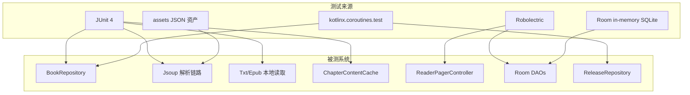
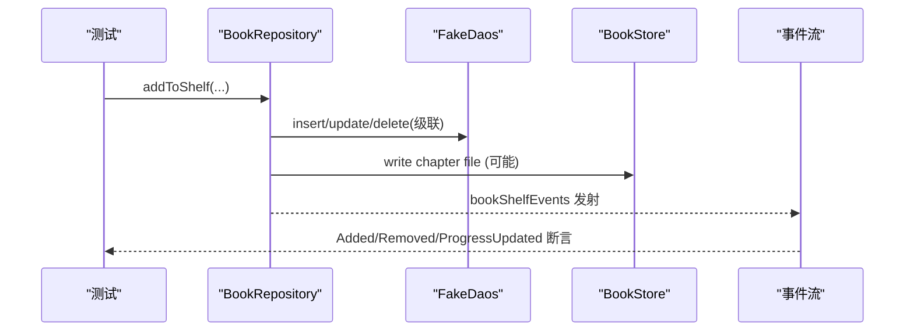
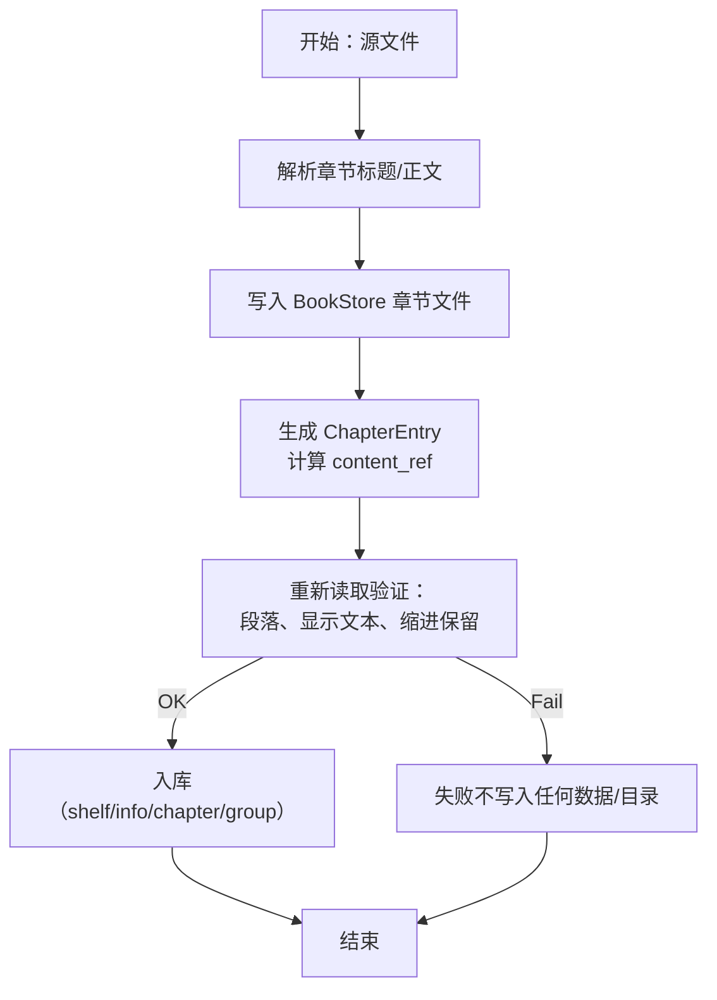
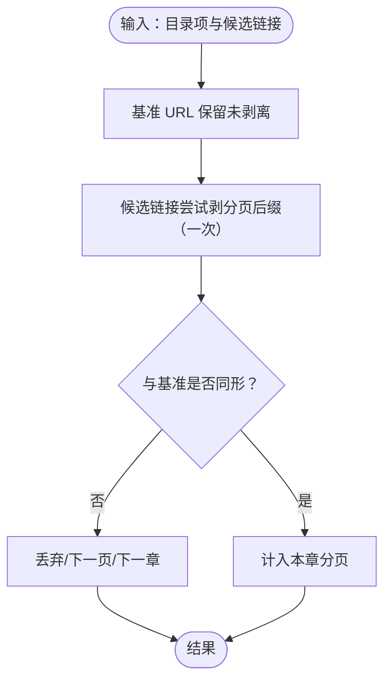

# 单元测试

<cite>
**本文引用的文件**
- [test-coverage-todo.md](file://docs/test-coverage-todo.md)
- [FakeDaos.kt](file://lib_book_common/src/test/java/com/ebook/common/repository/FakeDaos.kt)
- [FakeUserSessionManager.kt](file://lib_book_common/src/test/java/com/ebook/common/domain/FakeUserSessionManager.kt)
- [ChapterPageMatcherTest.kt](file://lib_book_common/src/test/java/com/ebook/common/analyze/source/ChapterPageMatcherTest.kt)
- [ListPageUrlTest.kt](file://lib_book_common/src/test/java/com/ebook/common/analyze/source/ListPageUrlTest.kt)
- [BookPageMergeTest.kt](file://module_find/src/test/java/com/ebook/find/mvvm/viewmodel/BookPageMergeTest.kt)
- [CommentNetworkTestTest.kt](file://lib_ebook_api/src/test/java/com/ebook/api/service/comment/CommentNetworkTestTest.kt)
- [TxtSourceReaderTest.kt](file://lib_book_common/src/test/java/com/ebook/common/analyze/local/TxtSourceReaderTest.kt)
- [LocalBookImporterTest.kt](file://lib_book_common/src/test/java/com/ebook/common/importer/LocalBookImporterTest.kt)
- [SearchHistoryDaoTest.kt](file://lib_ebook_db/src/test/java/com/ebook/db/dao/SearchHistoryDaoTest.kt)
- [BookRepositoryTest.kt](file://lib_book_common/src/test/java/com/ebook/common/repository/BookRepositoryTest.kt)
- [ReleaseRepositoryTest.kt](file://module_me/src/test/java/com/ebook/me/repository/ReleaseRepositoryTest.kt)
- [ChapterContentCacheTest.kt](file://lib_book_common/src/test/java/com/ebook/common/store/ChapterContentCacheTest.kt)
- [ReaderPagerControllerTest.kt](file://module_book/src/test/java/com/ebook/book/reader/ReaderPagerControllerTest.kt)
- [SessionTokenRefresherTest.kt](file://lib_book_common/src/test/java/com/ebook/common/domain/SessionTokenRefresherTest.kt)
</cite>

## 目录
1. [简介](#简介)
2. [项目结构](#项目结构)
3. [核心组件](#核心组件)
4. [架构总览](#架构总览)
5. [详细组件分析](#详细组件分析)
6. [依赖关系分析](#依赖关系分析)
7. [性能考虑](#性能考虑)
8. [故障排查指南](#故障排查指南)
9. [结论](#结论)
10. [附录](#附录)

## 简介
本档系统化梳理 Android 电子书阅读器的纯 JVM 测试体系，覆盖：
- JUnit 4 使用规范与命名约定；Robolectric 运行器与环境注解的使用场景。
- Mock 数据构造：FakeDao、假会话管理等假件模式及最佳实践。
- 协程测试：kotlinx.coroutines.test 的 runTest、advanceUntilIdle、runCurrent 等用法与注意事项。
- 业务逻辑层测试：仓库/解析器/本地导入器/缓存/分页匹配。
- 资产契约测试：评论 mock 资源断言其形态、序列化类型一致性、跨表键对齐。
- Room 数据库测试策略：in-memory SQLite + Robolectric、DAO 方法原子性与查询语义回归。
- 边界条件测试设计：分页 URL 处理、章节匹配算法、网络异常与取消处理。
- 用例组织与命名建议：如何分类、命名、分层以保证可维护性。

该体系以“最小化外部依赖、最大化确定性”为目标：纯 JVM 测试优先，仅在需要 Android 框架时借助 Robolectric；所有网络与 IO 通过假件或内存对象替代，确保快速且稳定可重复执行。

## 项目结构
测试按模块分布，围绕被测能力组织为独立测试类：
- lib_book_common：通用解析、本地读取、仓储、缓存、领域规则（会话/评论键/导入判定）
- module_find：找书列表合并与分页
- lib_ebook_api：mock 数据源与其 JSON 资产的契约验证
- lib_ebook_db：Room DAO 在内存库上的行为测试
- module_book：阅读器翻页状态机与 UI 相关控制器
- module_me：版本发布检查策略与状态存储



图表来源
- [BookRepositoryTest.kt:34-73](file://lib_book_common/src/test/java/com/ebook/common/repository/BookRepositoryTest.kt#L34-L73)
- [ReaderPagerControllerTest.kt:16-40](file://module_book/src/test/java/com/ebook/book/reader/ReaderPagerControllerTest.kt#L16-L40)
- [SearchHistoryDaoTest.kt:15-43](file://lib_ebook_db/src/test/java/com/ebook/db/dao/SearchHistoryDaoTest.kt#L15-L43)
- [CommentNetworkTestTest.kt:16-45](file://lib_ebook_api/src/test/java/com/ebook/api/service/comment/CommentNetworkTestTest.kt#L16-L45)
- [ReleaseRepositoryTest.kt:25-58](file://module_me/src/test/java/com/ebook/me/repository/ReleaseRepositoryTest.kt#L25-L58)

小节来源
- [test-coverage-todo.md:5-59](file://docs/test-coverage-todo.md#L5-L59)

## 核心组件
本项目的测试由以下核心构件支撑：
- FakeDaos：手写的内存实现，用于屏蔽 Room，使 BookRepository 及其消费者可在纯 JVM 中完成端到端集成级验证。
- FakeUserSessionManager：内存会话管理，同步 TokenHolder，保证认证态与凭证在测试中的确定性。
- TemporaryFolder：隔离临时目录，确保本地书籍导入/读写的幂等性和失败回滚可测。
- TestAssetManager：将真实 assets 引入单元测试路径，让契约测试直接对 APK 包内资源做断言。
- VirtualFrameClock + 前台 TestScope：为 Compose 动画/滚动提供可预测帧推进，配合 advanceUntilIdle 控制时间。

这些构件贯穿各模块测试，形成统一范式：
- 用 Fake 替换外部依赖
- 用内存/临时文件替代持久化介质
- 用协程测试工具控制并发与异步完成顺序
- 用资产契约锁死接口协议稳定性

小节来源
- [FakeDaos.kt:22-169](file://lib_book_common/src/test/java/com/ebook/common/repository/FakeDaos.kt#L22-L169)
- [FakeUserSessionManager.kt:12-72](file://lib_book_common/src/test/java/com/ebook/common/domain/FakeUserSessionManager.kt#L12-L72)
- [LocalBookImporterTest.kt:47-63](file://lib_book_common/src/test/java/com/ebook/common/importer/LocalBookImporterTest.kt#L47-L63)
- [CommentNetworkTestTest.kt:29-45](file://lib_ebook_api/src/test/java/com/ebook/api/service/comment/CommentNetworkTestTest.kt#L29-L45)
- [ReaderPagerControllerTest.kt:20-37](file://module_book/src/test/java/com/ebook/book/reader/ReaderPagerControllerTest.kt#L20-L37)

## 架构总览
测试总体遵循“按模块解耦、按责任分层”的方式：
- 纯逻辑层（URL 匹配、分页计算、合并去重）——纯 JVM JUnit 测试，零 Android 依赖，跑得快、断言清晰。
- 仓储与流程层（BookRepository、Import 协调器）——结合 Fake DAO 与内存 BookStore，复现完整事务与事件发射，必要时注入即时事务执行器以便计数校验。
- 本地读取链（TXT/EPUB）——基于临时目录进行读写闭环验证，确保 index->content_ref 的一致性。
- 资产管理与网络契约——直读 assets 资源，约束 JSON 结构与客户端解码一致，防止未来接口演进引发静默失败。
- Room 数据访问——in-memory DB + Robolectric Context，验证 SQL 语义与迁移正确性。
- 交互状态机（翻页控制器）——Robolectric + Virtual Frame Clock，锁定三页窗口收敛不变量。



图表来源
- [BookRepositoryTest.kt:77-122](file://lib_book_common/src/test/java/com/ebook/common/repository/BookRepositoryTest.kt#L77-L122)
- [BookRepositoryTest.kt:145-187](file://lib_book_common/src/test/java/com/ebook/common/repository/BookRepositoryTest.kt#L145-L187)
- [LocalBookImporterTest.kt:84-102](file://lib_book_common/src/test/java/com/ebook/common/importer/LocalBookImporterTest.kt#L84-L102)

小节来源
- [test-coverage-todo.md:5-52](file://docs/test-coverage-todo.md#L5-L52)

## 详细组件分析

### JUnit 4 规范与 Robolectric 应用
- 统一使用 JUnit 4 的 @Test、@Before、@After；测试类名以被测试实体名称结尾，例如 ChapterPageMatcherTest、BookPageMergeTest。
- 无需 Android 环境时使用纯 JVM 测试；当需要 Context/资源/WindowManager 等框架时，采用 @RunWith(RobolectricTestRunner::class) 与 @Config(sdk = [...]) 指定目标 SDK，避免真实设备依赖。
- 对于需要动画/页面的测试，使用 VirtualFrameClock 并与 advanceUntilIdle 配合，确保页面加载/滑动能在虚拟时间中完成。

小节来源
- [ChapterPageMatcherTest.kt:18-159](file://lib_book_common/src/test/java/com/ebook/common/analyze/source/ChapterPageMatcherTest.kt#L18-L159)
- [ListPageUrlTest.kt:7-87](file://lib_book_common/src/test/java/com/ebook/common/analyze/source/ListPageUrlTest.kt#L7-L87)
- [SearchHistoryDaoTest.kt:27-43](file://lib_ebook_db/src/test/java/com/ebook/db/dao/SearchHistoryDaoTest.kt#L27-L43)
- [ReaderPagerControllerTest.kt:16-40](file://module_book/src/test/java/com/ebook/book/reader/ReaderPagerControllerTest.kt#L16-L40)

### 协程测试：runTest、advanceUntilIdle、runCurrent
- 协程阻塞/异步代码统一用 runTest 包裹，使时间可控。
- advanceUntilIdle：推进至队列空闲，常用于 ReaderPagerControllerTest，推动后台任务/动画/页面加载。
- runCurrent：用于已启动的 Flow/共享通道订阅后，先让订阅者就位再触发事件（例如 BookRepository 的书架事件总线）。

关键要点
- 必须将涉及界面/窗口的控制器放在前台 TestScope，否则 advanceUntilIdle 不会推进背景队列，导致永远无法完成。
- 对 SharedFlow 事件，需在发射前先用 runCurrent 完成订阅，否则会丢事件。

小节来源
- [BookRepositoryTest.kt:145-187](file://lib_book_common/src/test/java/com/ebook/common/repository/BookRepositoryTest.kt#L145-L187)
- [ReaderPagerControllerTest.kt:20-37](file://module_book/src/test/java/com/ebook/book/reader/ReaderPagerControllerTest.kt#L20-L37)

### 假件模式：FakeDao、假会话管理、交易执行器
- FakeDaos：以 Map/List 模拟四个 DAO 的行为，暴露 storedValues()、flow seed 等便于断言，并记录删除 URL 等行为辅助验证孤立清理。
- DirectTransactionRunner/ImmediateTransactionRunner：前者在无事务环境下直通执行块，后者记录调用次数，方便校验“一次导入仅提交一个事务”。
- FakeUserSessionManager：内存会话，保持登录态、用户信息、刷新凭据流转，并和 TokenHolder 同步 token；测试中通过 reset() 重置状态，保障测试独立性。

小节来源
- [FakeDaos.kt:22-169](file://lib_book_common/src/test/java/com/ebook/common/repository/FakeDaos.kt#L22-L169)
- [FakeUserSessionManager.kt:12-72](file://lib_book_common/src/test/java/com/ebook/common/domain/FakeUserSessionManager.kt#L12-L72)
- [LocalBookImporterTest.kt:66-82](file://lib_book_common/src/test/java/com/ebook/common/importer/LocalBookImporterTest.kt#L66-L82)

### 业务逻辑层测试
- BookRepository：级联写入/清理、关联查询与孤立清理、事件发射、缓存短路、排序等；使用 FakeDaos + 内存 BookStore 完成无 ROM 依赖的完整链路验证。
- JsoupSourceReader/本地导入：聚焦“章节文件与索引 content_ref 严格一致”，以及“失败不留半成品”等健壮性断言。
- ReleaseRepository：多源降级、只取 .apk、取消传播等策略用桩数据源精准断言。

小节来源
- [BookRepositoryTest.kt:75-187](file://lib_book_common/src/test/java/com/ebook/common/repository/BookRepositoryTest.kt#L75-L187)
- [LocalBookImporterTest.kt:84-193](file://lib_book_common/src/test/java/com/ebook/common/importer/LocalBookImporterTest.kt#L84-L193)
- [ReleaseRepositoryTest.kt:65-183](file://module_me/src/test/java/com/ebook/me/repository/ReleaseRepositoryTest.kt#L65-L183)

### 本地书籍导入：TXT/EPUB 格式处理与往返验证
- TxtSourceReaderTest：从源文本切分出章节 → 落盘到 BookStore → 再读回段落与展示文本，断言原始缩进保留、空白清洗位置正确、缺失章返回空。
- LocalBookImporterTest：端到端导入流程，保证单事务、不重读原文件、MD5 目录命与内容一致、失败不残留半制品、parseMetadata 不写库。



图表来源
- [TxtSourceReaderTest.kt:39-93](file://lib_book_common/src/test/java/com/ebook/common/analyze/local/TxtSourceReaderTest.kt#L39-L93)
- [LocalBookImporterTest.kt:84-193](file://lib_book_common/src/test/java/com/ebook/common/importer/LocalBookImporterTest.kt#L84-L193)

小节来源
- [test-coverage-todo.md:44-52](file://docs/test-coverage-todo.md#L44-L52)

### 章节匹配与分页：ChapterPageMatcher、ListPageUrl、BookPageMerge
- ChapterPageMatcherTest：剥离末尾分页后缀（含扩展名兜底）、判断同章（章节号在连字符后）、拦截相邻章节与查询参数分页（宁漏页不串章）。
- ListPageUrlTest：首页裁掉末尾页码段、中段模板不裁剪、查询参数式模板不裁首页、start/step 换算。
- BookPageMergeTest：按 noteUrl 去重追加，整页重复/空页视为到底，页内重复去重保序。



图表来源
- [ChapterPageMatcherTest.kt:57-158](file://lib_book_common/src/test/java/com/ebook/common/analyze/source/ChapterPageMatcherTest.kt#L57-L158)
- [ListPageUrlTest.kt:19-87](file://lib_book_common/src/test/java/com/ebook/common/analyze/source/ListPageUrlTest.kt#L19-L87)
- [BookPageMergeTest.kt:19-50](file://module_find/src/test/java/com/ebook/find/mvvm/viewmodel/BookPageMergeTest.kt#L19-L50)

小节来源
- [test-coverage-todo.md:31-43](file://docs/test-coverage-todo.md#L31-L43)

### 资产契约测试：CommentNetworkTestTest
- 使用文件系统直读 assets，避免资源路径漂移；构建 CommentNetworkTest 时以自定义 AssetManager 替换 Android 环境。
- 约束：
  - 资产形态即解码类型（分页包裹）
  - 两份资产的聚合键交叉对齐
  - 新增评论分配 id、作者与时间符合服务端契约
  - 变更操作不丢失种子、分页切页生效
- 这类测试确保“JSON 资产 ↔ 客户端解码”不会失步，避免静默失败。

小节来源
- [CommentNetworkTestTest.kt:16-45](file://lib_ebook_api/src/test/java/com/ebook/api/service/comment/CommentNetworkTestTest.kt#L16-L45)
- [CommentNetworkTestTest.kt:58-241](file://lib_ebook_api/src/test/java/com/ebook/api/service/comment/CommentNetworkTestTest.kt#L58-L241)

### Room 数据库测试策略：in-memory SQLite 与 DAO 验证
- 使用 Robolectric ApplicationProvider 获取 Context，Room.inMemoryDatabaseBuilder 创建内存库，允许主线程查询以便简单测试。
- 验证搜索历史：
  - 取某类型全部历史并倒序
  - 清除某类型不影响其他类型
  - upsert 查重精确匹配
- 此类测试确保 DAO SQL 语义不漂移、索引与排序符合预期。

小节来源
- [SearchHistoryDaoTest.kt:27-101](file://lib_ebook_db/src/test/java/com/ebook/db/dao/SearchHistoryDaoTest.kt#L27-L101)

### 缓存与失效：ChapterContentCache
- 测试同一 ref 多次加载仅调用 loader 一次。
- LRU 超出容量时逐出最不常用项。
- invalidateBook 仅影响该书，clear 清空一切。
- 关键点：失效条件易错，例如重导入覆盖文件后，旧缓存仍需失效，否则读到旧内容。

小节来源
- [ChapterContentCacheTest.kt:8-66](file://lib_book_common/src/test/java/com/ebook/common/store/ChapterContentCacheTest.kt#L8-L66)

### 交互状态机：ReaderPagerController
- Robolectric + VirtualFrameClock，模拟上下文与资源。
- 验证“目标页尚未 Loaded/加载失败”时窗口收敛：nextKey 不自指、prevKey 保留来路页、未知方向收敛为空；翻回失败页时自动重试；已 Loaded 的页不被重抓。
- 使用 advanceUntilIdle 推进动画与加载回调。

小节来源
- [ReaderPagerControllerTest.kt:20-195](file://module_book/src/test/java/com/ebook/book/reader/ReaderPagerControllerTest.kt#L20-L195)

### 会话与刷新：SessionTokenRefresher、UserSessionManager
- SessionTokenRefresherTest：冷启动并发刷新只打一次接口、响应缺 refresh_token 时保留旧值、CancellationException 不被吞掉。
- UserSessionManagerTest：使用 FakeUserSessionManager 验证保存/轮换/清除与会话镜像同步；TokenHolder 同步与空 token 归一化为 null。

小节来源
- [SessionTokenRefresherTest.kt:32-200](file://lib_book_common/src/test/java/com/ebook/common/domain/SessionTokenRefresherTest.kt#L32-L200)
- [UserSessionManagerTest.kt:12-160](file://lib_book_common/src/test/java/com/ebook/common/domain/UserSessionManagerTest.kt#L12-L160)

### 版本发布检查策略：ReleaseRepository
- 用 Stub 数据源记录请求顺序，断言主源成功就不碰备用源。
- 全部源失败返回 null。
- 只选 .apk 附件；平台自动源码归档忽略。
- 取消原样抛出，不继续下游。

小节来源
- [ReleaseRepositoryTest.kt:25-183](file://module_me/src/test/java/com/ebook/me/repository/ReleaseRepositoryTest.kt#L25-L183)

## 依赖关系分析
测试之间的依赖主要体现在：
- BookRepositoryTest 依赖 FakeDaos、BookStore、ChapterContentCache。
- LocalBookImporterTest 依赖 FakeDaos、BookStore、TxtSourceReader、直接事务执行器以实现计数与回滚断言。
- ReaderPagerControllerTest 依赖 Robolectric Context、VirtualFrameClock 与测试内控制器封装。
- CommentNetworkTestTest 依赖 assets 直读桥接 TestAssetManager。
- SearchHistoryDaoTest 依赖 Robolectric Context 与 Room in-memory DB。

```mermaid
graph LR
    FAKE_DAO["FakeDaos"] --> REPO["BookRepositoryTest"]
    BOOKSTORE["BookStore(临时)"] --> IMPORTER["LocalBookImporterTest"]
    TXTREADER["TxtSourceReader"] --> IMPORTER
    CACHE["ChapterContentCache"] --> REPO
    ASSETS["assets JSON"] --> COMMENTTEST["CommentNetworkTestTest"]
    ROOM["in-memory DB"] --> DAO_TEST["SearchHistoryDaoTest"]
    ROB ["Robolectric"] --> CONTROLLER["ReaderPagerControllerTest"]
```

图表来源
- [BookRepositoryTest.kt:47-73](file://lib_book_common/src/test/java/com/ebook/common/repository/BookRepositoryTest.kt#L47-L73)
- [LocalBookImporterTest.kt:47-82](file://lib_book_common/src/test/java/com/ebook/common/importer/LocalBookImporterTest.kt#L47-L82)
- [CommentNetworkTestTest.kt:29-45](file://lib_ebook_api/src/test/java/com/ebook/api/service/comment/CommentNetworkTestTest.kt#L29-L45)
- [SearchHistoryDaoTest.kt:31-43](file://lib_ebook_db/src/test/java/com/ebook/db/dao/SearchHistoryDaoTest.kt#L31-L43)
- [ReaderPagerControllerTest.kt:16-40](file://module_book/src/test/java/com/ebook/book/reader/ReaderPagerControllerTest.kt#L16-L40)

小节来源
- [test-coverage-todo.md:5-59](file://docs/test-coverage-todo.md#L5-L59)

## 性能考虑
- 纯 JVM 测试为主：分页、匹配、合并、缓存策略均在 JVM 上运行，速度快且不依赖设备。
- 合理使用内存结构：Fake DAO 用 Map/List，避免 I/O 开销；导入类使用临时目录隔离用例间影响。
- 协程测试中减少真实等待：用 VirtualFrameClock 和 advanceUntilIdle 代替挂真实时钟。
- 资源直读路径尽量最小化复制：CommentNetworkTestTest 直接使用根目录相对路径命中 assets，避免复制样本。

本节提供一般指导，无特定文件分析。

## 故障排查指南
常见症状与定位线索：
- “页面不弹提示、该关的页不关”：可能是 ViewModel/Activity 命令通道绑定失效，需确认页面继承与基类 MvvmBinder 消费（参见架构说明）。
- “评论页永远加载不出来”：关注资产形态与解码类型不一致，Check CommentNetworkTestTest；错误会被 CoroutineAdapter 吞掉，仅日志难以定位，需用契约测试提前发现。
- “导入成功但打开是空白页”：核对 TxtSourceReader/Importer 中 content_ref 与 BookStore.chapterRef 一致性；ChapterFile 是否真的存在。
- “列表无限重复同一页”：检查 ListPageUrl 是否带有 {{page}}、是否在首尾页正确处理，以及 mergeBookPage 去重与到底判定。
- “更新检查失败/误判新版”：核实 ReleaseRepository 源选择顺序、.apk 过滤、tag 空白处理与取消传播。
- “Room 查询结果不符合预期”：验证 byType/clearByType/foundByTypeAndContent 的 SQL 语义是否与 ADR-0005 约定一致。

小节来源
- [test-coverage-todo.md:5-59](file://docs/test-coverage-todo.md#L5-L59)
- [CommentNetworkTestTest.kt:16-241](file://lib_ebook_api/src/test/java/com/ebook/api/service/comment/CommentNetworkTestTest.kt#L16-L241)
- [TxtSourceReaderTest.kt:39-93](file://lib_book_common/src/test/java/com/ebook/common/analyze/local/TxtSourceReaderTest.kt#L39-L93)
- [LocalBookImporterTest.kt:84-193](file://lib_book_common/src/test/java/com/ebook/common/importer/LocalBookImporterTest.kt#L84-L193)
- [ListPageUrlTest.kt:19-87](file://lib_book_common/src/test/java/com/ebook/common/analyze/source/ListPageUrlTest.kt#L19-L87)
- [BookPageMergeTest.kt:19-50](file://module_find/src/test/java/com/ebook/find/mvvm/viewmodel/BookPageMergeTest.kt#L19-L50)
- [ReleaseRepositoryTest.kt:65-183](file://module_me/src/test/java/com/ebook/me/repository/ReleaseRepositoryTest.kt#L65-L183)

## 结论
本工程的单元测试体系以“轻依赖、强断言、高确定”为核心原则：
- 通过 Fake/Direct Runner/Virtual Time 等手段将不确定性降到极低
- 用资产契约锁住前后端协议稳定性
- 用纯 JVM 案例守护解析/拼接/合并等复杂边界的回归安全
- 用内存库与临时文件确保数据读写与事务行为的稳定回归

这套体系覆盖了从底层解析到业务仓库，再到交互状态机的关键路径，为持续迭代提供了稳定护栏。后续应在“下载队列失败重试/出队”“Compose 页面 UI 测试”等方面进一步补齐，提升质量纵深。

本节总结而不分析具体文件，故无小节来源。

## 附录
- 用例组织建议
  - 以被测类/子功能为纲建立测试包与类名，如 analyze.source、importer、domain、store 等
  - 方法名使用反引号的句子式描述，表达“应发生什么”，增强可读性
  - 每个测试仅断言一个职责，组合场景拆分为多个小用例
  - 需要 Android 环境的用例统一放在 Robolectric 运行器下，并通过 Config 固定 SDK
- 推荐书写模板
  - 准备假件与上下文（@Before）
  - 设置初始状态/种子数据
  - 触发被测行为
  - 按职责断言状态变化与副作用（包括事务计数、事件、文件落盘、缓存命中率等）
- 协作与维护
  - 修改行为必同步更新对应测试
  - 改动资产时同步更新契约测试与解析类型
  - 对无法自动化覆盖的运行时流程（如前台服务下载）在 TODO 中标注人工验证步骤

本节提供通用指导，无特定文件分析，故无小节来源。