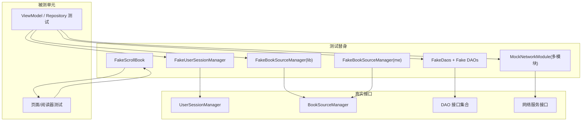
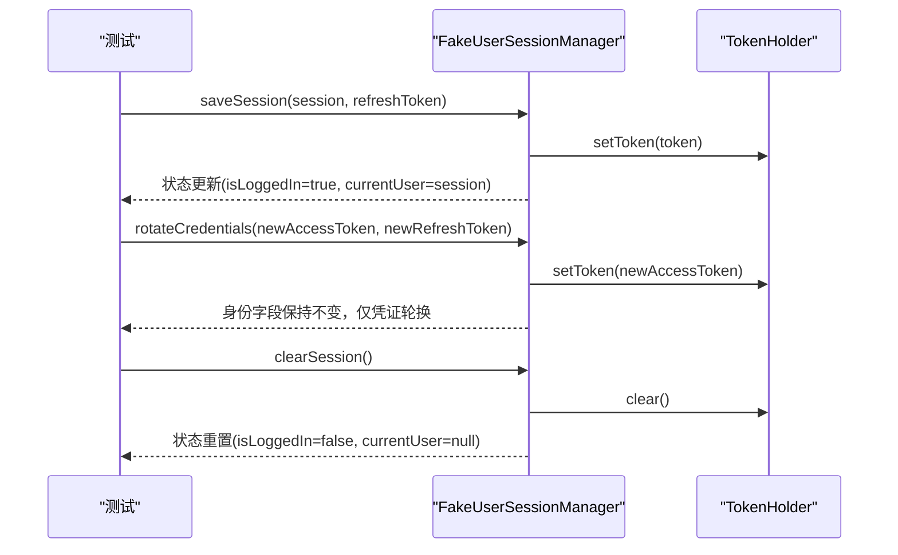
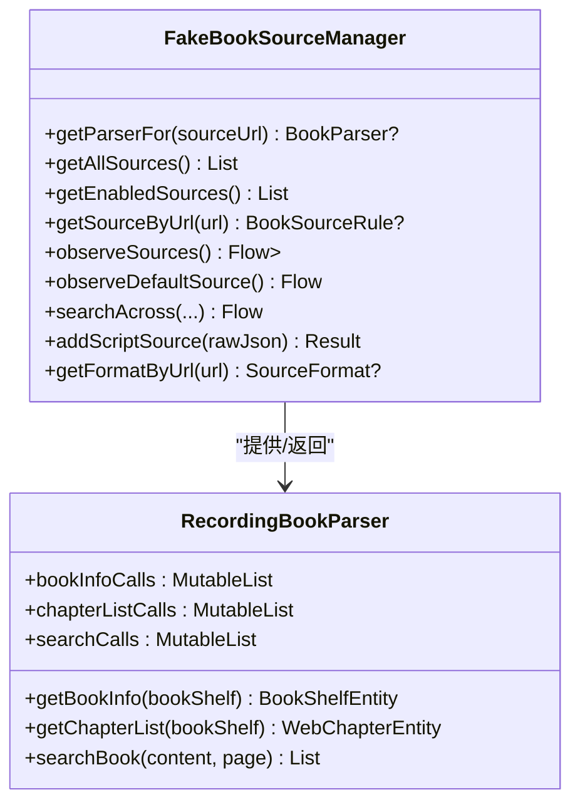
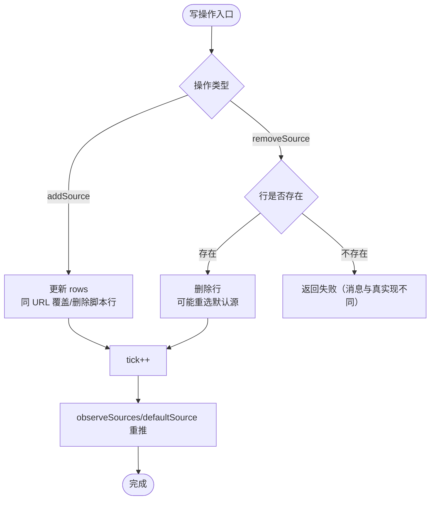
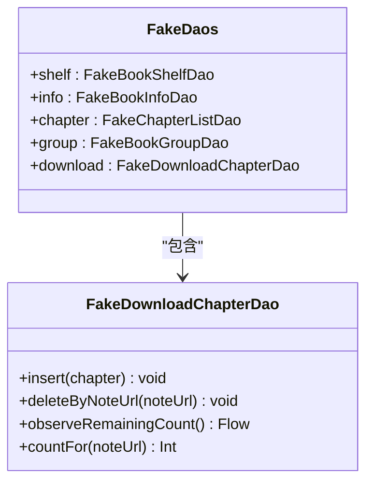
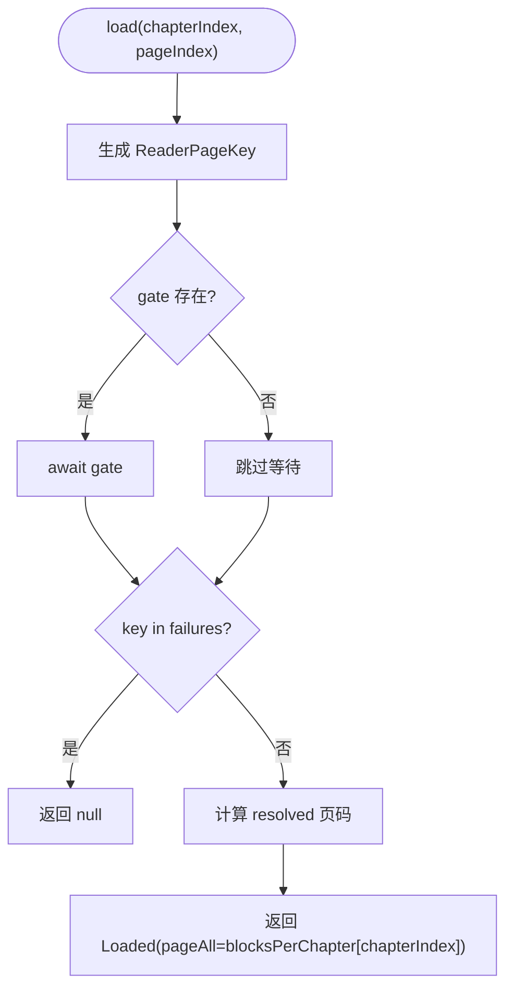
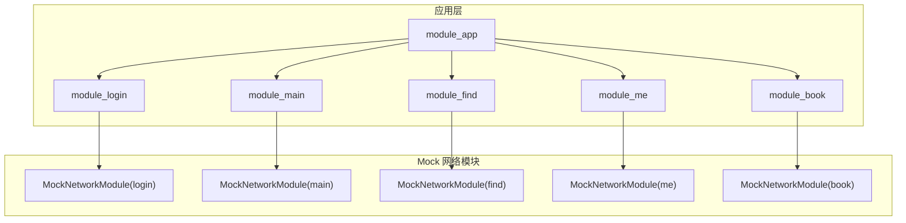

# Mock对象与测试替身

<cite>
**本文引用的文件**
- [FakeUserSessionManager.kt](file://lib_book_common/src/test/java/com/ebook/common/domain/FakeUserSessionManager.kt)
- [UserSessionManagerTest.kt](file://lib_book_common/src/test/java/com/ebook/common/domain/UserSessionManagerTest.kt)
- [FakeBookSourceManager.kt（lib_book_common）](file://lib_book_common/src/test/java/com/ebook/common/analyze/source/FakeBookSourceManager.kt)
- [FakeDaos.kt](file://lib_book_common/src/test/java/com/ebook/common/repository/FakeDaos.kt)
- [ReaderScrollFakes.kt](file://module_book/src/test/java/com/ebook/book/reader/ReaderScrollFakes.kt)
- [FakeBookSourceManager.kt（module_me）](file://module_me/src/test/java/com/ebook/me/mvvm/viewmodel/FakeBookSourceManager.kt)
- [MockNetworkModule.kt（module_login）](file://module_login/src/main/test/debug/MockNetworkModule.kt)
- [MockNetworkModule.kt（module_main）](file://module_main/src/main/test/debug/MockNetworkModule.kt)
- [MockNetworkModule.kt（module_find）](file://module_find/src/main/test/debug/MockNetworkModule.kt)
- [MockNetworkModule.kt（module_me）](file://module_me/src/main/test/debug/MockNetworkModule.kt)
- [MockNetworkModule.kt（module_book）](file://module_book/src/main/test/debug/MockNetworkModule.kt)
- [CONTEXT.md 节选（测试约定、mock 数据源与独立开发）](file://CONTEXT.md)
</cite>

## 目录
1. [简介](#简介)
2. [项目结构中的测试位置](#项目结构中的测试位置)
3. [核心测试替身总览](#核心测试替身总览)
4. [架构与依赖关系](#架构与依赖关系)
5. [详细组件分析](#详细组件分析)
6. [依赖注入与 Hilt 测试模块](#依赖注入与-hilt-测试模块)
7. [异步操作在测试中的处理](#异步操作在测试中的处理)
8. [测试数据组织与管理](#测试数据组织与管理)
9. [性能与稳定性考量](#性能与稳定性考量)
10. [故障排查指南](#故障排查指南)
11. [结论](#结论)

## 简介
本文件系统性梳理项目中各类测试替身的实现模式与最佳实践，覆盖 Fake、Stub、Mock 的选用策略；说明 FakeUserSessionManager、FakeBookSourceManager 等核心替身的设计思路；给出测试数据构造与种子数据的组织方式；解释依赖注入在测试中的替换方式（含 Hilt 测试模块）；并总结协程、Flow、回调等异步场景的测试方法。目标是帮助读者快速理解与维护测试替身，确保替身与真实实现保持一致，提升单测与集成测试的可靠性。

## 项目结构中的测试位置
- 单元测试位于各模块的 src/test/java 下，命名遵循 <Subject>Test。
- 插桩测试位于各模块的 src/androidTest/java 下。
- 独立运行时的 mock 宿主与网络替代位于各模块的 src/main/test/debug 中（如 MockNetworkModule），通过构建与 source set 机制参与编译并在独立模式下生效。
- 仓库根 CONTEXT.md 对测试约定、mock 数据源切换、独立/集成模式差异有统一约束。

**章节来源**
- [CONTEXT.md: 测试约定、mock 数据源与独立开发](file://CONTEXT.md)

## 核心测试替身总览
- 会话状态替身：FakeUserSessionManager
  - 以内存 StateFlow + TokenHolder 对齐生产语义，支持保存会话、轮换凭证、清理会话、重置状态等。
  - 提供断言辅助字段（savedSessions、rotated、clearCount），便于验证调用顺序与次数。
- 书源管理替身：FakeBookSourceManager（两份同名实现）
  - lib_book_common 版本聚焦“按 tag 取 parser”契约，未实现的方法直接抛错以避免假绿。
  - module_me 版本侧重书源清单写读与默认源行为，保留与 UI 强相关的不变式（如默认源启用态）。
- DAO 替身：FakeDaos 及子 Fake DAO
  - 提供 BookShelfDao、BookInfoDao、ChapterListDao、BookGroupDao、DownloadChapterDao 的内存实现，支持 Flow 镜像、计数、排序、删除记录等。
  - 配合 DirectTransactionRunner 在纯 JVM 测试中模拟事务边界。
- 阅读器滚动替身：FakeScrollBook
  - 固定每章块数，模拟 loadPage 语义（BEGIN/END 与越界钳位），并提供 gates/failures 控制中间态与失败路径。
- 网络层替身：各模块 MockNetworkModule
  - 通过 product flavor 与 source set 将真实网络替换为内存 mock，独立模式默认使用 mock，集成模式可切 real。

**章节来源**
- [FakeUserSessionManager.kt: 1-72](file://lib_book_common/src/test/java/com/ebook/common/domain/FakeUserSessionManager.kt#L1-L72)
- [FakeBookSourceManager.kt（lib_book_common）: 16-129](file://lib_book_common/src/test/java/com/ebook/common/analyze/source/FakeBookSourceManager.kt#L16-L129)
- [FakeDaos.kt: 18-256](file://lib_book_common/src/test/java/com/ebook/common/repository/FakeDaos.kt#L18-L256)
- [ReaderScrollFakes.kt: 6-44](file://module_book/src/test/java/com/ebook/book/reader/ReaderScrollFakes.kt#L6-L44)
- [FakeBookSourceManager.kt（module_me）: 19-302](file://module_me/src/test/java/com/ebook/me/mvvm/viewmodel/FakeBookSourceManager.kt#L19-L302)
- [MockNetworkModule.kt（module_login）](file://module_login/src/main/test/debug/MockNetworkModule.kt)
- [MockNetworkModule.kt（module_main）](file://module_main/src/main/test/debug/MockNetworkModule.kt)
- [MockNetworkModule.kt（module_find）](file://module_find/src/main/test/debug/MockNetworkModule.kt)
- [MockNetworkModule.kt（module_me）](file://module_me/src/main/test/debug/MockNetworkModule.kt)
- [MockNetworkModule.kt（module_book）](file://module_book/src/main/test/debug/MockNetworkModule.kt)

## 架构与依赖关系
下图展示测试替身与真实接口、以及典型测试用例之间的关系。Fake 类通常实现领域或仓储接口，被 ViewModel/Repository/页面测试直接注入或实例化；DAO 替身聚合于 FakeDaos，简化测试初始化；阅读器的 FakeScrollBook 作为内容加载替身用于控制器与渲染测试。

**图表来源**
- [FakeUserSessionManager.kt: 12-72](file://lib_book_common/src/test/java/com/ebook/common/domain/FakeUserSessionManager.kt#L12-L72)
- [FakeBookSourceManager.kt（lib_book_common）: 35-129](file://lib_book_common/src/test/java/com/ebook/common/analyze/source/FakeBookSourceManager.kt#L35-L129)
- [FakeBookSourceManager.kt（module_me）: 38-302](file://module_me/src/test/java/com/ebook/me/mvvm/viewmodel/FakeBookSourceManager.kt#L38-L302)
- [FakeDaos.kt: 24-256](file://lib_book_common/src/test/java/com/ebook/common/repository/FakeDaos.kt#L24-L256)
- [ReaderScrollFakes.kt: 17-44](file://module_book/src/test/java/com/ebook/book/reader/ReaderScrollFakes.kt#L17-L44)
- [MockNetworkModule.kt（module_login）](file://module_login/src/main/test/debug/MockNetworkModule.kt)
- [MockNetworkModule.kt（module_main）](file://module_main/src/main/test/debug/MockNetworkModule.kt)
- [MockNetworkModule.kt（module_find）](file://module_find/src/main/test/debug/MockNetworkModule.kt)
- [MockNetworkModule.kt（module_me）](file://module_me/src/main/test/debug/MockNetworkModule.kt)
- [MockNetworkModule.kt（module_book）](file://module_book/src/main/test/debug/MockNetworkModule.kt)

## 详细组件分析

### FakeUserSessionManager：会话状态替身
- 设计要点
  - 使用 MutableStateFlow 暴露 isLoggedIn、currentUser，与生产端一致提供响应式状态。
  - 同步 token 到 TokenHolder，保证认证头附加逻辑在测试中可用。
  - 提供 savedSessions、rotated、clearCount 等观测字段，便于断言保存、轮换、清理行为。
  - 支持 reset() 清空所有状态，适合测试隔离。
- 适用场景
  - 登录/登出流程测试、token 刷新与轮换测试、跨组件共享会话状态的单元测试。
- 关键行为
  - saveSession：更新当前用户、登录态、写入 TokenHolder、记录保存历史。
  - rotateCredentials：仅轮换凭证，不重建身份字段，保持用户标识稳定。
  - clearSession：清空用户、登录态、TokenHolder，并计数。
  - getRefreshToken：优先返回最近一次轮换的 refresh token，否则回退到最近保存的。

**图表来源**
- [FakeUserSessionManager.kt: 12-72](file://lib_book_common/src/test/java/com/ebook/common/domain/FakeUserSessionManager.kt#L12-L72)

**章节来源**
- [FakeUserSessionManager.kt: 12-72](file://lib_book_common/src/test/java/com/ebook/common/domain/FakeUserSessionManager.kt#L12-L72)
- [UserSessionManagerTest.kt: 12-160](file://lib_book_common/src/test/java/com/ebook/common/domain/UserSessionManagerTest.kt#L12-L160)

### FakeBookSourceManager（lib_book_common）：解析器路由替身
- 设计要点
  - 只实现 P3-a 相关面：getParserFor、getSourceByUrl、清单读取、默认源空流。
  - 未实现成员一律抛出异常，避免“没走到那条路径”的假绿。
  - getParserFor 照抄两条短路（空白 URL 与本地标签），确保分支一致性。
  - 提供 RecordingBookParser 记录调用入参与返回值，用于断言“这本书用它的 parser”。
- 适用场景
  - 搜索聚合、默认源、按 tag 选择解析器等测试。
- 关键行为
  - getParserFor(sourceUrl)：按 URL 返回对应 parser，记录调用序列。
  - observeSources()/observeDefaultSource()：返回固定/空流，不建模复杂默认源计算。

**图表来源**
- [FakeBookSourceManager.kt（lib_book_common）: 35-172](file://lib_book_common/src/test/java/com/ebook/common/analyze/source/FakeBookSourceManager.kt#L35-L172)

**章节来源**
- [FakeBookSourceManager.kt（lib_book_common）: 35-172](file://lib_book_common/src/test/java/com/ebook/common/analyze/source/FakeBookSourceManager.kt#L35-L172)

### FakeBookSourceManager（module_me）：书源清单替身
- 设计要点
  - 维护原生规则表 rows 与脚本导入原文 scriptSources，区分 NATIVE/SCRIPT 出身。
  - 保留与 UI 强相关的不变式：默认源启用态、同 URL 覆盖、删除无保护等。
  - 提供 addedUrls、removedUrls、enabledCalls、defaultCalls 等调用记录，便于编排断言。
  - 编解码采用精简 JSON（仅页面关心的字段），避免引入序列化库依赖。
- 适用场景
  - 书源管理页、设置页的 ViewModel 测试，涉及导入/导出、启用/禁用、默认源切换。
- 关键行为
  - addSource/removeSource/setEnabled/setDefaultSource：维持 rows 与 defaultUrl 的一致性。
  - addScriptSource：提取 URL/名称，存入 scriptSources，并 bump tick 驱动 observeSources 重推。
  - observeSources/observeDefaultSource：基于 tick 的 Flow 映射，反映清单变化。

**图表来源**
- [FakeBookSourceManager.kt（module_me）: 113-239](file://module_me/src/test/java/com/ebook/me/mvvm/viewmodel/FakeBookSourceManager.kt#L113-L239)

**章节来源**
- [FakeBookSourceManager.kt（module_me）: 38-302](file://module_me/src/test/java/com/ebook/me/mvvm/viewmodel/FakeBookSourceManager.kt#L38-L302)

### FakeDaos：数据访问层替身
- 设计要点
  - 聚合多个 Fake DAO，统一初始化与断言入口。
  - 每个 DAO 以 LinkedHashMap 存储数据，提供 Flow 镜像（MutableStateFlow）与计数/排序能力。
  - 模拟唯一索引 REPLACE、主键自增、按 noteUrl 查询、删除记录等真实 SQL 行为。
  - DirectTransactionRunner 在纯 JVM 测试中直接执行 block，无需真实事务。
- 适用场景
  - Repository 层测试、换源后任务清理、列表分页与关联数据测试。
- 关键行为
  - FakeDownloadChapterDao：insert 时按 durChapterUrl 去重并重分配 id，publish 剩余任务数。
  - FakeBookInfoDao：setFinalRefreshData 定向更新字段，避免整行覆盖导致的副作用。
  - FakeBookShelfDao：维护 fullInfoSeed/fullInfoFlow，支持孤立/关联场景构造。

**图表来源**
- [FakeDaos.kt: 24-256](file://lib_book_common/src/test/java/com/ebook/common/repository/FakeDaos.kt#L24-L256)

**章节来源**
- [FakeDaos.kt: 24-256](file://lib_book_common/src/test/java/com/ebook/common/repository/FakeDaos.kt#L24-L256)

### ReaderScrollFakes：阅读器滚动替身
- 设计要点
  - FakeScrollBook 根据 blocksPerChapter 构造每章块数，load 时模拟 BEGIN/END 与越界钳位。
  - 提供 gates（CompletableDeferred）控制加载时机，failures 控制失败路径。
  - requests 记录每次请求次数，便于断言重复加载。
- 适用场景
  - 阅读器控制器测试、容器渲染测试，需要稳定且可控的内容加载时序。
- 关键行为
  - load(chapterIndex, pageIndex)：返回 Loaded 或 null（失败），并记录请求次数。

**图表来源**
- [ReaderScrollFakes.kt: 17-44](file://module_book/src/test/java/com/ebook/book/reader/ReaderScrollFakes.kt#L17-L44)

**章节来源**
- [ReaderScrollFakes.kt: 17-44](file://module_book/src/test/java/com/ebook/book/reader/ReaderScrollFakes.kt#L17-L44)

## 依赖注入与 Hilt 测试模块
- 项目通过 product flavor 与 source set 切换 mock/real 网络实现：
  - 集成构建：assembleRealDebug 连接真实后端；assembleMockDebug 使用内存 mock。
  - 独立模块：src/main/test/debug 下的 MockNetworkModule 参与编译并绑定 mock。
- 各模块均提供 MockNetworkModule 以替换真实网络层，从而在无后端环境下调试与测试。
- 对于非网络依赖（如 BookSourceManager、UserSessionManager、DAO 等），测试中直接注入 Fake 实现或通过构造函数传入。

**图表来源**
- [MockNetworkModule.kt（module_login）](file://module_login/src/main/test/debug/MockNetworkModule.kt)
- [MockNetworkModule.kt（module_main）](file://module_main/src/main/test/debug/MockNetworkModule.kt)
- [MockNetworkModule.kt（module_find）](file://module_find/src/main/test/debug/MockNetworkModule.kt)
- [MockNetworkModule.kt（module_me）](file://module_me/src/main/test/debug/MockNetworkModule.kt)
- [MockNetworkModule.kt（module_book）](file://module_book/src/main/test/debug/MockNetworkModule.kt)

**章节来源**
- [CONTEXT.md: mock 数据源与独立开发](file://CONTEXT.md)
- [MockNetworkModule.kt（module_login）](file://module_login/src/main/test/debug/MockNetworkModule.kt)
- [MockNetworkModule.kt（module_main）](file://module_main/src/main/test/debug/MockNetworkModule.kt)
- [MockNetworkModule.kt（module_find）](file://module_find/src/main/test/debug/MockNetworkModule.kt)
- [MockNetworkModule.kt（module_me）](file://module_me/src/main/test/debug/MockNetworkModule.kt)
- [MockNetworkModule.kt（module_book）](file://module_book/src/main/test/debug/MockNetworkModule.kt)

## 异步操作在测试中的处理
- 协程与 Flow
  - 使用 kotlinx.coroutines.test 的 runTest 进行协程测试，便于断言挂起函数结果与状态流变更。
  - FakeUserSessionManager 使用 MutableStateFlow 暴露状态，测试中可直接读取 value 并断言。
  - FakeBookSourceManager（module_me）通过 tick 驱动的 Flow 推送清单变化，测试中可触发写操作并观察 observeSources 输出。
- 回调与门控
  - ReaderScrollFakes 使用 CompletableDeferred 作为 gate，构造“加载未完成”的中间态，便于测试超时、重试、错误态。
- 推荐做法
  - 避免在测试中发起真实网络/IO，全部通过 Fake/Stub/Mock 替代。
  - 对异步状态变更，使用 runTest + advanceUntilIdle 或 testScheduler 控制时间推进。
  - 对 Flow 订阅，收集有限项或使用 take(1)/takeLast(1) 并断言。

**章节来源**
- [UserSessionManagerTest.kt: 29-136](file://lib_book_common/src/test/java/com/ebook/common/domain/UserSessionManagerTest.kt#L29-L136)
- [FakeBookSourceManager.kt（module_me）: 244-254](file://module_me/src/test/java/com/ebook/me/mvvm/viewmodel/FakeBookSourceManager.kt#L244-L254)
- [ReaderScrollFakes.kt: 17-44](file://module_book/src/test/java/com/ebook/book/reader/ReaderScrollFakes.kt#L17-L44)

## 测试数据组织与管理
- 种子数据
  - FakeBookShelfDao.fullInfoSeed：用于构造关联/孤立书籍场景。
  - FakeDownloadChapterDao：通过 insertAll 批量添加下载任务，模拟队列状态。
  - FakeBookSourceManager.initial：初始化书源清单，便于默认源与启用态测试。
- 测试数据构造
  - UserSessionManagerTest.createTestSession：集中构造用户会话，便于复用与参数化。
  - FakeScrollBook.blocksPerChapter：固定每章块数，确保渲染与控制器测试一致性。
- 断言辅助
  - FakeUserSessionManager.savedSessions/rotated/clearCount：断言保存、轮换、清理次数。
  - FakeBookSourceManager.addedUrls/removedUrls/enabledCalls/defaultCalls：断言写操作编排。
  - FakeDownloadChapterDao.countFor/storedValues：断言队尾/队头与任务数量。

**章节来源**
- [FakeDaos.kt: 32-81](file://lib_book_common/src/test/java/com/ebook/common/repository/FakeDaos.kt#L32-L81)
- [FakeDaos.kt: 184-248](file://lib_book_common/src/test/java/com/ebook/common/repository/FakeDaos.kt#L184-L248)
- [FakeBookSourceManager.kt（module_me）: 38-90](file://module_me/src/test/java/com/ebook/me/mvvm/viewmodel/FakeBookSourceManager.kt#L38-L90)
- [UserSessionManagerTest.kt: 147-159](file://lib_book_common/src/test/java/com/ebook/common/domain/UserSessionManagerTest.kt#L147-L159)
- [ReaderScrollFakes.kt: 17-44](file://module_book/src/test/java/com/ebook/book/reader/ReaderScrollFakes.kt#L17-L44)

## 性能与稳定性考量
- 内存替身避免 I/O 开销，测试执行快、结果确定性强。
- Flow 镜像（如 remaining、fullInfoFlow）仅在写入时 publish，减少不必要的计算。
- 避免在测试中引入重型依赖（如完整序列化库），Fake 实现保持最小必要字段。
- 使用 LinkedMap/LinkedHashSet 保持插入顺序，便于断言与排序一致性。

[本节为通用指导，不涉及具体文件分析]

## 故障排查指南
- “页面不闪退、数据永远加载不出来”
  - 检查 mock 资产与 DTO 类型是否同步（见 CONTEXT.md 关于资产形态与解码类型同步）。
  - 确认 MockNetworkModule 是否正确绑定到对应模块。
- “默认源首帧留空”
  - 检查 observeDefaultSource 是否返回空流或未正确 bump tick。
- “换源后任务未清理”
  - 检查 FakeDownloadChapterDao.deleteByNoteUrl 是否被调用，并断言 countFor。
- “会话过期未处理”
  - 检查 TokenHolder 同步与 clearSession 调用，确认 savedSessions/rotated 状态。

**章节来源**
- [CONTEXT.md: 资产形态与解码类型同步、会话生命周期](file://CONTEXT.md)
- [FakeDaos.kt: 208-211](file://lib_book_common/src/test/java/com/ebook/common/repository/FakeDaos.kt#L208-L211)
- [FakeUserSessionManager.kt: 46-53](file://lib_book_common/src/test/java/com/ebook/common/domain/FakeUserSessionManager.kt#L46-L53)

## 结论
本项目通过 Fake、Stub、Mock 三类测试替身覆盖了会话、书源、数据访问、网络等关键依赖，结合 Hilt 与 product flavor 实现了灵活的依赖替换。测试数据组织清晰，断言辅助丰富，异步测试借助协程与 Flow 提供了高确定性。维护替身时应遵循“行为契约优先、未实现即报错”的原则，确保测试与真实实现保持一致，提升代码质量与回归安全性。