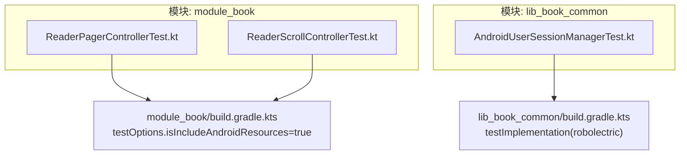
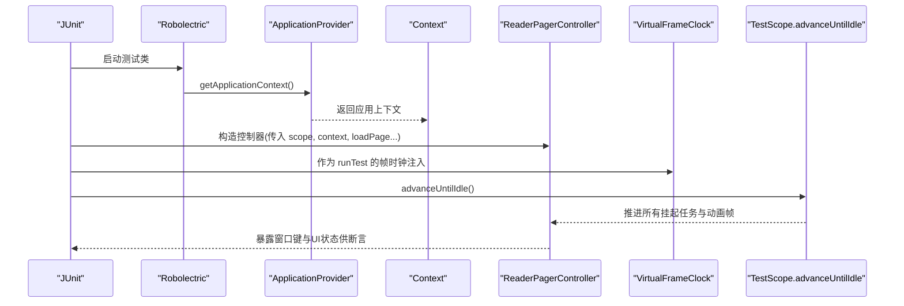
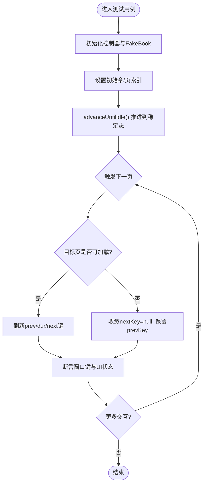
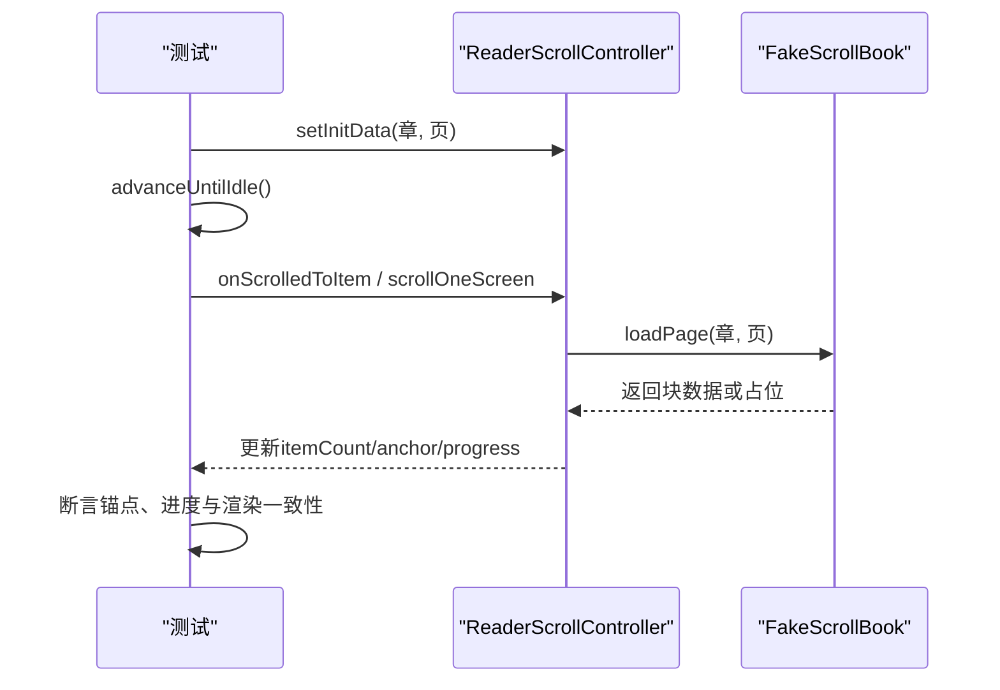
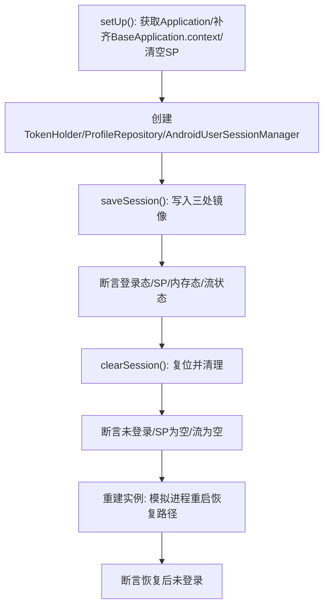
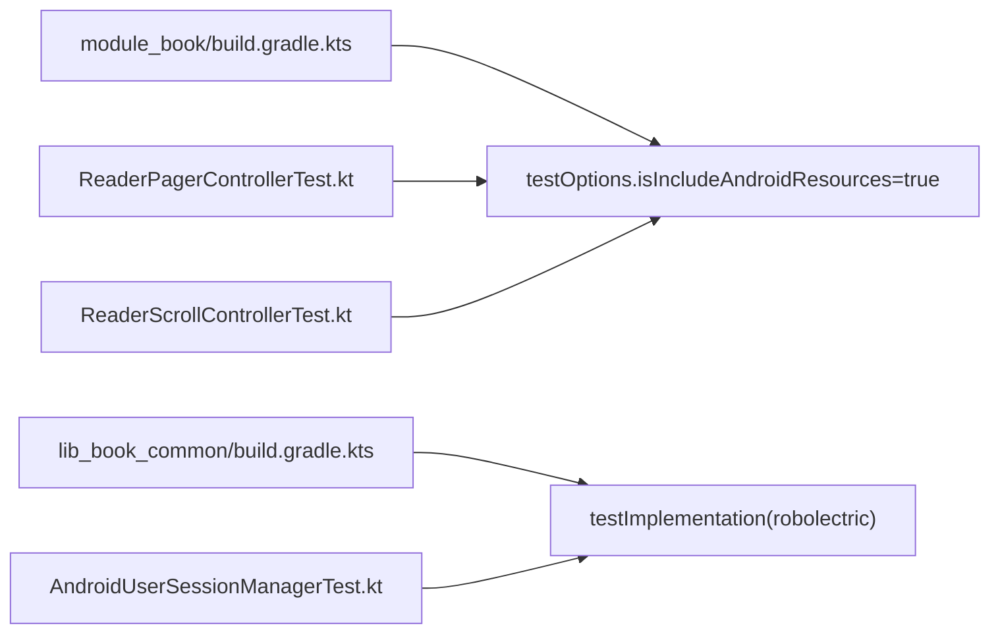

# Robolectric集成测试

<cite>
**本文引用的文件**   
- [ReaderPagerControllerTest.kt](file://module_book/src/test/java/com/ebook/book/reader/ReaderPagerControllerTest.kt)
- [ReaderScrollControllerTest.kt](file://module_book/src/test/java/com/ebook/book/reader/ReaderScrollControllerTest.kt)
- [AndroidUserSessionManagerTest.kt](file://lib_book_common/src/test/java/com/ebook/common/domain/AndroidUserSessionManagerTest.kt)
- [module_book/build.gradle.kts](file://module_book/build.gradle.kts)
- [lib_book_common/build.gradle.kts](file://lib_book_common/build.gradle.kts)
</cite>

## 目录
1. [简介](#简介)
2. [项目结构中的测试布局](#项目结构中的测试布局)
3. [核心组件与职责](#核心组件与职责)
4. [架构总览](#架构总览)
5. [详细组件分析](#详细组件分析)
6. [依赖关系分析](#依赖关系分析)
7. [性能与稳定性考量](#性能与稳定性考量)
8. [故障排查指南](#故障排查指南)
9. [结论](#结论)
10. [附录：关键配置与最佳实践](#附录关键配置与最佳实践)

## 简介
本文件聚焦项目中基于 Robolectric 的集成测试方案，覆盖需要 Android 框架依赖的测试实现方式。重点包括：
- 使用 @RunWith(RobolectricTestRunner::class) 与 @Config(sdk = [34]) 的配置方法
- 通过 ApplicationProvider 提供 Context 与资源访问能力
- 在 JVM 环境下模拟 UI 动画与帧时序（MonotonicFrameClock/VirtualFrameClock）
- 以 ReaderPagerController 为例，验证三页窗口收敛规则与复杂 UI 状态机行为
- 前台 TestScope 与 advanceUntilIdle 的工作机制
- 测试隔离、资源清理与并发安全的策略

## 项目结构中的测试布局
- 单元测试位于各模块 src/test/java，包含需要 Android 环境的测试（Robolectric）
- 插桩测试位于各模块 src/androidTest/java，用于真机/模拟器执行
- 本项目在多个模块启用 Robolectric 并开启 isIncludeAndroidResources，以便在 JVM 下读取合并后的 Android 资源

图表来源
- [ReaderPagerControllerTest.kt:38-39](file://module_book/src/test/java/com/ebook/book/reader/ReaderPagerControllerTest.kt#L38-L39)
- [ReaderScrollControllerTest.kt:26-27](file://module_book/src/test/java/com/ebook/book/reader/ReaderScrollControllerTest.kt#L26-L27)
- [AndroidUserSessionManagerTest.kt:39-40](file://lib_book_common/src/test/java/com/ebook/common/domain/AndroidUserSessionManagerTest.kt#L39-L40)
- [module_book/build.gradle.kts:42-46](file://module_book/build.gradle.kts#L42-L46)
- [lib_book_common/build.gradle.kts:77-80](file://lib_book_common/build.gradle.kts#L77-L80)

章节来源
- [ReaderPagerControllerTest.kt:38-39](file://module_book/src/test/java/com/ebook/book/reader/ReaderPagerControllerTest.kt#L38-L39)
- [ReaderScrollControllerTest.kt:26-27](file://module_book/src/test/java/com/ebook/book/reader/ReaderScrollControllerTest.kt#L26-L27)
- [AndroidUserSessionManagerTest.kt:39-40](file://lib_book_common/src/test/java/com/ebook/common/domain/AndroidUserSessionManagerTest.kt#L39-L40)
- [module_book/build.gradle.kts:42-46](file://module_book/build.gradle.kts#L42-L46)
- [lib_book_common/build.gradle.kts:77-80](file://lib_book_common/build.gradle.kts#L77-L80)

## 核心组件与职责
- Robolectric 运行器与 SDK 配置
  - @RunWith(RobolectricTestRunner::class) 指定 Robolectric 为测试运行器
  - @Config(sdk = [34]) 锁定目标 SDK 版本，确保资源解析一致
- Context 与资源获取
  - 通过 ApplicationProvider.getApplicationContext() 获取 Context，从而访问资源、SharedPreferences 等 Android 服务
- 虚拟帧时钟
  - 自定义 VirtualFrameClock 实现 MonotonicFrameClock，配合 Compose 动画/滚动（Animatable）在 JVM 环境推进时间
- 协程测试环境
  - runTest + 前台 TestScope + advanceUntilIdle，保证页面加载、动画与任务完成被推进至空闲

章节来源
- [ReaderPagerControllerTest.kt:38-39](file://module_book/src/test/java/com/ebook/book/reader/ReaderPagerControllerTest.kt#L38-L39)
- [ReaderPagerControllerTest.kt:246-259](file://module_book/src/test/java/com/ebook/book/reader/ReaderPagerControllerTest.kt#L246-L259)
- [ReaderPagerControllerTest.kt:43-48](file://module_book/src/test/java/com/ebook/book/reader/ReaderPagerControllerTest.kt#L43-L48)
- [AndroidUserSessionManagerTest.kt:52-64](file://lib_book_common/src/test/java/com/ebook/common/domain/AndroidUserSessionManagerTest.kt#L52-L64)

## 架构总览
下图展示 Robolectric 测试如何桥接 Android 环境与被测控制器：

图表来源
- [ReaderPagerControllerTest.kt:43-48](file://module_book/src/test/java/com/ebook/book/reader/ReaderPagerControllerTest.kt#L43-L48)
- [ReaderPagerControllerTest.kt:246-259](file://module_book/src/test/java/com/ebook/book/reader/ReaderPagerControllerTest.kt#L246-L259)
- [ReaderPagerControllerTest.kt:264-278](file://module_book/src/test/java/com/ebook/book/reader/ReaderPagerControllerTest.kt#L264-L278)

## 详细组件分析

### ReaderPagerController 的三页窗口状态机测试
- 测试目标
  - 正常翻页时 prevKey/durKey/nextKey 的正确更新
  - 翻到加载中/失败页时，窗口收敛规则保持不变（避免自指、保留来路页）
  - 回翻后自动重试失败页，且已加载页不再重复抓取
- 关键点
  - 使用 VirtualFrameClock 驱动 Animatable 动画，避免真实时间消耗
  - 使用前台 TestScope 并在每次交互后调用 advanceUntilIdle，确保加载完成与窗口重算
  - FakeBook 提供可控的失败与延迟（CompletableDeferred 闸门），构造“提交翻页时目标页仍 Loading”的场景

图表来源
- [ReaderPagerControllerTest.kt:43-63](file://module_book/src/test/java/com/ebook/book/reader/ReaderPagerControllerTest.kt#L43-L63)
- [ReaderPagerControllerTest.kt:66-82](file://module_book/src/test/java/com/ebook/book/reader/ReaderPagerControllerTest.kt#L66-L82)
- [ReaderPagerControllerTest.kt:85-109](file://module_book/src/test/java/com/ebook/book/reader/ReaderPagerControllerTest.kt#L85-L109)
- [ReaderPagerControllerTest.kt:112-131](file://module_book/src/test/java/com/ebook/book/reader/ReaderPagerControllerTest.kt#L112-L131)
- [ReaderPagerControllerTest.kt:134-148](file://module_book/src/test/java/com/ebook/book/reader/ReaderPagerControllerTest.kt#L134-L148)
- [ReaderPagerControllerTest.kt:151-175](file://module_book/src/test/java/com/ebook/book/reader/ReaderPagerControllerTest.kt#L151-L175)
- [ReaderPagerControllerTest.kt:178-195](file://module_book/src/test/java/com/ebook/book/reader/ReaderPagerControllerTest.kt#L178-L195)

章节来源
- [ReaderPagerControllerTest.kt:43-195](file://module_book/src/test/java/com/ebook/book/reader/ReaderPagerControllerTest.kt#L43-L195)

### 滚动模式下的跨章连续列表测试
- 测试目标
  - 块总数在首个加载结果到达前为 0；加载完成后按实际块数计算
  - 进入一章即物化相邻两章，首末章边界不物化不存在的相邻章
  - 锚点上方插入 item 时阅读位置与进度不变；标题项与首块的往返不重复写进度
  - 末块下一屏跨过标题落到下一章章首；越界落点钳制到章内
  - 进度上报口径与翻页模式一致，按章内块号上报
  - 保留集按章距裁剪，远章正文被清理而近章正文保留
- 关键点
  - 同样使用 Robolectric 提供 Context 与资源
  - 通过 FakeScrollBook 控制请求与延迟，构造多种边界场景
  - 用 advanceUntilIdle 推进排版与预取逻辑

图表来源
- [ReaderScrollControllerTest.kt:30-62](file://module_book/src/test/java/com/ebook/book/reader/ReaderScrollControllerTest.kt#L30-L62)
- [ReaderScrollControllerTest.kt:64-93](file://module_book/src/test/java/com/ebook/book/reader/ReaderScrollControllerTest.kt#L64-L93)
- [ReaderScrollControllerTest.kt:120-152](file://module_book/src/test/java/com/ebook/book/reader/ReaderScrollControllerTest.kt#L120-L152)
- [ReaderScrollControllerTest.kt:154-175](file://module_book/src/test/java/com/ebook/book/reader/ReaderScrollControllerTest.kt#L154-L175)
- [ReaderScrollControllerTest.kt:177-214](file://module_book/src/test/java/com/ebook/book/reader/ReaderScrollControllerTest.kt#L177-L214)
- [ReaderScrollControllerTest.kt:233-257](file://module_book/src/test/java/com/ebook/book/reader/ReaderScrollControllerTest.kt#L233-L257)
- [ReaderScrollControllerTest.kt:259-362](file://module_book/src/test/java/com/ebook/book/reader/ReaderScrollControllerTest.kt#L259-L362)

章节来源
- [ReaderScrollControllerTest.kt:30-362](file://module_book/src/test/java/com/ebook/book/reader/ReaderScrollControllerTest.kt#L30-L362)

### 会话管理器的 Robolectric 回归测试
- 测试目标
  - saveSession 建立三处镜像（内存态、SP、ProfileRepository 流）
  - clearSession 复位 ProfileRepository 的昵称与头像流，并清理另两处镜像
  - 明文密码不落盘，并在构造期清理旧版残留键
- 关键点
  - 必须使用 Robolectric 才能访问 SharedPreferences 与 Application 上下文
  - BaseApplication.context 需在测试中手动补齐，模拟应用启动完成
  - 每个用例显式清空 SP 与静态缓存，确保起点干净

图表来源
- [AndroidUserSessionManagerTest.kt:52-76](file://lib_book_common/src/test/java/com/ebook/common/domain/AndroidUserSessionManagerTest.kt#L52-L76)
- [AndroidUserSessionManagerTest.kt:88-108](file://lib_book_common/src/test/java/com/ebook/common/domain/AndroidUserSessionManagerTest.kt#L88-L108)
- [AndroidUserSessionManagerTest.kt:112-131](file://lib_book_common/src/test/java/com/ebook/common/domain/AndroidUserSessionManagerTest.kt#L112-L131)
- [AndroidUserSessionManagerTest.kt:135-158](file://lib_book_common/src/test/java/com/ebook/common/domain/AndroidUserSessionManagerTest.kt#L135-L158)
- [AndroidUserSessionManagerTest.kt:160-172](file://lib_book_common/src/test/java/com/ebook/common/domain/AndroidUserSessionManagerTest.kt#L160-L172)
- [AndroidUserSessionManagerTest.kt:185-205](file://lib_book_common/src/test/java/com/ebook/common/domain/AndroidUserSessionManagerTest.kt#L185-L205)

章节来源
- [AndroidUserSessionManagerTest.kt:52-205](file://lib_book_common/src/test/java/com/ebook/common/domain/AndroidUserSessionManagerTest.kt#L52-L205)

## 依赖关系分析
- Robolectric 依赖在各模块 build.gradle.kts 中以 testImplementation 引入
- module_book 与 lib_book_common 均开启 isIncludeAndroidResources，使测试可访问合并后的 Android 资源
- 测试依赖 androidx.test.core（ApplicationProvider）、kotlinx.coroutines.test（runTest、advanceUntilIdle）

图表来源
- [module_book/build.gradle.kts:42-46](file://module_book/build.gradle.kts#L42-L46)
- [lib_book_common/build.gradle.kts:77-80](file://lib_book_common/build.gradle.kts#L77-L80)
- [ReaderPagerControllerTest.kt:38-39](file://module_book/src/test/java/com/ebook/book/reader/ReaderPagerControllerTest.kt#L38-L39)
- [ReaderScrollControllerTest.kt:26-27](file://module_book/src/test/java/com/ebook/book/reader/ReaderScrollControllerTest.kt#L26-L27)
- [AndroidUserSessionManagerTest.kt:39-40](file://lib_book_common/src/test/java/com/ebook/common/domain/AndroidUserSessionManagerTest.kt#L39-L40)

章节来源
- [module_book/build.gradle.kts:42-46](file://module_book/build.gradle.kts#L42-L46)
- [lib_book_common/build.gradle.kts:77-80](file://lib_book_common/build.gradle.kts#L77-L80)

## 性能与稳定性考量
- 虚拟帧时钟替代墙上时间：VirtualFrameClock 固定步进推进，避免真实等待，提高测试速度与时序确定性
- 前台 TestScope：将控制器挂在前台作用域，确保 advanceUntilIdle() 能推进后台任务；若挂在 backgroundScope，动画与加载会停滞
- 测试隔离：每个用例显式清空 SharedPreferences 与静态缓存，避免跨用例污染
- 资源清理：测试结束时由 runTest 自动回收协程；必要时在 @Before/@After 中重置全局状态
- 并发安全：使用 CompletableDeferred 作为闸门，精确控制“加载中”窗口，避免竞态导致的不稳定

章节来源
- [ReaderPagerControllerTest.kt:246-259](file://module_book/src/test/java/com/ebook/book/reader/ReaderPagerControllerTest.kt#L246-L259)
- [ReaderPagerControllerTest.kt:264-278](file://module_book/src/test/java/com/ebook/book/reader/ReaderPagerControllerTest.kt#L264-L278)
- [AndroidUserSessionManagerTest.kt:52-64](file://lib_book_common/src/test/java/com/ebook/common/domain/AndroidUserSessionManagerTest.kt#L52-L64)

## 故障排查指南
- “No MonotonicFrameClock”异常
  - 原因：在纯 JVM 单测中使用 Animatable 但未提供帧时钟
  - 解决：为 runTest 注入 VirtualFrameClock
- 动画/加载不推进
  - 原因：控制器挂在后台 TestScope，或忘记调用 advanceUntilIdle
  - 解决：确保控制器挂在前台 TestScope，并在交互后调用 advanceUntilIdle
- 资源无法读取
  - 原因：未启用 isIncludeAndroidResources
  - 解决：在模块构建脚本中开启 unitTests.isIncludeAndroidResources
- 会话状态跨用例污染
  - 原因：SP 与静态缓存未被清理
  - 解决：在 setUp 中清空 SP 与静态缓存，并确保 BaseApplication.context 正确设置

章节来源
- [ReaderPagerControllerTest.kt:43-48](file://module_book/src/test/java/com/ebook/book/reader/ReaderPagerControllerTest.kt#L43-L48)
- [ReaderPagerControllerTest.kt:246-259](file://module_book/src/test/java/com/ebook/book/reader/ReaderPagerControllerTest.kt#L246-L259)
- [AndroidUserSessionManagerTest.kt:52-64](file://lib_book_common/src/test/java/com/ebook/common/domain/AndroidUserSessionManagerTest.kt#L52-L64)
- [module_book/build.gradle.kts:42-46](file://module_book/build.gradle.kts#L42-L46)

## 结论
本项目通过 Robolectric 在 JVM 环境下提供 Android Context 与资源，结合 VirtualFrameClock 与前台 TestScope，实现了对阅读器 UI 状态机与复杂交互的高确定性回归测试。ReaderPagerController 的三页窗口收敛规则与 ReaderScrollController 的跨章滚动模型均得到充分覆盖；同时，AndroidUserSessionManager 的持久化与内存态同步也被严格校验。通过合理的测试隔离与资源清理策略，保证了测试的稳定性和可维护性。

## 附录：关键配置与最佳实践
- 运行器与 SDK
  - @RunWith(RobolectricTestRunner::class)
  - @Config(sdk = [34])
- 资源与依赖
  - testOptions.unitTests.isIncludeAndroidResources = true
  - testImplementation(libs.robolectric)
  - testImplementation(libs.androidx.test.core)
  - testImplementation(libs.kotlinx.coroutines.test)
- 测试模式
  - runTest(VirtualFrameClock()) + 前台 TestScope + advanceUntilIdle()
  - 使用 ApplicationProvider.getApplicationContext<Context>() 获取 Context
- 典型流程
  - 构造 FakeBook/FakeScrollBook 控制加载与失败
  - 设置初始数据后调用 advanceUntilIdle()
  - 触发交互（翻页/滚动）并断言窗口键、UI 状态与进度

章节来源
- [ReaderPagerControllerTest.kt:38-39](file://module_book/src/test/java/com/ebook/book/reader/ReaderPagerControllerTest.kt#L38-L39)
- [ReaderPagerControllerTest.kt:246-259](file://module_book/src/test/java/com/ebook/book/reader/ReaderPagerControllerTest.kt#L246-L259)
- [ReaderPagerControllerTest.kt:264-278](file://module_book/src/test/java/com/ebook/book/reader/ReaderPagerControllerTest.kt#L264-L278)
- [module_book/build.gradle.kts:42-46](file://module_book/build.gradle.kts#L42-L46)
- [lib_book_common/build.gradle.kts:77-80](file://lib_book_common/build.gradle.kts#L77-L80)