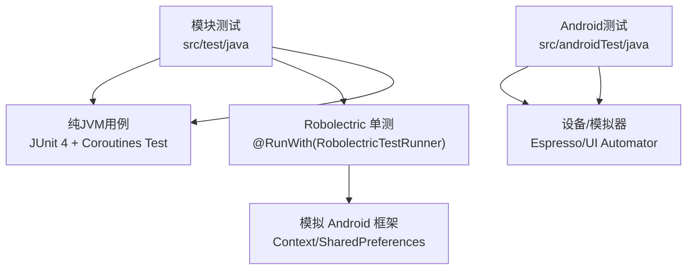
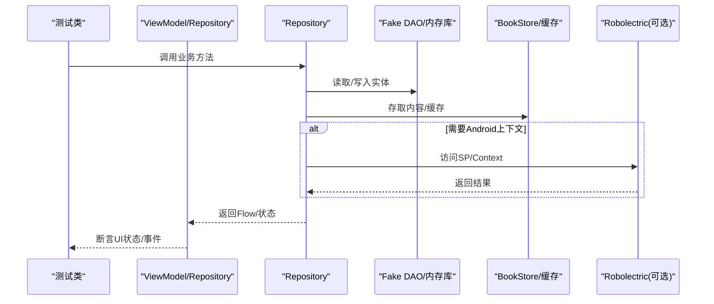
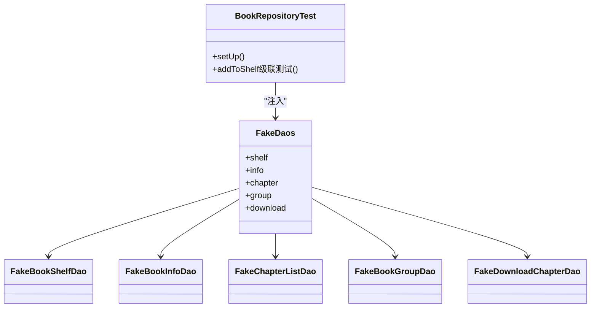
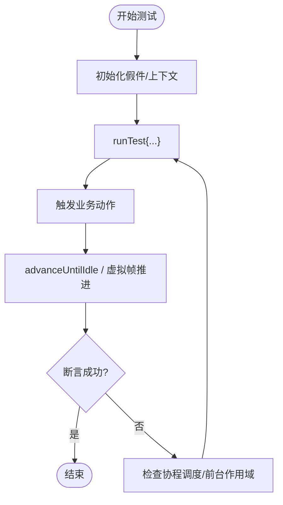
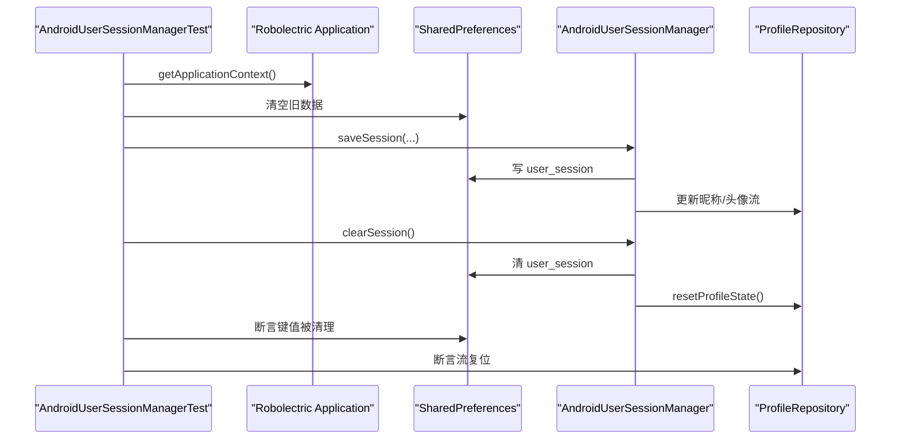
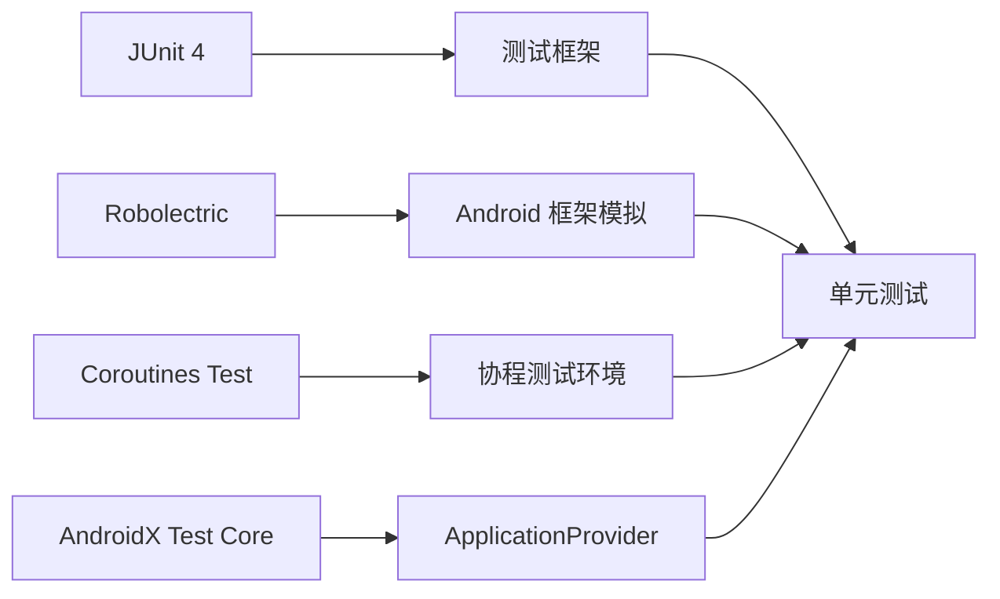

# 单元测试

<cite>
**本文引用的文件**
- [README.MD](file://README.MD)
- [docs/test-coverage-todo.md](file://docs/test-coverage-todo.md)
- [gradle/libs.versions.toml](file://gradle/libs.versions.toml)
- [lib_book_common/build.gradle.kts](file://lib_book_common/build.gradle.kts)
- [lib_book_common/src/test/java/com/ebook/common/repository/FakeDaos.kt](file://lib_book_common/src/test/java/com/ebook/common/repository/FakeDaos.kt)
- [lib_book_common/src/test/java/com/ebook/common/domain/FakeUserSessionManager.kt](file://lib_book_common/src/test/java/com/ebook/common/domain/FakeUserSessionManager.kt)
- [lib_book_common/src/test/java/com/ebook/common/domain/AndroidUserSessionManagerTest.kt](file://lib_book_common/src/test/java/com/ebook/common/domain/AndroidUserSessionManagerTest.kt)
- [lib_book_common/src/test/java/com/ebook/common/repository/BookRepositoryTest.kt](file://lib_book_common/src/test/java/com/ebook/common/repository/BookRepositoryTest.kt)
- [module_book/src/test/java/com/ebook/book/reader/ReaderPagerControllerTest.kt](file://module_book/src/test/java/com/ebook/book/reader/ReaderPagerControllerTest.kt)
</cite>

## 目录
1. [引言](#引言)
2. [项目结构](#项目结构)
3. [核心组件](#核心组件)
4. [架构总览](#架构总览)
5. [详细组件分析](#详细组件分析)
6. [依赖分析](#依赖分析)
7. [性能考虑](#性能考虑)
8. [故障排查指南](#故障排查指南)
9. [结论](#结论)
10. [附录](#附录)

## 引言
本文件面向本仓库的单元测试体系，系统化说明测试组织、命名与规范、Mock 对象策略、纯 JVM 测试实现方案（含 Fake DAO、内存数据源、协程测试环境）、Robolectric 在 Android 框架依赖模拟中的使用、覆盖率要求与统计方法，以及常见场景（异步、数据库、网络、状态管理）的解决方案与最佳实践。文档以仓库内现有测试与配置为依据，给出可复用的范式与参考路径。

## 项目结构
- 测试代码按模块分布在各模块的 src/test/java 与 src/androidTest/java 下：
  - lib_book_common：核心业务逻辑与领域层的纯 JVM 测试，广泛使用手写 Fake DAO、内存数据源与协程测试工具。
  - module_book/module_find/module_me/module_login/module_main：功能模块的 ViewModel/页面/阅读器逻辑测试，部分使用 Robolectric 提供 Context 与资源。
  - lib_ebook_api/lib_ebook_db：网络与数据库侧的契约测试、迁移测试等。
- 构建与测试基础设施集中在 build-logic 与根 gradle 配置中；版本与依赖统一通过版本目录 libs.versions.toml 管理。
- 测试运行命令见仓库指南：./gradlew test 执行全部单元测试；./gradlew :<module>:testDebugUnitTest 执行指定模块单测；connectedAndroidTest 执行插桩测试。

**章节来源**
- [README.MD:106-164](file://README.MD#L106-L164)
- [docs/test-coverage-todo.md:1-30](file://docs/test-coverage-todo.md#L1-L30)

## 核心组件
- Fake DAO 与内存数据源：为 Repository 层提供无 I/O、可断言的内存实现，用于覆盖复杂写入/级联/清理逻辑。
- 协程测试环境：使用 kotlinx-coroutines-test 的 runTest、advanceUntilIdle、虚拟帧时钟控制动画与后台任务推进。
- Robolectric：用于需要真实 SharedPreferences、Application 上下文或 UI 渲染相关行为的回归测试。
- 覆盖率待办清单：集中记录已覆盖与未覆盖区域，作为持续改进的依据。

**章节来源**
- [lib_book_common/src/test/java/com/ebook/common/repository/FakeDaos.kt:18-30](file://lib_book_common/src/test/java/com/ebook/common/repository/FakeDaos.kt#L18-L30)
- [lib_book_common/src/test/java/com/ebook/common/repository/BookRepositoryTest.kt:35-50](file://lib_book_common/src/test/java/com/ebook/common/repository/BookRepositoryTest.kt#L35-L50)
- [module_book/src/test/java/com/ebook/book/reader/ReaderPagerControllerTest.kt:20-37](file://module_book/src/test/java/com/ebook/book/reader/ReaderPagerControllerTest.kt#L20-L37)
- [docs/test-coverage-todo.md:1-20](file://docs/test-coverage-todo.md#L1-L20)

## 架构总览
本项目测试分层清晰：
- 纯 JVM 测试：针对领域与仓储逻辑，避免 Android 平台耦合，速度快、可并行。
- Robolectric 测试：对依赖 Android 框架但无需真机的行为进行验证（如 SP 读写、基础 UI 渲染）。
- 插桩测试：在设备/模拟器上验证 UI 交互与端到端流程。

**图表来源**
- [lib_book_common/src/test/java/com/ebook/common/repository/FakeDaos.kt:18-30](file://lib_book_common/src/test/java/com/ebook/common/repository/FakeDaos.kt#L18-L30)
- [lib_book_common/src/test/java/com/ebook/common/repository/BookRepositoryTest.kt:61-82](file://lib_book_common/src/test/java/com/ebook/common/repository/BookRepositoryTest.kt#L61-L82)
- [lib_book_common/src/test/java/com/ebook/common/domain/AndroidUserSessionManagerTest.kt:24-40](file://lib_book_common/src/test/java/com/ebook/common/domain/AndroidUserSessionManagerTest.kt#L24-L40)

**章节来源**
- [lib_book_common/src/test/java/com/ebook/common/repository/BookRepositoryTest.kt:35-50](file://lib_book_common/src/test/java/com/ebook/common/repository/BookRepositoryTest.kt#L35-L50)
- [lib_book_common/src/test/java/com/ebook/common/domain/AndroidUserSessionManagerTest.kt:24-40](file://lib_book_common/src/test/java/com/ebook/common/domain/AndroidUserSessionManagerTest.kt#L24-L40)

## 详细组件分析

### 纯 JVM 测试与 Fake DAO
- 目标：在不启动 Android 进程的情况下，验证仓储层复杂逻辑（级联写入、关联查询、孤立清理、补章合并等）。
- 实践要点：
  - 使用独立 Fake DAO 集合封装多个 DAO 的内存实现，构造时一行注入，便于复用与断言。
  - 利用 LinkedMap/StateFlow 模拟持久化语义（唯一键、排序、响应式镜像）。
  - 使用 DirectTransactionRunner 或直接事务执行块，保证测试中“事务”语义可跑通。
  - 借助 TemporaryFolder 隔离文件系统输入输出，避免用例互相污染。

**图表来源**
- [lib_book_common/src/test/java/com/ebook/common/repository/FakeDaos.kt:18-30](file://lib_book_common/src/test/java/com/ebook/common/repository/FakeDaos.kt#L18-L30)
- [lib_book_common/src/test/java/com/ebook/common/repository/FakeDaos.kt:32-81](file://lib_book_common/src/test/java/com/ebook/common/repository/FakeDaos.kt#L32-L81)
- [lib_book_common/src/test/java/com/ebook/common/repository/FakeDaos.kt:83-105](file://lib_book_common/src/test/java/com/ebook/common/repository/FakeDaos.kt#L83-L105)
- [lib_book_common/src/test/java/com/ebook/common/repository/FakeDaos.kt:107-124](file://lib_book_common/src/test/java/com/ebook/common/repository/FakeDaos.kt#L107-L124)
- [lib_book_common/src/test/java/com/ebook/common/repository/FakeDaos.kt:126-170](file://lib_book_common/src/test/java/com/ebook/common/repository/FakeDaos.kt#L126-L170)
- [lib_book_common/src/test/java/com/ebook/common/repository/FakeDaos.kt:172-256](file://lib_book_common/src/test/java/com/ebook/common/repository/FakeDaos.kt#L172-L256)

**章节来源**
- [lib_book_common/src/test/java/com/ebook/common/repository/FakeDaos.kt:18-256](file://lib_book_common/src/test/java/com/ebook/common/repository/FakeDaos.kt#L18-L256)
- [lib_book_common/src/test/java/com/ebook/common/repository/BookRepositoryTest.kt:61-82](file://lib_book_common/src/test/java/com/ebook/common/repository/BookRepositoryTest.kt#L61-L82)

### 协程测试环境与异步操作测试
- 使用 runTest 包裹测试主体，配合 advanceUntilIdle 推进前台任务。
- 对于涉及动画/页面加载的场景，使用虚拟帧时钟（MonotonicFrameClock/VirtualFrameClock）驱动 Animatable，避免真实时间消耗。
- 将控制器/业务逻辑挂在 TestScope 的前台作用域，确保 advanceUntilIdle 能推进所有必要任务。

**图表来源**
- [module_book/src/test/java/com/ebook/book/reader/ReaderPagerControllerTest.kt:20-37](file://module_book/src/test/java/com/ebook/book/reader/ReaderPagerControllerTest.kt#L20-L37)
- [module_book/src/test/java/com/ebook/book/reader/ReaderPagerControllerTest.kt:42-63](file://module_book/src/test/java/com/ebook/book/reader/ReaderPagerControllerTest.kt#L42-L63)

**章节来源**
- [module_book/src/test/java/com/ebook/book/reader/ReaderPagerControllerTest.kt:20-37](file://module_book/src/test/java/com/ebook/book/reader/ReaderPagerControllerTest.kt#L20-L37)
- [module_book/src/test/java/com/ebook/book/reader/ReaderPagerControllerTest.kt:42-63](file://module_book/src/test/java/com/ebook/book/reader/ReaderPagerControllerTest.kt#L42-L63)

### Robolectric 在单元测试中的应用
- 适用场景：需要 Application、SharedPreferences、系统资源或轻量 UI 渲染的行为验证。
- 典型用法：
  - @RunWith(RobolectricTestRunner::class) 与 @Config(sdk = ...) 配置运行环境。
  - 使用 ApplicationProvider.getApplicationContext() 获取应用上下文。
  - 手动设置 BaseApplication.context，使静态工具可用。
  - 每个用例前清空 SP 与静态缓存，避免跨用例污染。
- 案例：会话管理器三处镜像（SP、内存态、ProfileRepository 流）的一致性验证与密码不落盘约束。

**图表来源**
- [lib_book_common/src/test/java/com/ebook/common/domain/AndroidUserSessionManagerTest.kt:24-40](file://lib_book_common/src/test/java/com/ebook/common/domain/AndroidUserSessionManagerTest.kt#L24-L40)
- [lib_book_common/src/test/java/com/ebook/common/domain/AndroidUserSessionManagerTest.kt:52-76](file://lib_book_common/src/test/java/com/ebook/common/domain/AndroidUserSessionManagerTest.kt#L52-L76)
- [lib_book_common/src/test/java/com/ebook/common/domain/AndroidUserSessionManagerTest.kt:112-131](file://lib_book_common/src/test/java/com/ebook/common/domain/AndroidUserSessionManagerTest.kt#L112-L131)

**章节来源**
- [lib_book_common/src/test/java/com/ebook/common/domain/AndroidUserSessionManagerTest.kt:24-40](file://lib_book_common/src/test/java/com/ebook/common/domain/AndroidUserSessionManagerTest.kt#L24-L40)
- [lib_book_common/src/test/java/com/ebook/common/domain/AndroidUserSessionManagerTest.kt:52-76](file://lib_book_common/src/test/java/com/ebook/common/domain/AndroidUserSessionManagerTest.kt#L52-L76)
- [lib_book_common/src/test/java/com/ebook/common/domain/AndroidUserSessionManagerTest.kt:112-131](file://lib_book_common/src/test/java/com/ebook/common/domain/AndroidUserSessionManagerTest.kt#L112-L131)

### Mock 对象的创建与使用
- 原则：
  - 接口优先：为 Repository/DataSource 等对外能力提供内存实现或桩。
  - 可观察性：暴露 storedValues()/countFor() 等方法，便于断言内部状态。
  - 一致性：与生产实现保持相同的主键策略、排序规则、响应式行为。
- 示例：
  - FakeUserSessionManager：同步 token 到 TokenHolder，暴露 savedSessions/rotated/clearCount 等观测点。
  - FakeDaos：统一注入多 DAO，模拟数据库表与 Flow 失效。

**章节来源**
- [lib_book_common/src/test/java/com/ebook/common/domain/FakeUserSessionManager.kt:7-72](file://lib_book_common/src/test/java/com/ebook/common/domain/FakeUserSessionManager.kt#L7-L72)
- [lib_book_common/src/test/java/com/ebook/common/repository/FakeDaos.kt:18-30](file://lib_book_common/src/test/java/com/ebook/common/repository/FakeDaos.kt#L18-L30)

### 命名约定与组织结构
- 测试类命名：<Subject>Test，位于被测类的同包或子包 test 目录下。
- 测试方法使用反引号包裹的句子式描述，表达行为意图。
- 测试分组：按领域/模块组织，如 repository、domain、reader 等。
- 共享夹具：FakeDaos、FakeUserSessionManager 等放在公共测试目录，供多个用例复用。

**章节来源**
- [README.MD:106-164](file://README.MD#L106-L164)
- [docs/test-coverage-todo.md:1-20](file://docs/test-coverage-todo.md#L1-L20)

### 常见测试场景与解决方案
- 异步操作测试：
  - 使用 runTest 与 advanceUntilIdle 推进前台任务；动画/页面加载使用虚拟帧时钟。
  - 将业务逻辑挂载于前台 TestScope，确保 backgroundScope 的任务也能被推进。
- 数据库操作测试：
  - 使用 Fake DAO 替代 Room，断言写入/删除/级联清理等行为。
  - 对主键策略、唯一索引、排序保持一致，确保回归有效。
- 网络请求测试：
  - 通过假 DataSource/Repository 阻断真实网络；对 JSON 资产形态进行契约测试，确保序列化一致。
- 状态管理测试：
  - 对 StateFlow/SharedFlow 进行订阅与断言，验证状态机收敛与事件顺序。

**章节来源**
- [module_book/src/test/java/com/ebook/book/reader/ReaderPagerControllerTest.kt:20-37](file://module_book/src/test/java/com/ebook/book/reader/ReaderPagerControllerTest.kt#L20-L37)
- [lib_book_common/src/test/java/com/ebook/common/repository/FakeDaos.kt:172-256](file://lib_book_common/src/test/java/com/ebook/common/repository/FakeDaos.kt#L172-L256)
- [docs/test-coverage-todo.md:15-23](file://docs/test-coverage-todo.md#L15-L23)

### 测试覆盖率的要求与统计方法
- 覆盖率待办清单记录了各模块的覆盖情况与遗留项，包括行/分支/函数覆盖的目标与现状。
- 建议结合 Gradle 插件或 CI 报告生成覆盖率指标，并在 PR 中展示趋势变化。
- 重点覆盖：
  - 边界条件：分页到底、空列表、错误码、超时重试。
  - 异常处理：网络失败、IO 异常、类型转换异常。
  - 性能相关：大量数据下的内存占用、I/O 次数、协程并发度。

**章节来源**
- [docs/test-coverage-todo.md:1-30](file://docs/test-coverage-todo.md#L1-L30)

## 依赖分析
- 测试依赖集中于版本目录 libs.versions.toml，统一版本管理。
- 关键测试依赖：
  - JUnit 4：测试框架。
  - Robolectric：Android 框架模拟。
  - kotlinx-coroutines-test：协程测试工具。
  - androidx.test.core：测试辅助（ApplicationProvider 等）。
- 模块内测试依赖声明示例：在 lib_book_common 的 build.gradle.kts 中声明 testImplementation 与 androidTestImplementation。

**图表来源**
- [gradle/libs.versions.toml:45-50](file://gradle/libs.versions.toml#L45-L50)
- [lib_book_common/build.gradle.kts:76-83](file://lib_book_common/build.gradle.kts#L76-L83)

**章节来源**
- [gradle/libs.versions.toml:45-50](file://gradle/libs.versions.toml#L45-L50)
- [lib_book_common/build.gradle.kts:76-83](file://lib_book_common/build.gradle.kts#L76-L83)

## 性能考虑
- 纯 JVM 测试应尽可能避免 I/O，使用内存实现与临时文件夹隔离。
- 协程测试需合理选择调度器与作用域，避免虚假阻塞或悬挂任务。
- Robolectric 测试应尽量精简，仅包含必要的 Android 依赖。
- 大规模数据测试建议使用固定语料与基准用例，避免随机性导致的不稳定。

[本节提供一般性指导，不直接分析具体文件]

## 故障排查指南
- 常见问题：
  - 协程任务未推进：确认是否挂在 TestScope 前台作用域，是否调用 advanceUntilIdle。
  - SP 数据污染：确保每个用例前清空 SP 与静态缓存。
  - 假件不一致：核对 Fake DAO 与生产 DAO 的主键、排序、唯一索引语义是否一致。
  - 覆盖率不足：对照待办清单补齐关键路径的用例。
- 定位方法：
  - 打印日志并查看 logcat（设备测试）。
  - 缩小范围：将复合用例拆分为最小可复现片段。
  - 借助断言中间状态：在关键步骤插入断言，逐步定位问题。

**章节来源**
- [docs/test-coverage-todo.md:82-129](file://docs/test-coverage-todo.md#L82-L129)

## 结论
本项目测试体系以纯 JVM 测试为主，辅以 Robolectric 与插桩测试，覆盖了仓储、领域、阅读器等关键路径。通过 Fake DAO、内存数据源与协程测试工具，实现了高速度、高可靠性的回归保障。覆盖率待办清单为后续改进提供了明确方向。建议在新增功能时同步补充用例，保持测试与实现的一致性。

[本节总结性内容，不直接分析具体文件]

## 附录
- 常用命令：
  - 全量单元测试：./gradlew test
  - 指定模块单测：./gradlew :<module>:testDebugUnitTest
  - 插桩测试：./gradlew connectedAndroidTest
- 参考文件：
  - 测试约定与命令：README.MD
  - 覆盖率待办：docs/test-coverage-todo.md
  - 依赖版本：gradle/libs.versions.toml
  - 模块测试依赖：lib_book_common/build.gradle.kts

**章节来源**
- [README.MD:106-164](file://README.MD#L106-L164)
- [docs/test-coverage-todo.md:1-30](file://docs/test-coverage-todo.md#L1-L30)
- [gradle/libs.versions.toml:45-50](file://gradle/libs.versions.toml#L45-L50)
- [lib_book_common/build.gradle.kts:76-83](file://lib_book_common/build.gradle.kts#L76-L83)