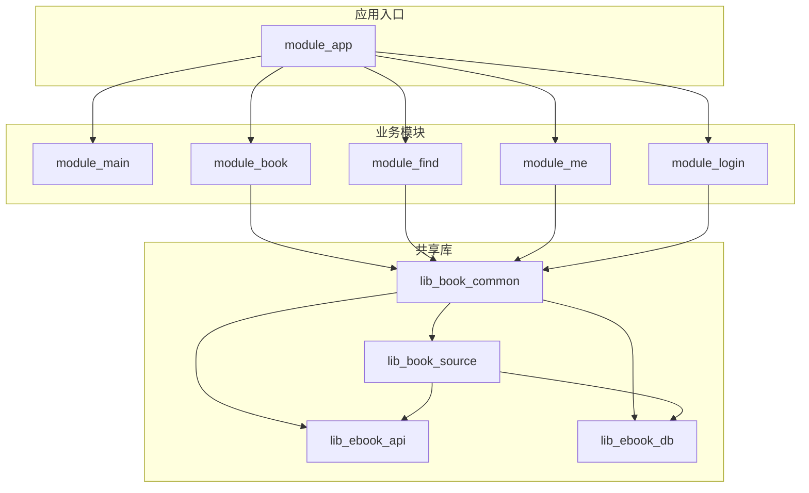
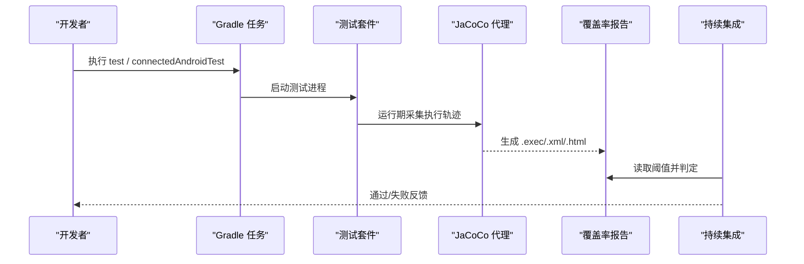

# 测试覆盖率与分析

<cite>
**本文引用的文件**
- [docs/test-coverage-todo.md](file://docs/test-coverage-todo.md)
- [settings.gradle.kts](file://settings.gradle.kts)
- [gradle.properties](file://gradle.properties)
- [build-logic/convention/src/main/kotlin/AndroidComposeConventionPlugin.kt](file://build-logic/convention/src/main/kotlin/AndroidComposeConventionPlugin.kt)
- [build-logic/convention/src/main/kotlin/AndroidApplicationConventionPlugin.kt](file://build-logic/convention/src/main/kotlin/AndroidApplicationConventionPlugin.kt)
- [lib_book_common/build.gradle.kts](file://lib_book_common/build.gradle.kts)
- [README.MD](file://README.MD)
</cite>

## 目录
1. [引言](#引言)
2. [项目结构](#项目结构)
3. [核心组件](#核心组件)
4. [架构总览](#架构总览)
5. [详细组件分析](#详细组件分析)
6. [依赖分析](#依赖分析)
7. [性能考量](#性能考量)
8. [故障排查指南](#故障排查指南)
9. [结论](#结论)
10. [附录](#附录)

## 引言
本文件面向“测试覆盖率分析与质量门禁”的目标，结合仓库现有测试基础设施与约定，说明：
- 覆盖率指标定义（行、分支、函数、类）及在 Android/Kotlin 工程中的计算口径
- JaCoCo 插件在本项目的集成方式、报告生成与使用建议
- 覆盖率阈值管理（最低覆盖率、增量覆盖率检查）与落地策略
- 覆盖率报告分析方法（未覆盖识别、高复杂度关注）
- 测试待办事项的管理流程（以 docs/test-coverage-todo.md 为中心）
- 持续集成中的自动化检查与质量门禁设置建议
- 针对关键业务逻辑与边界条件的覆盖率提升策略

本仓库当前采用多模块 Gradle 工程，测试集中在各模块的 src/test/java 与 androidTest。根与模块级构建脚本中未发现 JaCoCo 或覆盖率任务配置；覆盖率提升需按需引入并集中管理。

## 项目结构
仓库为多模块 Android 应用，核心目录与职责如下：
- build-logic：统一构建约定插件（如 Compose、Lint、Hilt、Android 应用/库等）
- module_app/module_main/module_book/module_find/module_me/module_login：功能模块（UI/业务）
- lib_book_common：共享库（通用工具、MVVM/Provider 基类、解析器编排等）
- lib_book_source：书源解析层（原生解析器 + 脚本书源解释器 + :js 沙箱执行器）
- lib_ebook_api：网络服务、实体、拦截器
- lib_ebook_db：Room 数据库实体与 DAO
- scripts：辅助脚本（含生成测试用 EPUB 等）
- docs：文档与 ADR，包含测试覆盖待办清单

图表来源
- [settings.gradle.kts:55-65](file://settings.gradle.kts#L55-L65)

章节来源
- [settings.gradle.kts:55-65](file://settings.gradle.kts#L55-L65)

## 核心组件
- 测试基础设施现状
  - 单元测试位于各模块 src/test/java，插桩测试位于 androidTest/java
  - 已广泛使用 JUnit 4，部分用例使用 Robolectric 模拟 Android 上下文
  - 测试约定由仓库指南明确：命名规范、行为变更同步更新测试、覆盖率待办见 docs/test-coverage-todo.md
- 覆盖率现状
  - 根与模块构建脚本未发现 JaCoCo 或覆盖率相关任务配置
  - 建议在 build-logic 中统一启用覆盖率统计，避免在各模块重复配置
- 测试覆盖率待办管理
  - 通过 docs/test-coverage-todo.md 维护待补测项、人工验证项与回归锁定范围
  - 该文件记录了大量关键路径的自动化覆盖状态与设备侧验证清单

章节来源
- [docs/test-coverage-todo.md:1-80](file://docs/test-coverage-todo.md#L1-L80)
- [README.MD](file://README.MD)

## 架构总览
从“覆盖率与 CI 质量门禁”的角度，系统可抽象为以下层次：
- 构建层：Gradle 任务链（test、connectedAndroidTest、assemble），在此之上接入 JaCoCo 任务与报告聚合
- 测试层：JVM 单测（纯逻辑）、Robolectric 单测（Android 环境模拟）、Instrumented 测试（真机/模拟器）
- 采集层：JaCoCo 代理注入字节码、收集执行轨迹、生成 .exec/.xml/.html 报告
- 决策层：CI 读取报告阈值，判定是否放行合并请求

[无图表来源——此图为概念性流程图]

## 详细组件分析

### 覆盖率指标定义与计算口径
- 行覆盖率（Line Coverage）
  - 定义：被执行的代码行数占可执行代码行数的比例
  - 在 Android/Kotlin 工程中，通常对 JVM 侧代码（src/test/java）与编译产物进行采样；对于 Android 特有 API 的路径，建议使用 Robolectric 或 Instrumented 测试驱动
- 分支覆盖率（Branch Coverage）
  - 定义：条件分支（if/else/when/短路逻辑）中被执行的比例
  - 用于识别复杂判断与异常分支的覆盖缺口
- 函数覆盖率（Function Coverage）
  - 定义：被调用的函数数量占全部函数数量的比例
  - 适合评估“入口方法/公共 API”的覆盖完整性
- 类覆盖率（Class Coverage）
  - 定义：被至少一个测试触发的类数量占全部类的比例
  - 作为粗略的覆盖面指标，常用于快速概览

说明
- 本项目为 Kotlin/AGP 工程，推荐以 JaCoCo 标准指标为准，并在报告中同时查看四类指标，以便定位不同粒度的覆盖缺口

[无章节来源——本节为通用指标说明]

### JaCoCo 插件集成与报告生成
现状
- 在根与模块构建脚本中未发现 JaCoCo 或覆盖率任务配置
- 建议通过 build-logic 的统一约定插件引入，确保全仓一致

建议集成方案
- 在 build-logic 的约定插件中为所有 Android 模块统一应用 JaCoCo 插件
- 为 test 与 connectedAndroidTest 任务配置 JaCoCo 代理注入
- 聚合报告：按模块生成 .exec，再汇总为全局 XML/HTML 报告
- 报告输出位置固定，便于 CI 抓取与归档

报告用途
- HTML 报告用于本地开发时快速定位未覆盖区域
- XML 报告供 CI 解析并对比阈值
- .exec 文件可用于增量覆盖率比对（拉取基线）

[无章节来源——本节为通用实践建议]

### 覆盖率阈值管理与增量检查
- 最低覆盖率要求
  - 建议按模块设定最低覆盖率阈值（例如行覆盖率≥80%，分支覆盖率≥70%），对核心库（lib_book_common、lib_book_source）提高门槛
  - UI 与页面初始化类可降低要求，重点放在业务逻辑、解析器、数据流与异常分支
- 增量覆盖率检查
  - 在 PR 阶段仅对变更文件计算覆盖率，并与基线比较，防止回退
  - 对新增代码必须达到更高阈值（如行覆盖率≥90%），旧代码维持基线

阈值落地
- 将阈值写入规则文件，CI 根据规则判定 pass/fail
- 对特定包/类可设置豁免（如第三方封装、胶水层），但需评审批准

[无章节来源——本节为通用治理建议]

### 覆盖率报告分析方法
- 未覆盖代码识别
  - 优先关注：核心业务逻辑、异常分支、重试/超时/失败路径、跨进程/异步回调
  - 结合复杂度分析：圈复杂度高的函数应优先补充分支覆盖
- 高复杂度区域关注
  - 解析器（目录/正文分页、URL 模板、JSONPath/正则求值）
  - 会话/认证流程（token 刷新、过期处理）
  - 下载队列（重试耗尽、出队语义）
  - 沙箱执行器（超时/内存/栈溢出、白名单拒绝）
- 趋势追踪
  - 每次 PR 生成增量报告，观察覆盖率升降与热点变化
  - 定期复盘“长期低覆盖”的模块与类，制定改进计划

[无章节来源——本节为通用分析方法]

### 测试待办事项管理（docs/test-coverage-todo.md）
- 作用
  - 集中记录“已覆盖/未覆盖/人工验证”的关键路径
  - 作为覆盖率改进计划的依据，指导后续补测优先级
- 使用方法
  - 新增功能或修复缺陷后，对照清单确认是否已有自动化覆盖
  - 若无，则登记到待办，并标注阻塞点（如需要 Robolectric/假件/设备验证）
  - 完成补测后更新状态，形成闭环
- 与覆盖率指标联动
  - 对高频回归路径（如评论分页、导入判重、阅读器翻页控制器）优先补齐分支与函数覆盖
  - 对设备侧特性（如 .so 加载、沙箱外呼限制）保留人工验证项，但不替代自动化覆盖

章节来源
- [docs/test-coverage-todo.md:1-80](file://docs/test-coverage-todo.md#L1-L80)

### 覆盖率提升策略（关键业务与边界条件）
- 关键业务逻辑
  - 书源解析链：URL 模板、分页跟进、JSONPath/正则求值、错误翻译
  - 会话与认证：token 同步、过期静默刷新、会话三处镜像清理
  - 下载队列：重试耗尽后出队、暂停不出队、空正文不入库
  - 阅读器控制：翻页窗口收敛、块高取值、章间衔接、落点持久化
- 边界条件
  - 空键/空页/越界页/软 404 的 hasMore 推导
  - 分叉目录的追加与放弃策略
  - 沙箱执行器的超时/内存/栈溢出、白名单拒绝、隔离进程
- 测试形态组合
  - 纯 JVM 单测：解析器、数据合并、去重、格式检测
  - Robolectric：需要 Context/SP/Flow 的业务逻辑
  - Instrumented：真内核/跨进程（:js 沙箱）、UI 渲染与像素断言

[无章节来源——本节为通用策略建议]

### 持续集成中的作用（自动化检查与质量门禁）
- 自动化检查
  - 在 CI 中执行 test 与 connectedAndroidTest，生成覆盖率报告
  - 使用 JaCoCo 阈值规则判定是否通过
- 质量门禁
  - PR 合并前必须满足最低覆盖率阈值
  - 增量覆盖率不得下降（或下降需附带理由与豁免）
  - 高风险模块（解析器、下载、沙箱）设置更高阈值
- 报告可视化
  - 将 HTML/XML 报告作为构建产物上传，便于回溯
  - 在 PR 中展示覆盖率变化摘要（新增/减少/未覆盖文件）

[无章节来源——本节为通用 CI 建议]

## 依赖分析
- 构建与测试依赖
  - 根 settings 声明了所有模块，测试任务由各模块自行组织
  - 模块依赖方向清晰：业务模块 → lib_book_common → lib_book_source/lib_ebook_api/lib_ebook_db
- 覆盖率采集依赖
  - 当前未见 JaCoCo 依赖；需在 build-logic 中统一引入
  - 对 Android 模块，需确保 test 与 connectedAndroidTest 均注入代理

图表来源
- [settings.gradle.kts:55-65](file://settings.gradle.kts#L55-L65)

章节来源
- [settings.gradle.kts:55-65](file://settings.gradle.kts#L55-L65)

## 性能考量
- 覆盖率采集会增加构建与测试时长，建议在 CI 中并行执行、缓存 JaCoCo 数据
- 对大型测试集（如 Instrumented 测试）可按模块拆分报告，避免单次聚合开销过大
- 增量覆盖率仅对变更文件计算，减少 CI 时间

[无章节来源——本节为通用优化建议]

## 故障排查指南
- 常见问题
  - 覆盖率报告为空：确认测试是否真正执行；Android 模块是否注入 JaCoCo 代理
  - 分支覆盖率偏低：检查 when/if/短路逻辑是否覆盖失败分支
  - 增量覆盖率下降：审查新增代码是否缺少边界与异常路径测试
- 定位手段
  - 使用 HTML 报告逐文件查看未覆盖行
  - 结合圈复杂度分析，优先覆盖高复杂度函数
  - 对异步/协程场景，确保测试推进后台作用域（如 advanceUntilIdle）

[无章节来源——本节为通用排错建议]

## 结论
- 当前仓库具备完善的测试组织与丰富的单测/设备验证清单，但尚未发现 JaCoCo 覆盖率配置
- 建议通过 build-logic 统一引入 JaCoCo，建立覆盖率阈值与增量检查机制
- 以 docs/test-coverage-todo.md 为牵引，优先补齐关键业务与边界条件的自动化覆盖
- 在 CI 中固化覆盖率门禁，保障代码质量不随迭代退化

[无章节来源——本节为总结陈述]

## 附录
- 常用命令（参考仓库指南）
  - 单元测试：./gradlew test
  - 模块单测：./gradlew :module_book:testDebugUnitTest
  - 插桩测试：./gradlew connectedAndroidTest
- 覆盖率任务建议（概念性）
  - 为 test 与 connectedAndroidTest 启用 JaCoCo 代理
  - 生成模块级 .exec，聚合为全局 XML/HTML 报告
  - 在 CI 中读取阈值并判定

[无章节来源——本节为通用指引]