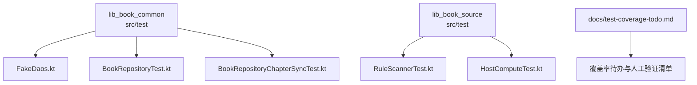
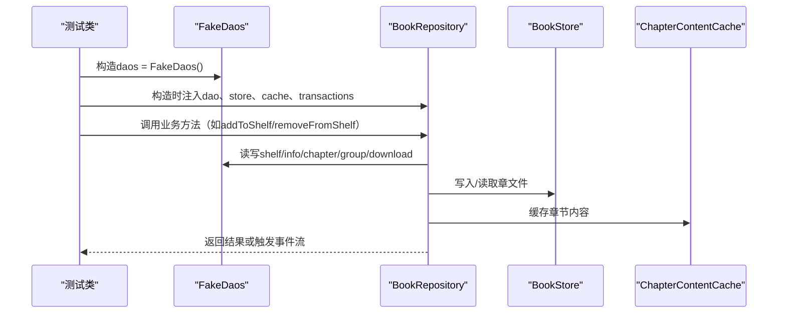
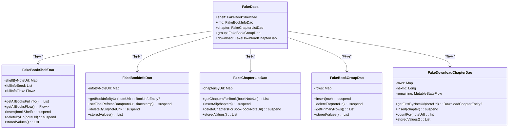
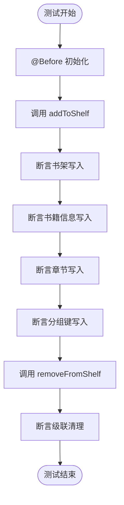
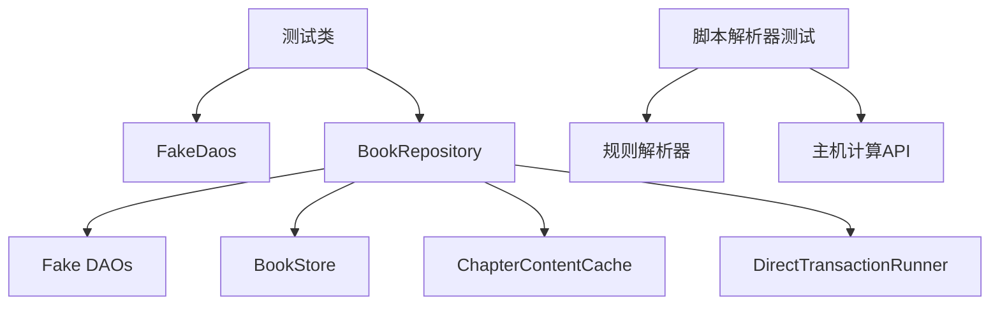

# 纯JVM单元测试

<cite>
**本文引用的文件**
- [FakeDaos.kt](file://lib_book_common/src/test/java/com/ebook/common/repository/FakeDaos.kt)
- [BookRepositoryTest.kt](file://lib_book_common/src/test/java/com/ebook/common/repository/BookRepositoryTest.kt)
- [BookRepositoryChapterSyncTest.kt](file://lib_book_common/src/test/java/com/ebook/common/repository/BookRepositoryChapterSyncTest.kt)
- [HostComputeTest.kt](file://lib_book_source/src/test/java/com/ebook/source/sandbox/HostComputeTest.kt)
- [RuleScannerTest.kt](file://lib_book_source/src/test/java/com/ebook/source/script/RuleScannerTest.kt)
- [test-coverage-todo.md](file://docs/test-coverage-todo.md)
</cite>

## 目录
1. [引言](#引言)
2. [项目结构](#项目结构)
3. [核心组件](#核心组件)
4. [架构总览](#架构总览)
5. [详细组件分析](#详细组件分析)
6. [依赖关系分析](#依赖关系分析)
7. [性能考量](#性能考量)
8. [故障排查指南](#故障排查指南)
9. [结论](#结论)
10. [附录](#附录)

## 引言
本文件面向“纯JVM单元测试”主题，聚焦于不依赖Android框架的测试实现方案。重点包括：
- Fake DAO工厂与接口Mock的实现模式（FakeDaos、FakeBookShelfDao、FakeBookInfoDao、FakeChapterListDao、FakeBookGroupDao、FakeDownloadChapterDao）
- 内存数据源的使用方式（linkedMapOf存储、MutableStateFlow模拟数据库流、种子数据设置与断言）
- 协程测试环境配置（runTest、runCurrent/advanceUntilIdle、VirtualFrameClock在测试中的使用场景）
- 测试用例的组织结构与命名约定（@Before初始化、@Test方法、边界条件测试）
- 具体测试示例（BookRepository业务逻辑、脚本规则解析器行为验证）
- 测试覆盖率要求与最佳实践（行覆盖、分支覆盖统计与分析）

该文档基于仓库中现有测试源码与文档进行归纳与可视化说明，确保读者能在本地快速复现并扩展纯JVM测试。

## 项目结构
本项目为多模块Gradle工程，纯JVM测试集中在各模块的src/test目录中。其中：
- lib_book_common：包含大量纯JVM测试，如BookRepository、导入、文本处理、书源管理等；提供FakeDaos与DirectTransactionRunner等测试基础设施
- lib_book_source：包含脚本解析器与沙箱相关测试，如规则词法扫描、主机计算API、网络守卫等
- 其他模块：各自具备少量纯JVM测试或UI测试（Robolectric/Compose）

图表来源
- [FakeDaos.kt:18-30](file://lib_book_common/src/test/java/com/ebook/common/repository/FakeDaos.kt#L18-L30)
- [BookRepositoryTest.kt:35-82](file://lib_book_common/src/test/java/com/ebook/common/repository/BookRepositoryTest.kt#L35-L82)
- [BookRepositoryChapterSyncTest.kt:28-89](file://lib_book_common/src/test/java/com/ebook/common/repository/BookRepositoryChapterSyncTest.kt#L28-L89)
- [RuleScannerTest.kt:7-78](file://lib_book_source/src/test/java/com/ebook/source/script/RuleScannerTest.kt#L7-L78)
- [HostComputeTest.kt:14-80](file://lib_book_source/src/test/java/com/ebook/source/sandbox/HostComputeTest.kt#L14-L80)
- [test-coverage-todo.md:1-80](file://docs/test-coverage-todo.md#L1-L80)

章节来源
- [FakeDaos.kt:18-30](file://lib_book_common/src/test/java/com/ebook/common/repository/FakeDaos.kt#L18-L30)
- [BookRepositoryTest.kt:35-82](file://lib_book_common/src/test/java/com/ebook/common/repository/BookRepositoryTest.kt#L35-L82)
- [BookRepositoryChapterSyncTest.kt:28-89](file://lib_book_common/src/test/java/com/ebook/common/repository/BookRepositoryChapterSyncTest.kt#L28-L89)
- [RuleScannerTest.kt:7-78](file://lib_book_source/src/test/java/com/ebook/source/script/RuleScannerTest.kt#L7-L78)
- [HostComputeTest.kt:14-80](file://lib_book_source/src/test/java/com/ebook/source/sandbox/HostComputeTest.kt#L14-L80)
- [test-coverage-todo.md:1-80](file://docs/test-coverage-todo.md#L1-L80)

## 核心组件
本节梳理纯JVM测试的核心组件及其职责：
- FakeDaos：集中创建和管理多个Fake DAO实例，便于测试装配
- 各Fake DAO：以内存数据结构模拟Room DAO的行为，支持写入、查询、删除、计数、Flow响应
- DirectTransactionRunner：直接执行事务块，简化无Room事务的测试路径
- BookRepository测试：验证书架操作、事件总线、级联写入/清理、补章、内容对账等
- 脚本解析器测试：验证规则词法、主机计算API、网络守卫等行为
- 覆盖率管理：通过test-coverage-todo维护自动化与人工验证项

章节来源
- [FakeDaos.kt:18-30](file://lib_book_common/src/test/java/com/ebook/common/repository/FakeDaos.kt#L18-L30)
- [BookRepositoryTest.kt:35-82](file://lib_book_common/src/test/java/com/ebook/common/repository/BookRepositoryTest.kt#L35-L82)
- [RuleScannerTest.kt:7-78](file://lib_book_source/src/test/java/com/ebook/source/script/RuleScannerTest.kt#L7-L78)
- [HostComputeTest.kt:14-80](file://lib_book_source/src/test/java/com/ebook/source/sandbox/HostComputeTest.kt#L14-L80)
- [test-coverage-todo.md:1-80](file://docs/test-coverage-todo.md#L1-L80)

## 架构总览
下图展示了纯JVM测试的整体架构：测试类通过FakeDaos注入DAO，调用被测组件（如BookRepository），并使用内存数据源与协程工具进行断言。

图表来源
- [FakeDaos.kt:18-30](file://lib_book_common/src/test/java/com/ebook/common/repository/FakeDaos.kt#L18-L30)
- [BookRepositoryTest.kt:61-82](file://lib_book_common/src/test/java/com/ebook/common/repository/BookRepositoryTest.kt#L61-L82)

## 详细组件分析

### Fake DAO工厂与各DAO实现
FakeDaos将五个Fake DAO实例绑定在一起，便于测试中一次性注入。每个Fake DAO以内存结构模拟真实DAO行为：
- FakeBookShelfDao：使用linkedMapOf存储书架条目，支持插入、更新、删除、查询、Flow响应，并提供fullInfoSeed用于种子数据
- FakeBookInfoDao：使用linkedMapOf存储书籍信息，支持按noteUrl查询、更新finalRefreshData、删除
- FakeChapterListDao：按contentRef存储章节，支持按bookNoteUrl查询、插入、删除
- FakeBookGroupDao：按commentKey|noteUrl存储分组键，支持主键切换、批量操作
- FakeDownloadChapterDao：模拟下载队列，支持唯一索引REPLACE语义、剩余任务数Flow响应、按noteUrl排序

图表来源
- [FakeDaos.kt:24-30](file://lib_book_common/src/test/java/com/ebook/common/repository/FakeDaos.kt#L24-L30)
- [FakeDaos.kt:32-81](file://lib_book_common/src/test/java/com/ebook/common/repository/FakeDaos.kt#L32-L81)
- [FakeDaos.kt:83-105](file://lib_book_common/src/test/java/com/ebook/common/repository/FakeDaos.kt#L83-L105)
- [FakeDaos.kt:107-124](file://lib_book_common/src/test/java/com/ebook/common/repository/FakeDaos.kt#L107-L124)
- [FakeDaos.kt:129-170](file://lib_book_common/src/test/java/com/ebook/common/repository/FakeDaos.kt#L129-L170)
- [FakeDaos.kt:184-248](file://lib_book_common/src/test/java/com/ebook/common/repository/FakeDaos.kt#L184-L248)

章节来源
- [FakeDaos.kt:24-30](file://lib_book_common/src/test/java/com/ebook/common/repository/FakeDaos.kt#L24-L30)
- [FakeDaos.kt:32-81](file://lib_book_common/src/test/java/com/ebook/common/repository/FakeDaos.kt#L32-L81)
- [FakeDaos.kt:83-105](file://lib_book_common/src/test/java/com/ebook/common/repository/FakeDaos.kt#L83-L105)
- [FakeDaos.kt:107-124](file://lib_book_common/src/test/java/com/ebook/common/repository/FakeDaos.kt#L107-L124)
- [FakeDaos.kt:129-170](file://lib_book_common/src/test/java/com/ebook/common/repository/FakeDaos.kt#L129-L170)
- [FakeDaos.kt:184-248](file://lib_book_common/src/test/java/com/ebook/common/repository/FakeDaos.kt#L184-L248)

### 内存数据源的使用方式
- linkedMapOf存储：用于有序且稳定的内存映射，便于断言顺序和重复性
- MutableStateFlow模拟数据库流：如FakeBookShelfDao.fullInfoFlow、FakeDownloadChapterDao.observeRemainingCount，用于测试响应式数据流
- 种子数据设置：如FakeBookShelfDao.fullInfoSeed，用于构造关联/孤立场景
- 断言辅助：各Fake DAO提供storedValues()、countFor()等方法，便于测试断言内部状态

章节来源
- [FakeDaos.kt:32-81](file://lib_book_common/src/test/java/com/ebook/common/repository/FakeDaos.kt#L32-L81)
- [FakeDaos.kt:184-248](file://lib_book_common/src/test/java/com/ebook/common/repository/FakeDaos.kt#L184-L248)

### 协程测试环境的配置
- runTest：用于包装异步测试，提供虚拟时间控制
- runCurrent：用于等待共享流订阅完成，避免事件丢失
- advanceUntilIdle：在需要推进所有挂起任务时使用（如动画控制器测试）
- VirtualFrameClock：用于控制帧时间的测试（如ReaderPagerControllerTest）

示例：BookRepositoryTest中使用runTest和runCurrent验证事件总线发射

章节来源
- [BookRepositoryTest.kt:86-164](file://lib_book_common/src/test/java/com/ebook/common/repository/BookRepositoryTest.kt#L86-L164)

### 测试用例的组织结构与命名约定
- @Before初始化：在每个测试前构造FakeDaos、BookStore、BookRepository
- @Test测试方法：使用反引号包裹的句子式描述，如`addToShelf 级联写入并回填 noteUrl 关联`
- 边界条件测试：如无匹配行、空列表、异常情况等

示例：BookRepositoryTest中多个@Test方法验证不同业务场景

章节来源
- [BookRepositoryTest.kt:61-164](file://lib_book_common/src/test/java/com/ebook/common/repository/BookRepositoryTest.kt#L61-L164)

### 具体测试示例

#### BookRepository业务逻辑测试
- 级联写入/清理：验证addToShelf/removeFromShelf对书架、书籍信息、章节、分组键的级联操作
- 事件总线：验证bookShelfEvents发射Added/Removed/ProgressUpdated事件
- 关联查询：验证getCommentKeysForBook返回正确的评论聚合键
- 补章：验证mergeTailChapters的前缀判定与索引洞处理

图表来源
- [BookRepositoryTest.kt:86-131](file://lib_book_common/src/test/java/com/ebook/common/repository/BookRepositoryTest.kt#L86-L131)

章节来源
- [BookRepositoryTest.kt:86-131](file://lib_book_common/src/test/java/com/ebook/common/repository/BookRepositoryTest.kt#L86-L131)

#### 脚本规则解析器行为验证
- RuleScannerTest：验证规则词法扫描的深度计算、顶层定位、括号嵌套处理
- HostComputeTest：验证主机计算API的摘要、编解码、加密等功能

示例：RuleScannerTest中多个@Test方法验证不同规则形态

章节来源
- [RuleScannerTest.kt:13-78](file://lib_book_source/src/test/java/com/ebook/source/script/RuleScannerTest.kt#L13-L78)
- [HostComputeTest.kt:30-80](file://lib_book_source/src/test/java/com/ebook/source/sandbox/HostComputeTest.kt#L30-L80)

## 依赖关系分析
纯JVM测试的依赖关系如下：
- 测试类依赖FakeDaos提供的DAO接口实现
- BookRepository依赖FakeDaos、BookStore、ChapterContentCache、DirectTransactionRunner
- 脚本解析器测试依赖规则解析器和主机计算API

图表来源
- [BookRepositoryTest.kt:61-82](file://lib_book_common/src/test/java/com/ebook/common/repository/BookRepositoryTest.kt#L61-L82)
- [RuleScannerTest.kt:7-78](file://lib_book_source/src/test/java/com/ebook/source/script/RuleScannerTest.kt#L7-L78)
- [HostComputeTest.kt:14-80](file://lib_book_source/src/test/java/com/ebook/source/sandbox/HostComputeTest.kt#L14-L80)

章节来源
- [BookRepositoryTest.kt:61-82](file://lib_book_common/src/test/java/com/ebook/common/repository/BookRepositoryTest.kt#L61-L82)
- [RuleScannerTest.kt:7-78](file://lib_book_source/src/test/java/com/ebook/source/script/RuleScannerTest.kt#L7-L78)
- [HostComputeTest.kt:14-80](file://lib_book_source/src/test/java/com/ebook/source/sandbox/HostComputeTest.kt#L14-L80)

## 性能考量
- Fake DAO使用linkedMapOf保证有序访问，避免HashMap的无序性导致的测试不稳定
- MutableStateFlow提供高效的响应式数据流，适合测试异步更新场景
- DirectTransactionRunner简化事务测试，避免引入Room事务开销
- 测试数据量控制：通过种子数据和有限内存映射，避免大对象导致的测试缓慢

## 故障排查指南
常见问题及解决方案：
- 协程测试时序问题：使用runCurrent确保订阅完成，避免事件丢失
- 内存泄漏：确保TemporaryFolder正确清理临时文件
- Flow未发射：检查是否正确使用MutableStateFlow并推送新值
- 断言失败：使用storedValues()等方法检查内部状态

章节来源
- [BookRepositoryTest.kt:154-164](file://lib_book_common/src/test/java/com/ebook/common/repository/BookRepositoryTest.kt#L154-L164)
- [FakeDaos.kt:79-81](file://lib_book_common/src/test/java/com/ebook/common/repository/FakeDaos.kt#L79-L81)

## 结论
本项目通过Fake DAO模式实现了纯JVM单元测试，无需依赖Android框架即可验证核心业务逻辑。FakeDaos工厂提供了统一的DAO装配，各Fake DAO以内存数据结构模拟真实行为，结合协程测试工具，能够高效验证复杂业务场景。测试覆盖率管理通过test-coverage-todo文档跟踪自动化与人工验证项，确保代码质量。

## 附录
- 测试覆盖率待办：见test-coverage-todo.md，包含自动化测试覆盖情况和人工验证清单
- 推荐实践：
  - 每个新功能添加对应纯JVM测试
  - 使用Fake DAO隔离外部依赖
  - 利用协程测试工具验证异步行为
  - 定期运行./gradlew test确保测试全绿

章节来源
- [test-coverage-todo.md:1-80](file://docs/test-coverage-todo.md#L1-L80)