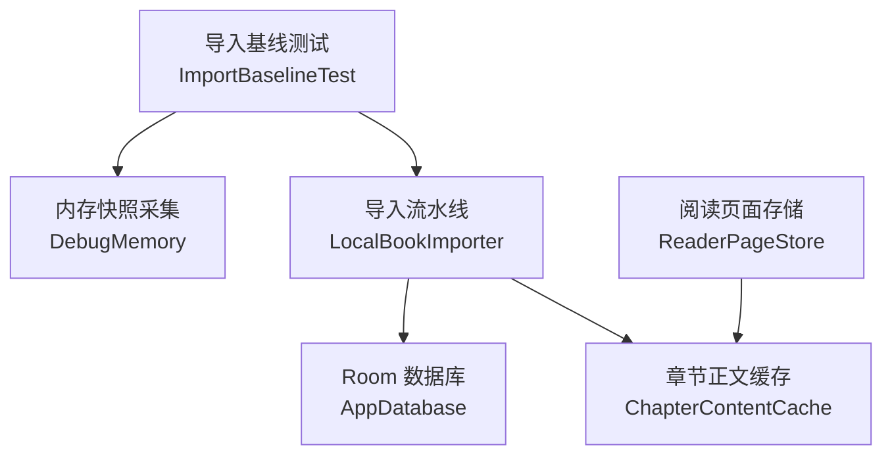
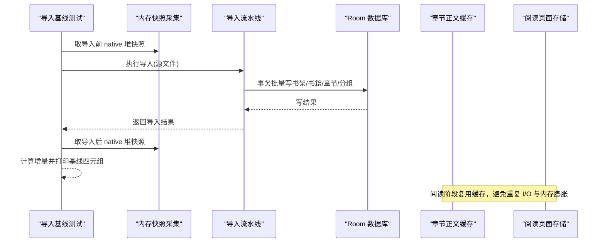
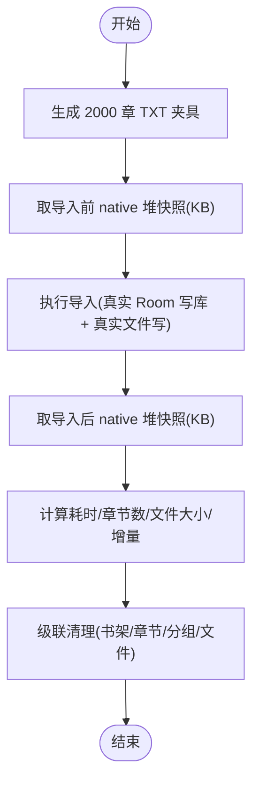
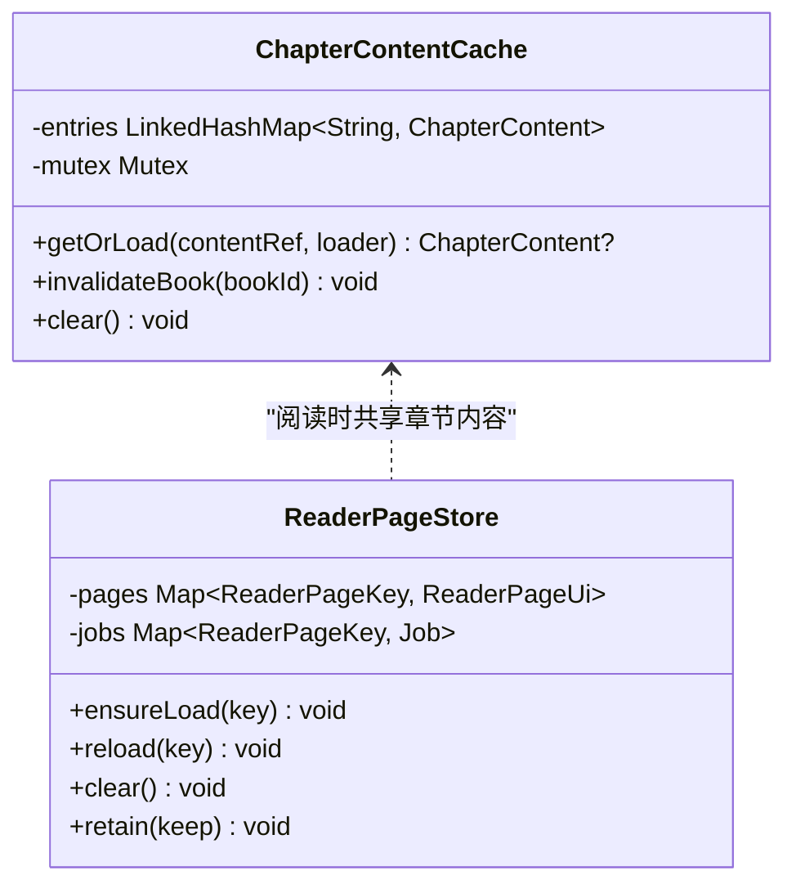
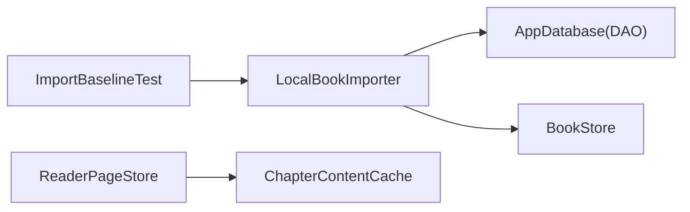

# 内存性能测试

<cite>
**本文引用的文件**   
- [ImportBaselineTest.kt](file://module_book/src/androidTest/java/com/ebook/book/ImportBaselineTest.kt)
- [DebugMemory.kt](file://module_book/src/androidTest/java/com/ebook/book/DebugMemory.kt)
- [LocalBookImporter.kt](file://lib_book_common/src/main/java/com/ebook/common/importer/LocalBookImporter.kt)
- [AppDatabase.kt](file://lib_ebook_db/src/main/java/com/ebook/db/AppDatabase.kt)
- [ChapterContentCache.kt](file://lib_book_common/src/main/java/com/ebook/common/store/ChapterContentCache.kt)
- [ReaderPageStore.kt](file://module_book/src/main/java/com/ebook/book/reader/ReaderPageStore.kt)
- [libs.versions.toml](file://gradle/libs.versions.toml)
- [build.gradle.kts](file://lib_book_common/build.gradle.kts)
</cite>

## 目录
1. [引言](#引言)
2. [项目结构](#项目结构)
3. [核心组件](#核心组件)
4. [架构总览](#架构总览)
5. [详细组件分析](#详细组件分析)
6. [依赖关系分析](#依赖关系分析)
7. [性能考量](#性能考量)
8. [故障排查指南](#故障排查指南)
9. [结论](#结论)
10. [附录](#附录)

## 引言
本文件面向项目的内存性能测试策略与落地实践，覆盖以下目标：
- 建立可复现的导入流程内存基线（以 2000 章 TXT 为例），明确测量口径、工具与产出。
- 解释 native 堆内存监控的实现原理与适用场景，包括 SQLite 页缓存与 Room 原生分配的观测方式。
- 说明内存泄漏检测的工具链配置与使用建议，并给出常见泄漏场景的检测与修复思路。
- 针对阅读过程的内存管理（章节正文缓存、页面加载缓存）提供优化建议与最佳实践。
- 形成可持续维护的性能基线与回归检测流程。

## 项目结构
本项目为多模块 Android 应用，围绕书籍导入、数据库、阅读渲染等核心路径存在多处与内存密切相关的实现：
- 仪器测试层在 module_book 下提供导入基线测试与内存快照采集。
- 导入流水线位于 lib_book_common，负责本地书解析、分章、落库与事务提交。
- 数据持久化由 lib_ebook_db 的 Room 数据库承担，SQLite 通过 BundledSQLiteDriver 提供。
- 阅读过程涉及章节正文缓存与页面加载状态缓存，直接影响运行时内存占用。

图表来源
- [ImportBaselineTest.kt:69-96](file://module_book/src/androidTest/java/com/ebook/book/ImportBaselineTest.kt#L69-L96)
- [DebugMemory.kt:12-16](file://module_book/src/androidTest/java/com/ebook/book/DebugMemory.kt#L12-L16)
- [LocalBookImporter.kt:60-141](file://lib_book_common/src/main/java/com/ebook/common/importer/LocalBookImporter.kt#L60-L141)
- [AppDatabase.kt:40-76](file://lib_ebook_db/src/main/java/com/ebook/db/AppDatabase.kt#L40-L76)
- [ChapterContentCache.kt:25-63](file://lib_book_common/src/main/java/com/ebook/common/store/ChapterContentCache.kt#L25-L63)
- [ReaderPageStore.kt:29-98](file://module_book/src/main/java/com/ebook/book/reader/ReaderPageStore.kt#L29-L98)

章节来源
- [ImportBaselineTest.kt:20-39](file://module_book/src/androidTest/java/com/ebook/book/ImportBaselineTest.kt#L20-L39)
- [LocalBookImporter.kt:33-42](file://lib_book_common/src/main/java/com/ebook/common/importer/LocalBookImporter.kt#L33-L42)
- [AppDatabase.kt:8-39](file://lib_ebook_db/src/main/java/com/ebook/db/AppDatabase.kt#L8-L39)

## 核心组件
- 导入基线测试：以 2000 章 TXT 为夹具，端到端执行导入，记录耗时、章节数、文件大小与 native 堆增量，作为性能基线输出。
- 内存快照采集：统一封装 native heap 快照接口，确保导入链路前后对比口径一致。
- 导入流水线：将源文件拷贝并哈希、解析元数据、切分章节写入章文件、单事务批量落库，失败时回滚磁盘与数据库。
- Room 数据库：定义实体与 DAO 装配点，承载书架、书籍信息、章节目录等离线可读数据。
- 章节正文缓存：按 content_ref 缓存当前章及前后各一章内容，减少重复读取与解码。
- 阅读页面存储：管理页面加载状态与并发任务，避免重复请求与内存累积。

章节来源
- [ImportBaselineTest.kt:69-96](file://module_book/src/androidTest/java/com/ebook/book/ImportBaselineTest.kt#L69-L96)
- [DebugMemory.kt:12-16](file://module_book/src/androidTest/java/com/ebook/book/DebugMemory.kt#L12-L16)
- [LocalBookImporter.kt:60-141](file://lib_book_common/src/main/java/com/ebook/common/importer/LocalBookImporter.kt#L60-L141)
- [ChapterContentCache.kt:25-63](file://lib_book_common/src/main/java/com/ebook/common/store/ChapterContentCache.kt#L25-L63)
- [ReaderPageStore.kt:29-98](file://module_book/src/main/java/com/ebook/book/reader/ReaderPageStore.kt#L29-L98)

## 架构总览
导入与阅读的内存相关流程如下：
- 导入阶段：测试驱动导入器执行；导入器进行文件拷贝+哈希、解析与分章、落库；SQLite 页缓存与语句分配发生在 native 堆，故采用 Debug.getNativeHeapAllocatedSize() 获取增量。
- 阅读阶段：阅读器翻页频繁读取正文，章节正文缓存命中降低 I/O；页面加载仓库管理并发与缓存生命周期，防止冗余请求与内存增长。

图表来源
- [ImportBaselineTest.kt:69-96](file://module_book/src/androidTest/java/com/ebook/book/ImportBaselineTest.kt#L69-L96)
- [DebugMemory.kt:12-16](file://module_book/src/androidTest/java/com/ebook/book/DebugMemory.kt#L12-L16)
- [LocalBookImporter.kt:121-137](file://lib_book_common/src/main/java/com/ebook/common/importer/LocalBookImporter.kt#L121-L137)
- [AppDatabase.kt:40-76](file://lib_ebook_db/src/main/java/com/ebook/db/AppDatabase.kt#L40-L76)
- [ChapterContentCache.kt:41-57](file://lib_book_common/src/main/java/com/ebook/common/store/ChapterContentCache.kt#L41-L57)
- [ReaderPageStore.kt:47-98](file://module_book/src/main/java/com/ebook/book/reader/ReaderPageStore.kt#L47-L98)

## 详细组件分析

### 导入流程的内存基线测试
- 测试入口：导入基线测试构造 2000 章 TXT 夹具，端到端执行导入链路。
- 测量口径：使用 native 堆快照（而非 Java 堆），因为 Room 3 的 SQLite 页缓存与语句分配在 native 堆；前后两次快照差值即为链路内存增量。
- 产出指标：耗时毫秒、章节数、文件大小 KB、native 堆增量 KB，作为 BASELINE 基线日志输出。
- 清理路径：导入完成后通过书架移除路径级联删除数据库行与章文件目录，保证测试环境干净。

图表来源
- [ImportBaselineTest.kt:69-96](file://module_book/src/androidTest/java/com/ebook/book/ImportBaselineTest.kt#L69-L96)
- [DebugMemory.kt:12-16](file://module_book/src/androidTest/java/com/ebook/book/DebugMemory.kt#L12-L16)
- [LocalBookImporter.kt:121-137](file://lib_book_common/src/main/java/com/ebook/common/importer/LocalBookImporter.kt#L121-L137)

章节来源
- [ImportBaselineTest.kt:20-39](file://module_book/src/androidTest/java/com/ebook/book/ImportBaselineTest.kt#L20-L39)
- [ImportBaselineTest.kt:69-96](file://module_book/src/androidTest/java/com/ebook/book/ImportBaselineTest.kt#L69-L96)

### Native 堆内存监控
- 实现方式：封装 Debug.getNativeHeapAllocatedSize() 并以 KB 为单位返回，确保测试与生产观测口径一致。
- 使用场景：导入链路中 SQLite 页缓存与语句分配在 native 堆，Java 堆快照无法反映真实增量；因此以 native 堆增量衡量导入对进程内存的影响。
- 注意事项：同一进程内两次取值做差，避免不同进程或不同构建变体导致的不可比问题。

章节来源
- [DebugMemory.kt:12-16](file://module_book/src/androidTest/java/com/ebook/book/DebugMemory.kt#L12-L16)
- [ImportBaselineTest.kt:20-39](file://module_book/src/androidTest/java/com/ebook/book/ImportBaselineTest.kt#L20-L39)

### SQLite 页缓存与 Room 数据库内存管理
- 数据库装配：Room 数据库集中声明实体与 DAO，承载书架、书籍信息、章节目录等离线数据。
- 驱动特性：使用 BundledSQLiteDriver，其页缓存与语句准备在 native 堆上分配；导入期间大量插入会触发 SQLite 内部缓存增长。
- 影响评估：导入 2000 章会在 native 堆产生显著增量，需通过基线测试持续监控，避免回归导致 OOM 风险。

章节来源
- [AppDatabase.kt:8-39](file://lib_ebook_db/src/main/java/com/ebook/db/AppDatabase.kt#L8-L39)
- [AppDatabase.kt:40-76](file://lib_ebook_db/src/main/java/com/ebook/db/AppDatabase.kt#L40-L76)
- [ImportBaselineTest.kt:20-39](file://module_book/src/androidTest/java/com/ebook/book/ImportBaselineTest.kt#L20-L39)

### 章节正文缓存与阅读内存管理
- 章节正文缓存：按 content_ref 缓存当前章及前后各一章，降低翻页时的重复读取与解码成本；容量默认 3，可按需调整。
- 失效策略：删书、合并来源或重抓成功后调用失效，确保旧内容不被继续供给；改字号字体不影响本缓存（排版偏移由键区分）。
- 页面加载存储：统一管理页面加载状态与并发任务，避免重复请求与内存累积；跳转时清空在途任务与状态，防止泄漏。

图表来源
- [ChapterContentCache.kt:25-63](file://lib_book_common/src/main/java/com/ebook/common/store/ChapterContentCache.kt#L25-L63)
- [ReaderPageStore.kt:29-98](file://module_book/src/main/java/com/ebook/book/reader/ReaderPageStore.kt#L29-L98)

章节来源
- [ChapterContentCache.kt:7-24](file://lib_book_common/src/main/java/com/ebook/common/store/ChapterContentCache.kt#L7-L24)
- [ChapterContentCache.kt:41-57](file://lib_book_common/src/main/java/com/ebook/common/store/ChapterContentCache.kt#L41-L57)
- [ReaderPageStore.kt:9-28](file://module_book/src/main/java/com/ebook/book/reader/ReaderPageStore.kt#L9-L28)
- [ReaderPageStore.kt:47-98](file://module_book/src/main/java/com/ebook/book/reader/ReaderPageStore.kt#L47-L98)

### 内存泄漏检测与工具链
- LeakCanary：版本已在版本目录中声明，但当前未启用（被注释），可在 debug 构建中按需开启，用于自动检测 Activity/Fragment/ViewModel 等对象泄漏。
- 建议启用方式：在调试构建添加 LeakCanary 依赖并在 Application 初始化；结合 Hilt 注入的 ViewModel 与协程作用域，便于定位资源未释放或监听器未注销等问题。
- 注意：启用后应关注报告中的保留链，优先修复强引用持有、静态集合累积、全局回调未取消等常见问题。

章节来源
- [libs.versions.toml:53](file://gradle/libs.versions.toml#L53)
- [libs.versions.toml:178](file://gradle/libs.versions.toml#L178)
- [build.gradle.kts:94](file://lib_book_common/build.gradle.kts#L94)

## 依赖关系分析
导入与阅读路径的关键依赖如下：
- 导入基线测试依赖导入器、DAO 与仓库，用于端到端验证导入流程与内存行为。
- 导入器依赖 BookStore、DAO、WriteTransactionRunner，完成文件操作与事务落库。
- Room 数据库集中管理实体与 DAO，提供数据访问能力。
- 阅读模块依赖章节正文缓存与页面存储，控制内存与并发。

图表来源
- [ImportBaselineTest.kt:69-96](file://module_book/src/androidTest/java/com/ebook/book/ImportBaselineTest.kt#L69-L96)
- [LocalBookImporter.kt:60-141](file://lib_book_common/src/main/java/com/ebook/common/importer/LocalBookImporter.kt#L60-L141)
- [AppDatabase.kt:40-76](file://lib_ebook_db/src/main/java/com/ebook/db/AppDatabase.kt#L40-L76)
- [ChapterContentCache.kt:25-63](file://lib_book_common/src/main/java/com/ebook/common/store/ChapterContentCache.kt#L25-L63)
- [ReaderPageStore.kt:29-98](file://module_book/src/main/java/com/ebook/book/reader/ReaderPageStore.kt#L29-L98)

章节来源
- [ImportBaselineTest.kt:69-96](file://module_book/src/androidTest/java/com/ebook/book/ImportBaselineTest.kt#L69-L96)
- [LocalBookImporter.kt:60-141](file://lib_book_common/src/main/java/com/ebook/common/importer/LocalBookImporter.kt#L60-L141)
- [AppDatabase.kt:40-76](file://lib_ebook_db/src/main/java/com/ebook/db/AppDatabase.kt#L40-L76)
- [ChapterContentCache.kt:25-63](file://lib_book_common/src/main/java/com/ebook/common/store/ChapterContentCache.kt#L25-L63)
- [ReaderPageStore.kt:29-98](file://module_book/src/main/java/com/ebook/book/reader/ReaderPageStore.kt#L29-L98)

## 性能考量
- 导入阶段
  - 使用 native 堆增量衡量导入对进程内存的影响，避免被 Java 堆噪声干扰。
  - 单事务批量落库减少提交次数，降低 SQLite 内部开销与内存峰值。
  - 流式拷贝与哈希减少额外 I/O，避免多次全量读取带来的内存压力。
- 阅读阶段
  - 章节正文缓存容量适中（默认 3），兼顾预读需求与内存占用。
  - 页面加载存储避免重复请求，跳转时及时清理在途任务与状态，防止累积。
- 基线维护
  - 每次导入链路改动后重新运行基线测试，比较耗时与 native 堆增量是否回归。
  - 若增量异常升高，优先检查 SQLite 页缓存增长、大对象未及时释放、缓存容量过大等问题。

[本节为通用性能指导，不直接分析具体文件]

## 故障排查指南
- 导入失败回滚
  - 导入过程中若数据库写入失败，会回滚已写的章文件目录，避免“有索引无内容”的不一致状态。
  - 排查时关注事务边界与错误处理分支，确认异常是否被吞掉或遗漏清理。
- 内存异常升高
  - 通过基线测试对比 native 堆增量，定位新增热点（如缓存容量过大、重复加载、未释放的大对象）。
  - 结合页面加载存储的生命周期管理，检查跳转、换模式、重试等操作是否正确清理。
- 缓存失效
  - 删书、合并来源、重抓成功后需调用失效方法，确保旧内容不再被供给。
  - 排查失效入口是否被正确调用，以及缓存键是否与预期一致。

章节来源
- [LocalBookImporter.kt:121-137](file://lib_book_common/src/main/java/com/ebook/common/importer/LocalBookImporter.kt#L121-L137)
- [ChapterContentCache.kt:48-57](file://lib_book_common/src/main/java/com/ebook/common/store/ChapterContentCache.kt#L48-L57)
- [ReaderPageStore.kt:79-98](file://module_book/src/main/java/com/ebook/book/reader/ReaderPageStore.kt#L79-L98)

## 结论
本项目已建立基于 native 堆的导入内存基线测试，能够稳定度量 2000 章 TXT 导入过程中的内存增量与耗时，并与 SQLite 页缓存、Room 原生分配的特性相匹配。阅读阶段的章节正文缓存与页面加载存储有效降低了重复 I/O 与并发开销。建议在调试构建中启用 LeakCanary，完善泄漏检测工具链，并结合基线测试持续监控性能回归。对于内存优化，应重点关注 SQLite 页缓存、缓存容量、任务生命周期与事务边界，确保在大体量导入与高频阅读场景下的稳定性与性能。

[本节为总结性内容，不直接分析具体文件]

## 附录
- 基线测试运行建议
  - 在设备或模拟器上运行仪器测试，确保真实文件与数据库行为。
  - 收集 logcat 中的 BASELINE 日志，记录耗时、章节数、文件大小与 native 堆增量。
- 工具链建议
  - 在 debug 构建启用 LeakCanary，配合 Hilt 与协程作用域，快速定位泄漏。
  - 定期更新基线阈值，纳入 CI 或人工验证，防止回归。
- 优化清单
  - 控制章节正文缓存容量与失效时机。
  - 页面加载存储及时清理在途任务与状态。
  - 导入阶段保持单事务、流式 I/O，避免大对象常驻。

[本节为补充信息，不直接分析具体文件]