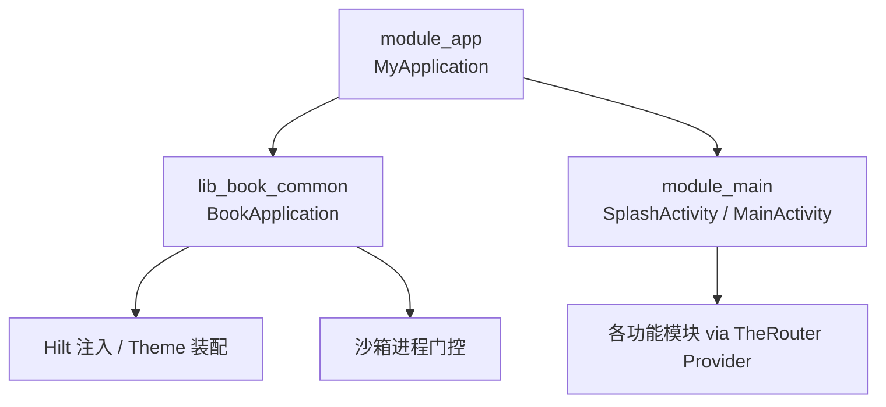
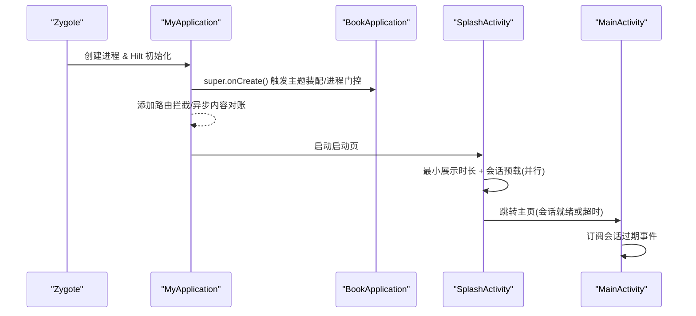
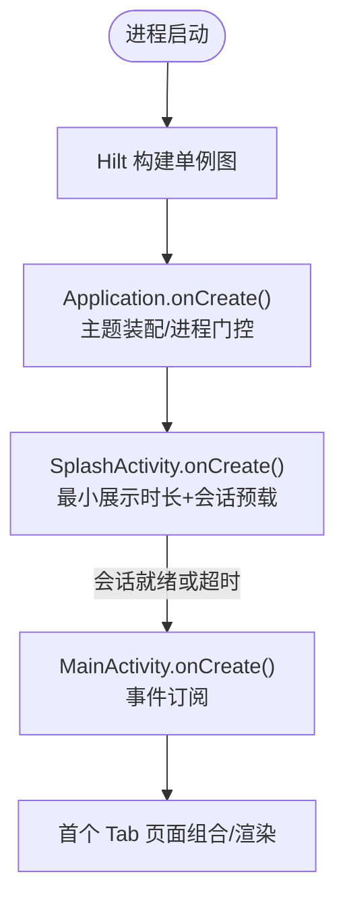
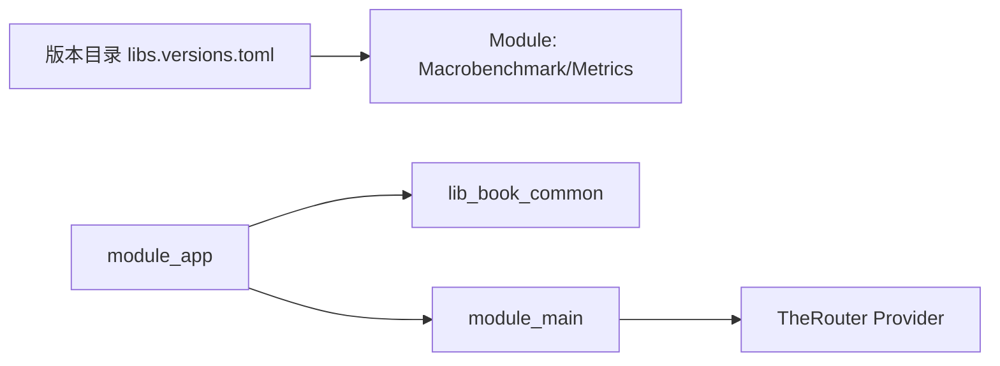

# 启动性能测试

<cite>
**本文引用的文件**
- [MyApplication.kt](file://module_app/src/main/java/com/ebook/MyApplication.kt)
- [BookApplication.kt](file://lib_book_common/src/main/java/com/ebook/common/BookApplication.kt)
- [SplashActivity.kt](file://module_main/src/main/java/com/ebook/main/SplashActivity.kt)
- [MainActivity.kt](file://module_main/src/main/java/com/ebook/main/MainActivity.kt)
- [libs.versions.toml](file://gradle/libs.versions.toml)
- [ImportBaselineTest.kt](file://module_book/src/androidTest/java/com/ebook/book/ImportBaselineTest.kt)
- [DebugMemory.kt](file://module_book/src/androidTest/java/com/ebook/book/DebugMemory.kt)
</cite>

## 目录
1. [简介](#简介)
2. [项目结构与入口](#项目结构与入口)
3. [核心组件与启动链路](#核心组件与启动链路)
4. [架构总览](#架构总览)
5. [详细组件分析](#详细组件分析)
6. [依赖关系分析](#依赖关系分析)
7. [性能考量与优化建议](#性能考量与优化建议)
8. [故障排查指南](#故障排查指南)
9. [结论](#结论)
10. [附录：基线与回归检测方案](#附录：基线与回归检测方案)

## 简介
本文件面向该 Android 电子书应用的“启动性能测试”，目标是建立可复现、可度量、可回归的启动性能体系，覆盖冷启动与热启动两个维度，并给出工具链与基线管理方法。文档聚焦以下方面：
- 冷启动时间测量：进程启动、Application 初始化、Hilt 依赖注入、模块加载等阶段。
- 热启动监控：Activity 生命周期、页面渲染时间、数据预加载对启动的影响。
- 启动优化策略：延迟初始化、异步加载、依赖注入优化、模块懒加载。
- 工具与方法：Android Studio Profiler、Perfetto、自定义计时器、Macrobenchmark（已纳入版本目录）。
- 基线建立与回归检测：稳定基线、阈值告警、持续集成流程。

## 项目结构与入口
应用采用多模块结构，启动入口由 module_app 装配功能模块；主界面通过 module_main 的 SplashActivity 和 MainActivity 完成首屏导航。基础能力在 lib_book_common 中提供，如主题装配、沙箱进程门控、Session 管理等。

图表来源
- [MyApplication.kt:19-44](file://module_app/src/main/java/com/ebook/MyApplication.kt#L19-L44)
- [BookApplication.kt:17-49](file://lib_book_common/src/main/java/com/ebook/common/BookApplication.kt#L17-L49)
- [SplashActivity.kt:69-119](file://module_main/src/main/java/com/ebook/main/SplashActivity.kt#L69-L119)
- [MainActivity.kt:57-104](file://module_main/src/main/java/com/ebook/main/MainActivity.kt#L57-L104)

章节来源
- [MyApplication.kt:19-44](file://module_app/src/main/java/com/ebook/MyApplication.kt#L19-L44)
- [BookApplication.kt:17-49](file://lib_book_common/src/main/java/com/ebook/common/BookApplication.kt#L17-L49)
- [SplashActivity.kt:69-119](file://module_main/src/main/java/com/ebook/main/SplashActivity.kt#L69-L119)
- [MainActivity.kt:57-104](file://module_main/src/main/java/com/ebook/main/MainActivity.kt#L57-L104)

## 核心组件与启动链路
- Application 层
  - MyApplication：Hilt 应用入口，添加路由拦截，异步执行内容仓库对账（不影响启动）。
  - BookApplication：主题装配点安装，隔离进程门控，避免在沙箱进程中做无意义的 UI/SP 初始化。
- 启动页 SplashActivity：最小展示时长 + 会话预载并行，超时放行；跳过按钮旁路立即进入主页。
- 主页 MainActivity：订阅会话过期事件统一处置，作为长驻宿主承载三个 Tab。

图表来源
- [MyApplication.kt:19-44](file://module_app/src/main/java/com/ebook/MyApplication.kt#L19-L44)
- [BookApplication.kt:17-49](file://lib_book_common/src/main/java/com/ebook/common/BookApplication.kt#L17-L49)
- [SplashActivity.kt:69-119](file://module_main/src/main/java/com/ebook/main/SplashActivity.kt#L69-L119)
- [MainActivity.kt:57-104](file://module_main/src/main/java/com/ebook/main/MainActivity.kt#L57-L104)

章节来源
- [MyApplication.kt:19-44](file://module_app/src/main/java/com/ebook/MyApplication.kt#L19-L44)
- [BookApplication.kt:17-49](file://lib_book_common/src/main/java/com/ebook/common/BookApplication.kt#L17-L49)
- [SplashActivity.kt:69-119](file://module_main/src/main/java/com/ebook/main/SplashActivity.kt#L69-L119)
- [MainActivity.kt:57-104](file://module_main/src/main/java/com/ebook/main/MainActivity.kt#L57-L104)

## 架构总览
从启动到首帧的关键路径包括：
- 进程启动与 Hilt 图构建（@HiltAndroidApp）
- Application 初始化（主题装配、沙箱进程门控）
- SplashActivity 启动（最小展示时长、会话预载）
- 跳转到 MainActivity（Tab 容器），首次组合 Provider 暴露的 Compose 页面

图表来源
- [MyApplication.kt:19-44](file://module_app/src/main/java/com/ebook/MyApplication.kt#L19-L44)
- [BookApplication.kt:17-49](file://lib_book_common/src/main/java/com/ebook/common/BookApplication.kt#L17-L49)
- [SplashActivity.kt:69-119](file://module_main/src/main/java/com/ebook/main/SplashActivity.kt#L69-L119)
- [MainActivity.kt:57-104](file://module_main/src/main/java/com/ebook/main/MainActivity.kt#L57-L104)

## 详细组件分析

### Application 初始化与 Hilt 注入
- 职责
  - MyApplication：添加路由拦截、异步内容仓库对账（不阻塞启动）。
  - BookApplication：安装主题装配点，按持久化模式决定深色/浅色；在隔离进程跳过 UI/SP 初始化。
- 关键点
  - 字段注入时机在 super.onCreate() 内，因此 Application 上不应有 eager @Inject 字段，避免在沙箱进程提前失败。
  - 主题装配使用 EntryPointAccessors 在运行时取单例，避免在构造期强依赖。

优化建议
- 保持当前“用到再取”的模式，确保冷启动路径最短。
- 将非关键任务继续下沉为后台协程（如内容对账），避免阻塞主线程。

章节来源
- [MyApplication.kt:19-65](file://module_app/src/main/java/com/ebook/MyApplication.kt#L19-L65)
- [BookApplication.kt:17-59](file://lib_book_common/src/main/java/com/ebook/common/BookApplication.kt#L17-L59)

### 启动页与会话预载
- 职责
  - 控制最小展示时长，避免白屏闪烁。
  - 并行进行会话预载（本地持久化恢复 Token 等），设置超时兜底，保证弱网下不卡死启动。
  - 支持用户跳过直接进入主页。
- 关键点
  - 会话预载完成后才跳转，确保主页首帧即具备登录态，减少二次刷新。
  - 使用 SupervisorJob 隔离任务，避免异常扩散。

优化建议
- 若后续需要更多预热任务，优先放在 Splash 的并行域，且必须带超时保护。
- 避免在 Splash 中进行 IO 密集操作，必要时改为后台服务。

章节来源
- [SplashActivity.kt:69-119](file://module_main/src/main/java/com/ebook/main/SplashActivity.kt#L69-L119)
- [SplashActivity.kt:122-137](file://module_main/src/main/java/com/ebook/main/SplashActivity.kt#L122-L137)

### 主页与会话事件处理
- 职责
  - 作为长驻宿主，订阅会话过期事件，统一清会话并跳转登录页。
- 关键点
  - 事件由网络层收口发射，此处幂等处理，避免重复提示。

优化建议
- 确保事件处理轻量，避免在主线程执行耗时逻辑。

章节来源
- [MainActivity.kt:57-80](file://module_main/src/main/java/com/ebook/main/MainActivity.kt#L57-L80)

## 依赖关系分析
- 版本与工具链
  - 已引入 Macrobenchmark 与 Metrics Performance 等性能相关依赖，便于自动化启动测试与指标采集。
  - Hilt 与 KSP 用于依赖注入与代码生成。
- 模块耦合
  - module_app 聚合功能模块；功能模块通过 TheRouter 暴露 Provider 接口，降低编译期耦合。
  - 主题与通用逻辑集中在 lib_book_common，便于统一装配。

图表来源
- [libs.versions.toml:21-24](file://gradle/libs.versions.toml#L21-L24)
- [libs.versions.toml:86-128](file://gradle/libs.versions.toml#L86-L128)

章节来源
- [libs.versions.toml:21-24](file://gradle/libs.versions.toml#L21-L24)
- [libs.versions.toml:86-128](file://gradle/libs.versions.toml#L86-L128)

## 性能考量与优化建议
- 冷启动
  - 控制 Application 初始化工作量，避免同步 I/O。
  - 延迟初始化非关键模块，按需懒加载。
  - 利用 Hilt 单例与延迟获取，减少构造期开销。
- 热启动
  - 尽量减少 Activity 重建时的状态恢复成本。
  - 首帧渲染前仅做必要的数据预加载，其余延后到可见后再请求。
- 异步与并发
  - 将非阻塞任务放入后台调度器，避免主线程卡顿。
  - 为所有可能耗时的网络/IO 设置超时，防止启动被拖慢。
- 模块与资源
  - 通过 Provider 懒加载页面，减少首包体积与初始化成本。
  - 图片等资源尽量使用懒加载与占位图，降低首帧压力。

## 故障排查指南
- 启动卡顿
  - 使用 Android Studio Profiler 抓取 CPU/内存/方法调用，定位热点。
  - 使用 Perfetto 捕获系统级 trace，观察 Application 与 Activity 生命周期。
- 启动崩溃
  - 检查是否在 Application 中使用了会失败的 eager 注入（已在约定中规避）。
  - 确认沙箱进程门控是否生效，避免在非 UI 进程执行 UI/SP 相关逻辑。
- 会话相关问题
  - 关注 SessionExpired 事件是否被正确消费，避免登录后仍显示未登录态。

章节来源
- [MyApplication.kt:19-44](file://module_app/src/main/java/com/ebook/MyApplication.kt#L19-L44)
- [BookApplication.kt:17-49](file://lib_book_common/src/main/java/com/ebook/common/BookApplication.kt#L17-L49)
- [MainActivity.kt:57-80](file://module_main/src/main/java/com/ebook/main/MainActivity.kt#L57-L80)

## 结论
本项目在启动路径上已具备较好的工程实践：Application 轻量、主题装配集中、会话预载与最小展示时长并行、超时兜底保障启动不被阻塞。配合 Macrobenchmark、Profiler、Perfetto 等工具，可以建立稳定的启动性能基线与回归检测机制，持续改进冷/热启动体验。

## 附录：基线与回归检测方案

### 冷启动时间测量方法
- 定义边界
  - 开始：进程创建（zygote fork 或进程复用场景下的 ActivityThread.attachApplication）
  - 结束：首个可交互帧（例如 SplashActivity 的最小展示时长结束并跳转 MainActivity 的首帧）
- 测量手段
  - 使用 Macrobenchmark 的 startupBenchmark，针对 applicationId 执行标准启动流程。
  - 结合 Metrics Performance 收集冷/热启动指标（如 ColdStartDuration、FirstFrameDelay）。
  - 使用 Perfetto 抓取系统 trace，验证关键阶段耗时（Application、Hilt、Activity 生命周期）。
- 分阶段拆解
  - 进程启动与 Hilt 构建：查看 Hilt 生成的组件初始化耗时。
  - Application 初始化：记录 BookApplication/MyApplication 关键钩子耗时。
  - SplashActivity：记录最小展示时长与会话预载耗时。
  - MainActivity：记录首帧渲染完成时间。

章节来源
- [libs.versions.toml:21-24](file://gradle/libs.versions.toml#L21-L24)
- [libs.versions.toml:86-128](file://gradle/libs.versions.toml#L86-L128)
- [SplashActivity.kt:69-119](file://module_main/src/main/java/com/ebook/main/SplashActivity.kt#L69-L119)

### 热启动时间监控方案
- 定义边界
  - 开始：目标 Activity 的 onCreate/onResume
  - 结束：首帧渲染完成（Compose 重组完成或 View 树绘制完成）
- 监控要点
  - 页面生命周期：onCreate → onConfigurationChanged → onStart → onResume
  - 数据预加载：仅在必要时发起请求，避免阻塞首帧
  - 渲染时间：跟踪 Compose 重组与布局测量耗时

章节来源
- [MainActivity.kt:57-104](file://module_main/src/main/java/com/ebook/main/MainActivity.kt#L57-L104)

### 启动性能优化措施
- 延迟初始化：非关键对象在首次使用时再构建（如通过 EntryPointAccessors）。
- 异步加载：将网络/IO 任务移至后台协程，设置超时与错误兜底。
- 依赖注入优化：避免构造期重型工作，尽量延迟到使用点。
- 模块懒加载：通过 TheRouter Provider 按需组合页面，减少首包初始化成本。

章节来源
- [MyApplication.kt:19-65](file://module_app/src/main/java/com/ebook/MyApplication.kt#L19-L65)
- [BookApplication.kt:17-59](file://lib_book_common/src/main/java/com/ebook/common/BookApplication.kt#L17-L59)
- [SplashActivity.kt:69-119](file://module_main/src/main/java/com/ebook/main/SplashActivity.kt#L69-L119)

### 工具与方法
- Android Studio Profiler：CPU/内存/方法调用火焰图，定位热点。
- Perfetto：系统级 trace，分析进程、线程、I/O、GPU 等瓶颈。
- Macrobenchmark：自动化启动测试，输出冷/热启动指标，纳入 CI。
- Metrics Performance：收集应用内启动指标，辅助线上观测。

章节来源
- [libs.versions.toml:21-24](file://gradle/libs.versions.toml#L21-L24)
- [libs.versions.toml:86-128](file://gradle/libs.versions.toml#L86-L128)

### 基线建立与回归检测
- 基线建立
  - 在稳定设备上运行多次 Macrobenchmark，统计 P50/P90/P99 冷/热启动耗时，设定基线值。
  - 参考现有导入链路基线写法（墙钟毫秒、native heap 增量），确保口径一致。
- 回归检测
  - 在 CI 中执行启动基准测试，超过阈值则告警。
  - 结合 Perfetto 自动录制，出现回归时附带 trace 以便快速定位。

章节来源
- [ImportBaselineTest.kt:69-96](file://module_book/src/androidTest/java/com/ebook/book/ImportBaselineTest.kt#L69-L96)
- [DebugMemory.kt:12-16](file://module_book/src/androidTest/java/com/ebook/book/DebugMemory.kt#L12-L16)