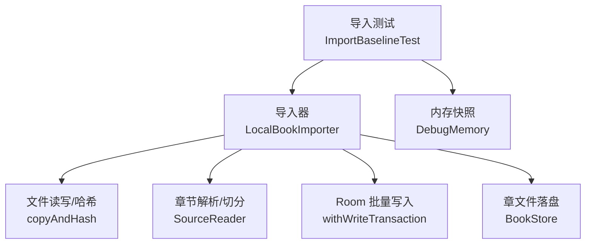
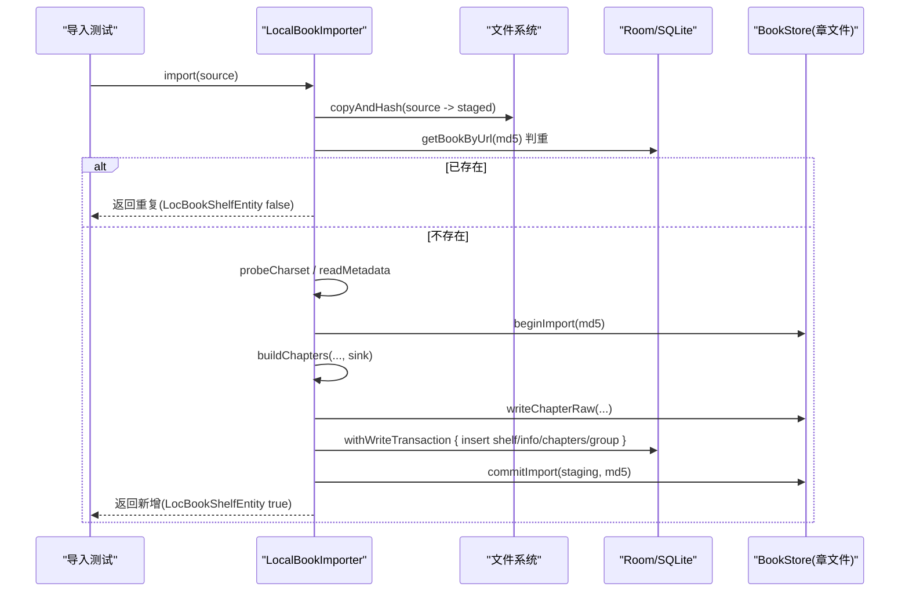

# 性能基线管理

<cite>
**本文引用的文件**
- [ImportBaselineTest.kt](file://module_book/src/androidTest/java/com/ebook/book/ImportBaselineTest.kt)
- [DebugMemory.kt](file://module_book/src/androidTest/java/com/ebook/book/DebugMemory.kt)
- [LocalBookImporter.kt](file://lib_book_common/src/main/java/com/ebook/common/importer/LocalBookImporter.kt)
- [本地书籍导入设计文档](file://docs/superpowers/specs/2026-09-04-local-book-import-design.md)
- [README.MD](file://README.MD)
</cite>

## 目录
1. [引言](#引言)
2. [项目结构](#项目结构)
3. [核心组件](#核心组件)
4. [架构总览](#架构总览)
5. [详细组件分析](#详细组件分析)
6. [依赖关系分析](#依赖关系分析)
7. [性能考量](#性能考量)
8. [故障排查指南](#故障排查指南)
9. [结论](#结论)
10. [附录](#附录)

## 引言
本文件面向本项目“本地书籍导入”场景，建立并维护一套可复用的性能基线管理体系。目标包括：
- 明确性能基线的定义、重要性与管理策略
- 规范基准测试设计与指标选取原则
- 固化导入流程的基线数据（耗时、内存占用、文件大小等）
- 建立性能回归检测与告警机制
- 提供优化效果的验证方法与长期趋势监控手段
- 制定基线维护与更新策略（版本迭代、环境差异、数据清洗）
- 输出性能测试报告与分析建议

## 项目结构
本项目为多模块 Android 应用，导入链路位于共享库 lib_book_common，性能基线测试位于 module_book 的 androidTest。导入实现采用“拷贝即哈希 → 章文件 → 单事务落库”的新流水线，配合 Room 批量写入与章文件存储，显著降低导入耗时与数据库压力。

**图示来源**
- [ImportBaselineTest.kt:69-96](file://module_book/src/androidTest/java/com/ebook/book/ImportBaselineTest.kt#L69-L96)
- [LocalBookImporter.kt:60-141](file://lib_book_common/src/main/java/com/ebook/common/importer/LocalBookImporter.kt#L60-L141)
- [DebugMemory.kt:12-16](file://module_book/src/androidTest/java/com/ebook/book/DebugMemory.kt#L12-L16)

**节来源**
- [README.MD:86-104](file://README.MD#L86-L104)

## 核心组件
- 导入器 LocalBookImporter：负责本地书导入全链路，包含拷贝即哈希、元数据读取、章节提取、章文件落盘、Room 批量事务写入、书架事件发布。
- 性能夹具 ImportBaselineTest：构造 2000 章 TXT 夹具，测量端到端耗时与 native 堆增量，断言章节数，清理数据。
- 内存快照 DebugMemory：统一使用 native heap 作为内存基线口径，避免 Java 堆快照无法反映 SQLite/BundledSQLiteDriver 的真实内存占用。

**节来源**
- [LocalBookImporter.kt:33-55](file://lib_book_common/src/main/java/com/ebook/common/importer/LocalBookImporter.kt#L33-L55)
- [ImportBaselineTest.kt:20-39](file://module_book/src/androidTest/java/com/ebook/book/ImportBaselineTest.kt#L20-L39)
- [DebugMemory.kt:5-16](file://module_book/src/androidTest/java/com/ebook/book/DebugMemory.kt#L5-L16)

## 架构总览
导入链路的性能基线围绕“新流水线”展开：源文件仅完整读一遍，边拷贝边计算 MD5；后台协程执行章节切分与落盘；一次事务批量写入库；最后改名提交，确保一致性。

**图示来源**
- [LocalBookImporter.kt:60-141](file://lib_book_common/src/main/java/com/ebook/common/importer/LocalBookImporter.kt#L60-L141)

## 详细组件分析

### 导入器 LocalBookImporter
职责与要点：
- 拷贝即哈希：通过流式拷贝同时计算 MD5，避免多次全文件读取。
- 判重短路：若内容 MD5 已入库，直接返回重复，零解析零写入。
- 后台切分与落盘：章节提取在 IO 调度器上执行，逐章写出章文件。
- 批量事务写入：shelf、info、chapters、group 在一个事务中写入，避免大量提交。
- 原子提交：先写章文件，再写 DB，失败时回滚并清理章文件，保证一致性与可恢复性。

复杂度与性能影响：
- 时间复杂度近似 O(N)（N 为文件大小），受限于顺序 I/O 与解码/正则匹配。
- 空间复杂度主要取决于缓冲大小与内存缓存（后续章节缓存不在导入阶段）。
- 将旧实现的数千次事务提交收敛到一次事务，极大降低磁盘同步与锁竞争。

错误处理：
- 未解析出任何章节时中止导入并抛异常。
- 事务写入失败时删除已落盘的章文件，避免脏数据。

**节来源**
- [LocalBookImporter.kt:60-141](file://lib_book_common/src/main/java/com/ebook/common/importer/LocalBookImporter.kt#L60-L141)
- [LocalBookImporter.kt:185-194](file://lib_book_common/src/main/java/com/ebook/common/importer/LocalBookImporter.kt#L185-L194)

### 性能夹具 ImportBaselineTest
设计原则：
- 固定规格：2000 章、约 6MB UTF-8 TXT，章节标题命中切分规则。
- 端到端计时：runBlocking 包裹真实 IO 与 SQLite 写入，测量墙钟耗时。
- 内存口径：使用 native heap 快照差值，避免 Java 堆遗漏 SQLite 页缓存等开销。
- 自检章节数：断言切出 2000 章，确保夹具正确性。
- 清理路径：生产级移除，级联删除 DB 行与章文件目录。

输出基线四元组：
- elapsedMs：导入耗时（毫秒）
- chapters：切分出的章节数
- fileKb：夹具文件大小（KB）
- memDeltaKb：native 堆增量（KB）

回归检测要点：
- 每次运行打印 BASELINE 日志，便于 CI 抓取与对比。
- 章节数断言可作为快速回归检查（切分规则变更导致章节数变化）。

**节来源**
- [ImportBaselineTest.kt:69-96](file://module_book/src/androidTest/java/com/ebook/book/ImportBaselineTest.kt#L69-L96)
- [ImportBaselineTest.kt:98-118](file://module_book/src/androidTest/java/com/ebook/book/ImportBaselineTest.kt#L98-L118)

### 内存快照 DebugMemory
- 统一使用 Debug.getNativeHeapAllocatedSize()，单位 KB。
- 同一进程两次取值之差即为链路增量，稳定可比。
- 解释为何不取 Java 堆：BundledSQLiteDriver 的页缓存与语句分配在 native 堆，Java 堆快照不可比。

**节来源**
- [DebugMemory.kt:5-16](file://module_book/src/androidTest/java/com/ebook/book/DebugMemory.kt#L5-L16)

## 依赖关系分析
导入器依赖的关键点：
- BookStore：章文件读写与暂存目录管理。
- SourceReader：格式路由与章节提取（TXT/EPUB/网络书源抽象）。
- DAO（BookShelfDao、BookInfoDao、ChapterListDao、BookGroupDao）：Room 层写入。
- WriteTransactionRunner：一次性事务封装，减少提交次数。
- BookRepository：发布书架事件，驱动 UI 刷新。

耦合与内聚：
- 导入器聚合了 I/O、解析、持久化与事件发布，内聚度高。
- 对外暴露 import()/parseMetadata() 两个入口，职责清晰。

潜在风险：
- 若 SourceReader 或 DAO 出现异常，需保证回滚与清理逻辑覆盖所有分支。
- 并发导入需依赖暂存目录命名与原子改名，避免竞态。

**节来源**
- [LocalBookImporter.kt:44-55](file://lib_book_common/src/main/java/com/ebook/common/importer/LocalBookImporter.kt#L44-L55)

## 性能考量
- 导入耗时基线：以 ImportBaselineTest 输出的 elapsedMs 为准，建议在真机上采集并记录。
- 内存占用基线：以 memDeltaKb 为准，关注 native 堆峰值与增量。
- 文件大小基线：以 fileKb 为准，用于评估不同夹具规模下的线性增长情况。
- 关键瓶颈：顺序 I/O、字符编码探测与严格解码、正则匹配、SQLite 批量写入。
- 优化方向：保持单次文件读取、减少正则编译开销、维持批量事务、控制内存缓存容量。

[本节为通用指导，无需特定文件引用]

## 故障排查指南
常见问题与定位方法：
- 导入后无章节：检查 buildChapters 是否抛出异常或被空列表中止。
- 导入后书架无条目：检查事务写入是否成功，是否存在异常被吞掉。
- 内存飙升：确认是否开启过多缓存或未释放临时文件；核对 DebugMemory 快照时机。
- 回归报警：CI 抓取 BASELINE 日志，对比 elapsedMs/memDeltaKb 阈值，超过则标记回归。

参考位置：
- 导入器异常与回滚逻辑
- 夹具断言与日志输出
- 内存快照口径说明

**节来源**
- [LocalBookImporter.kt:80-132](file://lib_book_common/src/main/java/com/ebook/common/importer/LocalBookImporter.kt#L80-L132)
- [ImportBaselineTest.kt:86-91](file://module_book/src/androidTest/java/com/ebook/book/ImportBaselineTest.kt#L86-L91)

## 结论
本项目已通过新导入流水线将导入耗时与文件大小解耦，并以 ImportBaselineTest 与 DebugMemory 建立了稳定的性能基线度量。建议将 BASELINE 日志纳入 CI 管道，设置合理阈值并触发回归报警；结合版本迭代持续维护基线，确保导入性能稳步提升且可控。

[本节为总结性内容，无需特定文件引用]

## 附录

### 性能基线指标与阈值建议
- 耗时阈值：基于历史 BASELINE 日志的中位数与 P95，设置动态阈值（如 P95 + 10%）。
- 内存阈值：memDeltaKb 的上限应随设备内存与业务特性设定，建议按机型分组统计。
- 章节数阈值：必须等于夹具章节数（2000），否则视为切分规则回归。

### 自动化集成与告警
- 在 CI 中执行仪器测试，收集 BASELINE 日志。
- 解析日志输出，计算耗时与内存增量并与阈值比较。
- 超过阈值时发出回归告警，附带本次构建信息与基线对比图。

### 优化效果验证与趋势监控
- 前后对比：同一夹具在不同版本下运行，对比 elapsedMs/memDeltaKb。
- 收益量化：计算相对改善百分比，标注贡献点（如事务合并、流式拷贝）。
- 长期趋势：按月/季度绘制趋势图，观察波动与回归。

### 基线维护与更新策略
- 版本迭代：重大改动后重新跑基线，更新阈值与备注。
- 环境差异：区分设备型号、系统版本、AGP/Gradle 版本，分组记录。
- 数据清洗：剔除异常值（如首次冷启动、设备负载高），保留稳定样本。

### 测试报告生成与分析
- 输出物：BASELINE 日志、趋势图、回归报告、优化建议。
- 可视化：折线图展示耗时/内存趋势，柱状图对比各版本基线。
- 建议：针对回归点给出代码级定位建议（如某 DAO 调用、某正则表达式）。

[本节为方法论与流程说明，无需特定文件引用]