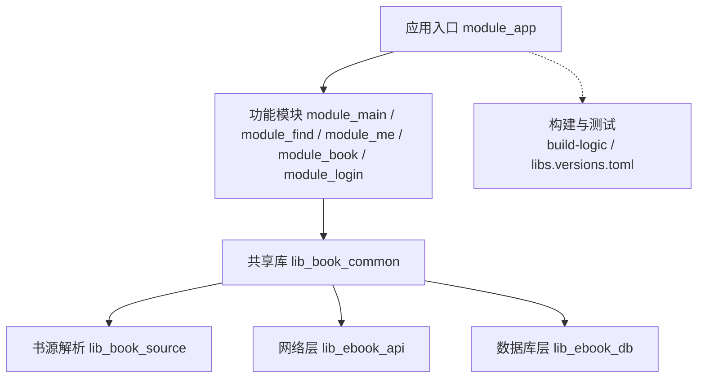
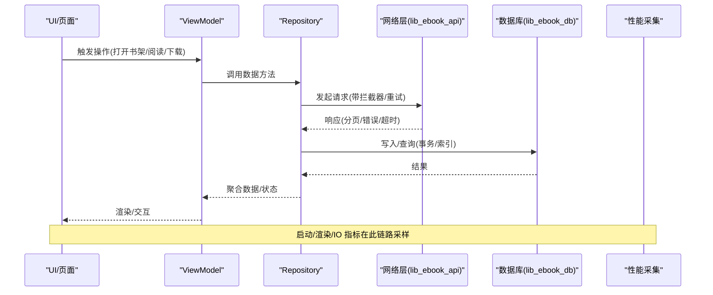
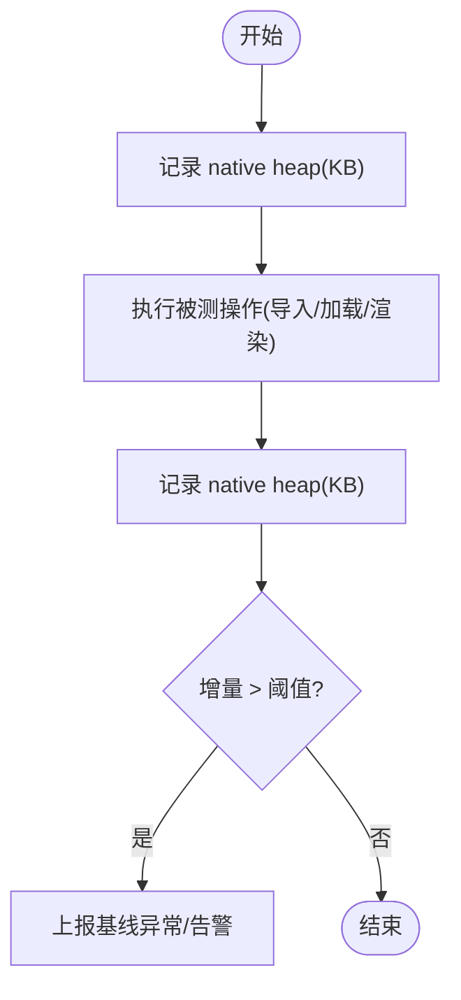
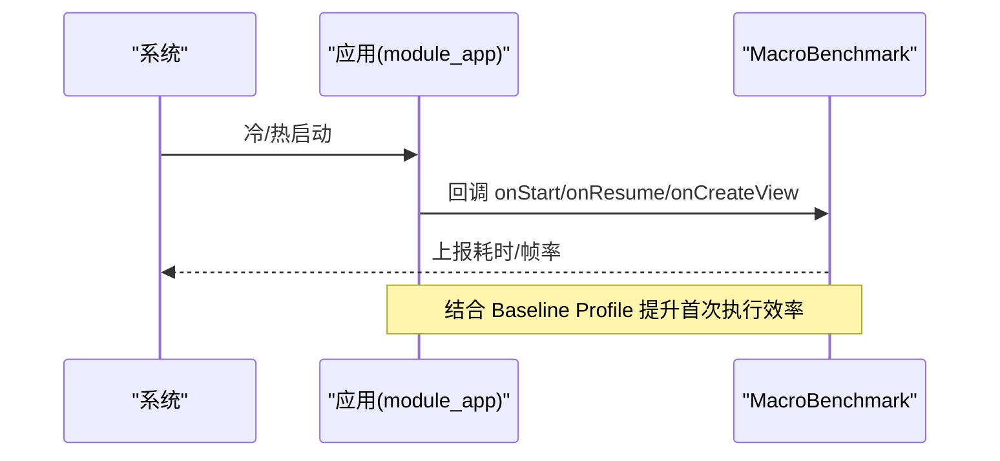
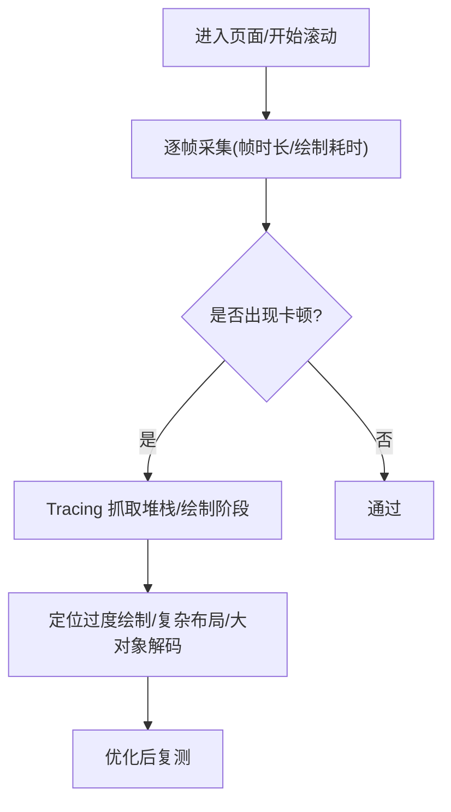
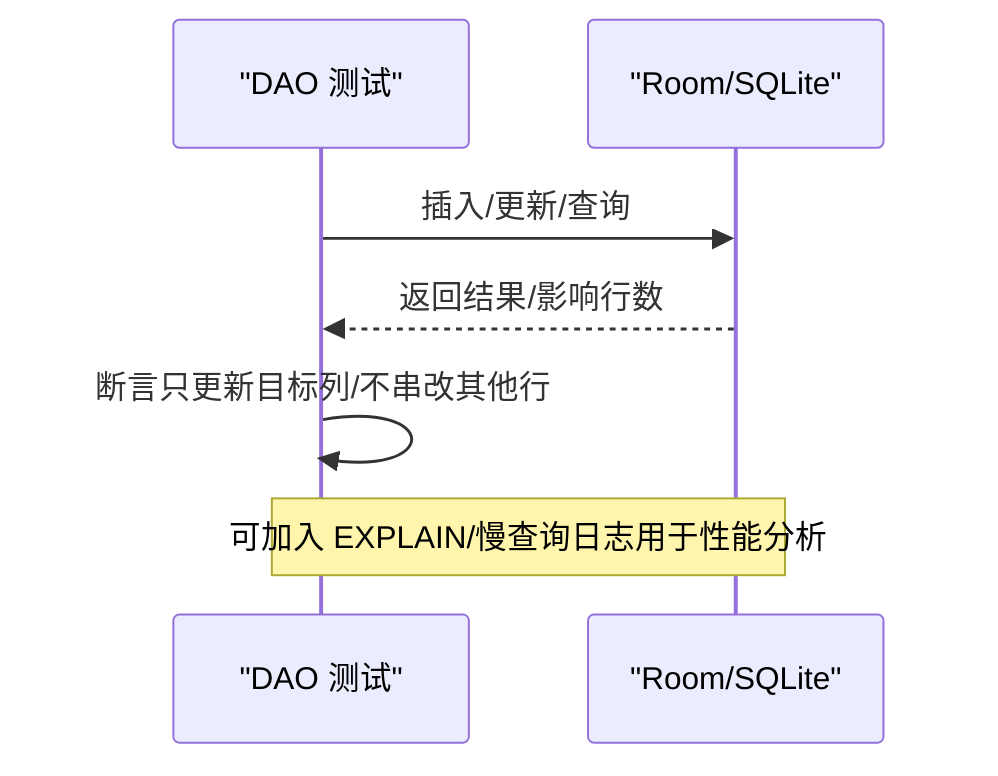
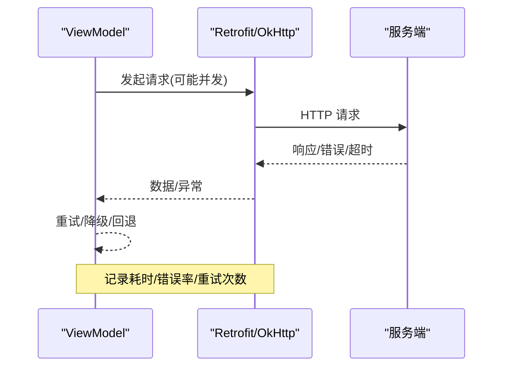
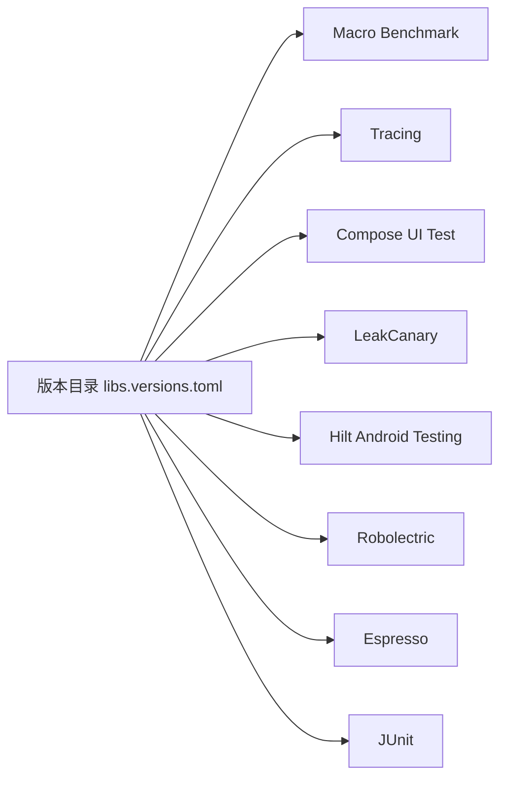

# 性能测试

<cite>
**本文引用的文件**
- [README.MD](file://README.MD)
- [gradle/libs.versions.toml](file://gradle/libs.versions.toml)
- [module_app/build.gradle.kts](file://module_app/build.gradle.kts)
- [module_book/build.gradle.kts](file://module_book/build.gradle.kts)
- [module_book/src/androidTest/java/com/ebook/book/DebugMemory.kt](file://module_book/src/androidTest/java/com/ebook/book/DebugMemory.kt)
- [module_book/src/androidTest/java/com/ebook/book/ImportBaselineTest.kt](file://module_book/src/androidTest/java/com/ebook/book/ImportBaselineTest.kt)
- [lib_ebook_api/src/test/java/com/ebook/api/service/comment/CommentNetworkTestTest.kt](file://lib_ebook_api/src/test/java/com/ebook/api/service/comment/CommentNetworkTestTest.kt)
- [lib_ebook_db/src/test/java/com/ebook/db/dao/BookInfoDaoTest.kt](file://lib_ebook_db/src/test/java/com/ebook/db/dao/BookInfoDaoTest.kt)
- [AGENTS.md](file://AGENTS.md)
</cite>

## 目录
1. [引言](#引言)
2. [项目结构](#项目结构)
3. [核心组件](#核心组件)
4. [架构总览](#架构总览)
5. [详细组件分析](#详细组件分析)
6. [依赖关系分析](#依赖关系分析)
7. [性能考量](#性能考量)
8. [故障排查指南](#故障排查指南)
9. [结论](#结论)
10. [附录](#附录)

## 引言
本文件面向本项目（安卓小说阅读器）的性能测试策略与落地实践，覆盖内存泄漏检测、启动时间测试、渲染性能测试、数据库性能测试、网络性能测试，并给出基线建立、回归检测与效果验证的完整闭环。文档以仓库现有实现为依据：已存在内存基线与导入基线测试、LeakCanary 版本声明、Macro Benchmark/Baseline Profile 能力在版本目录中声明，以及大量针对数据库和网络层的契约/回归测试。对于尚未内置的实现，文档提供可直接落地的实施方案与入仓建议，便于团队快速补齐。

## 项目结构
- 多模块工程，业务模块通过 TheRouter + Provider 解耦；共享库包含书源解析、网络与数据库层。
- 构建配置集中在根 gradle 脚本与 build-logic 约定插件；版本由版本目录统一管理。
- 测试分层：单元测试（JVM）、仪器化测试（Android 真机/模拟器），含 Hilt 注入、Robolectric、Compose UI 测试。

**图示来源**
- [README.MD:86-104](file://README.MD#L86-L104)
- [gradle/libs.versions.toml:214-237](file://gradle/libs.versions.toml#L214-L237)

**章节来源**
- [README.MD:86-104](file://README.MD#L86-L104)
- [gradle/libs.versions.toml:214-237](file://gradle/libs.versions.toml#L214-L237)

## 核心组件
- 内存基线与导入基线：基于 Android Debug API 测量 native heap 增量，配合端到端导入流程输出“耗时/章节数/文件大小/堆增量”四元组基线。
- 网络契约测试：以静态 JSON 资产驱动接口契约校验，保证 mock 与服务端数据形态一致，避免静默失败。
- 数据库 DAO 回归测试：用 Robolectric + Room 内存库验证 SQL 语义与边界行为，确保只更新目标列、不串改其他行。
- 构建与测试支持：Hilt 测试脚手架、Compose UI 测试、Robolectric、Macro Benchmark/Baseline Profile 能力在版本目录中声明。

**章节来源**
- [module_book/src/androidTest/java/com/ebook/book/DebugMemory.kt:1-16](file://module_book/src/androidTest/java/com/ebook/book/DebugMemory.kt#L1-L16)
- [module_book/src/androidTest/java/com/ebook/book/ImportBaselineTest.kt:20-96](file://module_book/src/androidTest/java/com/ebook/book/ImportBaselineTest.kt#L20-L96)
- [lib_ebook_api/src/test/java/com/ebook/api/service/comment/CommentNetworkTestTest.kt:16-333](file://lib_ebook_api/src/test/java/com/ebook/api/service/comment/CommentNetworkTestTest.kt#L16-L333)
- [lib_ebook_db/src/test/java/com/ebook/db/dao/BookInfoDaoTest.kt:17-99](file://lib_ebook_db/src/test/java/com/ebook/db/dao/BookInfoDaoTest.kt#L17-L99)
- [gradle/libs.versions.toml:21-22](file://gradle/libs.versions.toml#L21-L22)
- [gradle/libs.versions.toml:178](file://gradle/libs.versions.toml#L178)

## 架构总览
下图展示性能测试在工程中的位置与数据流：从页面/服务到数据层，各层均有对应的可观测点与测试用例支撑。

**图示来源**
- [README.MD:106-120](file://README.MD#L106-L120)
- [gradle/libs.versions.toml:128-147](file://gradle/libs.versions.toml#L128-L147)

## 详细组件分析

### 内存泄漏检测与内存基线
- 现状
  - LeakCanary 依赖已在版本目录声明（版本 2.14），但当前未在任何模块直接引入；可在 debug variant 中按需启用。
  - 已具备 native heap 快照工具与导入基线测试，能稳定度量“导入 2000 章 TXT”的耗时与内存增量。
- 实施建议
  - 在 debug 变体引入 LeakCanary，并在 Application 初始化处开启；结合崩溃日志定位泄漏路径。
  - 将 ImportBaselineTest 的基线四元组纳入 CI 输出，作为“导入链路性能基线”。
  - 扩展基线场景：书城加载、列表滚动、图片解码、章节翻页等热点路径，统一使用 DebugMemory 口径度量 native heap。
- 风险与注意事项
  - Room 3 走 BundledSQLiteDriver，SQLite 页缓存与语句分配在 native 堆，Java 堆指标不可比；务必使用 native heap 快照。
  - 基线需固定夹具与测量边界，避免“改前/改后”不同测量口径导致误判。

**图示来源**
- [module_book/src/androidTest/java/com/ebook/book/DebugMemory.kt:12-16](file://module_book/src/androidTest/java/com/ebook/book/DebugMemory.kt#L12-L16)
- [module_book/src/androidTest/java/com/ebook/book/ImportBaselineTest.kt:70-96](file://module_book/src/androidTest/java/com/ebook/book/ImportBaselineTest.kt#L70-L96)
- [gradle/libs.versions.toml:53](file://gradle/libs.versions.toml#L53)
- [gradle/libs.versions.toml:178](file://gradle/libs.versions.toml#L178)

**章节来源**
- [module_book/src/androidTest/java/com/ebook/book/DebugMemory.kt:1-16](file://module_book/src/androidTest/java/com/ebook/book/DebugMemory.kt#L1-L16)
- [module_book/src/androidTest/java/com/ebook/book/ImportBaselineTest.kt:20-96](file://module_book/src/androidTest/java/com/ebook/book/ImportBaselineTest.kt#L20-L96)
- [gradle/libs.versions.toml:53](file://gradle/libs.versions.toml#L53)
- [gradle/libs.versions.toml:178](file://gradle/libs.versions.toml#L178)

### 启动时间测试（冷/热启动）
- 现状
  - Macro Benchmark 与 Baseline Profile 能力已在版本目录声明，可用于冷/热启动基准测试与编译优化。
- 实施建议
  - 新增 Macro Benchmark 用例：分别测量冷启动（进程首次拉起）与热启动（进程已存在）的关键路径耗时（如 Splash → 主 Tab）。
  - 生成 Baseline Profile，接入 AGP 编译期优化，减少首次解释开销。
  - 将启动时延作为质量门禁：超过阈值则阻断合并或发出告警。
- 观测点
  - Activity 生命周期钩子、首帧绘制完成、关键资源加载完成（如主题、路由表、默认书源）。

**图示来源**
- [gradle/libs.versions.toml:21-22](file://gradle/libs.versions.toml#L21-L22)
- [gradle/libs.versions.toml:219](file://gradle/libs.versions.toml#L219)

**章节来源**
- [gradle/libs.versions.toml:21-22](file://gradle/libs.versions.toml#L21-L22)
- [gradle/libs.versions.toml:219](file://gradle/libs.versions.toml#L219)

### 渲染性能测试（帧率/绘制耗时/卡顿）
- 现状
  - Compose UI 测试依赖可用；可借助 Tracing/Metrics 采集帧率与绘制耗时。
- 实施建议
  - 使用 Compose 渲染回归测试（Robolectric + ui-test）锁定布局/绘制差异。
  - 对阅读翻页、书城列表滚动、大图解码等场景增加帧率监控，统计 P95/P99 帧耗时。
  - 利用 Tracing 标注关键绘制阶段，识别重绘/过度测量/布局抖动。
- 验收标准
  - 典型场景滑动帧率达标（如 ≥ 55fps），长列表无掉帧尖刺。

**图示来源**
- [gradle/libs.versions.toml:102-106](file://gradle/libs.versions.toml#L102-L106)
- [gradle/libs.versions.toml:147](file://gradle/libs.versions.toml#L147)

**章节来源**
- [gradle/libs.versions.toml:102-106](file://gradle/libs.versions.toml#L102-L106)
- [gradle/libs.versions.toml:147](file://gradle/libs.versions.toml#L147)

### 数据库性能测试（查询/事务/索引）
- 现状
  - 已有 DAO 回归测试（Robolectric + Room 内存库），保障 SQL 语义正确性（定向更新、不串改其他行）。
- 实施建议
  - 新增数据库性能用例：批量插入/更新、分页查询、复杂 JOIN/过滤下的耗时基线。
  - 针对高频查询建立索引并验证命中（EXPLAIN 分析），对比优化前后耗时。
  - 对导入/书架级联写等热点路径，采用单事务聚合写入，降低 I/O 次数。
- 验收标准
  - 常见查询 P95 耗时低于阈值；导入 2000 章 TXT 的事务耗时与 native heap 增量符合基线。

**图示来源**
- [lib_ebook_db/src/test/java/com/ebook/db/dao/BookInfoDaoTest.kt:17-99](file://lib_ebook_db/src/test/java/com/ebook/db/dao/BookInfoDaoTest.kt#L17-L99)

**章节来源**
- [lib_ebook_db/src/test/java/com/ebook/db/dao/BookInfoDaoTest.kt:17-99](file://lib_ebook_db/src/test/java/com/ebook/db/dao/BookInfoDaoTest.kt#L17-L99)

### 网络性能测试（响应/并发/错误影响）
- 现状
  - 网络层契约测试完备，确保 mock 与服务端数据形态一致，避免静默失败。
- 实施建议
  - 新增响应时间测试：统计常用接口的 P95/P99 耗时，设置阈值告警。
  - 并发请求测试：模拟书城搜索、书库浏览等多路并发，观察 CPU/内存/线程池占用与失败率。
  - 错误影响评估：网络超时/降级/重试对 UI 流畅度与内存的影响，确保不会引发 OOM 或严重卡顿。
- 验收标准
  - 常见接口 P95 ≤ 阈值；高并发下成功率与延迟满足体验要求。

**图示来源**
- [lib_ebook_api/src/test/java/com/ebook/api/service/comment/CommentNetworkTestTest.kt:16-333](file://lib_ebook_api/src/test/java/com/ebook/api/service/comment/CommentNetworkTestTest.kt#L16-L333)

**章节来源**
- [lib_ebook_api/src/test/java/com/ebook/api/service/comment/CommentNetworkTestTest.kt:16-333](file://lib_ebook_api/src/test/java/com/ebook/api/service/comment/CommentNetworkTestTest.kt#L16-L333)

### 启动与渲染相关构建配置
- 应用模块与功能模块均启用 Compose 与构建配置，测试选项包含 Robolectric、Compose UI 测试、Hilt 测试。
- 这些配置为性能测试提供了基础设施（资源解析、UI 渲染、依赖注入）。

**章节来源**
- [module_app/build.gradle.kts:27-36](file://module_app/build.gradle.kts#L27-L36)
- [module_book/build.gradle.kts:37-96](file://module_book/build.gradle.kts#L37-L96)

## 依赖关系分析
- 性能测试依赖主要分布在版本目录：Macro Benchmark、Tracing、Compose UI 测试、LeakCanary。
- 测试运行依赖 Hilt Android Testing、Robolectric、Espresso、JUnit。
- 数据库与网络测试依赖 Room、Retrofit/OkHttp 及静态资产。

**图示来源**
- [gradle/libs.versions.toml:21-22](file://gradle/libs.versions.toml#L21-L22)
- [gradle/libs.versions.toml:102-106](file://gradle/libs.versions.toml#L102-L106)
- [gradle/libs.versions.toml:147](file://gradle/libs.versions.toml#L147)
- [gradle/libs.versions.toml:178](file://gradle/libs.versions.toml#L178)
- [gradle/libs.versions.toml:139-145](file://gradle/libs.versions.toml#L139-L145)
- [gradle/libs.versions.toml:166](file://gradle/libs.versions.toml#L166)

**章节来源**
- [gradle/libs.versions.toml:21-22](file://gradle/libs.versions.toml#L21-L22)
- [gradle/libs.versions.toml:102-106](file://gradle/libs.versions.toml#L102-L106)
- [gradle/libs.versions.toml:147](file://gradle/libs.versions.toml#L147)
- [gradle/libs.versions.toml:178](file://gradle/libs.versions.toml#L178)
- [gradle/libs.versions.toml:139-145](file://gradle/libs.versions.toml#L139-L145)
- [gradle/libs.versions.toml:166](file://gradle/libs.versions.toml#L166)

## 性能考量
- 基线建立
  - 导入基线：ImportBaselineTest 输出“耗时/章节数/文件大小/native heap 增量”，应纳入 CI 报告。
  - 启动基线：Macro Benchmark 产出冷/热启动耗时；Baseline Profile 参与编译期优化。
  - 渲染基线：典型页面滑动帧率、P95 帧耗时；Compose 渲染回归截图比对。
  - 数据库基线：常见查询/事务耗时与慢查询数量；索引命中情况。
  - 网络基线：接口 P95/P99 耗时、失败率、重试次数。
- 回归检测
  - 将上述基线指标加入质量门禁：超阈报警、阻断合并或发布。
  - 变更影响面评估：任何改动均需复跑对应基线用例。
- 效果验证
  - 优化前后对比：同一设备/固件/网络环境，固定夹具与测量边界，对比基线四元组/指标。
  - 回归修复：发现泄漏/卡顿/慢查询立即补测，确保不再复发。

[本节为通用指导，无需特定文件来源]

## 故障排查指南
- 启动卡顿
  - 检查 Hilt 注入是否过早初始化；确认 Baseline Profile 生效；查看 Tracing 首帧绘制耗时。
- 内存泄漏
  - 引入 LeakCanary，捕获 hprof 并分析引用链；优先关注长时间驻留的全局对象、回调、线程。
- 导入性能退化
  - 复跑 ImportBaselineTest，核对 native heap 增量与耗时；检查事务粒度与文件 I/O 路径。
- 数据库慢查询
  - 使用 EXPLAIN 分析 SQL，补充索引；确认定向更新只修改目标列，避免整行替换导致额外开销。
- 网络不稳定
  - 核查重试/降级策略；统计失败率与超时分布；在高并发下观察线程池与内存占用。

**章节来源**
- [module_book/src/androidTest/java/com/ebook/book/DebugMemory.kt:12-16](file://module_book/src/androidTest/java/com/ebook/book/DebugMemory.kt#L12-L16)
- [module_book/src/androidTest/java/com/ebook/book/ImportBaselineTest.kt:70-96](file://module_book/src/androidTest/java/com/ebook/book/ImportBaselineTest.kt#L70-L96)
- [lib_ebook_db/src/test/java/com/ebook/db/dao/BookInfoDaoTest.kt:17-99](file://lib_ebook_db/src/test/java/com/ebook/db/dao/BookInfoDaoTest.kt#L17-L99)
- [lib_ebook_api/src/test/java/com/ebook/api/service/comment/CommentNetworkTestTest.kt:16-333](file://lib_ebook_api/src/test/java/com/ebook/api/service/comment/CommentNetworkTestTest.kt#L16-L333)
- [gradle/libs.versions.toml:178](file://gradle/libs.versions.toml#L178)

## 结论
本项目已具备扎实的测试基础：导入基线、native heap 快照、数据库与网络契约测试、Compose UI 测试与 Macro Benchmark/Baseline Profile 能力。建议在此基础上补齐 LeakCanary 集成、启动/渲染/网络/数据库性能基线与门禁，形成“基线—回归—验证”的闭环，持续保障用户体验与稳定性。

[本节为总结性内容，无需特定文件来源]

## 附录
- 常用命令与构建开关
  - 构建与测试命令见仓库指南；独立模块模式可通过 isModule 切换，便于单模块调试与性能验证。
- 参考实现路径
  - 导入基线：ImportBaselineTest
  - 内存快照：DebugMemory
  - 网络契约：CommentNetworkTestTest
  - 数据库回归：BookInfoDaoTest

**章节来源**
- [AGENTS.md](file://AGENTS.md)
- [module_book/src/androidTest/java/com/ebook/book/ImportBaselineTest.kt:70-96](file://module_book/src/androidTest/java/com/ebook/book/ImportBaselineTest.kt#L70-L96)
- [module_book/src/androidTest/java/com/ebook/book/DebugMemory.kt:12-16](file://module_book/src/androidTest/java/com/ebook/book/DebugMemory.kt#L12-L16)
- [lib_ebook_api/src/test/java/com/ebook/api/service/comment/CommentNetworkTestTest.kt:16-333](file://lib_ebook_api/src/test/java/com/ebook/api/service/comment/CommentNetworkTestTest.kt#L16-L333)
- [lib_ebook_db/src/test/java/com/ebook/db/dao/BookInfoDaoTest.kt:17-99](file://lib_ebook_db/src/test/java/com/ebook/db/dao/BookInfoDaoTest.kt#L17-L99)