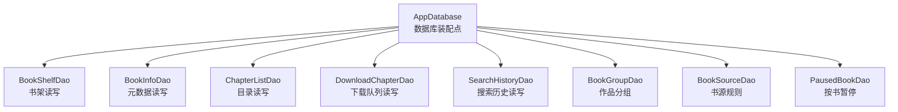
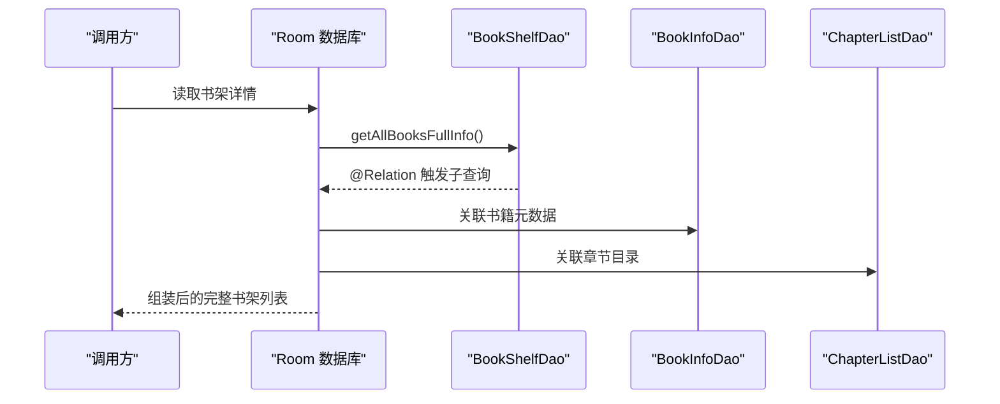
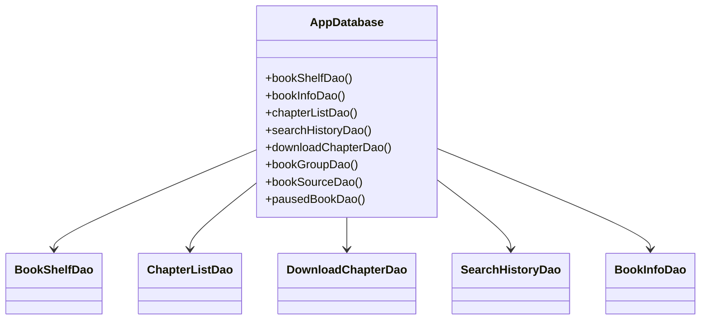

# 数据库性能测试

<cite>
**本文引用的文件**   
- [AppDatabase.kt](file://lib_ebook_db/src/main/java/com/ebook/db/AppDatabase.kt)
- [BookShelfDao.kt](file://lib_ebook_db/src/main/java/com/ebook/db/dao/BookShelfDao.kt)
- [ChapterListDao.kt](file://lib_ebook_db/src/main/java/com/ebook/db/dao/ChapterListDao.kt)
- [DownloadChapterDao.kt](file://lib_ebook_db/src/main/java/com/ebook/db/dao/DownloadChapterDao.kt)
- [SearchHistoryDao.kt](file://lib_ebook_db/src/main/java/com/ebook/db/dao/SearchHistoryDao.kt)
- [BookInfoDao.kt](file://lib_ebook_db/src/main/java/com/ebook/db/dao/BookInfoDao.kt)
- [BookShelfEntity.kt](file://lib_ebook_db/src/main/java/com/ebook/db/entity/BookShelfEntity.kt)
</cite>

## 目录
1. [引言](#引言)
2. [项目结构](#项目结构)
3. [核心组件](#核心组件)
4. [架构总览](#架构总览)
5. [详细组件分析](#详细组件分析)
6. [依赖关系分析](#依赖关系分析)
7. [性能考量](#性能考量)
8. [故障排查指南](#故障排查指南)
9. [结论](#结论)
10. [附录](#附录)

## 引言
本文件面向本项目 Room 数据库的性能测试与优化，覆盖查询性能、事务性能、Room 实体与 DAO 设计要点、连接与缓存策略、以及基线建立与维护方法。内容严格基于仓库中的数据库模块（lib_ebook_db）及其 DAO/实体实现进行归纳，旨在为复杂查询优化、索引验证、计划分析、批量操作、并发访问控制、迁移脚本影响评估提供可操作的实践建议。

## 项目结构
- 数据库装配点：AppDatabase 声明了八张表与对应 DAO，版本号为 8，开启 schema 导出，用于迁移与回归校验。
- DAO 层：按业务域划分，如书架、书籍信息、章节目录、搜索历史、下载队列、作品分组、书源、暂停标记等。
- 实体层：以自然键为主的主键策略，配合唯一索引保证幂等 upsert；流水型数据使用自增主键+唯一约束。

**图表来源**
- [AppDatabase.kt:40-70](file://lib_ebook_db/src/main/java/com/ebook/db/AppDatabase.kt#L40-L70)

**章节来源**
- [AppDatabase.kt:8-39](file://lib_ebook_db/src/main/java/com/ebook/db/AppDatabase.kt#L8-L39)
- [AppDatabase.kt:40-70](file://lib_ebook_db/src/main/java/com/ebook/db/AppDatabase.kt#L40-L70)

## 核心组件
- 书架 DAO（BookShelfDao）：提供全量/Flow 观察、按 URL 查询、批量 upsert、删除等；关键查询包含 ORDER BY final_date DESC，关联拼装使用 @Relation + @Transaction。
- 目录 DAO（ChapterListDao）：按书获取目录并排序、按内容定位符直查、批量 upsert、按书删除目录。
- 下载队列 DAO（DownloadChapterDao）：队头/队尾查询、按书取任务、全局队头、剩余数统计、批量入队与出队；唯一索引保障一章只排一个任务。
- 搜索历史 DAO（SearchHistoryDao）：按类型全量展示、精确查重、按类型清除。
- 书籍信息 DAO（BookInfoDao）：按 URL 查询、upsert、定向更新最终刷新时间戳、按 URL 删除。
- 实体（BookShelfEntity）：自然键 note_url，含阅读进度、最后阅读时间、书源归属 tag、本地书格式与编码等字段。

**章节来源**
- [BookShelfDao.kt:20-109](file://lib_ebook_db/src/main/java/com/ebook/db/dao/BookShelfDao.kt#L20-L109)
- [ChapterListDao.kt:13-44](file://lib_ebook_db/src/main/java/com/ebook/db/dao/ChapterListDao.kt#L13-L44)
- [DownloadChapterDao.kt:21-131](file://lib_ebook_db/src/main/java/com/ebook/db/dao/DownloadChapterDao.kt#L21-L131)
- [SearchHistoryDao.kt:17-66](file://lib_ebook_db/src/main/java/com/ebook/db/dao/SearchHistoryDao.kt#L17-L66)
- [BookInfoDao.kt:13-50](file://lib_ebook_db/src/main/java/com/ebook/db/dao/BookInfoDao.kt#L13-L50)
- [BookShelfEntity.kt:14-83](file://lib_ebook_db/src/main/java/com/ebook/db/entity/BookShelfEntity.kt#L14-L83)

## 架构总览
Room 通过 DAO 暴露查询与变更能力；@Relation 在事务内完成多表关联拼装；Flow 用于响应式数据流；唯一索引与 REPLACE 策略保障幂等写入；下载队列通过唯一索引与有序查询保证消费顺序。

**图表来源**
- [BookShelfDao.kt:21-33](file://lib_ebook_db/src/main/java/com/ebook/db/dao/BookShelfDao.kt#L21-L33)
- [ChapterListDao.kt:15-22](file://lib_ebook_db/src/main/java/com/ebook/db/dao/ChapterListDao.kt#L15-L22)
- [BookInfoDao.kt:15-25](file://lib_ebook_db/src/main/java/com/ebook/db/dao/BookInfoDao.kt#L15-L25)

## 详细组件分析

### 查询性能测试：复杂查询与 SQL 优化
- 书架全量查询：使用 ORDER BY final_date DESC，适合书架页一次性加载；Flow 版本用于“我的”页等响应式场景，避免手动刷新。
- 关联查询：@Relation + @Transaction 确保主查询与子查询在同一事务中，避免中间态。
- 目录查询：按 note_url 过滤后 ORDER BY dur_chapter_index ASC，保证稳定顺序；阅读器通过 content_ref 直查单章。
- 下载队列：按 note_url 与 dur_chapter_index 的有序查询确定队头/队尾；全局队头仅按序取最小值。

优化建议
- 对高频过滤列添加或确认索引：note_url（书架/目录/下载）、dur_chapter_index（目录/下载）。
- 避免无谓的全表扫描：尽量用 WHERE + ORDER BY 组合，减少排序开销。
- 对 @Relation 结果集较大的场景，考虑分页或按需展开，减少内存占用。

**章节来源**
- [BookShelfDao.kt:31-55](file://lib_ebook_db/src/main/java/com/ebook/db/dao/BookShelfDao.kt#L31-L55)
- [ChapterListDao.kt:15-26](file://lib_ebook_db/src/main/java/com/ebook/db/dao/ChapterListDao.kt#L15-L26)
- [DownloadChapterDao.kt:33-75](file://lib_ebook_db/src/main/java/com/ebook/db/dao/DownloadChapterDao.kt#L33-L75)

### 索引设计与验证
- 自然键与唯一索引：download_chapter 以自增 id 为主键，但 dur_chapter_url 有唯一索引，确保一章仅一个任务；note_url 普通索引支撑按书取任务。
- 目录表 chapter_list 主键为 content_ref，note_url 建索引支撑按书取全目录。
- 书架表 book_shelf 主键为 note_url，final_date 作为排序依据。

验证方法
- 使用 EXPLAIN QUERY PLAN 检查各查询是否命中索引；对 ORDER BY 列确认是否需要额外索引。
- 针对批量 upsert（REPLACE）路径，确认唯一冲突处理不会导致不必要的行重建。

**章节来源**
- [DownloadChapterDao.kt:18-31](file://lib_ebook_db/src/main/java/com/ebook/db/dao/DownloadChapterDao.kt#L18-L31)
- [ChapterListDao.kt:6-12](file://lib_ebook_db/src/main/java/com/ebook/db/dao/ChapterListDao.kt#L6-L12)
- [BookShelfEntity.kt:14-43](file://lib_ebook_db/src/main/java/com/ebook/db/entity/BookShelfEntity.kt#L14-L43)

### 查询计划分析与基准
- 对以下查询建立基准：书架全量、按 URL 查询、目录按书查询、下载队列队头/队尾、搜索历史按类型查询。
- 指标包括：执行时间、是否走索引、是否全表扫描、临时表/排序次数。
- 在设备/模拟器上采集冷启动与热路径的差异，记录基线并在后续提交对比。

[本节为方法论说明，不直接引用具体代码]

### 事务性能测试：批量操作与边界设计
- 书架关联查询使用 @Transaction，避免跨事务导致的中间态。
- 下载队列批量入队需先按 URL 查重回填 id，再 insertAll；REPLACE 整行替换可能重写未显式赋值字段，需在调用侧回填旧值。
- 目录批量 upsert 会触发 REPLACE，注意物理 rowid 变化对依赖物理顺序的查询的影响。

优化建议
- 将相关写操作合并到单一事务以减少锁竞争。
- 批量操作前准备数据，减少重复查询与条件判断。
- 对频繁更新的列（如 final_refresh_data）采用定向 UPDATE，避免整行 REPLACE 带来的副作用。

**章节来源**
- [BookShelfDao.kt:21-33](file://lib_ebook_db/src/main/java/com/ebook/db/dao/BookShelfDao.kt#L21-L33)
- [DownloadChapterDao.kt:98-110](file://lib_ebook_db/src/main/java/com/ebook/db/dao/DownloadChapterDao.kt#L98-L110)
- [ChapterListDao.kt:28-34](file://lib_ebook_db/src/main/java/com/ebook/db/dao/ChapterListDao.kt#L28-L34)
- [BookInfoDao.kt:27-42](file://lib_ebook_db/src/main/java/com/ebook/db/dao/BookInfoDao.kt#L27-L42)

### 并发访问控制
- 下载队列通过唯一索引防止同一章节重复排队；服务逐轮取队头，失败必须出队以避免无限重试。
- Flow 观察（如 observeRemainingCount）由 Room 失效追踪自动推送，无需手动刷新，降低并发状态同步成本。

最佳实践
- 在高并发写场景（下载、收藏、进度更新）中，尽量使用原子性更强的插入/更新接口，减少竞态。
- 对读多写少的场景，优先使用 Flow 响应式订阅，减少轮询与重复查询。

**章节来源**
- [DownloadChapterDao.kt:33-42](file://lib_ebook_db/src/main/java/com/ebook/db/dao/DownloadChapterDao.kt#L33-L42)
- [DownloadChapterDao.kt:81-96](file://lib_ebook_db/src/main/java/com/ebook/db/dao/DownloadChapterDao.kt#L81-L96)

### Room 数据库性能测试要点
- 实体关系优化：@Relation 仅在需要时启用，避免不必要的数据膨胀；对大对象集合（如章节列表）谨慎使用。
- DAO 接口设计：明确区分一次性查询与 Flow 观察；对高频查询提供精简接口（如仅书架行而非全量详情）。
- 迁移脚本性能：Schema 演进需维护迁移链，禁止 destructive migration；迁移期间关注耗时与回滚风险。

**章节来源**
- [AppDatabase.kt:35-39](file://lib_ebook_db/src/main/java/com/ebook/db/AppDatabase.kt#L35-L39)
- [BookShelfDao.kt:53-59](file://lib_ebook_db/src/main/java/com/ebook/db/dao/BookShelfDao.kt#L53-L59)

### 连接池与缓存机制
- 本项目使用 Room 默认驱动与连接管理；未在当前源码中发现自定义连接池配置。
- 查询结果缓存主要通过 Room 内部失效机制与上层 Flow 实现；建议在业务层结合内存缓存（如 LRU）对热点数据做二次缓存，以降低数据库压力。

[本节为通用建议，不直接引用具体代码]

## 依赖关系分析
- AppDatabase 集中声明所有实体与 DAO，形成单一装配点。
- DAO 之间无直接耦合，通过领域语义组织；实体与 DAO 一一对应。
- Flow 与协程贯穿查询与监听，提升响应性与资源利用率。

**图表来源**
- [AppDatabase.kt:54-70](file://lib_ebook_db/src/main/java/com/ebook/db/AppDatabase.kt#L54-L70)

**章节来源**
- [AppDatabase.kt:54-70](file://lib_ebook_db/src/main/java/com/ebook/db/AppDatabase.kt#L54-L70)

## 性能考量
- 查询优化：确保 WHERE 与 ORDER BY 列具备合适索引；避免在大结果集上使用无索引排序。
- 批量写入：使用 insertAll 并预先查重回填 id；对频繁更新列采用定向 UPDATE。
- 事务边界：将关联读写放入同一事务；对长事务保持谨慎，避免持有锁过久。
- 并发控制：利用唯一索引与有序查询保证一致性；Flow 观察减少重复查询。
- 迁移性能：迁移链需增量且可回滚；避免在大表迁移中进行昂贵操作。

[本节为通用指导，不直接引用具体代码]

## 故障排查指南
- 下载无限重试：若队头未出队，服务会重复拉取同一章，导致前台配额消耗与阻塞；需确保失败路径正确出队。
- 孤立数据：移除书架时需清理关联表（书籍信息、章节目录、下载任务、作品分组），避免遗留孤儿记录。
- 数据损坏：整行 REPLACE 会覆盖未赋值字段；对关键字段（如书名、封面）应采用定向更新或确保传入完整对象。
- Flow 失效：确认 @Relation 与事务注解是否正确；避免在 Flow 回调中进行破坏性操作。

**章节来源**
- [DownloadChapterDao.kt:33-42](file://lib_ebook_db/src/main/java/com/ebook/db/dao/DownloadChapterDao.kt#L33-L42)
- [BookShelfDao.kt:96-104](file://lib_ebook_db/src/main/java/com/ebook/db/dao/BookShelfDao.kt#L96-L104)
- [BookInfoDao.kt:27-42](file://lib_ebook_db/src/main/java/com/ebook/db/dao/BookInfoDao.kt#L27-L42)

## 结论
本项目的 Room 数据库设计遵循自然键与唯一索引原则，DAO 层职责清晰，支持响应式与批量操作。性能测试应围绕查询计划、索引命中率、事务边界与并发控制展开，并通过基线对比发现回归。对于大数据量与高并发场景，建议结合应用层缓存与分页策略进一步优化。

## 附录
- 建议的测试用例清单：
  - 书架全量查询（单次与 Flow）
  - 目录按书查询与单章直查
  - 下载队列队头/队尾与批量入队
  - 搜索历史按类型查询与清除
  - 书籍信息定向更新
- 建议的指标：
  - 平均延迟、P95/P99 延迟
  - 索引命中率、全表扫描次数
  - 事务持有时间、锁等待
  - 内存峰值与 GC 频率

[本节为方法论与清单，不直接引用具体代码]