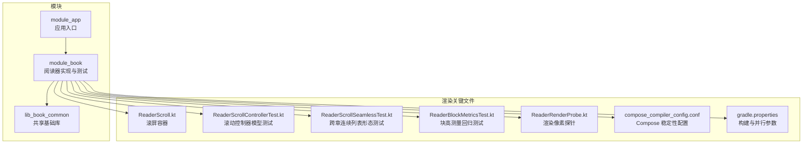
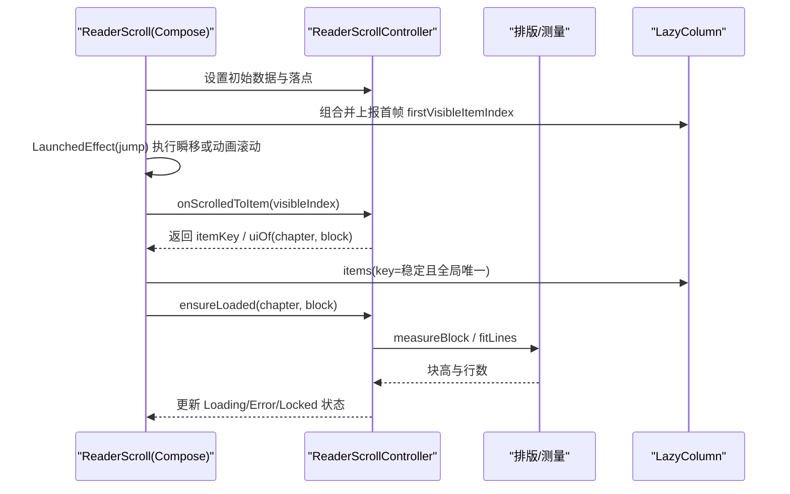
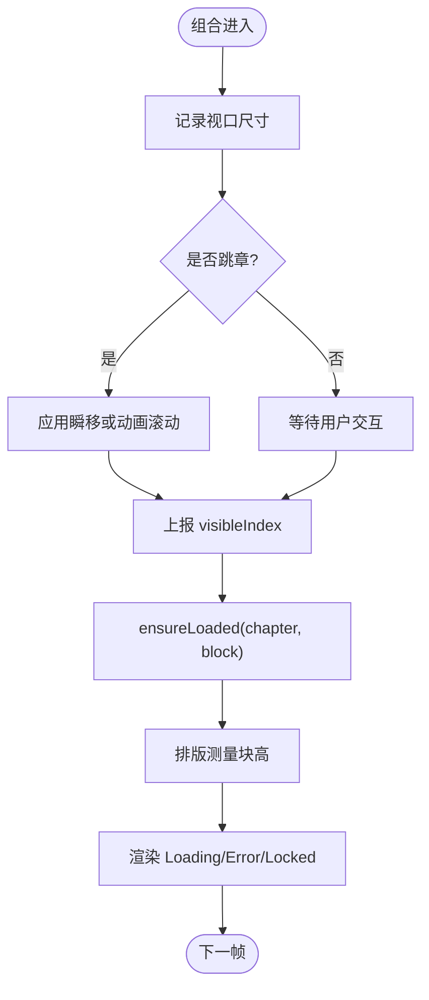
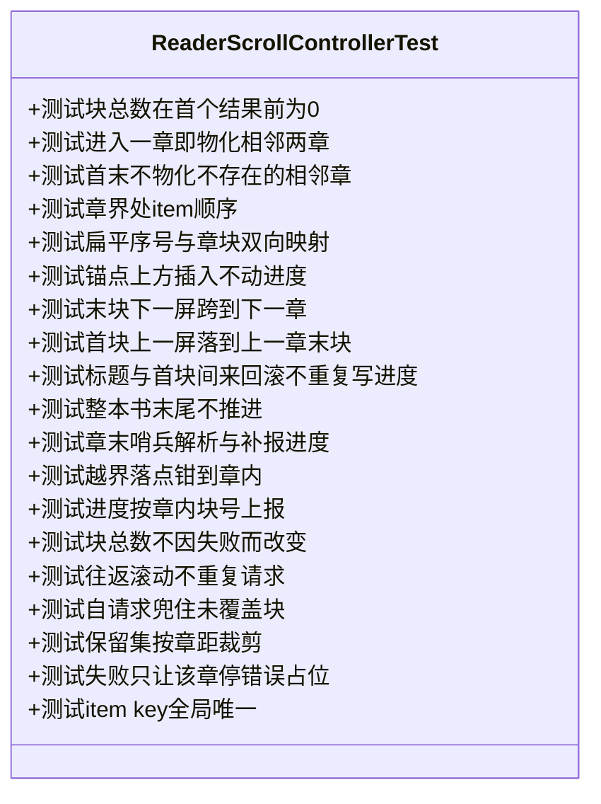
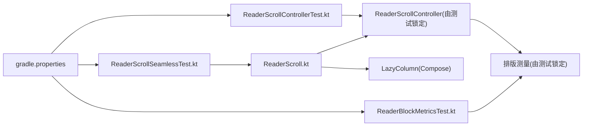

# 渲染性能测试

<cite>
**本文引用的文件**   
- [ReaderRenderProbe.kt](file://module_book/src/test/java/com/ebook/book/reader/ReaderRenderProbe.kt)
- [ReaderScroll.kt](file://module_book/src/main/java/com/ebook/book/reader/ReaderScroll.kt)
- [ReaderScrollControllerTest.kt](file://module_book/src/test/java/com/ebook/book/reader/ReaderScrollControllerTest.kt)
- [ReaderScrollSeamlessTest.kt](file://module_book/src/test/java/com/ebook/book/reader/ReaderScrollSeamlessTest.kt)
- [ReaderBlockMetricsTest.kt](file://module_book/src/test/java/com/ebook/book/reader/ReaderBlockMetricsTest.kt)
- [compose_compiler_config.conf](file://compose_compiler_config.conf)
- [gradle.properties](file://gradle.properties)
</cite>

## 目录
1. [简介](#简介)
2. [项目结构（与渲染相关）](#项目结构与渲染相关)
3. [核心组件](#核心组件)
4. [架构总览](#架构总览)
5. [详细组件分析](#详细组件分析)
6. [依赖关系分析](#依赖关系分析)
7. [性能考量](#性能考量)
8. [故障排查指南](#故障排查指南)
9. [结论](#结论)
10. [附录](#附录)

## 简介
本文件面向“阅读器”与 Compose UI 的渲染性能测试，目标是建立一套可复现、可回归、可持续集成的性能保障体系。内容覆盖：
- 帧率监控与掉帧检测策略（含 Choreographer 思路、主线程阻塞识别、过度绘制与布局重算定位）
- Compose UI 重组优化、状态提升与 LazyColumn 性能调优实践
- 阅读器特殊场景：章节分页、排版计算、图片加载对渲染的影响及优化策略
- UI 卡顿检测方法：主线程阻塞、过度绘制、布局重算等问题的识别与解决
- 具体优化建议：动画优化、内存管理、网络请求合并等
- 自动化集成：性能回归检测、指标监控、CI 中的性能验证

## 项目结构（与渲染相关）
本项目为多模块 Android 工程，UI 全面采用 Jetpack Compose。与渲染性能相关的核心代码集中在阅读器的滚动容器、控制器以及一系列针对渲染行为与排版的回归测试中；同时通过 Compose 编译器稳定性配置与构建参数支撑稳定的重组与构建性能。

图表来源
- [ReaderScroll.kt:53-233](file://module_book/src/main/java/com/ebook/book/reader/ReaderScroll.kt#L53-L233)
- [ReaderScrollControllerTest.kt:18-398](file://module_book/src/test/java/com/ebook/book/reader/ReaderScrollControllerTest.kt#L18-L398)
- [ReaderScrollSeamlessTest.kt:30-158](file://module_book/src/test/java/com/ebook/book/reader/ReaderScrollSeamlessTest.kt#L30-L158)
- [ReaderBlockMetricsTest.kt:7-37](file://module_book/src/test/java/com/ebook/book/reader/ReaderBlockMetricsTest.kt#L7-L37)
- [ReaderRenderProbe.kt:11-78](file://module_book/src/test/java/com/ebook/book/reader/ReaderRenderProbe.kt#L11-L78)
- [compose_compiler_config.conf:1-11](file://compose_compiler_config.conf#L1-L11)
- [gradle.properties:14-36](file://gradle.properties#L14-L36)

章节来源
- [ReaderScroll.kt:53-233](file://module_book/src/main/java/com/ebook/book/reader/ReaderScroll.kt#L53-L233)
- [ReaderScrollControllerTest.kt:18-398](file://module_book/src/test/java/com/ebook/book/reader/ReaderScrollControllerTest.kt#L18-L398)
- [ReaderScrollSeamlessTest.kt:30-158](file://module_book/src/test/java/com/ebook/book/reader/ReaderScrollSeamlessTest.kt#L30-L158)
- [ReaderBlockMetricsTest.kt:7-37](file://module_book/src/test/java/com/ebook/book/reader/ReaderBlockMetricsTest.kt#L7-L37)
- [ReaderRenderProbe.kt:11-78](file://module_book/src/test/java/com/ebook/book/reader/ReaderRenderProbe.kt#L11-L78)
- [compose_compiler_config.conf:1-11](file://compose_compiler_config.conf#L1-L11)
- [gradle.properties:14-36](file://gradle.properties#L14-L36)

## 核心组件
- 滚屏容器 ReaderScroll：基于 LazyColumn 的跨章连续列表，负责视口尺寸采集、点击分区处理、滚动位置上报、块级懒加载与占位态保证。
- 滚动控制器与模型测试：ReaderScrollController 的模型口径由 ReaderScrollControllerTest 严格锁定（跨章物化、锚点语义、保留集裁剪、进度上报一致性）。
- 排版与块高测量：ReaderBlockMetricsTest 锁定“块高取最后一行实测底部”的契约，避免以“行数×行高”心算导致的抖动与溢出。
- 渲染回归探针：ReaderRenderProbe.kt 提供 decorView 截图与像素比对能力，用于主题与颜色角色的回归校验。
- Compose 稳定性配置：compose_compiler_config.conf 声明稳定类型，减少重组范围。
- 构建与并行：gradle.properties 启用增量 KSP 与 Gradle 并行，缩短构建与测试反馈时间。

章节来源
- [ReaderScroll.kt:53-233](file://module_book/src/main/java/com/ebook/book/reader/ReaderScroll.kt#L53-L233)
- [ReaderScrollControllerTest.kt:18-398](file://module_book/src/test/java/com/ebook/book/reader/ReaderScrollControllerTest.kt#L18-L398)
- [ReaderBlockMetricsTest.kt:7-37](file://module_book/src/test/java/com/ebook/book/reader/ReaderBlockMetricsTest.kt#L7-L37)
- [ReaderRenderProbe.kt:11-78](file://module_book/src/test/java/com/ebook/book/reader/ReaderRenderProbe.kt#L11-L78)
- [compose_compiler_config.conf:1-11](file://compose_compiler_config.conf#L1-L11)
- [gradle.properties:14-36](file://gradle.properties#L14-L36)

## 架构总览
阅读器渲染链路从 Compose 组合开始，经 LazyColumn 渲染项，再由控制器决定数据可见窗口与预取范围，最终落到排版与分块测量，形成“视口→控制器→排版→LazyColumn”的闭环。

图表来源
- [ReaderScroll.kt:85-233](file://module_book/src/main/java/com/ebook/book/reader/ReaderScroll.kt#L85-L233)
- [ReaderScrollControllerTest.kt:30-398](file://module_book/src/test/java/com/ebook/book/reader/ReaderScrollControllerTest.kt#L30-L398)
- [ReaderBlockMetricsTest.kt:15-37](file://module_book/src/test/java/com/ebook/book/reader/ReaderBlockMetricsTest.kt#L15-L37)

## 详细组件分析

### 滚屏容器 ReaderScroll
- 视口与 insets：外层 Column 与 LazyColumn 共同承担系统栏避让与内边距，确保正文不被系统手势条遮挡。
- 滚动与点击分区：左右三分区滚一屏，中间唤出菜单；仅消费点击事件，不接管拖拽，避免与 LazyColumn 滚动冲突。
- 落点与进度上报顺序：先应用跳章落点，再上报滚动位置，避免首次组合把 (0,0) 误写为上一章进度。
- 块级懒加载：项进入可视区域后触发 ensureLoaded，结合控制器保留集按“章距”裁剪，避免远章正文堆积。
- 占位与高度契约：块高来自排版实测值；未知时以 Loading 占位且不塌陷，保证滚动位置稳定。

图表来源
- [ReaderScroll.kt:85-233](file://module_book/src/main/java/com/ebook/book/reader/ReaderScroll.kt#L85-L233)

章节来源
- [ReaderScroll.kt:53-233](file://module_book/src/main/java/com/ebook/book/reader/ReaderScroll.kt#L53-L233)

### 滚动控制器模型与行为（ReaderScrollControllerTest）
- 跨章连续列表：本章末块的下一项即为下一章标题，无“上一章/下一章”链接项。
- 锚点语义：保存“(章, 块)”而非扁平序号，使上方插入项时视觉位置不变。
- 预取与自请求：结合 LazyColumn 预取半径与 ensureLoaded 兜底，避免遗漏与重复请求。
- 保留集裁剪：按“章距”清理远章正文，近章正文保留，回滚不闪加载态。
- 失败容错：某章探测失败仍占位，相邻章正常物化。

图表来源
- [ReaderScrollControllerTest.kt:30-398](file://module_book/src/test/java/com/ebook/book/reader/ReaderScrollControllerTest.kt#L30-L398)

章节来源
- [ReaderScrollControllerTest.kt:18-398](file://module_book/src/test/java/com/ebook/book/reader/ReaderScrollControllerTest.kt#L18-L398)

### 跨章连续列表形态（ReaderScrollSeamlessTest）
- 断言跨章是一条连续列表，不再切章；下一章标题紧接在本章末块之下，下一章首块紧随其标题之后。
- 首次组合不将进度写到列表首项那一章，避免冷启动写入错误进度。
- 块高未知时占位不塌陷，保持滚动体验稳定。

章节来源
- [ReaderScrollSeamlessTest.kt:30-158](file://module_book/src/test/java/com/ebook/book/reader/ReaderScrollSeamlessTest.kt#L30-L158)

### 排版与块高测量（ReaderBlockMetricsTest）
- 块高取“放得下的最后一行的实测底部”，而非“行数×行高”的心算值，避免逐行误差累积导致的抖动。
- 当视口放不下任何一行时返回 null，调用方据此不分块，防止出现空块。

章节来源
- [ReaderBlockMetricsTest.kt:7-37](file://module_book/src/test/java/com/ebook/book/reader/ReaderBlockMetricsTest.kt#L7-L37)

### 渲染回归探针（ReaderRenderProbe.kt）
- 使用 decorView.draw(Canvas) 捕获界面像素，避免 Compose captureToImage 在 Robolectric 环境下的超时问题。
- 提供像素框计算与近似色匹配（带容差），用于主题与颜色角色回归。

章节来源
- [ReaderRenderProbe.kt:11-78](file://module_book/src/test/java/com/ebook/book/reader/ReaderRenderProbe.kt#L11-L78)

## 依赖关系分析
- ReaderScroll 依赖 LazyColumn 的列表能力与 Compose 运行时，并通过控制器解耦数据可见窗口与渲染。
- 控制器与排版测量通过测试用例固化契约，避免后续改动破坏跨章连续性与占位契约。
- 构建与测试阶段通过 KSP 增量与并行构建加速反馈循环。

图表来源
- [ReaderScroll.kt:85-233](file://module_book/src/main/java/com/ebook/book/reader/ReaderScroll.kt#L85-L233)
- [ReaderScrollControllerTest.kt:30-398](file://module_book/src/test/java/com/ebook/book/reader/ReaderScrollControllerTest.kt#L30-L398)
- [ReaderScrollSeamlessTest.kt:57-158](file://module_book/src/test/java/com/ebook/book/reader/ReaderScrollSeamlessTest.kt#L57-L158)
- [ReaderBlockMetricsTest.kt:15-37](file://module_book/src/test/java/com/ebook/book/reader/ReaderBlockMetricsTest.kt#L15-L37)
- [gradle.properties:14-36](file://gradle.properties#L14-L36)

章节来源
- [ReaderScroll.kt:85-233](file://module_book/src/main/java/com/ebook/book/reader/ReaderScroll.kt#L85-L233)
- [ReaderScrollControllerTest.kt:30-398](file://module_book/src/test/java/com/ebook/book/reader/ReaderScrollControllerTest.kt#L30-L398)
- [ReaderScrollSeamlessTest.kt:57-158](file://module_book/src/test/java/com/ebook/book/reader/ReaderScrollSeamlessTest.kt#L57-L158)
- [ReaderBlockMetricsTest.kt:15-37](file://module_book/src/test/java/com/ebook/book/reader/ReaderBlockMetricsTest.kt#L15-L37)
- [gradle.properties:14-36](file://gradle.properties#L14-L36)

## 性能考量
- 帧率监控与掉帧检测
  - 建议在真机或 CI 设备开启系统级监控（如 Choreographer 帧时长统计），设定阈值判定掉帧，并与阅读器滚动路径联动记录。
  - 在关键路径（首次组合、跳章、滚动回调）埋点记录耗时，结合系统日志定位长任务。
- Compose 重组优化
  - 通过 compose_compiler_config.conf 声明稳定类型，缩小重组范围；将频繁变化的状态下沉到局部 remember 或 state hoisting 提升。
  - 列表项使用稳定且全局唯一的 key（由控制器提供），避免不必要的重组与锚定漂移。
- LazyColumn 性能调优
  - 控制预取半径与保留集，避免一次性物化过多章段；远章正文按章距裁剪释放内存。
  - 块高来自排版实测值，避免“行数×行高”估算带来的抖动与重排。
- 阅读器特殊考虑
  - 章节分页：跨章连续列表消除“切章”开销；章界仅标题分隔，减少额外渲染。
  - 排版计算：fitLines 与 measureBlock 应尽可能缓存与复用，避免重复测量。
  - 图片加载：遵循 Coil 最佳实践，合理缓存与缩放；大图按需解码，避免阻塞主线程。
- 卡顿分析方法
  - 主线程阻塞：结合日志与监控，识别耗时 IO、同步解析、重型计算。
  - 过度绘制：使用系统工具检查层级与绘制次数，减少不必要背景与阴影。
  - 布局重算：关注 onSizeChanged 与多次 measure 的路径，确保仅必要时触发。
- 优化建议
  - 动画：优先使用 Compose 内置过渡与动画 API，避免自定义复杂动画。
  - 内存：限制可见窗大小，及时释放远章正文；图片使用合适的采样与缓存策略。
  - 网络：合并请求，避免滚动时频繁拉取；失败重试与退避策略降低抖动。

[本节为通用性能指导，不直接分析具体文件]

## 故障排查指南
- 首次组合误写进度
  - 现象：冷启动或切换模式时，进度被写成 (0,0)。
  - 排查：确认“先落点、后上报”的顺序；参考 ReaderScroll 中 LaunchedEffect(jump) 与 visibleIndex 上报顺序。
- 列表项 key 重复导致锚定异常
  - 现象：滚动位置静默跳变。
  - 排查：确保控制器提供的 key 全局唯一；参考 ReaderScrollControllerTest 中对 key 的唯一性断言。
- 块高未知导致占位塌陷
  - 现象：加载中占位不可见或高度为 0。
  - 排查：确保块高未知时给出足够高度的占位；参考 ReaderScrollSeamlessTest 中对占位的断言。
- 排版测量不一致
  - 现象：切行与画行错位，出现空白或截断。
  - 排查：确认排版样式一致；参考 ReaderBlockMetricsTest 对“最后一行实测底部”的断言。
- 主题颜色回归
  - 现象：顶/底栏或面板颜色角色变化。
  - 排查：使用 ReaderRenderProbe 进行像素比对；参考 pixelBox 与 ColorTolerance 的使用。

章节来源
- [ReaderScroll.kt:85-233](file://module_book/src/main/java/com/ebook/book/reader/ReaderScroll.kt#L85-L233)
- [ReaderScrollControllerTest.kt:384-398](file://module_book/src/test/java/com/ebook/book/reader/ReaderScrollControllerTest.kt#L384-L398)
- [ReaderScrollSeamlessTest.kt:111-130](file://module_book/src/test/java/com/ebook/book/reader/ReaderScrollSeamlessTest.kt#L111-L130)
- [ReaderBlockMetricsTest.kt:15-37](file://module_book/src/test/java/com/ebook/book/reader/ReaderBlockMetricsTest.kt#L15-L37)
- [ReaderRenderProbe.kt:25-78](file://module_book/src/test/java/com/ebook/book/reader/ReaderRenderProbe.kt#L25-L78)

## 结论
本项目在阅读器的渲染路径上建立了坚实的回归基线：跨章连续列表、块高测量契约、占位态稳定性与键唯一性均有测试锁定。配合 Compose 稳定性配置与构建并行化，可在开发与 CI 中快速发现性能退化。建议在此基础上接入系统级帧率监控与指标埋点，持续验证滚动、跳章、加载路径的性能表现，并将典型场景纳入自动化测试与性能门禁。

[本节为总结，不直接分析具体文件]

## 附录
- Compose 稳定性配置
  - 通过 compose_compiler_config.conf 声明稳定类型，减少重组范围，提高 UI 更新效率。
- 构建与并行
  - gradle.properties 启用 KSP 增量与并行构建，缩短测试与构建反馈时间。

章节来源
- [compose_compiler_config.conf:1-11](file://compose_compiler_config.conf#L1-L11)
- [gradle.properties:14-36](file://gradle.properties#L14-L36)