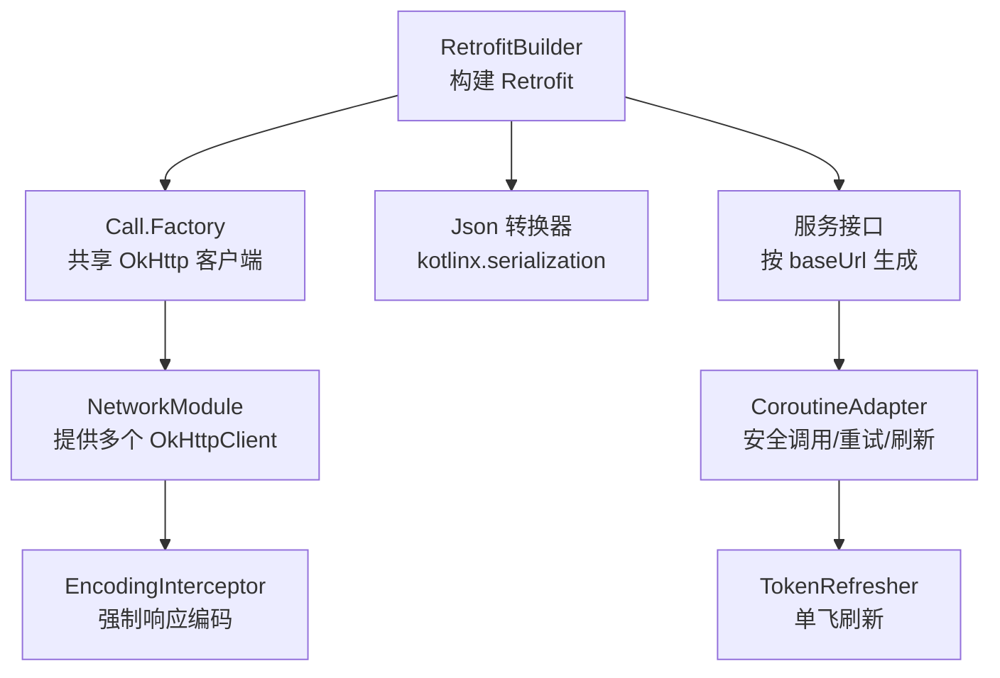
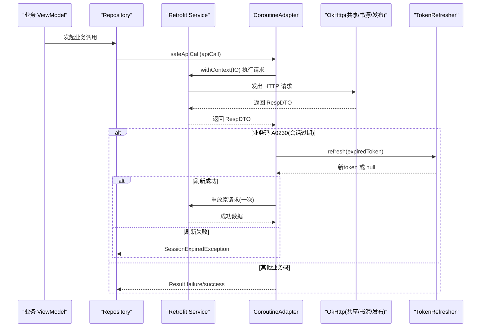
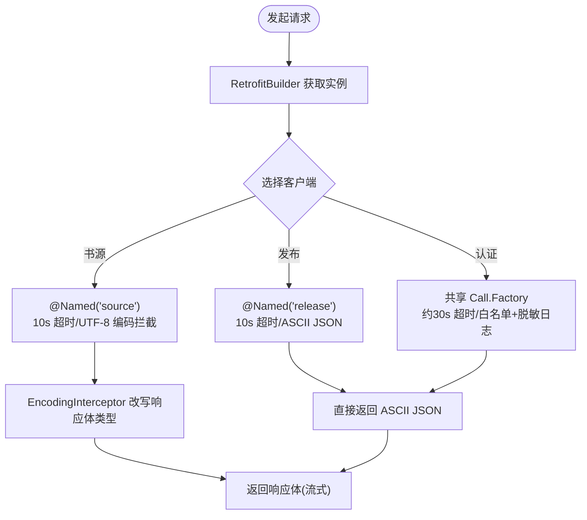
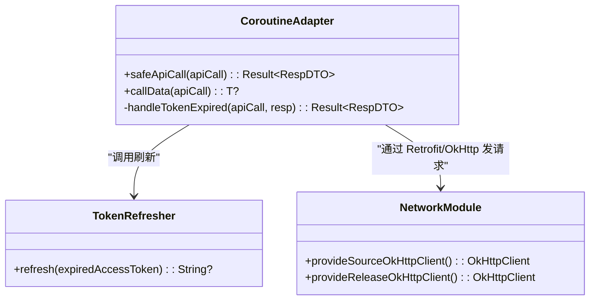
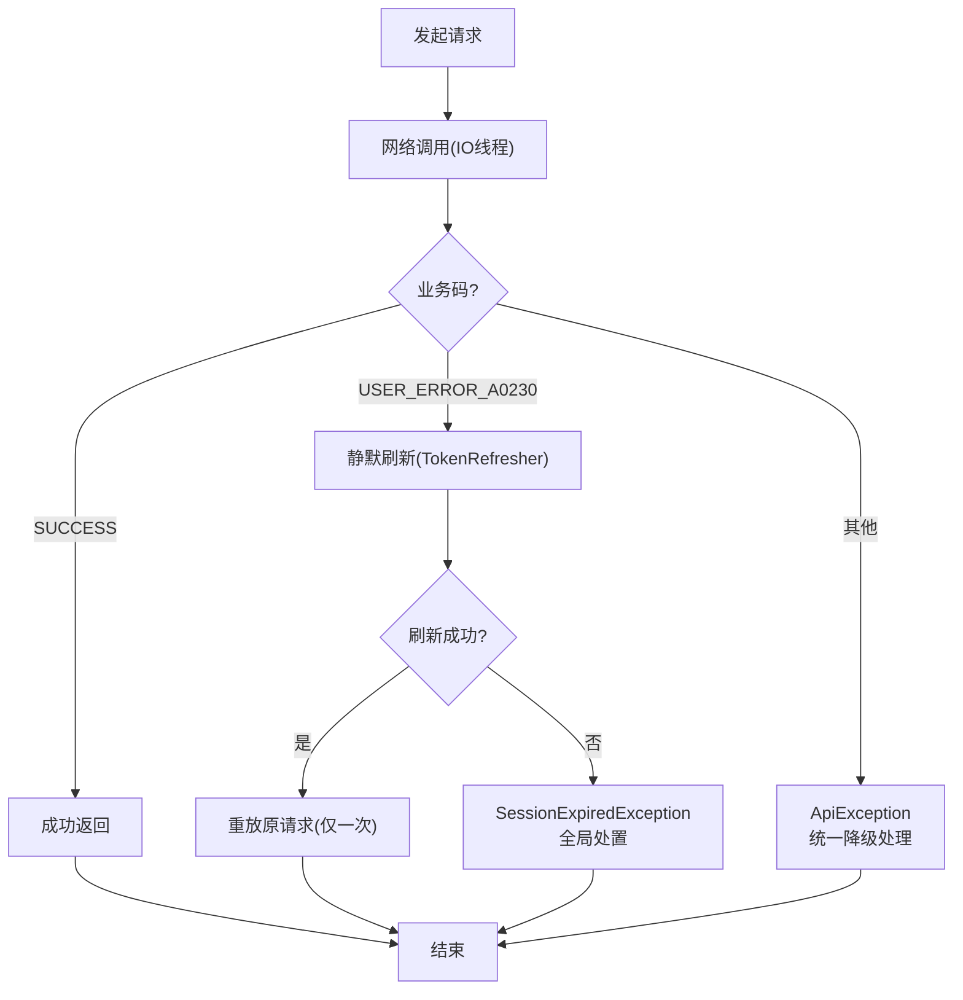
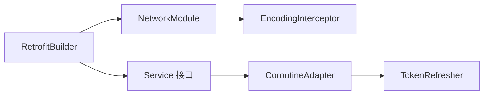

# 网络性能测试

<cite>
**本文引用的文件**
- [RetrofitBuilder.kt](file://lib_ebook_api/src/main/java/com/ebook/api/RetrofitBuilder.kt)
- [NetworkModule.kt](file://lib_ebook_api/src/main/java/com/ebook/api/utils/NetworkModule.kt)
- [EncodingInterceptor.kt](file://lib_ebook_api/src/main/java/com/ebook/api/intercepter/EncodingInterceptor.kt)
- [CoroutineAdapter.kt](file://lib_ebook_api/src/main/java/com/ebook/api/utils/CoroutineAdapter.kt)
- [TokenRefresher.kt](file://lib_ebook_api/src/main/java/com/ebook/api/auth/TokenRefresher.kt)
</cite>

## 目录
1. [简介](#简介)
2. [项目结构](#项目结构)
3. [核心组件](#核心组件)
4. [架构总览](#架构总览)
5. [详细组件分析](#详细组件分析)
6. [依赖关系分析](#依赖关系分析)
7. [性能考量](#性能考量)
8. [故障排查指南](#故障排查指南)
9. [结论](#结论)
10. [附录](#附录)

## 简介
本文件面向本项目在网络层（Retrofit + OkHttp）的性能测试与优化实践，覆盖请求响应时间、并发控制、错误恢复、缓存策略与自动化集成等方面。内容基于仓库中 lib_ebook_api 模块的实际实现进行说明，确保每一项建议都能追溯到具体代码与配置点。

## 项目结构
本项目采用模块化设计，网络能力集中在 lib_ebook_api：
- Retrofit 构建器统一装配 JSON 转换器与共享的 Call.Factory（来自 lib_common），避免重复创建 OkHttpClient。
- NetworkModule 提供多客户端：认证客户端（由上层注入）、书源客户端（纯净、短超时）、发布检查客户端（纯净、无 token）。
- EncodingInterceptor 针对第三方站点编码问题做响应体类型改写，保证流式处理与正确解码。
- CoroutineAdapter 统一封装 suspend API 调用、IO 线程切换、业务码转换、A0230 会话过期静默刷新与重放。
- TokenRefresher 定义刷新接口，实现方负责单飞互斥，避免并发刷新风暴。

图表来源
- [RetrofitBuilder.kt:24-44](file://lib_ebook_api/src/main/java/com/ebook/api/RetrofitBuilder.kt#L24-L44)
- [NetworkModule.kt:19-72](file://lib_ebook_api/src/main/java/com/ebook/api/utils/NetworkModule.kt#L19-L72)
- [EncodingInterceptor.kt:20-51](file://lib_ebook_api/src/main/java/com/ebook/api/intercepter/EncodingInterceptor.kt#L20-L51)
- [CoroutineAdapter.kt:17-150](file://lib_ebook_api/src/main/java/com/ebook/api/utils/CoroutineAdapter.kt#L17-L150)
- [TokenRefresher.kt:3-27](file://lib_ebook_api/src/main/java/com/ebook/api/auth/TokenRefresher.kt#L3-L27)

章节来源
- [RetrofitBuilder.kt:24-44](file://lib_ebook_api/src/main/java/com/ebook/api/RetrofitBuilder.kt#L24-L44)
- [NetworkModule.kt:19-72](file://lib_ebook_api/src/main/java/com/ebook/api/utils/NetworkModule.kt#L19-L72)

## 核心组件
- RetrofitBuilder：以共享 Call.Factory 复用连接池与拦截器链；显式注册 JSON 转换器与 Scalars 转换器；支持多 baseUrl 实例化。
- NetworkModule：集中管理 Json 配置与不同用途的 OkHttpClient；为“书源”和“发布检查”提供纯净客户端（不带 token）。
- EncodingInterceptor：对第三方站点的响应体 Content-Type 进行强制改写，保持流式读取，避免全量缓冲带来的内存与延迟开销。
- CoroutineAdapter：统一网络调用入口，负责 IO 调度、业务码转换、A0230 静默刷新与一次重放、异常归一化。
- TokenRefresher：刷新接口的抽象，要求实现方保证并发刷新只执行一次，防止风暴。

章节来源
- [RetrofitBuilder.kt:24-44](file://lib_ebook_api/src/main/java/com/ebook/api/RetrofitBuilder.kt#L24-L44)
- [NetworkModule.kt:19-72](file://lib_ebook_api/src/main/java/com/ebook/api/utils/NetworkModule.kt#L19-L72)
- [EncodingInterceptor.kt:20-51](file://lib_ebook_api/src/main/java/com/ebook/api/intercepter/EncodingInterceptor.kt#L20-L51)
- [CoroutineAdapter.kt:17-150](file://lib_ebook_api/src/main/java/com/ebook/api/utils/CoroutineAdapter.kt#L17-L150)
- [TokenRefresher.kt:3-27](file://lib_ebook_api/src/main/java/com/ebook/api/auth/TokenRefresher.kt#L3-L27)

## 架构总览
下图展示从页面到网络的完整调用路径，以及关键性能点（超时、拦截器、线程切换、刷新与重放）。

图表来源
- [CoroutineAdapter.kt:41-112](file://lib_ebook_api/src/main/java/com/ebook/api/utils/CoroutineAdapter.kt#L41-L112)
- [TokenRefresher.kt:18-26](file://lib_ebook_api/src/main/java/com/ebook/api/auth/TokenRefresher.kt#L18-L26)
- [NetworkModule.kt:44-71](file://lib_ebook_api/src/main/java/com/ebook/api/utils/NetworkModule.kt#L44-L71)

## 详细组件分析

### 请求响应时间测试与 Retrofit/OkHttp 优化
- 请求链路起点是 RetrofitBuilder 创建的 Retrofit 实例，通过 callFactory 复用共享的 Call.Factory，从而共享连接池、DNS 解析、TLS 握手等底层资源，减少建立连接的时延与内存分配。
- 书源客户端（@Named("source")）设置较短的连接、写入与读取超时（各 10 秒），有利于快速失败并降低长尾延迟。
- 发布检查客户端（@Named("release")）同样短超时，适合对稳定性敏感的公开 API 访问。
- 认证客户端由上层注入，注释表明其具备 debug 脱敏日志与约 30 秒超时，适合服务端交互的主链路。
- EncodingInterceptor 将响应体 contentType 强制改写为目标编码，并使用 source() + newBody 的方式包装，避免全量缓冲，利于大体积正文的流式传输与更低峰值内存。

图表来源
- [RetrofitBuilder.kt:34-44](file://lib_ebook_api/src/main/java/com/ebook/api/RetrofitBuilder.kt#L34-L44)
- [NetworkModule.kt:44-71](file://lib_ebook_api/src/main/java/com/ebook/api/utils/NetworkModule.kt#L44-L71)
- [EncodingInterceptor.kt:20-51](file://lib_ebook_api/src/main/java/com/ebook/api/intercepter/EncodingInterceptor.kt#L20-L51)

章节来源
- [RetrofitBuilder.kt:24-44](file://lib_ebook_api/src/main/java/com/ebook/api/RetrofitBuilder.kt#L24-L44)
- [NetworkModule.kt:44-71](file://lib_ebook_api/src/main/java/com/ebook/api/utils/NetworkModule.kt#L44-L71)
- [EncodingInterceptor.kt:20-51](file://lib_ebook_api/src/main/java/com/ebook/api/intercepter/EncodingInterceptor.kt#L20-L51)

### 并发请求测试与协程控制
- 所有仓库层 API 调用经 CoroutineAdapter.safeApiCall，内部使用 withContext(Dispatchers.IO) 切换到 IO 线程，避免阻塞主线程，提高并发吞吐能力。
- 当业务码为 A0230（会话过期）时，调用 TokenRefresher.refresh 进行静默刷新，且实现需保证并发刷新互斥（仅刷新一次），避免并发风暴。
- 重放逻辑仅执行一次：刷新成功后立即用新 token 重放原请求一次，不再二次触发刷新，防止级联重试风暴。
- 取消语义明确：CancellationException 不被吞掉，沿调用链上抛，确保页面销毁/超时时能正确中断请求。

图表来源
- [CoroutineAdapter.kt:17-150](file://lib_ebook_api/src/main/java/com/ebook/api/utils/CoroutineAdapter.kt#L17-L150)
- [TokenRefresher.kt:3-27](file://lib_ebook_api/src/main/java/com/ebook/api/auth/TokenRefresher.kt#L3-L27)
- [NetworkModule.kt:44-71](file://lib_ebook_api/src/main/java/com/ebook/api/utils/NetworkModule.kt#L44-L71)

章节来源
- [CoroutineAdapter.kt:41-112](file://lib_ebook_api/src/main/java/com/ebook/api/utils/CoroutineAdapter.kt#L41-L112)
- [TokenRefresher.kt:18-26](file://lib_ebook_api/src/main/java/com/ebook/api/auth/TokenRefresher.kt#L18-L26)

### 网络错误的性能影响测试（超时、恢复、降级）
- 超时策略：书源与发布检查客户端均设置短超时（10 秒），有助于在弱网或远端缓慢场景下快速失败，释放连接与线程资源。
- 错误恢复：A0230 走静默刷新 → 成功则重放一次原请求；失败则抛出 SessionExpiredException 并由全局订阅方统一处置（清会话、提示、跳转登录）。该机制避免逐点分支导致的额外 CPU 与 UI 抖动。
- 降级策略：对于非成功业务码，统一封装为 ApiException，调用方可据此做友好降级（如显示“加载失败”而非崩溃）。
- 取消与异常：CancellationException 透传，不会误报会话过期；其它异常通过 handleException 统一转换并记录日志，便于定位慢请求与异常热点。

图表来源
- [CoroutineAdapter.kt:41-112](file://lib_ebook_api/src/main/java/com/ebook/api/utils/CoroutineAdapter.kt#L41-L112)
- [TokenRefresher.kt:18-26](file://lib_ebook_api/src/main/java/com/ebook/api/auth/TokenRefresher.kt#L18-L26)

章节来源
- [CoroutineAdapter.kt:41-112](file://lib_ebook_api/src/main/java/com/ebook/api/utils/CoroutineAdapter.kt#L41-L112)

### 网络缓存策略的性能评估（HTTP 缓存、本地缓存、预加载）
- HTTP 缓存：当前未在本模块看到显式的 Cache-Control / ETag / If-None-Match 等配置；如需引入 HTTP 缓存，可在对应 OkHttpClient.Builder 中添加 cache 配置并结合服务端响应头进行命中评估。
- 本地缓存：本仓库的缓存策略更多体现在业务层（例如书城列表缓存、书籍内容存储等），不在 lib_ebook_api 内；若需要网络侧的本地缓存，建议在 NetworkModule 中为特定客户端添加磁盘缓存，并在请求前优先读本地缓存再回源。
- 预加载：可结合 CoroutineAdapter 的调度特性，在后台 IO 线程提前拉取可能需要的数据（如下一页、关联条目），但需注意与并发上限、带宽限制的配合，避免抢占关键请求资源。
- 流式处理：EncodingInterceptor 通过 source().asResponseBody 包装响应体，避免全量缓冲，有利于大正文的渐进式渲染与低内存占用。

章节来源
- [EncodingInterceptor.kt:20-51](file://lib_ebook_api/src/main/java/com/ebook/api/intercepter/EncodingInterceptor.kt#L20-L51)

### 网络性能优化的具体建议
- 请求合并：将同一批次的多个小请求合并为批量接口调用，减少握手与队列排队开销；在 Repository 层聚合调用后再交由 CoroutineAdapter 执行。
- 压缩传输：若服务端支持 gzip/deflate，可通过 OkHttp 的 Gzip 或 Brotli 拦截器启用；注意压缩会增加 CPU 消耗，需权衡带宽与 CPU 的平衡。
- 连接复用：复用 ConnectionPool（默认由 OkHttp 提供），避免频繁新建 TCP/TLS 连接；本项目已通过共享 Call.Factory 复用连接，无需重复创建客户端。
- 超时调优：针对不同场景设置差异化超时（书源/发布/认证），本项目已区分；可根据实际 P95/P99 指标进一步微调。
- 并发控制：在调用方使用协程并发工具（如 coroutineScope + limitConcurrency）限制并发数，避免压垮后端或占满系统连接池。

[本节为通用优化建议，不直接分析具体文件]

### 网络性能测试的自动化集成
- 指标收集：在 CoroutineAdapter 中对关键耗时节点（进入 IO 线程、发起请求、收到响应、刷新与重放）埋点，采集 P50/P90/P99 与错误率，上报至监控平台。
- 异常监控：统一通过 Logger 记录异常与上下文（URL、方法、状态码），便于回溯慢请求与失败热点；对 A0230 与 SessionExpired 等关键事件单独标记。
- 持续验证：将性能回归用例纳入 CI，定期执行典型场景的基准测试（如登录、搜索、详情页、下载首包），对比历史基线，发现退化及时告警。
- 多环境隔离：使用不同的 baseUrl 与客户端配置（调试/预发/生产），避免交叉污染；利用 Hilt 的 @Named 区分书源与发布检查链路。

[本节为通用集成建议，不直接分析具体文件]

## 依赖关系分析
- RetrofitBuilder 依赖共享的 Call.Factory 与 Json 转换器，避免重复构建 OkHttpClient 与序列化配置，提升启动与运行时性能。
- NetworkModule 提供三类客户端，职责清晰、超时与拦截器链分离，便于独立压测与调优。
- EncodingInterceptor 作为 OkHttp 拦截器，位于请求-响应必经路径，对大响应体的流式处理至关重要。
- CoroutineAdapter 位于仓库层之上，统一收敛异常与刷新逻辑，屏蔽调用方细节，降低耦合度。
- TokenRefresher 是刷新能力的抽象，实现方承担并发保护责任，避免风暴。

图表来源
- [RetrofitBuilder.kt:24-44](file://lib_ebook_api/src/main/java/com/ebook/api/RetrofitBuilder.kt#L24-L44)
- [NetworkModule.kt:19-72](file://lib_ebook_api/src/main/java/com/ebook/api/utils/NetworkModule.kt#L19-L72)
- [CoroutineAdapter.kt:17-150](file://lib_ebook_api/src/main/java/com/ebook/api/utils/CoroutineAdapter.kt#L17-L150)
- [TokenRefresher.kt:3-27](file://lib_ebook_api/src/main/java/com/ebook/api/auth/TokenRefresher.kt#L3-L27)

章节来源
- [RetrofitBuilder.kt:24-44](file://lib_ebook_api/src/main/java/com/ebook/api/RetrofitBuilder.kt#L24-L44)
- [NetworkModule.kt:19-72](file://lib_ebook_api/src/main/java/com/ebook/api/utils/NetworkModule.kt#L19-L72)
- [CoroutineAdapter.kt:17-150](file://lib_ebook_api/src/main/java/com/ebook/api/utils/CoroutineAdapter.kt#L17-L150)
- [TokenRefresher.kt:3-27](file://lib_ebook_api/src/main/java/com/ebook/api/auth/TokenRefresher.kt#L3-L27)

## 性能考量
- 响应时间：短超时 + 流式响应体 + 连接复用，有助于降低 P95/P99；建议在关键路径增加耗时打点。
- 并发控制：通过协程 IO 线程与统一的刷新互斥，避免并发放大；调用方可按需限制并发度。
- 错误恢复：A0230 静默刷新 + 一次重放，兼顾用户体验与系统稳定性；失败时统一事件处置，减少 UI 抖动。
- 缓存与预加载：HTTP 缓存需在客户端配置；本地缓存应在业务层配合；预加载需与并发/带宽控制联动。
- 资源占用：流式响应体避免全量缓冲；合理设置超时与连接池大小，防止内存尖峰与连接耗尽。

[本节为总体性能讨论，不直接分析具体文件]

## 故障排查指南
- 页面一直加载不出数据：检查是否因本地网络权限未授权导致直连本机失败；确认是否正确配置 ebook.server.host 与 adb reverse；查看日志中的网络异常信息。
- 会话反复过期：确认 TokenRefresher 的实现是否保证单飞刷新；检查 CoroutineAdapter 的重放逻辑是否被触发；关注 SessionExpired 事件是否被消费。
- 中文乱码：确认 EncodingInterceptor 的编码参数是否符合目标站点；必要时调整拦截器的编码策略。
- 慢请求定位：在 CoroutineAdapter 的关键阶段加入耗时统计；结合 Logger 输出 URL、方法与状态码，定位瓶颈环节。

章节来源
- [CoroutineAdapter.kt:41-112](file://lib_ebook_api/src/main/java/com/ebook/api/utils/CoroutineAdapter.kt#L41-L112)
- [EncodingInterceptor.kt:20-51](file://lib_ebook_api/src/main/java/com/ebook/api/intercepter/EncodingInterceptor.kt#L20-L51)

## 结论
本项目在网络层通过 RetrofitBuilder 统一装配、NetworkModule 多客户端隔离、EncodingInterceptor 流式处理、CoroutineAdapter 统一异常与刷新、以及 TokenRefresher 的单飞刷新，形成了稳定且可观测的网络基础。围绕这些关键点，可以系统地实施请求时长、并发、错误恢复、缓存与预加载等维度的性能测试与优化，并通过自动化指标与监控保障持续质量。

## 附录
- 术语
  - A0230：access token 过期的业务码，触发静默刷新流程。
  - 书源客户端：用于抓取第三方网站内容的纯净客户端，不带用户凭证。
  - 发布检查客户端：用于检查应用更新的公开 API 客户端，不带用户凭证。
- 参考位置
  - 客户端超时与拦截器配置见 NetworkModule。
  - 会话刷新与重放逻辑见 CoroutineAdapter 与 TokenRefresher。
  - 响应体编码与流式处理见 EncodingInterceptor。
  - Retrofit 构建与转换器装配见 RetrofitBuilder。