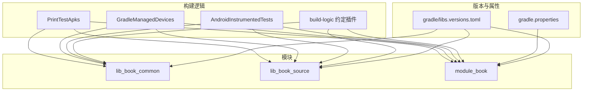
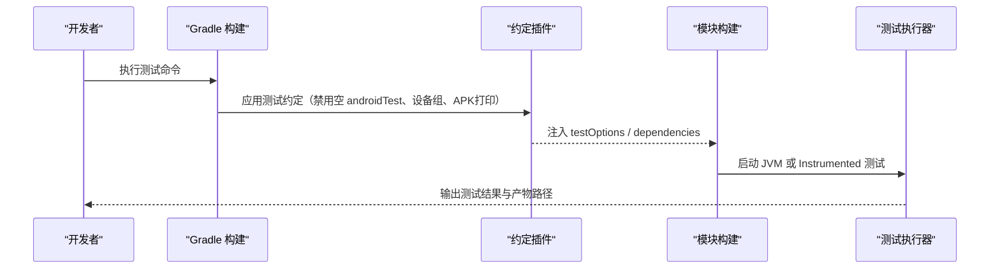
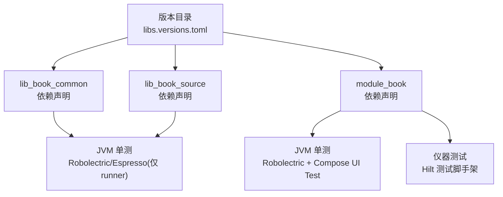
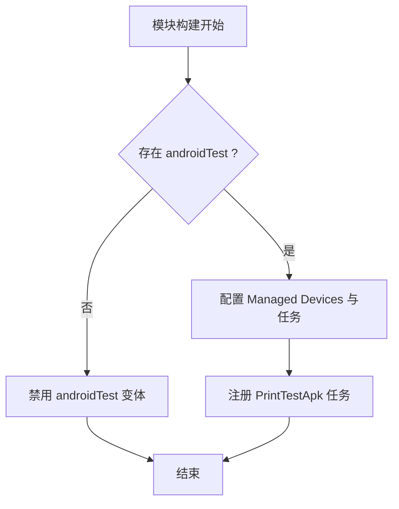
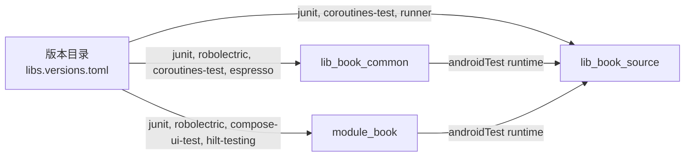

# 测试基础设施

<cite>
**本文引用的文件**   
- [gradle/libs.versions.toml](file://gradle/libs.versions.toml)
- [gradle.properties](file://gradle.properties)
- [build-logic/convention/src/main/kotlin/com/xrn1997/convention/AndroidInstrumentedTests.kt](file://build-logic/convention/src/main/kotlin/com/xrn1997/convention/AndroidInstrumentedTests.kt)
- [build-logic/convention/src/main/kotlin/com/xrn1997/convention/GradleManagedDevices.kt](file://build-logic/convention/src/main/kotlin/com/xrn1997/convention/GradleManagedDevices.kt)
- [build-logic/convention/src/main/kotlin/com/xrn1997/convention/PrintTestApks.kt](file://build-logic/convention/src/main/kotlin/com/xrn1997/convention/PrintTestApks.kt)
- [lib_book_common/build.gradle.kts](file://lib_book_common/build.gradle.kts)
- [lib_book_source/build.gradle.kts](file://lib_book_source/build.gradle.kts)
- [module_book/build.gradle.kts](file://module_book/build.gradle.kts)
</cite>

## 目录
1. [简介](#简介)
2. [项目结构](#项目结构)
3. [核心组件](#核心组件)
4. [架构总览](#架构总览)
5. [详细组件分析](#详细组件分析)
6. [依赖分析](#依赖分析)
7. [性能与执行优化](#性能与执行优化)
8. [故障排查指南](#故障排查指南)
9. [结论](#结论)
10. [附录：常用命令与最佳实践](#附录常用命令与最佳实践)

## 简介
本文件系统性梳理本项目的测试基础设施，覆盖测试框架选型、版本管理、环境配置、报告与覆盖率、工具链集成、数据准备、执行流程（本地与 CI）、以及并行与缓存等工程化实践。目标是让开发者快速理解并维护测试体系，确保稳定、可重复、可观测的测试体验。

## 项目结构
- 测试依赖集中通过 Gradle 版本目录管理（libs.versions.toml），模块按需引入 JUnit 4、Robolectric、Espresso、Hilt 测试支持等。
- 约定插件位于 build-logic，统一处理 Android 仪器测试开关、受管设备（Managed Devices）与打印 APK 任务，避免重复配置。
- 各模块在自身 build.gradle.kts 中声明单元测试、插桩测试依赖与关键 testOptions（如 Robolectric 资源加载）。



**图表来源**
- [gradle/libs.versions.toml:1-238](file://gradle/libs.versions.toml#L1-L238)
- [gradle.properties:1-36](file://gradle.properties#L1-L36)
- [build-logic/convention/src/main/kotlin/com/xrn1997/convention/AndroidInstrumentedTests.kt:22-35](file://build-logic/convention/src/main/kotlin/com/xrn1997/convention/AndroidInstrumentedTests.kt#L22-L35)
- [build-logic/convention/src/main/kotlin/com/xrn1997/convention/GradleManagedDevices.kt:27-57](file://build-logic/convention/src/main/kotlin/com/xrn1997/convention/GradleManagedDevices.kt#L27-L57)
- [build-logic/convention/src/main/kotlin/com/xrn1997/convention/PrintTestApks.kt:40-107](file://build-logic/convention/src/main/kotlin/com/xrn1997/convention/PrintTestApks.kt#L40-L107)

**章节来源**
- [gradle/libs.versions.toml:1-238](file://gradle/libs.versions.toml#L1-L238)
- [gradle.properties:1-36](file://gradle.properties#L1-L36)
- [build-logic/convention/src/main/kotlin/com/xrn1997/convention/AndroidInstrumentedTests.kt:22-35](file://build-logic/convention/src/main/kotlin/com/xrn1997/convention/AndroidInstrumentedTests.kt#L22-L35)
- [build-logic/convention/src/main/kotlin/com/xrn1997/convention/GradleManagedDevices.kt:27-57](file://build-logic/convention/src/main/kotlin/com/xrn1997/convention/GradleManagedDevices.kt#L27-L57)
- [build-logic/convention/src/main/kotlin/com/xrn1997/convention/PrintTestApks.kt:40-107](file://build-logic/convention/src/main/kotlin/com/xrn1997/convention/PrintTestApks.kt#L40-L107)

## 核心组件
- 版本目录（libs.versions.toml）：统一管理测试相关库版本（JUnit 4、androidx.test.*、Robolectric、Turbine、Coroutines Test、Hilt Testing 等），保证全仓一致升级。
- 约定插件：
  - 自动禁用无 androidTest 源码的模块的仪器测试变体，减少无效打包与运行。
  - 定义受管设备组（Pixel 4/6/C，API 级别与系统镜像），CI 仅选择部分设备执行。
  - 为含 androidTest 的变体生成“打印测试 APK 路径”的任务，便于定位产物。
- 模块级测试配置：
  - lib_book_common：JVM 单测 + Robolectric（需要真实 SharedPreferences 与 Application 上下文），instrumented 用 androidx.test.runner。
  - lib_book_source：JVM 单测；instrumented 仅启用必要依赖（ext.junit + core + runner），避免拖入完整 Espresso 链路。
  - module_book：JVM 单测开启 isIncludeAndroidResources=true 以支持 Robolectric 读取合并资源；instrumented 使用 Hilt 测试脚手架。

**章节来源**
- [gradle/libs.versions.toml:1-238](file://gradle/libs.versions.toml#L1-L238)
- [lib_book_common/build.gradle.kts:76-84](file://lib_book_common/build.gradle.kts#L76-L84)
- [lib_book_source/build.gradle.kts:53-69](file://lib_book_source/build.gradle.kts#L53-L69)
- [module_book/build.gradle.kts:42-47, 75-96](file://module_book/build.gradle.kts#L42-L47)
- [module_book/build.gradle.kts:75-96](file://module_book/build.gradle.kts#L75-L96)

## 架构总览
下图展示从构建脚本到测试执行的端到端关系：版本目录提供依赖坐标，约定插件统一配置测试行为与设备，模块按需求启用 JVM/Instrumented 测试。



**图表来源**
- [build-logic/convention/src/main/kotlin/com/xrn1997/convention/AndroidInstrumentedTests.kt:22-35](file://build-logic/convention/src/main/kotlin/com/xrn1997/convention/AndroidInstrumentedTests.kt#L22-L35)
- [build-logic/convention/src/main/kotlin/com/xrn1997/convention/GradleManagedDevices.kt:27-57](file://build-logic/convention/src/main/kotlin/com/xrn1997/convention/GradleManagedDevices.kt#L27-L57)
- [build-logic/convention/src/main/kotlin/com/xrn1997/convention/PrintTestApks.kt:40-107](file://build-logic/convention/src/main/kotlin/com/xrn1997/convention/PrintTestApks.kt#L40-L107)

## 详细组件分析

### 测试依赖与版本管理
- 版本中心：所有测试相关依赖均通过 libs.versions.toml 的版本与别名管理，包括 JUnit 4、androidx.test.*、Robolectric、Turbine、Coroutines Test、Hilt Testing 等。
- 模块引用：
  - lib_book_common：testImplementation 引入 junit、robolectric、androidx.test.core、kotlinx-coroutines-test；androidTest 引入 ext.junit、espresso-core。
  - lib_book_source：testImplementation 引入 junit、coroutines-test；androidTest 引入 ext.junit、core、runner（精简依赖，避免整条 Espresso 链路）。
  - module_book：testImplementation 引入 junit、robolectric、androidx.test.core、coroutines-test、Compose UI Test BOM；androidTest 引入 ext.junit、espresso-core、hilt-android-testing 并启用 KSP 生成测试组件。



**图表来源**
- [gradle/libs.versions.toml:1-238](file://gradle/libs.versions.toml#L1-L238)
- [lib_book_common/build.gradle.kts:76-84](file://lib_book_common/build.gradle.kts#L76-L84)
- [lib_book_source/build.gradle.kts:53-69](file://lib_book_source/build.gradle.kts#L53-L69)
- [module_book/build.gradle.kts:75-96](file://module_book/build.gradle.kts#L75-L96)

**章节来源**
- [gradle/libs.versions.toml:1-238](file://gradle/libs.versions.toml#L1-L238)
- [lib_book_common/build.gradle.kts:76-84](file://lib_book_common/build.gradle.kts#L76-L84)
- [lib_book_source/build.gradle.kts:53-69](file://lib_book_source/build.gradle.kts#L53-L69)
- [module_book/build.gradle.kts:75-96](file://module_book/build.gradle.kts#L75-L96)

### 测试环境配置
- 统一禁用空 androidTest 变体：当模块没有 src/androidTest 时，约定插件将禁用该变体的编译与安装，避免“Starting 0 tests on AVD”的空转。
- 受管设备（Managed Devices）：在约定插件中定义 Pixel 4/6/C 的设备与 API Level，并创建 ci 组用于 CI 执行。
- 测试 APK 打印：为每个含 androidTest 的变体注册打印任务，输出最终 APK 位置，便于调试与上传。



**图表来源**
- [build-logic/convention/src/main/kotlin/com/xrn1997/convention/AndroidInstrumentedTests.kt:22-35](file://build-logic/convention/src/main/kotlin/com/xrn1997/convention/AndroidInstrumentedTests.kt#L22-L35)
- [build-logic/convention/src/main/kotlin/com/xrn1997/convention/GradleManagedDevices.kt:27-57](file://build-logic/convention/src/main/kotlin/com/xrn1997/convention/GradleManagedDevices.kt#L27-L57)
- [build-logic/convention/src/main/kotlin/com/xrn1997/convention/PrintTestApks.kt:40-107](file://build-logic/convention/src/main/kotlin/com/xrn1997/convention/PrintTestApks.kt#L40-L107)

**章节来源**
- [build-logic/convention/src/main/kotlin/com/xrn1997/convention/AndroidInstrumentedTests.kt:22-35](file://build-logic/convention/src/main/kotlin/com/xrn1997/convention/AndroidInstrumentedTests.kt#L22-L35)
- [build-logic/convention/src/main/kotlin/com/xrn1997/convention/GradleManagedDevices.kt:27-57](file://build-logic/convention/src/main/kotlin/com/xrn1997/convention/GradleManagedDevices.kt#L27-L57)
- [build-logic/convention/src/main/kotlin/com/xrn1997/convention/PrintTestApks.kt:40-107](file://build-logic/convention/src/main/kotlin/com/xrn1997/convention/PrintTestApks.kt#L40-L107)

### 测试执行流程
- 本地执行：
  - JVM 单测：在各模块 src/test/java 下编写与运行，lib_book_common/lib_book_source/module_book 均声明了 JUnit 与 Coroutines Test 依赖。
  - 仪器测试：使用 AndroidJUnitRunner，模块已设置 testInstrumentationRunner；lib_book_source 明确引入 runner 以避免 Class not found。
- CI 执行：
  - 使用受管设备组（ci）在云端或本机模拟器执行，避免设备差异带来的不稳定。
  - 通过 PrintTestApks 任务输出 APK 路径，便于抓取日志与产物。

```mermaid
sequenceDiagram
    participant Dev as "开发者"
    participant GM as "Gradle 管理器"
    participant BL as "约定插件"
    participant MOD as "模块"
    participant AND as "Android 测试框架"

    Dev->>GM: ./gradlew :mod:test / connectedAndroidTest
    GM->>BL: 应用测试约定（设备、变体、任务）
    BL-->>MOD: 注入 testOptions / dependencies
    MOD->>AND: 启动测试（JVM 或 Instrumented）
    AND-->>GM: 返回结果与产物
    GM-->>Dev: 显示测试结果
```

**图表来源**
- [build-logic/convention/src/main/kotlin/com/xrn1997/convention/GradleManagedDevices.kt:27-57](file://build-logic/convention/src/main/kotlin/com/xrn1997/convention/GradleManagedDevices.kt#L27-L57)
- [lib_book_source/build.gradle.kts:53-69](file://lib_book_source/build.gradle.kts#L53-L69)
- [module_book/build.gradle.kts:12-14](file://module_book/build.gradle.kts#L12-L14)

**章节来源**
- [build-logic/convention/src/main/kotlin/com/xrn1997/convention/GradleManagedDevices.kt:27-57](file://build-logic/convention/src/main/kotlin/com/xrn1997/convention/GradleManagedDevices.kt#L27-L57)
- [lib_book_source/build.gradle.kts:53-69](file://lib_book_source/build.gradle.kts#L53-L69)
- [module_book/build.gradle.kts:12-14](file://module_book/build.gradle.kts#L12-L14)

### 测试数据准备与管理
- JSON 资产：网络层模块在 assets 中存放固定响应样例，配合 Mock 实现进行读接口验证；写接口与文件上传需代码合成响应，禁止伪造静态资产。
- 内存替身：领域服务与仓库提供 Fake/FakeXxxManager 等替身，保持测试隔离与确定性。
- 清理策略：仪器测试默认在独立进程执行，状态随进程销毁；必要时在测试用例中显式清理缓存或数据库实例，确保用例间不互相污染。

**章节来源**
- [lib_ebook_api/src/main/assets](file://lib_ebook_api/src/main/assets)
- [README.MD](file://README.MD)

### 测试报告与覆盖率
- 报告：Gradle 标准测试任务会输出 XML/HTML 报告至模块 build 目录；如需聚合报告可在 CI 阶段收集各模块产物。
- 覆盖率：当前仓库未显式集成 JaCoCo 或 Android 覆盖率插件；建议在 CI 中为 JVM 测试添加 JaCoCo 任务，为 instrumented 测试接入 AGP 内置覆盖率选项，以生成覆盖率报告并与 PR 门禁结合。

[本节为通用指导，不直接分析具体文件]

### 工具链集成
- 静态分析：AGP 内置 Lint 可通过 gradle 任务执行；建议 CI 加入 lint 检查与失败策略。
- Compose 指标：约定插件支持通过 gradle property 输出 Compose 编译器指标与报告，便于评估重组成本。
- 桌面 JS 沙箱：lib_book_source 在测试中通过 systemProperty 指定动态库路径，并在缺失时跳过桌面用例，避免本地工具链缺失导致假失败。

**章节来源**
- [build-logic/convention/src/main/kotlin/com/xrn1997/convention/AndroidCompose.kt:54-74](file://build-logic/convention/src/main/kotlin/com/xrn1997/convention/AndroidCompose.kt#L54-L74)
- [lib_book_source/build.gradle.kts:102-111](file://lib_book_source/build.gradle.kts#L102-L111)

## 依赖分析
下图展示了测试依赖在版本目录与各模块中的分布与传递关系，突出核心测试库与平台依赖。



**图表来源**
- [gradle/libs.versions.toml:1-238](file://gradle/libs.versions.toml#L1-L238)
- [lib_book_common/build.gradle.kts:76-84](file://lib_book_common/build.gradle.kts#L76-L84)
- [lib_book_source/build.gradle.kts:53-69](file://lib_book_source/build.gradle.kts#L53-L69)
- [module_book/build.gradle.kts:75-96](file://module_book/build.gradle.kts#L75-L96)

**章节来源**
- [gradle/libs.versions.toml:1-238](file://gradle/libs.versions.toml#L1-L238)
- [lib_book_common/build.gradle.kts:76-84](file://lib_book_common/build.gradle.kts#L76-L84)
- [lib_book_source/build.gradle.kts:53-69](file://lib_book_source/build.gradle.kts#L53-L69)
- [module_book/build.gradle.kts:75-96](file://module_book/build.gradle.kts#L75-L96)

## 性能与执行优化
- 并行执行：可通过 gradle.properties 启用 org.gradle.parallel=true（当前注释态），在多核机器上加速多模块测试。
- 守护进程与内存：gradle.properties 已配置 JVM 参数与 Kotlin Daemon 内存，避免 OOM。
- 增量构建：KSP 已启用增量与跨模块日志，缩短反馈周期。
- 受管设备组：CI 仅选择轻量设备组合，降低执行时长与资源消耗。
- 测试 APK 打印：通过自定义任务输出 APK 路径，便于快速定位与调试。

**章节来源**
- [gradle.properties:20-31](file://gradle.properties#L20-L31)
- [build-logic/convention/src/main/kotlin/com/xrn1997/convention/GradleManagedDevices.kt:27-57](file://build-logic/convention/src/main/kotlin/com/xrn1997/convention/GradleManagedDevices.kt#L27-L57)
- [build-logic/convention/src/main/kotlin/com/xrn1997/convention/PrintTestApks.kt:40-107](file://build-logic/convention/src/main/kotlin/com/xrn1997/convention/PrintTestApks.kt#L40-L107)

## 故障排查指南
- “Class not found” 在仪器测试阶段：确认 androidTest 所需 runner 依赖是否显式引入（lib_book_source 已补齐 runner）。
- Robolectric 无法读取资源：确保模块 testOptions.unitTests.isIncludeAndroidResources = true（module_book 已配置）。
- 桌面 JS 沙箱加载失败：确认 java.library.path 指向正确目录，否则对应用例会跳过而非失败。
- 空跑测试：若模块无 androidTest 源码，将被约定插件自动禁用变体；如预期应运行，请检查源码目录与命名规范。
- Hilt 测试注入为空：androidTest 需启用 KSP 生成测试组件（module_book 已配置 kspAndroidTest）。

**章节来源**
- [lib_book_source/build.gradle.kts:53-69](file://lib_book_source/build.gradle.kts#L53-L69)
- [module_book/build.gradle.kts:42-47](file://module_book/build.gradle.kts#L42-L47)
- [lib_book_source/build.gradle.kts:102-111](file://lib_book_source/build.gradle.kts#L102-L111)
- [build-logic/convention/src/main/kotlin/com/xrn1997/convention/AndroidInstrumentedTests.kt:22-35](file://build-logic/convention/src/main/kotlin/com/xrn1997/convention/AndroidInstrumentedTests.kt#L22-L35)
- [module_book/build.gradle.kts:89-96](file://module_book/build.gradle.kts#L89-L96)

## 结论
本项目通过版本目录集中管理测试依赖，借助 build-logic 约定插件统一测试行为与设备配置，各模块按需启用 JVM/Instrumented 测试。该架构具备良好的可扩展性与可维护性，适合在多模块、多场景下进行持续集成与质量保障。建议后续补充覆盖率采集与静态分析门禁，进一步提升交付质量与稳定性。

## 附录：常用命令与最佳实践
- 常用命令
  - 全部单元测试：./gradlew test
  - 模块单元测试：./gradlew :module_book:testDebugUnitTest
  - 仪器测试：./gradlew connectedAndroidTest
  - Lint 检查：./gradlew lint
- 最佳实践
  - 新增依赖必须走版本目录，避免硬编码版本号。
  - 仅在确实需要资源的模块开启 isIncludeAndroidResources。
  - 仪器测试尽量使用受管设备组，提升可重复性。
  - 对网络读接口使用静态 JSON 资产，写接口与上传使用代码合成响应。
  - 通过 PrintTestApks 任务定位 APK，结合 adb logcat 快速定位问题。

[本节为通用指导，不直接分析具体文件]