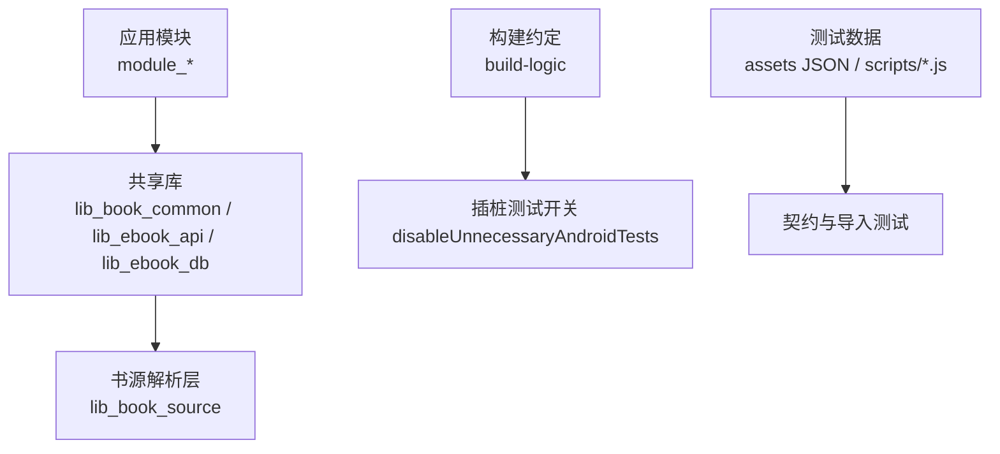
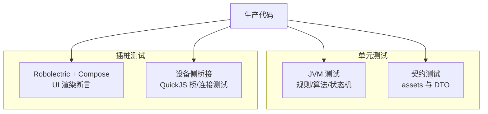
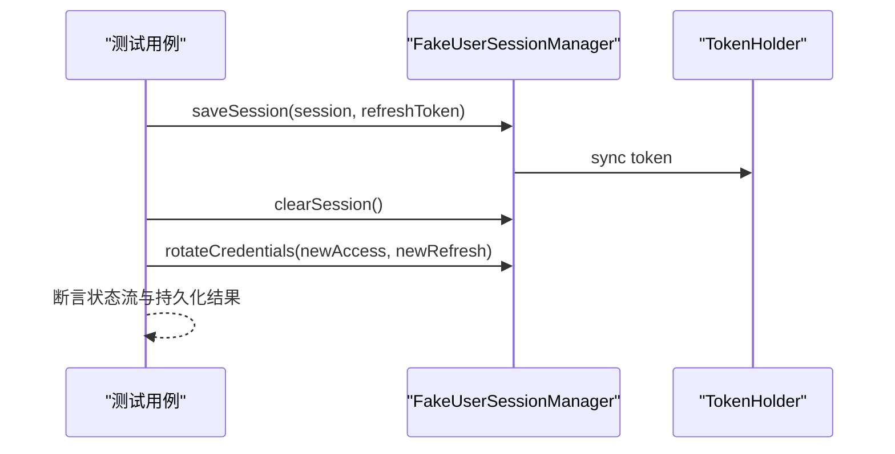
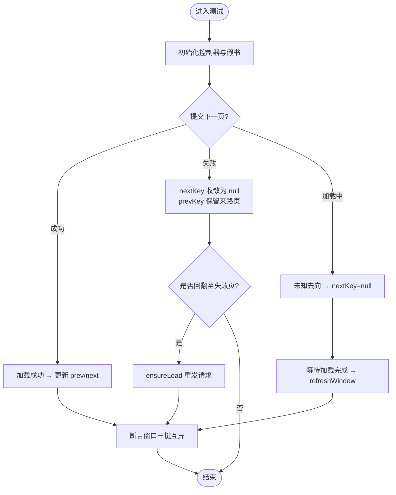
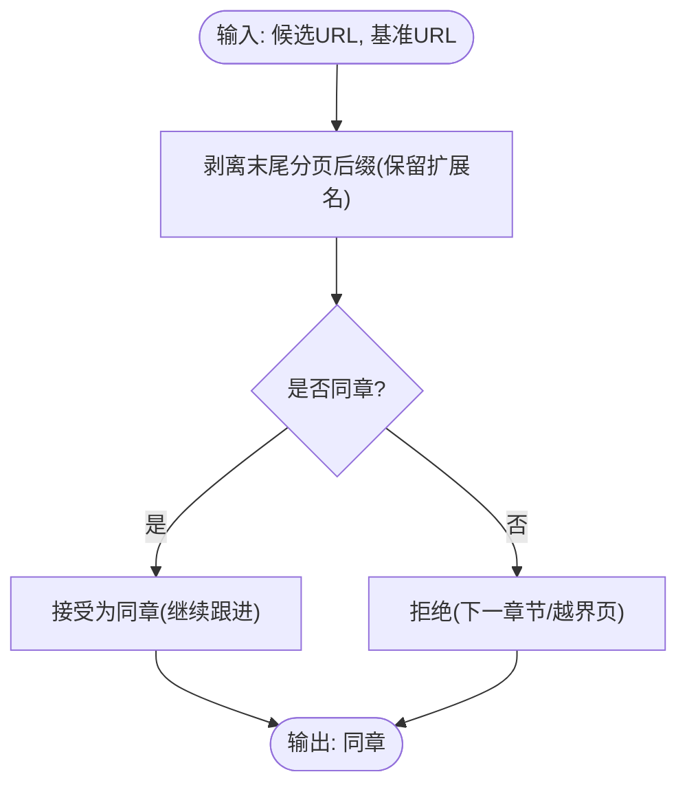
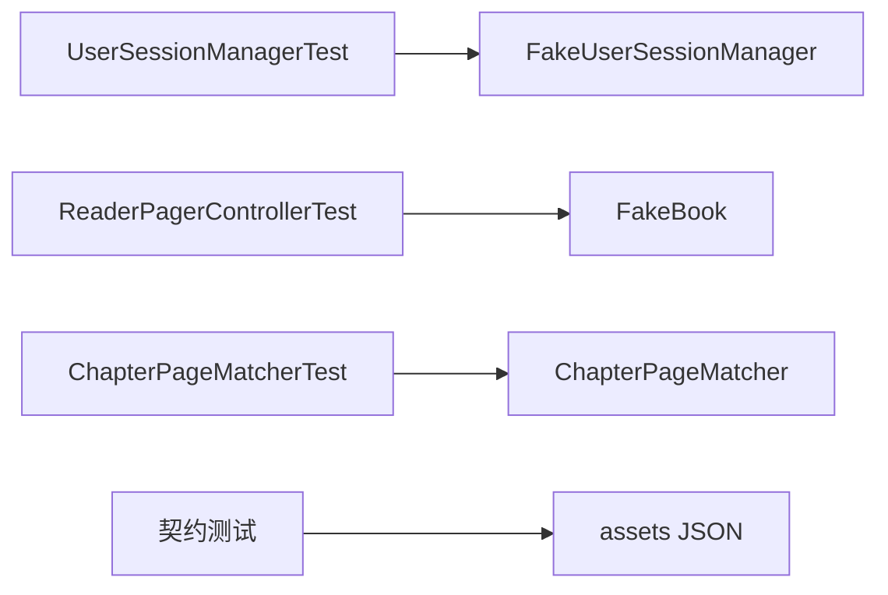

# 测试最佳实践

<cite>
**本文引用的文件**   
- [AndroidInstrumentedTests.kt](file://build-logic/convention/src/main/kotlin/com/xrn1997/convention/AndroidInstrumentedTests.kt)
- [test-coverage-todo.md](file://docs/test-coverage-todo.md)
- [UserSessionManagerTest.kt](file://lib_book_common/src/test/java/com/ebook/common/domain/UserSessionManagerTest.kt)
- [ReaderPagerControllerTest.kt](file://module_book/src/test/java/com/ebook/book/reader/ReaderPagerControllerTest.kt)
- [ChapterPageMatcherTest.kt](file://lib_book_source/src/test/java/com/ebook/source/analyze/ChapterPageMatcherTest.kt)
- [generate_test_epub.js](file://scripts/generate_test_epub.js)
</cite>

## 目录
1. [引言](#引言)
2. [项目结构](#项目结构)
3. [核心组件](#核心组件)
4. [架构总览](#架构总览)
5. [详细组件分析](#详细组件分析)
6. [依赖分析](#依赖分析)
7. [性能考虑](#性能考虑)
8. [故障排查指南](#故障排查指南)
9. [结论](#结论)
10. [附录](#附录)

## 引言
本文件总结本项目在测试方面的经验与规范，覆盖测试组织、命名与数据管理、编写原则、维护策略、常见问题定位与团队协作规范。内容基于仓库中现有测试代码与约定文档进行归纳，并给出可复用的流程图与时序图辅助理解。

## 项目结构
- 单元测试位于各模块的 `src/test/java`，插桩测试位于 `src/androidTest/java`。
- 构建逻辑通过约定插件统一处理 Android 插桩测试：若无 `androidTest` 目录则自动禁用该变体，避免无意义打包与运行。
- 测试用例按领域/模块分层组织，例如 `lib_book_common`、`lib_book_source`、`module_book`、`module_find` 等各自维护与其实现同构的测试目录。
- 测试数据与夹具：
  - JSON 资产用于网络契约测试（如评论、用户接口），放在 `src/main/assets` 下，由契约测试直读验证形态一致性。
  - 脚本生成 EPUB 测试文件，供导入流程的本地书测试使用。
  - 针对复杂状态机与 UI 的行为，采用 Robolectric + Compose 渲染探针或像素断言。

**章节来源**
- [AndroidInstrumentedTests.kt:22-35](file://build-logic/convention/src/main/kotlin/com/xrn1997/convention/AndroidInstrumentedTests.kt#L22-L35)
- [test-coverage-todo.md:1-80](file://docs/test-coverage-todo.md#L1-L80)

## 核心组件
- 测试基座与约定
  - 插桩测试启用策略：仅在存在 `androidTest` 时启用，减少无效任务。
  - 单测框架：JUnit 4；协程测试使用 `kotlinx.coroutines.test` 提供的 `runTest`、`advanceUntilIdle`。
  - Robolectric：提供 Android 上下文与资源，不渲染 View，适合控制器/业务逻辑回归测试。
- 典型测试类型
  - 纯 JVM 逻辑测试：URL 分页判定、规则词法、缓存键生成等。
  - 状态机测试：阅读器翻页窗口收敛、加载/失败态处理。
  - 契约测试：mock 资产与响应 DTO 形态一致，保障生产路径可通。
  - UI 渲染测试：Compose 像素断言，确保关键 UI 元素绘制正确。
- 测试数据管理
  - 固定 JSON 资产：用于只读且返回固定结构的接口，需同步 DTO 与序列化类型。
  - 动态构造：写接口/上传接口以代码合成响应，避免伪造静态资产。
  - 测试夹具：自定义假对象（如 `FakeBook`、`FakeUserSessionManager`）隔离外部依赖，保证确定性。

**章节来源**
- [UserSessionManagerTest.kt:12-160](file://lib_book_common/src/test/java/com/ebook/common/domain/UserSessionManagerTest.kt#L12-L160)
- [ReaderPagerControllerTest.kt:20-37](file://module_book/src/test/java/com/ebook/book/reader/ReaderPagerControllerTest.kt#L20-L37)
- [ChapterPageMatcherTest.kt:8-17](file://lib_book_source/src/test/java/com/ebook/source/analyze/ChapterPageMatcherTest.kt#L8-L17)
- [test-coverage-todo.md:15-23](file://docs/test-coverage-todo.md#L15-L23)

## 架构总览
下图展示测试在系统中的位置与职责划分：单元测试覆盖纯逻辑与状态机；契约测试保障 mock 资产与生产路径一致；插桩测试覆盖真实设备行为（如沙箱执行器桥接）。

[此图为概念性示意，无需源码映射]

## 详细组件分析

### 组件A：会话管理器测试（UserSessionManagerTest）
- 目标：验证登录/登出、token 同步、刷新 token 轮换等行为。
- 设计要点：
  - 使用 `FakeUserSessionManager` 注入到被测单元，隔离持久化细节，便于断言内部状态。
  - 使用 `runTest` 与协程调度，保证异步行为可预期。
  - 覆盖初始态、保存覆盖、空 token 清理、旋转凭证保留身份字段等场景。
- 复杂度与性能：
  - 每个用例聚焦单一职责，断言数量可控，执行快速。
- 错误处理：
  - 通过假件暴露内部计数与集合，验证副作用是否发生（如 clearCount、rotated 列表）。

**图表来源**
- [UserSessionManagerTest.kt:21-136](file://lib_book_common/src/test/java/com/ebook/common/domain/UserSessionManagerTest.kt#L21-L136)

**章节来源**
- [UserSessionManagerTest.kt:12-160](file://lib_book_common/src/test/java/com/ebook/common/domain/UserSessionManagerTest.kt#L12-L160)

### 组件B：阅读器翻页状态机测试（ReaderPagerControllerTest）
- 目标：锁定三页窗口在加载/失败/未知去向时的收敛规则，防止回退死页与空转。
- 设计要点：
  - 使用 Robolectric 提供 Context 与资源，不渲染 View。
  - 虚拟帧时钟驱动动画收敛，避免消耗墙上时间。
  - 通过假书 `FakeBook` 注入请求计数与失败门控，确定性地制造“目标页仍在 Loading”的窗口。
- 复杂度与性能：
  - 每个用例断言一组不变量（prevKey/nextKey/durKey 互异、来路页保留、未知方向收敛为 null）。
  - `advanceUntilIdle()` 配合前台 TestScope 推进任务完成。
- 错误处理：
  - 失败页上仍可向前翻回已加载页；向后翻不会自指空转；回翻触发隐式重试。

**图表来源**
- [ReaderPagerControllerTest.kt:42-195](file://module_book/src/test/java/com/ebook/book/reader/ReaderPagerControllerTest.kt#L42-L195)

**章节来源**
- [ReaderPagerControllerTest.kt:20-37](file://module_book/src/test/java/com/ebook/book/reader/ReaderPagerControllerTest.kt#L20-L37)
- [ReaderPagerControllerTest.kt:42-195](file://module_book/src/test/java/com/ebook/book/reader/ReaderPagerControllerTest.kt#L42-L195)

### 组件C：章节分页匹配测试（ChapterPageMatcherTest）
- 目标：锁定章节分页判定在不同 URL 形态下的行为，避免串章与漏页。
- 设计要点：
  - 覆盖常规后缀、扩展名不一致、查询参数、第 1 页也带后缀等四类形态。
  - 断言“宁可漏页不可串章”的取舍，固化边界行为。
- 复杂度与性能：
  - 纯函数判定，用例独立、执行极快。
- 错误处理：
  - 对“下一章首页”和“相邻章”明确拦截，防止后续章节被误拼入当前章。

**图表来源**
- [ChapterPageMatcherTest.kt:22-158](file://lib_book_source/src/test/java/com/ebook/source/analyze/ChapterPageMatcherTest.kt#L22-L158)

**章节来源**
- [ChapterPageMatcherTest.kt:8-17](file://lib_book_source/src/test/java/com/ebook/source/analyze/ChapterPageMatcherTest.kt#L8-L17)
- [ChapterPageMatcherTest.kt:22-158](file://lib_book_source/src/test/java/com/ebook/source/analyze/ChapterPageMatcherTest.kt#L22-L158)

### 组件D：测试数据与夹具
- 契约测试资产：
  - 将 JSON 资产置于 `src/main/assets`，用契约测试直读，校验形态与 DTO 类型一致。
  - 对写接口/上传接口采用代码合成响应，避免静态资产表达不了入参变化与上传后地址。
- 测试文件生成：
  - 使用脚本生成 EPUB 测试文件，用于本地书导入流程的端到端验证。
- 假件与门控：
  - 通过假对象与挂起闸门（`CompletableDeferred`）构造确定性场景，避免线程调度导致的偶发失败。

**章节来源**
- [test-coverage-todo.md:15-23](file://docs/test-coverage-todo.md#L15-L23)
- [generate_test_epub.js:1-319](file://scripts/generate_test_epub.js#L1-L319)

## 依赖分析
- 测试对生产代码的依赖呈现“面向接口/类”的解耦：
  - 会话相关：通过假管理器替代真实持久化。
  - 阅读控制器：通过假书注入加载逻辑，记录请求次数与失败点。
  - 解析器：纯函数测试不依赖 Android，仅断言规则/URL 行为。
- 外部依赖：
  - JUnit 4、Robolectric、kotlinx-coroutines-test。
  - 设备侧测试依赖 QuickJS 原生桥接（插桩测试）。

**图表来源**
- [UserSessionManagerTest.kt:12-160](file://lib_book_common/src/test/java/com/ebook/common/domain/UserSessionManagerTest.kt#L12-L160)
- [ReaderPagerControllerTest.kt:200-290](file://module_book/src/test/java/com/ebook/book/reader/ReaderPagerControllerTest.kt#L200-L290)
- [ChapterPageMatcherTest.kt:8-158](file://lib_book_source/src/test/java/com/ebook/source/analyze/ChapterPageMatcherTest.kt#L8-L158)

**章节来源**
- [test-coverage-todo.md:15-80](file://docs/test-coverage-todo.md#L15-L80)

## 性能考虑
- 单元测试优先选择纯 JVM 路径，避免启动 Android 运行时开销。
- 使用虚拟帧时钟与测试作用域控制协程推进，缩短用例执行时间。
- 契约测试直接读取 assets 文件，绕过网络栈，提升稳定性与速度。
- 插桩测试仅用于无法在 JVM 覆盖的场景（如原生桥、UI 渲染），并通过最小设备配置加速执行。

[本节提供通用指导，无需源码引用]

## 故障排查指南
- 测试不稳定性的常见原因与对策：
  - 跨类污染导致主线程派发器未设置：检查 VM 初始化路径上的 IO 协程是否在测试结束时仍未完成；给测试作用域注入可替换 IO 派发器，或在 `@After` 中取消并做有界排空调度器的显式断言。
  - 真实 IO 协程不受虚拟时钟控制：将耗时操作纳入可测作用域，或使用假仓库/假时钟。
- 性能问题诊断：
  - 观察用例是否启动了不必要的 Android 环境；优先抽取纯函数分支进行测试。
  - 对于 UI 渲染测试，确认未使用会阻塞 Looper 的方法（如 `captureToImage` 在暂停 Looper 下超时）。
- 环境差异处理：
  - 契约测试应锁死资产形态与 DTO 类型，避免后端变更引发静默失败。
  - 设备侧测试需在多 OS 版本复跑，尤其涉及原生桥与安全策略（白名单、私网边界）。

**章节来源**
- [test-coverage-todo.md:84-96](file://docs/test-coverage-todo.md#L84-L96)
- [test-coverage-todo.md:71-79](file://docs/test-coverage-todo.md#L71-L79)

## 结论
本项目测试体系围绕“高内聚、低耦合、可重复、可读性强”的原则组织：单元测试覆盖核心逻辑与状态机，契约测试守护数据契约，插桩测试覆盖设备侧特性。通过假件、门控与虚拟时钟，有效降低不确定性；通过资产与脚本生成，稳定支撑导入与网络链路测试。建议持续完善待办清单中的缺失覆盖，尤其是 UI 接线与复杂交互场景的自动化。

[本节为总结，无需源码引用]

## 附录
- 测试命名与组织
  - 测试类命名 `<Subject>Test`；测试方法使用反引号包裹的句子式描述，增强可读性。
  - 测试按模块与领域分层，保持与生产代码同构的目录结构。
- 测试数据分类管理
  - 只读接口使用静态 JSON 资产；写接口与上传接口使用代码合成响应。
  - 测试夹具与假对象集中放置于对应模块的 test source set，便于复用与维护。
- 团队协作规范
  - 代码审查关注：新增/修改功能是否同步更新测试；契约资产是否与 DTO 保持一致；插桩测试是否必要且最小化。
  - 提交规范遵循 Conventional Commits，测试变更使用 `test` 类型，scope 使用模块名。
  - 测试文档维护：`docs/test-coverage-todo.md` 作为覆盖待办与人工验证清单的事实源，随迭代更新。

**章节来源**
- [test-coverage-todo.md:1-80](file://docs/test-coverage-todo.md#L1-L80)