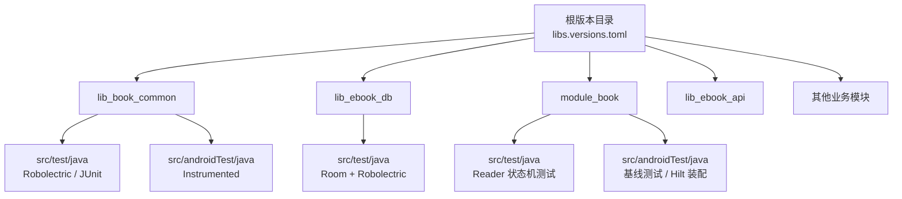
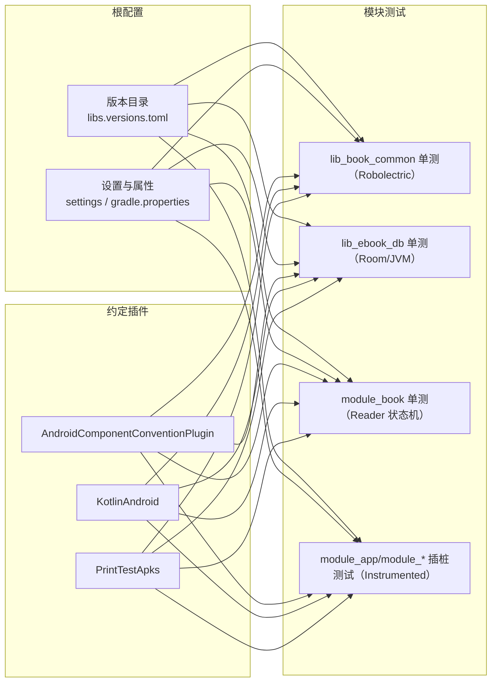
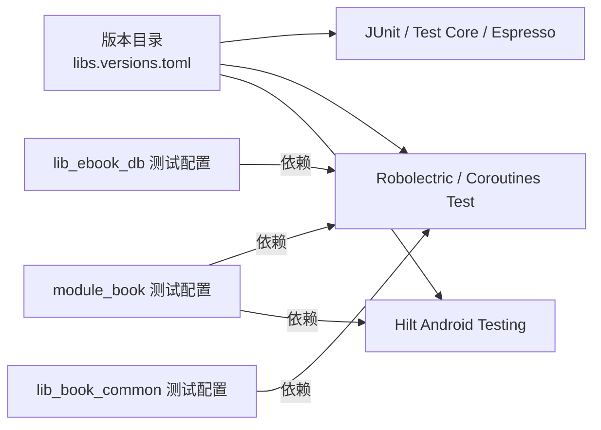

# 测试环境与工具

<cite>
**本文引用的文件**
- [gradle/libs.versions.toml](file://gradle/libs.versions.toml)
- [lib_book_common/build.gradle.kts](file://lib_book_common/build.gradle.kts)
- [module_book/build.gradle.kts](file://module_book/build.gradle.kts)
- [lib_ebook_db/build.gradle.kts](file://lib_ebook_db/build.gradle.kts)
- [AGENTS.md](file://AGENTS.md)
- [AndroidComponentConventionPlugin.kt](file://build-logic/convention/src/main/kotlin/com/xrn1997/convention/AndroidComponentConventionPlugin.kt)
- [AndroidLibraryConventionPlugin.kt](file://build-logic/convention/src/main/kotlin/com/xrn1997/convention/AndroidLibraryConventionPlugin.kt)
- [KotlinAndroid.kt](file://build-logic/convention/src/main/kotlin/com/xrn1997/convention/KotlinAndroid.kt)
- [PrintTestApks.kt](file://build-logic/convention/src/main/kotlin/com/xrn1997/convention/PrintTestApks.kt)
- [settings.gradle.kts](file://settings.gradle.kts)
- [gradle.properties](file://gradle.properties)
- [AndroidUserSessionManagerTest.kt](file://lib_book_common/src/test/java/com/ebook/common/domain/AndroidUserSessionManagerTest.kt)
- [ReaderPagerControllerTest.kt](file://module_book/src/test/java/com/ebook/book\reader/ReaderPagerControllerTest.kt)
- [ImportBaselineTest.kt](file://module_book/src/androidTest/java/com/ebook/book/ImportBaselineTest.kt)
- [test-coverage-todo.md](file://docs/test-coverage-todo.md)
</cite>

## 目录
1. [介绍](#介绍)
2. [项目结构](#项目结构)
3. [核心组件](#核心组件)
4. [架构总览](#架构总览)
5. [详细组件分析](#详细组件分析)
6. [依赖分析](#依赖分析)
7. [性能与构建优化](#性能与构建优化)
8. [故障排查指南](#故障排查指南)
9. [结论](#结论)
10. [附录：常用命令与检查清单](#附录：常用命令与检查清单)

## 介绍
本文档面向本地开发与持续集成（CI）的测试环境搭建、测试依赖版本管理与统一配置，覆盖 Gradle 测试插件选项、单元测试与插桩测试的差异与使用场景、Robolectric 虚拟机配置策略、覆盖率工具与报告生成、Mock 框架使用建议、IDE 调试技巧、GitHub Actions 或其他 CI 平台的测试流水线示例，以及常见问题与排障方法。该仓库采用多模块 + Gradle 约定插件架构，所有测试依赖通过统一版本目录 libs.versions.toml 管理，保证工程一致性、可复用性和易于升级。

## 项目结构
- 版本与依赖集中管理：根级版本目录 gradle/libs.versions.toml 统一管理 JUnit、AndroidX Test、Espresso、Robolectric、kotlinx-coroutines-test、Hilt Android Testing 等测试相关库的版本与引用名，便于在跨模块中一致引入与升级。
- 通用测试脚本与打印任务：build-logic/convention 内包含用于构建期打印测试 APK 路径、辅助验证产物位置的扩展任务，提升多模块定位测试产物的效率。
- 模块级测试开关与配置：各 Android 模块（如 module_book、lib_ebook_db）在其 build.gradle.kts 中按需开启 Robolectric 所需的 isIncludeAndroidResources，并声明相应测试依赖；lib_ebook_api 与部分模块仅使用纯 JVM 测试。
- 单测与插桩测试分工清晰：src/test/java 为纯 JVM/Robolectric 单元或回归测试，src/androidTest/java 为需要真实设备/模拟器的 UI 或基线测试。

**图示来源**
- [gradle/libs.versions.toml:135-197](file://gradle/libs.versions.toml#L135-L197)
- [lib_book_common/build.gradle.kts:70-77](file://lib_book_common/build.gradle.kts#L70-L77)
- [lib_ebook_db/build.gradle.kts:45-52](file://lib_ebook_db/build.gradle.kts#L45-L52)
- [module_book/build.gradle.kts:69-83](file://module_book/build.gradle.kts#L69-L83)

**章节来源**
- [gradle/libs.versions.toml:1-200](file://gradle/libs.versions.toml#L1-L200)
- [settings.gradle.kts:55-64](file://settings.gradle.kts#L55-L64)

## 核心组件
- 测试依赖管理：JUnit、AndroidX Test、Espresso、Robolectric、kotlinx-coroutines-test、Hilt Android Testing、Roborazzi（视觉回归）通过版本目录统一管控，避免跨模块版本漂移。
- 构建期任务与工具：printTestApks 等任务帮助快速定位测试产物；约定插件封装 AGP 和 Kotlin 能力，稳定支撑单元测试运行。
- 典型用例：
  - AndroidUserSessionManagerTest：基于 Robolectric + 真 SharedPreferences，验证“会话三处镜像”一致性与口令不落盘策略。
  - ReaderPagerControllerTest：基于 Robolectric + VirtualFrameClock，校验阅读器翻页窗口状态机的不变式。
  - ImportBaselineTest：基于 instrumented 测试，对导入流程做基线回归（含 Hilt 测试脚手架）。
  - Room DAO 测试（SearchHistoryDaoTest）：在 JVM 内存环境下执行数据库回归测试。

**章节来源**
- [AndroidUserSessionManagerTest.kt:1-80](file://lib_book_common/src/test/java/com/ebook/common/domain/AndroidUserSessionManagerTest.kt#L1-L80)
- [ReaderPagerControllerTest.kt:1-40](file://module_book/src/test/java/com/ebook/book\reader/ReaderPagerControllerTest.kt#L1-L40)
- [ImportBaselineTest.kt](file://module_book/src/androidTest/java/com/ebook/book/ImportBaselineTest.kt)
- [AndroidComponentConventionPlugin.kt](file://build-logic/convention/src/main/kotlin/com/xrn1997/convention/AndroidComponentConventionPlugin.kt)

## 架构总览
测试环境的分层与职责如下：
- 根级版本目录提供统一的依赖版本，模块内通过 libs.xxx 引用，确保一致性。
- 构建约定插件负责为 Android Library/Application/Component 注入一致的编译、构建与测试上下文，包括启用资源到单元测试（isIncludeAndroidResources）、JVMTarget、Hilt/KSP 处理等。
- 模块层依据需求选择单元测试或插桩测试；需要 Context/资源/SharedPreferences 的代码优先以 Robolectric 方式覆盖。
- 视图与交互类回归以 Instrumented 测试为主（如导入流程基线），结合 Hilt 测试支持进行装配验证。

**图示来源**
- [gradle/libs.versions.toml:135-197](file://gradle/libs.versions.toml#L135-L197)
- [AndroidComponentConventionPlugin.kt](file://build-logic/convention/src/main/kotlin/com/xrn1997/convention/AndroidComponentConventionPlugin.kt)
- [KotlinAndroid.kt](file://build-logic/convention/src/main/kotlin/com/xrn1997/convention/KotlinAndroid.kt)
- [PrintTestApks.kt](file://build-logic/convention/src/main/kotlin/com/xrn1997/convention/PrintTestApks.kt)
- [lib_book_common/build.gradle.kts:70-77](file://lib_book_common/build.gradle.kts#L70-L77)
- [module_book/build.gradle.kts:69-83](file://module_book/build.gradle.kts#L69-L83)

## 详细组件分析

### 依赖版本与引入
- 单元测试与插桩测试依赖：
  - JUnit 4（junit:junit）、AndroidX Test Ext JUnit、Espresso（androidTest）在各模块按需声明。
  - kotlinx-coroutines-test 用于协程测试推进与虚拟时间控制。
  - Robolectric（org.robolectric:robolectric）用于需要 Android 上下文/资源的逻辑回归测试。
  - Hilt Android Testing 用于 Instrumented 测试的依赖注入装配。
- 版本集中存放于版本目录，模块通过 alias(libs.xxx) 引用，避免硬编码版本号。

**章节来源**
- [gradle/libs.versions.toml:135-197](file://gradle/libs.versions.toml#L135-L197)
- [lib_book_common/build.gradle.kts:70-77](file://lib_book_common/build.gradle.kts#L70-L77)
- [module_book/build.gradle.kts:69-83](file://module_book/build.gradle.kts#L69-L83)
- [lib_ebook_db/build.gradle.kts:45-52](file://lib_ebook_db/build.gradle.kts#L45-L52)

### Gradle 测试插件与 testOptions
- isIncludeAndroidResources：在需要读取合并资源（例如 R.string.*）的单元测试中开启，常见于 Robolectric 测试场景（如 lib_ebook_db、module_book）。
- 测试运行器：instrumentationRunner 设置为 androidx.test.runner.AndroidJUnitRunner，用于插桩测试执行。
- 插件约定：由 build-logic 中的约定插件统一注入 Kotlin/Android 能力，模块层只需聚焦测试依赖与必要的 testOptions。

**章节来源**
- [module_book/build.gradle.kts:36-41](file://module_book/build.gradle.kts#L36-L41)
- [lib_ebook_db/build.gradle.kts:14-18](file://lib_ebook_db/build.gradle.kts#L14-L18)
- [AndroidComponentConventionPlugin.kt](file://build-logic/convention/src/main/kotlin/com/xrn1997/convention/AndroidComponentConventionPlugin.kt)

### Robolectric 虚拟机配置与 SDK/Resources/Assets
- @Config(sdk = [34])：用例显式指定运行时 SDK，减少环境差异导致的波动；在 AndroidUserSessionManagerTest 与 ReaderPagerControllerTest 中已显式设置。
- isIncludeAndroidResources：启用后，单元测试可访问合并后的资源（R.*），适合需要资源加载的场景。
- 资源与 Assets：如需资源解析，应确保测试模块的 testOptions.isIncludeAndroidResources=true；如使用 assets，需确保被测逻辑只涉及文件系统读取或在 Robolectric 沙箱下可用；本项目当前用例主要依赖真实 SP 与资源，不直接依赖外部 asset。
- 注意：不同模块开启该开关的程度与其测试目的相关——仅当测试真的需要资源时再开启，以避免不必要的构建成本。

**章节来源**
- [AndroidUserSessionManagerTest.kt:21-40](file://lib_book_common/src/test/java/com/ebook/common/domain/AndroidUserSessionManagerTest.kt#L21-L40)
- [ReaderPagerControllerTest.kt:16-40](file://module_book/src/test/java/com/ebook/book\reader/ReaderPagerControllerTest.kt#L16-L40)
- [lib_book_common/build.gradle.kts:70-77](file://lib_book_common/build.gradle.kts#L70-L77)
- [module_book/build.gradle.kts:36-41](file://module_book/build.gradle.kts#L36-L41)

### 单元测试 vs 插桩测试：区别与选型
- 单元测试（src/test/java）
  - 运行快，无设备要求（Robolectric 模式下提供 Android 上下文与资源）。
  - 适合逻辑判断、状态机、数据映射、DAO 行为验证（如 ReaderPagerController、ChapterPageMatcher、Room DAO）。
  - 推荐场景：无需真实网络/系统 API，或可通过 Mock/Spy 替代的系统调用。
- 插桩测试（src/androidTest/java）
  - 需要连接设备或模拟器，能验证真正打包产物与系统交互（UI、Service、权限、存储）。
  - 适合端到端流程验证（如 ImportBaselineTest 的导入基线、Activity/Fragment/UI 交互）。
  - 推荐场景：必须依赖真实运行环境或复杂系统集成（前台服务、通知、Hilt 完整装配）。

**章节来源**
- [ImportBaselineTest.kt](file://module_book/src/androidTest/java/com/ebook/book/ImportBaselineTest.kt)
- [ReaderPagerControllerTest.kt:1-40](file://module_book/src/test/java/com/ebook/book\reader/ReaderPagerControllerTest.kt#L1-L40)

### 覆盖率报告与 JaCoCo
- 现状：仓库未在当前构建脚本中发现 JaCoCo 插件与配置片段；覆盖率待办见 docs/test-coverage-todo.md。
- 建议实践：
  - 在根级或应用模块引入 JaCoCo Gradle 插件（com.android.build.gradle.coverage 或 jacoco 插件），为 debug/release 变体生成覆盖率 HTML 报告。
  - 将单元测试与插桩测试分别纳入覆盖统计，必要时通过 reportTask 聚合报告。
  - 在 CI 中收集并归档报告（例如 publishArtifacts），并在 PR 上展示关键模块覆盖率变化。
- 分析与落地：建议在 lib_book_common 与业务功能模块先行试点，逐步推广至全仓。

**章节来源**
- [test-coverage-todo.md:1-30](file://docs/test-coverage-todo.md#L1-L30)

### Mock 框架与最佳实践
- Mockito：当前仓库未见 Mockito 依赖与用法。若需在纯 JVM 单测中使用静态/第三方方法 Mock，可引入 mockito-inline 或采用 PowerMock 兼容方案（谨慎评估维护成本）。对于 Lambda 表达式，可优先用普通函数/高阶函数解耦以便替换；若仍需 Mock，建议使用支持 Lambda 的增强工具链并结合 stub 策略。
- 推荐策略：
  - 优先设计接口与依赖注入（Hilt/构造注入），降低全局单例/静态方法耦合。
  - 使用 Fake/TestDouble（如 FakeUserSessionManager）实现轻量替换。
  - 仅在确有必要时引入强 Mock 能力，并配合用例白名单明确断言边界。

[本节未直接引用具体文件，因仓库当前未使用该依赖]

### IDE 调试与日志
- 单元测试断点：在 IntelliJ/AS 中可直接对 src/test/java 下的测试用例打断点运行，配合 Robolectric 调试资源加载与状态变更。
- 插桩测试断点：连接设备或使用模拟器后，在 androidTest 用例中断点调试实际安装产物。
- 日志过滤：使用 logcat 过滤包名或关键字（如 "ebook"、"common"、"debug"），结合模块独立测试加速问题定位。
- 异步与协程：使用 kotlinx-coroutines-test 的 advanceUntilIdle/VirtualTime 推进任务，避免时序导致的不稳定断言。

**章节来源**
- [AndroidUserSessionManagerTest.kt:1-40](file://lib_book_common/src/test/java/com/ebook/common/domain/AndroidUserSessionManagerTest.kt#L1-L40)
- [ReaderPagerControllerTest.kt:1-40](file://module_book/src/test/java/com/ebook/book\reader/ReaderPagerControllerTest.kt#L1-L40)

### CI 中的测试流水线（GitHub Actions 建议）
- 步骤建议：
  - 缓存 Gradle Wrapper、依赖目录与 .gradle 缓存，显著缩短冷启动时间。
  - 预检构建：./gradlew assembleDebug 校验基础构建稳定性。
  - 执行单测：./gradlew test 运行全部 src/test/java（含 Robolectric）。
  - 设备环境准备（可选）：启动 AVD（CPU 建议 x86_64，最小化 UI 以提升速度）。
  - 执行插桩测试：./gradlew connectedAndroidTest（按模块并行）。
  - 生成覆盖率（若已接入 JaCoCo）：收集 HTML 报告并上传 Artifact。
  - 失败重跑：针对不稳定用例自动重试一次。
- 平台与 JDK：匹配项目 JDK（Gradle 守护进程使用 toolchains 拉取），AGP/Kotlin 版本与仓库对齐。

[本节为通用流程建议，未绑定特定文件]

### 本地开发环境与前置要求
- Java 版本：项目目标字节码目标为 Java 17（compile/target Compatibility 17，Kotlin jvmTarget=17）。
- Android SDK：AGP 9.x 内置 Kotlin，遵循项目约定的 compileSdk/targetSdk/minSdk（参考仓库说明）。
- IDE：Android Studio 2025.1.3 或以上推荐。
- Gradle：使用仓库包裹的 Gradle Wrapper（gradle/wrapper）。
- 构建与缓存：适当增大堆空间（已在 gradle.properties 中配置），保持 .gradle 缓存有效，使用 --parallel 与构建缓存提升速度。

**章节来源**
- [lib_book_common/build.gradle.kts:24-32](file://lib_book_common/build.gradle.kts#L24-L32)
- [module_book/build.gradle.kts:42-50](file://module_book/build.gradle.kts#L42-L50)
- [gradle.properties:30-34](file://gradle.properties#L30-L34)

## 依赖分析
- 测试依赖来源与传递：
  - 版本目录统一定义，模块通过 libs.aliases 引用，避免重复定义与冲突。
  - Hilt 测试依赖在 module_book 的 androidTest 中声明，且配套 kspAndroidTest 注解处理器，以确保测试阶段的依赖图正确生成。
- 资源与运行环境：
  - Robolectric 用例需要 isIncludeAndroidResources 以读取合并资源。
  - Instrumented 测试需要设备/模拟器与正确的 instrumentation runner。
- 依赖冲突处理：
  - 统一版本目录可最大概率避免冲突；如遇冲突，可通过 resolutionStrategy 锁定或调整上层依赖。
  - 关注 AGP/Java/Kotlin 版本兼容性，避免因编译器版本不一致导致构建失败。

**图示来源**
- [gradle/libs.versions.toml:135-197](file://gradle/libs.versions.toml#L135-L197)
- [module_book/build.gradle.kts:69-83](file://module_book/build.gradle.kts#L69-L83)
- [lib_ebook_db/build.gradle.kts:45-52](file://lib_ebook_db/build.gradle.kts#L45-L52)
- [lib_book_common/build.gradle.kts:70-77](file://lib_book_common/build.gradle.kts#L70-L77)

**章节来源**
- [gradle/libs.versions.toml:135-197](file://gradle/libs.versions.toml#L135-L197)
- [module_book/build.gradle.kts:69-83](file://module_book/build.gradle.kts#L69-L83)

## 性能与构建优化
- 并行与缓存：使用 Gradle 并行构建、配置 Gradle 用户缓存与 Daemon；保持 .gradle 目录常驻，缩短冷构建时间。
- 仅运行必要任务：按需执行 :module_x:testDebugUnitTest 而非全仓构建，加快反馈闭环。
- Robolectric 资源配置：仅对确有资源依赖的模块开启 isIncludeAndroidResources，避免额外资源合并开销。
- 插桩测试并发：设备允许可将不同模块的 connectedAndroidTest 拆分到多个实例或队列执行。

[本节提供通用指导，不直接引用具体文件]

## 故障排查指南
- “单元测试缺少资源（R.*）”：检查对应模块是否开启 isIncludeAndroidResources=true；确认 Robolectric @Config 指定了正确 SDK。
- “插桩测试无法找到 instrumentation runner”：核对 defaultConfig.testInstrumentationRunner，并确保 androidTest 源码目录存在且未被 disable。
- “Hilt 注入点为空”：检查 androidTest 是否添加了 hilt-android-testing 与 kspAndroidTest（hilt-compiler），确保注解被处理。
- “协程测试不推进”：确认使用了 kotlinx-coroutines-test 并调用 advanceUntilIdle；确保测试挂在前台 TestScope。
- “模拟器/设备启动失败”：检查虚拟设备 ABI、磁盘剩余空间与 AVD 配置（建议 x86_64、关闭动画以减少负担）。
- “覆盖率报告为空”：若已接入 JaCoCo，检查任务是否执行成功；确认测试确实被执行并且包含测试类的增量统计。

**章节来源**
- [module_book/build.gradle.kts:69-83](file://module_book/build.gradle.kts#L69-L83)
- [lib_book_common/build.gradle.kts:70-77](file://lib_book_common/build.gradle.kts#L70-L77)
- [ReaderPagerControllerTest.kt:1-40](file://module_book/src/test/java/com/ebook/book\reader/ReaderPagerControllerTest.kt#L1-L40)

## 结论
本项目的测试环境围绕 Gradle 版本目录与约定插件展开，确保测试依赖的统一管理和构建过程的一致性。通过合理的单元测试与插桩测试分层，结合 Robolectric、协程测试与 Hilt 测试基础设施，实现了从逻辑/状态到端到端流程的全面覆盖。后续建议优先接入 JaCoCo 覆盖率并逐步纳入 CI，持续完善质量门禁与可视化报告，提高交付可靠性与可维护性。

## 附录：常用命令与检查清单
- 构建与测试
  - 全量构建：./gradlew build
  - 指定模块构建：./gradlew :module_app:assembleDebug
  - 单元测试：./gradlew test
  - 指定模块单测：./gradlew :module_book:testDebugUnitTest
  - 插桩测试：./gradlew connectedAndroidTest
  - Lint 检查：./gradlew lint
  - 打印测试 APK：可在模块构建后使用约定任务输出产物路径
- 检查清单
  - 新版本上线前，确保 ./gradlew test 与关键模块的 connectedAndroidTest 通过。
  - 若有覆盖率需求，新增覆盖率任务并验证报告完整性。
  - 改动涉及资源/Context 的逻辑时，补充或更新 Robolectric 单测。
  - 变更 Hilt/Dagger 时，检查 androidTest 的 ksp 与依赖是否正确装配。

**章节来源**
- [AGENTS.md](file://AGENTS.md)
- [PrintTestApks.kt](file://build-logic/convention/src/main/kotlin/com/xrn1997/convention/PrintTestApks.kt)