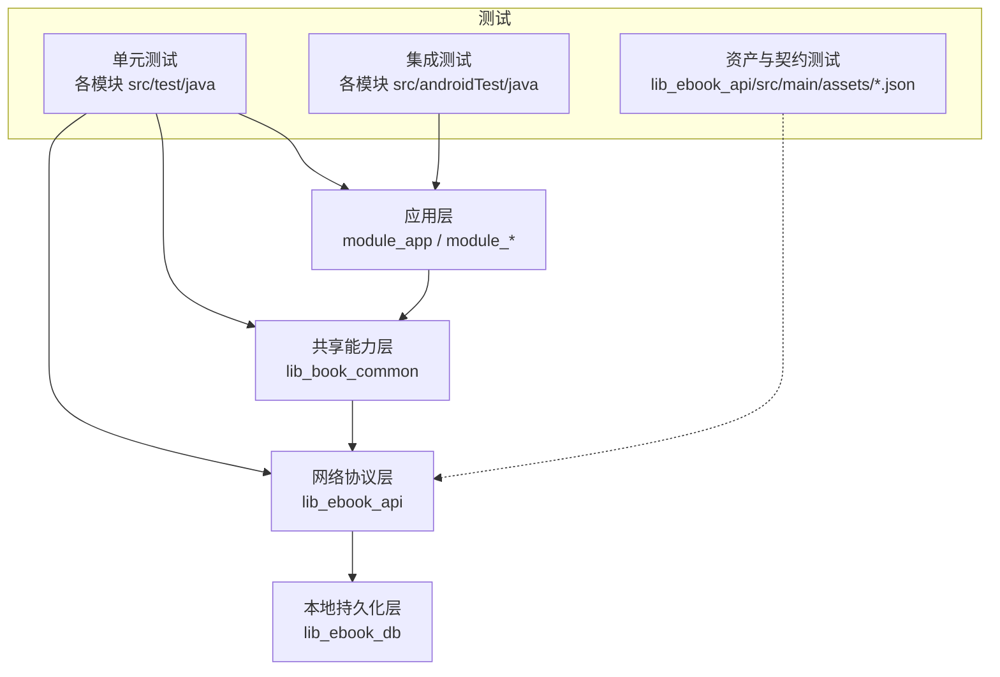
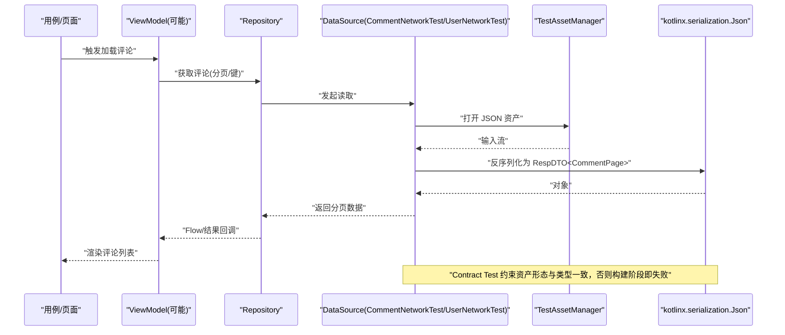
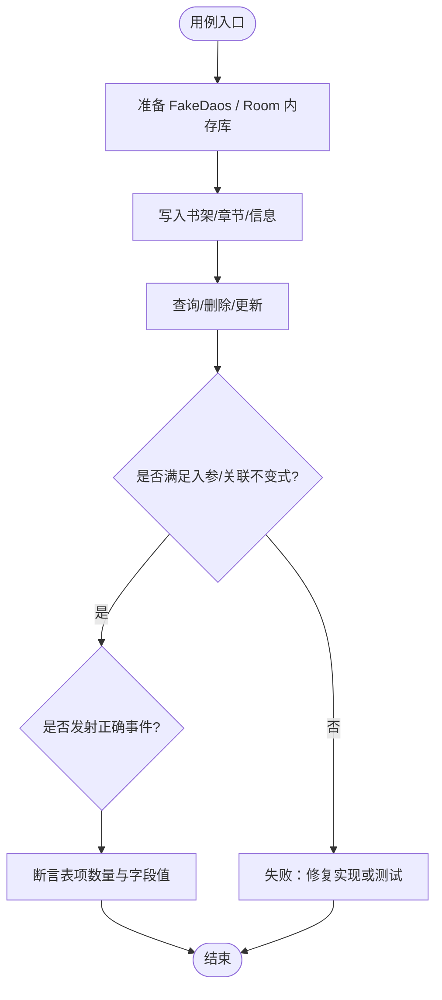
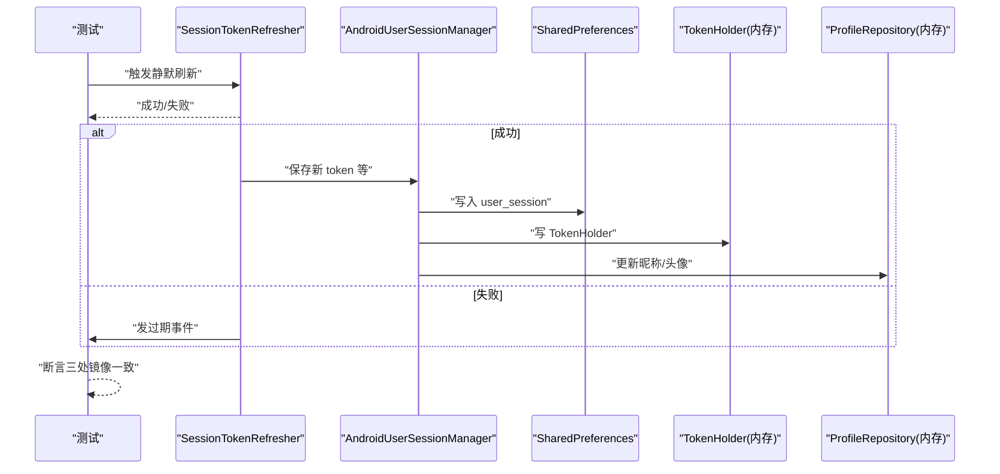
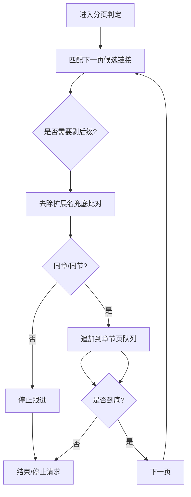
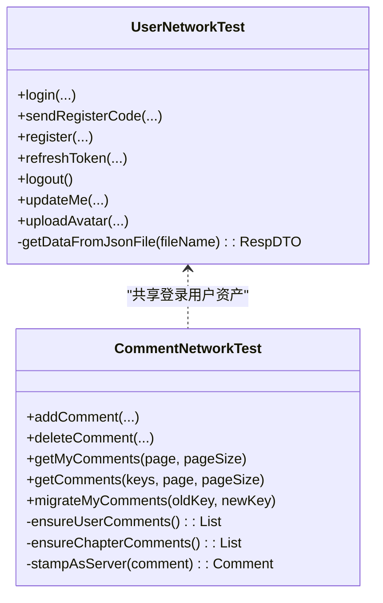
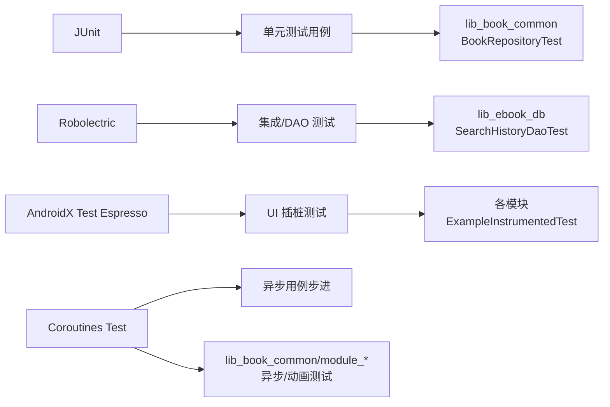

# 测试策略

<cite>
**本文引用的文件**
- [lib_book_common/src/test/java/com/ebook/common/repository/BookRepositoryTest.kt](file://lib_book_common/src/test/java/com/ebook/common/repository/BookRepositoryTest.kt)
- [lib_ebook_db/src/test/java/com/ebook/db/dao/SearchHistoryDaoTest.kt](file://lib_ebook_db/src/test/java/com/ebook/db/dao/SearchHistoryDaoTest.kt)
- [lib_book_common/src/test/java/com/ebook/common/domain/UserSessionManagerTest.kt](file://lib_book_common/src/test/java/com/ebook/common/domain/UserSessionManagerTest.kt)
- [lib_book_common/src/test/java/com/ebook/common/domain/AndroidUserSessionManagerTest.kt](file://lib_book_common/src/test/java/com/ebook/common/domain/AndroidUserSessionManagerTest.kt)
- [lib_ebook_api/src/test/java/com/ebook/api/service/comment/CommentNetworkTestTest.kt](file://lib_ebook_api/src/test/java/com/ebook/api/service/comment/CommentNetworkTestTest.kt)
- [lib_ebook_api/src/main/java/com/ebook/api/service/user/UserNetworkTest.kt](file://lib_ebook_api/src/main/java/com/ebook/api/service/user/UserNetworkTest.kt)
- [lib_ebook_api/src/main/java/com/ebook/api/service/comment/CommentNetworkTest.kt](file://lib_ebook_api/src/main/java/com/ebook/api/service/comment/CommentNetworkTest.kt)
- [module_book/src/test/java/com/ebook/book/reader/ReaderPagerControllerTest.kt](file://module_book/src/test/java/com/ebook/book/reader/ReaderPagerControllerTest.kt)
- [module_find/src/test/java/com/ebook/find/mvvm/viewmodel/BookPageMergeTest.kt](file://module_find/src/test/java/com/ebook/find/mvvm/viewmodel/BookPageMergeTest.kt)
- [lib_book_common/src/test/java/com/ebook/common/analyze/source/ListPageUrlTest.kt](file://lib_book_common/src/test/java/com/ebook/common/analyze/source/ListPageUrlTest.kt)
- [lib_book_common/src/test/java/com/ebook/common/analyze/source/ChapterPageMatcherTest.kt](file://lib_book_common/src/test/java/com/ebook/common/analyze/source/ChapterPageMatcherTest.kt)
- [docs/test-coverage-todo.md](file://docs/test-coverage-todo.md)
- [AGENTS.md](file://AGENTS.md)
- [lib_book_common/build.gradle.kts](file://lib_book_common/build.gradle.kts)
- [lib_ebook_api/build.gradle.kts](file://lib_ebook_api/build.gradle.kts)
- [module_app/build.gradle.kts](file://module_app/build.gradle.kts)
- [build-logic/convention/src/main/kotlin/com/xrn1997/convention/AndroidInstrumentedTests.kt](file://build-logic/convention/src/main/kotlin/com/xrn1997/convention/AndroidInstrumentedTests.kt)
</cite>

## 目录
1. [介绍](#介绍)
2. [项目结构与测试布局](#项目结构与测试布局)
3. [核心测试层次与覆盖现状](#核心测试层次与覆盖现状)
4. [架构总览（从用例到数据源）](#架构总览从用例到数据源)
5. [详细组件分析](#详细组件分析)
6. [依赖与关系分析](#依赖与关系分析)
7. [性能与资源使用测试方案](#性能与资源使用测试方案)
8. [故障排查指南](#故障排查指南)
9. [结论](#结论)
10. [附录](#附录)

## 介绍
本测试策略围绕 Android 电子书阅读器的多层次质量保障体系展开，聚焦以下目标：
- 建立清晰的测试分层：纯 JVM 单元测试、Robolectric + Room 的集成测试、UI 级 Compose 测试、资产契约测试。
- 规范化 JUnit 4 的组织方式、Mock 数据构造、边界条件覆盖和回归用例设计。
- 规范异步接口的 Mock 数据源与资产化管理，保证接口契约稳定、可演进。
- 明确持续集成中的覆盖率目标与报告收集、设备/模拟器执行策略。
- 制定性能与稳定性验收指标，包括内存泄漏检测、卡顿监控和资源优化验证。
- 统一管理测试数据与环境隔离，确保独立模块调试与集成构建均具备一致的 mock 行为。

本策略基于当前仓库中已有的测试实现、约定插件配置与文档进行提炼，所有技术主张均有实际代码或配置为依据。

## 项目结构与测试布局
本项目采用多模块架构，测试分布在各模块的源码树中：
- 单元测试（JUnit 4）集中于各模块 `src/test/java`，部分库模块包含 Robolectric。
- 插桩/集成测试位于各模块 `src/androidTest/java`。
- 资产文件用于 mock 网络响应，统一放置在 `lib_ebook_api/src/main/assets/`（被产品风味合并到 APK）。
- 约定插件对测试执行进行统一治理（如仅在存在 `androidTest` 时启用相关任务），避免无意义开销。

下图展示了与本策略直接相关的工程结构与测试位置关系。

图表来源
- [lib_book_common/build.gradle.kts:69-77](file://lib_book_common/build.gradle.kts#L69-L77)
- [lib_ebook_api/build.gradle.kts:67-71](file://lib_ebook_api/build.gradle.kts#L67-L71)
- [module_app/build.gradle.kts:17-26](file://module_app/build.gradle.kts#L17-L26)

章节来源
- [lib_book_common/build.gradle.kts:69-77](file://lib_book_common/build.gradle.kts#L69-L77)
- [lib_ebook_api/build.gradle.kts:67-71](file://lib_ebook_api/build.gradle.kts#L67-L71)
- [module_app/build.gradle.kts:17-26](file://module_app/build.gradle.kts#L17-L26)

## 核心测试层次与覆盖现状
- 纯 JVM 单元测试
  - Repository 层级：例如通过手写 Fake DAO 验证入库、事件总线及级联清理等复杂行为。
  - 业务规则解析：章节分页匹配、列表页 URL 生成、文本编码与归一等，全部可脱离 Android 框架运行。
  - 会话与鉴权：结合真实 SP 与内存状态机，验证 token 同步与三处镜像一致性。
- Robolectric + Room 集成测试
  - DAO 层语义回归：以内存数据库运行真实 SQL，锁定搜索历史等持久化逻辑。
- UI 控制器与状态机测试
  - 阅读器翻页窗口状态机、章节布局缓存等关键路径通过 Robolectric + 协程时钟驱动。
- 资产契约测试
  - 用 TestAssetManager 直读资产并解码为 DTO 契约类型，防止 JSON 形态与解码类型错位导致的“静默失败”。
- 产品风味 Mock 网络
  - real/mock 双风味切换；独立模块下通过 test/debug source set 自动挂载 MockNetworkModule，无需后端即可开发调试。

章节来源
- [docs/test-coverage-todo.md:5-14](file://docs/test-coverage-todo.md#L5-L14)
- [lib_ebook_db/src/test/java/com/ebook/db/dao/SearchHistoryDaoTest.kt:27-43](file://lib_ebook_db/src/test/java/com/ebook/db/dao/SearchHistoryDaoTest.kt#L27-L43)
- [module_book/src/test/java/com/ebook/book/reader/ReaderPagerControllerTest.kt](file://module_book/src/test/java/com/ebook/book/reader/ReaderPagerControllerTest.kt)
- [lib_ebook_api/src/test/java/com/ebook/api/service/comment/CommentNetworkTestTest.kt](file://lib_ebook_api/src/test/java/com/ebook/api/service/comment/CommentNetworkTestTest.kt)
- [AGENTS.md:72-90](file://AGENTS.md#L72-L90)

## 架构总览（从用例到数据源）
整体测试从顶层用例逐步注入底层数据源与基础设施：
- 用户态用例（页面/ViewModel/Service）通过 Hilt/DI 注入 Repository。
- Repository 注入 DAO、存储、解析器及事务执行器。
- 网络数据通过 DataSource 抽象接入真实或服务端 Mock；资产在 lib_ebook_api 内统一管理，并通过 Contract Test 锁死契约。

下面的序列图展示“评论查询”的端到端调用链路在 mock 环境下的行为，以及契约测试如何确保资产契约不变。

图表来源
- [lib_ebook_api/src/main/java/com/ebook/api/service/comment/CommentNetworkTest.kt:92-106](file://lib_ebook_api/src/main/java/com/ebook/api/service/comment/CommentNetworkTest.kt#L92-L106)
- [lib_ebook_api/src/main/java/com/ebook/api/service/user/UserNetworkTest.kt:30-52](file://lib_ebook_api/src/main/java/com/ebook/api/service/user/UserNetworkTest.kt#L30-L52)
- [lib_ebook_api/src/test/java/com/ebook/api/service/comment/CommentNetworkTestTest.kt](file://lib_ebook_api/src/test/java/com/ebook/api/service/comment/CommentNetworkTestTest.kt)

## 详细组件分析

### 单元测试：Repository 与 DAO
- BookRepository 单测
  - 通过手写 Fake DAO、临时文件夹隔离书章写入，验证 addToShelf/removeFromShelf 的级联写入与清理、getAllBooksWithDetails 关联查询、chapter cache 短路、bookShelfEvents 事件广播等。
  - 覆盖 M2 群组键生成与 commentKey 语义，验证跨表一致性。
- SearchHistoryDao 集成单测
  - 以 Robolectric + Room 内存库跑真实 SQL，验证按类型取全量、倒序、按类型清空、upsert 去重等关键语义。

图表来源
- [lib_book_common/src/test/java/com/ebook/common/repository/BookRepositoryTest.kt:34-100](file://lib_book_common/src/test/java/com/ebook/common/repository/BookRepositoryTest.kt#L34-L100)
- [lib_ebook_db/src/test/java/com/ebook/db/dao/SearchHistoryDaoTest.kt:19-100](file://lib_ebook_db/src/test/java/com/ebook/db/dao/SearchHistoryDaoTest.kt#L19-L100)

章节来源
- [lib_book_common/src/test/java/com/ebook/common/repository/BookRepositoryTest.kt:34-100](file://lib_book_common/src/test/java/com/ebook/common/repository/BookRepositoryTest.kt#L34-L100)
- [lib_ebook_db/src/test/java/com/ebook/db/dao/SearchHistoryDaoTest.kt:19-100](file://lib_ebook_db/src/test/java/com/ebook/db/dao/SearchHistoryDaoTest.kt#L19-L100)

### 单元测试：会话与令牌刷新
- SessionTokenRefresher 与 UserSessionManager
  - 利用协程测试工具推进后台作用域，验证 token 静默刷新、失败重放与错误分发。
- AndroidUserSessionManager 单测
  - 借助 Robolectric 提供 Application/Context，验证 SP 落盘、内存昵称头像、TokenHolder 三处镜像的一致性与清会话幂等性。

图表来源
- [lib_book_common/src/test/java/com/ebook/common/domain/SessionTokenRefresherTest.kt](file://lib_book_common/src/test/java/com/ebook/common/domain/SessionTokenRefresherTest.kt)
- [lib_book_common/src/test/java/com/ebook/common/domain/AndroidUserSessionManagerTest.kt](file://lib_book_common/src/test/java/com/ebook/common/domain/AndroidUserSessionManagerTest.kt)
- [lib_book_common/src/test/java/com/ebook/common/domain/UserSessionManagerTest.kt](file://lib_book_common/src/test/java/com/ebook/common/domain/UserSessionManagerTest.kt)

章节来源
- [docs/test-coverage-todo.md:8-14](file://docs/test-coverage-todo.md#L8-L14)

### 单元测试：正文与列表分页判定
- ChapterPageMatcher：以目录原始 URL 为基准，只对候选链接剥离一次后缀再比对，防止串章与第 1 页带后缀的误判。
- ListPageUrl / BookPageMerge：模板页码换算与首页裁剪，按 noteUrl 去重判断到底，避免“软 404 重复首页书目”导致 LazyColumn 因 key 重复抛异常。

图表来源
- [lib_book_common/src/test/java/com/ebook/common/analyze/source/ChapterPageMatcherTest.kt](file://lib_book_common/src/test/java/com/ebook/common/analyze/source/ChapterPageMatcherTest.kt)
- [lib_book_common/src/test/java/com/ebook/common/analyze/source/ListPageUrlTest.kt](file://lib_book_common/src/test/java/com/ebook/common/analyze/source/ListPageUrlTest.kt)
- [module_find/src/test/java/com/ebook/find/mvvm/viewmodel/BookPageMergeTest.kt](file://module_find/src/test/java/com/ebook/find/mvvm/viewmodel/BookPageMergeTest.kt)

章节来源
- [docs/test-coverage-todo.md:31-43](file://docs/test-coverage-todo.md#L31-L43)

### UI 测试（Compose）与控制器测试
- ReaderPagerController 状态机测试
  - 使用 Robolectric 提供 Context 与资源，不渲染 View；以虚拟帧时钟驱动 Animatable 等动画组件，验证翻向前/后窗口收敛、重试逻辑，避免翻页空转。
- 待补齐的 Compose UI 测试
  - 针对交互流程、路由跳转、状态变化断言尚未全覆盖，需在对应功能模块补齐（见测试覆盖待办）。

章节来源
- [docs/test-coverage-todo.md:23-30](file://docs/test-coverage-todo.md#L23-L30)
- [docs/test-coverage-todo.md:58-59](file://docs/test-coverage-todo.md#L58-L59)

### Mock 数据源与契约测试
- UserNetworkTest / CommentNetworkTest
  - 通过 TestAssetManager 读取 assets 中 JSON，并以 reified 类型直接解码到 RespDTO<T>，要求 JSON 形态与 DTO 保持一致。
  - CommentNetworkTest 维护“我的评论”与“章节评论”两套内存种子，模拟服务端状态（增删分页聚合），并将新增评论按服务端风格打上 id/作者/时间，保持门禁与排序有效。
- 契约测试
  - CommentNetworkTestTest 以文件版 TestAssetManager 直读资产，校验：RespDTO 包裹结构、两份评论资产的 chapter_url 交叉对齐、新增评论由 mock 赋值字段以避免列表 key 冲突。

图表来源
- [lib_ebook_api/src/main/java/com/ebook/api/service/user/UserNetworkTest.kt:24-94](file://lib_ebook_api/src/main/java/com/ebook/api/service/user/UserNetworkTest.kt#L24-L94)
- [lib_ebook_api/src/main/java/com/ebook/api/service/comment/CommentNetworkTest.kt:44-195](file://lib_ebook_api/src/main/java/com/ebook/api/service/comment/CommentNetworkTest.kt#L44-L195)
- [lib_ebook_api/src/test/java/com/ebook/api/service/comment/CommentNetworkTestTest.kt](file://lib_ebook_api/src/test/java/com/ebook/api/service/comment/CommentNetworkTestTest.kt)

章节来源
- [AGENTS.md:72-90](file://AGENTS.md#L72-L90)
- [docs/test-coverage-todo.md:15-22](file://docs/test-coverage-todo.md#L15-L22)
- [lib_ebook_api/src/main/java/com/ebook/api/service/comment/CommentNetworkTest.kt:21-43](file://lib_ebook_api/src/main/java/com/ebook/api/service/comment/CommentNetworkTest.kt#L21-L43)

## 依赖与关系分析
测试依赖主要集中在三类：
- 基础框架与运行期：JUnit 4、AndroidX Test（Espresso/JUnit runner）、Robolectric（部分库模块）。
- 协程与测试辅助：kotlinx-coroutines-test，用于前台/后台作用域步进与协程测试。
- 契约与资产管理：kotlinx.serialization.json、TestAssetManager，确保 JSON 资产与解码类型严格一致。

下图展示测试依赖分布的关键模块与其用途。

图表来源
- [lib_book_common/build.gradle.kts:69-77](file://lib_book_common/build.gradle.kts#L69-L77)
- [lib_ebook_db/build.gradle.kts:45-51](file://lib_ebook_db/build.gradle.kts#L45-L51)
- [module_app/build.gradle.kts:60-62](file://module_app/build.gradle.kts#L60-L62)

章节来源
- [lib_book_common/build.gradle.kts:69-77](file://lib_book_common/build.gradle.kts#L69-L77)
- [lib_ebook_db/build.gradle.kts:45-51](file://lib_ebook_db/build.gradle.kts#L45-L51)
- [lib_ebook_api/build.gradle.kts:67-71](file://lib_ebook_api/build.gradle.kts#L67-L71)
- [module_app/build.gradle.kts:60-62](file://module_app/build.gradle.kts#L60-L62)
- [build-logic/convention/src/main/kotlin/com/xrn1997/convention/AndroidInstrumentedTests.kt:22-35](file://build-logic/convention/src/main/kotlin/com/xrn1997/convention/AndroidInstrumentedTests.kt#L22-L35)

## 性能与资源使用测试方案
- 单元测试（纯 JVM）
  - 关注算法复杂度与内存占用（例如大列表合并、正则匹配），可通过分配/回收与基准对比验证增长曲线。
- Robolectric/Room 集成测试
  - 使用内存库验证 SQL 语义而非耗时压测；对慢查询可通过 EXPLAIN/日志定位。
- UI/设备测试
  - 使用 Espresso/UI Automator 做关键页面的交互基线检查，并结合性能快照（CPU/GC/ANR 日志）验证流畅性。
- 内存泄漏检测
  - 在 UI 路径中加入 LeakCanary（若未引入需评估成本），或在 CI 中定期执行 dump/hprof 分析。
- 卡顿监控
  - 记录掉帧率与主线程阻塞时间，必要时结合 Perflib/Profiler 追踪热点。

此部分为通用指导，适用于上述各层测试场景。

## 故障排查指南
- “mock 构建下页面永远加载不出来”
  - 可能原因：资产形态与解码类型不一致，被 CoroutineAdapter 吞错。应优先检查 CommentNetworkTestTest 类与对应 JSON 的 RespDTO<T> 契约。
- “评论页为空/本人可删门限失效”
  - 检查 CommentNetworkTest 中“我的评论”和“章节评论”资产的 comment_key 对齐、user_login.json 的用户名字段一致性、新增评论是否被 stampAsServer 修正。
- “下载/重试无限循环”
  - 遵循“失败耗尽必须出队、暂停不出队”的约束，确认 DownloadService/downloading 逻辑未被修改破坏；测试覆盖待补齐。
- “独立运行路由无效”
  - TheRouter routeMap 需要重新构建才生效；新增/改动 @Route 后需再次构建以确保路由表变更。

章节来源
- [docs/test-coverage-todo.md:15-22](file://docs/test-coverage-todo.md#L15-L22)
- [docs/test-coverage-todo.md:53-57](file://docs/test-coverage-todo.md#L53-L57)
- [AGENTS.md:88-90](file://AGENTS.md#L88-L90)

## 结论
本项目已建立较为完善的分层测试体系：
- 核心解析逻辑、Repository 行为与 DAO 语义均已有针对性单测/集成测试，有效防止回归。
- 通过资产契约测试与统一 Mock 数据源，确保接口演进过程中的 JSON 契约稳定可验。
- 下一步重点补齐 Compose UI 自动化测试、下载队列失败重试的自动化验证，以及在 CI 中固化覆盖率目标与报告产出。

## 附录
- 测试命令参考
  - 单测：./gradlew test
  - 指定模块单测：./gradlew :module_book:testDebugUnitTest
  - 插桩测试：./gradlew connectedAndroidTest
  - Lint：./gradlew lint

章节来源
- [AGENTS.md:1-30](file://AGENTS.md#L1-L30)