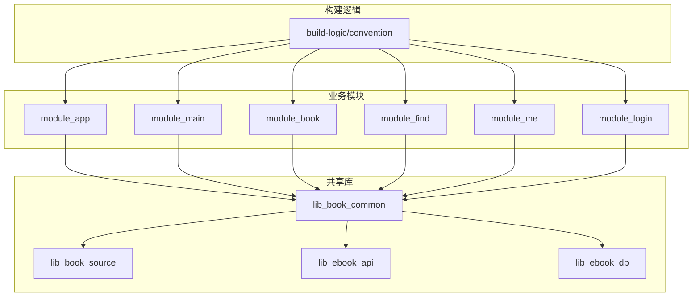
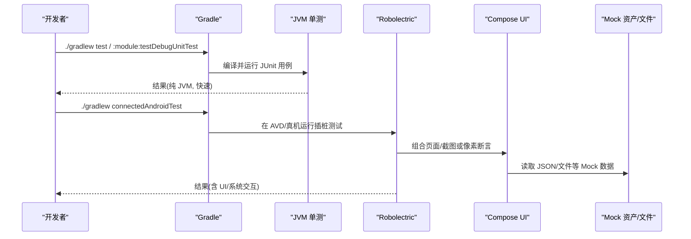
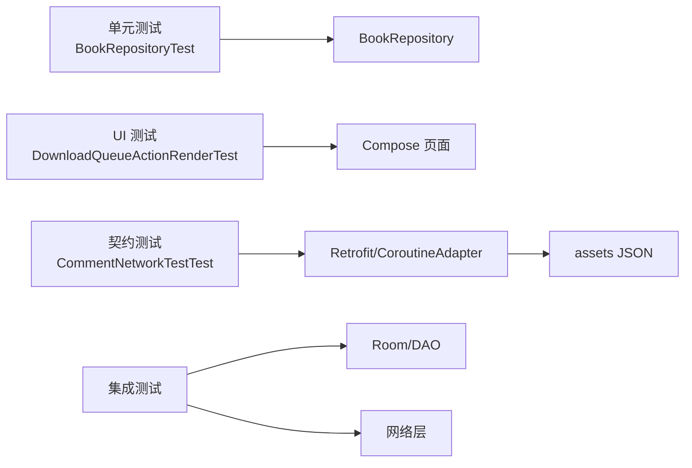

# 测试策略

<cite>
**本文引用的文件**
- [README.MD](file://README.MD)
- [AGENTS.md](file://AGENTS.md)
- [test-coverage-todo.md](file://docs/test-coverage-todo.md)
- [AndroidInstrumentedTests.kt](file://build-logic/convention/src/main/kotlin/com/xrn1997/convention/AndroidInstrumentedTests.kt)
- [BookRepositoryTest.kt](file://lib_book_common/src/test/java/com/ebook/common/repository/BookRepositoryTest.kt)
- [CommentNetworkTestTest.kt](file://lib_ebook_api/src/test/java/com/ebook/api/service/comment/CommentNetworkTestTest.kt)
- [DownloadQueueActionRenderTest.kt](file://module_book/src/test/java/com/ebook/book/page/DownloadQueueActionRenderTest.kt)
</cite>

## 目录
1. [简介](#简介)
2. [项目结构](#项目结构)
3. [核心组件](#核心组件)
4. [架构总览](#架构总览)
5. [详细组件分析](#详细组件分析)
6. [依赖分析](#依赖分析)
7. [性能考虑](#性能考虑)
8. [故障排查指南](#故障排查指南)
9. [结论](#结论)
10. [附录](#附录)

## 简介
本测试策略面向该 Android 小说阅读器项目的多模块架构，覆盖单元测试、集成测试、UI 测试、性能测试与持续集成的实践。目标是让不同背景的开发者都能理解并落地“可维护、可回归、可度量”的测试体系：以纯 JVM 单测优先，配合 Robolectric 与 Compose UI 像素级断言；以 mock/内存数据源替代网络与数据库；用约定插件统一插桩测试开关；通过覆盖率清单与自动化流程形成质量门禁。

## 项目结构
仓库采用多模块（功能模块 + 共享库）+ Hilt/MVVM + Compose 的架构。测试代码按模块隔离：
- 单元测试位于各模块的 src/test/java
- 插桩测试位于 src/androidTest/java
- 构建逻辑集中在 build-logic/convention，统一配置测试相关行为

图表来源
- [README.MD:86-104](file://README.MD#L86-L104)
- [AGENTS.md:多模块架构段](file://AGENTS.md)

章节来源
- [README.MD:86-104](file://README.MD#L86-L104)
- [AGENTS.md:常用命令段](file://AGENTS.md)

## 核心组件
- 测试框架与工具链
  - 单元测试：JUnit 4 + Kotlin Coroutines Test（runTest、runCurrent）
  - 设备模拟：Robolectric（@GraphicsMode(NATIVE)、createAndroidComposeRule）
  - Compose UI 测试：基于 Robolectric 的软件渲染与像素断言
  - 网络与数据：内存/文件系统替身（如 TestAssetManager）、假 DAO/Repository
- 约定插件
  - 无 androidTest 时自动禁用插桩任务，避免空跑
- 覆盖率待办与基线
  - docs/test-coverage-todo.md 维护覆盖率缺口与人工验证清单

章节来源
- [AGENTS.md:测试约定段](file://AGENTS.md)
- [AndroidInstrumentedTests.kt:22-35](file://build-logic/convention/src/main/kotlin/com/xrn1997/convention/AndroidInstrumentedTests.kt#L22-L35)
- [test-coverage-todo.md:全文](file://docs/test-coverage-todo.md)

## 架构总览
测试分层与执行路径如下：

图表来源
- [AGENTS.md:常用命令段](file://AGENTS.md)
- [test-coverage-todo.md:Compose UI 测试段落](file://docs/test-coverage-todo.md)

## 详细组件分析

### 单元测试规范与组织
- 命名与位置
  - 类名遵循 <Subject>Test，位于对应模块 src/test/java
  - 测试方法使用反引号包裹的句子式描述，便于阅读与定位
- 结构与依赖
  - 优先纯 JVM 测试，避免 Android 框架依赖；必要时用 Robolectric
  - 对 Repository/DAO 使用手写 Fake 实现，隔离 IO、网络与数据库
- 示例要点
  - BookRepositoryTest 直接构造 Repository，注入 Fake DAO、ChapterReader、TransactionRunner，覆盖书架事件、级联写入、合并补章、内容仓库对账等复杂分支
  - 使用 runTest/runCurrent 推进协程，避免后台作用域导致的竞态

章节来源
- [AGENTS.md:测试约定段](file://AGENTS.md)
- [BookRepositoryTest.kt:35-82](file://lib_book_common/src/test/java/com/ebook/common/repository/BookRepositoryTest.kt#L35-L82)

### Mock 对象与数据源
- 资产契约测试
  - 通过 TestAssetManager 直读 src/main/assets 下的 JSON，锁死“资产形态 ↔ 解码类型”的一致性
  - CommentNetworkTestTest 同时校验分页包裹、字段对齐、身份回显等契约
- 假件模式
  - Fake DAO、Fake ChapterReader、Fake TransactionRunner 等用于隔离外部依赖
  - 对写接口采用内存/文件临时目录隔离，保证用例幂等与并行安全

章节来源
- [CommentNetworkTestTest.kt:16-45](file://lib_ebook_api/src/test/java/com/ebook/api/service/comment/CommentNetworkTestTest.kt#L16-L45)
- [BookRepositoryTest.kt:53-82](file://lib_book_common/src/test/java/com/ebook/common/repository/BookRepositoryTest.kt#L53-L82)

### 集成测试方案
- 数据库集成
  - 使用真实 SQL 引擎（BundledSQLiteDriver 的 JVM 变体）执行迁移与查询，确保迁移与建表语句一致
- 网络请求集成
  - 借助 assets 中的 JSON 模拟服务端响应，结合 Retrofit/CoroutineAdapter 走生产解析路径，捕获序列化异常
- 组件间集成
  - ViewModel → Repository → DAO/Cache 的串联测试，利用 runTest 控制调度器，避免时序问题

章节来源
- [test-coverage-todo.md:Room 迁移与注释段](file://docs/test-coverage-todo.md)
- [CommentNetworkTestTest.kt:58-100](file://lib_ebook_api/src/test/java/com/ebook/api/service/comment/CommentNetworkTestTest.kt#L58-L100)

### UI 测试策略（Compose）
- 目标
  - 锁定“渲染正确性”，尤其针对被容器裁剪的 UI 元素（如角标溢出）
- 方法
  - 使用 Robolectric @GraphicsMode(NATIVE) + createAndroidComposeRule
  - 将 decorView 绘制到 Bitmap，统计探针色像素数量与边界，判断是否被 clip 切掉
  - 不依赖 captureToImage（在 paused looper 下会超时）
- 示例
  - DownloadQueueActionRenderTest 验证下载角标在不同剩余数下完整可见，包括边长、圆角收口、数字像素量等

章节来源
- [DownloadQueueActionRenderTest.kt:28-45](file://module_book/src/test/java/com/ebook/book/page/DownloadQueueActionRenderTest.kt#L28-L45)
- [DownloadQueueActionRenderTest.kt:65-121](file://module_book/src/test/java/com/ebook/book/page/DownloadQueueActionRenderTest.kt#L65-L121)

### 性能测试方法
- 内存泄漏检测
  - 通过 Compose 像素断言与日志观察，避免长时间运行的异步任务泄漏
  - 结合设备侧工具（logcat）验证进程稳定性
- 启动时间测试
  - 通过独立调试宿主与 mock 数据源，快速评估冷启动链路
- 渲染性能测试
  - 滚屏模式下块高取排版实测值，避免布局抖动；通过滚动落点与锚点行为验证性能与一致性

章节来源
- [test-coverage-todo.md:滚屏模式与渲染段落](file://docs/test-coverage-todo.md)

### 覆盖率要求与统计
- 覆盖率待办清单
  - 由 docs/test-coverage-todo.md 维护，明确已覆盖与未覆盖项，包含 VM 接线、下载队列语义、Compose 页面等
- 统计方法
  - 建议使用 AGP/Kover 或 JaCoCo 生成行/分支/函数覆盖率报告；在 CI 中设置阈值（例如行覆盖率≥80%，分支覆盖率≥70%）作为质量门禁
- 现状与建议
  - 当前仓库以“用例覆盖关键路径”为主；建议逐步补齐覆盖率指标，并以“契约测试 + 回归测试”双保险提升置信度

章节来源
- [test-coverage-todo.md:全文](file://docs/test-coverage-todo.md)

### 持续集成中的测试执行
- 本地与 CI 命令
  - 单元测试：./gradlew test
  - 模块单测：./gradlew :module_xxx:testDebugUnitTest
  - 插桩测试：./gradlew connectedAndroidTest
- 约定插件优化
  - 无 androidTest 时自动禁用插桩任务，减少无效执行
- 质量门禁建议
  - 在 CI 中依次执行 lint → unit test → connectedAndroidTest（仅含 androidTest 的模块）
  - 产出测试报告与覆盖率，失败即阻断合并

章节来源
- [AGENTS.md:常用命令段](file://AGENTS.md)
- [AndroidInstrumentedTests.kt:22-35](file://build-logic/convention/src/main/kotlin/com/xrn1997/convention/AndroidInstrumentedTests.kt#L22-L35)

## 依赖分析
测试层对生产层的依赖关系如下：

图表来源
- [BookRepositoryTest.kt:35-82](file://lib_book_common/src/test/java/com/ebook/common/repository/BookRepositoryTest.kt#L35-L82)
- [CommentNetworkTestTest.kt:16-45](file://lib_ebook_api/src/test/java/com/ebook/api/service/comment/CommentNetworkTestTest.kt#L16-L45)
- [DownloadQueueActionRenderTest.kt:28-45](file://module_book/src/test/java/com/ebook/book/page/DownloadQueueActionRenderTest.kt#L28-L45)

章节来源
- [BookRepositoryTest.kt:35-82](file://lib_book_common/src/test/java/com/ebook/common/repository/BookRepositoryTest.kt#L35-L82)
- [CommentNetworkTestTest.kt:16-45](file://lib_ebook_api/src/test/java/com/ebook/api/service/comment/CommentNetworkTestTest.kt#L16-L45)
- [DownloadQueueActionRenderTest.kt:28-45](file://module_book/src/test/java/com/ebook/book/page/DownloadQueueActionRenderTest.kt#L28-L45)

## 性能考虑
- 测试执行效率
  - 优先纯 JVM 单测，缩短反馈周期
  - 对需要 UI/系统的场景使用 Robolectric，避免真实设备耗时
- 资源与并发
  - 用例使用临时目录隔离，避免交叉污染
  - 合理使用 runTest/runCurrent 控制协程调度，避免后台任务泄漏
- 渲染与交互
  - 像素断言只关注必要区域，减少大图扫描开销
  - 对频繁滚动的场景，确保 key 稳定且唯一，避免重排

[本节为通用指导，无需特定文件引用]

## 故障排查指南
- 常见问题
  - 协程泄漏导致偶发失败：检查 withContext(Dispatchers.IO) 是否在测试结束时仍在执行；必要时注入可替换 IO 派发器或在 @After 取消作用域
  - 资产形态不一致：使用契约测试直读 assets 并断言数据结构，防止静默失败
  - UI 被裁剪：采用像素断言验证边缘与圆角，而非仅看 bounds
- 处理步骤
  - 缩小范围：先复现最小用例，确认是单测、UI 还是集成问题
  - 查看日志：logcat 抓取崩溃栈与网络错误
  - 对照清单：参考 docs/test-coverage-todo.md 的人工验证项逐项核对

章节来源
- [test-coverage-todo.md:全量待办与人工验证段](file://docs/test-coverage-todo.md)

## 结论
本项目已形成以纯 JVM 单测为核心、Robolectric + Compose 像素断言为补充、契约测试保障资产一致性的测试体系。通过约定插件与覆盖率清单，既能快速迭代，又能守住质量底线。建议后续逐步完善覆盖率指标、补齐 UI 与 VM 接线测试，并将关键路径纳入 CI 质量门禁。

[本节为总结，无需特定文件引用]

## 附录
- 最佳实践清单
  - 单元测试：优先纯 JVM，Fake 隔离外部依赖，runTest 控制协程
  - 集成测试：assets JSON 契约测试，真实 SQL 验证迁移
  - UI 测试：Robolectric @GraphicsMode(NATIVE)，像素断言防裁剪
  - 性能测试：关注内存泄漏、启动时间与渲染抖动
  - 覆盖率：行/分支/函数覆盖率设定阈值，CI 中强制
  - Mock：内存/文件替身，临时目录隔离，写接口合成响应
  - CI：lint → 单测 → 插桩，报告归档，失败阻断

[本节为通用指导，无需特定文件引用]