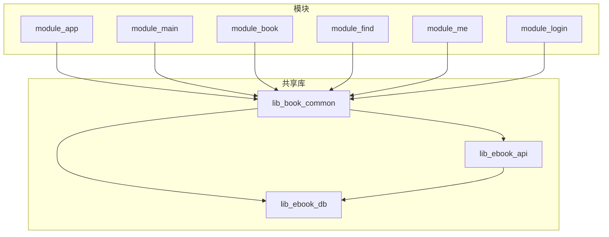
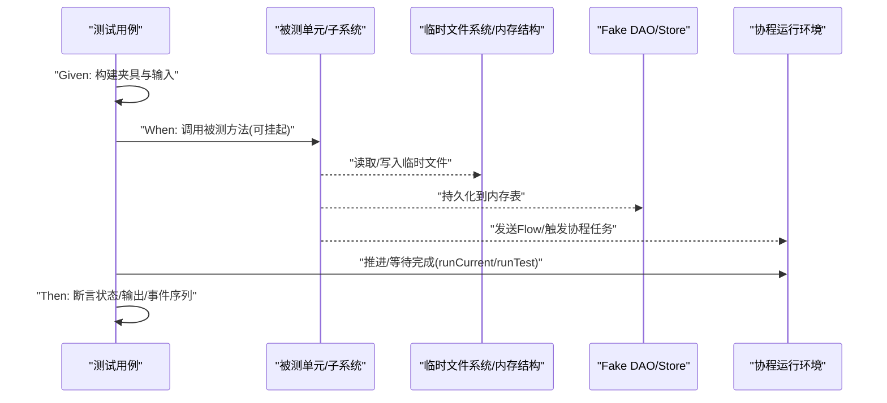
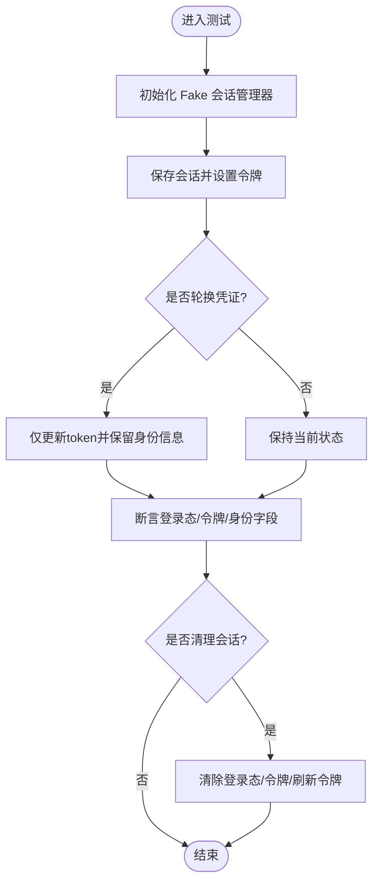
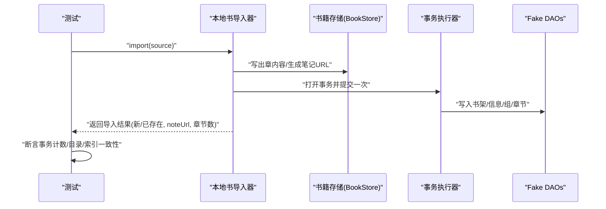
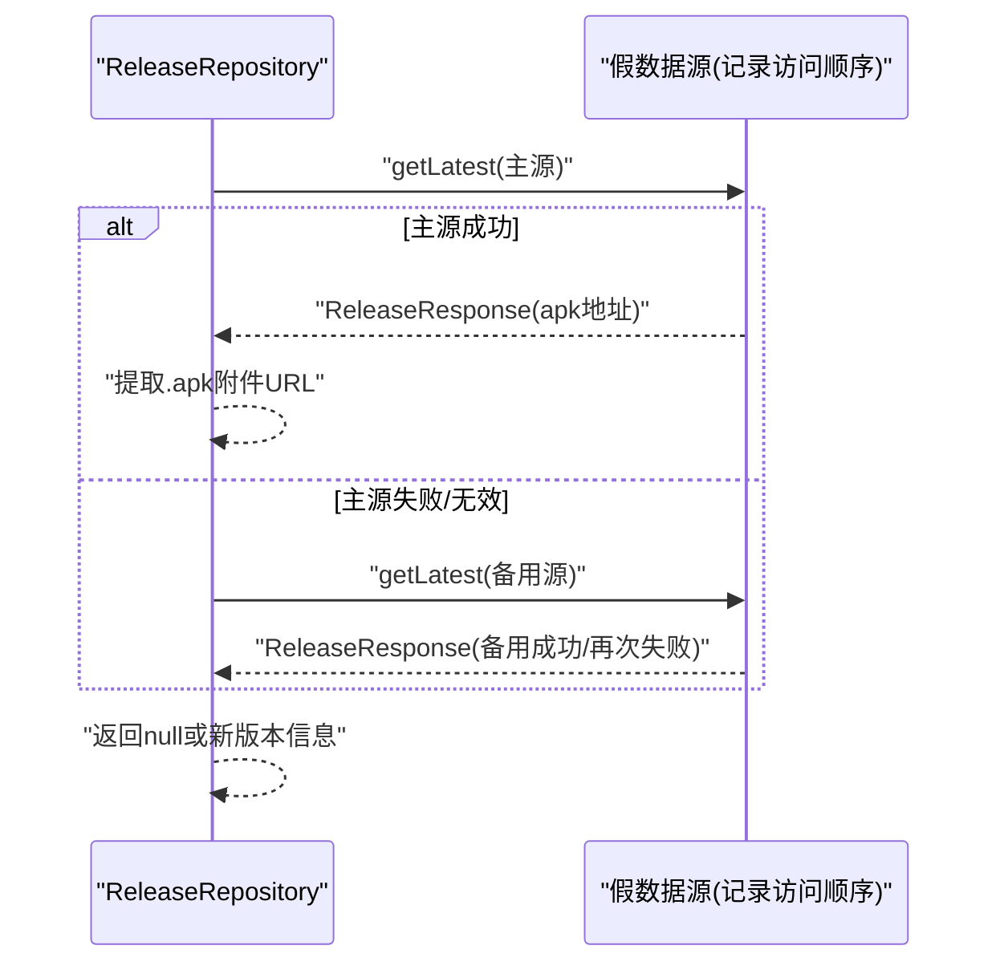
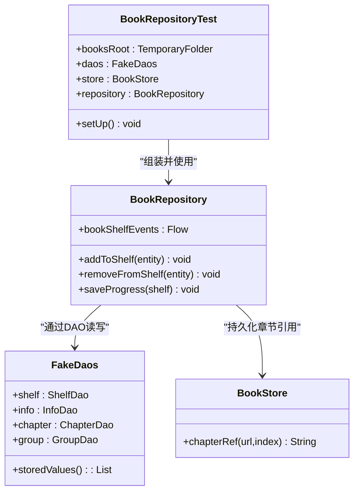

# 测试规范和最佳实践

<cite>
**本文引用的文件**   
- [UserSessionManagerTest.kt](file://lib_book_common/src/test/java/com/ebook/common/domain/UserSessionManagerTest.kt)
- [FakeUserSessionManager.kt](file://lib_book_common/src/test/java/com/ebook/common/domain/FakeUserSessionManager.kt)
- [LocalBookImporterTest.kt](file://lib_book_common/src/test/java/com/ebook/common/importer/LocalBookImporterTest.kt)
- [IsOwnCommentTest.kt](file://module_book/src/test/java/com/ebook/book/mvvm/viewmodel/IsOwnCommentTest.kt)
- [ReleaseRepositoryTest.kt](file://module_me/src/test/java/com/ebook/me/repository/ReleaseRepositoryTest.kt)
- [MockNetworkModule.kt](file://module_book/src/main/test/debug/MockNetworkModule.kt)
- [test-coverage-todo.md](file://docs/test-coverage-todo.md)
- [AndroidInstrumentedTests.kt](file://build-logic/convention/src/main/kotlin/com/xrn1997/convention/AndroidInstrumentedTests.kt)
</cite>

## 目录
1. [介绍](#介绍)
2. [项目结构](#项目结构)
3. [核心组件](#核心组件)
4. [架构概览](#架构概览)
5. [详细组件分析](#详细组件分析)
6. [依赖关系分析](#依赖关系分析)
7. [性能考虑](#性能考虑)
8. [故障排查指南](#故障排查指南)
9. [结论](#结论)

## 介绍
本规范面向 Android 电子书阅读器工程的多模块架构，统一约定单元测试、插桩测试与协程测试的编码方式、命名规范、用例组织与隔离策略，并以行为驱动开发（Given-When-Then）思想贯穿用例表达。文档覆盖异步测试、覆盖率目标与质量门禁、可维护性设计、代码审查视角与常见问题修复建议。读者可在不深入源码的前提下，快速掌握如何在项目中产出高质量且易维护的测试。

## 项目结构
仓库采用多模块构建：功能模块通过共享库聚合领域能力与 UI 复用；测试以 JUnit 4 为主，位于各模块的 `src/test/java`；需要 Android 框架能力的测试放在 `src/androidTest/java`。测试资源遵循“按被测主题组织”的策略，常见于对应模块的 test/source set，如业务逻辑在 module_* 下，通用解析与工具在 lib_book_common/test 中，数据库层在 lib_ebook_db/test 中。

本仓库约定：
- 单元测试使用 JUnit 4，置于 `src/test/java`。
- 插桩测试使用 Instrumentation，置于 `src/androidTest/java`。
- 独立模块调试时通过 source set 的 mock 网络模块替换真实网络实现，无需后端即可运行。

章节来源
- [AndroidInstrumentedTests.kt:22-35](file://build-logic/convention/src/main/kotlin/com/xrn1997/convention/AndroidInstrumentedTests.kt#L22-L35)
- [AGENTS.md](file://agents.md)

## 核心组件
围绕本项目已有的测试样例，提炼以下可复用的模式：

- 命名规范
  - 测试类名：`<被测主体>Test`，例如 `UserSessionManagerTest`、`LocalBookImporterTest`、`ReleaseRepositoryTest`。
  - 测试方法名：反引号包裹的描述式命名，语义清晰可读，例如 ``initial state should be logged out``、``import writes one transaction and chapter files match content_ref``。
  - 断言风格：统一使用 `Assert.assertEquals/assertThrows` 等断言族。

- 组织结构
  - 测试按主题分文件：会话管理、导入链路、分页合并、视图模型门控等。
  - 跨层集成测试通过临时目录 + Fake DAO + 立即执行的事务接缝实现纯 JVM 测试，避免依赖 Robolectric。
  - 独立模块调试用 `@Module` Mock 绑定注入到 Hilt 容器，屏蔽网络对外部依赖。

- 生命周期与隔离
  - 测试初始化：使用 `@Before setup()` 或工厂方法构造被测对象与数据。
  - 资源隔离：基于 `TemporaryFolder` 的临时根目录与内存数据结构保证用例间互不干扰。
  - 状态重置：针对协程 Flow、存储键、内存态提供显式 `reset` 或重建机制。

- 行为驱动表达
  - Given（准备场景）、When（触发行为）、Then（验证结果）体现在单个测试方法的三段结构中，辅以 KDoc 解释边界条件和设计取舍。

章节来源
- [UserSessionManagerTest.kt:12-160](file://lib_book_common/src/test/java/com/ebook/common/domain/UserSessionManagerTest.kt#L12-L160)
- [LocalBookImporterTest.kt:34-200](file://lib_book_common/src/test/java/com/ebook/common/importer/LocalBookImporterTest.kt#L34-L200)
- [ReleaseRepositoryTest.kt:25-184](file://module_me/src/test/java/com/ebook/me/repository/ReleaseRepositoryTest.kt#L25-L184)

## 架构概览
下图展示测试在不同层级对系统的关注点与协作方式：单元测试聚焦无外部依赖的核心逻辑；集成测试借助临时文件系统与 Fake DAO 校验端到端不变式；协程 Flow 与取消语义由测试协程调度器精确控制。

## 详细组件分析

### 用户会话管理测试模式（UserSessionManagerTest）
该测试集中演示了：
- 会话初始化状态、登录保存、清退与会话轮换的完整生命周期。
- TokenHolder 同步与空 token 归一化的边界条件。
- 未登录或占位 ID（0/Less than 0）的门控逻辑。
- 采用 `runTest` 包裹协程测试用例，断言 StateFlow 变化与事务计数。

章节来源
- [UserSessionManagerTest.kt:12-160](file://lib_book_common/src/test/java/com/ebook/common/domain/UserSessionManagerTest.kt#L12-L160)

### 本地书导入端到端测试（LocalBookImporterTest）
该测试展示了“重不变式”的锁定策略：
- 单次导入只提交一个事务（防重复写入）。
- 源文件只读一遍（防止冗余 IO）。
- 重复导入命中短路（不再解析、不再写盘）。
- 章文件落盘路径与索引 `content_ref` 一致（定位符与目录名一致性）。
- 失败回滚：异常时不留半成品目录，也不污染数据库行。

章节来源
- [LocalBookImporterTest.kt:34-200](file://lib_book_common/src/test/java/com/ebook/common/importer/LocalBookImporterTest.kt#L34-L200)

### 视图模型门控测试（IsOwnCommentTest）
体现“纯函数”门控的可测试性：
- 仅根据评论与当前用户的 userId 判断可删除性。
- 覆盖未登录、占位 ID、负数 ID 等边界情况。
- 断言明确：相等且大于 0 才判定为本人，其他全部为非本人。

章节来源
- [IsOwnCommentTest.kt:7-56](file://module_book/src/test/java/com/ebook/book/mvvm/viewmodel/IsOwnCommentTest.kt#L7-L56)

### 发布检查仓库测试（ReleaseRepositoryTest）
说明失败重试与优先级的契约：
- 主源成功即返回，不再请求备用源。
- 主源失败（IO/序列化/标签无效）自动降级到备用源。
- 全量失败返回 null，提示检查失败。
- 取消必须原样抛出，不被吞并后续重试。

章节来源
- [ReleaseRepositoryTest.kt:25-184](file://module_me/src/test/java/com/ebook/me/repository/ReleaseRepositoryTest.kt#L25-L184)

### 独立模块调试与 Mock（MockNetworkModule）
- 当独立运行（`isModule=true`）时，测试/调试宿主通过 Hilt Module 将数据源绑定到内存 Mock 实现，屏蔽远程后端。
- 这确保模块级 UI 测试无需服务，提升迭代效率。

章节来源
- [MockNetworkModule.kt:12-27](file://module_book/src/main/test/debug/MockNetworkModule.kt#L12-L27)

### 测试用例组织与生命周期管理
- 初始化：推荐在 `@Before` 中创建最小化的测试依赖，或封装工厂方法统一构建被测体与辅助对象。
- 隔离：利用 `TemporaryFolder`、内存 List/Map、以及不可变输入，确保测试并行稳定。
- 清理：对全局态（如 Flow、缓存、统计计数器）在 `reset` 或在每个用例后重置，避免污染。
- 断言：断言既包含最终结果也包含副作用（例如事务计数、集合大小、文件是否存在），增强回归保护。

章节来源
- [LocalBookImporterTest.kt:46-83](file://lib_book_common/src/test/java/com/ebook/common/importer/LocalBookImporterTest.kt#L46-L83)
- [UserSessionManagerTest.kt:12-31](file://lib_book_common/src/test/java/com/ebook/common/domain/UserSessionManagerTest.kt#L12-L31)

## 依赖关系分析
测试与被测对象的依赖通常通过依赖注入或参数传递解耦。下面以一个典型 Repository 层测试为例，展示 Fake DAO、存储和事务执行器的组装关系。

章节来源
- [LocalBookImporterTest.kt:46-83](file://lib_book_common/src/test/java/com/ebook/common/importer/LocalBookImporterTest.kt#L46-L83)
- [UserSessionManagerTest.kt:12-160](file://lib_book_common/src/test/java/com/ebook/common/domain/UserSessionManagerTest.kt#L12-L160)

## 性能考虑
- 优先选择纯 JVM 的单元/集成测试，减少设备依赖，提高执行速度。
- 合理使用协程测试 API：
  - `runTest` 提供确定性时间推进；配合 `runCurrent()` 让订阅者先完成订阅，避免错过事件。
  - 对于涉及动画/帧更新的控制器（如阅读器翻页），在测试内使用虚拟时钟推进。
- 避免过度 I/O：临时目录最小化读写，尽量用内存结构验证非持久化分支。
- 批量断言：在一个测试中对多个相关不变式进行断言，减少用例爆炸。

[本节为一般性指导，无需文件来源]

## 故障排查指南
常见测试问题与处理建议：
- 协程取消被吞掉：确保取消异常原样抛出（参考发布检查仓库测试中的取消分支断言）。
- Flow 漏事件：在启动事件监听前先 `runCurrent()` 让订阅完成，再触发操作并推进时间。
- 并发/时序不稳定：固定背景作用域或使用 `runTest` 的控制流；必要时注入“假时钟”或“假数据源”。
- 临时文件污染：每个用例使用独立的 `TemporaryFolder` 根路径，避免交叉影响。
- Mock 数据源与资产不一致：接口形参/返回值变化时需同步更新测试与资产，否则会出现“能构建但页面永远加载不出来”的隐形问题。

章节来源
- [ReleaseRepositoryTest.kt:160-184](file://module_me/src/test/java/com/ebook/me/repository/ReleaseRepositoryTest.kt#L160-L184)
- [AGENTS.md](file://agents.md)

## 覆盖率与质量门禁
- 覆盖率目标与清单
  - 项目提供了明确的测试覆盖待办清单，用于跟踪关键模块与关键行为的自动化覆盖进展。
  - 已有覆盖包括书架仓储、会话管理、列表页合并、章节匹配、导入链路等。
- 插桩测试启用策略
  - 在无 `androidTest` 目录的模块禁用插桩测试，避免无意义执行。
- 建议的质量门禁（逐步落地）
  - 新增/变更行为必须同步更新测试，保持测试与实现一致。
  - 对复杂或易错分支（如 failover、取消、边值）编写专门的回归测试。
  - UI 测试与插桩测试逐步补充，作为行为契约的稳定网。

章节来源
- [test-coverage-todo.md:1-100](file://docs/test-coverage-todo.md#L1-L100)
- [AndroidInstrumentedTests.kt:22-35](file://build-logic/convention/src/main/kotlin/com/xrn1997/convention/AndroidInstrumentedTests.kt#L22-L35)

## 结论
本项目已形成较为成熟的测试体系：统一的命名与断言风格、清晰的 Given-When-Then 结构、针对关键不变式的端到端锁定、严格的协程测试与隔离策略，以及按需启用的插桩测试机制。建议在后续迭代中持续完善 UI 测试与覆盖率门槛，将“行为变更必更测试”的流程常态化，从而保障多模块重构与扩展时的回归稳定性。