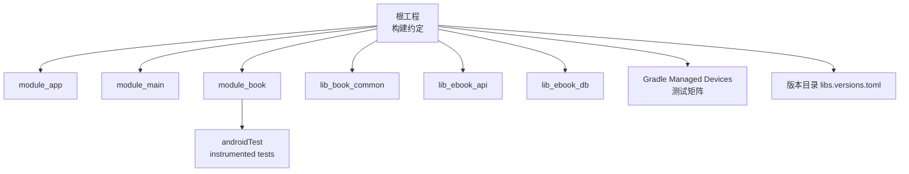
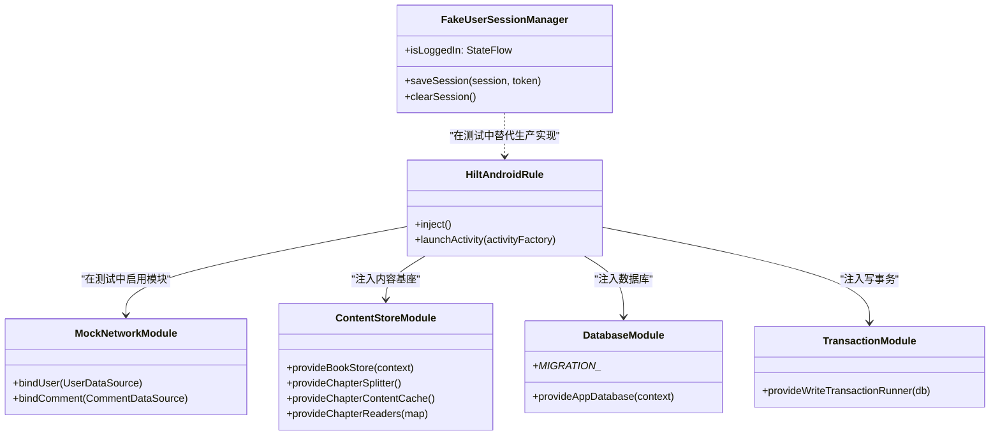
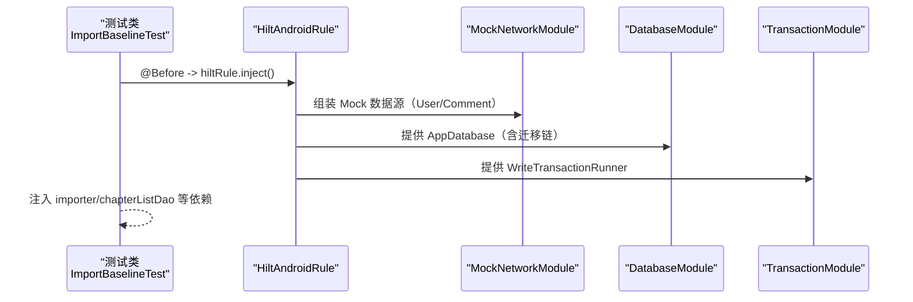
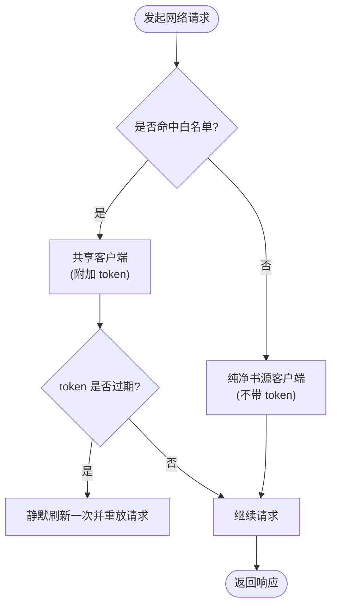
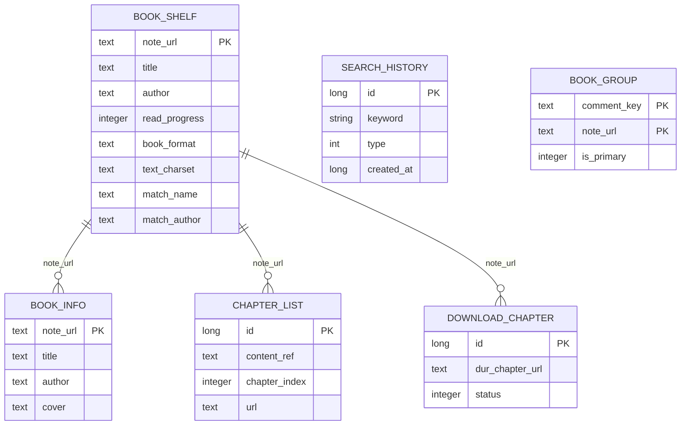
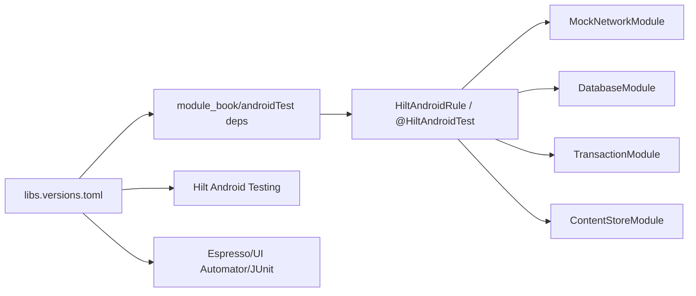

# 集成测试

<cite>
**本文档引用的文件**   
- [AndroidInstrumentedTests.kt](file://build-logic/convention/src/main/kotlin/com/xrn1997/convention/AndroidInstrumentedTests.kt)
- [GradleManagedDevices.kt](file://build-logic/convention/src/main/kotlin/com/xrn1997/convention/GradleManagedDevices.kt)
- [module_book/build.gradle.kts](file://module_book/build.gradle.kts)
- [ImportBaselineTest.kt](file://module_book/src/androidTest/java/com/ebook/book/ImportBaselineTest.kt)
- [DebugMemory.kt](file://module_book/src/androidTest/java/com/ebook/book/DebugMemory.kt)
- [MockNetworkModule.kt](file://module_book/src/main/test/debug/MockNetworkModule.kt)
- [FakeUserSessionManager.kt](file://lib_book_common/src/test/java/com/ebook/common/domain/FakeUserSessionManager.kt)
- [AppDatabase.kt](file://lib_ebook_db/src/main/java/com/ebook/db/AppDatabase.kt)
- [DatabaseModule.kt](file://lib_ebook_db/src/main/java/com/ebook/db/di/DatabaseModule.kt)
- [TransactionModule.kt](file://lib_book_common/src/main/java/com/ebook/common/di/TransactionModule.kt)
- [ContentStoreModule.kt](file://lib_book_common/src/main/java/com/ebook/common/di/ContentStoreModule.kt)
- [SessionModule.kt](file://lib_book_common/src/main/java/com/ebook/common/di/SessionModule.kt)
- [libs.versions.toml](file://gradle/libs.versions.toml)
</cite>

## 目录
1. [引言](#引言)
2. [项目结构与测试组织](#项目结构与测试组织)
3. [核心组件与职责](#核心组件与职责)
4. [架构总览](#架构总览)
5. [详细组件与流程解析](#详细组件与流程解析)
6. [依赖关系分析](#依赖关系分析)
7. [性能考量与度量](#性能考量与度量)
8. [故障排查指南](#故障排查指南)
9. [结论](#结论)
10. [附录](#附录)

## 引言
本文面向 Android 真机/模拟器环境下的端到端集成测试，覆盖 instrumentation test 的组织结构、构建期与运行时配置；Hilt 在测试中的装配与替换策略（含 HiltAndroidRule、Mock 模块）；网络层集成测试的 MockNetworkModule 模式与会话管理模拟；数据库集成测试的 Schema 迁移验证与并发写入场景；跨模块协调测试（路由、Provider 调用链）；前台服务 DownloadService 的启动时序、通知权限与任务队列验证；性能指标采集与内存泄漏检测；以及 CI/CD 流水线的集成方案。内容严格基于仓库现有源码与实践约定，避免未经验证的假设。

## 项目结构与测试组织
- 每个模块均可按需启用 androidTest：当存在 src/androidTest 时才会参与编译并执行测试，否则按约定禁用以避免无意义的打包与安装过程。
- Gradle managed devices 提供虚拟设备矩阵（如 Pixel 4/6/C 多 API），用于在不同系统镜像上执行仪器测试。
- 测试依赖集中于版本目录中统一管理，包括 AndroidX Test、Espresso、UIAutomator、JUnit、Hilt testing 等。
- 关键工程入口文件示例：
  - 默认 Instrumentation Runner 配置在各模块中指定
  - 通过约定插件统一注入 androidTest 相关能力

**图表来源**
- [AndroidInstrumentedTests.kt:22-35](file://build-logic/convention/src/main/kotlin/com/xrn1997/convention/AndroidInstrumentedTests.kt#L22-L35)
- [GradleManagedDevices.kt:27-58](file://build-logic/convention/src/main/kotlin/com/xrn1997/convention/GradleManagedDevices.kt#L27-L58)
- [libs.versions.toml:11-28,135-146](file://gradle/libs.versions.toml#L11-L28)

**章节来源**
- [AndroidInstrumentedTests.kt:22-35](file://build-logic/convention/src/main/kotlin/com/xrn1997/convention/AndroidInstrumentedTests.kt#L22-L35)
- [GradleManagedDevices.kt:27-58](file://build-logic/convention/src/main/kotlin/com/xrn1997/convention/GradleManagedDevices.kt#L27-L58)
- [module_book/build.gradle.kts:10-11,69-83](file://module_book/build.gradle.kts#L10-L11)

## 核心组件与职责
- 仪器测试驱动与规则：使用 AndroidJUnitRunner 作为运行器；Hilt 测试通过 HiltAndroidRule/HiltAndroidTest 在真机/模拟器环境中拉起组件树并进行依赖注入。
- Mock 网络与会话：独立模块可通过 src/main/test/debug 下的 MockNetworkModule 将 UserDataSource/CommentDataSource 绑定为内存实现，从而实现无需后端联调；测试阶段还可通过内存型 FakeUserSessionManager 模拟用户登录态与会话刷新。
- 数据库集成：Room 3.x 通过 DatabaseModule 暴露单例 AppDatabase，内置迁移链 v1→v2→v3→v4；写事务通过 TransactionModule 封装 withWriteTransaction。
- 本地内容基座：ContentStoreModule 将 BookStore、ChapterSplitter、ChapterContentCache 等装配，分离 Context 与纯文件路径以利于测试可控性。

**章节来源**
- [module_book/build.gradle.kts:10-11,69-83](file://module_book/build.gradle.kts#L10-L11)
- [MockNetworkModule.kt:12-27](file://module_book/src/main/test/debug/MockNetworkModule.kt#L12-L27)
- [FakeUserSessionManager.kt:7-72](file://lib_book_common/src/test/java/com/ebook/common/domain/FakeUserSessionManager.kt#L7-L72)
- [AppDatabase.kt:8-33,46-64](file://lib_ebook_db/src/main/java/com/ebook/db/AppDatabase.kt#L8-L33)
- [DatabaseModule.kt:25-99](file://lib_ebook_db/src/main/java/com/ebook/db/di/DatabaseModule.kt#L25-L99)
- [TransactionModule.kt:12-24](file://lib_book_common/src/main/java/com/ebook/common/di/TransactionModule.kt#L12-L24)
- [ContentStoreModule.kt:21-87](file://lib_book_common/src/main/java/com/ebook/common/di/ContentStoreModule.kt#L21-L87)

## 架构总览
以下类图展示了测试相关的主要装配点及其关系：Hilt 模块负责提供数据库、事务与内容存储，测试通过 Hilt 规则注入依赖；MockNetworkModule 拦截网络数据源；FakeUserSessionManager 在 JVM 测试或可注入测试场景中模拟会话状态。

**图表来源**
- [module_book/build.gradle.kts:76-83](file://module_book/build.gradle.kts#L76-L83)
- [MockNetworkModule.kt:12-27](file://module_book/src/main/test/debug/MockNetworkModule.kt#L12-L27)
- [FakeUserSessionManager.kt:7-72](file://lib_book_common/src/test/java/com/ebook/common/domain/FakeUserSessionManager.kt#L7-L72)
- [ContentStoreModule.kt:21-87](file://lib_book_common/src/main/java/com/ebook/common/di/ContentStoreModule.kt#L21-L87)
- [DatabaseModule.kt:25-99](file://lib_ebook_db/src/main/java/com/ebook/db/di/DatabaseModule.kt#L25-L99)
- [TransactionModule.kt:12-24](file://lib_book_common/src/main/java/com/ebook/common/di/TransactionModule.kt#L12-L24)

## 详细组件与流程解析

### 1) Hilt 依赖注入在测试环境的配置与替换
- 使用 HiltAndroidRule 在 androidTest 环境下装配 Hilt 组件树，并通过 inject() 获取被 @Inject 修饰的字段。
- 通过模块覆盖策略进行依赖替换：
  - 在模块的测试 source set 下提供 MockNetworkModule，以 @Binds 方式将 UserDataSource/CommentDataSource 指向内存实现，从而阻断真实网络请求。
  - 对会话管理类，可使用 FakeUserSessionManager 在 JVM 测试或在需要注入的场景下替换生产实现（例如配合 Hilt 提供或直接在测试用例中构造）。
- 注意：仅在 androidTest 中声明 hilt-android-testing 与 kspAndroidTest 才能正确生成测试组件与处理注解，详见模块 build.gradle.kts。

**图表来源**
- [ImportBaselineTest.kt:20-57](file://module_book/src/androidTest/java/com/ebook/book/ImportBaselineTest.kt#L20-L57)
- [MockNetworkModule.kt:12-27](file://module_book/src/main/test/debug/MockNetworkModule.kt#L12-L27)
- [DatabaseModule.kt:91-99](file://lib_ebook_db/src/main/java/com/ebook/db/di/DatabaseModule.kt#L91-L99)
- [TransactionModule.kt:12-24](file://lib_book_common/src/main/java/com/ebook/common/di/TransactionModule.kt#L12-L24)
- [module_book/build.gradle.kts:76-83](file://module_book/build.gradle.kts#L76-L83)

**章节来源**
- [ImportBaselineTest.kt:20-57](file://module_book/src/androidTest/java/com/ebook/book/ImportBaselineTest.kt#L20-L57)
- [module_book/build.gradle.kts:76-83](file://module_book/build.gradle.kts#L76-L83)
- [MockNetworkModule.kt:12-27](file://module_book/src/main/test/debug/MockNetworkModule.kt#L12-L27)

### 2) 网络层集成测试与 Mock 构建模式
- 在独立模块调试与测试时，src/main/test/debug 下的 MockNetworkModule 会覆盖生产网络实现，使测试可在无后端条件下运行。
- 对于更细粒度的网络行为控制，可在应用级的 product flavor（real/mock）中选择不同 NetworkModule；在 androidTest 中建议结合 Hilt 模块覆盖以最小化副作用。
- 会话管理可通过 FakeUserSessionManager 注入，统一维护 isLoggedIn/currentUser 及 TokenHolder 的同步，确保认证逻辑在测试中稳定可控。

**图表来源**
- [AGENTS.md 认证体系约定](file://AGENTS.md)
- [SessionModule.kt](file://lib_book_common/src/main/java/com/ebook/common/di/SessionModule.kt)

**章节来源**
- [MockNetworkModule.kt:12-27](file://module_book/src/main/test/debug/MockNetworkModule.kt#L12-L27)
- [FakeUserSessionManager.kt:7-72](file://lib_book_common/src/test/java/com/ebook/common/domain/FakeUserSessionManager.kt#L7-L72)
- [AGENTS.md](file://AGENTS.md)

### 3) 数据库集成测试：Schema 迁移验证与并发写入
- Room 3.x 通过 DatabaseModule 提供 AppDatabase，包含 v1→v2→v3→v4 的迁移链，禁止使用破坏性迁移。
- 集成测试需确保迁移链完整且可顺序执行，建议：
  - 从旧版本初始建库，再升级至最新版本，验证每一跳迁移生效。
  - 使用真实的 BundledSQLiteDriver，避免内存数据库隐藏迁移问题。
- 写事务通过 TransactionModule 提供的 withWriteTransaction，用于批量落库一致性保障；可据此设计并发写入测试（多线程/协程并发写同一组主键的自然键场景）。

**图表来源**
- [AppDatabase.kt:34-64](file://lib_ebook_db/src/main/java/com/ebook/db/AppDatabase.kt#L34-L64)
- [DatabaseModule.kt:34-99](file://lib_ebook_db/src/main/java/com/ebook/db/di/DatabaseModule.kt#L34-L99)

**章节来源**
- [DatabaseModule.kt:34-99](file://lib_ebook_db/src/main/java/com/ebook/db/di/DatabaseModule.kt#L34-L99)
- [AppDatabase.kt:34-64](file://lib_ebook_db/src/main/java/com/ebook/db/AppDatabase.kt#L34-L64)

### 4) 本地内容基座的测试要点（BookStore/ChapterSplitter/Cache）
- ContentStoreModule 将 BookStore 装配到 filesDir/books，测试时应保证该目录隔离与清理，避免污染下次运行。
- ChapterSplitter 与 ChapterContentCache 可单元测试，也可在 androidTest 中通过导入链路串联验证切分与缓存命中率。
- 在 ImportBaselineTest 中已体现“复制即哈希 → 章文件 → 单事务落库”的端到端链路，适用于性能基线与正确性校验。

**章节来源**
- [ContentStoreModule.kt:21-87](file://lib_book_common/src/main/java/com/ebook/common/di/ContentStoreModule.kt#L21-L87)
- [ImportBaselineTest.kt:46-96](file://module_book/src/androidTest/java/com/ebook/book/ImportBaselineTest.kt#L46-L96)

### 5) 跨模块协调测试：路由与 Provider 调用链
- 跨模块页面由 Provider 接口暴露，并由 TheRouter 创建；在独立模式（isModule=true）下，对应路由占位存在于 module_xxx 的 test/debug source set。
- 集成测试应优先验证“真实路径在合并清单中存在”“路由可跳转”“Provider 返回期望 Composable/Activity”；若涉及 Hilt ViewModel，确保页面级注入可用。

[本节为概念性说明，不直接分析具体文件]

### 6) 前台服务 DownloadService 的集成测试思路
- 启动约束：必须走 DownloadService.start(context, intent)，若返回 false 则提示用户（后台限制/配额限制）。
- 通知与权限：dataSync 类型前台服务需 manifest 中声明对应权限；targetSdk 35+ 下 dataSync 有每 24 小时 6 小时配额要求。
- 任务队列验证：先入表再拉服务，防止因启动失败丢失任务；失败章在耗尽重试后出队，避免阻塞后续章节；暂停中断不出队以待续跑。
- 建议的 androidTest 步骤：
  - 插入若干下载任务至数据库
  - 调用 DownloadService.start 并断言返回 true/false 分支
  - 检查前台通知是否显示、配额是否触发超时回调后的 stopSelf()
  - 轮询任务状态，验证成功/失败/重试/出队路径

[本节为概念性说明，不直接分析具体文件]

## 依赖关系分析
- 测试与运行依赖统一来源于版本目录，确保各模块一致性与可维护性。
- Hilt 测试依赖仅在需要 androidTest 的模块内显式声明，并通过约定插件的条件注入减少无效编译开销。
- Module 之间通过 Hilt 模块解耦，androidTest 中通过 MockNetworkModule 屏蔽网络层不确定性，聚焦业务与数据层正确性。

**图表来源**
- [libs.versions.toml:135-146,154-159](file://gradle/libs.versions.toml#L135-L146)
- [module_book/build.gradle.kts:76-83](file://module_book/build.gradle.kts#L76-L83)

**章节来源**
- [libs.versions.toml:135-146](file://gradle/libs.versions.toml#L135-L146)
- [module_book/build.gradle.kts:76-83](file://module_book/build.gradle.kts#L76-L83)

## 性能考量与度量
- 使用 ImportBaselineTest 对导入链路做端到端测量，输出耗时、章节数、夹具大小、native heap 增量四元组，便于回归对比。
- native heap 增量采用 Debug.getNativeHeapAllocatedSize() 而非 Java Heap，因为 SQLite/BundledSQLiteDriver 的页缓存分配在 native 空间。
- 在长时间运行的仪器测试中，应避免在计时区间外分配大对象；fixture 写入采用流式缓冲以降低峰值占用。

**章节来源**
- [ImportBaselineTest.kt:20-57,69-96](file://module_book/src/androidTest/java/com/ebook/book/ImportBaselineTest.kt#L20-L57)
- [ImportBaselineTest.kt:98-119](file://module_book/src/androidTest/java/com/ebook/book/ImportBaselineTest.kt#L98-L119)
- [DebugMemory.kt:5-16](file://module_book/src/androidTest/java/com/ebook/book/DebugMemory.kt#L5-L16)

## 故障排查指南
- 测试未被执行：确认模块存在 src/androidTest，否则会被约定插件自动禁用；同时检查 testOptions.testInstrumentationRunner 配置。
- Hilt 注入为空：在 androidTest 中需声明 hilt-android-testing 与 kspAndroidTest；并在 @Before 调用 hiltRule.inject()。
- 网络不稳定导致测试偶发失败：使用 MockNetworkModule 与 FakeUserSessionManager 锁定行为；如需测网络路径，建议使用静态 JSON 资产或固定响应。
- 数据库迁移报错：确保迁移链有序且不跳版；检查实体与 SQL 变更是否同步；禁止使用破坏性迁移。
- 前台服务无法启动：核对 manifest 前服务类型声明、配额限制、启动入口必须走统一 start 方法；捕获启动失败分支并断言 UI 提示。

**章节来源**
- [AndroidInstrumentedTests.kt:22-35](file://build-logic/convention/src/main/kotlin/com/xrn1997/convention/AndroidInstrumentedTests.kt#L22-L35)
- [module_book/build.gradle.kts:76-83](file://module_book/build.gradle.kts#L76-L83)
- [DatabaseModule.kt:34-99](file://lib_ebook_db/src/main/java/com/ebook/db/di/DatabaseModule.kt#L34-L99)
- [AGENTS.md 前台服务约定](file://AGENTS.md)

## 结论
本项目的集成测试以 Gradle 约定插件与版本目录为基础，借助 Hilt 测试能力对网络、数据库与内容基座进行端到端验证。通过 MockNetworkModule 与 FakeUserSessionManager 可将外部不确定性降至最低；通过 DatabaseModule 的迁移链保证本地数据一致性；ImportBaselineTest 提供了导入链路的量化基线。前台服务下载需遵循统一启动与配额约束，测试应覆盖成功/失败/超时路径。按上述策略与规范，可以在真机/模拟器环境与 CI 矩阵上高效执行可靠的集成测试。

[本节为总结性内容，不直接分析具体文件]

## 附录

### A. 设备矩阵与执行命令
- 已配置多个 Managed Virtual Device（Pixel 4/6/C 与对应 API），可按需组合 ci/local 组执行。
- 常用命令：
  - 连接设备后执行：./gradlew connectedAndroidTest
  - 指定设备执行：./gradlew pixel4api30aospatdConnectedAndroidTest 等

**章节来源**
- [GradleManagedDevices.kt:27-58](file://build-logic/convention/src/main/kotlin/com/xrn1997/convention/GradleManagedDevices.kt#L27-L58)

### B. 关键测试文件与定位
- ImportBaselineTest：导入链路端到端基线
- DebugMemory：native heap 增量快照工具
- MockNetworkModule：独立测试的数据源替换
- FakeUserSessionManager：会话状态模拟
- DatabaseModule/AppDatabase：数据库与迁移定义
- TransactionModule/ContentStoreModule：写事务与本地内容基座

**章节来源**
- [ImportBaselineTest.kt:20-96](file://module_book/src/androidTest/java/com/ebook/book/ImportBaselineTest.kt#L20-L96)
- [DebugMemory.kt:5-16](file://module_book/src/androidTest/java/com/ebook/book/DebugMemory.kt#L5-L16)
- [MockNetworkModule.kt:12-27](file://module_book/src/main/test/debug/MockNetworkModule.kt#L12-L27)
- [FakeUserSessionManager.kt:7-72](file://lib_book_common/src/test/java/com/ebook/common/domain/FakeUserSessionManager.kt#L7-L72)
- [AppDatabase.kt:34-64](file://lib_ebook_db/src/main/java/com/ebook/db/AppDatabase.kt#L34-L64)
- [DatabaseModule.kt:91-99](file://lib_ebook_db/src/main/java/com/ebook/db/di/DatabaseModule.kt#L91-L99)
- [TransactionModule.kt:12-24](file://lib_book_common/src/main/java/com/ebook/common/di/TransactionModule.kt#L12-L24)
- [ContentStoreModule.kt:21-87](file://lib_book_common/src/main/java/com/ebook/common/di/ContentStoreModule.kt#L21-L87)