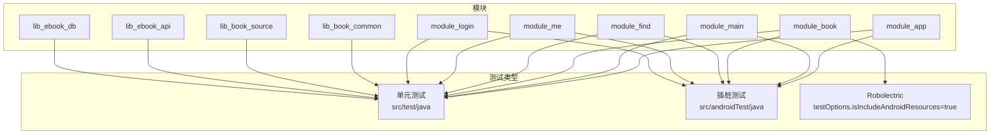
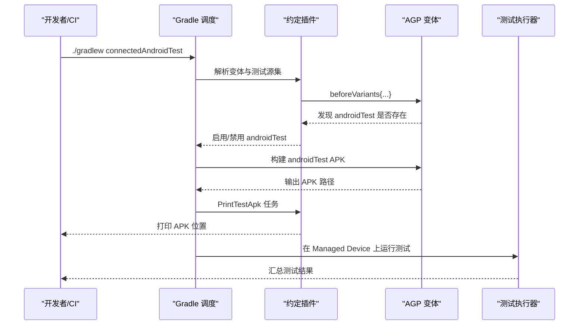
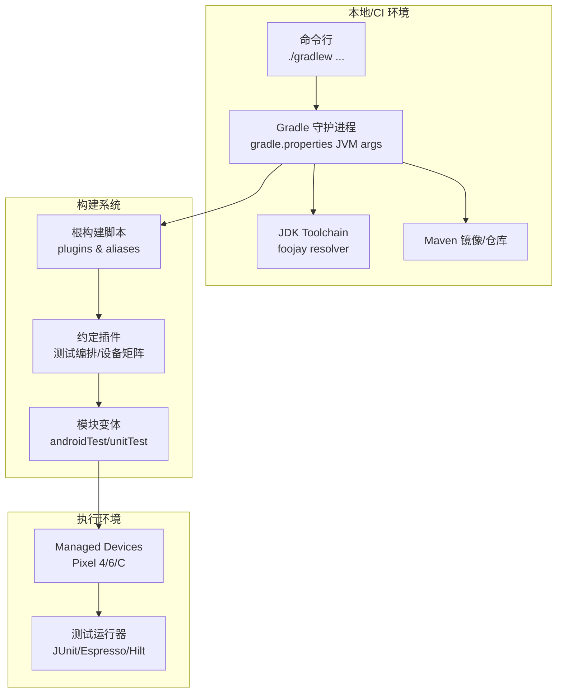
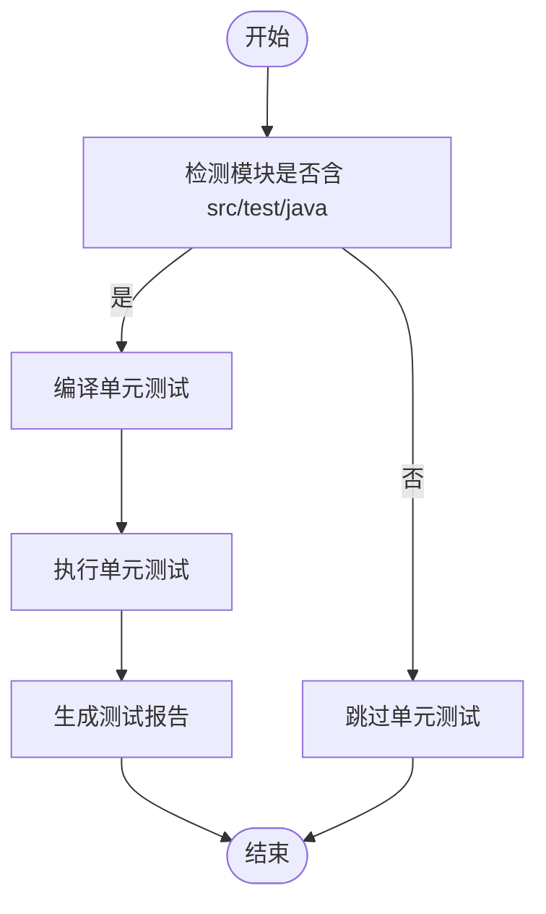
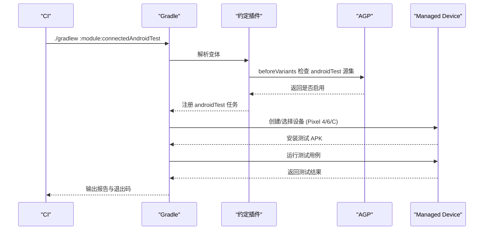
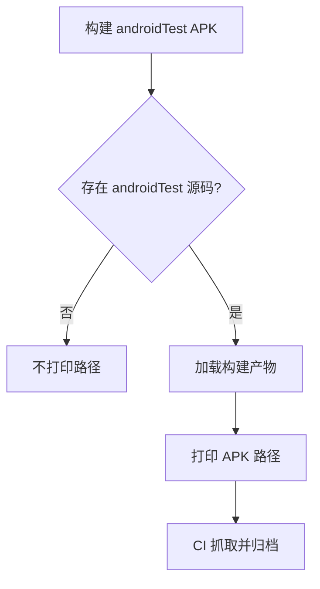
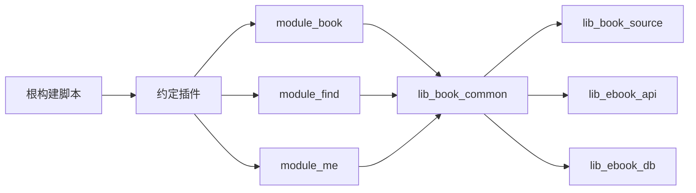

# 持续集成测试

<cite>
**本文引用的文件**
- [根构建脚本 build.gradle.kts](file://build.gradle.kts)
- [根设置 settings.gradle.kts](file://settings.gradle.kts)
- [Gradle 属性 gradle.properties](file://gradle.properties)
- [约定插件：AndroidInstrumentedTests.kt](file://build-logic/convention/src/main/kotlin/com/xrn1997/convention/AndroidInstrumentedTests.kt)
- [约定插件：PrintTestApks.kt](file://build-logic/convention/src/main/kotlin/com/xrn1997/convention/PrintTestApks.kt)
- [约定插件：GradleManagedDevices.kt](file://build-logic/convention/src/main/kotlin/com/xrn1997/convention/GradleManagedDevices.kt)
- [模块构建：module_book/build.gradle.kts](file://module_book/build.gradle.kts)
</cite>

## 目录
1. [简介](#简介)
2. [项目结构与测试分层](#项目结构与测试分层)
3. [核心组件与测试编排](#核心组件与测试编排)
4. [架构总览](#架构总览)
5. [详细组件分析](#详细组件分析)
6. [依赖关系分析](#依赖关系分析)
7. [性能考量](#性能考量)
8. [故障排查指南](#故障排查指南)
9. [结论](#结论)
10. [附录](#附录)

## 简介
本文件面向仓库的持续集成测试，聚焦自动化测试流程、质量门禁、不同层次测试（单元测试、集成测试、插桩测试）的执行策略与并行执行、结果聚合；说明测试环境配置（Android SDK 版本、Gradle 缓存、测试数据库初始化）、测试结果处理（失败重试、报告生成、覆盖率统计）、性能基准测试（导入性能回归检测、内存使用监控、启动时间追踪），并提供 GitHub Actions 工作流示例、多设备矩阵测试与构建缓存优化建议；最后给出本地开发时的测试命令（增量测试、指定模块测试、调试模式）。

## 项目结构与测试分层
仓库采用多模块结构，测试按层次分布在各个模块中：
- 单元测试位于各模块的 src/test/java，主要验证无 Android 依赖或仅需模拟环境的逻辑。
- 插桩测试位于各模块的 src/androidTest/java，需要连接真实设备或模拟器运行，覆盖依赖 Android 框架、Room 数据库、Hilt 注入等的功能。
- 部分模块在 testOptions 中启用 Robolectric，以便在无 Android 运行时环境下读取合并资源并执行 UI 渲染回归测试。

章节来源
- [根设置 settings.gradle.kts:56-65](file://settings.gradle.kts#L56-L65)
- [模块构建：module_book/build.gradle.kts:42-46](file://module_book/build.gradle.kts#L42-L46)

## 核心组件与测试编排
仓库通过 build-logic 中的约定插件统一测试行为：
- 自动禁用没有 androidTest 源集的模块的插桩任务，避免空跑。
- 为有 androidTest 的变体打印测试 APK 路径，便于 CI 定位产物。
- 定义 Gradle Managed Devices 的多设备矩阵（Pixel 4/6/C，API 级别区分），并在 CI 组中限定设备集合，便于流水线复用。

图表来源
- [约定插件：AndroidInstrumentedTests.kt:30-35](file://build-logic/convention/src/main/kotlin/com/xrn1997/convention/AndroidInstrumentedTests.kt#L30-L35)
- [约定插件：PrintTestApks.kt:40-69](file://build-logic/convention/src/main/kotlin/com/xrn1997/convention/PrintTestApks.kt#L40-L69)
- [约定插件：GradleManagedDevices.kt:27-57](file://build-logic/convention/src/main/kotlin/com/xrn1997/convention/GradleManagedDevices.kt#L27-L57)

章节来源
- [约定插件：AndroidInstrumentedTests.kt:22-35](file://build-logic/convention/src/main/kotlin/com/xrn1997/convention/AndroidInstrumentedTests.kt#L22-L35)
- [约定插件：PrintTestApks.kt:40-106](file://build-logic/convention/src/main/kotlin/com/xrn1997/convention/PrintTestApks.kt#L40-L106)
- [约定插件：GradleManagedDevices.kt:27-71](file://build-logic/convention/src/main/kotlin/com/xrn1997/convention/GradleManagedDevices.kt#L27-L71)

## 架构总览
下图展示从命令行到测试执行的端到端流程，包含 Gradle 守护进程、JDK 工具链、代理仓库、模块变体与测试设备的关系。

图表来源
- [根构建脚本 build.gradle.kts:1-15](file://build.gradle.kts#L1-L15)
- [Gradle 属性 gradle.properties:16-36](file://gradle.properties#L16-L36)
- [根设置 settings.gradle.kts:1-26](file://settings.gradle.kts#L1-L26)
- [约定插件：GradleManagedDevices.kt:27-57](file://build-logic/convention/src/main/kotlin/com/xrn1997/convention/GradleManagedDevices.kt#L27-L57)

## 详细组件分析

### 单元测试执行策略
- 每个模块独立运行单元测试，命令如 ./gradlew test 或 :module:assembleDebugUnitTest。
- module_book 启用 isIncludeAndroidResources=true，以支持需要资源的 UI 回归测试（例如阅读器翻页渲染）。
- 使用 JUnit 4 与 Coroutines Test 库进行协程相关断言；必要时引入 Robolectric 进行 UI 层快照对比。

章节来源
- [模块构建：module_book/build.gradle.kts:42-46](file://module_book/build.gradle.kts#L42-L46)
- [根构建脚本 build.gradle.kts:1-15](file://build.gradle.kts#L1-L15)

### 插桩测试执行策略
- 通过约定插件自动判断是否启用 androidTest，避免空模块触发无效任务。
- 使用 AndroidJUnitRunner 作为测试入口；Hilt 测试场景需声明 kspAndroidTest 与 hilt-android-testing 依赖。
- 使用 Gradle Managed Devices 定义多设备矩阵，CI 可限定为 ci 组设备。

图表来源
- [约定插件：AndroidInstrumentedTests.kt:30-35](file://build-logic/convention/src/main/kotlin/com/xrn1997/convention/AndroidInstrumentedTests.kt#L30-L35)
- [约定插件：GradleManagedDevices.kt:27-57](file://build-logic/convention/src/main/kotlin/com/xrn1997/convention/GradleManagedDevices.kt#L27-L57)
- [模块构建：module_book/build.gradle.kts:12-13](file://module_book/build.gradle.kts#L12-L13)

章节来源
- [约定插件：AndroidInstrumentedTests.kt:22-35](file://build-logic/convention/src/main/kotlin/com/xrn1997/convention/AndroidInstrumentedTests.kt#L22-L35)
- [约定插件：GradleManagedDevices.kt:27-71](file://build-logic/convention/src/main/kotlin/com/xrn1997/convention/GradleManagedDevices.kt#L27-L71)
- [模块构建：module_book/build.gradle.kts:12-13](file://module_book/build.gradle.kts#L12-L13)

### 结果聚合与报告
- 约定插件会为每个含 androidTest 的变体注册 PrintTestApk 任务，打印测试 APK 路径，便于 CI 抓取与归档。
- 建议在 CI 中将 Gradle 测试报告（HTML/XML）与测试 APK 打包上传，形成持久化制品。

图表来源
- [约定插件：PrintTestApks.kt:40-106](file://build-logic/convention/src/main/kotlin/com/xrn1997/convention/PrintTestApks.kt#L40-L106)

章节来源
- [约定插件：PrintTestApks.kt:40-106](file://build-logic/convention/src/main/kotlin/com/xrn1997/convention/PrintTestApks.kt#L40-L106)

### 测试环境与配置
- Android SDK 版本：Managed Devices 中定义了 API 级别（如 30、31），CI 可通过相同 image source 保证一致性。
- Gradle 缓存：通过 gradle.properties 设置 JVM 参数与仓库镜像；CI 应缓存 Gradle Wrapper、依赖与构建缓存目录。
- 测试数据库初始化：插桩测试如需 Room，建议使用 InMemory 数据库或测试专用 schema；结合 Hilt 测试脚手架确保依赖注入可用。

章节来源
- [约定插件：GradleManagedDevices.kt:27-57](file://build-logic/convention/src/main/kotlin/com/xrn1997/convention/GradleManagedDevices.kt#L27-L57)
- [Gradle 属性 gradle.properties:16-36](file://gradle.properties#L16-L36)
- [模块构建：module_book/build.gradle.kts:87-95](file://module_book/build.gradle.kts#L87-L95)

### 测试结果处理
- 失败用例重试：可在 CI 中对不稳定用例增加重试次数（例如最多重试 2 次），但优先定位根本原因。
- 测试报告：收集 XML/HTML 报告，标注失败用例、耗时与日志片段。
- 覆盖率统计：可使用 JaCoCo 对单元测试与插桩测试分别统计，设定阈值作为质量门禁。

[本节为通用指导，未直接分析具体文件]

### 性能基准测试
- 导入性能回归检测：针对书籍导入链路设计基线用例，记录导入耗时；CI 中对比历史基线，超过阈值即告警。
- 内存使用监控：在插桩测试中采集堆转储或监控峰值内存，防止内存泄漏回归。
- 启动时间追踪：冷/热启动计时，关注首帧渲染时间与关键路径耗时。

[本节为通用指导，未直接分析具体文件]

## 依赖关系分析
- 根构建脚本集中管理插件别名，保持跨模块一致。
- 约定插件提供统一的测试行为与设备矩阵，降低模块内重复配置。
- 模块依赖关系清晰：业务模块 → lib_book_common → lib_book_source / lib_ebook_api / lib_ebook_db。

图表来源
- [根构建脚本 build.gradle.kts:1-15](file://build.gradle.kts#L1-L15)
- [根设置 settings.gradle.kts:56-65](file://settings.gradle.kts#L56-L65)

章节来源
- [根构建脚本 build.gradle.kts:1-15](file://build.gradle.kts#L1-L15)
- [根设置 settings.gradle.kts:56-65](file://settings.gradle.kts#L56-L65)

## 性能考量
- 并行执行：启用 Gradle 并行与守护进程，减少构建与测试时间。
- 缓存优化：缓存 Gradle 依赖、构建缓存与下载产物；合理使用 Maven 镜像加速。
- 设备矩阵：CI 仅运行 ci 组设备，减少不必要开销。
- 资源访问：单元测试启用 isIncludeAndroidResources 时注意资源体积与加载成本。

[本节为通用指导，未直接分析具体文件]

## 故障排查指南
- 测试为空：确认模块是否存在 androidTest 源集；若无，将被约定插件禁用。
- 注入为空：Hilt 测试需在 androidTest 声明 kspAndroidTest 与 hilt-android-testing，否则注入点为空。
- 资源缺失：单元测试需 isIncludeAndroidResources=true，否则资源不可用。
- 网络权限：真机/模拟器访问本机后端需 adb reverse 或使用回环地址，避免本地网络权限问题。

章节来源
- [约定插件：AndroidInstrumentedTests.kt:30-35](file://build-logic/convention/src/main/kotlin/com/xrn1997/convention/AndroidInstrumentedTests.kt#L30-L35)
- [模块构建：module_book/build.gradle.kts:87-95](file://module_book/build.gradle.kts#L87-L95)
- [模块构建：module_book/build.gradle.kts:42-46](file://module_book/build.gradle.kts#L42-L46)

## 结论
本项目通过 build-logic 约定插件统一了测试编排与设备矩阵，实现了灵活的单元测试与插桩测试并行执行，配合 Gradle 缓存与镜像加速，提升 CI 效率。建议在流水线中加入失败重试、报告归档、覆盖率门禁与性能基线对比，进一步完善质量保障体系。

[本节为总结性内容，未直接分析具体文件]

## 附录

### 本地测试命令
- 全量单元测试：./gradlew test
- 指定模块单元测试：./gradlew :module_book:testDebugUnitTest
- 插桩测试（需设备/模拟器）：./gradlew connectedAndroidTest
- 增量测试：利用 Gradle 增量编译与测试缓存，仅重跑受影响任务

章节来源
- [模块构建：module_book/build.gradle.kts:42-46](file://module_book/build.gradle.kts#L42-L46)
- [Gradle 属性 gradle.properties:16-36](file://gradle.properties#L16-L36)

### GitHub Actions 工作流示例（概念性）
- 步骤建议：
  - 检出代码，配置 JDK Toolchain（由 foojay resolver 管理）。
  - 缓存 Gradle Wrapper、依赖与构建缓存目录。
  - 执行单元测试与插桩测试（限定 ci 组设备）。
  - 打印测试 APK 路径并归档。
  - 上传测试报告与覆盖率。
  - 可选：执行性能基线测试并对比阈值。

[本节为概念性说明，不映射到具体文件]

### 多设备矩阵与缓存优化
- 设备矩阵：使用 Gradle Managed Devices 的 ci 组（Pixel 4/6/C），在 CI 中固定 API 级别与系统镜像源。
- 缓存优化：缓存 .gradle/caches、.gradle/wrapper、~/.m2 等目录；使用阿里云镜像加速依赖下载。

章节来源
- [约定插件：GradleManagedDevices.kt:27-57](file://build-logic/convention/src/main/kotlin/com/xrn1997/convention/GradleManagedDevices.kt#L27-L57)
- [根设置 settings.gradle.kts:1-26](file://settings.gradle.kts#L1-L26)