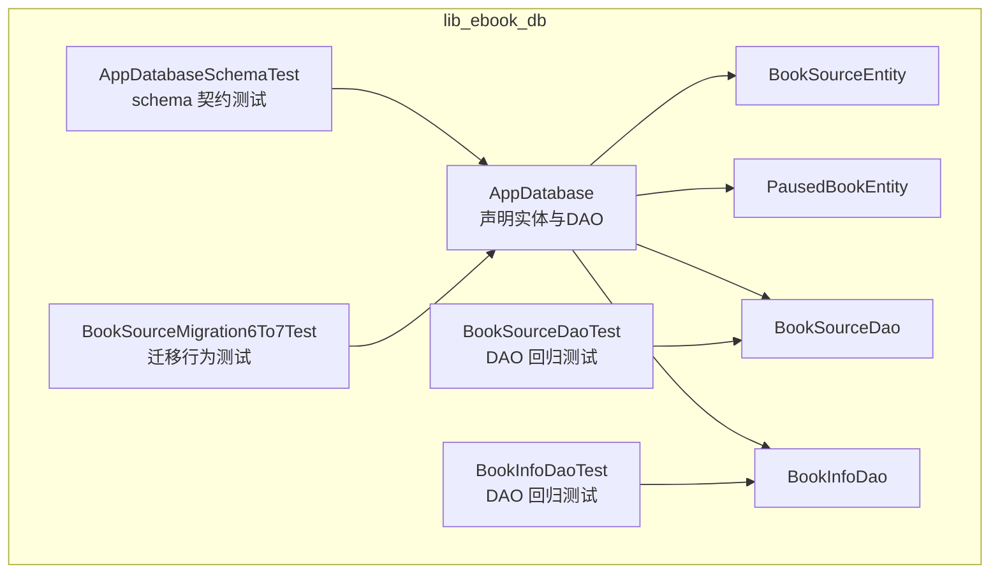
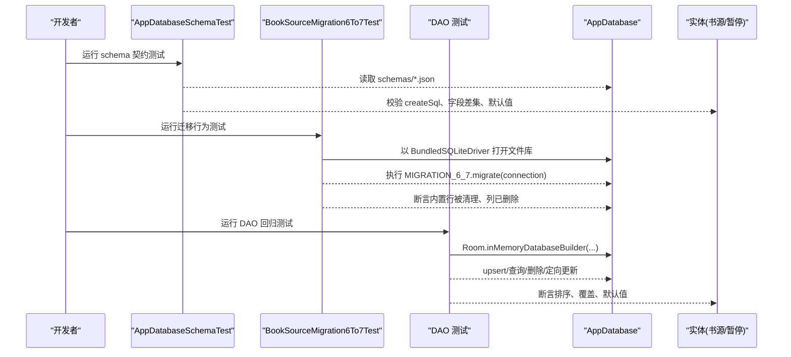
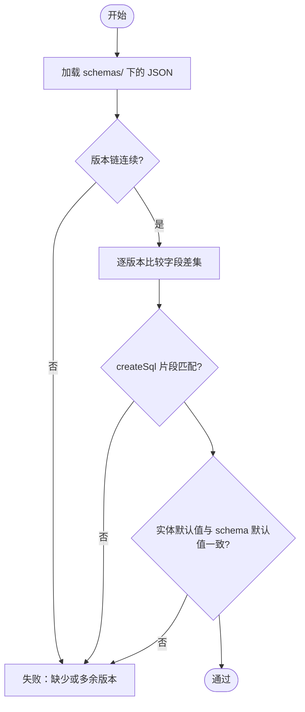
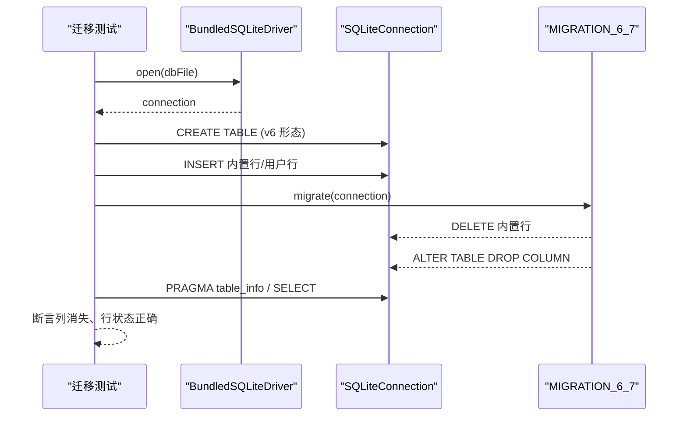
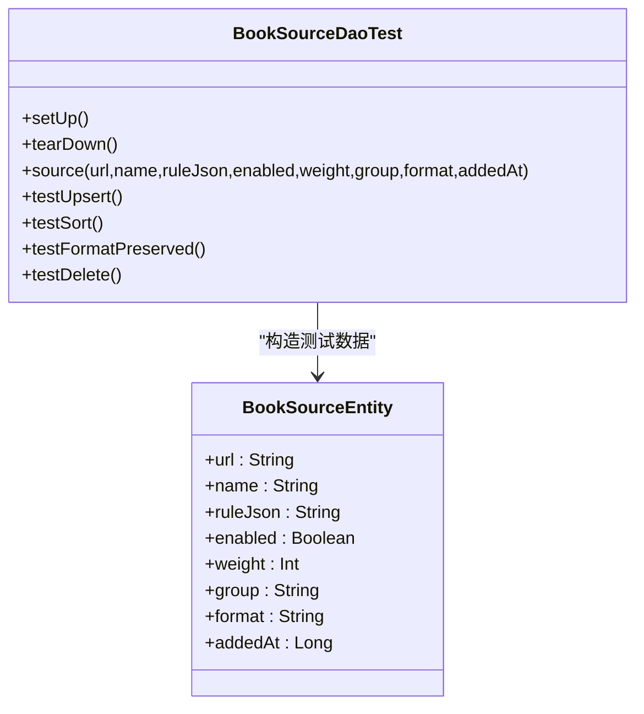
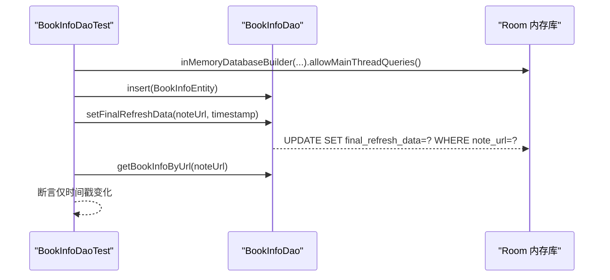
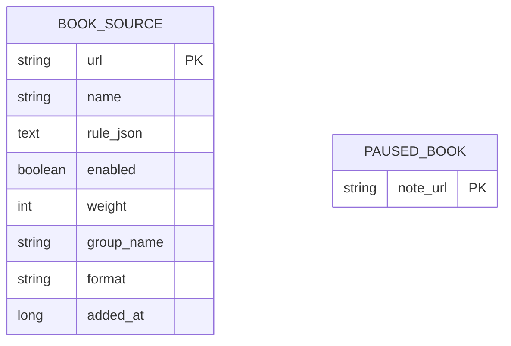
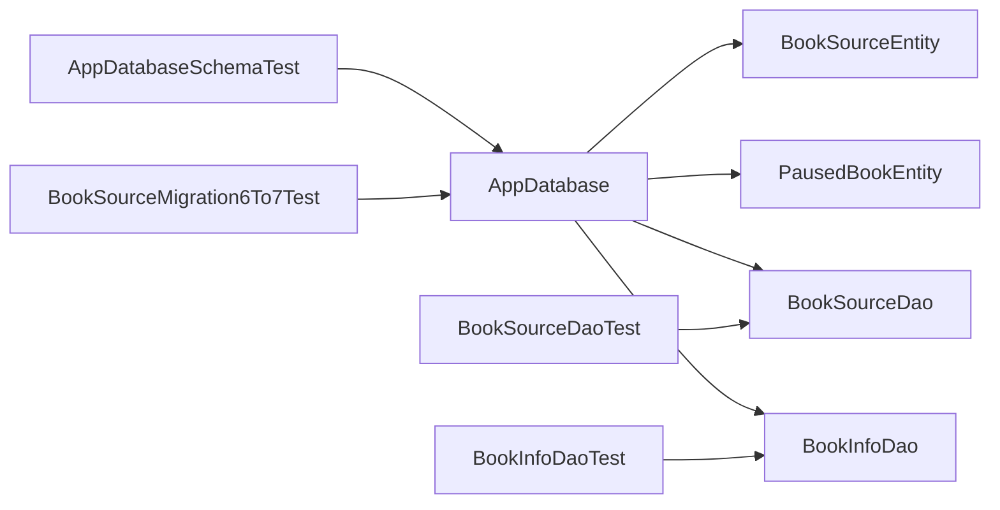

# 数据库集成测试

<cite>
**本文引用的文件**   
- [AppDatabase.kt](file://lib_ebook_db/src/main/java/com/ebook/db/AppDatabase.kt)
- [BookSourceEntity.kt](file://lib_ebook_db/src/main/java/com/ebook/db/entity/BookSourceEntity.kt)
- [PausedBookEntity.kt](file://lib_ebook_db/src/main/java/com/ebook/db/entity/PausedBookEntity.kt)
- [AppDatabaseSchemaTest.kt](file://lib_ebook_db/src/test/java/com/ebook/db/AppDatabaseSchemaTest.kt)
- [BookSourceMigration6To7Test.kt](file://lib_ebook_db/src/test/java/com/ebook/db/BookSourceMigration6To7Test.kt)
- [BookInfoDaoTest.kt](file://lib_ebook_db/src/test/java/com/ebook/db/dao/BookInfoDaoTest.kt)
- [BookSourceDaoTest.kt](file://lib_ebook_db/src/test/java/com/ebook/db/dao/BookSourceDaoTest.kt)
</cite>

## 目录
1. [引言](#引言)
2. [项目结构](#项目结构)
3. [核心组件](#核心组件)
4. [架构总览](#架构总览)
5. [详细组件分析](#详细组件分析)
6. [依赖关系分析](#依赖关系分析)
7. [性能考量](#性能考量)
8. [故障排查指南](#故障排查指南)
9. [结论](#结论)
10. [附录](#附录)

## 引言
本文件面向 Room 数据库的集成测试策略与实现，聚焦以下目标：
- 解释 AppDatabaseSchemaTest 的职责：验证 schema 版本链完整性、迁移语句与实体结构一致性、建表语句与 ALTER 语义。
- 说明 Robolectric 在数据库测试中的使用方式：内存数据库配置、真实 SQL 执行环境搭建。
- 描述数据迁移测试方法：覆盖 v5→v6→v7→v8 的升级路径断言，确保 ALTER TABLE 与 CREATE TABLE 正确。
- 区分自然键与自增键的测试策略：主键冲突、REPLACE 语义、upsert 行为。
- 提供 DAO 层集成测试示例：事务边界验证、并发访问建议。
- 说明测试数据准备与管理：种子数据、测试夹具构建。

## 项目结构
本仓库采用多模块 Gradle 工程，Room 数据库定义与迁移集中在 lib_ebook_db 模块；测试分布在同一模块的 test 源集内，涵盖 schema 契约测试、迁移行为测试与 DAO 回归测试。

**图表来源**
- [AppDatabase.kt:40-75](file://lib_ebook_db/src/main/java/com/ebook/db/AppDatabase.kt#L40-L75)
- [BookSourceEntity.kt:18-91](file://lib_ebook_db/src/main/java/com/ebook/db/entity/BookSourceEntity.kt#L18-L91)
- [PausedBookEntity.kt:23-30](file://lib_ebook_db/src/main/java/com/ebook/db/entity/PausedBookEntity.kt#L23-L30)

**章节来源**
- [AppDatabase.kt:1-76](file://lib_ebook_db/src/main/java/com/ebook/db/AppDatabase.kt#L1-L76)

## 核心组件
- AppDatabase：Room 数据库入口，声明实体集合、版本与导出开关，暴露各表 DAO。
- BookSourceEntity：书源表实体，自然键 url 作为主键，format 列承载解析路由（native/script）。
- PausedBookEntity：按书暂停标记表，自然键 note_url 为主键，REPLACE 幂等。
- 测试套件：
  - AppDatabaseSchemaTest：校验 schema JSON 版本链、字段变更差集、createSql 片段一致性与默认值对齐。
  - BookSourceMigration6To7Test：以 bundled SQLite 驱动执行真实 DDL 迁移，验证“先清内置行、再删列”的行为。
  - BookSourceDaoTest / BookInfoDaoTest：内存库下对 DAO 的 upsert、排序、删除、定向更新进行回归断言。

**章节来源**
- [AppDatabase.kt:40-75](file://lib_ebook_db/src/main/java/com/ebook/db/AppDatabase.kt#L40-L75)
- [BookSourceEntity.kt:18-91](file://lib_ebook_db/src/main/java/com/ebook/db/entity/BookSourceEntity.kt#L18-L91)
- [PausedBookEntity.kt:23-30](file://lib_ebook_db/src/main/java/com/ebook/db/entity/PausedBookEntity.kt#L23-L30)
- [AppDatabaseSchemaTest.kt:99-208](file://lib_ebook_db/src/test/java/com/ebook/db/AppDatabaseSchemaTest.kt#L99-L208)
- [BookSourceMigration6To7Test.kt:94-124](file://lib_ebook_db/src/test/java/com/ebook/db/BookSourceMigration6To7Test.kt#L94-L124)
- [BookSourceDaoTest.kt:86-291](file://lib_ebook_db/src/test/java/com/ebook/db/dao/BookSourceDaoTest.kt#L86-L291)
- [BookInfoDaoTest.kt:50-91](file://lib_ebook_db/src/test/java/com/ebook/db/dao/BookInfoDaoTest.kt#L50-L91)

## 架构总览
下图展示数据库集成测试的整体流程：schema 契约测试从生成物侧锁定结构，迁移测试用生产同款引擎验证 DDL，DAO 测试在内存库中验证 SQL 语义与业务约定。

**图表来源**
- [AppDatabaseSchemaTest.kt:99-208](file://lib_ebook_db/src/test/java/com/ebook/db/AppDatabaseSchemaTest.kt#L99-L208)
- [BookSourceMigration6To7Test.kt:78-124](file://lib_ebook_db/src/test/java/com/ebook/db/BookSourceMigration6To7Test.kt#L78-L124)
- [BookSourceDaoTest.kt:42-52](file://lib_ebook_db/src/test/java/com/ebook/db/dao/BookSourceDaoTest.kt#L42-L52)
- [BookInfoDaoTest.kt:34-43](file://lib_ebook_db/src/test/java/com/ebook/db/dao/BookInfoDaoTest.kt#L34-L43)
- [AppDatabase.kt:40-75](file://lib_ebook_db/src/main/java/com/ebook/db/AppDatabase.kt#L40-L75)

## 详细组件分析

### AppDatabaseSchemaTest：Schema 版本链与结构契约
职责与要点
- 版本链校验：确保 schemas/ 目录下存在 1..SCHEMA_LATEST_VERSION 的完整 JSON，且无多余新版本；JSON 内 database.version 必须等于最新版本号。
- 字段级差异断言：v6 相对 v5 仅新增 format 列；v7 相对 v6 仅移除 is_user_imported 列；v8 相对 v7 仅新增 paused_book 表。
- 建表语句一致性：断言 createSql 片段包含期望列定义与约束（如 NOT NULL、DEFAULT、PRIMARY KEY），保证迁移中的 ALTER/CREATE 与全新安装一致。
- 实体与 schema 默认值对齐：Kotlin 属性默认值需与 @ColumnInfo(defaultValue) 导出的 SQL 字面量一致（去除引号后对比）。

**图表来源**
- [AppDatabaseSchemaTest.kt:99-208](file://lib_ebook_db/src/test/java/com/ebook/db/AppDatabaseSchemaTest.kt#L99-L208)

**章节来源**
- [AppDatabaseSchemaTest.kt:99-208](file://lib_ebook_db/src/test/java/com/ebook/db/AppDatabaseSchemaTest.kt#L99-L208)

### BookSourceMigration6To7Test：迁移行为的真实引擎验证
设计思路
- 使用 BundledSQLiteDriver 在 JVM 上获得与生产一致的 SQLite 引擎，直接调用 Migration.migrate(connection)，避免框架驱动版本差异带来的误判。
- 前置守卫检查 SQLite 版本（≥3.35）以支持 DROP COLUMN。
- 构造 v6 形态的 book_source 表，插入内置行与用户导入行，执行迁移后断言：
  - 内置行被清理（is_user_imported=0 的行被删除）
  - 用户导入行保留
  - is_user_imported 列已删除

**图表来源**
- [BookSourceMigration6To7Test.kt:78-124](file://lib_ebook_db/src/test/java/com/ebook/db/BookSourceMigration6To7Test.kt#L78-L124)
- [BookSourceMigration6To7Test.kt:134-163](file://lib_ebook_db/src/test/java/com/ebook/db/BookSourceMigration6To7Test.kt#L134-L163)
- [BookSourceMigration6To7Test.kt:165-195](file://lib_ebook_db/src/test/java/com/ebook/db/BookSourceMigration6To7Test.kt#L165-L195)

**章节来源**
- [BookSourceMigration6To7Test.kt:94-124](file://lib_ebook_db/src/test/java/com/ebook/db/BookSourceMigration6To7Test.kt#L94-L124)

### BookSourceDaoTest：自然键 upsert、排序与格式路由
关注点
- 自然键 upsert：同 url 写入为覆盖，不会重复。
- 统一排序口径：weight ASC, added_at ASC, url ASC；快照 getAll 与流 observeAll 结果必须一致。
- 格式出身列：format 原样存取，整行替换会写回实体默认值（native），需在覆盖导入时显式携带。
- 删除返回受影响行数，不存在的 url 删除返回 0。

**图表来源**
- [BookSourceDaoTest.kt:66-84](file://lib_ebook_db/src/test/java/com/ebook/db/dao/BookSourceDaoTest.kt#L66-L84)
- [BookSourceDaoTest.kt:86-291](file://lib_ebook_db/src/test/java/com/ebook/db/dao/BookSourceDaoTest.kt#L86-L291)
- [BookSourceEntity.kt:18-91](file://lib_ebook_db/src/main/java/com/ebook/db/entity/BookSourceEntity.kt#L18-L91)

**章节来源**
- [BookSourceDaoTest.kt:86-291](file://lib_ebook_db/src/test/java/com/ebook/db/dao/BookSourceDaoTest.kt#L86-L291)

### BookInfoDaoTest：事务边界与定向更新
关注点
- 定向 UPDATE 只改 final_refresh_data 一列，其余字段逐字不变，防止调用方误用 insert 导致整行 REPLACE 抹除其他字段。
- 按 noteUrl 精确命中，不误伤其他行。
- 行不存在时静默不写也不抛异常。

**图表来源**
- [BookInfoDaoTest.kt:34-43](file://lib_ebook_db/src/test/java/com/ebook/db/dao/BookInfoDaoTest.kt#L34-L43)
- [BookInfoDaoTest.kt:50-91](file://lib_ebook_db/src/test/java/com/ebook/db/dao/BookInfoDaoTest.kt#L50-L91)

**章节来源**
- [BookInfoDaoTest.kt:50-91](file://lib_ebook_db/src/test/java/com/ebook/db/dao/BookInfoDaoTest.kt#L50-L91)

### 实体与数据库结构一致性
- BookSourceEntity：自然键 url 为主键，format 列有默认值 native，用于原生/脚本解析路由。
- PausedBookEntity：自然键 note_url 为主键，REPLACE 幂等重按；行存在即该书暂停。

**图表来源**
- [BookSourceEntity.kt:18-91](file://lib_ebook_db/src/main/java/com/ebook/db/entity/BookSourceEntity.kt#L18-L91)
- [PausedBookEntity.kt:23-30](file://lib_ebook_db/src/main/java/com/ebook/db/entity/PausedBookEntity.kt#L23-L30)

**章节来源**
- [BookSourceEntity.kt:18-91](file://lib_ebook_db/src/main/java/com/ebook/db/entity/BookSourceEntity.kt#L18-L91)
- [PausedBookEntity.kt:23-30](file://lib_ebook_db/src/main/java/com/ebook/db/entity/PausedBookEntity.kt#L23-L30)

## 依赖关系分析
- AppDatabase 依赖实体与 DAO，对外暴露 DAO 接口供上层仓库调用。
- 测试依赖 AppDatabase 与具体 DAO，使用 Robolectric 提供 Context 与模拟 Android 环境。
- 迁移测试依赖 BundledSQLiteDriver，确保与生产一致的 SQLite 引擎执行 DDL。

**图表来源**
- [AppDatabase.kt:40-75](file://lib_ebook_db/src/main/java/com/ebook/db/AppDatabase.kt#L40-L75)
- [AppDatabaseSchemaTest.kt:99-208](file://lib_ebook_db/src/test/java/com/ebook/db/AppDatabaseSchemaTest.kt#L99-L208)
- [BookSourceMigration6To7Test.kt:78-124](file://lib_ebook_db/src/test/java/com/ebook/db/BookSourceMigration6To7Test.kt#L78-L124)
- [BookSourceDaoTest.kt:42-52](file://lib_ebook_db/src/test/java/com/ebook/db/dao/BookSourceDaoTest.kt#L42-L52)
- [BookInfoDaoTest.kt:34-43](file://lib_ebook_db/src/test/java/com/ebook/db/dao/BookInfoDaoTest.kt#L34-L43)

**章节来源**
- [AppDatabase.kt:40-75](file://lib_ebook_db/src/main/java/com/ebook/db/AppDatabase.kt#L40-L75)

## 性能考量
- 迁移测试使用文件库而非内存库，因为 BundledSQLiteDriver.open 需要文件路径，且能复现生产引擎行为。
- DAO 测试使用内存库，便于快速验证 SQL 语义而不受磁盘 IO 影响。
- 批量操作（如 upsertAll）在测试中被覆盖，应确保在生产中同样考虑事务边界与批大小，避免长事务锁表。

[本节为通用指导，不直接分析具体文件]

## 故障排查指南
常见失败与定位
- schema JSON 缺失或版本不一致：检查 Room exportSchema 是否开启、@Database(version) 是否与测试常量同步。
- 迁移语句报错（如 DROP COLUMN 语法错误）：确认 BundledSQLiteDriver 与 SQLite 版本满足要求（≥3.35）。
- 定向更新误改其他字段：检查是否误用 insert 替代专用 UPDATE，确保 WHERE 条件精确。
- 排序不一致：核对 getAll 与 observeAll 的 ORDER BY 是否一致（weight, added_at, url）。

**章节来源**
- [AppDatabaseSchemaTest.kt:99-208](file://lib_ebook_db/src/test/java/com/ebook/db/AppDatabaseSchemaTest.kt#L99-L208)
- [BookSourceMigration6To7Test.kt:94-124](file://lib_ebook_db/src/test/java/com/ebook/db/BookSourceMigration6To7Test.kt#L94-L124)
- [BookInfoDaoTest.kt:50-91](file://lib_ebook_db/src/test/java/com/ebook/db/dao/BookInfoDaoTest.kt#L50-L91)
- [BookSourceDaoTest.kt:180-212](file://lib_ebook_db/src/test/java/com/ebook/db/dao/BookSourceDaoTest.kt#L180-L212)

## 结论
本项目的数据库集成测试体系通过三层保障数据可靠性：
- Schema 契约测试锁定结构与默认值，防止实体与迁移漂移。
- 迁移行为测试在真实引擎上验证 DDL 的正确性与顺序，避免覆盖安装数据丢失。
- DAO 回归测试确保 SQL 语义与业务约定（自然键 upsert、排序、删除、定向更新）稳定。

建议后续扩展：
- 增加事务边界测试（组合多个 DAO 操作，断言原子性）。
- 增加并发访问测试（多线程写入/读取，验证锁与一致性）。
- 补充更多版本的迁移链路测试（v6→v7→v8 的路径断言可扩展到其他表）。

[本节为总结性内容，不直接分析具体文件]

## 附录
- 测试数据准备与管理：
  - 种子数据：在迁移测试中手动创建 v6 形态表并插入内置/用户导入行，模拟真实数据分布。
  - 测试夹具：BookSourceDaoTest 提供 source(...) 工厂，集中构造实体以减少重复代码。
  - 内存库配置：Room.inMemoryDatabaseBuilder(context, AppDatabase::class.java).allowMainThreadQueries() 用于快速验证 SQL。
- 自然键与自增键策略：
  - 自然键（book_source.url、paused_book.note_url）：REPLACE 幂等，upsert 语义清晰。
  - 自增键（下载队列、搜索历史）：去重责任上移到仓库层，避免主键冲突。

**章节来源**
- [BookSourceMigration6To7Test.kt:134-163](file://lib_ebook_db/src/test/java/com/ebook/db/BookSourceMigration6To7Test.kt#L134-L163)
- [BookSourceDaoTest.kt:66-84](file://lib_ebook_db/src/test/java/com/ebook/db/dao/BookSourceDaoTest.kt#L66-L84)
- [BookInfoDaoTest.kt:34-43](file://lib_ebook_db/src/test/java/com/ebook/db/dao/BookInfoDaoTest.kt#L34-L43)
- [AppDatabase.kt:26-31](file://lib_ebook_db/src/main/java/com/ebook/db/AppDatabase.kt#L26-L31)