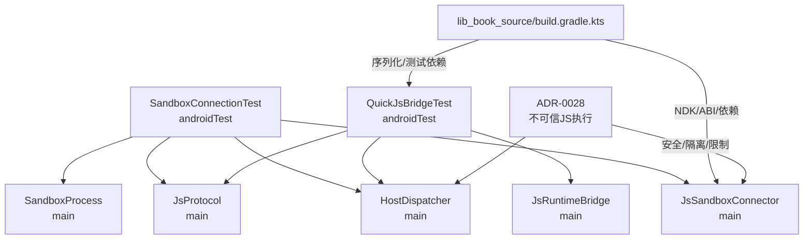
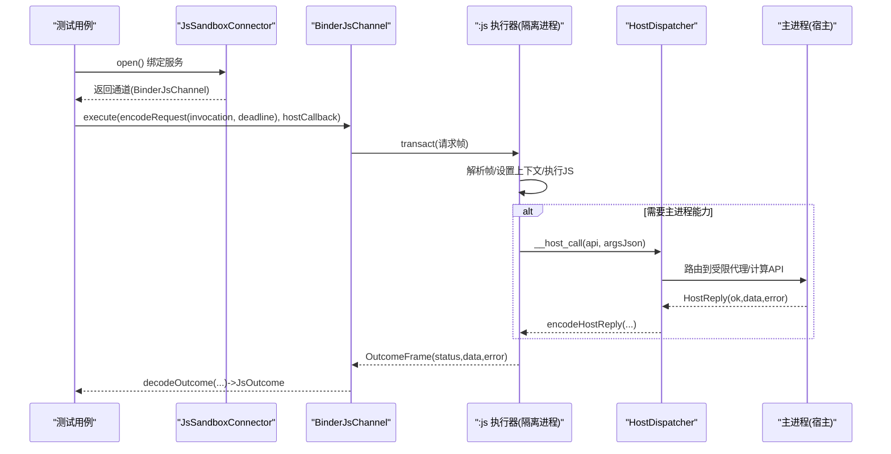
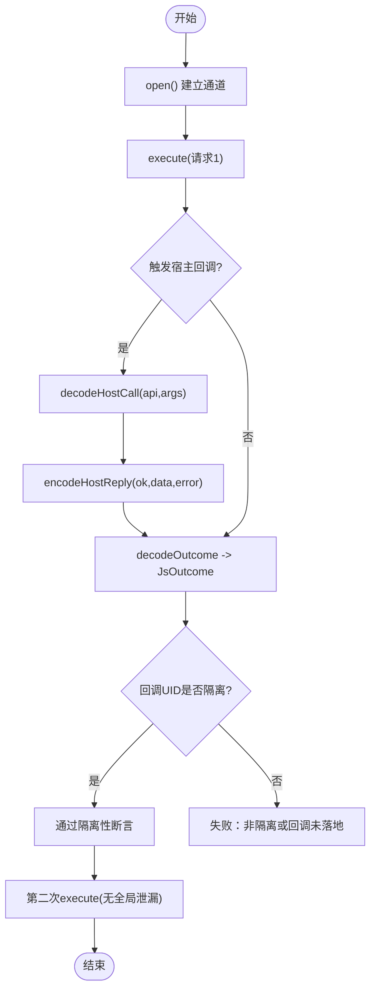
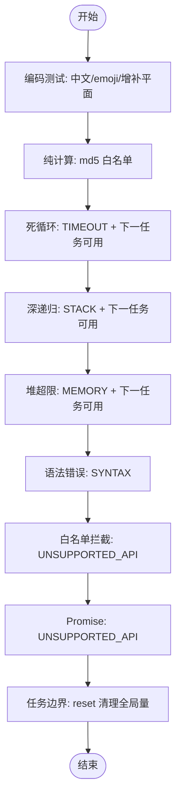
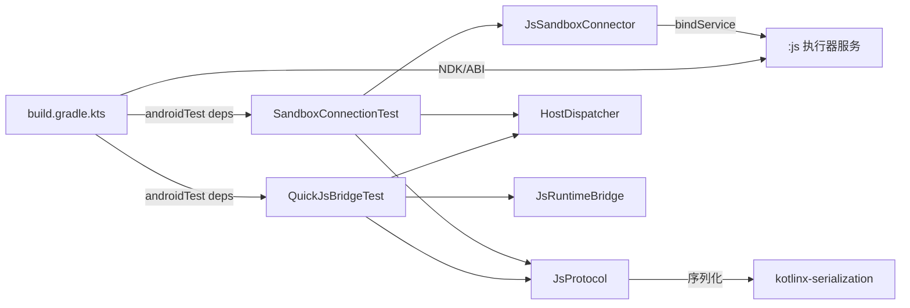

# 沙箱执行器集成测试

<cite>
**本文引用的文件**
- [SandboxConnectionTest.kt](file://lib_book_source/src/androidTest/java/com/ebook/source/sandbox/SandboxConnectionTest.kt)
- [QuickJsBridgeTest.kt](file://lib_book_source/src/androidTest/java/com/ebook/source/sandbox/QuickJsBridgeTest.kt)
- [JsSandboxConnector.kt](file://lib_book_source/src/main/java/com/ebook/source/sandbox/JsSandboxConnector.kt)
- [JsProtocol.kt](file://lib_book_source/src/main/java/com/ebook/source/sandbox/JsProtocol.kt)
- [HostDispatcher.kt](file://lib_book_source/src/main/java/com/ebook/source/sandbox/HostDispatcher.kt)
- [SandboxProcess.kt](file://lib_book_source/src/main/java/com/ebook/source/sandbox/SandboxProcess.kt)
- [build.gradle.kts](file://lib_book_source/build.gradle.kts)
- [0028-untrusted-js-sandbox.md](file://docs/adr/0028-untrusted-js-sandbox.md)
</cite>

## 目录
1. [简介](#简介)
2. [项目结构](#项目结构)
3. [核心组件](#核心组件)
4. [架构总览](#架构总览)
5. [详细组件分析](#详细组件分析)
6. [依赖关系分析](#依赖关系分析)
7. [性能与安全测试要点](#性能与安全测试要点)
8. [故障排查指南](#故障排查指南)
9. [结论](#结论)
10. [附录](#附录)

## 简介
本文件面向“脚本语言沙箱执行器”的集成测试，聚焦 JavaScript 沙箱在 Android 进程隔离、Binder 通信、JNI 边界、安全白名单与资源限制等方面的验证策略。文档围绕两类关键用例展开：
- SandboxConnectionTest：验证跨进程连通性、双向回调通道、以及隔离进程的 UID 判定。
- QuickJsBridgeTest：验证 JNI 边界的编码方向、字符串字面量、特殊字符兼容性、死循环与栈溢出保护、堆内存超限处理、语法错误归类与能力拒绝等。

同时给出原生库加载与 ABI 兼容的测试配置建议，并提供可操作的集成测试示例与排错路径。

## 项目结构
与沙箱执行器集成测试直接相关的代码集中在 lib_book_source 模块：
- 集成测试位于 androidTest：SandboxConnectionTest、QuickJsBridgeTest
- 运行时组件位于 main：JsSandboxConnector、JsProtocol、HostDispatcher、SandboxProcess 等
- 构建配置位于模块 build.gradle.kts，包含 NDK/ABI 过滤、序列化插件、androidTest 依赖
- 设计决策与约束见 ADR-0028

**图表来源**
- [SandboxConnectionTest.kt:1-132](file://lib_book_source/src/androidTest/java/com/ebook/source/sandbox/SandboxConnectionTest.kt#L1-L132)
- [QuickJsBridgeTest.kt:1-175](file://lib_book_source/src/androidTest/java/com/ebook/source/sandbox/QuickJsBridgeTest.kt#L1-L175)
- [JsSandboxConnector.kt:1-142](file://lib_book_source/src/main/java/com/ebook/source/sandbox/JsSandboxConnector.kt#L1-L142)
- [JsProtocol.kt:1-282](file://lib_book_source/src/main/java/com/ebook/source/sandbox/JsProtocol.kt#L1-L282)
- [HostDispatcher.kt:1-74](file://lib_book_source/src/main/java/com/ebook/source/sandbox/HostDispatcher.kt#L1-L74)
- [SandboxProcess.kt:1-28](file://lib_book_source/src/main/java/com/ebook/source/sandbox/SandboxProcess.kt#L1-L28)
- [build.gradle.kts:1-111](file://lib_book_source/build.gradle.kts#L1-L111)
- [0028-untrusted-js-sandbox.md:1-66](file://docs/adr/0028-untrusted-js-sandbox.md#L1-L66)

**章节来源**
- [SandboxConnectionTest.kt:1-132](file://lib_book_source/src/androidTest/java/com/ebook/source/sandbox/SandboxConnectionTest.kt#L1-L132)
- [QuickJsBridgeTest.kt:1-175](file://lib_book_source/src/androidTest/java/com/ebook/source/sandbox/QuickJsBridgeTest.kt#L1-L175)
- [build.gradle.kts:1-111](file://lib_book_source/build.gradle.kts#L1-L111)
- [0028-untrusted-js-sandbox.md:1-66](file://docs/adr/0028-untrusted-js-sandbox.md#L1-L66)

## 核心组件
- JsSandboxConnector：负责绑定并拉起 :js 执行器服务，管理 ServiceConnection、超时与重连语义，返回 BinderJsChannel 供上层调用 execute。
- JsProtocol：定义跨进程控制面帧（请求/响应/host call/reply），提供编解码、大小检查、状态映射；保证协议严格性与失败可分类。
- HostDispatcher：执行器进程内能力入口，校验白名单、分发到计算类或主进程回调中继，兜住异常避免带崩进程。
- SandboxProcess：统一判断当前进程是否被系统隔离，作为进程门的关键判据。
- JsRuntimeBridge：JNI 桥接层封装，提供 evaluate/reset 等方法，承载内核中断、栈/堆限值的真实行为。

**章节来源**
- [JsSandboxConnector.kt:1-142](file://lib_book_source/src/main/java/com/ebook/source/sandbox/JsSandboxConnector.kt#L1-L142)
- [JsProtocol.kt:1-282](file://lib_book_source/src/main/java/com/ebook/source/sandbox/JsProtocol.kt#L1-L282)
- [HostDispatcher.kt:1-74](file://lib_book_source/src/main/java/com/ebook/source/sandbox/HostDispatcher.kt#L1-L74)
- [SandboxProcess.kt:1-28](file://lib_book_source/src/main/java/com/ebook/source/sandbox/SandboxProcess.kt#L1-L28)

## 架构总览
下图展示从测试到执行器的完整交互链路：测试通过连接器建立与服务端 Binder 通道，发送执行请求，执行器在隔离进程中运行 QuickJS 引擎，必要时通过 HostDispatcher 回调主进程完成受限操作，最终将结果按协议返回。

**图表来源**
- [JsSandboxConnector.kt:37-60](file://lib_book_source/src/main/java/com/ebook/source/sandbox/JsSandboxConnector.kt#L37-L60)
- [JsProtocol.kt:127-169](file://lib_book_source/src/main/java/com/ebook/source/sandbox/JsProtocol.kt#L127-L169)
- [HostDispatcher.kt:47-73](file://lib_book_source/src/main/java/com/ebook/source/sandbox/HostDispatcher.kt#L47-L73)

## 详细组件分析

### SandboxConnectionTest 的作用与验证点
- 进程隔离验证：通过 host 回调中读取 Binder.getCallingUid()，并在 API 34+ 使用 Process.isIsolatedUid 判定发起方 uid 属于隔离区间；低版本退化为 uid != 应用自身 uid，确保执行器确实在隔离进程内运行。
- Binder 通信测试：每次 open 都重新绑定，验证重连能获取新执行器；通过 execute 发送请求并接收响应，确认 binder 事务往返正常。
- 双向回调通道验证：脚本侧调用 java.ajax 等宿主能力时，回调参数以 JSON 串形式传递，主进程通过 JsProtocol.decodeHostCall 解析 api 与 args，再 encodeHostReply 回传，验证双向通道的数据完整性与线程一致性。
- 任务隔离性：两次执行之间不应残留上一个任务的全局变量，验证 context 重置与任务边界隔离。

**图表来源**
- [SandboxConnectionTest.kt:37-87](file://lib_book_source/src/androidTest/java/com/ebook/source/sandbox/SandboxConnectionTest.kt#L37-L87)
- [SandboxConnectionTest.kt:103-129](file://lib_book_source/src/androidTest/java/com/ebook/source/sandbox/SandboxConnectionTest.kt#L103-L129)
- [JsProtocol.kt:219-229](file://lib_book_source/src/main/java/com/ebook/source/sandbox/JsProtocol.kt#L219-L229)
- [HostDispatcher.kt:47-73](file://lib_book_source/src/main/java/com/ebook/source/sandbox/HostDispatcher.kt#L47-L73)

**章节来源**
- [SandboxConnectionTest.kt:37-87](file://lib_book_source/src/androidTest/java/com/ebook/source/sandbox/SandboxConnectionTest.kt#L37-L87)
- [SandboxConnectionTest.kt:103-129](file://lib_book_source/src/androidTest/java/com/ebook/source/sandbox/SandboxConnectionTest.kt#L103-L129)
- [JsSandboxConnector.kt:37-60](file://lib_book_source/src/main/java/com/ebook/source/sandbox/JsSandboxConnector.kt#L37-L60)
- [JsProtocol.kt:127-169](file://lib_book_source/src/main/java/com/ebook/source/sandbox/JsProtocol.kt#L127-L169)

### QuickJsBridgeTest 的测试策略
- JNI 边界编码验证：通过中文、增补平面字符与 emoji 的入出双向测试，验证 UTF-8/cesu8 编码方向正确，避免正文乱码。
- 字符串字面量正确处理：确保字面量原样往返，覆盖多字节字符与表情符号。
- 特殊字符兼容性：针对生僻字与 emoji 混排进行断言，锁定 JNI 编码问题只在真机暴露的特性。
- 纯计算能力走通：md5 等白名单能力通过宿主回调执行，验证 host 能力链路与数据传递。
- 死循环检测与超时：while(true) 应在挂钟期限内打断为 TIMEOUT，且下一个任务仍可执行，验证上下文重置。
- 深递归与栈溢出保护：无限递归应返回 STACK 状态而非崩溃进程，后续任务可继续执行。
- 堆内存超限：分配超过限值时应返回 MEMORY 状态，即使内核无法构造错误对象也应被识别，后续任务恢复可用。
- 语法错误归类：语法错误应为 SYNTAX 而非 RUNTIME，便于区分问题类型。
- 能力白名单拦截：绕过垫片直呼 __host_call 访问白名单外能力会被拒绝；明确拒绝的能力返回 UNSUPPORTED_API。
- Promise 不支持：返回 Promise 的脚本按不支持处置，防止异步语义污染同步执行模型。
- 任务边界重置：reset 后 globalThis 残留被清除，context 切换而 runtime 与限值保留。

**图表来源**
- [QuickJsBridgeTest.kt:38-67](file://lib_book_source/src/androidTest/java/com/ebook/source/sandbox/QuickJsBridgeTest.kt#L38-L67)
- [QuickJsBridgeTest.kt:82-126](file://lib_book_source/src/androidTest/java/com/ebook/source/sandbox/QuickJsBridgeTest.kt#L82-L126)
- [QuickJsBridgeTest.kt:128-174](file://lib_book_source/src/androidTest/java/com/ebook/source/sandbox/QuickJsBridgeTest.kt#L128-L174)

**章节来源**
- [QuickJsBridgeTest.kt:38-67](file://lib_book_source/src/androidTest/java/com/ebook/source/sandbox/QuickJsBridgeTest.kt#L38-L67)
- [QuickJsBridgeTest.kt:82-126](file://lib_book_source/src/androidTest/java/com/ebook/source/sandbox/QuickJsBridgeTest.kt#L82-L126)
- [QuickJsBridgeTest.kt:128-174](file://lib_book_source/src/androidTest/java/com/ebook/source/sandbox/QuickJsBridgeTest.kt#L128-L174)

### 沙箱安全性测试方法
- 权限白名单验证：HostDispatcher 对能力表进行二次校验，任何绕过垫片的 __host_call 都会被拒绝；仅允许白名单中的 compute 或经中继的 host 能力。
- 危险操作拦截：网络、文件、反射、JNI、Java/Android 大 API 面默认不存在；阻塞原语 Atomics.wait 在内核侧禁用；URL 选项 js 改写地址不走白名单与私网判定，属已知遗留缝隙。
- 资源访问限制：isolatedProcess 零权限由系统强制；执行器进程自检不隔离即拒绝 onBind，主进程拿不到 binder 归因为连接超时；请求/响应/host 回复均受字节上限保护。
- 进程隔离验证：SandboxConnectionTest 通过 Binder.getCallingUid() 与 Process.isIsolatedUid 判定隔离性；SandboxProcess 提供统一判据用于进程门。

**章节来源**
- [HostDispatcher.kt:47-73](file://lib_book_source/src/main/java/com/ebook/source/sandbox/HostDispatcher.kt#L47-L73)
- [JsProtocol.kt:159-169](file://lib_book_source/src/main/java/com/ebook/source/sandbox/JsProtocol.kt#L159-L169)
- [SandboxProcess.kt:23-28](file://lib_book_source/src/main/java/com/ebook/source/sandbox/SandboxProcess.kt#L23-L28)
- [0028-untrusted-js-sandbox.md:15-25](file://docs/adr/0028-untrusted-js-sandbox.md#L15-L25)
- [0028-untrusted-js-sandbox.md:31-36](file://docs/adr/0028-untrusted-js-sandbox.md#L31-L36)

### 性能与安全相关测试场景
- 死循环检测：wall-clock 超时通过内核中断器打断，返回 TIMEOUT；验证同一 bridge 实例在超时后仍能继续执行。
- 栈溢出保护：深递归返回 STACK；验证进程未被 SIGSEGV 带走，后续任务可执行。
- 内存泄漏防护：堆超限返回 MEMORY；即使内核无法构造错误对象，桥接层依据分配器证据识别并复位上下文。
- 任务隔离：每任务重建 JSContext，globalThis 不跨任务留存；reset 显式切换 context 但保留 runtime 与限值。

**章节来源**
- [QuickJsBridgeTest.kt:82-126](file://lib_book_source/src/androidTest/java/com/ebook/source/sandbox/QuickJsBridgeTest.kt#L82-L126)
- [JsProtocol.kt:186-202](file://lib_book_source/src/main/java/com/ebook/source/sandbox/JsProtocol.kt#L186-L202)
- [0028-untrusted-js-sandbox.md:31-35](file://docs/adr/0028-untrusted-js-sandbox.md#L31-L35)

### 具体沙箱集成测试示例
- 脚本执行连通性：SandboxConnectionTest 中“连上执行器并算出一条表达式”，验证 open()->execute()->decodeOutcome 全流程。
- 宿主调用回调解压：通过 host 回调传递 JSON 参数，主进程解码后编码 reply，验证双向通道与数据完整性。
- 错误处理完整性：QuickJsBridgeTest 覆盖 TIMEOUT、STACK、MEMORY、SYNTAX、UNSUPPORTED_API 等状态，确保用户可见话术与修复指引。

**章节来源**
- [SandboxConnectionTest.kt:37-48](file://lib_book_source/src/androidTest/java/com/ebook/source/sandbox/SandboxConnectionTest.kt#L37-L48)
- [SandboxConnectionTest.kt:50-71](file://lib_book_source/src/androidTest/java/com/ebook/source/sandbox/SandboxConnectionTest.kt#L50-L71)
- [QuickJsBridgeTest.kt:38-67](file://lib_book_source/src/androidTest/java/com/ebook/source/sandbox/QuickJsBridgeTest.kt#L38-L67)
- [QuickJsBridgeTest.kt:82-126](file://lib_book_source/src/androidTest/java/com/ebook/source/sandbox/QuickJsBridgeTest.kt#L82-L126)

### 原生库测试配置
- .so 加载：QuickJsNative 仅在 :js 进程侧初始化；主进程不加载引擎，避免攻击面扩大；缺失时返回 UNAVAILABLE，不影响其他测试。
- ABI 兼容性：release 最小集 arm64-v8a；debug 追加 x86_64 以支持模拟器；放宽点写在模块内以便审查差异。
- 调试符号：通过 NDK/CMake 约定插件统一版本与 ABI；如需调试符号可在 debug 构建开启（遵循约定插件与版本目录）。

**章节来源**
- [build.gradle.kts:13-20](file://lib_book_source/build.gradle.kts#L13-L20)
- [build.gradle.kts:56-69](file://lib_book_source/build.gradle.kts#L56-L69)
- [0028-untrusted-js-sandbox.md:39-43](file://docs/adr/0028-untrusted-js-sandbox.md#L39-L43)

## 依赖关系分析
- 测试到实现：SandboxConnectionTest 依赖 JsSandboxConnector、JsProtocol、HostDispatcher；QuickJsBridgeTest 依赖 JsRuntimeBridge、JsProtocol、HostDispatcher。
- 运行时依赖：JsSandboxConnector 依赖 Android ServiceConnection 与 Binder；JsProtocol 依赖 kotlinx-serialization；HostDispatcher 依赖能力表与主进程中继。
- 构建依赖：模块启用 kotlin.serialization 插件、androidTest 依赖 androidx.test.ext.junit、core、runner；NDK/ABI 过滤在 buildTypes.debug 扩展。

**图表来源**
- [JsSandboxConnector.kt:37-60](file://lib_book_source/src/main/java/com/ebook/source/sandbox/JsSandboxConnector.kt#L37-L60)
- [JsProtocol.kt:127-169](file://lib_book_source/src/main/java/com/ebook/source/sandbox/JsProtocol.kt#L127-L169)
- [HostDispatcher.kt:47-73](file://lib_book_source/src/main/java/com/ebook/source/sandbox/HostDispatcher.kt#L47-L73)
- [build.gradle.kts:1-111](file://lib_book_source/build.gradle.kts#L1-L111)

**章节来源**
- [build.gradle.kts:1-111](file://lib_book_source/build.gradle.kts#L1-L111)
- [JsSandboxConnector.kt:37-60](file://lib_book_source/src/main/java/com/ebook/source/sandbox/JsSandboxConnector.kt#L37-L60)
- [JsProtocol.kt:127-169](file://lib_book_source/src/main/java/com/ebook/source/sandbox/JsProtocol.kt#L127-L169)
- [HostDispatcher.kt:47-73](file://lib_book_source/src/main/java/com/ebook/source/sandbox/HostDispatcher.kt#L47-L73)

## 性能与安全测试要点
- 超时与中断：wall-clock 期限以绝对单调时钟传递，避免墙钟漂移影响；超时后上下文重置，保证任务隔离。
- 栈与堆预算：栈预算需考虑线程剩余栈；堆超限时即便内核无法构造错误对象也要识别并复位。
- 字节上限：请求/响应/host 回复统一采用 utf8Length 零分配计数，避免解析前复制放大内存占用。
- 白名单与私网拒绝：仅允许白名单能力；网络请求经主进程受限代理，拒绝私网地址与凭证携带。
- 进程隔离：isolatedProcess 零权限；执行器 onBind 自检不隔离则拒绝，主进程视为连接超时。

**章节来源**
- [JsProtocol.kt:258-281](file://lib_book_source/src/main/java/com/ebook/source/sandbox/JsProtocol.kt#L258-L281)
- [0028-untrusted-js-sandbox.md:31-36](file://docs/adr/0028-untrusted-js-sandbox.md#L31-L36)
- [0028-untrusted-js-sandbox.md:15-25](file://docs/adr/0028-untrusted-js-sandbox.md#L15-L25)

## 故障排查指南
- 连接不可用：检查 bindTimeoutMs 与 Service 是否存在；连接器抛 SandboxUnavailableException，避免误判为通道死亡导致重复等待。
- 回调未落地：确认 HostDispatcher.installRelay 已安装且未清空；回调线程为 binder 线程池线程，同步返回 suspend transport 结果。
- 编码乱码：验证 JNI 入向 getBytes("UTF-8") 与出向 cesu8/NewStringUTF 方向；补充平面字符与 emoji 必须原样往返。
- 进程未隔离：SandboxProcess.isInIsolatedProcess 判据需满足 SDK 门槛；设备首跑假阴性可能因枚举进程不可见，应以 UID 判据为准。
- 资源耗尽：TIMEOUT/STACK/MEMORY 分别对应不同恢复策略；确认 next 任务可执行以证明上下文复位成功。

**章节来源**
- [JsSandboxConnector.kt:37-60](file://lib_book_source/src/main/java/com/ebook/source/sandbox/JsSandboxConnector.kt#L37-L60)
- [HostDispatcher.kt:47-73](file://lib_book_source/src/main/java/com/ebook/source/sandbox/HostDispatcher.kt#L47-L73)
- [QuickJsBridgeTest.kt:38-67](file://lib_book_source/src/androidTest/java/com/ebook/source/sandbox/QuickJsBridgeTest.kt#L38-L67)
- [SandboxConnectionTest.kt:103-129](file://lib_book_source/src/androidTest/java/com/ebook/source/sandbox/SandboxConnectionTest.kt#L103-L129)
- [SandboxProcess.kt:23-28](file://lib_book_source/src/main/java/com/ebook/source/sandbox/SandboxProcess.kt#L23-L28)

## 结论
本集成测试体系覆盖了沙箱执行器的关键安全与可靠性维度：进程隔离、Binder 双向通信、JNI 编码与特殊字符兼容、资源限制与错误归类、任务隔离与上下文重置。通过 SandboxConnectionTest 与 QuickJsBridgeTest 的组合，能够在真机上暴露 JVM 单测无法捕获的问题，并为脚本源生态提供稳定、安全的执行环境。建议在持续迭代中保持协议严格性、白名单收敛与 ABI 最小化，确保新增能力与改动均可被测试锁住。

## 附录
- 推荐测试入口：
  - 连通性：SandboxConnectionTest 中的表达式求值与 host 回调用例
  - 边界与异常：QuickJsBridgeTest 中的死循环、栈溢出、堆超限、语法错误、能力拒绝用例
- 构建与运行：
  - 使用 ./gradlew connectedAndroidTest 运行 androidTest
  - 确认 .so 已打包至目标 ABI；debug 构建追加 x86_64 以支持模拟器
- 参考决策：
  - ADR-0028 对隔离、白名单、资源限制与协议契约的详细约束