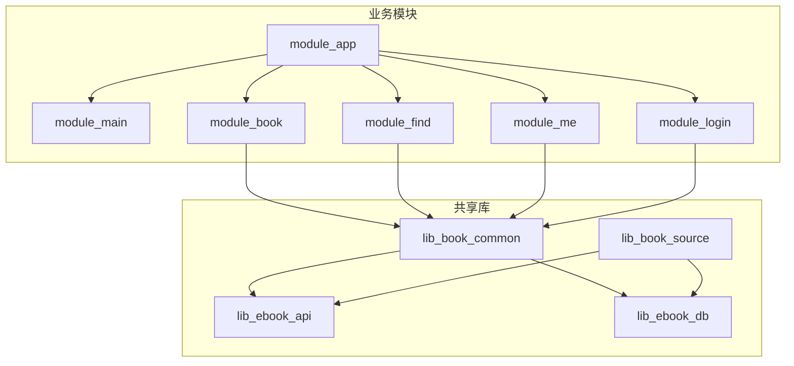
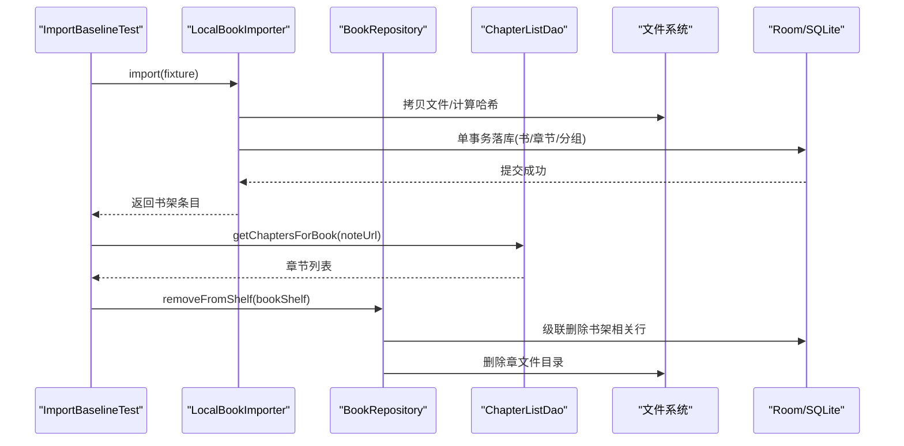
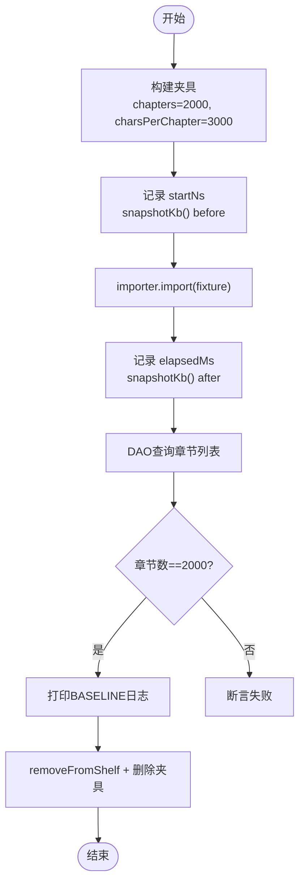
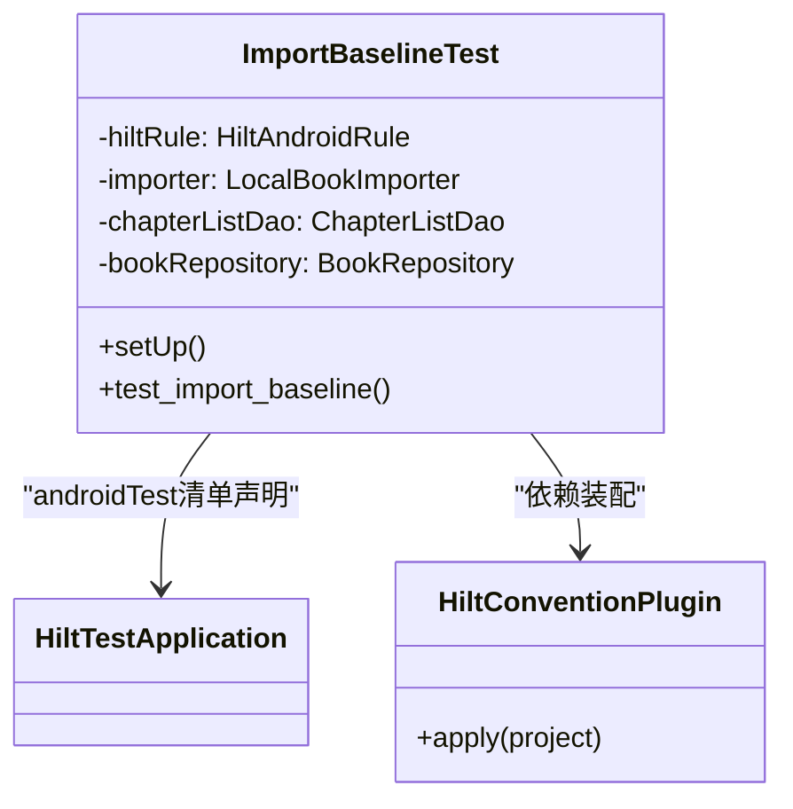
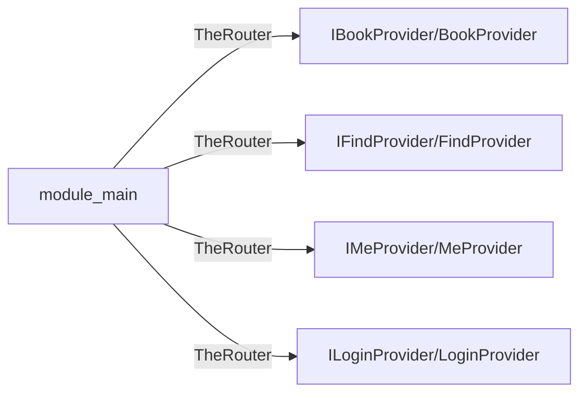
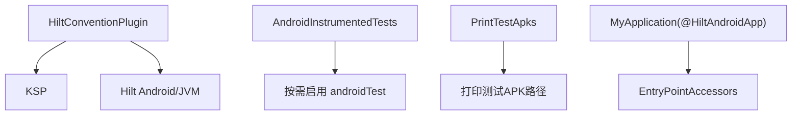

# 组件集成测试

<cite>
**本文引用的文件**
- [ImportBaselineTest.kt](file://module_book/src/androidTest/java/com/ebook/book/ImportBaselineTest.kt)
- [DebugMemory.kt](file://module_book/src/androidTest/java/com/ebook/book/DebugMemory.kt)
- [AndroidManifest.xml（module_book androidTest）](file://module_book/src/androidTest/AndroidManifest.xml)
- [HiltConventionPlugin.kt](file://build-logic/convention/src/main/kotlin/HiltConventionPlugin.kt)
- [AndroidInstrumentedTests.kt](file://build-logic/convention/src/main/kotlin/com/xrn1997/convention/AndroidInstrumentedTests.kt)
- [PrintTestApks.kt](file://build-logic/convention/src/main/kotlin/com/xrn1997/convention/PrintTestApks.kt)
- [MyApplication.kt](file://module_app/src/main/java/com/ebook/MyApplication.kt)
- [IBookProvider.kt](file://lib_book_common/src/main/java/com/ebook/common/provider/IBookProvider.kt)
- [IFindProvider.kt](file://lib_book_common/src/main/java/com/ebook/common/provider/IFindProvider.kt)
- [IMeProvider.kt](file://lib_book_common/src/main/java/com/ebook/common/provider/IMeProvider.kt)
- [ILoginProvider.kt](file://lib_book_common/src/main/java/com/ebook/common/provider/ILoginProvider.kt)
- [BookProvider.kt](file://module_book/src/main/java/com/ebook/book/provider/BookProvider.kt)
- [FindProvider.kt](file://module_find/src/main/java/com/ebook/find/provider/FindProvider.kt)
- [MeProvider.kt](file://module_me/src/main/java/com/ebook/me/provider/MeProvider.kt)
- [LoginProvider.kt](file://module_login/src/main/java/com/ebook/login/provider/LoginProvider.kt)
- [settings.gradle.kts](file://settings.gradle.kts)
- [gradle.properties](file://gradle.properties)
</cite>

## 目录
1. [简介](#简介)
2. [项目结构](#项目结构)
3. [核心组件](#核心组件)
4. [架构总览](#架构总览)
5. [详细组件分析](#详细组件分析)
6. [依赖分析](#依赖分析)
7. [性能考虑](#性能考虑)
8. [故障排查指南](#故障排查指南)
9. [结论](#结论)
10. [附录](#附录)

## 简介
本文件面向 Android 插桩测试与跨模块集成测试，重点覆盖：
- ImportBaselineTest 的性能基线设计：端到端导入流程、耗时与内存指标、数据一致性自检。
- Hilt 依赖注入在集成测试中的配置：组件树初始化、Mock 注入、测试环境搭建。
- 跨模块通信的测试方法：Provider 接口调用、路由跳转验证、事件总线监听。
- UI 组件集成测试策略：Compose 状态验证、用户交互模拟、界面渲染检查。
- 具体测试示例：书籍导入流程、阅读器基本功能、设置页面配置验证。
- 仪器测试执行环境：真机/模拟器、报告生成、性能数据采集。

## 项目结构
本项目为多模块 Gradle 工程，模块间通过 Provider 接口与 TheRouter 进行解耦通信；共享能力下沉到 lib_book_common，网络与数据库分别位于 lib_ebook_api 与 lib_ebook_db。测试侧：
- 单元测试位于各模块 src/test/java。
- 插桩测试位于各模块 src/androidTest/java。
- build-logic 提供统一的约定插件，包含 Hilt 装配、仪器测试开关、APK 打印等。

图表来源
- [settings.gradle.kts](file://settings.gradle.kts)
- [gradle.properties](file://gradle.properties)

章节来源
- [settings.gradle.kts](file://settings.gradle.kts)
- [gradle.properties](file://gradle.properties)

## 核心组件
- ImportBaselineTest：端到端导入性能基线测试，使用真实 Room 写库与文件系统写入，输出“耗时/章节数/文件大小/堆增量”四元组并断言切分结果。
- DebugMemory：统一采集 native heap 快照（KB），用于测量导入链路中 SQLite 页缓存与语句分配带来的内存增量。
- Hilt 集成测试清单：module_book 的 androidTest 清单声明 HiltTestApplication，使 @HiltAndroidTest 可直接拉起组件树。
- 约定插件：HiltConventionPlugin 自动装配 KSP 与 Hilt 依赖；AndroidInstrumentedTests 禁用无 androidTest 的模块；PrintTestApks 打印测试 APK 路径便于定位。

章节来源
- [ImportBaselineTest.kt:20-119](file://module_book/src/androidTest/java/com/ebook/book/ImportBaselineTest.kt#L20-L119)
- [DebugMemory.kt:1-16](file://module_book/src/androidTest/java/com/ebook/book/DebugMemory.kt#L1-L16)
- [AndroidManifest.xml（module_book androidTest）:1-18](file://module_book/src/androidTest/AndroidManifest.xml#L1-L18)
- [HiltConventionPlugin.kt:24-49](file://build-logic/convention/src/main/kotlin/HiltConventionPlugin.kt#L24-L49)
- [AndroidInstrumentedTests.kt:22-35](file://build-logic/convention/src/main/kotlin/com/xrn1997/convention/AndroidInstrumentedTests.kt#L22-L35)
- [PrintTestApks.kt:40-106](file://build-logic/convention/src/main/kotlin/com/xrn1997/convention/PrintTestApks.kt#L40-L106)

## 架构总览
下图展示 ImportBaselineTest 在集成测试中的端到端调用链：从测试用例触发导入器，经由 BookRepository 完成书架写入，DAO 落库章节列表，最终通过仓库清理释放资源。

图表来源
- [ImportBaselineTest.kt:69-96](file://module_book/src/androidTest/java/com/ebook/book/ImportBaselineTest.kt#L69-L96)

章节来源
- [ImportBaselineTest.kt:69-96](file://module_book/src/androidTest/java/com/ebook/book/ImportBaselineTest.kt#L69-L96)

## 详细组件分析

### ImportBaselineTest 性能基线测试
- 目标：以 2000 章 TXT 夹具执行真实导入，输出 BASELINE 日志的四元组（耗时毫秒、章节数、文件大小 KB、native 堆增量 KB），并断言章节数量正确。
- 计时与内存：
  - 使用 System.nanoTime() 包裹 importer.import(fixture) 获得端到端耗时。
  - 使用 DebugMemory.snapshotKb() 获取 native heap 快照，差值即为导入期间的内存增量。
- 数据校验：通过 ChapterListDao.getChaptersForBook(noteUrl) 读取章节列表，断言章节数为 2000。
- 清理：调用 BookRepository.removeFromShelf 走生产移除路径，级联删除数据库行与章文件目录，确保测试幂等。
- 工具：buildFixture 生成可重复的 UTF-8 文本夹具，避免随机内容干扰解码成本对比。

图表来源
- [ImportBaselineTest.kt:69-118](file://module_book/src/androidTest/java/com/ebook/book/ImportBaselineTest.kt#L69-L118)
- [DebugMemory.kt:12-16](file://module_book/src/androidTest/java/com/ebook/book/DebugMemory.kt#L12-L16)

章节来源
- [ImportBaselineTest.kt:69-118](file://module_book/src/androidTest/java/com/ebook/book/ImportBaselineTest.kt#L69-L118)
- [DebugMemory.kt:1-16](file://module_book/src/androidTest/java/com/ebook/book/DebugMemory.kt#L1-L16)

### Hilt 依赖注入在集成测试中的配置
- 组件树初始化：
  - module_book 的 androidTest 清单声明 HiltTestApplication，作为 @HiltAndroidTest 所需的根 Application。
  - 测试类使用 HiltAndroidRule 并在 setUp 中调用 inject()，拉起组件树后对 @Inject 字段进行注入。
- Mock 对象注入：
  - 可在 test source set 中提供对应实现或 @Module 替换，结合 Hilt 的测试支持将网络层/存储层替换为 Mock。
  - 对于进程隔离场景（如 :js 沙箱），应用层入口需遵循“Application 上不允许 eager @Inject 字段”的规则，通过 EntryPointAccessors 延迟取用。
- 测试环境搭建：
  - 通过 HiltConventionPlugin 自动装配 KSP 与 Hilt 依赖，确保测试编译期生成代码可用。
  - 若模块无 androidTest 目录，约定插件会禁用不必要的仪器测试任务。

图表来源
- [AndroidManifest.xml（module_book androidTest）:1-18](file://module_book/src/androidTest/AndroidManifest.xml#L1-L18)
- [HiltConventionPlugin.kt:24-49](file://build-logic/convention/src/main/kotlin/HiltConventionPlugin.kt#L24-L49)
- [ImportBaselineTest.kt:44-57](file://module_book/src/androidTest/java/com/ebook/book/ImportBaselineTest.kt#L44-L57)

章节来源
- [AndroidManifest.xml（module_book androidTest）:1-18](file://module_book/src/androidTest/AndroidManifest.xml#L1-L18)
- [HiltConventionPlugin.kt:24-49](file://build-logic/convention/src/main/kotlin/HiltConventionPlugin.kt#L24-L49)
- [ImportBaselineTest.kt:44-57](file://module_book/src/androidTest/java/com/ebook/book/ImportBaselineTest.kt#L44-L57)
- [MyApplication.kt:24-61](file://module_app/src/main/java/com/ebook/MyApplication.kt#L24-L61)

### 跨模块通信的测试方法
- Provider 接口调用：
  - 模块通过 lib_book_common 暴露 Provider 接口（如 IBookProvider、IFindProvider、IMeProvider、ILoginProvider），由各自模块实现（BookProvider、FindProvider、MeProvider、LoginProvider）。
  - 集成测试可通过 TheRouter 或 Provider 工厂构造实例，调用 Composable 页面函数以验证跨模块组合行为。
- 路由跳转验证：
  - 每个模块在 assets/therouter/routeMap.json 注册路由；独立模式下需在 test/debug 宿主补充占位路由，避免静默丢失。
  - 集成测试可启动宿主页，触发路由跳转并断言目标页面可见。
- 事件总线监听：
  - 使用 SharedFlow 作为事件总线（如 BookRepository.bookShelfEvents），订阅方在测试中收集事件序列并断言业务流转。

图表来源
- [IBookProvider.kt](file://lib_book_common/src/main/java/com/ebook/common/provider/IBookProvider.kt)
- [IFindProvider.kt](file://lib_book_common/src/main/java/com/ebook/common/provider/IFindProvider.kt)
- [IMeProvider.kt](file://lib_book_common/src/main/java/com/ebook/common/provider/IMeProvider.kt)
- [ILoginProvider.kt](file://lib_book_common/src/main/java/com/ebook/common/provider/ILoginProvider.kt)
- [BookProvider.kt](file://module_book/src/main/java/com/ebook/book/provider/BookProvider.kt)
- [FindProvider.kt](file://module_find/src/main/java/com/ebook/find/provider/FindProvider.kt)
- [MeProvider.kt](file://module_me/src/main/java/com/ebook/me/provider/MeProvider.kt)
- [LoginProvider.kt](file://module_login/src/main/java/com/ebook/login/provider/LoginProvider.kt)

章节来源
- [IBookProvider.kt](file://lib_book_common/src/main/java/com/ebook/common/provider/IBookProvider.kt)
- [IFindProvider.kt](file://lib_book_common/src/main/java/com/ebook/common/provider/IFindProvider.kt)
- [IMeProvider.kt](file://lib_book_common/src/main/java/com/ebook/common/provider/IMeProvider.kt)
- [ILoginProvider.kt](file://lib_book_common/src/main/java/com/ebook/common/provider/ILoginProvider.kt)
- [BookProvider.kt](file://module_book/src/main/java/com/ebook/book/provider/BookProvider.kt)
- [FindProvider.kt](file://module_find/src/main/java/com/ebook/find/provider/FindProvider.kt)
- [MeProvider.kt](file://module_me/src/main/java/com/ebook/me/provider/MeProvider.kt)
- [LoginProvider.kt](file://module_login/src/main/java/com/ebook/login/provider/LoginProvider.kt)

### UI 组件的集成测试策略
- Compose 组件状态验证：
  - 使用 Compose Test 规则与 StateFlow/State 断言，验证页面初始态、交互后态与错误态。
- 用户交互的模拟：
  - 通过 Semantics 树操作模拟点击、滑动、输入等；针对滚动与分页，确保 key 稳定且唯一，避免锚点漂移。
- 界面渲染的检查：
  - 利用截图或语义匹配断言关键元素存在/可见；对主题、 insets、覆盖层进行一致性校验。

[本节为概念性说明，不直接分析具体文件]

### 具体组件集成测试示例
- 书籍导入流程测试：
  - 参考 ImportBaselineTest，以真实导入链路执行端到端测试，断言章节数量与 BASELINE 日志四元组。
- 阅读器基本功能测试：
  - 启动 ReadBookActivity，验证翻页/滚屏模式切换、章节跳转、进度保存与恢复。
- 设置页面配置验证：
  - 进入 Me 模块设置页，修改主题/字体/缓存策略，通过 Provider 或 Repository 读取配置并断言生效。

[本节为概念性说明，不直接分析具体文件]

## 依赖分析
- 约定插件装配：
  - HiltConventionPlugin 为 Android 与 JVM 模块装配 KSP 与 Hilt 依赖。
  - AndroidInstrumentedTests 仅在存在 androidTest 时启用仪器测试。
  - PrintTestApks 在构建阶段打印测试 APK 路径，便于定位产物。
- 应用入口与进程门：
  - MyApplication 作为 @HiltAndroidApp，遵循“Application 上禁止 eager @Inject 字段”，通过 EntryPointAccessors 延迟取用 BookRepository，避免沙箱进程崩溃。

图表来源
- [HiltConventionPlugin.kt:24-49](file://build-logic/convention/src/main/kotlin/HiltConventionPlugin.kt#L24-L49)
- [AndroidInstrumentedTests.kt:22-35](file://build-logic/convention/src/main/kotlin/com/xrn1997/convention/AndroidInstrumentedTests.kt#L22-L35)
- [PrintTestApks.kt:40-106](file://build-logic/convention/src/main/kotlin/com/xrn1997/convention/PrintTestApks.kt#L40-L106)
- [MyApplication.kt:24-61](file://module_app/src/main/java/com/ebook/MyApplication.kt#L24-L61)

章节来源
- [HiltConventionPlugin.kt:24-49](file://build-logic/convention/src/main/kotlin/HiltConventionPlugin.kt#L24-L49)
- [AndroidInstrumentedTests.kt:22-35](file://build-logic/convention/src/main/kotlin/com/xrn1997/convention/AndroidInstrumentedTests.kt#L22-L35)
- [PrintTestApks.kt:40-106](file://build-logic/convention/src/main/kotlin/com/xrn1997/convention/PrintTestApks.kt#L40-L106)
- [MyApplication.kt:24-61](file://module_app/src/main/java/com/ebook/MyApplication.kt#L24-L61)

## 性能考虑
- 端到端墙钟时间：使用 System.nanoTime() 包围导入流程，避免协程虚拟时间调度器对真实 IO/DB 的影响。
- 内存增量监控：统一通过 DebugMemory 采集 native heap，关注 Room 3 BundledSQLiteDriver 的页缓存与语句分配。
- 夹具稳定性：重复正文文本减少随机性对解码成本的干扰，保证改前/改后对比可比性。
- 清理与幂等：测试后通过生产移除路径清理数据与文件，确保后续测试不受影响。

[本节为通用指导，不直接分析具体文件]

## 故障排查指南
- 测试未执行：确认模块存在 androidTest 目录，否则约定插件会禁用仪器测试任务。
- Hilt 注入为空：确保在 @Before 中调用 hiltRule.inject()，并检查 androidTest 清单是否声明 HiltTestApplication。
- 路由跳转失效：独立模式下需补充占位路由；集成态下检查 routeMap 资产是否最新（需重新构建以回写）。
- 沙箱进程崩溃：避免在 Application 上使用 eager @Inject 字段；通过 EntryPointAccessors 延迟取用依赖。
- 性能数据异常：确认使用 native heap 快照而非 Java heap；保持夹具内容与解码策略一致。

章节来源
- [AndroidInstrumentedTests.kt:22-35](file://build-logic/convention/src/main/kotlin/com/xrn1997/convention/AndroidInstrumentedTests.kt#L22-L35)
- [AndroidManifest.xml（module_book androidTest）:1-18](file://module_book/src/androidTest/AndroidManifest.xml#L1-L18)
- [MyApplication.kt:24-61](file://module_app/src/main/java/com/ebook/MyApplication.kt#L24-L61)
- [ImportBaselineTest.kt:69-96](file://module_book/src/androidTest/java/com/ebook/book/ImportBaselineTest.kt#L69-L96)

## 结论
- ImportBaselineTest 提供了稳定的端到端导入性能基线，涵盖耗时与内存增量，并通过 DAO 校验章节完整性。
- Hilt 集成测试通过 HiltTestApplication 与 HiltAndroidRule 简化组件树初始化，配合约定插件自动化装配。
- 跨模块通信通过 Provider 接口与 TheRouter 解耦，测试可验证路由与事件流。
- UI 集成测试聚焦 Compose 状态与交互，确保渲染与主题一致性。
- 仪器测试执行环境借助约定插件优化任务与产物定位，便于持续集成与问题定位。

[本节为总结性内容，不直接分析具体文件]

## 附录
- 执行命令参考：
  - 运行集成测试：./gradlew connectedAndroidTest
  - 构建指定模块：./gradlew :module_app:assembleDebug
  - 清理构建：./gradlew clean build
- 测试报告与产物：
  - 查看测试 APK 路径：构建阶段由 PrintTestApks 打印路径，便于定位安装与调试。
  - 日志采集：BASELINE 日志通过 println 输出至 logcat，便于 CI 抓取与分析。

[本节为附加信息，不直接分析具体文件]