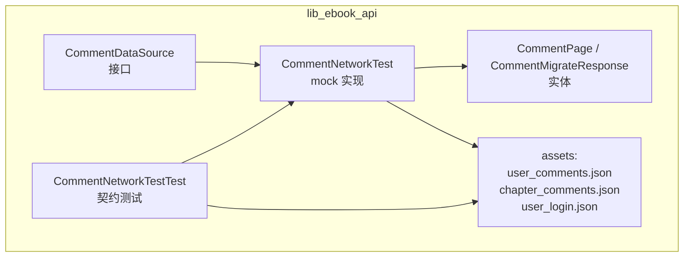
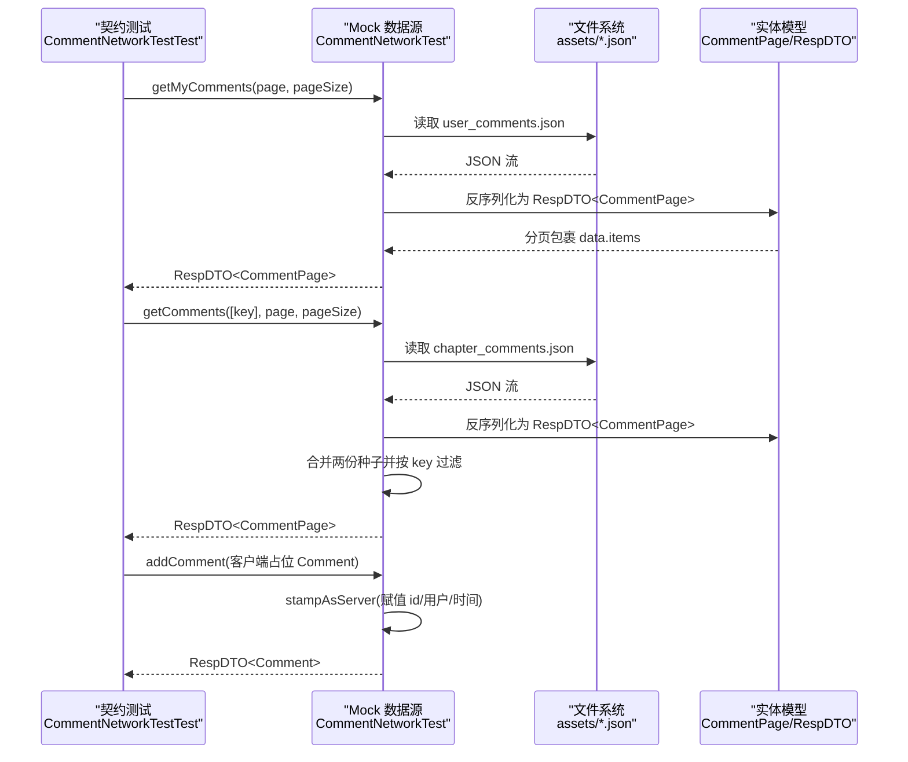
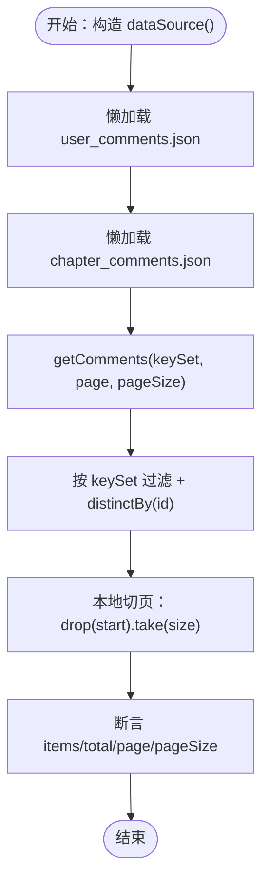
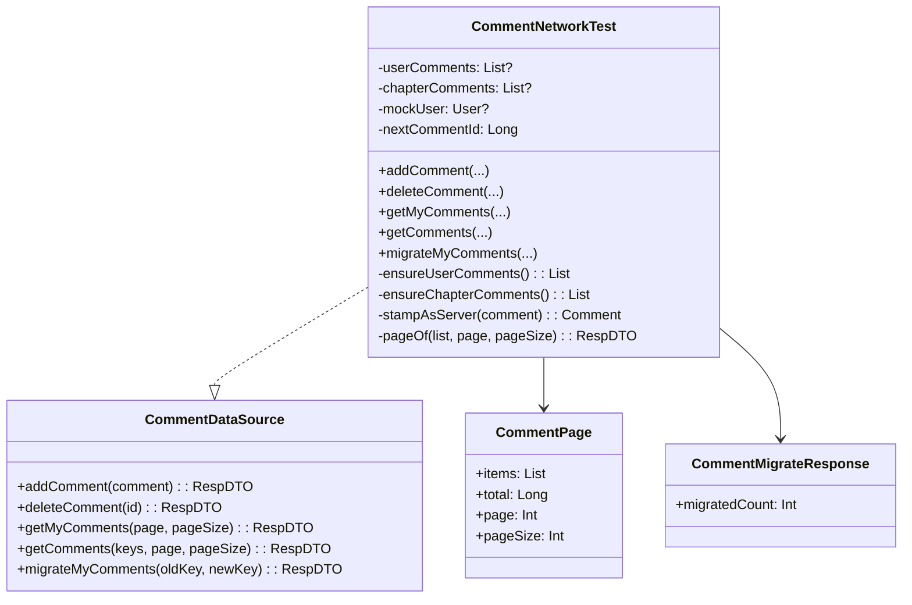
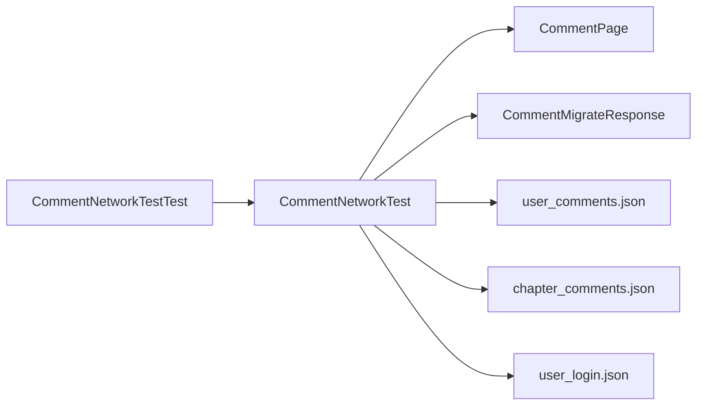

# 网络层集成测试

<cite>
**本文引用的文件**
- [CommentNetworkTestTest.kt](file://lib_ebook_api/src/test/java/com/ebook/api/service/comment/CommentNetworkTestTest.kt)
- [CommentNetworkTest.kt](file://lib_ebook_api/src/main/java/com/ebook/api/service/comment/CommentNetworkTest.kt)
- [CommentDataSource.kt](file://lib_ebook_api/src/main/java/com/ebook/api/service/comment/CommentDataSource.kt)
- [CommentPage.kt](file://lib_ebook_api/src/main/java/com/ebook/api/entity/CommentPage.kt)
- [CommentMigrate.kt](file://lib_ebook_api/src/main/java/com/ebook/api/entity/CommentMigrate.kt)
- [user_comments.json](file://lib_ebook_api/src/main/assets/user_comments.json)
- [chapter_comments.json](file://lib_ebook_api/src/main/assets/chapter_comments.json)
- [user_login.json](file://lib_ebook_api/src/main/assets/user_login.json)
</cite>

## 目录
1. [引言](#引言)
2. [项目结构](#项目结构)
3. [核心组件](#核心组件)
4. [架构总览](#架构总览)
5. [详细组件分析](#详细组件分析)
6. [依赖关系分析](#依赖关系分析)
7. [性能考量](#性能考量)
8. [故障排查指南](#故障排查指南)
9. [结论](#结论)
10. [附录：持续集成与契约变更检测](#附录持续集成与契约变更检测)

## 引言
本文件聚焦网络层集成测试策略，围绕 Retrofit 服务契约与资产验证展开，重点说明 CommentNetworkTestTest 的设计思路：以 mock 数据源、JSON 资产版本管理与响应格式契约验证为核心，确保“资产形态即解码类型”的一致性。文档同时覆盖评论聚合键 comment_key 的交叉对齐、用户身份一致性、分页完整性验证，以及 HTTP 方法、请求参数、响应断言等测试策略；并给出登录流程、评论 CRUD、分页查询的具体示例，最后说明在持续集成中如何执行网络测试、更新测试数据与检测 API 契约变更。

## 项目结构
本仓库采用多模块分层：网络契约与实体位于 lib_ebook_api，评论测试与 mock 实现同在该模块下；JSON 资产统一存放于该模块的 assets 目录，供单元测试通过文件系统读取，模拟真实 APK 内的资源。

**图示来源**
- [CommentDataSource.kt:15-34](file://lib_ebook_api/src/main/java/com/ebook/api/service/comment/CommentDataSource.kt#L15-L34)
- [CommentNetworkTest.kt:45-253](file://lib_ebook_api/src/main/java/com/ebook/api/service/comment/CommentNetworkTest.kt#L45-L253)
- [CommentPage.kt:11-18](file://lib_ebook_api/src/main/java/com/ebook/api/entity/CommentPage.kt#L11-L18)
- [CommentMigrate.kt:11-26](file://lib_ebook_api/src/main/java/com/ebook/api/entity/CommentMigrate.kt#L11-L26)
- [CommentNetworkTestTest.kt:27-332](file://lib_ebook_api/src/test/java/com/ebook/api/service/comment/CommentNetworkTestTest.kt#L27-L332)

**章节来源**
- [CommentDataSource.kt:15-34](file://lib_ebook_api/src/main/java/com/ebook/api/service/comment/CommentDataSource.kt#L15-L34)
- [CommentNetworkTest.kt:45-253](file://lib_ebook_api/src/main/java/com/ebook/api/service/comment/CommentNetworkTest.kt#L45-L253)
- [CommentPage.kt:11-18](file://lib_ebook_api/src/main/java/com/ebook/api/entity/CommentPage.kt#L11-L18)
- [CommentMigrate.kt:11-26](file://lib_ebook_api/src/main/java/com/ebook/api/entity/CommentMigrate.kt#L11-L26)
- [CommentNetworkTestTest.kt:27-332](file://lib_ebook_api/src/test/java/com/ebook/api/service/comment/CommentNetworkTestTest.kt#L27-L332)

## 核心组件
- 接口层（CommentDataSource）：定义评论读写、分页查询、迁移等能力，是真实后端与 mock 的共同契约。
- Mock 实现（CommentNetworkTest）：内存态维护两份评论种子列表（我的评论、章节评论），懒加载 JSON 资产，按 page/pageSize 本地切页，返回与服务端一致的 RespDTO<CommentPage>。
- 实体层（CommentPage、CommentMigrateResponse）：声明分页包裹结构与迁移响应字段，保证序列化边界与服务器一致。
- 契约测试（CommentNetworkTestTest）：以 JSON 资产为事实源，断言分页包裹形态、comment_key 交叉对齐、用户身份一致性、新增/删除/迁移行为、分页完整性和迁移计数等。

**章节来源**
- [CommentDataSource.kt:15-34](file://lib_ebook_api/src/main/java/com/ebook/api/service/comment/CommentDataSource.kt#L15-L34)
- [CommentNetworkTest.kt:65-172](file://lib_ebook_api/src/main/java/com/ebook/api/service/comment/CommentNetworkTest.kt#L65-L172)
- [CommentPage.kt:11-18](file://lib_ebook_api/src/main/java/com/ebook/api/entity/CommentPage.kt#L11-L18)
- [CommentMigrate.kt:11-26](file://lib_ebook_api/src/main/java/com/ebook/api/entity/CommentMigrate.kt#L11-L26)
- [CommentNetworkTestTest.kt:58-332](file://lib_ebook_api/src/test/java/com/ebook/api/service/comment/CommentNetworkTestTest.kt#L58-L332)

## 架构总览
CommentNetworkTestTest 通过自定义 TestAssetManager 将 Android assets 替换为文件系统读取，从而在纯 JVM 单元测试中直接消费 APK 内的 JSON 资产。CommentNetworkTest 作为被测对象，负责：
- 懒加载 user_comments.json 与 chapter_comments.json 到内存
- 按 comment_key 过滤并集查询
- 以服务端方式回显新增评论（id、用户信息、时间）
- 支持删除、迁移、分页切页

**图示来源**
- [CommentNetworkTestTest.kt:61-82](file://lib_ebook_api/src/test/java/com/ebook/api/service/comment/CommentNetworkTestTest.kt#L61-L82)
- [CommentNetworkTest.kt:102-116](file://lib_ebook_api/src/main/java/com/ebook/api/service/comment/CommentNetworkTest.kt#L102-L116)
- [CommentNetworkTest.kt:65-78](file://lib_ebook_api/src/main/java/com/ebook/api/service/comment/CommentNetworkTest.kt#L65-L78)
- [CommentNetworkTest.kt:180-195](file://lib_ebook_api/src/main/java/com/ebook/api/service/comment/CommentNetworkTest.kt#L180-L195)
- [CommentPage.kt:11-18](file://lib_ebook_api/src/main/java/com/ebook/api/entity/CommentPage.kt#L11-L18)

## 详细组件分析

### 契约测试设计：CommentNetworkTestTest
- 设计目标
  - 校验资产形态与解码类型一致（必须按 RespDTO<CommentPage> 解析）
  - 校验两份资产的 comment_key 交叉对齐，避免从“我的评论”进入评论区为空
  - 校验新增评论的服务端回显（id、用户、时间）与登录资产身份一致
  - 校验删除、迁移、分页等行为的正确性与完整性
- 关键断言点
  - 分页包裹：data 非空，items 数量、total、page、pageSize 合理
  - 聚合键：未知键过滤为空；热章种子超过客户端页大小能触发加载更多
  - 身份一致性：评论中的 username/nickname/id 与 user_login.json 同源
  - 迁移：仅影响当前用户；计数去重；旧键不留本人行；新键可查到迁来的行

**图示来源**
- [CommentNetworkTestTest.kt:86-113](file://lib_ebook_api/src/test/java/com/ebook/api/service/comment/CommentNetworkTestTest.kt#L86-L113)
- [CommentNetworkTest.kt:105-116](file://lib_ebook_api/src/main/java/com/ebook/api/service/comment/CommentNetworkTest.kt#L105-L116)
- [CommentNetworkTest.kt:157-172](file://lib_ebook_api/src/main/java/com/ebook/api/service/comment/CommentNetworkTest.kt#L157-L172)

**章节来源**
- [CommentNetworkTestTest.kt:58-332](file://lib_ebook_api/src/test/java/com/ebook/api/service/comment/CommentNetworkTestTest.kt#L58-L332)

### Mock 数据源：CommentNetworkTest
- 职责
  - 懒加载两份种子列表，首次访问后缓存
  - 新增评论时赋予服务端 id、用户信息与时间，并同步写入两份内存列表
  - 删除评论时从两份列表移除指定 id
  - 迁移评论时仅对当前用户匹配的行改键，按 id 去重计数
  - 分页使用 RespDTO<CommentPage> 返回，保持与服务端一致
- 并发与可见性
  - 使用 synchronized 保护内存态，避免多线程首查重复读资产与写冲突
- 身份来源
  - 复用 user_login.json 作为当前登录用户的唯一事实源，确保评论展示与门禁逻辑一致

**图示来源**
- [CommentDataSource.kt:15-34](file://lib_ebook_api/src/main/java/com/ebook/api/service/comment/CommentDataSource.kt#L15-L34)
- [CommentNetworkTest.kt:45-253](file://lib_ebook_api/src/main/java/com/ebook/api/service/comment/CommentNetworkTest.kt#L45-L253)
- [CommentPage.kt:11-18](file://lib_ebook_api/src/main/java/com/ebook/api/entity/CommentPage.kt#L11-L18)
- [CommentMigrate.kt:11-26](file://lib_ebook_api/src/main/java/com/ebook/api/entity/CommentMigrate.kt#L11-L26)

**章节来源**
- [CommentNetworkTest.kt:65-172](file://lib_ebook_api/src/main/java/com/ebook/api/service/comment/CommentNetworkTest.kt#L65-L172)
- [CommentNetworkTest.kt:180-224](file://lib_ebook_api/src/main/java/com/ebook/api/service/comment/CommentNetworkTest.kt#L180-L224)

### 资产文件管理
- 资产位置
  - user_comments.json：我的评论种子
  - chapter_comments.json：章节评论种子
  - user_login.json：当前登录用户身份
- 版本管理原则
  - 资产即契约：资产形态必须与解码类型一致（RespDTO<CommentPage>），否则反序列化异常会被上层吞掉，表现为“数据永远加载不出来”
  - 交叉对齐：两份资产的 comment_key 需保持一致，确保“我的评论”任意条目都能进入对应评论区
  - 身份一致性：评论中的用户名/昵称/uid 必须与 user_login.json 同源，否则“仅本人可删”门禁失效
- 分页完整性
  - 断言 total、page、pageSize 与实际 items 数量一致
  - 翻页不重叠且并集覆盖全集
  - 热章种子超过客户端页大小时，first.page=1 的 items 应填满 pageSize，total 指示还有更多

**章节来源**
- [user_comments.json:1-81](file://lib_ebook_api/src/main/assets/user_comments.json#L1-L81)
- [chapter_comments.json:1-903](file://lib_ebook_api/src/main/assets/chapter_comments.json#L1-L903)
- [user_login.json:1-15](file://lib_ebook_api/src/main/assets/user_login.json#L1-L15)
- [CommentNetworkTestTest.kt:201-244](file://lib_ebook_api/src/test/java/com/ebook/api/service/comment/CommentNetworkTestTest.kt#L201-L244)

### 网络请求测试策略
- HTTP 方法验证
  - 通过接口语义映射到 HTTP 动作（如 getMyComments → GET，addComment → POST），在契约测试中以调用顺序和返回值断言行为正确性
- 请求参数校验
  - 聚合键列表过滤：未知键应返回空结果；热章种子 key 应有大量评论
  - 分页参数：page/pageSize 限制本地切页范围，断言 items 数量与 total/page/pageSize 一致
- 响应数据断言
  - RespDTO 信封：code、error、data 存在且结构正确
  - 分页包裹：CommentPage.items/total/page/pageSize 符合预期
  - 新增评论：id 自增、用户信息来自登录资产、add_time 符合服务端格式

**章节来源**
- [CommentNetworkTestTest.kt:72-82](file://lib_ebook_api/src/test/java/com/ebook/api/service/comment/CommentNetworkTestTest.kt#L72-L82)
- [CommentNetworkTestTest.kt:117-144](file://lib_ebook_api/src/test/java/com/ebook/api/service/comment/CommentNetworkTestTest.kt#L117-L144)
- [CommentNetworkTestTest.kt:201-244](file://lib_ebook_api/src/test/java/com/ebook/api/service/comment/CommentNetworkTestTest.kt#L201-L244)

### 错误处理测试方法
- 网络异常
  - 在契约测试中通过 mock 行为暴露异常路径（例如资产缺失抛明确异常），确保上层不会静默失败
- 解析异常
  - 若资产形态与解码类型不一致，kotlinx.serialization 会抛 SerializationException；契约测试确保不会发生此类错配
- 业务异常
  - 未知聚合键返回空列表；迁移无匹配时计数为零；删除未命中时无副作用

**章节来源**
- [CommentNetworkTestTest.kt:107-113](file://lib_ebook_api/src/test/java/com/ebook/api/service/comment/CommentNetworkTestTest.kt#L107-L113)
- [CommentNetworkTestTest.kt:305-309](file://lib_ebook_api/src/test/java/com/ebook/api/service/comment/CommentNetworkTestTest.kt#L305-L309)
- [CommentNetworkTest.kt:229-235](file://lib_ebook_api/src/main/java/com/ebook/api/service/comment/CommentNetworkTest.kt#L229-L235)

### 具体网络集成测试示例
- 登录流程测试
  - 从 user_login.json 提取当前用户身份，断言后续评论的用户信息与之一致
- 评论 CRUD 操作测试
  - 新增：连续两条评论分配不同 id，且高于种子 id 段；发表后出现在“我的评论”与对应章节评论
  - 删除：删除后不再出现在“我的评论”或章节评论
  - 迁移：仅迁移当前用户的旧键到新键，计数去重，旧键不再包含本人行
- 分页查询测试
  - 两页之间不重叠；翻到底部时 total 等于已取到的去重数量；热章种子超过客户端页大小时 first.page 填满 pageSize

**章节来源**
- [CommentNetworkTestTest.kt:117-171](file://lib_ebook_api/src/test/java/com/ebook/api/service/comment/CommentNetworkTestTest.kt#L117-L171)
- [CommentNetworkTestTest.kt:176-197](file://lib_ebook_api/src/test/java/com/ebook/api/service/comment/CommentNetworkTestTest.kt#L176-L197)
- [CommentNetworkTestTest.kt:201-244](file://lib_ebook_api/src/test/java/com/ebook/api/service/comment/CommentNetworkTestTest.kt#L201-L244)
- [CommentNetworkTestTest.kt:249-309](file://lib_ebook_api/src/test/java/com/ebook/api/service/comment/CommentNetworkTestTest.kt#L249-L309)

## 依赖关系分析
- 测试依赖 mock 实现，mock 依赖实体与资产
- 实体提供分页与迁移响应的稳定结构，确保序列化边界不变
- 资产提供固定种子数据，作为契约测试的事实源

**图示来源**
- [CommentNetworkTestTest.kt:27-332](file://lib_ebook_api/src/test/java/com/ebook/api/service/comment/CommentNetworkTestTest.kt#L27-L332)
- [CommentNetworkTest.kt:45-253](file://lib_ebook_api/src/main/java/com/ebook/api/service/comment/CommentNetworkTest.kt#L45-L253)
- [CommentPage.kt:11-18](file://lib_ebook_api/src/main/java/com/ebook/api/entity/CommentPage.kt#L11-L18)
- [CommentMigrate.kt:11-26](file://lib_ebook_api/src/main/java/com/ebook/api/entity/CommentMigrate.kt#L11-L26)

**章节来源**
- [CommentNetworkTestTest.kt:27-332](file://lib_ebook_api/src/test/java/com/ebook/api/service/comment/CommentNetworkTestTest.kt#L27-L332)
- [CommentNetworkTest.kt:45-253](file://lib_ebook_api/src/main/java/com/ebook/api/service/comment/CommentNetworkTest.kt#L45-L253)

## 性能考量
- 懒加载种子：首次访问才读取资产，避免不必要的 I/O
- 本地切页：在内存中对已加载数据进行 drop/take，减少额外请求
- 并发安全：synchronized 保护内存态，避免重复加载与写冲突
- 建议优化
  - 对超大资产考虑分片加载或按需解析
  - 缓存序列化配置（Json 实例）以减少开销

[本节为通用指导，无需特定文件引用]

## 故障排查指南
- 症状：评论页面永远加载不出来
  - 可能原因：资产形态与解码类型不一致（例如误用 List<Comment> 而非 CommentPage），导致反序列化异常被上层吞掉
  - 定位方法：检查 CommentNetworkTestTest 的分页包裹断言与资产内容是否匹配
- 症状：无法删除本人评论
  - 可能原因：评论中的用户信息与登录资产不一致，导致门禁判断失败
  - 定位方法：核对 user_login.json 与评论资产中的 username/id/nickname
- 症状：迁移计数异常
  - 可能原因：未对两份内存列表同时迁移或未去重计数
  - 定位方法：检查 migrateMyComments 的实现与 CommentNetworkTestTest 的迁移断言

**章节来源**
- [CommentNetworkTestTest.kt:58-82](file://lib_ebook_api/src/test/java/com/ebook/api/service/comment/CommentNetworkTestTest.kt#L58-L82)
- [CommentNetworkTestTest.kt:130-159](file://lib_ebook_api/src/test/java/com/ebook/api/service/comment/CommentNetworkTestTest.kt#L130-L159)
- [CommentNetworkTestTest.kt:249-309](file://lib_ebook_api/src/test/java/com/ebook/api/service/comment/CommentNetworkTestTest.kt#L249-L309)
- [CommentNetworkTest.kt:118-155](file://lib_ebook_api/src/main/java/com/ebook/api/service/comment/CommentNetworkTest.kt#L118-L155)

## 结论
CommentNetworkTestTest 以 JSON 资产为事实源，严格约束了评论系统的分页、聚合键、身份与迁移行为，确保 mock 与服务端契约一致。通过懒加载、本地切页与并发安全，兼顾了测试稳定性与性能。配合持续集成的自动化执行，可在 API 契约变化时快速发现回归问题。

[本节为总结性内容，无需特定文件引用]

## 附录：持续集成与契约变更检测
- 测试执行
  - 在 CI 中运行单元测试：./gradlew test
  - 针对 lib_ebook_api 模块执行：./gradlew :lib_ebook_api:test
- 测试数据更新
  - 当服务端返回结构变化（如分页包裹字段调整），优先更新 CommentPage 及对应 JSON 资产，再同步更新 CommentNetworkTestTest 断言
  - 新增或修改评论种子时，保持两份资产的 comment_key 交叉对齐，并确保 user_login.json 身份一致
- 契约变更检测
  - 使用契约测试强制校验 RespDTO<CommentPage> 形态与字段
  - 对迁移接口增加断言：migratedCount 去重、旧键不留本人行、新键可查迁来行
  - 对分页断言：翻页不重叠、并集覆盖全集、total 与实取去重数一致

[本节为流程性内容，无需特定文件引用]