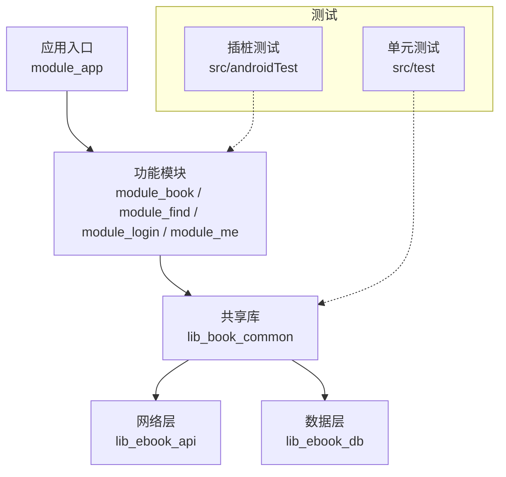
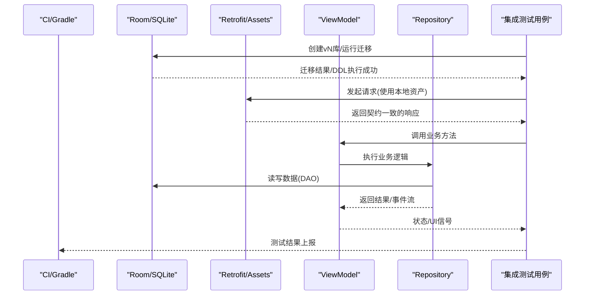
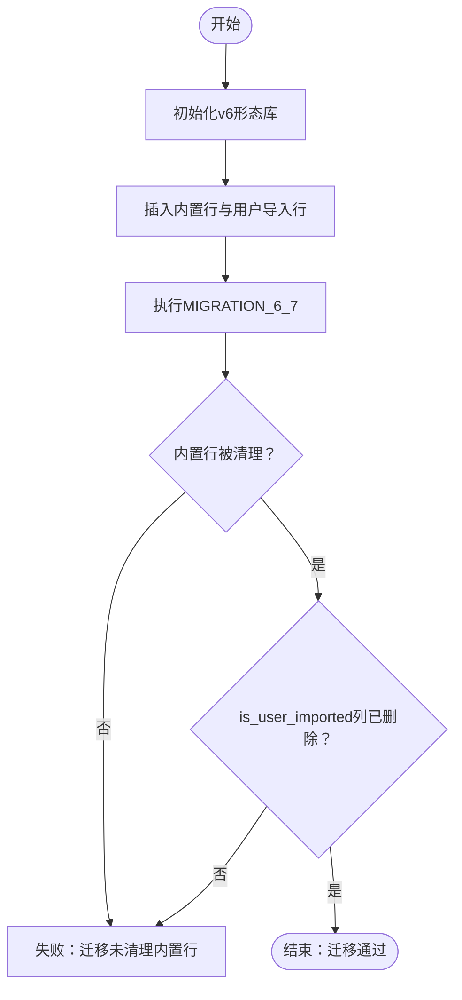
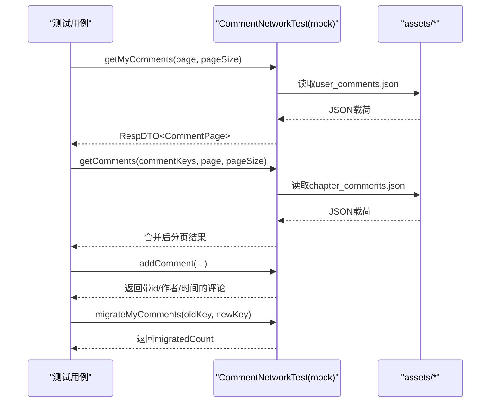
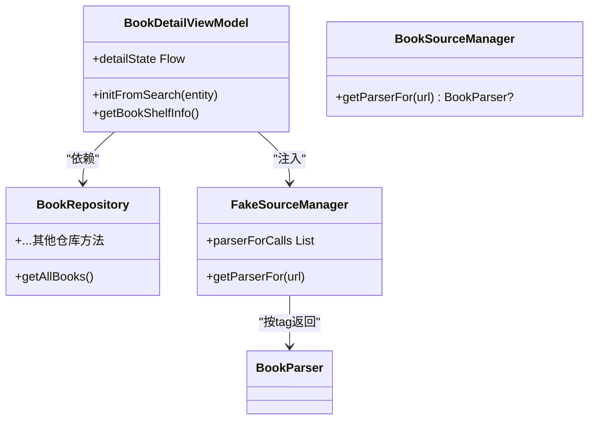
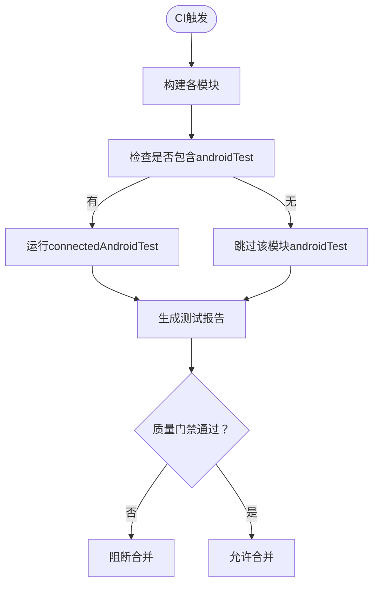
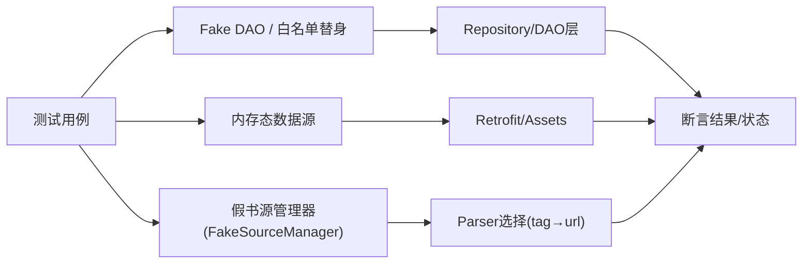
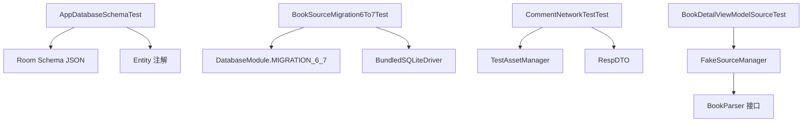

# 集成测试

<cite>
**本文引用的文件**
- [AppDatabaseSchemaTest.kt](file://lib_ebook_db/src/test/java/com/ebook/db/AppDatabaseSchemaTest.kt)
- [BookSourceMigration6To7Test.kt](file://lib_ebook_db/src/test/java/com/ebook/db/BookSourceMigration6To7Test.kt)
- [CommentNetworkTestTest.kt](file://lib_ebook_api/src/test/java/com/ebook/api/service/comment/CommentNetworkTestTest.kt)
- [BookRepositoryTest.kt](file://lib_book_common/src/test/java/com/ebook/common/repository/BookRepositoryTest.kt)
- [BookDetailViewModelSourceTest.kt](file://module_book/src/test/java/com/ebook/book/mvvm/viewmodel/BookDetailViewModelSourceTest.kt)
- [AndroidInstrumentedTests.kt](file://build-logic/convention/src/main/kotlin/com/xrn1997/convention/AndroidInstrumentedTests.kt)
- [gradle.properties](file://gradle.properties)
- [test-coverage-todo.md](file://docs/test-coverage-todo.md)
</cite>

## 目录
1. [引言](#引言)
2. [项目结构](#项目结构)
3. [核心组件](#核心组件)
4. [架构总览](#架构总览)
5. [详细组件分析](#详细组件分析)
6. [依赖分析](#依赖分析)
7. [性能考虑](#性能考虑)
8. [故障排查指南](#故障排查指南)
9. [结论](#结论)
10. [附录](#附录)

## 引言
本文件聚焦本项目中的“集成测试”实践，覆盖数据库、网络层、组件间集成、持续集成与 Mock 数据源等关键维度。目标是为读者提供一套可落地的测试策略：如何验证真实 SQL 执行、如何进行 Retrofit 契约测试、如何保证 ViewModel 与 Repository 的集成正确性、如何在 CI 中稳定执行并产出报告与质量门禁，以及如何用内存数据源与假对象高效构造测试场景。

## 项目结构
仓库采用多模块 Gradle 工程，业务功能按模块拆分（module_app/module_main/module_book/module_find/module_login/module_me），基础能力下沉到共享库（lib_book_common/lib_book_source/lib_ebook_api/lib_ebook_db）。测试分布在对应模块的 src/test（纯 JVM）与 src/androidTest（插桩测试）下；构建约定插件统一了测试开关与产物输出。

**章节来源**
- [gradle.properties:21-29](file://gradle.properties#L21-L29)
- [AndroidInstrumentedTests.kt:22-35](file://build-logic/convention/src/main/kotlin/com/xrn1997/convention/AndroidInstrumentedTests.kt#L22-L35)

## 核心组件
- Room 数据库迁移与 schema 契约测试：通过导出 schema JSON 与真 SQLite 引擎驱动迁移，锁定建表语句、列变更与迁移行为一致性。
- 网络层契约测试：以本地资产为固定输入，断言响应解码类型、分页、身份回显与迁移接口行为，确保 mock 与后端契约一致。
- 组件间集成测试：在 VM 层注入假 DAO/仓库，隔离外部依赖，断言跨模块协作的正确性与错误态收敛。
- 持续集成与自动化：基于 Gradle 任务与约定插件，启用/禁用不必要的插桩测试，配合 CI 流程产出报告与门禁。
- Mock 数据源：内存态实现、资产契约、假对象与白名单 DAO 替身，用于快速、稳定的集成验证。

**章节来源**
- [AppDatabaseSchemaTest.kt:14-39](file://lib_ebook_db/src/test/java/com/ebook/db/AppDatabaseSchemaTest.kt#L14-L39)
- [BookSourceMigration6To7Test.kt:20-57](file://lib_ebook_db/src/test/java/com/ebook/db/BookSourceMigration6To7Test.kt#L20-L57)
- [CommentNetworkTestTest.kt:16-26](file://lib_ebook_api/src/test/java/com/ebook/api/service/comment/CommentNetworkTestTest.kt#L16-L26)
- [BookDetailViewModelSourceTest.kt:50-63](file://module_book/src/test/java/com/ebook/book/mvvm/viewmodel/BookDetailViewModelSourceTest.kt#L50-L63)

## 架构总览
下图展示集成测试在各层的协作关系：数据库迁移由 Robolectric + BundledSQLiteDriver 直接驱动真实 SQL；网络层以资产替代远端；VM 层通过假 DAO/仓库完成端到端路径验证；CI 通过约定插件控制测试范围与执行。

**图表来源**
- [AppDatabaseSchemaTest.kt:99-112](file://lib_ebook_db/src/test/java/com/ebook/db/AppDatabaseSchemaTest.kt#L99-L112)
- [BookSourceMigration6To7Test.kt:94-124](file://lib_ebook_db/src/test/java/com/ebook/db/BookSourceMigration6To7Test.kt#L94-L124)
- [CommentNetworkTestTest.kt:58-82](file://lib_ebook_api/src/test/java/com/ebook/api/service/comment/CommentNetworkTestTest.kt#L58-L82)
- [BookDetailViewModelSourceTest.kt:126-152](file://module_book/src/test/java/com/ebook/book/mvvm/viewmodel/BookDetailViewModelSourceTest.kt#L126-L152)

## 详细组件分析

### 数据库集成测试（Room 迁移与 Schema 契约）
- 目标
  - 校验 Room 导出的 schema JSON 链条完整且无多余版本。
  - 校验实体默认值与 schema 声明一致。
  - 校验迁移 SQL 在生产同款引擎上执行正确（如删除列、清空内置行）。
- 关键点
  - 使用 Robolectric + BundledSQLiteDriver 在 JVM 单测中驱动真实 SQLite，避免框架驱动版本差异导致误判。
  - 对 v6→v7 迁移进行“先清内置行再删列”的行为回归测试，确保顺序与约束不可颠倒。
  - 通过 PRAGMA 与 SELECT sqlite_version() 建立环境前置守卫，明确用例前提。
- 最佳实践
  - 每次改实体必须同步更新迁移链与 schema JSON，并由本类测试拦截遗漏。
  - 将迁移逻辑暴露给测试（internal 可见），以便独立于 Room 装配链路验证行为。

**图表来源**
- [BookSourceMigration6To7Test.kt:94-124](file://lib_ebook_db/src/test/java/com/ebook/db/BookSourceMigration6To7Test.kt#L94-L124)

**章节来源**
- [AppDatabaseSchemaTest.kt:99-208](file://lib_ebook_db/src/test/java/com/ebook/db/AppDatabaseSchemaTest.kt#L99-L208)
- [BookSourceMigration6To7Test.kt:62-209](file://lib_ebook_db/src/test/java/com/ebook/db/BookSourceMigration6To7Test.kt#L62-L209)

### 网络层集成测试（Retrofit 服务与资产契约）
- 目标
  - 断言 mock 数据源的资产形态与解码类型一致（例如 RespDTO<CommentPage> 包裹）。
  - 校验两份资产之间的聚合键交叉对齐（我的评论与章节评论）。
  - 验证新增评论的身份回显、时间格式与 ID 分配不冲突。
  - 校验迁移接口按 commentKey 批量替换的正确性与计数。
- 关键点
  - 使用文件系统版 TestAssetManager 直读 src/main/assets，确保测试的是真实资产而非拷贝样本。
  - 分页切页断言：页间不重叠、并集覆盖全集、total 与实取去重数一致。
  - 对未知聚合键严格过滤，防止串数据。
- 最佳实践
  - 任何服务端契约变化必须同步更新资产与契约测试，否则会被静默吞掉（如 SerializationException 被上层捕获为“未知错误”）。

**图表来源**
- [CommentNetworkTestTest.kt:58-113](file://lib_ebook_api/src/test/java/com/ebook/api/service/comment/CommentNetworkTestTest.kt#L58-L113)
- [CommentNetworkTestTest.kt:115-171](file://lib_ebook_api/src/test/java/com/ebook/api/service/comment/CommentNetworkTestTest.kt#L115-L171)
- [CommentNetworkTestTest.kt:246-309](file://lib_ebook_api/src/test/java/com/ebook/api/service/comment/CommentNetworkTestTest.kt#L246-L309)

**章节来源**
- [CommentNetworkTestTest.kt:29-82](file://lib_ebook_api/src/test/java/com/ebook/api/service/comment/CommentNetworkTestTest.kt#L29-L82)
- [CommentNetworkTestTest.kt:84-171](file://lib_ebook_api/src/test/java/com/ebook/api/service/comment/CommentNetworkTestTest.kt#L84-L171)
- [CommentNetworkTestTest.kt:199-309](file://lib_ebook_api/src/test/java/com/ebook/api/service/comment/CommentNetworkTestTest.kt#L199-L309)

### 组件间集成测试（ViewModel 与 Repository、跨模块通信）
- 目标
  - 断言详情页按书 tag 取 parser，全局默认源不被误用。
  - 当书源失效或目录解析失败时，页面应进入错误态并关闭 loading。
  - 通过“白名单空库”DAO 替身限制被测路径，确保只调用预期方法。
- 关键点
  - 使用 Proxy.newProxyInstance 生成 DAO 替身，白名单内允许调用，其余抛错，避免静默失败掩盖真实问题。
  - 针对异步与 IO 协程，使用 StandardTestDispatcher 与 awaitUntil 等待可观察状态，避免竞态导致的假绿。
- 最佳实践
  - 每个用例只关注最小职责，假件尽量窄化实现面，减少无关耦合。
  - 对于资源访问（string 资源等）需要 Robolectric Context，确保 UI 相关分支可走通。

**图表来源**
- [BookDetailViewModelSourceTest.kt:88-105](file://module_book/src/test/java/com/ebook/book/mvvm/viewmodel/BookDetailViewModelSourceTest.kt#L88-L105)
- [BookDetailViewModelSourceTest.kt:197-255](file://module_book/src/test/java/com/ebook/book/mvvm/viewmodel/BookDetailViewModelSourceTest.kt#L197-L255)

**章节来源**
- [BookDetailViewModelSourceTest.kt:126-187](file://module_book/src/test/java/com/ebook/book/mvvm/viewmodel/BookDetailViewModelSourceTest.kt#L126-L187)
- [BookDetailViewModelSourceTest.kt:189-255](file://module_book/src/test/java/com/ebook/book/mvvm/viewmodel/BookDetailViewModelSourceTest.kt#L189-L255)

### 持续集成中的测试执行
- 目标
  - 在 CI 中仅编译与运行必要的 Android 插桩测试（无 androidTest 的模块自动跳过）。
  - 通过 Gradle 任务组织测试，结合 gradle.properties 控制 isModule 构建形态。
- 关键点
  - 约定插件 disableUnnecessaryAndroidTests 在变体构建前检查是否存在 androidTest 目录，若无则禁用该模块的 androidTest，减少无效安装与执行。
  - 根 gradle.properties 中 isModule=false 表示集成构建，功能模块作为 library 被 app 依赖；独立调试临时改为 true 时注意不要提交。
- 最佳实践
  - 在 CI 脚本中分别执行 test 与 connectedAndroidTest，并将产物上传至报告平台；对失败用例提供详细日志与 APK 产物。

**图表来源**
- [AndroidInstrumentedTests.kt:22-35](file://build-logic/convention/src/main/kotlin/com/xrn1997/convention/AndroidInstrumentedTests.kt#L22-L35)
- [gradle.properties:21-29](file://gradle.properties#L21-L29)

**章节来源**
- [AndroidInstrumentedTests.kt:22-35](file://build-logic/convention/src/main/kotlin/com/xrn1997/convention/AndroidInstrumentedTests.kt#L22-L35)
- [gradle.properties:21-29](file://gradle.properties#L21-L29)

### Mock 数据源与假对象
- 内存数据源
  - 评论侧 CommentNetworkTestTest 以 assets 为固定输入，模拟分页、聚合键、身份回显与迁移接口行为，形成契约测试闭环。
- 测试数据准备
  - 使用 TemporaryFolder 隔离书籍根目录，避免用例之间互相污染；对章节内容、缓存目录进行精确控制。
- 假对象创建
  - 通过 Proxy.newProxyInstance 生成 DAO 替身，白名单模式限制调用路径；FakeSourceManager 窄化实现 BookParser 的最小集合，便于断言调用次数与参数。
- 最佳实践
  - 所有写操作（如删除、迁移）必须保证幂等与事务性；在读多写少场景优先使用内存态假件提升稳定性。

**图表来源**
- [BookDetailViewModelSourceTest.kt:189-255](file://module_book/src/test/java/com/ebook/book/mvvm/viewmodel/BookDetailViewModelSourceTest.kt#L189-L255)
- [BookRepositoryTest.kt:53-82](file://lib_book_common/src/test/java/com/ebook/common/repository/BookRepositoryTest.kt#L53-L82)

**章节来源**
- [BookRepositoryTest.kt:53-82](file://lib_book_common/src/test/java/com/ebook/common/repository/BookRepositoryTest.kt#L53-L82)
- [BookDetailViewModelSourceTest.kt:189-255](file://module_book/src/test/java/com/ebook/book/mvvm/viewmodel/BookDetailViewModelSourceTest.kt#L189-L255)

## 依赖分析
- 组件耦合与内聚
  - 数据库迁移测试强依赖 BundledSQLiteDriver 与 Robolectric，保持与生产引擎一致，降低环境漂移风险。
  - 网络契约测试依赖 assets 与序列化配置，要求资产与 DTO 同构，避免静默失败。
  - VM 测试依赖假 DAO/仓库，保持高内聚低耦合，聚焦业务逻辑与错误态收敛。
- 直接/间接依赖
  - AppDatabaseSchemaTest → Room schema JSON → 实体注解；BookSourceMigration6To7Test → DatabaseModule.MIGRATION_6_7 → SQLiteConnection。
  - CommentNetworkTestTest → TestAssetManager → assets → 反序列化为 RespDTO<T>。
  - BookDetailViewModelSourceTest → FakeSourceManager → BookParser 接口 → 详情页流程。
- 外部依赖与集成点
  - Robolectric 提供 Android 上下文与资源；BundledSQLiteDriver 提供桌面端原生 SQLite；Gradle 约定插件管理测试启停。

**图表来源**
- [AppDatabaseSchemaTest.kt:99-208](file://lib_ebook_db/src/test/java/com/ebook/db/AppDatabaseSchemaTest.kt#L99-L208)
- [BookSourceMigration6To7Test.kt:94-124](file://lib_ebook_db/src/test/java/com/ebook/db/BookSourceMigration6To7Test.kt#L94-L124)
- [CommentNetworkTestTest.kt:58-113](file://lib_ebook_api/src/test/java/com/ebook/api/service/comment/CommentNetworkTestTest.kt#L58-L113)
- [BookDetailViewModelSourceTest.kt:126-187](file://module_book/src/test/java/com/ebook/book/mvvm/viewmodel/BookDetailViewModelSourceTest.kt#L126-L187)

**章节来源**
- [AppDatabaseSchemaTest.kt:99-208](file://lib_ebook_db/src/test/java/com/ebook/db/AppDatabaseSchemaTest.kt#L99-L208)
- [BookSourceMigration6To7Test.kt:94-124](file://lib_ebook_db/src/test/java/com/ebook/db/BookSourceMigration6To7Test.kt#L94-L124)
- [CommentNetworkTestTest.kt:58-113](file://lib_ebook_api/src/test/java/com/ebook/api/service/comment/CommentNetworkTestTest.kt#L58-L113)
- [BookDetailViewModelSourceTest.kt:126-187](file://module_book/src/test/java/com/ebook/book/mvvm/viewmodel/BookDetailViewModelSourceTest.kt#L126-L187)

## 性能考虑
- 数据库迁移测试使用 BundledSQLiteDriver 在 JVM 上执行真实 SQL，避免了设备差异带来的不确定性，但需注意迁移复杂度与行数规模对执行时间的影响。
- 网络契约测试以本地资产为输入，避免网络抖动；分页与聚合查询需在用例中合理设置 pageSize，缩短执行时间。
- VM 测试通过假件与白名单 DAO 替身减少 IO 与网络开销；对异步协程使用虚拟时钟与 awaitUntil，避免真实线程竞争导致的 flaky。

[本节提供通用指导，无需特定文件引用]

## 故障排查指南
- 常见问题
  - 迁移失败：确认 SQLite 版本满足 DROP COLUMN 语法门槛；检查迁移语句顺序与约束。
  - 资产契约不一致：核对 RespDTO 包裹形态、字段命名与时间格式；确保资产与 DTO 同步更新。
  - VM 测试假绿：使用白名单 DAO 替身定位异常调用；增加 awaitUntil 等待可观察状态。
- 定位方法
  - 查看迁移前后表结构与列名（PRAGMA table_info）。
  - 对比两份资产的聚合键交集与差集，确保“我的评论”能点进评论区。
  - 在 VM 测试中记录 parser 调用栈与次数，确认按 tag 路由。

**章节来源**
- [BookSourceMigration6To7Test.kt:165-195](file://lib_ebook_db/src/test/java/com/ebook/db/BookSourceMigration6To7Test.kt#L165-L195)
- [CommentNetworkTestTest.kt:84-113](file://lib_ebook_api/src/test/java/com/ebook/api/service/comment/CommentNetworkTestTest.kt#L84-L113)
- [BookDetailViewModelSourceTest.kt:189-255](file://module_book/src/test/java/com/ebook/book/mvvm/viewmodel/BookDetailViewModelSourceTest.kt#L189-L255)

## 结论
本项目在数据库、网络层与组件间集成测试方面已形成成熟体系：通过 schema 契约与真实 SQL 迁移验证数据一致性；以资产契约测试锁定网络层行为；借助假件与白名单 DAO 替身保障 VM 层集成正确性；并通过约定插件与 Gradle 任务实现 CI 自动化与质量门禁。未来可进一步补齐 UI 测试与下载队列重试的自动化覆盖，完善端到端与性能基线测试。

[本节总结整体发现，无需特定文件引用]

## 附录
- 待办与人工验证项参见测试覆盖清单，包含下载队列、Compose UI 测试、权限回归等需设备侧验证的内容。

**章节来源**
- [test-coverage-todo.md:1-150](file://docs/test-coverage-todo.md#L1-L150)