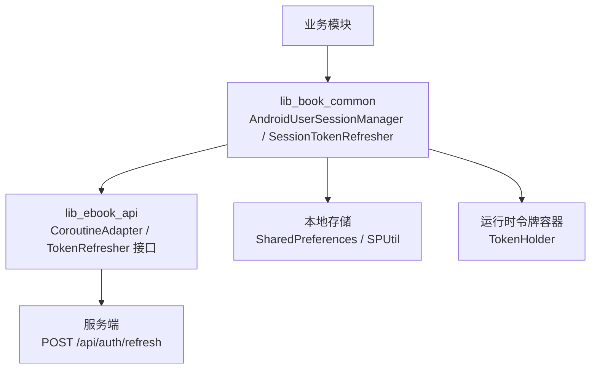
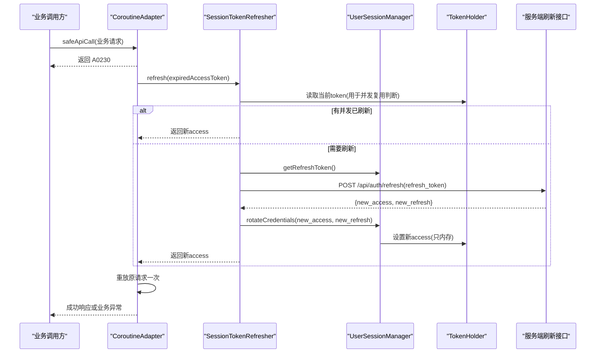
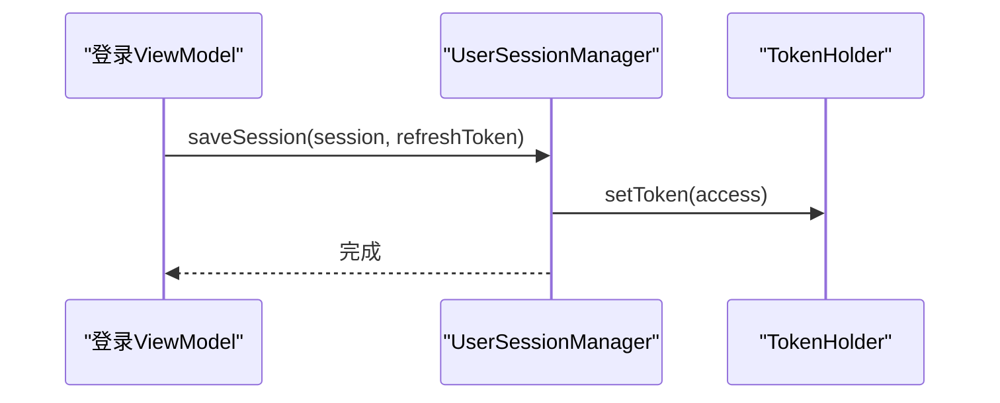
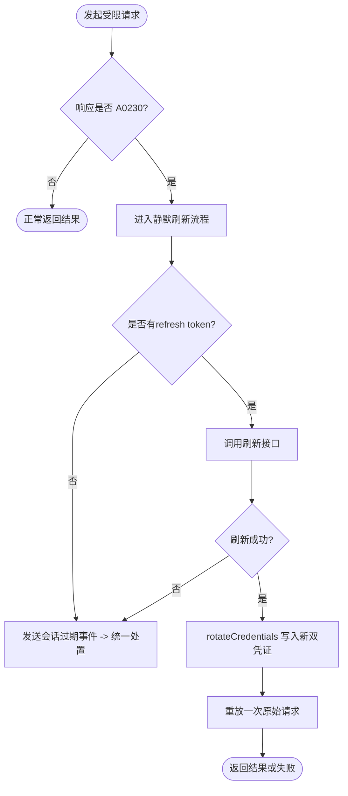
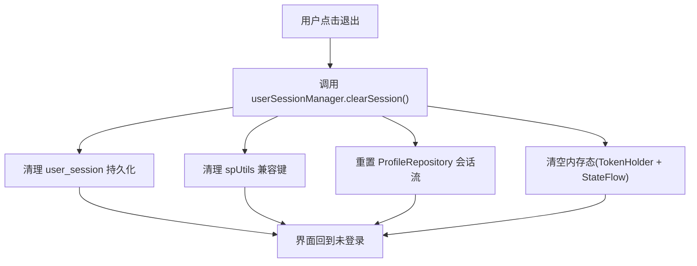
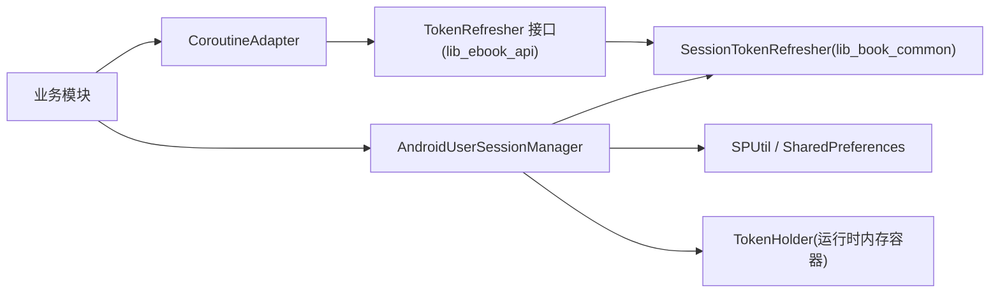

# Token管理机制

<cite>
**本文引用的文件**   
- [AndroidUserSessionManager.kt](file://lib_book_common/src/main/java/com/ebook/common/domain/AndroidUserSessionManager.kt)
- [UserSessionManager.kt](file://lib_book_common/src/main/java/com/ebook/common/domain/UserSessionManager.kt)
- [UserSession.kt](file://lib_book_common/src/main/java/com/ebook/common/domain/UserSession.kt)
- [SessionTokenRefresher.kt](file://lib_book_common/src/main/java/com/ebook/common/domain/SessionTokenRefresher.kt)
- [TokenRefresher.kt](file://lib_ebook_api/src/main/java/com/ebook/api/auth/TokenRefresher.kt)
- [CoroutineAdapter.kt](file://lib_ebook_api/src/main/java/com/ebook/api/utils/CoroutineAdapter.kt)
- [SPUtil.kt](file://lib_book_common/src/main/java/com/ebook/common/util/SPUtil.kt)
- [SessionModule.kt](file://lib_book_common/src/main/java/com/ebook/common/di/SessionModule.kt)
- [0011-token-identity-decoupling-token-only-refresh.md](file://docs/adr/0011-token-identity-decoupling-token-only-refresh.md)
- [0010-silent-refresh-seam-and-session-expiry-bus.md](file://docs/adr/0010-silent-refresh-seam-and-session-expiry-bus.md)
</cite>

## 目录
1. [引言](#引言)
2. [项目结构中的相关位置](#项目结构中的相关位置)
3. [核心组件与职责](#核心组件与职责)
4. [架构总览：双Token与静默刷新](#架构总览双token与静默刷新)
5. [关键流程时序图](#关键流程时序图)
6. [详细组件分析](#详细组件分析)
7. [依赖关系分析](#依赖关系分析)
8. [性能与安全考虑](#性能与安全考虑)
9. [故障排查指南](#故障排查指南)
10. [结论](#结论)

## 引言
本文围绕“双Token架构”（access token + refresh token）的客户端实现，系统性解释：
- access token为何仅驻内存并通过单例容器对外暴露；
- refresh token的持久化与轮换策略；
- 过期检测与静默刷新如何与业务请求耦合；
- “凭证与身份解耦”的设计取舍；
- 安全存储、并发互斥、异常恢复与性能优化要点。

## 项目结构中的相关位置
与Token管理直接相关的代码分布在以下模块与文件中：
- lib_book_common：会话管理与刷新实现（持久化、旋转、协调网络层接缝）
- lib_ebook_api：网络侧统一适配与过期处置、Token刷新接口定义
- ADR文档：契约、事件总线与刷新策略的决策依据

图表来源
- [AndroidUserSessionManager.kt:17-162](file://lib_book_common/src/main/java/com/ebook/common/domain/AndroidUserSessionManager.kt#L17-L162)
- [SessionTokenRefresher.kt:15-96](file://lib_book_common/src/main/java/com/ebook/common/domain/SessionTokenRefresher.kt#L15-L96)
- [TokenRefresher.kt:1-27](file://lib_ebook_api/src/main/java/com/ebook/api/auth/TokenRefresher.kt#L1-L27)
- [CoroutineAdapter.kt:17-150](file://lib_ebook_api/src/main/java/com/ebook/api/utils/CoroutineAdapter.kt#L17-L150)

章节来源
- [AndroidUserSessionManager.kt:1-162](file://lib_book_common/src/main/java/com/ebook/common/domain/AndroidUserSessionManager.kt#L1-L162)
- [UserSessionManager.kt:1-63](file://lib_book_common/src/main/java/com/ebook/common/domain/UserSessionManager.kt#L1-L63)
- [SessionTokenRefresher.kt:1-96](file://lib_book_common/src/main/java/com/ebook/common/domain/SessionTokenRefresher.kt#L1-L96)
- [TokenRefresher.kt:1-27](file://lib_ebook_api/src/main/java/com/ebook/api/auth/TokenRefresher.kt#L1-L27)
- [CoroutineAdapter.kt:17-150](file://lib_ebook_api/src/main/java/com/ebook/api/utils/CoroutineAdapter.kt#L17-L150)

## 核心组件与职责
- AndroidUserSessionManager：会话状态管理器（登录、登出、保存与轮换凭证），负责内存状态、持久化以及与外部 TokenHolder 的同步。
- UserSessionManager：无平台依赖的会话抽象接口，隔离实现细节，提供 saveSession、rotateCredentials、clearSession 等统一语义。
- UserSession：登录会话的轻量数据载体，区分身份字段与仅用于建立会话的临时刷新凭据。
- SessionTokenRefresher：实现 TokenRefresher 接缝，封装静默刷新逻辑（并发互斥、旧值失效、新旧替换）。
- CoroutineAdapter：所有仓库网络请求的统一入口，负责识别 A0230 过期并触发静默刷新或会话过期事件。
- SPUtil：SharedPreferences 工具封装，集中处理认证相关键的读写与清理。
- TokenHolder：来自共享库 lib_common 的运行时内存容器（单例），存放当前有效的 access token，供拦截器使用。

章节来源
- [UserSessionManager.kt:1-63](file://lib_book_common/src/main/java/com/ebook/common/domain/UserSessionManager.kt#L1-L63)
- [AndroidUserSessionManager.kt:17-162](file://lib_book_common/src/main/java/com/ebook/common/domain/AndroidUserSessionManager.kt#L17-L162)
- [UserSession.kt:1-17](file://lib_book_common/src/main/java/com/ebook/common/domain/UserSession.kt#L1-L17)
- [SessionTokenRefresher.kt:15-96](file://lib_book_common/src/main/java/com/ebook/common/domain/SessionTokenRefresher.kt#L15-L96)
- [CoroutineAdapter.kt:17-150](file://lib_ebook_api/src/main/java/com/ebook/api/utils/CoroutineAdapter.kt#L17-L150)
- [SPUtil.kt:1-93](file://lib_book_common/src/main/java/com/ebook/common/util/SPUtil.kt#L1-L93)

## 架构总览：双Token与静默刷新
- 双Token角色分工：
  - access token：短期有效，每次请求携带，仅驻内存（通过 TokenHolder 在进程内流转），不在本地磁盘持久化，减少暴露面。
  - refresh token：长期有效，持久化于 SharedPreferences，用于静默刷新生成新双 token。
- 启动恢复与首请求轮换：冷启动后 access token 为空，首个带鉴权的请求若返回 A0230，将使用 refresh token 静默刷新得到新 access token 并重放一次。
- 凭证与身份解耦：刷新端点仅返回新的凭证（access、refresh），不回填用户资料；因此轮换只更新凭证，不覆盖身份信息，避免误写昵称、头像等。
- 全局唯一过期出口：A0230 在 CoroutineAdapter 中收敛，刷新失败即发射「会话过期」事件，由主页统一清会话、提示并跳转。

图表来源
- [CoroutineAdapter.kt:41-150](file://lib_ebook_api/src/main/java/com/ebook/api/utils/CoroutineAdapter.kt#L41-L150)
- [SessionTokenRefresher.kt:42-96](file://lib_book_common/src/main/java/com/ebook/common/domain/SessionTokenRefresher.kt#L42-L96)
- [UserSessionManager.kt:1-63](file://lib_book_common/src/main/java/com/ebook/common/domain/UserSessionManager.kt#L1-L63)

## 关键流程时序图

### 登录与会话建立
- 登录后保存用户身份与 refresh token 到本地；同时将 access token 写入 TokenHolder，保证后续请求携带。

图表来源
- [UserSessionManager.kt:25-42](file://lib_book_common/src/main/java/com/ebook/common/domain/UserSessionManager.kt#L25-L42)
- [AndroidUserSessionManager.kt:61-85](file://lib_book_common/src/main/java/com/ebook/common/domain/AndroidUserSessionManager.kt#L61-L85)

### 冷启动与首请求静默刷新
- 应用冷启动后 access 为空，首个受限请求触发 A0230 走静默刷新，成功后自动重试原请求。

图表来源
- [CoroutineAdapter.kt:41-150](file://lib_ebook_api/src/main/java/com/ebook/api/utils/CoroutineAdapter.kt#L41-L150)
- [SessionTokenRefresher.kt:50-91](file://lib_book_common/src/main/java/com/ebook/common/domain/SessionTokenRefresher.kt#L50-L91)

### 退出登录与会话清理
- clearSession 三处镜像齐备清理：内存态 + 主SP(user_session) + 兼容SP(spUtils)，并复位 ProfileRepository 的会话流。

图表来源
- [AndroidUserSessionManager.kt:100-133](file://lib_book_common/src/main/java/com/ebook/common/domain/AndroidUserSessionManager.kt#L100-L133)
- [SPUtil.kt:78-89](file://lib_book_common/src/main/java/com/ebook/common/util/SPUtil.kt#L78-L89)

## 详细组件分析

### AndroidUserSessionManager：令牌与会话的落地实现
- access token 仅驻内存：启动恢复时不会从本地读回 access，避免明文落盘扩大攻击面。
- refresh token 持久化：作为可恢复的长凭据落盘；轮换时仅更新 refresh token。
- 初始化幂等修复：启动时会移除旧版本遗留的明文密码键，确保升级路径安全。
- 轮换策略 rotateCredentials：只更新内存 access 与本地 refresh，不改用户身份字段，严格遵循“凭证与身份解耦”。
- 退出清理三处镜像：防止残留登录态被其它组件利用。

章节来源
- [AndroidUserSessionManager.kt:17-162](file://lib_book_common/src/main/java/com/ebook/common/domain/AndroidUserSessionManager.kt#L17-L162)
- [UserSessionManager.kt:25-62](file://lib_book_common/src/main/java/com/ebook/common/domain/UserSessionManager.kt#L25-L62)

### SessionTokenRefresher：静默刷新与并发安全
- 互斥串行：Mutex.withLock 保护刷新区段，避免并发 N 次刷新导致服务端旧 refresh 提前失效而失败。
- 并发复用：进入锁后立即对比触发过期的 token 与 TokenHolder 当前 token，不同则说明已在其他协程刷新完成，直接复用。
- 旁路刷新：直接调用 UserDataSource 而非走受认证的 CoroutineAdapter，避免刷新失败再次触发自身形成死循环。
- 新 refresh token 立即落盘：服务端已废弃旧值，必须立即替换；若响应缺失 refresh，保留旧值避免误清空。

章节来源
- [SessionTokenRefresher.kt:15-96](file://lib_book_common/src/main/java/com/ebook/common/domain/SessionTokenRefresher.kt#L15-L96)
- [TokenRefresher.kt:1-27](file://lib_ebook_api/src/main/java/com/ebook/api/auth/TokenRefresher.kt#L1-L27)

### CoroutineAdapter：过期检测、统一事件出口
- A0230 收口：将所有业务异常的 A0230 在此统一处理，屏蔽各 ViewModel 分支。
- 刷新失败事件：当无法刷新或刷新失败，向 SessionEventBus 发出会话过期事件，交由主页订阅者统一清会话+提示+跳转。
- 重放限制：仅重放一次，避免“刷新风暴”。

章节来源
- [CoroutineAdapter.kt:17-150](file://lib_ebook_api/src/main/java/com/ebook/api/utils/CoroutineAdapter.kt#L17-L150)

### 存储与兼容层：SharedPreferences / SPUtil
- user_session 文件：保存 is_logged_in、refresh_token、userId、username、nickname、avatar。
- 兼容 spUtils：维护 LoginInterceptor 所需的 SP_* 键，确保老链路继续工作。
- 认证数据清理：SPUtil 提供 clearAuthData 对兼容键进行精确删除。

章节来源
- [AndroidUserSessionManager.kt:35-85](file://lib_book_common/src/main/java/com/ebook/common/domain/AndroidUserSessionManager.kt#L35-L85)
- [SPUtil.kt:13-93](file://lib_book_common/src/main/java/com/ebook/common/util/SPUtil.kt#L13-L93)

### Hilt注入与会话模块装配
- SessionModule：将 UserSessionManager 和 TokenRefresher 接口的具体实现绑定为 @Singleton，供上层依赖注入。

章节来源
- [SessionModule.kt:1-37](file://lib_book_common/src/main/java/com/ebook/common/di/SessionModule.kt#L1-L37)

## 依赖关系分析

图表来源
- [SessionModule.kt:13-37](file://lib_book_common/src/main/java/com/ebook/common/di/SessionModule.kt#L13-L37)
- [AndroidUserSessionManager.kt:28-33](file://lib_book_common/src/main/java/com/ebook/common/domain/AndroidUserSessionManager.kt#L28-L33)
- [CoroutineAdapter.kt:29-34](file://lib_ebook_api/src/main/java/com/ebook/api/utils/CoroutineAdapter.kt#L29-L34)
- [SessionTokenRefresher.kt:42-46](file://lib_book_common/src/main/java/com/ebook/common/domain/SessionTokenRefresher.kt#L42-L46)

章节来源
- [SessionModule.kt:1-37](file://lib_book_common/src/main/java/com/ebook/common/di/SessionModule.kt#L1-L37)

## 性能与安全考虑
- 性能优化
  - Mutex 单飞刷新避免重复网络开销与错误级联。
  - 首次失败后的单次重放降低额外往返。
  - 仅在必要时写盘（refresh token 轮换才写入本地）。
- 安全设计
  - access token 不落盘，最小化泄露风险。
  - refresh token 作为恢复手段唯一落盘；建议后续结合 Keystore 加密存储以提升安全性。
  - 退出登录统一清理多处镜像，避免残留会话被越权使用。
- 并发安全
  - 以触发时的 expiredAccessToken 比对当前 TokenHolder 的值，保障并发下正确复用已刷新结果。
  - 取消信号(CancellationException)在上下文中被正确上抛，不被当作业务失败处理。
- 容错与降级
  - 刷新失败一律转为“会话过期”事件统一处置，保证用户感知一致且不会出现“假在线”情况。
  - refresh 响应缺 refresh_token 时保留旧值，避免不可恢复地丢失唯一恢复凭据。

[本节为通用指导，无需列出具体文件来源]

## 故障排查指南
- 症状：页面反复报 A0230，但无全局提示
  - 检查 CoroutineAdapter 中 refresh 返回值是否为 null；关注日志中“静默刷新抛异常，按刷新失败处置”。
  - 确认服务端是否对旧 refresh 生效（应立刻失效），并发情况下需依赖互斥保障。
- 症状：退出登录后“我的”页仍显示上一个昵称/头像
  - 检查是否完整调用 userSessionManager.clearSession()，内部会清除 user_session 与 spUtils 并重置 ProfileRepository 的状态流。
- 症状：冷启动后首个请求持续失败
  - 确认存在有效 refresh token；否则无法静默刷新，需引导重新登录。
- 症状：静默刷新成功但重放仍失败
  - 重放限一次，不再参与刷新判定；若仍失败，通常属真实业务异常，查看返回的错误码与消息。

章节来源
- [CoroutineAdapter.kt:41-150](file://lib_ebook_api/src/main/java/com/ebook/api/utils/CoroutineAdapter.kt#L41-L150)
- [AndroidUserSessionManager.kt:100-162](file://lib_book_common/src/main/java/com/ebook/common/domain/AndroidUserSessionManager.kt#L100-L162)
- [SessionTokenRefresher.kt:50-91](file://lib_book_common/src/main/java/com/ebook/common/domain/SessionTokenRefresher.kt#L50-L91)

## 结论
该方案通过“双Token + 静默刷新 + 凭证与身份解耦”的组合，实现了：
- access 的高频、短生命周期、最小暴露；refresh 的可恢复性与低频次落盘；
- 统一的 A0230 处理与会话过期事件唯一出口，简化各业务分支；
- 严格的并发保护与幂等清理，提升鲁棒性；
- 清晰的职责边界与可测试的接缝（接口与实现分离、Hilt 装配）。

未来改进建议：refresh token 的加密持久化、更细粒度的刷新失败度量与告警、以及对多端并发下 refresh 失效边界的更完善校验与补偿策略。