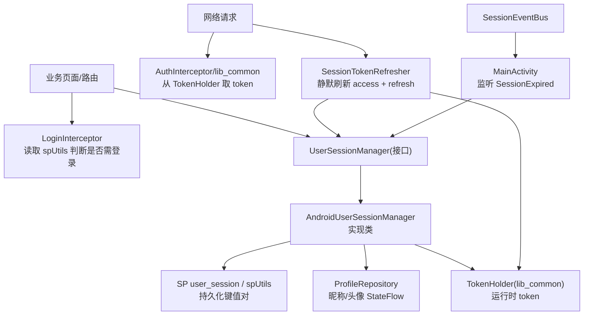
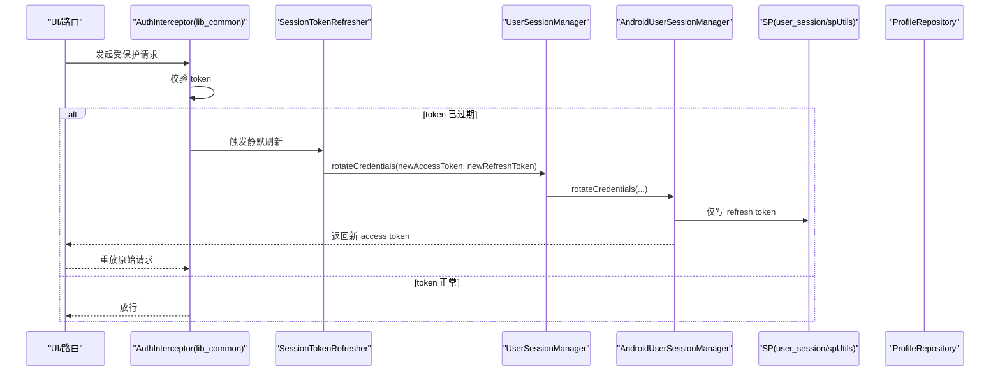
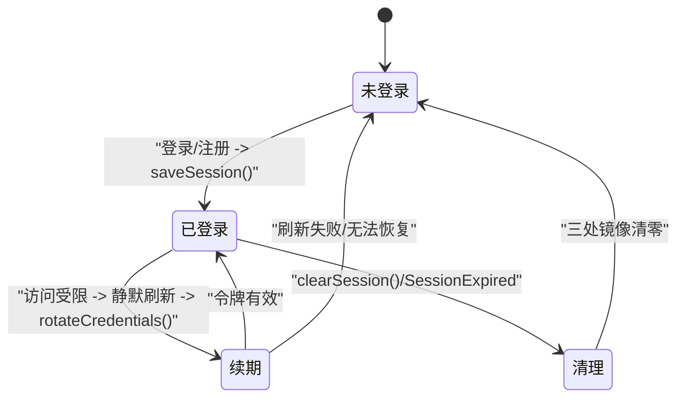
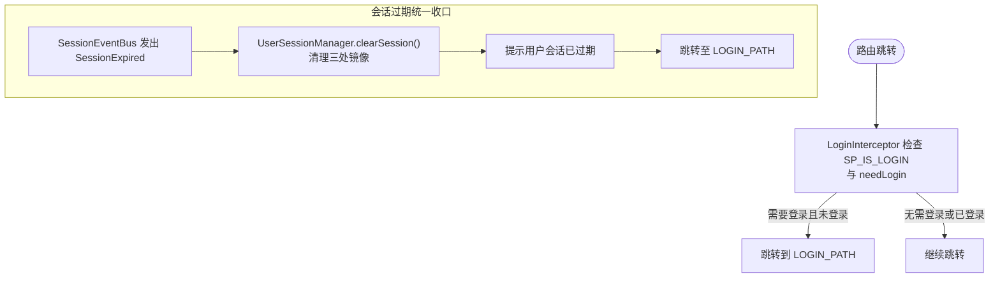
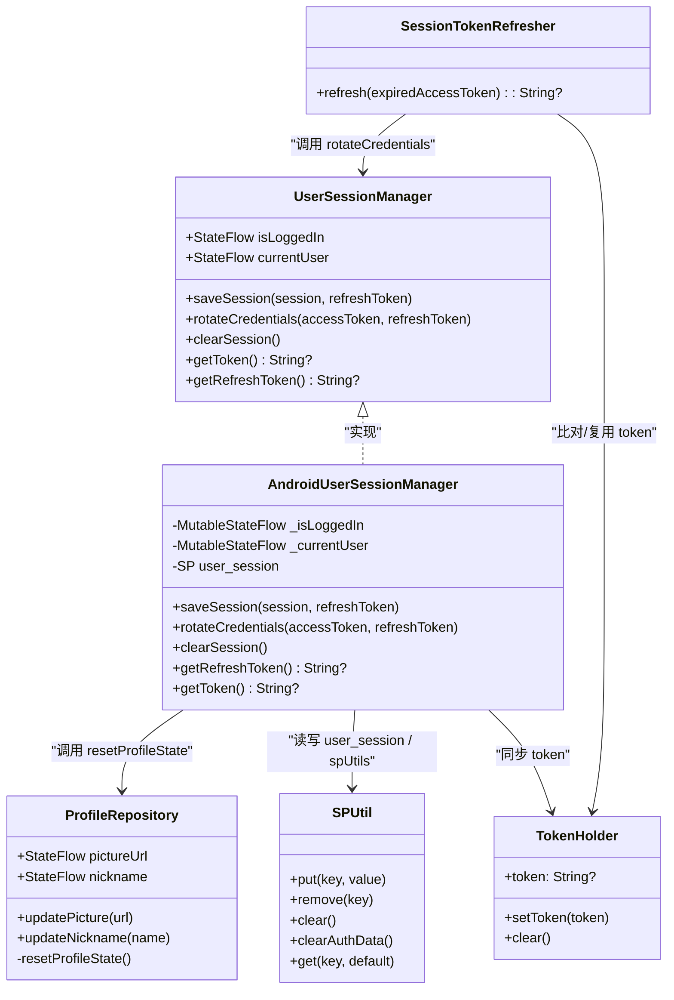

# 会话生命周期管理

<cite>
**本文引用的文件列表**   
- [UserSessionManager.kt](file://lib_book_common/src/main/java/com/ebook/common/domain/UserSessionManager.kt)
- [AndroidUserSessionManager.kt](file://lib_book_common/src/main/java/com/ebook/common/domain/AndroidUserSessionManager.kt)
- [ProfileRepository.kt](file://lib_book_common/src/main/java/com/ebook/common/repository/ProfileRepository.kt)
- [SPUtil.kt](file://lib_book_common/src/main/java/com/ebook/common/util/SPUtil.kt)
- [LoginInterceptor.kt](file://lib_book_common/src/main/java/com/ebook/common/interceptor/LoginInterceptor.kt)
- [SessionTokenRefresher.kt](file://lib_book_common/src/main/java/com/ebook/common/domain/SessionTokenRefresher.kt)
- [KeyCode.kt](file://lib_book_common/src/main/java/com/ebook/common/event/KeyCode.kt)
- [SessionModule.kt](file://lib_book_common/src/main/java/com/ebook/common/di/SessionModule.kt)
- [UserSession.kt](file://lib_book_common/src/main/java/com/ebook/common/domain/UserSession.kt)
- [ILoginProvider.kt](file://lib_book_common/src/main/java/com/ebook/common/provider/ILoginProvider.kt)
- [MyApplication.kt](file://module_app/src/main/java/com/ebook/MyApplication.kt)
- [MainActivity.kt](file://module_main/src/main/java/com/ebook/main/MainActivity.kt)
</cite>

## 目录
1. [引言](#引言)
2. [项目结构与角色总览](#项目结构与角色总览)
3. [核心组件与职责划分](#核心组件与职责划分)
4. [系统架构总览](#系统架构总览)
5. [会话状态机与生命周期](#会话状态机与生命周期)
6. [三处镜像同步机制详解](#三处镜像同步机制详解)
7. [会话初始化、恢复与清理](#会话初始化恢复与清理)
8. [用户身份信息管理与绑定](#用户身份信息管理与绑定)
9. [权限拦截与会话失效联动](#权限拦截与会话失效联动)
10. [异常检测与恢复策略](#异常检测与恢复策略)
11. [边界场景与故障排查](#边界场景与故障排查)
12. [依赖关系图](#依赖关系图)
13. [结论与建议](#结论与建议)

## 引言
本文件聚焦“用户会话”的完整生命周期，围绕登录、维持、静默刷新、过期、清理等关键阶段，梳理三处会话状态的镜像与一致性策略：user_session SP 文件、spUtils（兼容 LoginInterceptor）、以及 ProfileRepository 的内存 StateFlow。文档同时说明状态初始化的时机、清会话的原子性保障、异常下的恢复方式，以及权限拦截如何与会话状态联动。

## 项目结构与角色总览
会话相关能力集中在共享库 lib_book_common，并在业务模块（module_app/module_main）完成启动装配与会话过期事件统一收口。

图表来源
- [LoginInterceptor.kt:14-42](file://lib_book_common/src/main/java/com/ebook/common/interceptor/LoginInterceptor.kt#L14-L42)
- [UserSessionManager.kt:1-62](file://lib_book_common/src/main/java/com/ebook/common/domain/UserSessionManager.kt#L1-L62)
- [AndroidUserSessionManager.kt:17-162](file://lib_book_common/src/main/java/com/ebook/common/domain/AndroidUserSessionManager.kt#L17-L162)
- [ProfileRepository.kt:20-54](file://lib_book_common/src/main/java/com/ebook/common/repository/ProfileRepository.kt#L20-L54)
- [SessionTokenRefresher.kt:15-96](file://lib_book_common/src/main/java/com/ebook/common/domain/SessionTokenRefresher.kt#L15-L96)
- [MainActivity.kt:68-79](file://module_main/src/main/java/com/ebook/main/MainActivity.kt#L68-L79)

章节来源
- [MyApplication.kt:15-35](file://module_app/src/main/java/com/ebook/MyApplication.kt#L15-L35)
- [LoginPageConstants in KeyCode.kt:13-41](file://lib_book_common/src/main/java/com/ebook/common/event/KeyCode.kt#L13-L41)

## 核心组件与职责划分
- UserSessionManager（接口）：暴露会话唯一 seam，对外提供登录保存、凭据轮换、清会话、获取当前 token 等能力；维护 isLoggedIn 与 currentUser 的 StateFlow。
- AndroidUserSessionManager（Android 实现）：负责内存态更新、user_session SP 写入与删除、同时写 spUtils 兼容键、调用 ProfileRepository 重置进程内昵称/头像流；启动时将恢复的 token 置入 TokenHolder。
- ProfileRepository：持有昵称和头像的 StateFlow（源自 spUtils），提供更新方法与仅用于内部调用的 resetProfileState，确保清会话时第三处镜像被清零。
- SPUtil：统一的 SharedPreferences 存取工具，支持多 SP 文件及 clearAuthData，避免误删非认证数据。
- SessionTokenRefresher：在请求 401/A0230 触发静默刷新，单飞互斥，成功则 rotateCredentials（只更新双 token，不重建身份）。
- LoginInterceptor：路由前读 spUtils 的登录标记与需要登录标志位，决定是否拦截到登录页。
- MainActivity：订阅会话过期事件，执行清会话 + 提示 + 跳转登录页的统一收口。
- ILoginProvider：跨模块暴露服务端登出能力；本地会话清理一律委托 UserSessionManager.clearSession。

章节来源
- [UserSessionManager.kt:1-62](file://lib_book_common/src/main/java/com/ebook/common/domain/UserSessionManager.kt#L1-L62)
- [AndroidUserSessionManager.kt:17-162](file://lib_book_common/src/main/java/com/ebook/common/domain/AndroidUserSessionManager.kt#L17-L162)
- [ProfileRepository.kt:20-54](file://lib_book_common/src/main/java/com/ebook/common/repository/ProfileRepository.kt#L20-L54)
- [SPUtil.kt:13-93](file://lib_book_common/src/main/java/com/ebook/common/util/SPUtil.kt#L13-L93)
- [LoginInterceptor.kt:14-42](file://lib_book_common/src/main/java/com/ebook/common/interceptor/LoginInterceptor.kt#L14-L42)
- [SessionTokenRefresher.kt:15-96](file://lib_book_common/src/main/java/com/ebook/common/domain/SessionTokenRefresher.kt#L15-L96)
- [MainActivity.kt:68-79](file://module_main/src/main/java/com/ebook/main/MainActivity.kt#L68-L79)
- [ILoginProvider.kt:1-18](file://lib_book_common/src/main/java/com/ebook/common/provider/ILoginProvider.kt#L1-L18)

## 系统架构总览
下图展示了会话各状态载体之间的依赖与流向：API 层通过 AuthInterceptor 从 TokenHolder 取 token；若鉴权失败，触发 SessionTokenRefresher 静默刷新；刷新成功则经 UserSessionManager.rotateCredentials 只更新凭据；登录或注册成功后走 saveSession，一次性落盘并填充三处镜像；退出时统一调用 clearSession 做原子清理。

图表来源
- [SessionTokenRefresher.kt:15-96](file://lib_book_common/src/main/java/com/ebook/common/domain/SessionTokenRefresher.kt#L15-L96)
- [UserSessionManager.kt:32-42](file://lib_book_common/src/main/java/com/ebook/common/domain/UserSessionManager.kt#L32-L42)
- [AndroidUserSessionManager.kt:87-98](file://lib_book_common/src/main/java/com/ebook/common/domain/AndroidUserSessionManager.kt#L87-L98)
- [SPUtil.kt:81-89](file://lib_book_common/src/main/java/com/ebook/common/util/SPUtil.kt#L81-L89)

## 会话状态机与生命周期
结合实现逻辑，会话存在以下状态与转换路径：

- 未登录（no_session）
  - 条件：isLoggedIn=false，currentUser=null，spUtils.user_session 无登录标记
- 已登录（active）
  - 触发：saveSession（登录成功）
  - 行为：内存 isLoggedIn=true、currentUser=用户信息；user_session SP 写入标识和用户信息；spUtils 写入兼容键；TokenHolder 填入当前 token
- 续期（refreshed）
  - 触发：静默刷新成功
  - 行为：rotateCredentials 更新 access token（内存）与 refresh token（仅落盘）；不变更昵称/头像/uid
- 清理（cleared）
  - 触发：clearSession（显式登出或会话过期事件）
  - 行为：三重清除——内存 StateFlow、user_session、spUtils 与 ProfileRepository 的昵称/头像流

图表来源
- [AndroidUserSessionManager.kt:61-133](file://lib_book_common/src/main/java/com/ebook/common/domain/AndroidUserSessionManager.kt#L61-L133)
- [SessionTokenRefresher.kt:50-91](file://lib_book_common/src/main/java/com/ebook/common/domain/SessionTokenRefresher.kt#L50-L91)

## 三处镜像同步机制详解
为确保整个应用看到一致的会话视图，本项目在三个位置维护会话状态，并在所有关键路径保持一致写入或清除：

1) user_session SP 文件
- 内容：登录标记、用户 id、用户名、昵称、头像、refresh token（access token 不落盘）
- 写入时机：saveSession；refresh 时仅更新 refresh token（rotateCredentials）
- 清理时机：clearSession 移除所有键

2) spUtils（兼容 LoginInterceptor）
- 内容：SP_IS_LOGIN、用户名、昵称、头像、用户 id
- 写入时机：saveSession 时同步写入
- 清理时机：clearSession 调用 SPUtil.clearAuthData 仅删除认证键，不影响其他偏好设置
- 读取时机：LoginInterceptor.replace 检查是否需要登录

3) ProfileRepository 的内存 StateFlow
- 内容：昵称、头像 URL
- 写入时机：updateNickname / updatePicture（如编辑资料后）
- 清理时机：clearSession 内部调用 profileRepository.resetProfileState() 将两个 StateFlow 重置为空
- 启动恢复：ProfileRepository 构造时从 SPUtil 恢复上一次的值；因此当 clearSession 先清空 SP 后再 resetProfileState 才能确保「我的」页不再显示旧昵称/头像

关键设计点
- 访问令牌只驻内存，不在 SP 留存：冷启动 access token 为空，首个请求由网络栈触发静默刷新；这样能减少敏感 token 泄露面，同时利用 refresh 自动续期提升体验。
- 旋转凭据严格限缩范围：rotateCredentials 绝对不改动昵称/头像/uid，避免用“刷新端点只返回 token”的错误约定覆盖身份元数据。
- 清会话原子性：一处入口统一处理三类镜像，不允许调用方各自补清理，防止遗漏导致的状态不一致。

章节来源
- [AndroidUserSessionManager.kt:35-162](file://lib_book_common/src/main/java/com/ebook/common/domain/AndroidUserSessionManager.kt#L35-L162)
- [SPUtil.kt:81-89](file://lib_book_common/src/main/java/com/ebook/common/util/SPUtil.kt#L81-L89)
- [ProfileRepository.kt:20-54](file://lib_book_common/src/main/java/com/ebook/common/repository/ProfileRepository.kt#L20-L54)
- [LoginInterceptor.kt:21-42](file://lib_book_common/src/main/java/com/ebook/common/interceptor/LoginInterceptor.kt#L21-L42)

## 会话初始化、恢复与清理
### 应用启动时的状态恢复
- AndroidUserSessionManager 启动时会：
  - 初始化内存 isLoggedIn/currentUser，从 user_session SP 恢复历史登录态
  - 将可复用的 token（如有）放入 TokenHolder，供后续网络请求使用
  - 清理旧版遗留的明文密码键（幂等，只删不写）
- ProfileRepository 在构造时从 spUtils 恢复昵称与头像，保证 UI 渲染可用

### 清会话的统一收口
- 所有退出/踢出流程必须统一调用 UserSessionManager.clearSession，该方法内部完成：
  - 内存状态复位（_currentUser=null，_isLoggedIn=false）
  - TokenHolder 清理
  - 删除 user_session 全部键
  - 调用 SPUtil.clearAuthData 删除 spUtils 认证键
  - 调用 ProfileRepository.resetProfileState() 重置昵称/头像流

注意
- 不要在各业务页面自行调用 ProfileRepository 的清理方法：这会造成“谁负责哪一处镜像”模糊，且容易遗漏。
- 登录侧写 spUtils 是兼容性需要，但清会话仍须以 clearSession 为准，避免分支清理遗漏。

章节来源
- [AndroidUserSessionManager.kt:45-52](file://lib_book_common/src/main/java/com/ebook/common/domain/AndroidUserSessionManager.kt#L45-L52)
- [AndroidUserSessionManager.kt:111-133](file://lib_book_common/src/main/java/com/ebook/common/domain/AndroidUserSessionManager.kt#L111-L133)
- [ProfileRepository.kt:50-54](file://lib_book_common/src/main/java/com/ebook/common/repository/ProfileRepository.kt#L50-L54)

## 用户身份信息管理与绑定
- 数据来源：
  - 登录/注册成功后，由 UserSessionManager.saveSession 将用户基本信息写入 user_session SP 与 spUtils；同时将 current token 置入 TokenHolder
  - ProfileRepository 中的昵称与头像流来自 spUtils，便于「我的」页直接展示
- 绑定关系：
  - 会话的「活跃」状态（isLoggedIn/currentUser）与 TokenHolder.token 保持强一致；任何写入都必须同步更新这三者
  - 身份元数据变化（昵称/头像修改）通过 ProfileRepository 写回 spUtils，并同步内存流，确保 UI 即时响应
- 刷新语义约束：
  - 静默刷新仅更新双 token，绝不回填/改写身份字段，遵循服务端契约（刷新端点不返回 user）

章节来源
- [AndroidUserSessionManager.kt:61-98](file://lib_book_common/src/main/java/com/ebook/common/domain/AndroidUserSessionManager.kt#L61-L98)
- [SessionTokenRefresher.kt:66-81](file://lib_book_common/src/main/java/com/ebook/common/domain/SessionTokenRefresher.kt#L66-L81)
- [ProfileRepository.kt:30-38](file://lib_book_common/src/main/java/com/ebook/common/repository/ProfileRepository.kt#L30-L38)

## 权限拦截与会话失效联动
- 路由级拦截：
  - LoginInterceptor 基于 spUtils 中 SP_IS_LOGIN 与目标路由的 needLogin 标记决定路由拦截/放行
  - 该检查发生在路由跳转前，能尽早阻断未授权页面访问
- 会话过期处置：
  - MainActivity 订阅 SessionEventBus，当收到 SessionExpired 事件时：
    - 调用 UserSessionManager.clearSession() 清理本地会话
    - 给出提示并跳转至登录页
  - 此处的清理必须是最终归宿，以确保三处镜像一致性

图表来源
- [LoginInterceptor.kt:21-42](file://lib_book_common/src/main/java/com/ebook/common/interceptor/LoginInterceptor.kt#L21-L42)
- [MainActivity.kt:68-79](file://module_main/src/main/java/com/ebook/main/MainActivity.kt#L68-L79)

章节来源
- [LoginInterceptor.kt:14-42](file://lib_book_common/src/main/java/com/ebook/common/interceptor/LoginInterceptor.kt#L14-L42)
- [MainActivity.kt:68-79](file://module_main/src/main/java/com/ebook/main/MainActivity.kt#L68-L79)
- [KeyCode.kt:13-41](file://lib_book_common/src/main/java/com/ebook/common/event/KeyCode.kt#L13-L41)

## 异常检测与恢复策略
### 静默刷新的并发安全
- 使用互斥锁确保同一时刻只有一个刷新任务执行，避免并发重复刷新与刷新失败导致的竞态
- 进入互斥块后先对比 TokenHolder 当前 token，若不同则直接复用新 token，避免多余刷新

### 刷新失败的处理
- 若刷新被拒绝或缺失必要凭据，将返回空结果，上层视为「会话救不回来」
- 统一通过 SessionEventBus 发出会话过期事件，再由主界面执行清会话 + 提示 + 跳转登录页的兜底流程

### 取消与非异常情况
- 对取消异常原样上抛，不吞错，避免误判为会话不可恢复而错误踢出用户

章节来源
- [SessionTokenRefresher.kt:15-96](file://lib_book_common/src/main/java/com/ebook/common/domain/SessionTokenRefresher.kt#L15-L96)
- [MainActivity.kt:68-79](file://module_main/src/main/java/com/ebook/main/MainActivity.kt#L68-L79)

## 边界场景与故障排查
常见症状与根因定位指引
- 症状：会话已过期、token 已清，但「我的」页仍显示上一个身份的昵称与头像
  - 根因：未在 clearSession 中清理 ProfileRepository 的 StateFlow
  - 解决：始终通过 UserSessionManager.clearSession 完成清理；不要单独操作 ProfileRepository
- 症状：点击需要登录的页面未被引导至登录页
  - 根因：spUtils 的 SP_IS_LOGIN 残留或 needLogin 标注缺失
  - 解决：确认登录/注册后写入 spUtils；检查路由 extras 是否携带 needLogin；必要时重新构建生成 TheRouter 映射表
- 症状：冷启动后网络请求立即 401
  - 根因：冷启动 access token 恒为空，首请求触发刷新；若 refresh token 丢失或服务端拒绝，刷新失败
  - 解决：确认登录后是否正确持久化 refresh token；检查服务器刷新链路

修复建议清单
- 新增任何会改变登录态的逻辑，一律经由 UserSessionManager.saveSession / rotateCredentials / clearSession
- 任何与 spUtils 的直接写入都应考虑与 UserSessionManager 的对称操作（如新增登录态字段要两端同写/同清）
- 涉及「我的」页展示的元数据变化要通过 ProfileRepository 更新，并保持 spUtils 一致

章节来源
- [AndroidUserSessionManager.kt:61-133](file://lib_book_common/src/main/java/com/ebook/common/domain/AndroidUserSessionManager.kt#L61-L133)
- [ProfileRepository.kt:30-54](file://lib_book_common/src/main/java/com/ebook/common/repository/ProfileRepository.kt#L30-L54)
- [SPUtil.kt:81-89](file://lib_book_common/src/main/java/com/ebook/common/util/SPUtil.kt#L81-L89)

## 依赖关系图
下图总结了会话管理的注入与依赖关系：Hilt 将接口与其 Android 实现绑定，刷新器依赖会话管理器与公共 token 容器。

图表来源
- [SessionModule.kt:22-37](file://lib_book_common/src/main/java/com/ebook/common/di/SessionModule.kt#L22-L37)
- [UserSessionManager.kt:1-62](file://lib_book_common/src/main/java/com/ebook/common/domain/UserSessionManager.kt#L1-L62)
- [AndroidUserSessionManager.kt:17-162](file://lib_book_common/src/main/java/com/ebook/common/domain/AndroidUserSessionManager.kt#L17-L162)
- [ProfileRepository.kt:20-54](file://lib_book_common/src/main/java/com/ebook/common/repository/ProfileRepository.kt#L20-L54)
- [SPUtil.kt:13-93](file://lib_book_common/src/main/java/com/ebook/common/util/SPUtil.kt#L13-L93)
- [SessionTokenRefresher.kt:15-96](file://lib_book_common/src/main/java/com/ebook/common/domain/SessionTokenRefresher.kt#L15-L96)

## 结论与建议
- 单一可信源：UserSessionManager 是唯一合法的会话入口；任何状态变更应通过它进行。
- 三处镜像一致：user_session SP、spUtils、ProfileRepository 内存流必须在所有路径对齐写入/清理；清会话的唯一入口是 clearSession。
- 静默刷新收敛：刷新只更新双 token，不触碰身份字段；失败则经事件统一收口，简化调用点分支。
- 路由与网络双重防护：路由层快速拒止未登录访问，网络层保证 token 有效性并自动续期。
- 实践建议：新增与会话相关的键、路由或 UI 展示时，务必对照本节的三处镜像与统一清理路径进行检查，避免回归不一致问题。