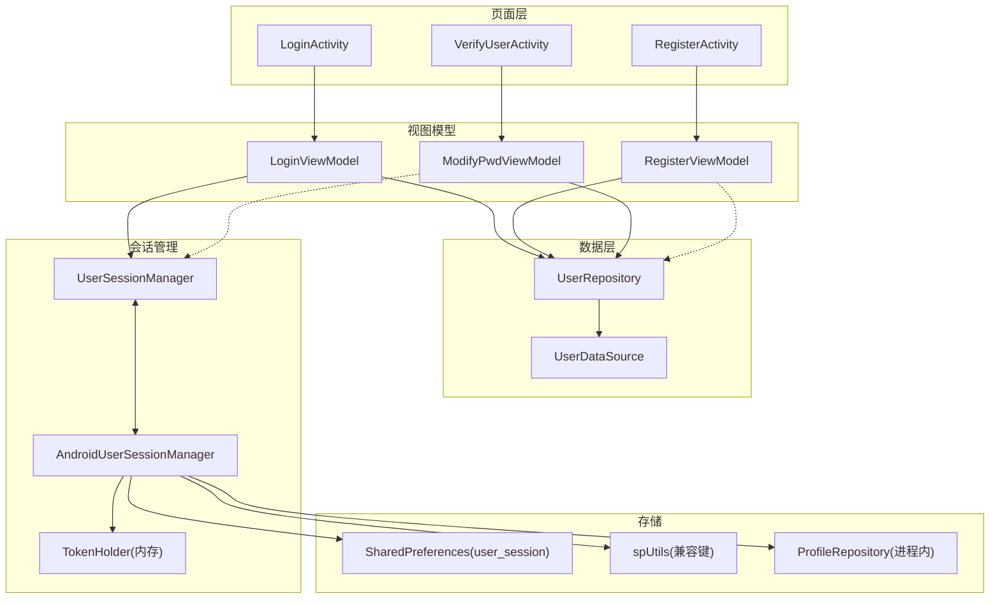
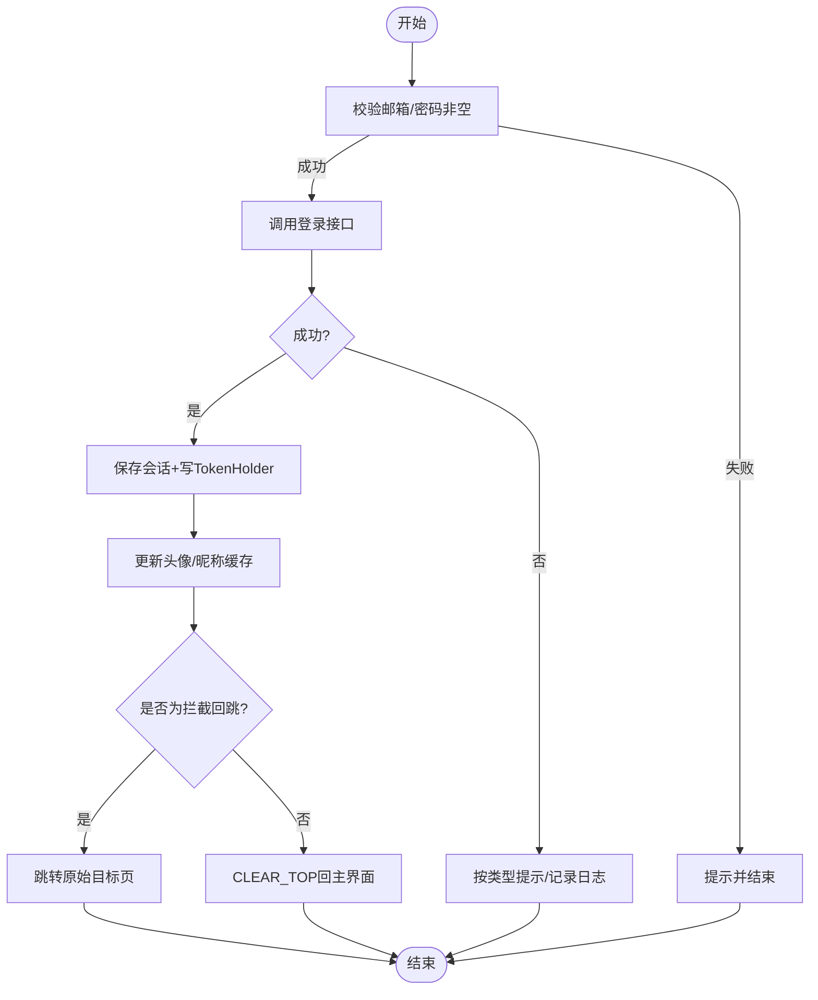
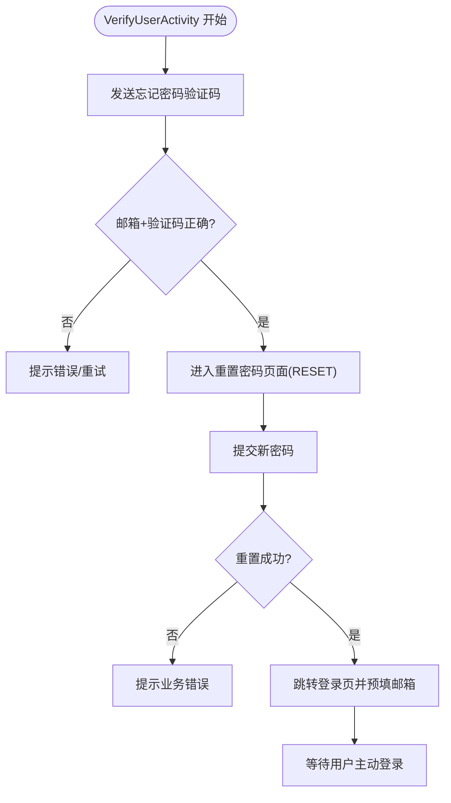
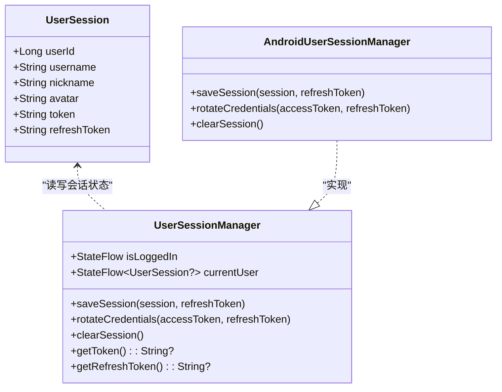

# 登录注册流程

<cite>
**本文引用的文件列表**
- [LoginActivity.kt](file://module_login/src/main/java/com/ebook/login/LoginActivity.kt)
- [RegisterActivity.kt](file://module_login/src/main/java/com/ebook/login/RegisterActivity.kt)
- [VerifyUserActivity.kt](file://module_login/src/main/java/com/ebook/login/VerifyUserActivity.kt)
- [LoginViewModel.kt](file://module_login/src/main/java/com/ebook/login/mvvm/viewmodel/LoginViewModel.kt)
- [RegisterViewModel.kt](file://module_login/src/main/java/com/ebook/login/mvvm/viewmodel/RegisterViewModel.kt)
- [ModifyPwdViewModel.kt](file://module_login/src/main/java/com/ebook/login/mvvm/viewmodel/ModifyPwdViewModel.kt)
- [UserRepository.kt](file://module_login/src/main/java/com/ebook/login/repository/UserRepository.kt)
- [UserSessionManager.kt](file://lib_book_common/src/main/java/com/ebook/common/domain/UserSessionManager.kt)
- [AndroidUserSessionManager.kt](file://lib_book_common/src/main/java/com/ebook/common/domain/AndroidUserSessionManager.kt)
- [UserSession.kt](file://lib_book_common/src/main/java/com/ebook/common/domain/UserSession.kt)
- [UserDataSource.kt](file://lib_ebook_api/src/main/java/com/ebook/api/service/user/UserDataSource.kt)
- [UserService.kt](file://lib_ebook_api/src/main/java/com/ebook/api/service/user/UserService.kt)
</cite>

## 目录
1. [引言](#引言)
2. [项目结构（认证相关）](#项目结构认证相关)
3. [核心组件](#核心组件)
4. [架构总览](#架构总览)
5. [关键流程详解](#关键流程详解)
6. [依赖与数据流分析](#依赖与数据流分析)
7. [性能与稳定性考量](#性能与稳定性考量)
8. [故障诊断与错误处理](#故障诊断与错误处理)
9. [结论](#结论)

## 引言
本文档系统性说明邮箱为登录主标识的认证体系，涵盖：
- 登录、注册的三步机制（发码验证、验证码激活、主动登录）
- UserSession 模型字段及生命周期
- 双 Token 保存策略（access token 内存存放，refresh token 持久化）
- 登出时三处镜像的统一清理
- 完整的登录流程图与错误处理策略

该设计保证前端以最小状态暴露身份、服务端以 refresh token 保障长期可用、网络层统一接管会话过期。

## 项目结构（认证相关）
认证域涉及三层职责分离：
- UI/交互层：登录、注册、忘记密码页面，负责输入校验、加载提示与路由跳转
- ViewModel 层：业务流程编排与导航决策
- Repository + DataSource 层：网络端点调用与响应封装
- Domain/DI/Storage 层：用户会话与 token 的管理与持久化



**图示来源**
- [LoginActivity.kt:49-193](file://module_login/src/main/java/com/ebook/login/LoginActivity.kt#L49-L193)
- [RegisterActivity.kt:52-71](file://module_login/src/main/java/com/ebook/login/RegisterActivity.kt#L52-L71)
- [VerifyUserActivity.kt:47-66](file://module_login/src/main/java/com/ebook/login/VerifyUserActivity.kt#L47-L66)
- [LoginViewModel.kt:30-117](file://module_login/src/main/java/com/ebook/login/mvvm/viewmodel/LoginViewModel.kt#L30-L117)
- [RegisterViewModel.kt:31-155](file://module_login/src/main/java/com/ebook/login/mvvm/viewmodel/RegisterViewModel.kt#L31-L155)
- [ModifyPwdViewModel.kt:35-195](file://module_login/src/main/java/com/ebook/login/mvvm/viewmodel/ModifyPwdViewModel.kt#L35-L195)
- [UserRepository.kt:26-94](file://module_login/src/main/java/com/ebook/login/repository/UserRepository.kt#L26-L94)
- [UserSessionManager.kt:13-62](file://lib_book_common/src/main/java/com/ebook/common/domain/UserSessionManager.kt#L13-L62)
- [AndroidUserSessionManager.kt:17-162](file://lib_book_common/src/main/java/com/ebook/common/domain/AndroidUserSessionManager.kt#L17-L162)
- [UserDataSource.kt:16-47](file://lib_ebook_api/src/main/java/com/ebook/api/service/user/UserDataSource.kt#L16-L47)
- [UserService.kt:22-72](file://lib_ebook_api/src/main/java/com/ebook/api/service/user/UserService.kt#L22-L72)

**章节来源**
- [LoginActivity.kt:39-193](file://module_login/src/main/java/com/ebook/login/LoginActivity.kt#L39-L193)
- [RegisterActivity.kt:43-167](file://module_login/src/main/java/com/ebook/login/RegisterActivity.kt#L43-L167)
- [VerifyUserActivity.kt:35-136](file://module_login/src/main/java/com/ebook/login/VerifyUserActivity.kt#L35-L136)

## 核心组件
- LoginActivity：邮箱+密码登录入口；支持单实例复用与参数预填；成功后根据拦截来源或主动登录场景智能回跳
- RegisterActivity：三步注册（发码→验证码+密码→提示成功并跳转登录页预填邮箱）
- VerifyUserActivity：忘记密码第一步，验证邮箱+验证码后跳转到改密页
- LoginViewModel：发起登录、保存会话、刷新资料缓存、导航回退
- RegisterViewModel：发送验证码（60秒倒计时）、注册表单校验、引导到登录页
- ModifyPwdViewModel：已登录改密与忘记密码重置两条路径；失败统一处理会话过期
- UserRepository：登录/注册/发码/改密/重置的接口封装
- UserSessionManager / AndroidUserSessionManager：会话模型与持久化、TokenHolder 同步、多镜像一致化清理
- UserDataSource / UserService：Retrofit 服务定义与契约映射

**章节来源**
- [UserRepository.kt:26-94](file://module_login/src/main/java/com/ebook/login/repository/UserRepository.kt#L26-L94)
- [UserSessionManager.kt:13-62](file://lib_book_common/src/main/java/com/ebook/common/domain/UserSessionManager.kt#L13-L62)
- [AndroidUserSessionManager.kt:17-162](file://lib_book_common/src/main/java/com/ebook/common/domain/AndroidUserSessionManager.kt#L17-L162)
- [UserDataSource.kt:16-47](file://lib_ebook_api/src/main/java/com/ebook/api/service/user/UserDataSource.kt#L16-L47)
- [UserService.kt:22-72](file://lib_ebook_api/src/main/java/com/ebook/api/service/user/UserService.kt#L22-L72)

## 架构总览
- 认证以“邮箱为主标识”进行登录与找回；用户名仅展示用
- 注册三步：先发码验证邮箱，再提交“邮箱+验证码+密码”完成激活；注册不发放 token，需用户主动登录
- 登录成功后建立会话：UserSession（userId/username/nickname/avatar/token）持久化身份信息；refreshToken 落盘，access token 驻内存
- 网络层对 A0230（token 过期）做静默刷新；刷新失败走全局会话过期处置
- 登出通过单一入口清会话，三处镜像同步失效，避免状态不一致

```mermaid
sequenceDiagram
  participant U as "用户"
  participant L as "LoginActivity"
  participant VM as "LoginViewModel"
  participant Repo as "UserRepository"
  DS as "UserDataSource/UserService"
  SM as "AndroidUserSessionManager"
  note over L,SM: 登录成功后的会话保存与导航
  U->>L: 输入邮箱/密码并点击登录
  L->>VM: login(email,password)
  VM->>Repo: login(...)
  Repo->>DS: POST /api/auth/login
  DS-->>Repo: RespDTO<UserSession>
  Repo-->>VM: Result<UserSession>
  VM->>SM: saveSession(session, refreshToken)
  VM->>VM: 更新本地资料头像/昵称
  VM->>L: 根据拦截或主动登录回跳主界面
```

**图示来源**
- [LoginViewModel.kt:46-116](file://module_login/src/main/java/com/ebook/login/mvvm/viewmodel/LoginViewModel.kt#L46-L116)
- [UserRepository.kt:50-55](file://module_login/src/main/java/com/ebook/login/repository/UserRepository.kt#L50-L55)
- [UserSessionManager.kt:24-30](file://lib_book_common/src/main/java/com/ebook/common/domain/UserSessionManager.kt#L24-L30)
- [AndroidUserSessionManager.kt:61-85](file://lib_book_common/src/main/java/com/ebook/common/domain/AndroidUserSessionManager.kt#L61-L85)
- [UserService.kt:23-26](file://lib_ebook_api/src/main/java/com/ebook/api/service/user/UserService.kt#L23-L26)

## 关键流程详解

### 一、登录流程（邮箱+密码）
- 输入校验：空邮箱/空密码则提示返回
- 远程登录：调用 /api/auth/login
- 会话保存：
  - 保存 UserSession 到内存与持久化（身份字段）
  - 将 access token 写入 TokenHolder（内存），供网络请求头附加
  - 持久化 refreshToken 到 user_session SP 并兼容 spUtils
- 导航与刷新：登录后更新本地头像/昵称缓存，根据是否被拦截回原目标或回到主页
- 异常处理：会话过期由网络层全局处理；其他业务异常通过 Toast 提示



**图示来源**
- [LoginViewModel.kt:46-116](file://module_login/src/main/java/com/ebook/login/mvvm/viewmodel/LoginViewModel.kt#L46-L116)
- [AndroidUserSessionManager.kt:61-85](file://lib_book_common/src/main/java/com/ebook/common/domain/AndroidUserSessionManager.kt#L61-L85)
- [UserService.kt:23-26](file://lib_ebook_api/src/main/java/com/ebook/api/service/user/UserService.kt#L23-L26)

**章节来源**
- [LoginActivity.kt:113-192](file://module_login/src/main/java/com/ebook/login/LoginActivity.kt#L113-L192)
- [LoginViewModel.kt:46-116](file://module_login/src/main/java/com/ebook/login/mvvm/viewmodel/LoginViewModel.kt#L46-L116)
- [UserRepository.kt:50-55](file://module_login/src/main/java/com/ebook/login/repository/UserRepository.kt#L50-L55)

### 二、注册流程（三步走）
- 第一步：发码
  - 校验邮箱非空，调用 /api/auth/send-code（注册专用）
  - 启动 60 秒倒计时，期间禁用按钮防重复发码
- 第二步：激活
  - 校验：邮箱非空、验证码长度为6、两次密码一致且非空
  - 调用 /api/auth/register（注册即激活，但不发放 token）
- 第三步：引导登录
  - 成功后携带 email 打开登录页，等待用户主动登录

```mermaid
sequenceDiagram
  participant UA as "用户"
  participant RA as "RegisterActivity"
  participant RVM as "RegisterViewModel"
  participant UR as "UserRepository"
  DS as "UserDataSource/UserService"
  Note over RA,RVM: 发码与倒计时
  UA->>RA: 点击"获取验证码"
  RA->>RVM: sendCode(email)
  RVM->>UR: sendRegisterCode(SendCodeRequest)
  UR->>DS: POST /api/auth/send-code
  DS-->>UR: 成功
  RVM->>RVM: 启动60秒倒计时
  UA->>RA: 填写验证码和两次密码
  RA->>RVM: register(email, code, pwd1, pwd2)
  RVM->>UR: register(...)
  UR->>DS: POST /api/auth/register
  DS-->>UR: 成功
  RVM-->>RA: 提示成功
  RVM-->>RA: 跳转登录页并预填email
```

**图示来源**
- [RegisterActivity.kt:61-68](file://module_login/src/main/java/com/ebook/login/RegisterActivity.kt#L61-L68)
- [RegisterViewModel.kt:54-155](file://module_login/src/main/java/com/ebook/login/mvvm/viewmodel/RegisterViewModel.kt#L54-L155)
- [UserRepository.kt:35-48](file://module_login/src/main/java/com/ebook/login/repository/UserRepository.kt#L35-L48)
- [UserService.kt:28-36](file://lib_ebook_api/src/main/java/com/ebook/api/service/user/UserService.kt#L28-L36)

**章节来源**
- [RegisterActivity.kt:43-167](file://module_login/src/main/java/com/ebook/login/RegisterActivity.kt#L43-L167)
- [RegisterViewModel.kt:31-155](file://module_login/src/main/java/com/ebook/login/mvvm/viewmodel/RegisterViewModel.kt#L31-L155)
- [UserRepository.kt:35-48](file://module_login/src/main/java/com/ebook/login/repository/UserRepository.kt#L35-L48)

### 三、忘记密码流程（发码验证 + 重置 + 主动登录）
- 验证身份：/api/auth/forgot-password/send-code → 校验邮箱+验证码 → 进入改密页（RESET 模式）
- 重置密码：/api/auth/forgot-password/reset → 成功后打开登录页（预填邮箱），等待用户主动登录
- 已登录改密：/api/users/me/password → 成功后清会话并回登录页



**图示来源**
- [VerifyUserActivity.kt:52-64](file://module_login/src/main/java/com/ebook/login/VerifyUserActivity.kt#L52-L64)
- [ModifyPwdViewModel.kt:59-172](file://module_login/src/main/java/com/ebook/login/mvvm/viewmodel/ModifyPwdViewModel.kt#L59-L172)
- [UserRepository.kt:71-83](file://module_login/src/main/java/com/ebook/login/repository/UserRepository.kt#L71-L83)
- [UserService.kt:53-61](file://lib_ebook_api/src/main/java/com/ebook/api/service/user/UserService.kt#L53-L61)

**章节来源**
- [VerifyUserActivity.kt:35-136](file://module_login/src/main/java/com/ebook/login/VerifyUserActivity.kt#L35-L136)
- [ModifyPwdViewModel.kt:35-195](file://module_login/src/main/java/com/ebook/login/mvvm/viewmodel/ModifyPwdViewModel.kt#L35-L195)
- [UserRepository.kt:71-83](file://module_login/src/main/java/com/ebook/login/repository/UserRepository.kt#L71-L83)

## 依赖与数据流分析

### UserSession 模型与生命周期
- 字段含义：
  - userId：用户唯一标识
  - username：系统显示名（可重复，后续可修改）
  - nickname：昵称（用于「我的」页面展示）
  - avatar：头像 URL
  - token：运行时访问令牌，仅内存驻留
  - refreshToken：登录瞬时的刷新令牌，用于安全刷新；之后统一通过 UserSessionManager.getRefreshToken() 读取
- 生命周期管理：
  - 登录成功：saveSession(session, refreshToken) 同时写入 SessionState、SP(user_session)、spUtils 兼容键，并将 token 写入 TokenHolder
  - 启动恢复：从 SP 重建 currentUser，并将已有 token 置入 TokenHolder
  - 刷新凭证：rotateCredentials 仅更新内存 token 与持久化的 refreshToken，不改动身份字段
  - 登出清理：clearSession 一次清理三处镜像，确保状态一致



**图示来源**
- [UserSession.kt:6-17](file://lib_book_common/src/main/java/com/ebook/common/domain/UserSession.kt#L6-L17)
- [UserSessionManager.kt:13-62](file://lib_book_common/src/main/java/com/ebook/common/domain/UserSessionManager.kt#L13-L62)
- [AndroidUserSessionManager.kt:17-162](file://lib_book_common/src/main/java/com/ebook/common/domain/AndroidUserSessionManager.kt#L17-L162)

**章节来源**
- [UserSession.kt:6-17](file://lib_book_common/src/main/java/com/ebook/common/domain/UserSession.kt#L6-L17)
- [UserSessionManager.kt:13-62](file://lib_book_common/src/main/java/com/ebook/common/domain/UserSessionManager.kt#L13-L62)
- [AndroidUserSessionManager.kt:61-146](file://lib_book_common/src/main/java/com/ebook/common/domain/AndroidUserSessionManager.kt#L61-L146)

### 双 Token 保存策略
- access token：保存在 TokenHolder（内存），每次应用冷启动为空；首个请求如果返回 A0230，将通过 refresh token 静默轮换
- refresh token：保存在 user_session SP（以及兼容 spUtils），用于刷新接口 /api/auth/refresh
- 旋转逻辑：rotateCredentials 仅更新 token 与 refreshToken，不动身份字段

**章节来源**
- [AndroidUserSessionManager.kt:61-98](file://lib_book_common/src/main/java/com/ebook/common/domain/AndroidUserSessionManager.kt#L61-L98)
- [UserSessionManager.kt:32-42](file://lib_book_common/src/main/java/com/ebook/common/domain/UserSessionManager.kt#L32-L42)

### 登出时统一清理（三处镜像）
- 统一入口：UserSessionManager.clearSession()
- 内部动作：
  - 清空内存：currentUser/isLoggedIn/TokenHolder
  - 清除 user_session SP：is_logged_in、token、refresh_token、user_id、username、nickname、avatar
  - 清 spUtils 兼容键：IS_LOGIN、USERNAME、NICKNAME、USER_ID、IMAGE
  - 复位 ProfileRepository 进程内状态，防止「我的」仍显示上一个身份

**章节来源**
- [AndroidUserSessionManager.kt:100-133](file://lib_book_common/src/main/java/com/ebook/common/domain/AndroidUserSessionManager.kt#L100-L133)
- [UserSessionManager.kt:44-47](file://lib_book_common/src/main/java/com/ebook/common/domain/UserSessionManager.kt#L44-L47)

### 数据流向与接口契约
- Repository 聚合所有认证相关端点的调用，并统一异常处理包装
- DataSource 定义 Retrofit API；UserService 提供具体的注解式端点
- 返回体统一使用 RespDTO，成功时包含 data

**章节来源**
- [UserRepository.kt:26-94](file://module_login/src/main/java/com/ebook/login/repository/UserRepository.kt#L26-L94)
- [UserDataSource.kt:16-47](file://lib_ebook_api/src/main/java/com/ebook/api/service/user/UserDataSource.kt#L16-L47)
- [UserService.kt:22-72](file://lib_ebook_api/src/main/java/com/ebook/api/service/user/UserService.kt#L22-L72)

## 性能与稳定性考量
- 登录防抖：重复点击保护，避免并发请求导致状态抖动
- 验证码频控：60 秒倒计时与服务端一致，防止触发 A0241 尝试超限
- 首请求静默刷新：无需打断用户体验即可续期 token；刷新失败才触发全局会话过期流程
- 会话镜像一致性：通过 clearSession 一处调用来保三处镜像同步，避免残留状态引发 UI 错乱

[本节为通用指导，无需具体代码引用]

## 故障诊断与错误处理
- 常见错误分类
  - 客户端校验失败：邮箱/密码/验证码/密码一致性等即时反馈
  - 业务失败：服务端返回的错误码/文案，如旧密码错误、验证码错误或次数超限
  - 网络失败：断网/超时/服务器不可达，统一捕获并提示
  - 会话过期：A0230 由网络层接管，自动刷新；刷新失败走全局处理（清会话、提示、跳转登录）
- 处理策略
  - 成功：保存会话/刷新缓存/导航
  - 失败：区分会话过期与其他错误；会话过期只记日志不重复弹窗；其他错误取业务文案或原始 message 提示

**章节来源**
- [LoginViewModel.kt:56-81](file://module_login/src/main/java/com/ebook/login/mvvm/viewmodel/LoginViewModel.kt#L56-L81)
- [RegisterViewModel.kt:138-148](file://module_login/src/main/java/com/ebook/login/mvvm/viewmodel/RegisterViewModel.kt#L138-L148)
- [ModifyPwdViewModel.kt:174-188](file://module_login/src/main/java/com/ebook/login/mvvm/viewmodel/ModifyPwdViewModel.kt#L174-L188)

## 结论
本方案围绕“邮箱为主标识”的设计，实现了简洁且安全的认证流程：
- 注册三步清晰明了，注册即激活但无 token，需主动登录
- 登录成功后严格区隔两类 token 的生命周期与存储介质
- 网络层对会话过期进行处理，降低各功能模块复杂度
- 登出统一清理，确保三处镜像始终一致

该设计在保证安全性的同时兼顾用户体验，适合持续扩展与演进。