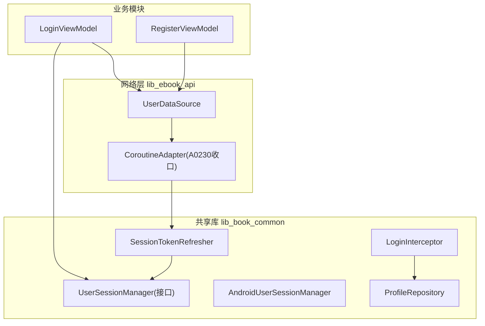
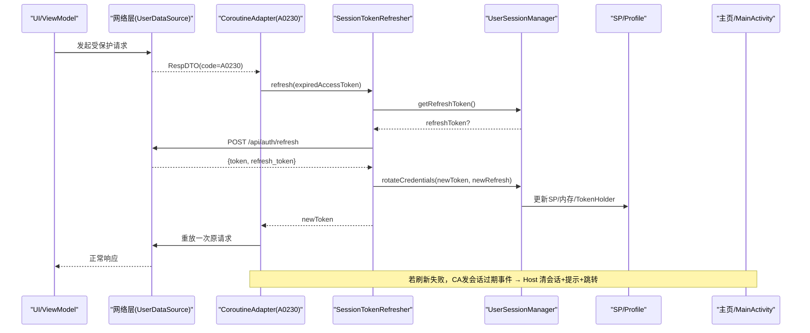
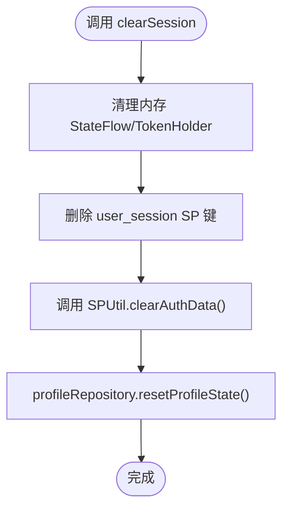
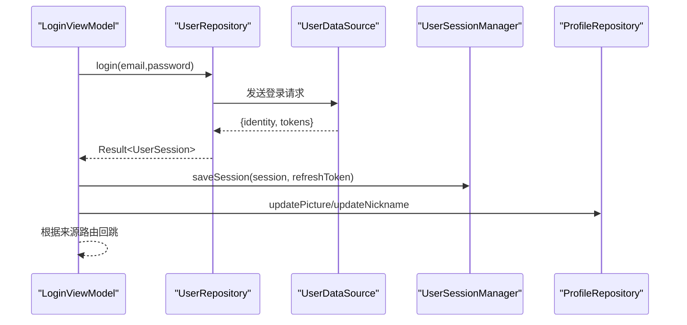
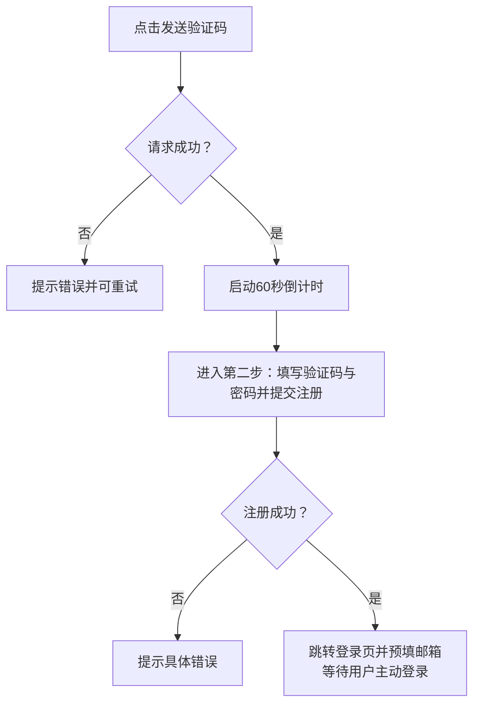
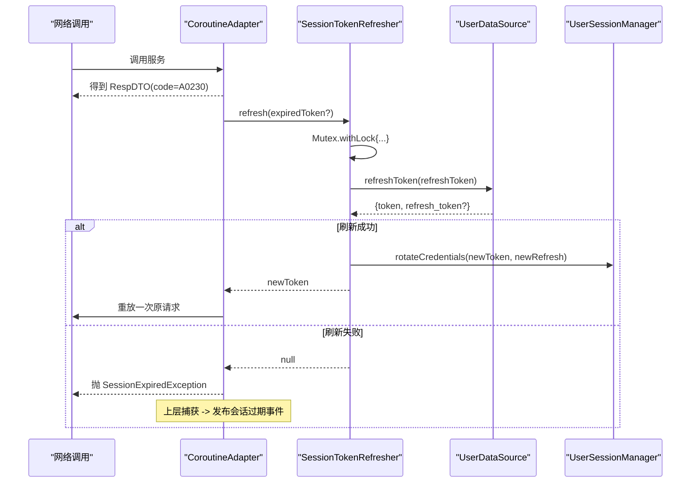
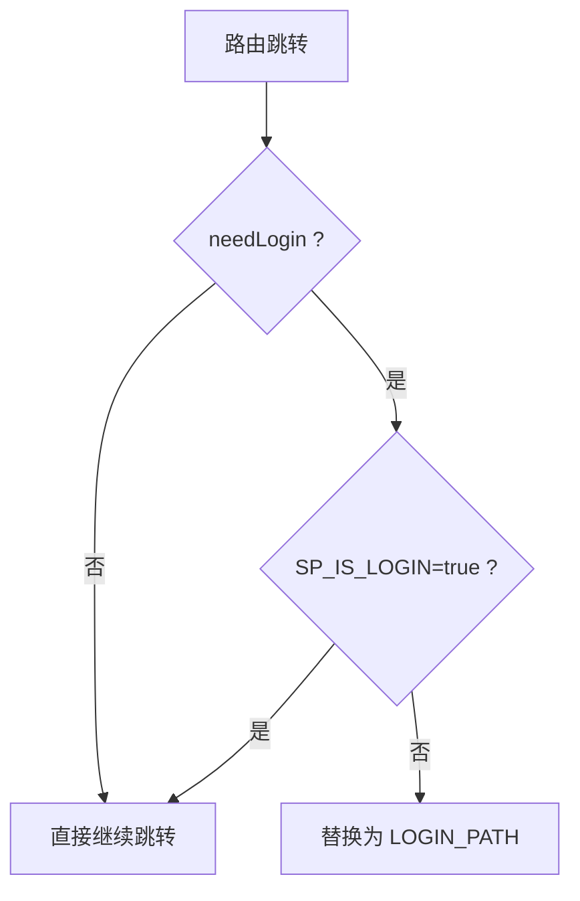
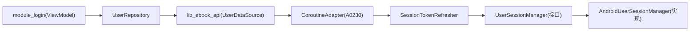

# 认证系统

<cite>
**本文引用的文件**
- [UserSession.kt](file://lib_book_common/src/main/java/com/ebook/common/domain/UserSession.kt)
- [UserSessionManager.kt](file://lib_book_common/src/main/java/com/ebook/common/domain/UserSessionManager.kt)
- [AndroidUserSessionManager.kt](file://lib_book_common/src/main/java/com/ebook/common/domain/AndroidUserSessionManager.kt)
- [LoginInterceptor.kt](file://lib_book_common/src/main/java/com/ebook/common/interceptor/LoginInterceptor.kt)
- [SessionModule.kt](file://lib_book_common/src/main/java/com/ebook/common/di/SessionModule.kt)
- [SessionTokenRefresher.kt](file://lib_book_common/src/main/java/com/ebook/common/domain/SessionTokenRefresher.kt)
- [ProfileRepository.kt](file://lib_book_common/src/main/java/com/ebook/common/repository/ProfileRepository.kt)
- [LoginViewModel.kt](file://module_login/src/main/java/com/ebook/login/mvvm/viewmodel/LoginViewModel.kt)
- [RegisterViewModel.kt](file://module_login/src/main/java/com/ebook/login/mvvm/viewmodel/RegisterViewModel.kt)
- [UserRepository.kt](file://module_login/src/main/java/com/ebook/login/repository/UserRepository.kt)
- [0009-email-primary-account-model-alignment.md](file://docs/adr/0009-email-primary-account-model-alignment.md)
- [0010-silent-refresh-seam-and-session-expiry-bus.md](file://docs/adr/0010-silent-refresh-seam-and-session-expiry-bus.md)
</cite>

## 目录
1. [引言](#引言)
2. [项目结构与角色划分](#项目结构与角色划分)
3. [核心组件](#核心组件)
4. [架构总览](#架构总览)
5. [详细组件分析](#详细组件分析)
6. [依赖与协作关系分析](#依赖与协作关系分析)
7. [性能与并发特性](#性能与并发特性)
8. [故障定位与排错指南](#故障定位与排错指南)
9. [结论与建议](#结论与建议)
10. [附录：A DR与约定速查](#附录a-dr与约定速查)

## 引言
本文档系统性说明该 Android 电子书阅读器的用户身份验证与会话管理机制。围绕邮箱即主标识的登录注册流程、双 Token 机制（access 内存驻留 + refresh 持久化）、静默刷新与 A0230 过期处置、会话三处镜像同步以及拦截器链中的鉴权策略进行深入阐述；同时给出降级方案、最佳实践与风险控制建议，帮助开发者与维护者准确理解并安全地扩展认证能力。

## 项目结构与角色划分
- lib_book_common：提供会话管理的通用实现（UserSessionManager、SessionTokenRefresher）、路由层登录拦截（LoginInterceptor）、用户资料流（ProfileRepository）和 Hilt 绑定（SessionModule）。
- module_login：封装邮箱登录、注册三步走、改密与忘记密码的业务 ViewModel 与数据源调用。
- lib_ebook_api 与网络栈：对外暴露 UserDataSource 等网络端点，并提供 CoroutineAdapter 以业务码级别统一处理 A0230 过期，串联单飞刷新与过期事件分发。
- module_main：作为长驻宿主订阅会话过期事件并完成“清会话+提示+跳转”的统一处置。

图表来源
- [LoginViewModel.kt:1-117](file://module_login/src/main/java/com/ebook/login/mvvm/viewmodel/LoginViewModel.kt#L1-L117)
- [RegisterViewModel.kt:1-156](file://module_login/src/main/java/com/ebook/login/mvvm/viewmodel/RegisterViewModel.kt#L1-L156)
- [UserSessionManager.kt:1-63](file://lib_book_common/src/main/java/com/ebook/common/domain/UserSessionManager.kt#L1-L63)
- [AndroidUserSessionManager.kt:1-162](file://lib_book_common/src/main/java/com/ebook/common/domain/AndroidUserSessionManager.kt#L1-L162)
- [SessionTokenRefresher.kt:1-96](file://lib_book_common/src/main/java/com/ebook/common/domain/SessionTokenRefresher.kt#L1-L96)
- [LoginInterceptor.kt:1-43](file://lib_book_common/src/main/java/com/ebook/common/interceptor/LoginInterceptor.kt#L1-L43)

章节来源
- [LoginViewModel.kt:23-117](file://module_login/src/main/java/com/ebook/login/mvvm/viewmodel/LoginViewModel.kt#L23-L117)
- [RegisterViewModel.kt:25-156](file://module_login/src/main/java/com/ebook/login/mvvm/viewmodel/RegisterViewModel.kt#L25-L156)
- [UserSessionManager.kt:5-63](file://lib_book_common/src/main/java/com/ebook/common/domain/UserSessionManager.kt#L5-L63)
- [AndroidUserSessionManager.kt:17-162](file://lib_book_common/src/main/java/com/ebook/common/domain/AndroidUserSessionManager.kt#L17-L162)
- [SessionTokenRefresher.kt:15-96](file://lib_book_common/src/main/java/com/ebook/common/domain/SessionTokenRefresher.kt#L15-L96)
- [LoginInterceptor.kt:10-43](file://lib_book_common/src/main/java/com/ebook/common/interceptor/LoginInterceptor.kt#L10-L43)

## 核心组件
- UserSession：跨模块统一的“登录会话信息”，包含用户基本信息与 token；refreshToken 为瞬时填充、仅用于 saveSession 持久化的凭据字段。
- UserSessionManager：会话状态的唯一 seam，定义 isLoggedIn/currentUser/stateful 读写、saveSession、rotateCredentials、clearSession、getToken/getRefreshToken 等方法。
- AndroidUserSessionManager：UserSessionManager 的 Android 实现，负责：
  - 内存 StateFlow 维护
  - SP 持久化 user_session（不写 access token）
  - 启动时恢复 token 至 TokenHolder
  - 兼容 spUtils 写入/清理（适配 LoginInterceptor）
  - 三处镜像同步清理（SP、spUtils、ProfileRepository）
- SessionTokenRefresher：基于 Mutex 的单飞刷新实现，直接调 UserDataSource.refreshToken，成功则 rotateCredentials 轮换凭证；失败则返回 null 以触达上层过期逻辑。
- ProfileRepository：昵称/头像等用户资料的 StateFlow 缓存与进程内复位；清会话由 AndroidUserSessionManager 集中完成。
- LoginInterceptor：路由拦截器，在未登录但需要登录时把目标页替换为登录页，减轻页面侧重复校验。
- SessionModule：Hilt 绑定 UserSessionManager→AndroidUserSessionManager，以及 TokenRefresher→SessionTokenRefresher。

章节来源
- [UserSession.kt:3-17](file://lib_book_common/src/main/java/com/ebook/common/domain/UserSession.kt#L3-L17)
- [UserSessionManager.kt:5-63](file://lib_book_common/src/main/java/com/ebook/common/domain/UserSessionManager.kt#L5-L63)
- [AndroidUserSessionManager.kt:17-162](file://lib_book_common/src/main/java/com/ebook/common/domain/AndroidUserSessionManager.kt#L17-L162)
- [SessionTokenRefresher.kt:15-96](file://lib_book_common/src/main/java/com/ebook/common/domain/SessionTokenRefresher.kt#L15-L96)
- [ProfileRepository.kt:12-54](file://lib_book_common/src/main/java/com/ebook/common/repository/ProfileRepository.kt#L12-L54)
- [LoginInterceptor.kt:10-43](file://lib_book_common/src/main/java/com/ebook/common/interceptor/LoginInterceptor.kt#L10-L43)
- [SessionModule.kt:13-37](file://lib_book_common/src/main/java/com/ebook/common/di/SessionModule.kt#L13-L37)

## 架构总览
整体流程可概括为：用户在 login/register 流程产生会话或完成激活 → 使用 UserSessionManager 建立会话（双 token），后续所有受保护请求由 OkHttp/网络栈经 coroutine 适配层统一处理业务码 A0230 → 触发单飞刷新；刷新成功重放原请求一次；刷新失败通过事件总线通知宿主完成清会话与引导登录。

图表来源
- [SessionTokenRefresher.kt:42-91](file://lib_book_common/src/main/java/com/ebook/common/domain/SessionTokenRefresher.kt#L42-L91)
- [AndroidUserSessionManager.kt:87-98](file://lib_book_common/src/main/java/com/ebook/common/domain/AndroidUserSessionManager.kt#L87-L98)
- [0010-silent-refresh-seam-and-session-expiry-bus.md:1-64](file://docs/adr/0010-silent-refresh-seam-and-session-expiry-bus.md#L1-L64)

## 详细组件分析

### 用户会话状态机与三处镜像
- 登录成功后，通过 UserSessionManager.saveSession 保存用户身份与双 token：
  - 内存：currentUser/isLoggedIn/TokenHolder
  - 持久化：user_session SP（仅 refresh token 落盘，access token 不落盘）
  - 兼容：spUtils 的登录态与用户信息键，供 LoginInterceptor 读取
- 登出时，AndroidUserSessionManager.clearSession 一次性清理三处镜像，避免遗漏导致已登出仍被放行或资料残留显示。

图表来源
- [AndroidUserSessionManager.kt:100-133](file://lib_book_common/src/main/java/com/ebook/common/domain/AndroidUserSessionManager.kt#L100-L133)
- [ProfileRepository.kt:40-53](file://lib_book_common/src/main/java/com/ebook/common/repository/ProfileRepository.kt#L40-L53)

章节来源
- [AndroidUserSessionManager.kt:59-133](file://lib_book_common/src/main/java/com/ebook/common/domain/AndroidUserSessionManager.kt#L59-L133)
- [ProfileRepository.kt:12-54](file://lib_book_common/src/main/java/com/ebook/common/repository/ProfileRepository.kt#L12-L54)

### 登录：邮箱为主标识
- 输入邮箱与密码后，调用 UserRepository.login → UserDataSource.login → 返回含身份与双 token 的数据对象。
- ViewModel 保存会话（saveSession）、回跳来源页或主界面、刷新本地资料缓存（头像/昵称）。
- A0230 失败由网络层全局处理，调用点做幂等静默。

图表来源
- [LoginViewModel.kt:46-83](file://module_login/src/main/java/com/ebook/login/mvvm/viewmodel/LoginViewModel.kt#L46-L83)
- [UserRepository.kt:50-56](file://module_login/src/main/java/com/ebook/login/repository/UserRepository.kt#L50-L56)

章节来源
- [LoginViewModel.kt:23-117](file://module_login/src/main/java/com/ebook/login/mvvm/viewmodel/LoginViewModel.kt#L23-L117)
- [UserRepository.kt:19-62](file://module_login/src/main/java/com/ebook/login/repository/UserRepository.kt#L19-L62)
- [0009-email-primary-account-model-alignment.md:1-52](file://docs/adr/0009-email-primary-account-model-alignment.md#L1-L52)

### 注册三步走：发码 → 验证码激活 → 主动登录
- 发码：sendRegisterCode，成功后开启 60 秒倒计时，防止重复发送触发频控异常。
- 激活：提交邮箱+验证码+密码，服务端建号但不签发 token，客户端引导至登录页并预填邮箱。
- 主动登录：复用登录流程获得双 token。

图表来源
- [RegisterViewModel.kt:50-132](file://module_login/src/main/java/com/ebook/login/mvvm/viewmodel/RegisterViewModel.kt#L50-L132)
- [UserRepository.kt:32-49](file://module_login/src/main/java/com/ebook/login/repository/UserRepository.kt#L32-L49)

章节来源
- [RegisterViewModel.kt:25-156](file://module_login/src/main/java/com/ebook/login/mvvm/viewmodel/RegisterViewModel.kt#L25-L156)
- [UserRepository.kt:32-49](file://module_login/src/main/java/com/ebook/login/repository/UserRepository.kt#L32-L49)
- [0009-email-primary-account-model-alignment.md:18-31](file://docs/adr/0009-email-primary-account-model-alignment.md#L18-L31)

### 双 Token 机制与静默刷新（A0230 处理）
- 策略要点
  - access token：仅内存驻留于 TokenHolder，冷启动为空，首请求遇 A0230 触发静默刷新后重放。
  - refresh token：持久化在 user_session SP，仅在刷新成功后立即轮换旧值。
  - 刷新契约：只返回新双 token，不返回用户信息，因此使用 rotateCredentials 仅更新凭证。
- 单飞互斥
  - 使用 Mutex 串行刷新；进入锁后比较当前 TokenHolder 令牌与过期触发令牌，若不同则认为已刷新，直接复用，避免重复刷新风暴。
- 旁路直调
  - 刷新不走 CoroutineAdapter（否则 A0230 又会入循环），直接调 UserDataSource.refreshToken；失败记录日志并返回 null。
- 上层处理
  - A0230 在 CoroutineAdapter 中检测；刷新成功并重放一次；刷新失败触发会话过期事件，由主页清会话并提示、跳转登录。

图表来源
- [SessionTokenRefresher.kt:42-91](file://lib_book_common/src/main/java/com/ebook/common/domain/SessionTokenRefresher.kt#L42-L91)
- [AndroidUserSessionManager.kt:87-98](file://lib_book_common/src/main/java/com/ebook/common/domain/AndroidUserSessionManager.kt#L87-L98)
- [0010-silent-refresh-seam-and-session-expiry-bus.md:18-44](file://docs/adr/0010-silent-refresh-seam-and-session-expiry-bus.md#L18-L44)

章节来源
- [SessionTokenRefresher.kt:15-96](file://lib_book_common/src/main/java/com/ebook/common/domain/SessionTokenRefresher.kt#L15-L96)
- [AndroidUserSessionManager.kt:59-98](file://lib_book_common/src/main/java/com/ebook/common/domain/AndroidUserSessionManager.kt#L59-L98)
- [0010-silent-refresh-seam-and-session-expiry-bus.md:1-64](file://docs/adr/0010-silent-refresh-seam-and-session-expiry-bus.md#L1-L64)

### 路由层的登录拦截器
- 行为：当某目标页标记需登录时，若 spUtils 未记录已登录，则将被跳转替换为登录页路径；否则放行。
- 优点：避免每个页面重复判断登录状态，提升一致性。
- 注意：与 AndroidUserSessionManager 的 spUtils 写入保持一致，确保两者同步。

图表来源
- [LoginInterceptor.kt:14-43](file://lib_book_common/src/main/java/com/ebook/common/interceptor/LoginInterceptor.kt#L14-L43)

章节来源
- [LoginInterceptor.kt:10-43](file://lib_book_common/src/main/java/com/ebook/common/interceptor/LoginInterceptor.kt#L10-L43)
- [AndroidUserSessionManager.kt:79-84](file://lib_book_common/src/main/java/com/ebook/common/domain/AndroidUserSessionManager.kt#L79-L84)

### 登出能力的所有权与职责划分
- 服务端：作废用户的 refresh token（UserRepository.logout）。
- 客户端：清会话一律调用 AndroidUserSessionManager.clearSession，完成三处镜像同步，禁止业务方自行补删 ProfileRepository 等内部细节。
- 最佳实践：任何“退出的入口”只应持有对用户可见的确认与调用 clearSession 的职责；后端失效由网络层统一发起。

章节来源
- [AndroidUserSessionManager.kt:100-133](file://lib_book_common/src/main/java/com/ebook/common/domain/AndroidUserSessionManager.kt#L100-L133)
- [UserRepository.kt:57-62](file://module_login/src/main/java/com/ebook/login/repository/UserRepository.kt#L57-L62)
- [0019-logout-capability-ownership.md](file://docs/adr/0019-logout-capability-ownership.md)

### 白名单 Host 与请求头附加（集成背景）
- 设计要点：auth 相关的 token 附加属于网络层约定（lib_common/lib_ebook_api 协作），TokenHolder 提供运行时 token；业务模块只关心结果与状态。
- 本项目采用白名单 host 概念限制 token 泄露范围，白名单由网络装配点决定，不在业务层配置。

章节来源
- [AndroidUserSessionManager.kt:17-27](file://lib_book_common/src/main/java/com/ebook/common/domain/AndroidUserSessionManager.kt#L17-L27)
- [0010-silent-refresh-seam-and-session-expiry-bus.md:38-44](file://docs/adr/0010-silent-refresh-seam-and-session-expiry-bus.md#L38-L44)

## 依赖与协作关系分析
- 模块间依赖方向：功能模块 → lib_book_common → lib_ebook_api（下游）；刷新能力通过接口注入，保持上上下下解耦。
- Hilt 绑定：SessionModule 将 UserSessionManager 与 TokenRefresher 分别绑定到具体实现，便于测试与替换。
- 事件驱动：会话过期事件在上层集中消费，避免各调用点分支扩散。

图表来源
- [SessionModule.kt:22-37](file://lib_book_common/src/main/java/com/ebook/common/di/SessionModule.kt#L22-L37)
- [SessionTokenRefresher.kt:42-91](file://lib_book_common/src/main/java/com/ebook/common/domain/SessionTokenRefresher.kt#L42-L91)
- [LoginViewModel.kt:23-83](file://module_login/src/main/java/com/ebook/login/mvvm/viewmodel/LoginViewModel.kt#L23-L83)

章节来源
- [SessionModule.kt:13-37](file://lib_book_common/src/main/java/com/ebook/common/di/SessionModule.kt#L13-L37)
- [UserSessionManager.kt:5-63](file://lib_book_common/src/main/java/com/ebook/common/domain/UserSessionManager.kt#L5-L63)
- [SessionTokenRefresher.kt:15-96](file://lib_book_common/src/main/java/com/ebook/common/domain/SessionTokenRefresher.kt#L15-L96)

## 性能与并发特性
- 刷新串行化：Mutex 保证刷新互斥，降低服务器压力，避免 refresh token 一次性作废引发连锁失败。
- 首次访问零额外 IO：access token 驻内存，冷启动不拉取，首个请求失败再静默刷新，避免启动阻塞。
- 短小副作用：rotateCredentials 仅更凭证，不重建完整会话，减少状态复制与 SP 写入成本。

[本节为一般性讨论，不直接引用具体代码片段]

## 故障定位与排错指南
- 现象：登录后立刻遇到 A0230 且无法刷新
  - 排查 refresh token 是否存在：AndroidUserSessionManager.getRefreshToken
  - 查看刷新是否触发：日志输出“静默刷新失败/成功”，核对服务端是否回收了 refresh token
- 现象：登出后仍可跳转受限页
  - 检查 LoginInterceptor 使用的 spUtils 是否同步删除：AndroidUserSessionManager.clearSession 是否被调用
- 现象：“我的”页仍显示上一用户名/头像
  - 检查 ProfileRepository.resetProfileState 是否随 clearSession 被触发
- 现象：注册后无 token，无法进书架
  - 注册流程不发 token，必须跳转到登录页执行登录流程

章节来源
- [SessionTokenRefresher.kt:66-89](file://lib_book_common/src/main/java/com/ebook/common/domain/SessionTokenRefresher.kt#L66-L89)
- [AndroidUserSessionManager.kt:100-133](file://lib_book_common/src/main/java/com/ebook/common/domain/AndroidUserSessionManager.kt#L100-L133)
- [RegisterViewModel.kt:90-132](file://module_login/src/main/java/com/ebook/login/mvvm/viewmodel/RegisterViewModel.kt#L90-L132)

## 结论与建议
- 认证边界清晰：注册不签发 token，登录是唯一会话入口；刷新仅为续期凭据，不涉及身份信息变更。
- 会话三处镜像统一清理，降低状态不一致带来的隐患。
- 以事件收口的方式处理 A0230 与超时失效，保证跨模块体验一致。
- 建议：
  - 所有会话生命周期操作统一通过 UserSessionManager 及其实现，避免散落多处 SP 读写
  - 新增需要鉴权的页面优先声明 needLogin 交由拦截器处理，减少业务重复逻辑
  - 严格遵循刷新“旁路直调 + 单飞互斥”的实现，不要绕过此链路
  - 任何涉及 token 的策略变更应先评审对 Cookie/日志/埋点的安全影响

[本节为总结性内容，无需具体文件引用]

## 附录：ADR 与约定速查
- 账号模型：邮箱为主标识，注册三步走，登录返回双 token。
- 静默刷新：A0230 在网络层检测，刷新接口单独旁路调用，成功后重放一次；失败发事件统一处置。
- 双 token 语义：refresh 端点不再返回用户信息，刷新过程不应重建用户会话，而是仅轮换凭证。
- 会话镜像：SP、spUtils、ProfileRepository 三处镜像必须对齐清理。

章节来源
- [0009-email-primary-account-model-alignment.md:1-52](file://docs/adr/0009-email-primary-account-model-alignment.md#L1-L52)
- [0010-silent-refresh-seam-and-session-expiry-bus.md:1-64](file://docs/adr/0010-silent-refresh-seam-and-session-expiry-bus.md#L1-L64)