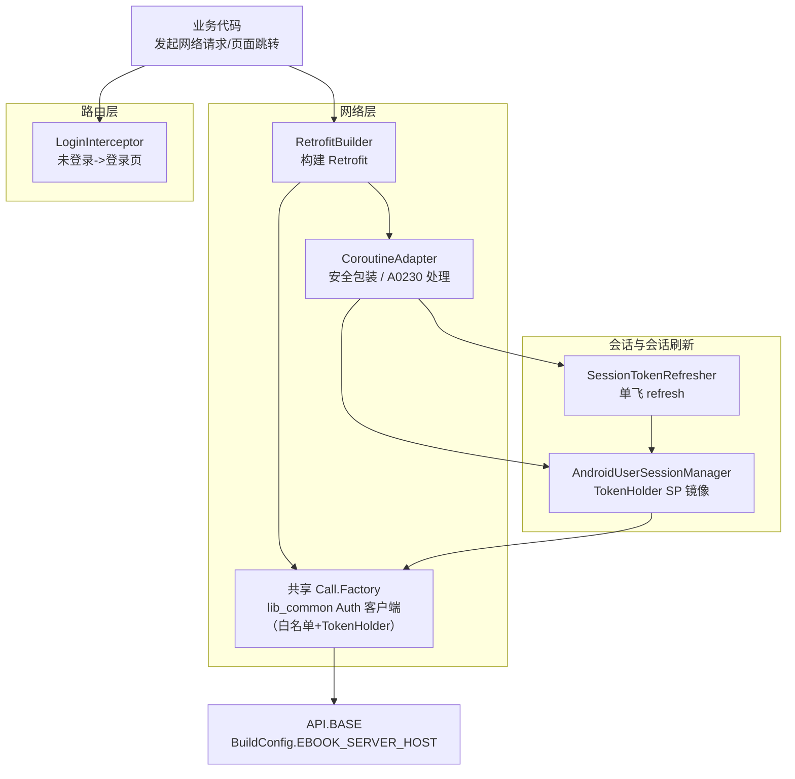
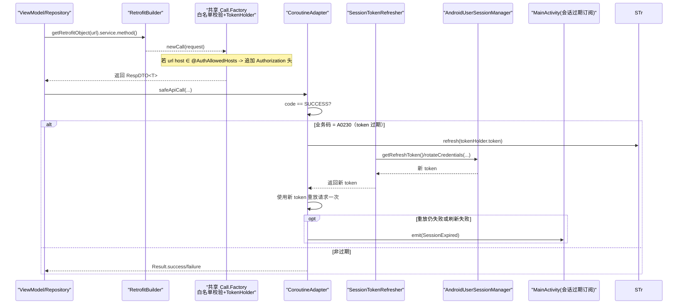
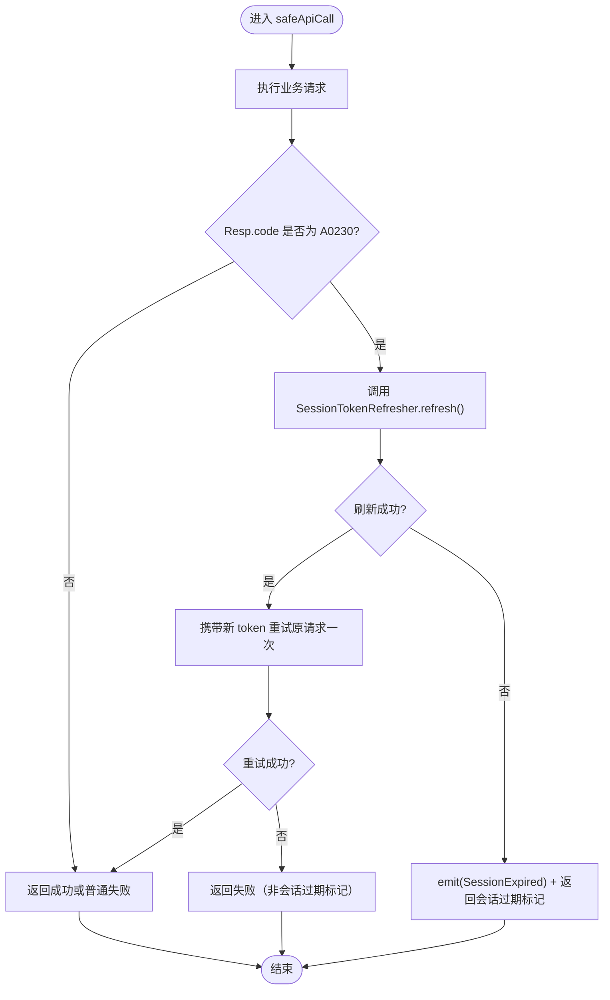
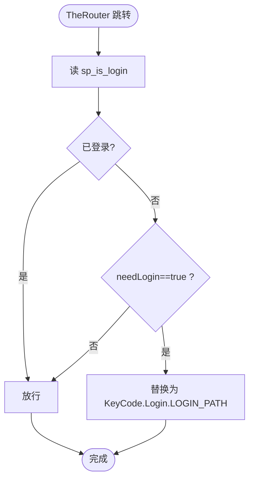
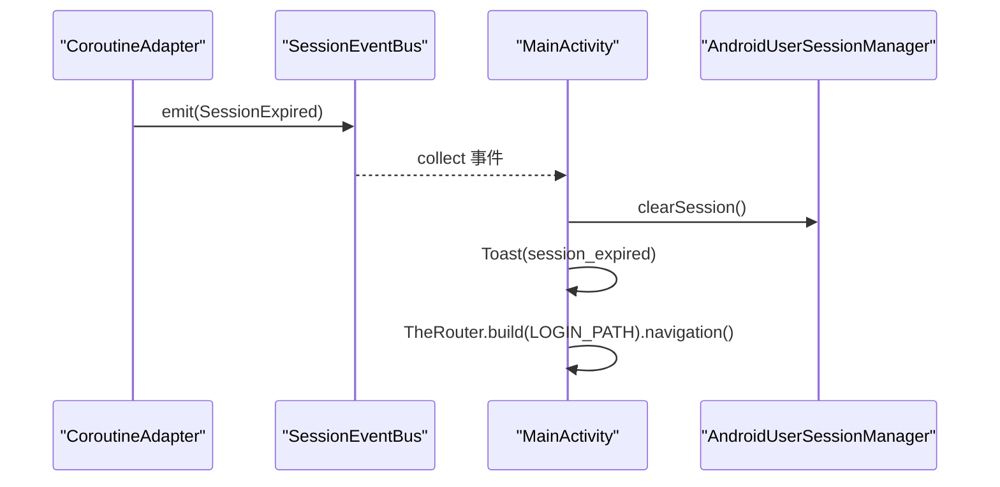
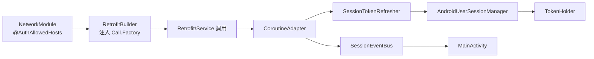

# 鉴权拦截器

<cite>
**本文引用的文件**
- [LoginInterceptor.kt](file://lib_book_common/src/main/java/com/ebook/common/interceptor/LoginInterceptor.kt)
- [NetworkModule.kt](file://lib_ebook_api/src/main/java/com/ebook/api/utils/NetworkModule.kt)
- [RetrofitBuilder.kt](file://lib_ebook_api/src/main/java/com/ebook/api/RetrofitBuilder.kt)
- [API.kt](file://lib_ebook_api/src/main/java/com/ebook/api/config/API.kt)
- [AndroidUserSessionManager.kt](file://lib_book_common/src/main/java/com/ebook/common/domain/AndroidUserSessionManager.kt)
- [CoroutineAdapter.kt](file://lib_ebook_api/src/main/java/com/ebook/api/utils/CoroutineAdapter.kt)
- [SessionTokenRefresher.kt](file://lib_book_common/src/main/java/com/ebook/common/domain/SessionTokenRefresher.kt)
- [MainActivity.kt](file://module_main/src/main/java/com/ebook/main/MainActivity.kt)
- [KeyCode.kt](file://lib_book_common/src/main/java/com/ebook/common/event/KeyCode.kt)
</cite>

## 目录
1. [简介](#简介)
2. [项目结构与相关组件](#项目结构与相关组件)
3. [核心组件](#核心组件)
4. [架构总览](#架构总览)
5. [详细组件分析](#详细组件分析)
6. [依赖关系分析](#依赖关系分析)
7. [性能与并发特性](#性能与并发特性)
8. [故障排查指南](#故障排查指南)
9. [结论](#结论)

## 简介
本文聚焦应用的鉴权体系，围绕两个层次的“拦截”机制展开：
- 网络层：基于 OkHttp/HTTP 客户端的请求级鉴权（白名单 Host、access token 注入、A0230 会话过期处理流程）。
- 路由层：基于 TheRouter 的页面访问鉴权（未登录访问受保护页面的统一重定向到登录页）。

说明：当前仓库中并未保留独立的“AuthInterceptor”源码文件。认证逻辑由 lib_common 提供的共享 OkHttp Call.Factory 负责（含白名单 + TokenHolder），本仓库在 NetworkModule 中绑定白名单 Host，并在 RetrofitBuilder 中统一使用该工厂。本文仍会按实际调用链解释该拦截器的运行方式，并与本地 Router 拦截器配合给出端到端的鉴权流程。

## 项目结构与相关组件
- 白名单 Host 配置定义在网络模块（NetworkModule.kt），提供 @AuthAllowedHosts 注解集，值来自 BuildConfig.EBOOK_SERVER_HOST。
- 用户会话状态管理与 Token 持有者在 AndroidUserSessionManager.kt，负责登录态、refresh_token 持久化，以及把 access token 同步到 TokenHolder。
- 路由鉴权通过 LoginInterceptor.kt 实现：在未登录且目标需登录时替换为目标路由为登录页。
- A0230（token 过期）的网络侧处置集中在 CoroutineAdapter.kt，配合 SessionTokenRefresher.kt 执行静默刷新；刷新失败后通过 SessionEventBus 通知 MainActivity.kt 完成清会话并跳转登录。

图示来源
- [NetworkModule.kt:29-42](file://lib_ebook_api/src/main/java/com/ebook/api/utils/NetworkModule.kt#L29-L42)
- [RetrofitBuilder.kt:24-44](file://lib_ebook_api/src/main/java/com/ebook/api/RetrofitBuilder.kt#L24-L44)
- [API.kt:13-25](file://lib_ebook_api/src/main/java/com/ebook/api/config/API.kt#L13-L25)
- [AndroidUserSessionManager.kt:59-84](file://lib_book_common/src/main/java/com/ebook/common/domain/AndroidUserSessionManager.kt#L59-L84)
- [CoroutineAdapter.kt:17-34](file://lib_ebook_api/src/main/java/com/ebook/api/utils/CoroutineAdapter.kt#L17-L34)
- [SessionTokenRefresher.kt:41-96](file://lib_book_common/src/main/java/com/ebook/common/domain/SessionTokenRefresher.kt#L41-L96)
- [LoginInterceptor.kt:14-41](file://lib_book_common/src/main/java/com/ebook/common/interceptor/LoginInterceptor.kt#L14-L41)

节来源
- [NetworkModule.kt:29-72](file://lib_ebook_api/src/main/java/com/ebook/api/utils/NetworkModule.kt#L29-L72)
- [RetrofitBuilder.kt:13-44](file://lib_ebook_api/src/main/java/com/ebook/api/RetrofitBuilder.kt#L13-L44)
- [API.kt:1-25](file://lib_ebook_api/src/main/java/com/ebook/api/config/API.kt#L1-L25)

## 核心组件
- 白名单 Host 提供者：NetworkModule 以 @AuthAllowedHosts 提供集合，内容为 BuildConfig.EBOOK_SERVER_HOST，供 lib_common 的共享客户端判定是否附加鉴权头。
- Token 持有者：AndroidUserSessionManager 维护登录态，登录成功后将 access token 写入 TokenHolder，确保共享客户端能读取到最新令牌。
- 路由鉴权：LoginInterceptor 通过 SPUtil.get("sp_is_login") 判断登录态，必要时将目标路由替换为登录地址。
- 会话过期处理：CoroutineAdapter 遇到 A0230 时触发单飞刷新；成功则重放一次请求；失败则发射会话过期事件，由主界面消费并统一清会话跳转。
- 站点基址：API.kt 统一从 BuildConfig.EBOOK_SERVER_HOST 读取服务端主机地址，保证客户端与服务端域名一致。

节来源
- [NetworkModule.kt:35-42](file://lib_ebook_api/src/main/java/com/ebook/api/utils/NetworkModule.kt#L35-L42)
- [AndroidUserSessionManager.kt:59-84](file://lib_book_common/src/main/java/com/ebook/common/domain/AndroidUserSessionManager.kt#L59-L84)
- [LoginInterceptor.kt:21-41](file://lib_book_common/src/main/java/com/ebook/common/interceptor/LoginInterceptor.kt#L21-L41)
- [CoroutineAdapter.kt:41-62](file://lib_ebook_api/src/main/java/com/ebook/api/utils/CoroutineAdapter.kt#L41-L62)
- [API.kt:13-18](file://lib_ebook_api/src/main/java/com/ebook/api/config/API.kt#L13-L18)

## 架构总览
从调用起点到结果返回的关键路径如下：

图示来源
- [RetrofitBuilder.kt:34-44](file://lib_ebook_api/src/main/java/com/ebook/api/RetrofitBuilder.kt#L34-L44)
- [NetworkModule.kt:35-42](file://lib_ebook_api/src/main/java/com/ebook/api/utils/NetworkModule.kt#L35-L42)
- [CoroutineAdapter.kt:41-62](file://lib_ebook_api/src/main/java/com/ebook/api/utils/CoroutineAdapter.kt#L41-L62)
- [SessionTokenRefresher.kt:50-91](file://lib_book_common/src/main/java/com/ebook/common/domain/SessionTokenRefresher.kt#L50-L91)
- [AndroidUserSessionManager.kt:59-84](file://lib_book_common/src/main/java/com/ebook/common/domain/AndroidUserSessionManager.kt#L59-L84)
- [MainActivity.kt:70-79](file://module_main/src/main/java/com/ebook/main/MainActivity.kt#L70-L79)

## 详细组件分析

### 一、请求级鉴权（Auth 客户端）与白名单
- 白名单 Host 注册：
  - NetworkModule 暴露 Set<String> 白名单，值为 BuildConfig.EBOOK_SERVER_HOST，被标注 @AuthAllowedHosts。
  - 当 OkHttp 请求的目标主机命中白名单时，共享客户端会从 TokenHolder 中取出当前 access token 并添加到请求头（Authorization），否则不附加。
- Retrofit 构建与调用装配：
  - RetrofitBuilder 使用注入的 Lazy<Call.Factory> 作为 callFactory，从而复用包含 Auth 拦截器的客户端；同时显式注册 kotlinx 序列化转换器与 Scalars 转换器。
- 站点基址：
  - API 常量从 BuildConfig.EBOOK_SERVER_HOST 获取主机地址，保证各服务 URL 来源一致。
- 书源纯净客户端：
  - @Named("source") 提供不带 token 的 OkHttpClient，避免 token 泄露给第三方网站。

节来源
- [NetworkModule.kt:35-56](file://lib_ebook_api/src/main/java/com/ebook/api/utils/NetworkModule.kt#L35-L56)
- [RetrofitBuilder.kt:24-44](file://lib_ebook_api/src/main/java/com/ebook/api/RetrofitBuilder.kt#L24-L44)
- [API.kt:13-25](file://lib_ebook_api/src/main/java/com/ebook/api/config/API.kt#L13-L25)

### 二、Token 的获取与更新机制
- Token 来源：
  - AndroidUserSessionManager 保存 refresh token 到 SharedPreferences，并将 access token 设置到 TokenHolder（内存）以便后续请求携带。
  - 冷启动时将持久化的 session 恢复到内存态，并将 refreshToken 写入 TokenHolder（用于无 access token 时的首请求恢复能力）。
- 刷新流程：
  - CoroutineAdapter 收到 A0230 后委托 SessionTokenRefresher 单飞刷新，使用刷新接口取回新的 access token，并通过 rotateCredentials 仅更新双 token（access 进内存，refresh 落盘）。
  - 刷新成功后，CoroutineAdapter 自动重放原请求一次（只重试一次以避免风暴）。
- 生命周期与容错：
  - 若 refresh 失败或无可用 refresh token，则上报会话过期事件，上层进行统一处置（清会话、提示、跳登录）。

图示来源
- [CoroutineAdapter.kt:41-112](file://lib_ebook_api/src/main/java/com/ebook/api/utils/CoroutineAdapter.kt#L41-L112)
- [SessionTokenRefresher.kt:50-91](file://lib_book_common/src/main/java/com/ebook/common/domain/SessionTokenRefresher.kt#L50-L91)
- [AndroidUserSessionManager.kt:87-98](file://lib_book_common/src/main/java/com/ebook/common/domain/AndroidUserSessionManager.kt#L87-L98)

节来源
- [AndroidUserSessionManager.kt:45-84](file://lib_book_common/src/main/java/com/ebook/common/domain/AndroidUserSessionManager.kt#L45-L84)
- [SessionTokenRefresher.kt:15-96](file://lib_book_common/src/main/java/com/ebook/common/domain/SessionTokenRefresher.kt#L15-L96)
- [CoroutineAdapter.kt:64-112](file://lib_ebook_api/src/main/java/com/ebook/api/utils/CoroutineAdapter.kt#L64-L112)

### 三、路由级鉴权（LoginInterceptor）与未登录跳转
- 判断登录态：
  - 通过 SPUtil 读取 sp_is_login 标识位，若无则视为未登录。
- 目标是否需要登录：
  - 通过 RouteItem 扩展字段 needLogin 判断；未设置默认不拦截。
- 未登录处理：
  - 将目标路由替换为登录页路径（KeyCode.Login.LOGIN_PATH）。
- 与登录态一致性：
  - AndroidUserSessionManager 在登录时同步写入 sp_is_login，登出时一并清除，确保路由拦截与网络拦截的登录态一致。

图示来源
- [LoginInterceptor.kt:21-41](file://lib_book_common/src/main/java/com/ebook/common/interceptor/LoginInterceptor.kt#L21-L41)
- [KeyCode.kt:13-31](file://lib_book_common/src/main/java/com/ebook/common/event/KeyCode.kt#L13-L31)
- [AndroidUserSessionManager.kt:79-84](file://lib_book_common/src/main/java/com/ebook/common/domain/AndroidUserSessionManager.kt#L79-L84)

节来源
- [LoginInterceptor.kt:14-41](file://lib_book_common/src/main/java/com/ebook/common/interceptor/LoginInterceptor.kt#L14-L41)
- [KeyCode.kt:13-41](file://lib_book_common/src/main/java/com/ebook/common/event/KeyCode.kt#L13-L41)
- [AndroidUserSessionManager.kt:61-84](file://lib_book_common/src/main/java/com/ebook/common/domain/AndroidUserSessionManager.kt#L61-L84)

### 四、会话过期到跳转登录页的全链路
- 触发点：
  - CoroutineAdapter 在响应体业务码为 A0230 时进入刷新流程。
- 处理策略：
  - 优先尝试静默刷新；成功则用新 token 重放请求一次。
  - 刷新失败或不可恢复（无 refresh token）时，发出 SessionEvent.SessionExpired。
- 全局收口：
  - MainActivity 长期驻留期间订阅会话事件，收到后调用 userSessionManager.clearSession() 清理会话、Toast 提示、跳转登录页。

图示来源
- [CoroutineAdapter.kt:92-98](file://lib_ebook_api/src/main/java/com/ebook/api/utils/CoroutineAdapter.kt#L92-L98)
- [MainActivity.kt:70-79](file://module_main/src/main/java/com/ebook/main/MainActivity.kt#L70-L79)
- [AndroidUserSessionManager.kt:111-133](file://lib_book_common/src/main/java/com/ebook/common/domain/AndroidUserSessionManager.kt#L111-L133)

节来源
- [CoroutineAdapter.kt:92-98](file://lib_ebook_api/src/main/java/com/ebook/api/utils/CoroutineAdapter.kt#L92-L98)
- [MainActivity.kt:68-79](file://module_main/src/main/java/com/ebook/main/MainActivity.kt#L68-L79)
- [AndroidUserSessionManager.kt:100-133](file://lib_book_common/src/main/java/com/ebook/common/domain/AndroidUserSessionManager.kt#L100-L133)

## 依赖关系分析
- NetworkModule 仅暴露白名单与两类纯净客户端（书源、发布检查），认证/业务请求统一走 lib_common 的共享 Call.Factory。
- RetrofitBuilder 不再持有 OkHttp 实例，转而接受外部提供的 Call.Factory，降低循环依赖并统一配置来源。
- AndroidUserSessionManager 是会话数据唯一事实源，既负责 SP 与内存 StateFlow 同步，也与 TokenHolder 双向联动。
- CoroutineAdapter 屏蔽业务码与 A0230 细节，统一封装 Result 并对外暴露会话过期异常类型，让调用方只需关注业务结果。
- MainActivity 作为应用级宿主管网会话过期事件的订阅与处置。

图示来源
- [NetworkModule.kt:35-42](file://lib_ebook_api/src/main/java/com/ebook/api/utils/NetworkModule.kt#L35-L42)
- [RetrofitBuilder.kt:24-44](file://lib_ebook_api/src/main/java/com/ebook/api/RetrofitBuilder.kt#L24-L44)
- [CoroutineAdapter.kt:30-34](file://lib_ebook_api/src/main/java/com/ebook/api/utils/CoroutineAdapter.kt#L30-L34)
- [SessionTokenRefresher.kt:41-46](file://lib_book_common/src/main/java/com/ebook/common/domain/SessionTokenRefresher.kt#L41-L46)
- [AndroidUserSessionManager.kt:28-34](file://lib_book_common/src/main/java/com/ebook/common/domain/AndroidUserSessionManager.kt#L28-L34)

节来源
- [NetworkModule.kt:19-72](file://lib_ebook_api/src/main/java/com/ebook/api/utils/NetworkModule.kt#L19-L72)
- [RetrofitBuilder.kt:24-44](file://lib_ebook_api/src/main/java/com/ebook/api/RetrofitBuilder.kt#L24-L44)
- [CoroutineAdapter.kt:29-34](file://lib_ebook_api/src/main/java/com/ebook/api/utils/CoroutineAdapter.kt#L29-L34)

## 性能与并发特性
- 白名单匹配：Set<String> 存储，查询复杂度 O(1)，影响极小。
- 请求头附加：仅在命中白名单且 TokenHolder 存在 token 时追加 Authorization 头，对象创建开销极低。
- 令牌获取：Access token 走内存单例（TokenHolder），冷启动无 token 则由首个需要刷新的请求触发恢复流程。
- 静默刷新互斥：使用 Mutex 串行刷新，防止同一时间多个过期请求打爆刷新接口，也避免旧 refresh 失效后的重复失败。
- 线程模型：network 调用切至 IO 线程，刷新与重放均在协程上下文中有序进行，避免阻塞主线程。
- 事件总线：SharedFlow 采用 tryEmit + 小缓冲，丢弃重复过期事件，避免阻塞请求线程。
- 资源占用：无常驻任务；只在请求时介入；TokenHolder 仅内存驻留，避免明文持久化带来的安全风险。

[本节为通用性能讨论，未直接分析具体代码片段]

## 故障排查指南
- 白名单未生效
  - 现象：对服务端发起的请求未携带 Authorization。
  - 检查项：BuildConfig.EBOOK_SERVER_HOST 是否正确；NetworkModule 提供的 Set 是否包含该 host；RetrofitBuilder 是否使用了共享 Call.Factory。
- 始终 401/A0230
  - 现象：首次请求报 A0230，随后反复失败或不跳转登录。
  - 检查项：是否有有效 refresh token；SessionTokenRefresher 刷新是否返回新 token；MainActivity 是否订阅 SessionEvent 并完成清会话跳转；CoroutineAdapter 返回的是会话过期异常标记还是其它异常。
- 路由不拦截未登录跳转
  - 现象：未登录仍可进入受保护页面。
  - 检查项：SP_IS_LOGIN 是否与登录/登出操作保持一致；路由 extra 中 needLogin 是否正确；LoginInterceptor 优先级是否低于其他路由插件导致顺序问题。
- 登录后仍提示未登录
  - 现象：登录成功后页面仍认为未登录。
  - 检查项：AndroidUserSessionManager.saveSession 是否写入了 sp_is_login；是否存在多进程/多实例导致 SP 不同步；UI 层是否正确读取了最新的登录态。

节来源
- [NetworkModule.kt:35-42](file://lib_ebook_api/src/main/java/com/ebook/api/utils/NetworkModule.kt#L35-L42)
- [AndroidUserSessionManager.kt:61-84](file://lib_book_common/src/main/java/com/ebook/common/domain/AndroidUserSessionManager.kt#L61-L84)
- [CoroutineAdapter.kt:92-98](file://lib_ebook_api/src/main/java/com/ebook/api/utils/CoroutineAdapter.kt#L92-L98)
- [LoginInterceptor.kt:21-41](file://lib_book_common/src/main/java/com/ebook/common/interceptor/LoginInterceptor.kt#L21-L41)
- [KeyCode.kt:13-31](file://lib_book_common/src/main/java/com/ebook/common/event/KeyCode.kt#L13-L31)

## 结论
- 认证/鉴权采用“路由拦截 + 网络拦截”双层协作：路由层保障受保护页面在导航前即进行登录态校验；网络层基于白名单与 TokenHolder 精准附加授权信息，并通过统一适配器处理 A0230 会话过期。
- 关键设计取舍包括：
  - access token 仅驻内存（TokenHolder），refresh token 持久化；冷启动首请求由网络层驱动恢复。
  - 单飞刷新避免并发风暴，重放一次确保体验连贯性。
  - 白名单集中管理，与 BuildConfig 绑定确保多环境统一。
- 建议的最佳实践：
  - 新增服务端域名时，务必在 NetworkModule 的白名单中加入对应 host，或在构建期配置统一的 EBOOK_SERVER_HOST。
  - 任何可能改变登录态的操作均应通过 AndroidUserSessionManager 统一执行，确保 SP、内存与 TokenHolder 三者一致。
  - 页面需要受保护时，通过路由参数标记 needLogin=true，避免在各页面重复编写登录检查逻辑。

[本节为总结性内容，无需列出来源]