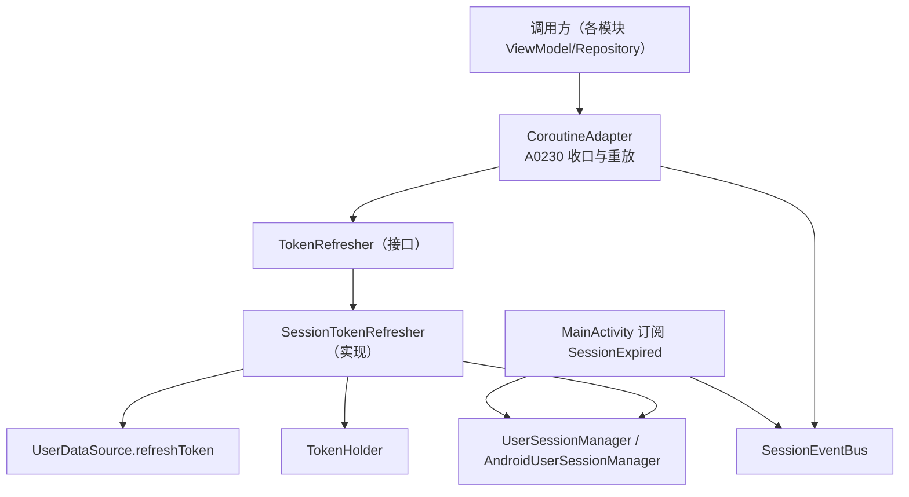
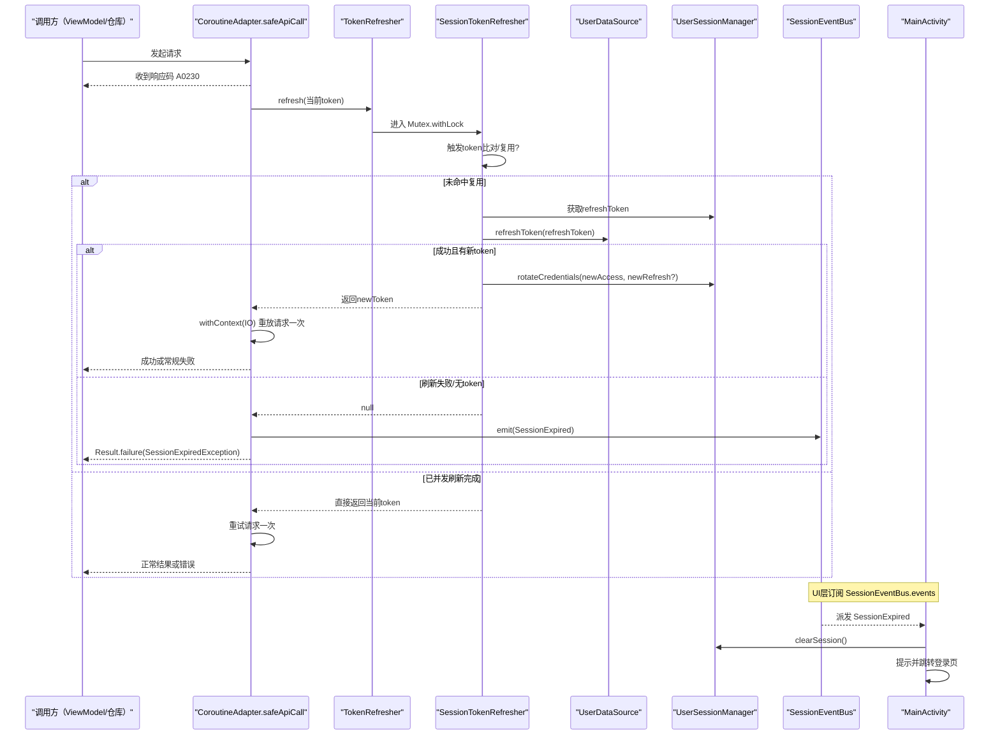
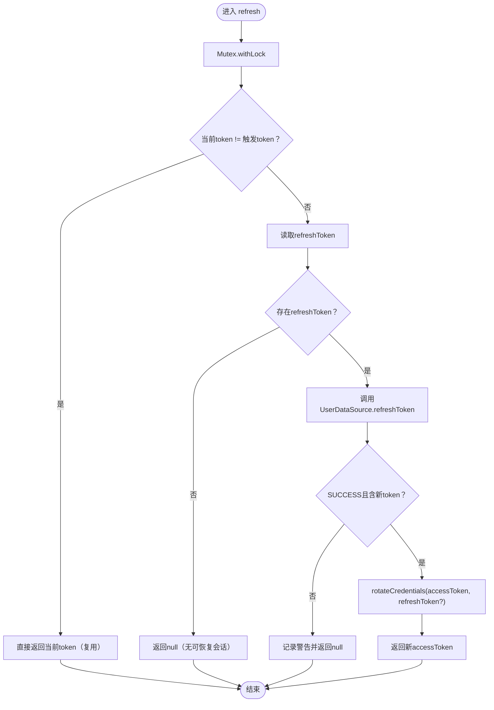
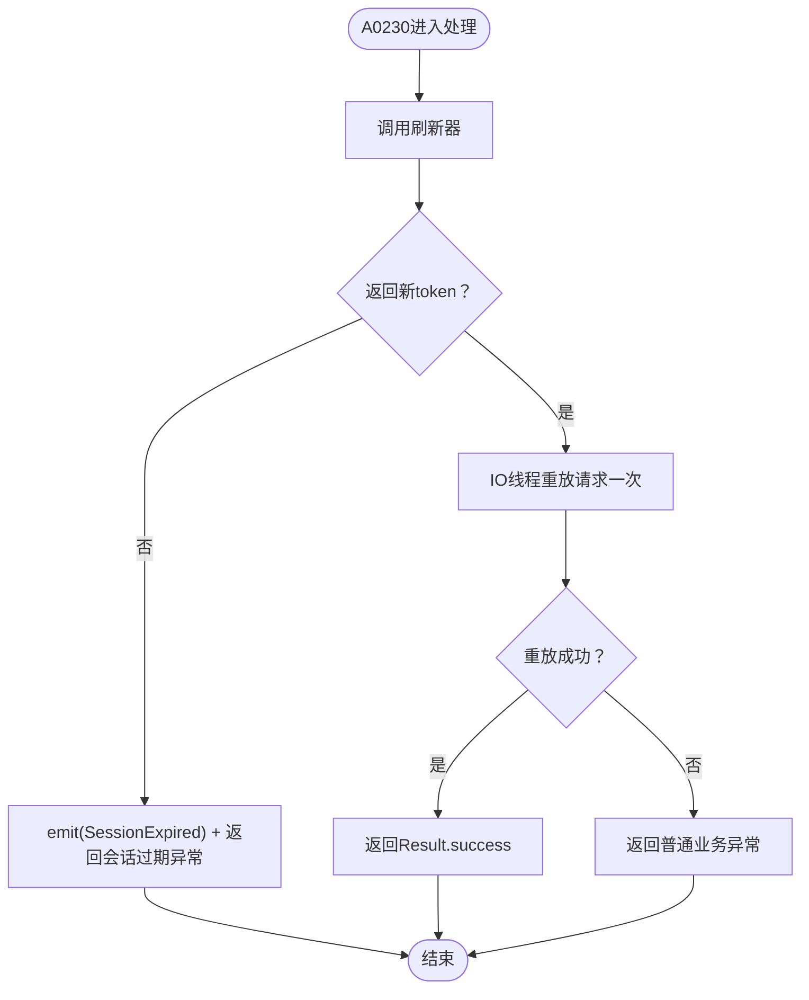

# 静默刷新机制

<cite>
**本文件引用的源文件**
- [lib_book_common/src/main/java/com/ebook/common/domain/SessionTokenRefresher.kt](file://lib_book_common/src/main/java/com/ebook/common/domain/SessionTokenRefresher.kt)
- [lib_ebook_api/src/main/java/com/ebook/api/auth/TokenRefresher.kt](file://lib_ebook_api/src/main/java/com/ebook/api/auth/TokenRefresher.kt)
- [lib_ebook_api/src/main/java/com/ebook/api/auth/SessionEventBus.kt](file://lib_ebook_api/src/main/java/com/ebook/api/auth/SessionEventBus.kt)
- [lib_ebook_api/src/main/java/com/ebook/api/utils/CoroutineAdapter.kt](file://lib_ebook_api/src/main/java/com/ebook/api/utils/CoroutineAdapter.kt)
- [lib_book_common/src/main/java/com/ebook/common/domain/UserSessionManager.kt](file://lib_book_common/src/main/java/com/ebook/common/domain/UserSessionManager.kt)
- [lib_book_common/src/main/java/com/ebook/common/domain/AndroidUserSessionManager.kt](file://lib_book_common/src/main/java/com/ebook/common/domain/AndroidUserSessionManager.kt)
- [lib_book_common/src/main/java/com/ebook/common/di/SessionModule.kt](file://lib_book_common/src/main/java/com/ebook/common/di/SessionModule.kt)
- [lib_ebook_api/src/main/java/com/ebook/api/service/user/UserDataSource.kt](file://lib_ebook_api/src/main/java/com/ebook/api/service/user/UserDataSource.kt)
- [lib_ebook_api/src/main/java/com/ebook/api/entity/RefreshTokenRequest.kt](file://lib_ebook_api/src/main/java/com/ebook/api/entity/RefreshTokenRequest.kt)
- [module_main/src/main/java/com/ebook/main/MainActivity.kt](file://module_main/src/main/java/com/ebook/main/MainActivity.kt)
- [lib_book_common/src/test/java/com/ebook/common/domain/SessionTokenRefresherTest.kt](file://lib_book_common/src/test/java/com/ebook/common/domain/SessionTokenRefresherTest.kt)
- [docs/adr/0010-silent-refresh-seam-and-session-expiry-bus.md](file://docs/adr/0010-silent-refresh-seam-and-session-expiry-bus.md)
- [docs/adr/0011-token-identity-decoupling-token-only-refresh.md](file://docs/adr/0011-token-identity-decoupling-token-only-refresh.md)
</cite>

## 目录
1. [简介](#简介)
2. [项目结构与角色定位](#项目结构与角色定位)
3. [核心组件与职责](#核心组件与职责)
4. [整体架构与数据流](#整体架构与数据流)
5. [关键流程详解](#关键流程详解)
6. [并发控制与单飞刷新](#并发控制与单飞刷新)
7. [失败处理、重试与故障恢复](#失败处理重试与故障恢复)
8. [性能优化建议](#性能优化建议)
9. [排错指南](#排错指南)
10. [结论](#结论)

## 简介
本文档系统性说明项目的「静默刷新机制」：当服务端返回业务码 A0230（access token 过期）时，网络层统一检测并触发单飞刷新；成功则重放原请求一次，失败则通过事件总线向 UI 层发送会话过期事件，由宿主清会话并跳转登录。实现围绕以下关键点展开：TokenRefresher 接口的单飞刷新、Mutex 互斥与触发 token 比对避免重复刷新、冷启动 access token 为空时的特殊处理、刷新直接调用 UserDataSource 避免陷入死循环、异常捕获和日志记录、SessionEventBus 的事件发射与订阅、协程取消异常的正确上抛，以及配套的重试策略与故障恢复设计。

## 项目结构与角色定位
- 接口契约定义在 lib_ebook_api，面向上层暴露刷新能力与全局事件总线。
- 刷新实现在 lib_book_common，依赖上层提供的 TokenHolder 与会话持久化。
- 网络调用的统一适配与 A0230 收口在 lib_ebook_api 的 CoroutineAdapter。
- UI 层的唯一出口是 module_main 的 MainActivity，负责消费会话过期事件并完成清会话和跳转。

**图表来源**
- [lib_ebook_api/src/main/java/com/ebook/api/utils/CoroutineAdapter.kt:17-112](file://lib_ebook_api/src/main/java/com/ebook/api/utils/CoroutineAdapter.kt#L17-L112)
- [lib_ebook_api/src/main/java/com/ebook/api/auth/TokenRefresher.kt:16-27](file://lib_ebook_api/src/main/java/com/ebook/api/auth/TokenRefresher.kt#L16-L27)
- [lib_book_common/src/main/java/com/ebook/common/domain/SessionTokenRefresher.kt:15-95](file://lib_book_common/src/main/java/com/ebook/common/domain/SessionTokenRefresher.kt#L15-L95)
- [lib_ebook_api/src/main/java/com/ebook/api/service/user/UserDataSource.kt:28-28](file://lib_ebook_api/src/main/java/com/ebook/api/service/user/UserDataSource.kt#L28-L28)
- [lib_book_common/src/main/java/com/ebook/common/domain/UserSessionManager.kt:13-62](file://lib_book_common/src/main/java/com/ebook/common/domain/UserSessionManager.kt#L13-L62)
- [lib_book_common/src/main/java/com/ebook/common/domain/AndroidUserSessionManager.kt:17-162](file://lib_book_common/src/main/java/com/ebook/common/domain/AndroidUserSessionManager.kt#L17-L162)
- [lib_ebook_api/src/main/java/com/ebook/api/auth/SessionEventBus.kt:9-44](file://lib_ebook_api/src/main/java/com/ebook/api/auth/SessionEventBus.kt#L9-L44)
- [module_main/src/main/java/com/ebook/main/MainActivity.kt:54-76](file://module_main/src/main/java/com/ebook/main/MainActivity.kt#L54-L76)

**部分来源**
- [docs/adr/0010-silent-refresh-seam-and-session-expiry-bus.md:1-63](file://docs/adr/0010-silent-refresh-seam-and-session-expiry-bus.md#L1-L63)
- [docs/adr/0011-token-identity-decoupling-token-only-refresh.md:3-80](file://docs/adr/0011-token-identity-decoupling-token-only-refresh.md#L3-L80)

## 核心组件与职责
- TokenRefresher：定义 refresh(expiredAccessToken?) 的单飞刷新接口；刷新自身不能通过 CoroutineAdapter 调用，避免死循环。
- SessionTokenRefresher：Mutex 串行化 + 触发 token 比对复用；直调 UserDataSource.refreshToken；成功后旋转双 token（只更新凭据，不动身份），处理取消与异常。
- UserSessionManager/AndroidUserSessionManager：保存会话与 rotateCredentials；access token 只驻内存，refresh token 落盘。
- CoroutineAdapter：safeApiCall 统一响应码与异常处理；识别 A0230 → 调用刷新 → 仅重试一次 → 失败发事件并返回会话过期标记异常。
- SessionEventBus：SharedFlow（缓冲 1，非阻塞 tryEmit）；UI 层订阅 SessionExpired，清理会话并跳转登录。
- Hilt SessionModule：将 TokenRefresher 接口绑定到具体实现，完成装配。

**部分来源**
- [lib_ebook_api/src/main/java/com/ebook/api/auth/TokenRefresher.kt:3-27](file://lib_ebook_api/src/main/java/com/ebook/api/auth/TokenRefresher.kt#L3-L27)
- [lib_book_common/src/main/java/com/ebook/common/domain/SessionTokenRefresher.kt:41-95](file://lib_book_common/src/main/java/com/ebook/common/domain/SessionTokenRefresher.kt#L41-L95)
- [lib_book_common/src/main/java/com/ebook/common/domain/UserSessionManager.kt:13-62](file://lib_book_common/src/main/java/com/ebook/common/domain/UserSessionManager.kt#L13-L62)
- [lib_book_common/src/main/java/com/ebook/common/domain/AndroidUserSessionManager.kt:17-162](file://lib_book_common/src/main/java/com/ebook/common/domain/AndroidUserSessionManager.kt#L17-L162)
- [lib_ebook_api/src/main/java/com/ebook/api/utils/CoroutineAdapter.kt:17-149](file://lib_ebook_api/src/main/java/com/ebook/api/utils/CoroutineAdapter.kt#L17-L149)
- [lib_ebook_api/src/main/java/com/ebook/api/auth/SessionEventBus.kt:9-44](file://lib_ebook_api/src/main/java/com/ebook/api/auth/SessionEventBus.kt#L9-L44)
- [lib_book_common/src/main/java/com/ebook/common/di/SessionModule.kt:22-37](file://lib_book_common/src/main/java/com/ebook/common/di/SessionModule.kt#L22-L37)

## 整体架构与数据流
- 业务调用经 CoroutineAdapter.safeApiCall 统一拦截响应。
- 遇到业务码 A0230，进入 handleTokenExpired：先尝试刷新（可能并行复用结果）→ 成功则重放一次原请求 → 失败则发送 SessionExpired 事件，并返回会话过期异常标记。
- 刷新由 SessionTokenRefresher 执行，内部用 Mutex 串行并比对触发 token；成功后 rotateCredentials 更新凭据而不重构身份；访问令牌仅内存持有。
- 主进程宿主 MainActivity 订阅事件流并执行三件套：清会话 + 提示 + 跳转登录。

**图表来源**
- [lib_ebook_api/src/main/java/com/ebook/api/utils/CoroutineAdapter.kt:41-112](file://lib_ebook_api/src/main/java/com/ebook/api/utils/CoroutineAdapter.kt#L41-L112)
- [lib_book_common/src/main/java/com/ebook/common/domain/SessionTokenRefresher.kt:50-90](file://lib_book_common/src/main/java/com/ebook/common/domain/SessionTokenRefresher.kt#L50-L90)
- [lib_book_common/src/main/java/com/ebook/common/domain/AndroidUserSessionManager.kt:87-98](file://lib_book_common/src/main/java/com/ebook/common/domain/AndroidUserSessionManager.kt#L87-L98)
- [lib_ebook_api/src/main/java/com/ebook/api/auth/SessionEventBus.kt:31-44](file://lib_ebook_api/src/main/java/com/ebook/api/auth/SessionEventBus.kt#L31-L44)
- [module_main/src/main/java/com/ebook/main/MainActivity.kt:72-76](file://module_main/src/main/java/com/ebook/main/MainActivity.kt#L72-L76)

## 关键流程详解
### 1) A0230 的检测与统一处置
- safeApiCall 在 IO 线程执行 apiCall；当 resp.code 等于 USER_ERROR_A0230 时，调用 handleTokenExpired。
- 传入 tokenHolder.token（可能是空串归一化的 null）作为触发时的过期 token，供刷新器做并发复用判定。
- 刷新过程对异常做了兜底，将非取消异常转为刷新失败，保证“会话过期”事件总是能发出；同时保留取消异常上抛，防止误判。

**部分来源**
- [lib_ebook_api/src/main/java/com/ebook/api/utils/CoroutineAdapter.kt:41-61](file://lib_ebook_api/src/main/java/com/ebook/api/utils/CoroutineAdapter.kt#L41-L61)
- [lib_ebook_api/src/main/java/com/ebook/api/utils/CoroutineAdapter.kt:71-112](file://lib_ebook_api/src/main/java/com/ebook/api/utils/CoroutineAdapter.kt#L71-L112)
- [docs/adr/0010-silent-refresh-seam-and-session-expiry-bus.md:17-43](file://docs/adr/0010-silent-refresh-seam-and-session-expiry-bus.md#L17-L43)

### 2) 单飞刷新与并发安全
- SessionTokenRefresher 以 Mutex.withLock 串行化刷新，确保同一时刻只有一个请求打 refresh 端点。
- 进锁后比较 expiredAccessToken 与 tokenHolder.token；若两者不同且当前不为空，表示已被其他并发请求刷新过，直接返回新 token，避免重复打接口。
- 冷启动场景下 access token 为空（由 AndroidUserSessionManager 加载会话时保持空串，不写入 SP），该守卫仍生效：只要当前有 token 且不同于触发值即为复用。

**部分来源**
- [lib_book_common/src/main/java/com/ebook/common/domain/SessionTokenRefresher.kt:48-58](file://lib_book_common/src/main/java/com/ebook/common/domain/SessionTokenRefresher.kt#L48-L58)
- [lib_book_common/src/main/java/com/ebook/common/domain/AndroidUserSessionManager.kt:45-48](file://lib_book_common/src/main/java/com/ebook/common/domain/AndroidUserSessionManager.kt#L45-L48)
- [lib_book_common/src/main/java/com/ebook/common/domain/AndroidUserSessionManager.kt:135-145](file://lib_book_common/src/main/java/com/ebook/common/domain/AndroidUserSessionManager.kt#L135-L145)
- [lib_book_common/src/test/java/com/ebook/common/domain/SessionTokenRefresherTest.kt:50-76](file://lib_book_common/src/test/java/com/ebook/common/domain/SessionTokenRefresherTest.kt#L50-L76)

### 3) 刷新直调 DataSource，规避死循环
- refresh 直接调用 UserDataSource.refreshToken，不走 CoroutineAdapter.safeApiCall，避免刷新失败再次落入 A0230 分支形成无限递归。
- 响应码 SUCCESS 才认为成功，否则返回 null 并在上层按刷新失败处理。

**部分来源**
- [lib_ebook_api/src/main/java/com/ebook/api/service/user/UserDataSource.kt:28-28](file://lib_ebook_api/src/main/java/com/ebook/api/service/user/UserDataSource.kt#L28-L28)
- [lib_book_common/src/main/java/com/ebook/common/domain/SessionTokenRefresher.kt:27-30](file://lib_book_common/src/main/java/com/ebook/common/domain/SessionTokenRefresher.kt#L27-L30)
- [lib_book_common/src/main/java/com/ebook/common/domain/SessionTokenRefresher.kt:66-73](file://lib_book_common/src/main/java/com/ebook/common/domain/SessionTokenRefresher.kt#L66-L73)

### 4) 凭证轮换与身份解耦
- 刷新成功后调用 rotateCredentials：仅更新内存中的 access token（并通过 TokenHolder 传播给后续请求），并落盘新的 refresh token（旧 refresh 在服务端已被硬删）。
- 不重建身份；不覆盖昵称/头像/uid；若响应缺失或为空 refresh token 则保留旧值，防止意外丢失可恢复凭据。
- 未登录或未保存 refresh token 的情况不会发起请求，直接返回 null。

**部分来源**
- [lib_book_common/src/main/java/com/ebook/common/domain/UserSessionManager.kt:32-42](file://lib_book_common/src/main/java/com/ebook/common/domain/UserSessionManager.kt#L32-L42)
- [lib_book_common/src/main/java/com/ebook/common/domain/AndroidUserSessionManager.kt:87-98](file://lib_book_common/src/main/java/com/ebook/common/domain/AndroidUserSessionManager.kt#L87-L98)
- [lib_book_common/src/main/java/com/ebook/common/domain/SessionTokenRefresher.kt:60-80](file://lib_book_common/src/main/java/com/ebook/common/domain/SessionTokenRefresher.kt#L60-L80)
- [docs/adr/0011-token-identity-decoupling-token-only-refresh.md:24-37](file://docs/adr/0011-token-identity-decoupling-token-only-refresh.md#L24-L37)

### 5) 会话过期事件与 UI 订阅
- 当刷新失败（包括无 refresh token、网络或服务端拒绝等），CoroutineAdapter 将 SessionEvent.SessionExpired 推入 SessionEventBus（缓冲 1，tryEmit 非阻塞），并返回带标记的失败异常（SessionExpiredException）。
- MainActivity 订阅 events，在收到 SessionExpired 时执行：clearSession、提示用户、跳转登录。
- 调用方 onFailure 遇会话过期标记异常仅记日志不再重复提示，避免重复弹窗。

**部分来源**
- [lib_ebook_api/src/main/java/com/ebook/api/auth/SessionEventBus.kt:9-44](file://lib_ebook_api/src/main/java/com/ebook/api/auth/SessionEventBus.kt#L9-L44)
- [lib_ebook_api/src/main/java/com/ebook/api/utils/CoroutineAdapter.kt:92-98](file://lib_ebook_api/src/main/java/com/ebook/api/utils/CoroutineAdapter.kt#L92-L98)
- [module_main/src/main/java/com/ebook/main/MainActivity.kt:54-76](file://module_main/src/main/java/com/ebook/main/MainActivity.kt#L54-L76)
- [docs/adr/0010-silent-refresh-seam-and-session-expiry-bus.md:31-43](file://docs/adr/0010-silent-refresh-seam-and-session-expiry-bus.md#L31-L43)

### 6) 协程取消异常的正确处理
- 刷新和重放两个阶段的取消异常都要原样上抛，不被吞掉；上层捕获取消会终止流程，但绝不触发「会话过期」逻辑，避免误踢用户。
- 若刷新阶段抛出 CancellationException，会直接透传给调用者；若异常为其他 Exception，则视为刷新失败并记录日志。

**部分来源**
- [lib_book_common/src/main/java/com/ebook/common/domain/SessionTokenRefresher.kt:82-88](file://lib_book_common/src/main/java/com/ebook/common/domain/SessionTokenRefresher.kt#L82-L88)
- [lib_ebook_api/src/main/java/com/ebook/api/utils/CoroutineAdapter.kt:52-61](file://lib_ebook_api/src/main/java/com/ebook/api/utils/CoroutineAdapter.kt#L52-L61)
- [lib_ebook_api/src/main/java/com/ebook/api/utils/CoroutineAdapter.kt:106-108](file://lib_ebook_api/src/main/java/com/ebook/api/utils/CoroutineAdapter.kt#L106-L108)
- [lib_book_common/src/test/java/com/ebook/common/domain/SessionTokenRefresherTest.kt:161-177](file://lib_book_common/src/test/java/com/ebook/common/domain/SessionTokenRefresherTest.kt#L161-L177)

## 并发控制与单飞刷新
- Mutex 互斥保证刷新顺序执行，避免多请求携带同一个已被作废的 refresh token 导致后续失败。
- 进入互斥体后，若发现当前 token 已与触发过期的 token 不一致，则认为其他请求已完成刷新，直接复用新 token，减少不必要的刷新请求。
- 冷启动 access token 为空时守卫仍可正常工作：只要当前有有效 token，即认为刷新已完成。
- 测试覆盖了冷启动并发刷新仅打一次真实接口、首次真刷其他排队复用、取消异常上抛等行为。

**图表来源**
- [lib_book_common/src/main/java/com/ebook/common/domain/SessionTokenRefresher.kt:48-90](file://lib_book_common/src/main/java/com/ebook/common/domain/SessionTokenRefresher.kt#L48-L90)

**部分来源**
- [lib_book_common/src/test/java/com/ebook/common/domain/SessionTokenRefresherTest.kt:50-107](file://lib_book_common/src/test/java/com/ebook/common/domain/SessionTokenRefresherTest.kt#L50-L107)

## 失败处理、重试与故障恢复
- 刷新失败路径：
  - 没有 refresh token：视为不可恢复，返回 null。
  - 服务端返回非成功码或缺少新 token：记录日志并返回 null。
  - 网络/未知异常：捕获并记录，返回 null。
  - 取消异常：上抛，不打「会话过期」事件。
- 重试策略：
  - 重放仅一次，重放结果不参与刷新判定，防止因刷新风暴导致的级联失败。
  - 重放自动携带新 token（刷新成功后通过 TokenHolder/Auto Header 机制同步）。
- 故障恢复：
  - 刷新失败会向事件总线发出 SessionExpired，由 UI 层统一清理并回到登录态，使状态机回归一致。
  - 请求方收到 SessionExpiredException 时仅记录日志，不再重复提示，避免用户体验受损。

**图表来源**
- [lib_ebook_api/src/main/java/com/ebook/api/utils/CoroutineAdapter.kt:71-112](file://lib_ebook_api/src/main/java/com/ebook/api/utils/CoroutineAdapter.kt#L71-L112)
- [lib_ebook_api/src/main/java/com/ebook/api/auth/SessionEventBus.kt:31-44](file://lib_ebook_api/src/main/java/com/ebook/api/auth/SessionEventBus.kt#L31-L44)
- [lib_book_common/src/main/java/com/ebook/common/domain/SessionTokenRefresher.kt:66-88](file://lib_book_common/src/main/java/com/ebook/common/domain/SessionTokenRefresher.kt#L66-L88)

**部分来源**
- [lib_book_common/src/test/java/com/ebook/common/domain/SessionTokenRefresherTest.kt:180-207](file://lib_book_common/src/test/java/com/ebook/common/domain/SessionTokenRefresherTest.kt#L180-L207)

## 性能优化建议
- 单飞刷新降低后端压力：Mutex 串行 + 触发 token 比对复用，避免大量并发刷新。
- 事件总线使用 SharedFlow 缓冲 1 且 tryEmit：幂等事件可丢弃重复，不阻塞请求线程。
- rotateCredentials 最小化写操作：仅更新必要字段，避免整段会话重建带来的不必要开销。
- 冷启动首请求多一次刷新是可接受的代价，已通过守卫尽量减少二次刷新次数。
- 可选增强（需评估风险后再引入）：对刷新设置限频窗口（例如 1s 内不重复刷新），或在极端并发下限制等待时间，以防止个别长尾请求长时间占用互斥体。

[本节为通用优化建议，无需特定代码片段来源]

## 排错指南
- 现象：页面反复提示失败且不跳转登录页
  - 检查是否收到 A0230，确认 CoroutineAdapter 已走 refresh 路径；查看刷新返回是否为 null。
  - 校验 refresh token 是否存在（getRefreshToken）；若不存在，属于不可恢复会话，应通过事件引导到登录页。
  - 查看是否有取消异常被吞掉，导致错误地触发会话过期。
  - 参考日志中刷新相关的警告与错误信息，定位服务端拒绝或网络问题。
- 现象：冷启动并发请求频繁刷新
  - 检查 TokenHolder 共享实例是否正确注入；测试中有用例验证了并发只打一次真实刷新。
  - 确认冷启动 access token 为空、但当前已有有效 token 时触发复用判断。
- 现象：刷新后昵称/头像丢失
  - 确认刷新路径调的是 rotateCredentials，而不是重新建立会话（saveSession）。

**部分来源**
- [lib_book_common/src/main/java/com/ebook/common/domain/SessionTokenRefresher.kt:66-88](file://lib_book_common/src/main/java/com/ebook/common/domain/SessionTokenRefresher.kt#L66-L88)
- [lib_book_common/src/main/java/com/ebook/common/domain/AndroidUserSessionManager.kt:87-98](file://lib_book_common/src/main/java/com/ebook/common/domain/AndroidUserSessionManager.kt#L87-L98)
- [lib_ebook_api/src/main/java/com/ebook/api/utils/CoroutineAdapter.kt:84-112](file://lib_ebook_api/src/main/java/com/ebook/api/utils/CoroutineAdapter.kt#L84-L112)
- [module_main/src/main/java/com/ebook/main/MainActivity.kt:72-76](file://module_main/src/main/java/com/ebook/main/MainActivity.kt#L72-L76)
- [lib_book_common/src/test/java/com/ebook/common/domain/SessionTokenRefresherTest.kt:50-177](file://lib_book_common/src/test/java/com/ebook/common/domain/SessionTokenRefresherTest.kt#L50-L177)

## 结论
本项目通过「网络层收口 + 接口抽象 + 上层实现 + 事件总线分发」的方式实现了稳定可靠的静默刷新：
- 用 TokenRefresher 接口解耦刷新能力，SessionTokenRefresher 提供基于 Mutex 的单飞刷新与触发 token 比对，保障并发安全与资源消耗最低。
- 刷新直调 DataSource 避开 CoroutineAdapter 的 A0230 环路，配合 rotateCredentials 完成凭证轮换并保持身份稳定。
- 所有会话过期后果通过 SessionEventBus 统一向上上报，UI 层集中处理，消除分散的业务分支和重复提示。
- 针对取消异常正确上抛避免误判；重放仅一次避免刷新风暴；整体具备可观测性与可维护性。

[本节总结性陈述，不包含具体代码引用]