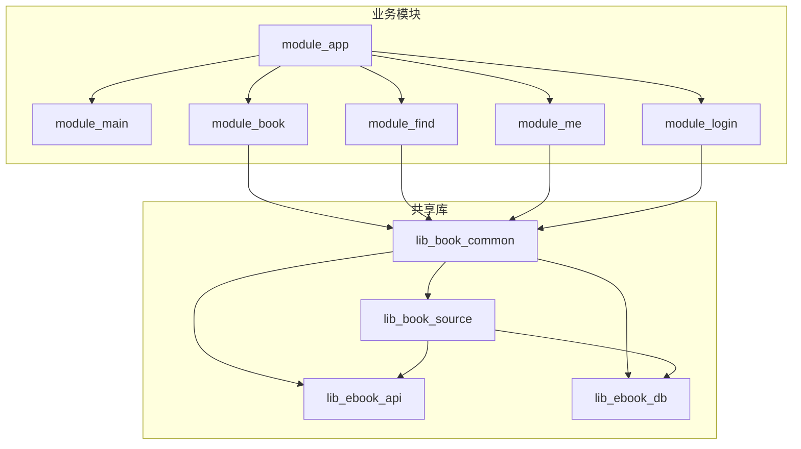
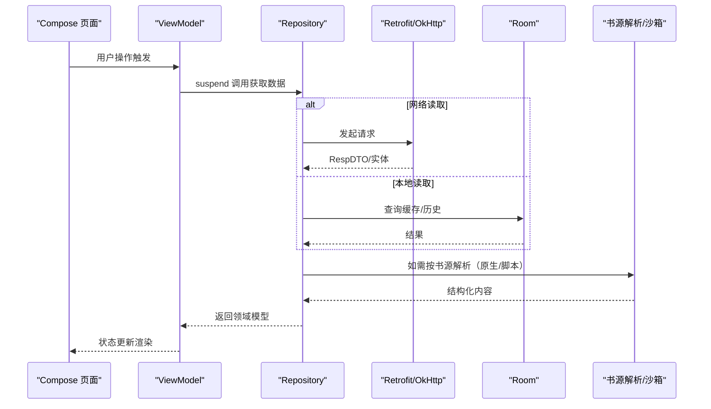
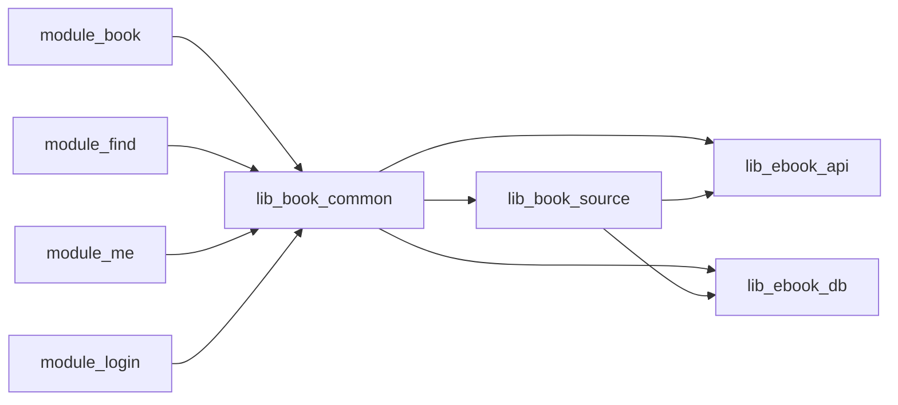

# 贡献指南

<cite>
**本文引用的文件**   
- [README.MD](file://README.MD)
- [AGENTS.md](file://AGENTS.md)
- [gradle/libs.versions.toml](file://gradle/libs.versions.toml)
- [gradle.properties](file://gradle.properties)
- [scripts/install-hooks.sh](file://scripts/install-hooks.sh)
- [build-logic/convention/src/main/kotlin/AndroidApplicationConventionPlugin.kt](file://build-logic/convention/src/main/kotlin/AndroidApplicationConventionPlugin.kt)
- [docs/test-coverage-todo.md](file://docs/test-coverage-todo.md)
</cite>

## 目录
1. [简介](#简介)
2. [项目结构](#项目结构)
3. [核心组件](#核心组件)
4. [架构总览](#架构总览)
5. [详细组件分析](#详细组件分析)
6. [依赖分析](#依赖分析)
7. [性能与构建优化](#性能与构建优化)
8. [故障排查](#故障排查)
9. [结论](#结论)
10. [附录：开发工作流速查](#附录开发工作流速查)

## 简介
本指南面向希望参与本项目（安卓小说阅读器）开发与贡献的开发者，覆盖环境搭建、代码规范、提交流程、测试要求、文档维护、构建发布、协作工具与新贡献者入门。目标是让不同背景的贡献者都能快速上手并高质量地提交变更。

## 项目结构
仓库采用多模块 Gradle 工程，职责清晰、边界明确：
- module_app：应用入口，组装所有功能模块（real/mock 双 flavor）
- module_main：主页、启动页
- module_book：书籍阅读、管理、评论（含阅读器，全部 Compose）
- module_find：书城、搜索、书库浏览
- module_me：个人中心、头像、评论管理、版本更新检查
- module_login：登录/注册/密码（Compose UI，Coroutines）
- lib_book_common：ebook 域共享 UI 组件、Provider 接口、书源管理器（通用工具类/基类归 lib_common）
- lib_book_source：书源解析专用层（原生解析器、脚本书源解释器、:js 沙箱执行器）
- lib_ebook_api：网络层（Retrofit、实体、拦截器）
- lib_ebook_db：Room 数据库实体与 DAO
- build-logic：自定义 Gradle 约定插件（统一构建配置）
- docs/adr：架构决策记录

图表来源
- [AGENTS.md:39-55](file://AGENTS.md#L39-L55)
- [README.MD:86-104](file://README.MD#L86-L104)

章节来源
- [README.MD:86-104](file://README.MD#L86-L104)
- [AGENTS.md:39-55](file://AGENTS.md#L39-L55)

## 核心组件
- MVVM + Hilt：ViewModel 继承 lib_common 的 BaseViewModel/BaseRefreshViewModel，经 Hilt 注入；Activity 使用 Compose 体系页面基类。
- 跨模块导航与服务：TheRouter + Provider 接口暴露跨模块页面与服务。
- 数据层：Retrofit + OkHttp 网络层；Room 持久化；Jsoup 与脚本引擎进行书源解析。
- 沙箱执行器：vendored QuickJS + JNI 桥，隔离执行含 JS 的规则段。

章节来源
- [AGENTS.md:132-181](file://AGENTS.md#L132-L181)
- [README.MD:106-121](file://README.MD#L106-L121)

## 架构总览
系统以模块为边界，遵循“业务模块 → 共享库”的单向依赖。UI 层全面 Compose，异步统一 Coroutines + Flow，事件总线使用 SharedFlow。数据通过 Repository 抽象，网络与本地存储解耦。

图表来源
- [AGENTS.md:132-181](file://AGENTS.md#L132-L181)
- [README.MD:106-121](file://README.MD#L106-L121)

## 详细组件分析

### 环境与工具链
- IDE：Android Studio >= 2025.1.3（低版本不支持当前 Gradle）
- JDK：17（AS 自带 JBR 即可）
- Gradle / AGP：9.4.1 / 9.2.1（wrapper 自带，无需本地安装）
- 目标设备：compileSdk/targetSdk 37，minSdk 26（Android 8.0+）
- 构建守护进程 JVM：由 gradle/gradle-daemon-jvm.properties 自动拉取
- 版本目录：gradle/libs.versions.toml 统一管理依赖版本

章节来源
- [README.MD:51-58](file://README.MD#L51-L58)
- [gradle/libs.versions.toml:1-237](file://gradle/libs.versions.toml#L1-L237)
- [AGENTS.md:98-108](file://AGENTS.md#L98-L108)

### Git 客户端与钩子
- 首次 clone 后执行安装 hooks：bash scripts/install-hooks.sh
- commit-msg 钩子强制校验类型、作用域、描述长度与格式等
- Windows 下用 .\gradlew 替代 ./gradlew

章节来源
- [scripts/install-hooks.sh:1-16](file://scripts/install-hooks.sh#L1-L16)
- [AGENTS.md:382-390](file://AGENTS.md#L382-L390)
- [README.MD:76-77](file://README.MD#L76-L77)

### 构建与运行
- mock 构建（无后端）：./gradlew :module_app:assembleMockDebug
- real 构建（连接真实后端）：./gradlew :module_app:assembleRealDebug
- 独立模块调试：gradle.properties 中 isModule=true（临时改，勿提交；不要用 -P 覆盖）
- 后端基址：local.properties 的 ebook.server.host（默认 10.0.2.2）

章节来源
- [README.MD:60-84](file://README.MD#L60-L84)
- [gradle.properties:21-29](file://gradle.properties#L21-L29)
- [AGENTS.md:71-88](file://AGENTS.md#L71-L88)

### 代码规范（Kotlin、命名、注释、格式化）
- 语言与异步：100% Kotlin；统一 Coroutines + Flow；RxJava3 已移除且禁止重新引入
- 日志：统一走 com.xrn1997.common.util.Logger，禁止直接 android.util.Log
- 注释：每个类、方法、重要分支需足够 KDoc/注释，说明“是什么、为什么”，包括设计决策、竞态条件、跨线程可见性
- 主题与颜色：Compose 页面遵循 Material Theme 语义色，禁止硬编码颜色（阅读界面背景主题除外）
- 模块内资源：图片加载使用 Coil；Glide 已移除不再引入

章节来源
- [AGENTS.md:110-118](file://AGENTS.md#L110-L118)
- [AGENTS.md:132-181](file://AGENTS.md#L132-L181)
- [AGENTS.md:215-245](file://AGENTS.md#L215-L245)

### 提交流程（分支管理、提交信息、PR、审查）
- 分支策略：基于 Conventional Commits 的语义化提交，便于自动化版本发布
- 提交信息：type(scope): description，支持 body/footer，BREAKING CHANGE 在 footer 或 type!
- Scope：优先使用模块名（如 module_book、lib_book_common），横切关注点用 build/docs/scripts/adr/all
- PR 流程：先本地验证编译与单测，再提交 PR；涉及 UI/启动链路必须人工“能安装、能打开页面”验证
- 代码审查：评审驱动的架构级决定沉淀为 ADR；保持警告清洁，不引入新编译警告

章节来源
- [AGENTS.md:247-390](file://AGENTS.md#L247-L390)
- [README.MD:190-203](file://README.MD#L190-L203)

### 测试要求（单元、集成、覆盖率、自动化）
- 单元测试：JUnit 4，位于 src/test/java；插桩测试位于 src/androidTest/java
- 命名与风格：<Subject>Test；测试方法使用反引号包裹的句子式描述
- 行为变更同步更新测试；测试覆盖待办见 docs/test-coverage-todo.md
- 关键回归用例：分页判定、导入判重、评论分页、下载队列语义、阅读器翻页状态机等均有单测覆盖
- 自动化：./gradlew test、connectedAndroidTest、lint 等命令用于 CI 与本地验证

章节来源
- [AGENTS.md:182-190](file://AGENTS.md#L182-L190)
- [docs/test-coverage-todo.md:1-150](file://docs/test-coverage-todo.md#L1-L150)

### 文档维护（API 文档、README、ADR、注释）
- API/契约：JSON 资产与解码类型需一致，mock 读资产需与生产路径一致，避免“未知错误”
- README：更新过时内容、新增规则说明（参考 README.MD 中的“参与贡献”与“近期重大更新”）
- ADR：重大决策写入 docs/adr/，每篇独立完整、不交叉引用其他 ADR 编号；原决策局限性大时整篇重写
- 注释规范：与代码保持一致，任何改动提交前同步更新相关注释与文档

章节来源
- [AGENTS.md:192-213](file://AGENTS.md#L192-L213)
- [README.MD:190-203](file://README.MD#L190-L203)

### 构建与发布（版本管理、发布检查、产物、回滚）
- 版本管理：依赖版本集中于 gradle/libs.versions.toml；提交类型映射到语义版本 bump（fix→PATCH、feat→MINOR、BREAKING→MAJOR）
- 发布检查：ReleaseDataSource 走专属 @Named("release") 纯净客户端，策略在 module_me 的 ReleaseRepository
- 产物：APK/AAR；混淆规则遵循 Android 标准约定（consumer-rules.pro/proguard-rules.pro）
- 回滚策略：revert 提交需包含被回退提交的完整 header 与 This reverts commit <hash>

章节来源
- [AGENTS.md:315-337](file://AGENTS.md#L315-L337)
- [AGENTS.md:220-228](file://AGENTS.md#L220-L228)
- [AGENTS.md:128-130](file://AGENTS.md#L128-L130)

### 协作工具（Git 工作流、Issue、讨论、知识分享）
- Git：Conventional Commits + commit-msg 钩子；首次 clone 后安装 hooks
- Issue：遇到问题提 Issue，需清晰描述问题；无效或乱提会被关闭
- 讨论：文档与 ADR 沉淀决策；superpowers/plans/specs/reviews 为一次性工件，事实源以代码/KDoc/ADR 为准
- 知识分享：术语表 CONTEXT.md；跨仓库 ADR 编号不互相引用，保持自足描述

章节来源
- [AGENTS.md:192-213](file://AGENTS.md#L192-L213)
- [README.MD:210-213](file://README.MD#L210-L213)

### 新贡献者入门（第一个 PR、审查反馈、社区互动）
- 第一步：克隆仓库、安装 hooks、选择 mock 构建快速跑通
- 第二个 PR：从简单修复或文档改进入手，遵循提交规范与测试约定
- 审查反馈：根据评审意见调整代码与文档；必要时补充 ADR
- 社区互动：尊重 Issue 与 PR 流程，保持沟通清晰、可复现

章节来源
- [AGENTS.md:382-390](file://AGENTS.md#L382-L390)
- [README.MD:190-203](file://README.MD#L190-L203)

### 行为准则与社区规范
- 文明协作：尊重他人、理性讨论；避免无意义争论
- 安全与隐私：不泄露用户 token；第三方站点请求不得携带凭证
- 质量底线：不引入新编译警告；保持测试通过；文档与代码同步更新

章节来源
- [AGENTS.md:110-118](file://AGENTS.md#L110-L118)
- [AGENTS.md:215-245](file://AGENTS.md#L215-L245)

## 依赖分析
依赖方向严格单向：业务模块 → lib_book_common → lib_book_source → lib_ebook_api / lib_ebook_db。lib_book_common 与 lib_book_source 对 lib_ebook_api、lib_ebook_db 并列 api 依赖。

图表来源
- [AGENTS.md:39-55](file://AGENTS.md#L39-L55)
- [README.MD:86-104](file://README.MD#L86-L104)

章节来源
- [AGENTS.md:39-55](file://AGENTS.md#L39-L55)
- [README.MD:86-104](file://README.MD#L86-L104)

## 性能与构建优化
- 构建加速：启用并行、增量 KSP、Gradle 守护进程；按需模块构建
- 资源与混淆：遵循 consumer-rules.pro 与 proguard-rules.pro 约定；避免无证据的 keep/dontwarn
- 运行时性能：避免主线程阻塞；沙箱执行器不在主线程调用；列表 key 稳定唯一；块高取排版实测值

章节来源
- [AGENTS.md:98-130](file://AGENTS.md#L98-L130)
- [AGENTS.md:132-181](file://AGENTS.md#L132-L181)

## 故障排查
- 常见症状：页面不闪退但数据永远加载不出来（多为资产形态/解码类型错配或网络权限/本地网络访问限制）
- 定位方式：查看 logcat 错误；核对 assets JSON 契约；确认 local.properties 后端地址与 adb reverse
- 沙箱执行器：区分“未装配执行器”和“执行失败”两类异常；白名单外 host 一律拒绝且不发出请求
- Room 迁移：修改实体必须追加迁移链并生成 schema JSON；禁止 fallbackToDestructiveMigration

章节来源
- [AGENTS.md:220-237](file://AGENTS.md#L220-L237)
- [docs/test-coverage-todo.md:15-23](file://docs/test-coverage-todo.md#L15-L23)

## 结论
本贡献指南提供了从零开始到高质量提交的完整路径。遵循环境要求、代码规范、提交流程与测试约定，结合 ADR 沉淀决策与文档同步，可显著提升协作效率与代码质量。建议新贡献者从 mock 构建与简单修复入手，逐步参与复杂特性与架构演进。

## 附录：开发工作流速查
- 首次 clone：bash scripts/install-hooks.sh
- 快速构建：./gradlew :module_app:assembleMockDebug
- 单测与 lint：./gradlew test && ./gradlew lint
- 独立模块调试：gradle.properties 临时 isModule=true（勿提交）
- 提交前验证：./gradlew test && 对应模块 assembleDebug && 人工装机验证 UI/启动

章节来源
- [scripts/install-hooks.sh:1-16](file://scripts/install-hooks.sh#L1-L16)
- [README.MD:60-84](file://README.MD#L60-L84)
- [AGENTS.md:382-390](file://AGENTS.md#L382-L390)