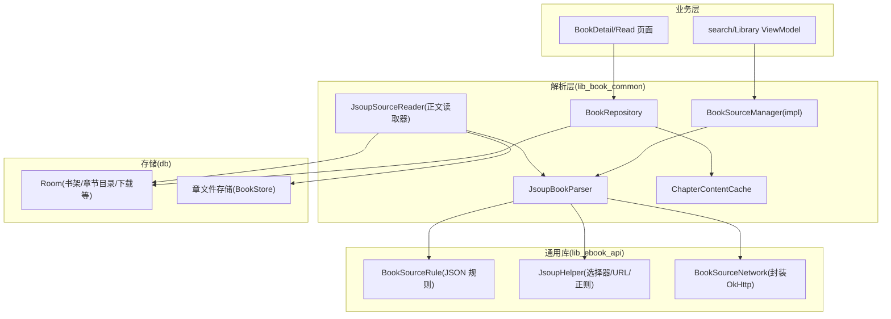
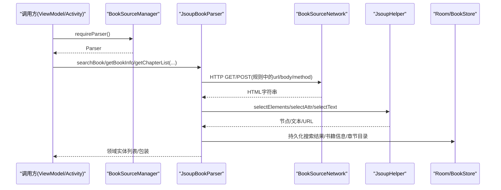
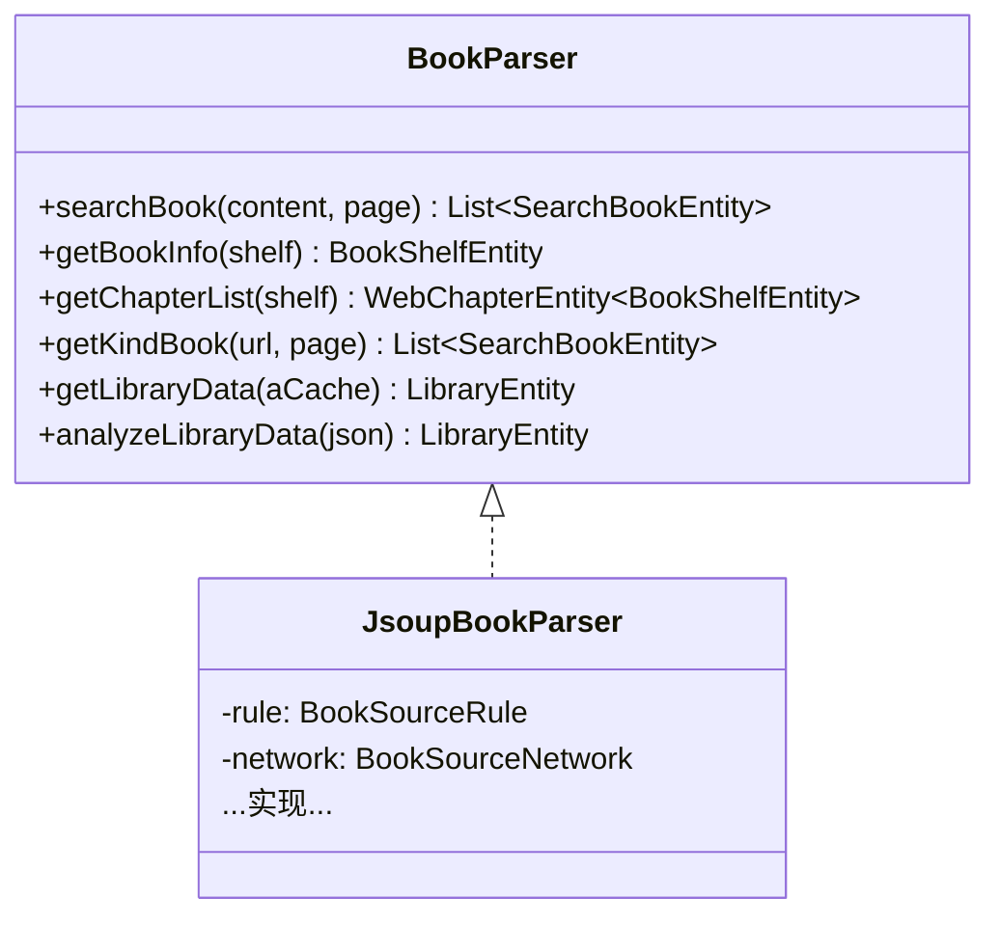
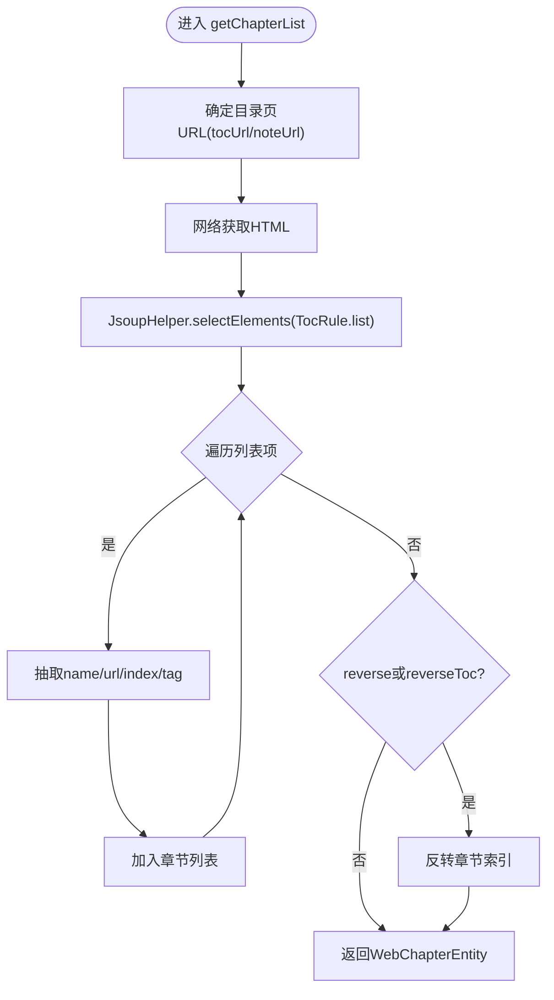
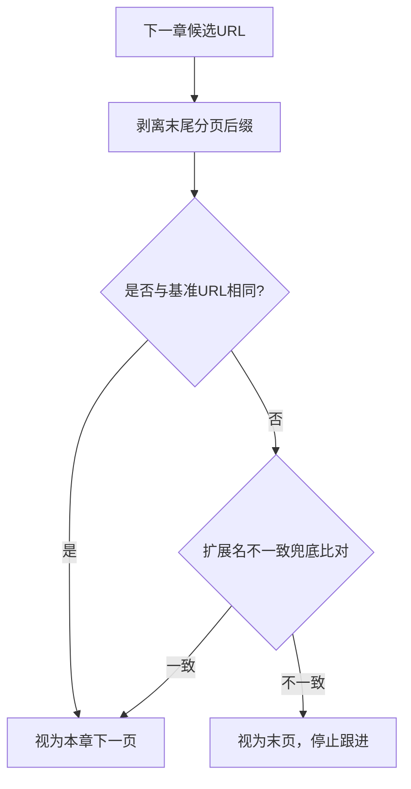
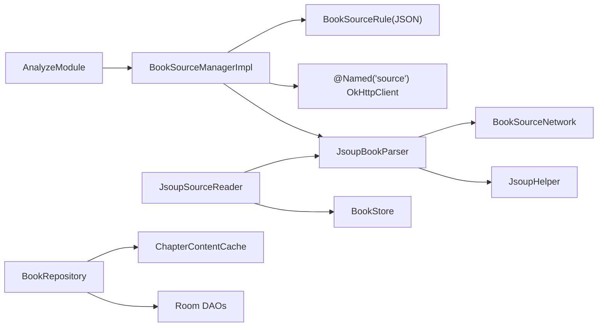

# 在线书源解析

<cite>
**本文引用的文件**
- [BookParser.kt](file://lib_book_common/src/main/java/com/ebook/common/analyze/source/BookParser.kt)
- [BookSourceManager.kt](file://lib_book_common/src/main/java/com/ebook/common/analyze/source/BookSourceManager.kt)
- [BookSourceManagerImpl.kt](file://lib_book_common/src/main/java/com/ebook/common/analyze/source/BookSourceManagerImpl.kt)
- [JsoupBookParser.kt](file://lib_book_common/src/main/java/com/ebook/common/analyze/source/JsoupBookParser.kt)
- [BookSourceRule.kt](file://lib_ebook_api/src/main/java/com/ebook/api/entity/BookSourceRule.kt)
- [JsoupHelper.kt](file://lib_ebook_api/src/main/java/com/ebook/api/utils/JsoupHelper.kt)
- [JsoupSourceReader.kt](file://lib_book_common/src/main/java/com/ebook/common/analyze/source/JsoupSourceReader.kt)
- [AnalyzeModule.kt](file://lib_book_common/src/main/java/com/ebook/common/di/AnalyzeModule.kt)
- [ChapterContentCache.kt](file://lib_book_common/src/main/java/com/ebook/common/store/ChapterContentCache.kt)
- [BookRepository.kt](file://lib_book_common/src/main/java/com/ebook/common/repository/BookRepository.kt)
- [ErrorAnalyzeContentManager.kt](file://lib_book_common/src/main/java/com/ebook/common/manager/ErrorAnalyzeContentManager.kt)
</cite>

## 目录
1. [引言](#引言)
2. [项目结构与定位](#项目结构与定位)
3. [核心组件总览](#核心组件总览)
4. [架构概览](#架构概览)
5. [关键组件详解](#关键组件详解)
6. [依赖与关系分析](#依赖与关系分析)
7. [性能与可靠性](#性能与可靠性)
8. [故障排查与健壮性](#故障排查与健壮性)
9. [新增书源接入指南与测试方法](#新增书源接入指南与测试方法)
10. [结论](#结论)

## 引言
本模块提供基于 JSON 规则驱动的网络书源解析能力：通过配置化的规则，动态从任意网站抓取书籍搜索、书籍详情、章节列表与正文内容，并将结果持久化或缓存于本地，供阅读与书城功能使用。本文聚焦 BookSourceManager 的调度机制、JsoupBookParser 的核心实现、接口抽象设计、章节匹配算法、URL 渲染分页策略、正则清洗、缓存与存储同步、网络请求的并发控制与异常降级等，给出清晰的架构图与数据流图，并附带新增书源的接入方法与测试要点。

## 项目结构与定位
在线书源解析位于 lib_book_common（共享库）和 lib_ebook_api（网络实体与工具）中，向上为业务模块（module_find、module_book）提供服务。

图表来源
- [AnalyzeModule.kt:11-18](file://lib_book_common/src/main/java/com/ebook/common/di/AnalyzeModule.kt#L11-L18)
- [BookSourceManagerImpl.kt:21-77](file://lib_book_common/src/main/java/com/ebook/common/analyze/source/BookSourceManagerImpl.kt#L21-L77)
- [JsoupBookParser.kt:29-35](file://lib_book_common/src/main/java/com/ebook/common/analyze/source/JsoupBookParser.kt#L29-L35)
- [JsoupSourceReader.kt:33-39](file://lib_book_common/src/main/java/com/ebook/common/analyze/source/JsoupSourceReader.kt#L33-L39)
- [BookRepository.kt:41-50](file://lib_book_common/src/main/java/com/ebook/common/repository/BookRepository.kt#L41-L50)

章节来源
- [AnalyzeModule.kt:11-18](file://lib_book_common/src/main/java/com/ebook/common/di/AnalyzeModule.kt#L11-L18)
- [BookSourceManagerImpl.kt:21-77](file://lib_book_common/src/main/java/com/ebook/common/analyze/source/BookSourceManagerImpl.kt#L21-L77)

## 核心组件总览
- BookParser：定义统一解析接口，屏蔽站点差异。
- BookSourceManager：管理规则加载、切换、导入导出，对外提供当前 Parser。
- BookSourceManagerImpl：初始化默认书源 JSON，保存当前书源，构造 JsoupBookParser。
- JsoupBookParser：基于 BookSourceRule + Jsoup 完成搜索、详情、目录、分类与主页数据解析；内部包含 ListPageUrl 与 ChapterPageMatcher 两类纯函数工具。
- BookSourceRule：JSON 序列化对象，描述站点 URL、编码、头信息、请求体以及各功能的选择器与替换规则。
- JsoupHelper：CSS 选择器文本/属性提取、URL 拼接、正则替换辅助。
- JsoupSourceReader：网络书的章节正文读取器，复用 JsoupBookParser 的分页判定逻辑与清洗规则，落盘到章文件并提供内存缓存命中路径。
- ChapterContentCache：按 contentRef 键维护少量近期正文章节，提升翻页读取性能。
- ErrorAnalyzeContentManager：异步记录解析失败的 URL 明细，限制文件大小并去重记录站点级别失败集合。

章节来源
- [BookParser.kt:9-20](file://lib_book_common/src/main/java/com/ebook/common/analyze/source/BookParser.kt#L9-L20)
- [BookSourceManager.kt:5-21](file://lib_book_common/src/main/java/com/ebook/common/analyze/source/BookSourceManager.kt#L5-L21)
- [BookSourceManagerImpl.kt:14-107](file://lib_book_common/src/main/java/com/ebook/common/analyze/source/BookSourceManagerImpl.kt#L14-L107)
- [BookSourceRule.kt:10-200+](file://lib_ebook_api/src/main/java/com/ebook/api/entity/BookSourceRule.kt#L10-L200)
- [JsoupHelper.kt:11-107](file://lib_ebook_api/src/main/java/com/ebook/api/utils/JsoupHelper.kt#L11-L107)
- [JsoupSourceReader.kt:23-177](file://lib_book_common/src/main/java/com/ebook/common/analyze/source/JsoupSourceReader.kt#L23-L177)
- [ChapterContentCache.kt:7-59](file://lib_book_common/src/main/java/com/ebook/common/store/ChapterContentCache.kt#L7-L59)
- [ErrorAnalyzeContentManager.kt:17-130](file://lib_book_common/src/main/java/com/ebook/common/manager/ErrorAnalyzeContentManager.kt#L17-L130)

## 架构概览
系统采用“规则驱动 + 适配器”模式：
- 解析入口统一由 BookParser 暴露，具体站点细节收敛在 JsoupBookParser 与 BookSourceRule。
- 书源由 BookSourceManager 集中管理与切换，业务侧无需感知多站点差异。
- 网络访问经由 OkHttp（带 @Named("source") 纯净客户端），避免 token 泄漏。
- 数据存储分两层：书籍元数据与章节目录走 Room；正文以“章文件 + 内存缓存”优先，减少重复 I/O。
- 分页与链接判定抽象为独立对象，利于单测与维护。

图表来源
- [BookSourceManagerImpl.kt:71-78](file://lib_book_common/src/main/java/com/ebook/common/analyze/source/BookSourceManagerImpl.kt#L71-L78)
- [JsoupBookParser.kt:38-74](file://lib_book_common/src/main/java/com/ebook/common/analyze/source/JsoupBookParser.kt#L38-L74)
- [JsoupHelper.kt:11-107](file://lib_ebook_api/src/main/java/com/ebook/api/utils/JsoupHelper.kt#L11-L107)

章节来源
- [BookSourceManagerImpl.kt:21-78](file://lib_book_common/src/main/java/com/ebook/common/analyze/source/BookSourceManagerImpl.kt#L21-L78)
- [JsoupBookParser.kt:38-74](file://lib_book_common/src/main/java/com/ebook/common/analyze/source/JsoupBookParser.kt#L38-L74)

## 关键组件详解

### BookParser 接口与适配模式
- 暴露统一能力：搜索、书籍详情、章节列表、分类发现、主页数据解析与反序列化。
- 所有解析均以 BookSourceRule 为唯一输入来源，保证多站点一致的扩展点。

图表来源
- [BookParser.kt:9-20](file://lib_book_common/src/main/java/com/ebook/common/analyze/source/BookParser.kt#L9-L20)
- [JsoupBookParser.kt:29-35](file://lib_book_common/src/main/java/com/ebook/common/analyze/source/JsoupBookParser.kt#L29-L35)

章节来源
- [BookParser.kt:9-20](file://lib_book_common/src/main/java/com/ebook/common/analyze/source/BookParser.kt#L9-L20)

### BookSourceManager 调度机制
- 启动时加载 assets 下的 default_sources.json，过滤已启用的书源。
- 通过 SharedPreferences 持久化当前书源的 url，便于应用重启后恢复。
- switchSource(rule) 将创建对应 JsoupBookParser（注入 rule 与 @Named("source") OkHttpClient）。
- import/export 提供 JSON 形态的规则迁移入口（面向未来多书源规划预留）。
- Hilt 在 AnalyzeModule 中绑定实现为单例。

章节来源
- [BookSourceManager.kt:5-21](file://lib_book_common/src/main/java/com/ebook/common/analyze/source/BookSourceManager.kt#L5-L21)
- [BookSourceManagerImpl.kt:14-107](file://lib_book_common/src/main/java/com/ebook/common/analyze/source/BookSourceManagerImpl.kt#L14-L107)
- [AnalyzeModule.kt:11-18](file://lib_book_common/src/main/java/com/ebook/common/di/AnalyzeModule.kt#L11-L18)

### JsoupBookParser 核心流程
- 搜索：对关键词进行字符集编码，渲染分页地址，发送请求后用 SearchRule 逐条抽取书名/作者/封面/详情页 URL 等。
- 详情：根据 BookInfoRule 抽取介绍、封面与目录地址（支持 tocUrl），必要时反转目录顺序。
- 目录：依据 TocRule 抽取章节项，填充内容引用、序号与备注信息；支持 reverseToc。
- 分类：按 FindRule 渲染分页 URL 并使用 SearchRule 复用结果解析。
- 主页数据：使用 ACache 做轻量缓存，提供 serialize/deserialize 序列化成 LibraryEntity。
- 统一分页渲染：ListPageUrl.build 处理 {{page}} 占位符及首页特殊裁剪，确保首屏可用。
- 统一同章分页判断：ChapterPageMatcher.isSameChapterPage 仅对候选链接剥离末尾数字后缀，防止串章。

图表来源
- [JsoupBookParser.kt:136-166](file://lib_book_common/src/main/java/com/ebook/common/analyze/source/JsoupBookParser.kt#L136-L166)
- [JsoupHelper.kt:48-107](file://lib_ebook_api/src/main/java/com/ebook/api/utils/JsoupHelper.kt#L48-L107)

章节来源
- [JsoupBookParser.kt:38-277](file://lib_book_common/src/main/java/com/ebook/common/analyze/source/JsoupBookParser.kt#L38-L277)
- [BookSourceRule.kt:64-174](file://lib_ebook_api/src/main/java/com/ebook/api/entity/BookSourceRule.kt#L64-L174)

### 章节列表的智能匹配算法与正则规则
- 列表分页渲染：ListPageUrl.actualPage/build 处理起始页、步长、查询参数名以及首页截断规则，兼容常见站点。
- 章节同页判断：ChapterPageMatcher 使用正则 [-_]\d+(\.[A-Za-z]+)?$ 去除候选链接末尾分页编号（含扩展名保留），再与“原始章节基准 URL”对比；额外兜底比较去掉扩展名的形式，以适应入口与分页扩展名不一致的场景。
- 取舍原则：宁漏页不串章；对于“第 1 页也有后缀”的特殊形态暂不做推断（需后续多书源规则声明分页模板）。

图表来源
- [JsoupBookParser.kt:331-374](file://lib_book_common/src/main/java/com/ebook/common/analyze/source/JsoupBookParser.kt#L331-L374)
- [JsoupBookParser.kt:286-323](file://lib_book_common/src/main/java/com/ebook/common/analyze/source/JsoupBookParser.kt#L286-L323)

章节来源
- [JsoupBookParser.kt:286-374](file://lib_book_common/src/main/java/com/ebook/common/analyze/source/JsoupBookParser.kt#L286-L374)

### 链接提取与容错机制
- URL 拼装：JsoupHelper.parseUrl 统一处理相对路径转绝对路径、域名构建、端口携带。
- 选择器容错：selectText/selectAttr/selectElements 在空规则/选择器无效/节点缺失时返回安全值（空字符串/空列表），降低崩溃风险。
- 正文清理：ReplaceRule 链式应用正则替换，非法正则会被跳过，保障清洗流程可继续。

章节来源
- [JsoupHelper.kt:11-107](file://lib_ebook_api/src/main/java/com/ebook/api/utils/JsoupHelper.kt#L11-L107)

### 缓存策略与本地存储
- 主页数据缓存：LibrayEntity 先查 ACache，未命中则通过网络与规则解析后再写入，提高首次加载效率。
- 正文缓存：ChapterContentCache 以 contentRef 为键维护容量 3 的 LRU 缓存，读写互斥且只缓存非 null 内容。
- 正文落盘：JsoupSourceReader 按章节维度写入章文件，并在写入前校验是否为空，避免“空章假缓存”。
- 失效策略：提供 invalidateBook(bookId) 按 bookId 片段清理相关缓存；换字体会影响排版但不影响正文缓存。

章节来源
- [JsoupBookParser.kt:196-276](file://lib_book_common/src/main/java/com/ebook/common/analyze/source/JsoupBookParser.kt#L196-L276)
- [ChapterContentCache.kt:7-59](file://lib_book_common/src/main/java/com/ebook/common/store/ChapterContentCache.kt#L7-L59)
- [JsoupSourceReader.kt:92-177](file://lib_book_common/src/main/java/com/ebook/common/analyze/source/JsoupSourceReader.kt#L92-L177)

### 网络请求的可靠性
- 纯净客户端：书源请求使用 @Named("source") 的 OkHttpClient，避免泄露认证 token。
- 超时与重试：由底层网络层决定；上层通过 catch 捕获异常并记录失败（ErrorAnalyzeContentManager）。
- 失败降級：解析异常时返回空集合或最小可用结构，保证界面不因单站点异常而崩溃。
- 错误落盘：ErrorAnalyzeContentManager.writeNewErrorUrl 串行写文件，记录明细与去重的站点级失败集，按体积上限轮转，避免无限增长。

章节来源
- [BookSourceManagerImpl.kt:21-24](file://lib_book_common/src/main/java/com/ebook/common/analyze/source/BookSourceManagerImpl.kt#L21-L24)
- [JsoupBookParser.kt:66-69](file://lib_book_common/src/main/java/com/ebook/common/analyze/source/JsoupBookParser.kt#L66-L69)
- [ErrorAnalyzeContentManager.kt:17-130](file://lib_book_common/src/main/java/com/ebook/common/manager/ErrorAnalyzeContentManager.kt#L17-L130)

## 依赖与关系分析
- DI 装配：AnalyzeModule 将 BookSourceManagerImpl 绑定为单例对外暴露。
- 耦合关系：
  - BookSourceManager 依赖 OkHttp(@Named("source")) 与 Context，持有 BookSourceRule 列表。
  - JsoupBookParser 依赖 BookSourceRule 与 BookSourceNetwork（内部封装 OkHttp），并通过 JsoupHelper 做 DOM 操作。
  - JsoupSourceReader 与 BookStore/BookSourceManager 协作，复用 JsoupBookParser 的分页判定能力，专注“读正文”。
  - ChapterContentCache 与 BookRepository 协同：前者负责小内存热点，后者协调 DAO/File 与事件通知。
- 外部依赖：OkHttp 5.x、Jsoup、Room、Hilt、Kotlinx 序列化。

图表来源
- [AnalyzeModule.kt:11-18](file://lib_book_common/src/main/java/com/ebook/common/di/AnalyzeModule.kt#L11-L18)
- [BookSourceManagerImpl.kt:21-35](file://lib_book_common/src/main/java/com/ebook/common/analyze/source/BookSourceManagerImpl.kt#L21-L35)
- [JsoupBookParser.kt:29-35](file://lib_book_common/src/main/java/com/ebook/common/analyze/source/JsoupBookParser.kt#L29-L35)
- [JsoupSourceReader.kt:33-39](file://lib_book_common/src/main/java/com/ebook/common/analyze/source/JsoupSourceReader.kt#L33-L39)
- [BookRepository.kt:41-50](file://lib_book_common/src/main/java/com/ebook/common/repository/BookRepository.kt#L41-L50)

章节来源
- [AnalyzeModule.kt:11-18](file://lib_book_common/src/main/java/com/ebook/common/di/AnalyzeModule.kt#L11-L18)
- [BookSourceManagerImpl.kt:21-35](file://lib_book_common/src/main/java/com/ebook/common/analyze/source/BookSourceManagerImpl.kt#L21-L35)
- [JsoupBookParser.kt:29-35](file://lib_book_common/src/main/java/com/ebook/common/analyze/source/JsoupBookParser.kt#L29-L35)
- [JsoupSourceReader.kt:33-39](file://lib_book_common/src/main/java/com/ebook/common/analyze/source/JsoupSourceReader.kt#L33-L39)
- [BookRepository.kt:41-50](file://lib_book_common/src/main/java/com/ebook/common/repository/BookRepository.kt#L41-L50)

## 性能与可靠性
- 计算复杂度
  - 列表解析时间主要受 HTML 体量与选择器数量影响；单次解析 O(N) 遍历结果项。
  - 正文章节分页判断为常量时间（固定两次正则操作与一次比较）。
- 缓存命中率
  - 正文缓存容量为 3，适合“前后翻”场景；可通过合理页面预加载提升命中率。
- 并发与线程
  - 解析均在 IO 调度器执行；错误记录通过协程与 Mutex 串行写入，避免竞态。
- 稳定性
  - 空选择器、非法正则、HTTP 异常均有捕获与降级；错误 URL 异步持久化便于事后排障。
- 资源占用
  - 错误日志文件具备体积上限轮转，避免占满存储。

## 故障排查与健壮性
常见问题与定位思路
- 搜索结果全为空
  - 检查 searchUrl/searchBody 中 keyword/page 占位替换是否正确；确认 PageRule.start/step 设置是否符合站点；查看 ListPageUrl 渲染结果是否满足“首页不带 /{{page}}”的要求。
- 目录为空或顺序颠倒
  - 核对 TocRule.list/name/url 是否正确；如需要反转，设置 reverse 或 BookInfoRule.reverseToc。
- 正文无法翻页
  - 确认 ContentRule.nextPage 选择器能抓到底下页链接；检查下一链接经 IsSameChapterPage 判定是否会误判；查看 MAX_CONTENT_PAGES 上限是否过低。
- 反复抓取同一章节导致慢
  - 若 chapterBaseUrl 未加后缀但下一链接也带后缀，ChapterPageMatcher 会正常剥离对比；如站点第 1 页本身就带后缀需后续通过规则显式分页模板解决。
- 大量解析失败
  - 检查 ErrorAnalyzeContentUrls.txt/ErrorAnalyzeUrlsDetail.txt 失败站点与明细，对照规则选择器是否随站点改版失效。

章节来源
- [JsoupBookParser.kt:38-277](file://lib_book_common/src/main/java/com/ebook/common/analyze/source/JsoupBookParser.kt#L38-L277)
- [JsoupSourceReader.kt:92-177](file://lib_book_common/src/main/java/com/ebook/common/analyze/source/JsoupSourceReader.kt#L92-L177)
- [ErrorAnalyzeContentManager.kt:17-130](file://lib_book_common/src/main/java/com/ebook/common/manager/ErrorAnalyzeContentManager.kt#L17-L130)

## 新增书源接入指南与测试方法
接入步骤
- 准备 JSON 规则
  - 在 BookSourceRule 中添加 name/url/method/body/charset/headers 基本信息。
  - 填写搜索规则（searchUrl/searchMethod/searchBody/searchPage/ruleSearch）；注意 {{keyword}}/{{page}} 占位符，模板以 /{{page}} 结尾时首页会自动裁掉该段。
  - 补充书籍详情规则（ruleBookInfo：name/author/coverUrl/intro/tocUrl/authorPrefix/introPrefix/reverseToc）。
  - 补充目录规则（ruleToc：list/name/url/pageUrl/nextPage/reverse）。
  - 可选：正文规则（ruleContent：content/nextPage/replaceRules/image）以支持正文抓取；如发现页（ruleFind）则配置 url/kinds/ruleSearch。
- 集成默认规则
  - 将新规则合并至默认 assets/default_sources.json，或在运行期通过 BookSourceManager.importFromJson 动态导入并 switchSource/saveCurrentSource 持久化。
- 验证流程
  - 搜索页：传入 keyword，检查 searchUrl 渲染后的真实 URL、方法、表单体；确认解析到的结果包含书名/作者/详情页链接。
  - 详情页：获取 noteUrl 对应的详情 HTML，确认能抽取简介与目录入口。
  - 目录页：确认 list 选择器正确，能列出章节并生成正确的 contentRef；如需反转请启用 reverse。
  - 正文页：按 ruleContent.content 抽取段落，验证 nextPage 是否能跟随到下一页；关注 ChapterPageMatcher 对分页链接的判断是否符合预期。
- 单元测试
  - 覆盖 ListPageUrl.build/actualPage 的各种模板形态（路径段分页 vs 查询参数分页、起始页与步长）。
  - 覆盖 ChapterPageMatcher.isSameChapterPage 的各类边界形态（无后缀、有后缀、扩展名不一致、章节号在连字符后）。
  - 对 JsoupHelper 的选择器/URL/替换正则分别构造异常与边界用例，验证容错。
- 端到端测试
  - 组合完整链路：搜索 → 打开详情 → 拉取目录 → 阅读第一章与下一页，检查缓存命中与落盘正确性；观察 ErrorAnalyze 文件中是否产生新的失败记录。

章节来源
- [BookSourceRule.kt:10-200+](file://lib_ebook_api/src/main/java/com/ebook/api/entity/BookSourceRule.kt#L10-L200)
- [BookSourceManagerImpl.kt:55-107](file://lib_book_common/src/main/java/com/ebook/common/analyze/source/BookSourceManagerImpl.kt#L55-L107)
- [JsoupBookParser.kt:286-374](file://lib_book_common/src/main/java/com/ebook/common/analyze/source/JsoupBookParser.kt#L286-L374)
- [JsoupHelper.kt:11-107](file://lib_ebook_api/src/main/java/com/ebook/api/utils/JsoupHelper.kt#L11-L107)

## 结论
本方案以 BookSourceRule 为核心配置文件，通过 BookSourceManager 统一管理，JsoupBookParser 作为解析中枢，配合 JsoupHelper 的强大选择器能力与稳健的正则清洗，形成了高可扩展、易维护的多站点解析体系。在分页与链接处理上，ListPageUrl 与 ChapterPageMatcher 用极简规则稳定处理了常见的 URL 形态，既提高了健壮性又避免了串章风险。结合 ACache/ChapterContentCache/章文件的缓存层次，有效降低了网络与 IO 压力。错误诊断方面，ErrorAnalyzeContentManager 提供了低侵入、去重且受限增长的失败记录机制，有助于快速定位规则失配问题。新增书源只需更新 JSON 即可上线，极大降低适配成本。