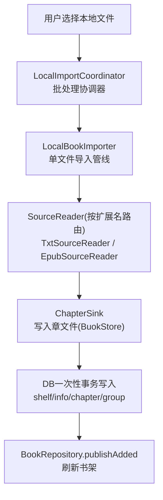
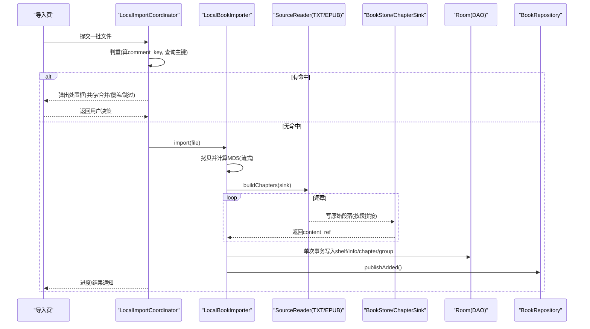
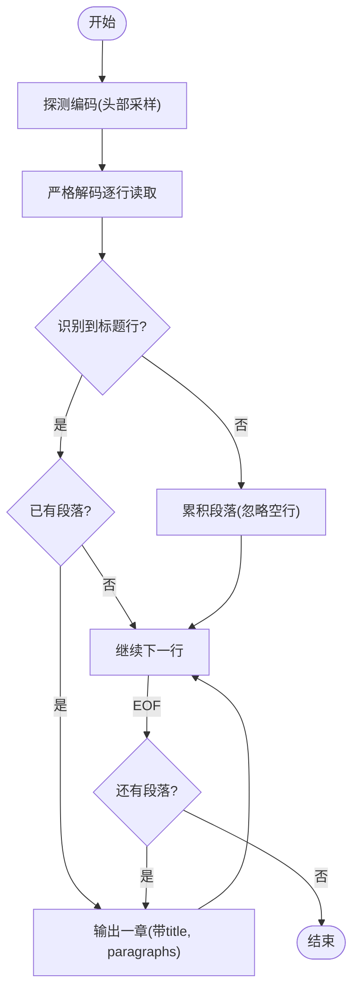
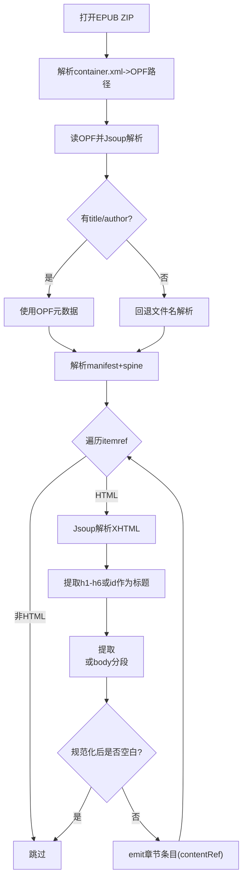
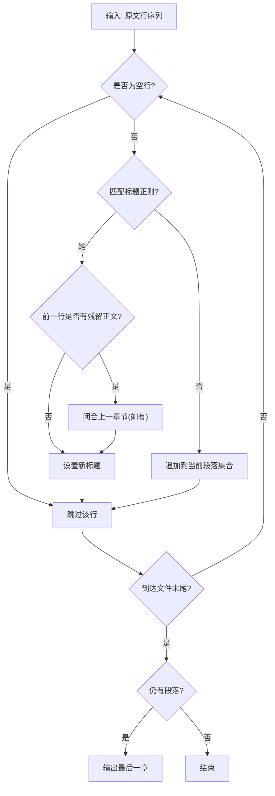
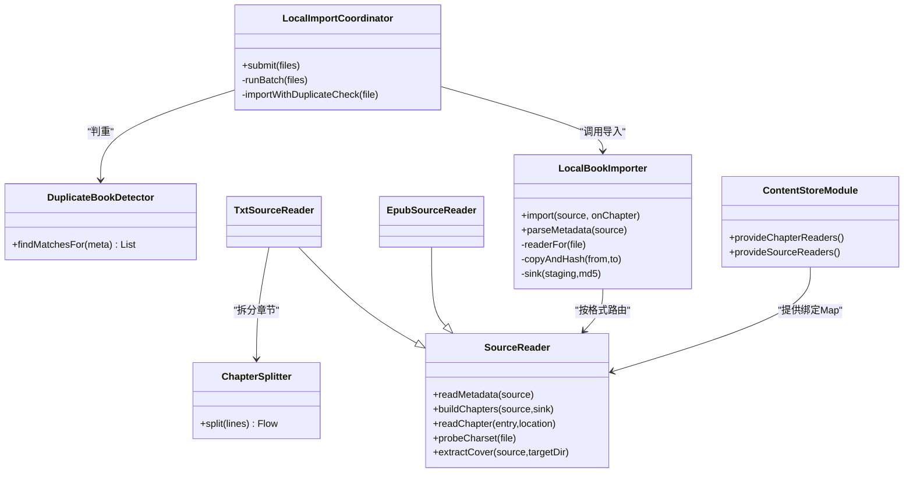

# 本地书籍导入

<cite>
**本文引用的文件**
- [TxtSourceReader.kt](file://lib_book_common/src/main/java/com/ebook/common/analyze/local/TxtSourceReader.kt)
- [EpubSourceReader.kt](file://lib_book_common/src/main/java/com/ebook/common/analyze/local/EpubSourceReader.kt)
- [ChapterSplitter.kt](file://lib_book_common/src/main/java/com/ebook/common/analyze/local/ChapterSplitter.kt)
- [Contracts.kt](file://lib_book_common/src/main/java/com/ebook/common/analyze/local/Contracts.kt)
- [LocalBookImporter.kt](file://lib_book_common/src/main/java/com/ebook/common/importer/LocalBookImporter.kt)
- [LocalImportCoordinator.kt](file://lib_book_common/src/main/java/com/ebook/common/importer/LocalImportCoordinator.kt)
- [ContentStoreModule.kt](file://lib_book_common/src/main/java/com/ebook/common/di/ContentStoreModule.kt)
- [DuplicateBookDetector.kt](file://lib_book_common/src/main/java/com/ebook/common/domain/DuplicateBookDetector.kt)
- [FileNameMetadata.kt](file://lib_book_common/src/main/java/com/ebook/common/domain/FileNameMetadata.kt)
- [ParsedBookMeta.kt](file://lib_book_common/src/main/java/com/ebook/common/domain/ParsedBookMeta.kt)
- [ChapterReader.kt](file://lib_book_common/src/main/java/com/ebook/common/analyze/local/ChapterReader.kt)
- [2026-09-04-local-book-import-design.md](file://docs/superpowers/specs/2026-09-04-local-book-import-design.md)
</cite>

## 目录
1. [引言](#引言)
2. [项目结构](#项目结构)
3. [核心组件](#核心组件)
4. [架构总览](#架构总览)
5. [详细组件分析](#详细组件分析)
6. [依赖关系分析](#依赖关系分析)
7. [性能与内存管理](#性能与内存管理)
8. [错误处理与异常恢复](#错误处理与异常恢复)
9. [使用示例与配置](#使用示例与配置)
10. [结论](#结论)

## 引言
本文件围绕“本地书籍导入”功能进行系统化说明，聚焦 TXT 与 EPUB 两大格式的解析实现。文档涵盖文件格式识别、内容提取、封面图片处理、章节识别与分割算法、元数据标准化、大文件流式读取、内存管理与多线程并发、错误处理与异常恢复策略、性能优化技巧，以及端到端的使用示例与配置要点。目标是在不深入代码细节的前提下，让读者理解从“选择一个本地书文件”到“成功入库并阅读”的完整流程与关键技术点。

## 项目结构
本地书籍导入相关能力集中在 lib_book_common 模块：
- analyze.local：本地格式的来源抽象与解析器（TXT/EPUB），章节切分器与基础契约
- importer：本地书导入流水线与批量协调器
- domain：与作品身份、元数据相关的领域模型
- di：注入装配，提供 BookStore、ChapterSplitter、缓存以及 Reader 路由映射

图表来源
- [LocalImportCoordinator.kt](file://lib_book_common/src/main/java/com/ebook/common/importer/LocalImportCoordinator.kt)
- [LocalBookImporter.kt](file://lib_book_common/src/main/java/com/ebook/common/importer/LocalBookImporter.kt)
- [ContentStoreModule.kt](file://lib_book_common/src/main/java/com/ebook/common/di/ContentStoreModule.kt)

部分来源
- [2026-09-04-local-book-import-design.md](file://docs/superpowers/specs/2026-09-04-local-book-import-design.md)
- [LocalImportCoordinator.kt](file://lib_book_common/src/main/java/com/ebook/common/importer/LocalImportCoordinator.kt)
- [LocalBookImporter.kt](file://lib_book_common/src/main/java/com/ebook/common/importer/LocalBookImporter.kt)

## 核心组件
- SourceReader/ChapterReader 契约：定义“读元数据、建目录、读单章正文”的统一入口；仅导入链路需要 SourceReader，读取阶段则通过 ChapterReader 统一路由本地与网络源。
- TxtSourceReader：纯文本解析。以严格编码解码后逐行交给切分器，写出“原文切片”，读取时再规范化展示。
- EpubSourceReader：ZIP 容器解析，基于 OPF/Spine/XHTML 提取章节与标题；支持 EPUB3/EPUB2 两种封面声明。
- ChapterSplitter：默认正则匹配“第…章…”识别章节；无标题书回退至首行作为章名；输出是“切分后、清洗前”的段落序列。
- ParsedBookMeta/FileNameMetadata：用于导入前的轻量元数据提取与作品身份计算（书名+作者）。
- DuplicateBookDetector：导入时点对 comment_key 查重，给出共存/合并/覆盖/跳过处置。
- ContentStoreModule：将 SourceReader/ChapterReader 按格式路由装配到 Hilt，并提供 BookStore、缓存、临时目录等基础能力。

部分来源
- [Contracts.kt](file://lib_book_common/src/main/java/com/ebook/common/analyze/local/Contracts.kt)
- [TxtSourceReader.kt](file://lib_book_common/src/main/java/com/ebook/common/analyze/local/TxtSourceReader.kt)
- [EpubSourceReader.kt](file://lib_book_common/src/main/java/com/ebook/common/analyze/local/EpubSourceReader.kt)
- [ChapterSplitter.kt](file://lib_book_common/src/main/java/com/ebook/common/analyze/local/ChapterSplitter.kt)
- [ParsedBookMeta.kt](file://lib_book_common/src/main/java/com/ebook/common/domain/ParsedBookMeta.kt)
- [FileNameMetadata.kt](file://lib_book_common/src/main/java/com/ebook/common/domain/FileNameMetadata.kt)
- [DuplicateBookDetector.kt](file://lib_book_common/src/main/java/com/ebook/common/domain/DuplicateBookDetector.kt)
- [ContentStoreModule.kt](file://lib_book_common/src/main/java/com/ebook/common/di/ContentStoreModule.kt)

## 架构总览
导入路径的关键决策点：
- 一次拷贝即计算 MD5，零冗余全文件扫描
- 后台协程异步推进章节切分与落盘，UI 实时显示“解析中”与进度
- DB 写入一次事务完成；失败时回滚删除已写章文件
- 重复检测在导入时点集中处理，避免事后脏状态

图表来源
- [LocalImportCoordinator.kt](file://lib_book_common/src/main/java/com/ebook/common/importer/LocalImportCoordinator.kt)
- [LocalBookImporter.kt](file://lib_book_common/src/main/java/com/ebook/common/importer/LocalBookImporter.kt)

部分来源
- [LocalImportCoordinator.kt](file://lib_book_common/src/main/java/com/ebook/common/importer/LocalImportCoordinator.kt)
- [LocalBookImporter.kt](file://lib_book_common/src/main/java/com/ebook/common/importer/LocalBookImporter.kt)

## 详细组件分析

### TxtSourceReader 工作原理
- 文件格式识别：通过导入器根据文件扩展名选择 reader，TXT 对应 BookFormat.TXT
- 编码探测与严格解码：使用严格读取器按探测出的字符集逐行读取；不可映射字节将导致失败，避免静默损毁
- 章节识别与分割：逐行输入给 ChapterSplitter，利用“第…章…”正则识别标题，无标题时以首行作为章节名
- 内容落盘：每章由 ChapterSink.write 把段落序列用换行符连接后持久化，同时生成 content_ref 存入索引
- 单章读取：readChapter 通过存储层按 location + index 获取段落列表，返回展示文本（渲染层补缩进）
- 封面：TXT 不支持内嵌封面，extractCover 为空操作
- 元数据：只能来自文件名解析（Title 与 Author），无法识别作者时返回 null，由显示层填充占位词且不参与评论键

图表来源
- [TxtSourceReader.kt](file://lib_book_common/src/main/java/com/ebook/common/analyze/local/TxtSourceReader.kt)
- [ChapterSplitter.kt](file://lib_book_common/src/main/java/com/ebook/common/analyze/local/ChapterSplitter.kt)
- [Contracts.kt](file://lib_book_common/src/main/java/com/ebook/common/analyze/local/Contracts.kt)

部分来源
- [TxtSourceReader.kt](file://lib_book_common/src/main/java/com/ebook/common/analyze/local/TxtSourceReader.kt)
- [ChapterSplitter.kt](file://lib_book_common/src/main/java/com/ebook/common/analyze/local/ChapterSplitter.kt)
- [Contracts.kt](file://lib_book_common/src/main/java/com/ebook/common/analyze/local/Contracts.kt)

### EpubSourceReader 工作原理
- 容器解析：打开 ZIP，定位 META-INF/container.xml 获取 OPF 路径
- 元数据提取：解析 OPF metadata 获取书名与作者；若缺失则回落文件名解析（同 TXT 规则）
- 目录顺序：按 spine 线性遍历 itemref，过滤非 HTML 类型条目
- 正文提取：每个 XHTML 经 Jsoup 解析，优先取 h1-h6 中的首个非空文本作为章节标题；若无 p 标签则以 body 的 wholeText 按换行分段
- 过滤空白章节：仅当规范化后有可见内容才产出该章
- 封面处理：优先 EPUB3 的 properties="cover-image"，其次 EPUB2 meta[name=cover]；按资源扩展名写入暂存目录封面文件
- 单章读取：与 TXT 相同，通过存储层按 location + index 读取段落

图表来源
- [EpubSourceReader.kt](file://lib_book_common/src/main/java/com/ebook/common/analyze/local/EpubSourceReader.kt)
- [Contracts.kt](file://lib_book_common/src/main/java/com/ebook/common/analyze/local/Contracts.kt)

部分来源
- [EpubSourceReader.kt](file://lib_book_common/src/main/java/com/ebook/common/analyze/local/EpubSourceReader.kt)
- [Contracts.kt](file://lib_book_common/src/main/java/com/ebook/common/analyze/local/Contracts.kt)

### 章节识别与分割算法（ChapterSplitter）
- 默认规则：正则“第.{1,7}章.*”匹配章节标记行，支持数字序号（如“第12章”）
- 标题归一化：对标题行做清洗（去缩进、折叠空白、去除尾白），作为 chapter_list.dur_chapter_name
- 正文保留原文：段落保持“切分后、清洗前”的形态，保证规范规则变更无需重新导入
- 无标题回退：整书未匹配到标题标记时，以第一段为标题、剩余为正文
- 空章过滤：只有标题但无正文的行不产出章节、不占用索引
- 可取消：流式推进，确保后台协程可被取消

图表来源
- [ChapterSplitter.kt](file://lib_book_common/src/main/java/com/ebook/common/analyze/local/ChapterSplitter.kt)

部分来源
- [ChapterSplitter.kt](file://lib_book_common/src/main/java/com/ebook/common/analyze/local/ChapterSplitter.kt)

### 元数据与作品标识（ParsedBookMeta/FileNameMetadata）
- ParsedBookMeta：包含 title 与 author，用作 compute(comment_key) 的两个输入
- FileNameMetadata：从文件名推断标题与作者，优先级规则如下（命中即止）：
  - “《书名》…作者：作者名”
  - “书名 作者：作者名”
  - “书名 by 作者名”
  - “《书名》”
- 尾部噪音清理：剥离括号/方括号等版本信息片段；截取过长书名上限
- 无法识别作者时返回 null，显示层填充“侠名”且不参与评论键计算

部分来源
- [ParsedBookMeta.kt](file://lib_book_common/src/main/java/com/ebook/common/domain/ParsedBookMeta.kt)
- [FileNameMetadata.kt](file://lib_book_common/src/main/java/com/ebook/common/domain/FileNameMetadata.kt)

### 接口与路由（SourceReader/ChapterReader/契约）
- SourceReader：负责 readMetadata/buildChapters/readChapter/probeCharset/extractCover，仅用于导入链路
- ChapterReader：负责 readChapter，统一本地与网络来源的正文读取接口
- Contracts 中定义的核心数据结构：
  - BookLocation：{bookId, format}，本地书 bookId 等于 note_url（内容 md5）
  - BookSourceFile：源文件与已探测编码
  - ChapterEntry：章节索引行 {index, title, contentRef}
  - ChapterContent：标题与段落列表，以及 displayText 派生

部分来源
- [ChapterReader.kt](file://lib_book_common/src/main/java/com/ebook/common/analyze/local/ChapterReader.kt)
- [Contracts.kt](file://lib_book_common/src/main/java/com/ebook/common/analyze/local/Contracts.kt)
- [ContentStoreModule.kt](file://lib_book_common/src/main/java/com/ebook/common/di/ContentStoreModule.kt)

## 依赖关系分析

图表来源
- [LocalImportCoordinator.kt](file://lib_book_common/src/main/java/com/ebook/common/importer/LocalImportCoordinator.kt)
- [LocalBookImporter.kt](file://lib_book_common/src/main/java/com/ebook/common/importer/LocalBookImporter.kt)
- [ContentStoreModule.kt](file://lib_book_common/src/main/java/com/ebook/common/di/ContentStoreModule.kt)
- [DuplicateBookDetector.kt](file://lib_book_common/src/main/java/com/ebook/common/domain/DuplicateBookDetector.kt)

部分来源
- [LocalImportCoordinator.kt](file://lib_book_common/src/main/java/com/ebook/common/importer/LocalImportCoordinator.kt)
- [LocalBookImporter.kt](file://lib_book_common/src/main/java/com/ebook/common/importer/LocalBookImporter.kt)
- [ContentStoreModule.kt](file://lib_book_common/src/main/java/com/ebook/common/di/ContentStoreModule.kt)
- [DuplicateBookDetector.kt](file://lib_book_common/src/main/java/com/ebook/common/domain/DuplicateBookDetector.kt)

## 性能与内存管理
- 流式读取与冷流推进
  - SourceReader.buildChapters 返回 Flow，仅在收集时推进切分与写入；配合 ensureActive 支持取消，避免长任务阻塞
  - TXT 严格解码逐行消费，不加载全文入内存
- 零冗余 IO
  - 源文件只完整读一遍：在复制同时计算 MD5；旧方案会多次全文件读取（编码探测、切章等），现通过拷贝期统一完成
- 一次性事务
  - 导入收尾处一次性批量插入书架、信息、章节索引、作品群组，避免数千次小事务导致的严重延迟
- 并行与并发控制
  - 批处理在同一作用域串行推进单个文件，防止多批并发带来的书架竞态；内部无显式多线程并行，主要优势来自协程流与后台调度
- 缓存建议
  - 规范层面要求在“SourceReader 之上增加章节内容内存缓存（按 content_ref 为键，容量极小，当前章+前后各一章）”，以减少翻页时的文件打开/解码/规范化开销；详见规范设计文

部分来源
- [2026-09-04-local-book-import-design.md](file://docs/superpowers/specs/2026-09-04-local-book-import-design.md)
- [LocalBookImporter.kt](file://lib_book_common/src/main/java/com/ebook/common/importer/LocalBookImporter.kt)

## 错误处理与异常恢复
- 严格解码失败
  - 文本不可映射时直接判定导入失败，拒绝静默替换（避免隐蔽乱码）
- 无法切分章节
  - 如果没有任何章节被切出，抛异常并在 try/catch 中撤销暂存目录
- DB 写入失败
  - 一旦 DAO 层抛错，会删除已写入的章文件，保证磁盘不留孤立目录
- 重复检测与处置
  - 导入前算 comment_key 并与书架主键比对；命中弹框让用户选择“继续添加/智能合并/覆盖/跳过”
  - 合并/覆盖语义：先导入新条目，再处置旧条目，避免“旧删了、新没进来”的两头空
- 资源清理
  - ZipFile/流均在 finally 中关闭；临时目录在 finally 中删除；失败时尽可能回滚

部分来源
- [LocalBookImporter.kt](file://lib_book_common/src/main/java/com/ebook/common/importer/LocalBookImporter.kt)
- [EpubSourceReader.kt](file://lib_book_common/src/main/java/com/ebook/common/analyze/local/EpubSourceReader.kt)
- [DuplicateBookDetector.kt](file://lib_book_common/src/main/java/com/ebook/common/domain/DuplicateBookDetector.kt)

## 使用示例与配置
- 基本流程
  - 从系统文件管理器或通过应用“选择文件”界面选取 TXT/EPUB 文件
  - 点击“加入书架”，进入批导入流程；后台会显示“解析中”，并逐步更新进度
  - 重复命中时弹框选择处理方式；完成后刷新书架，书籍出现在书架列表
- 关键参数/配置
  - 章节标题规则：通过 ChapterSplitter 的 titleRule 定制（默认“第…章…”）
  - 字符编码：TXT 自动探测并固化，后续不再重复探测
  - 封面提取：EPUB 自动识别 cover-image 或 meta cover；TXT 无封面
  - 存储位置：books/<content-md5>/c00001.txt；目录名为内容 md5（note_url）
  - 读取路径：统一通过 BookStore 提供的 content_ref，不感知底层 File/Uri
- 运行环境与依赖
  - Hilt 注入 SourceReader Map 与 BookStore；新增格式仅需扩展 BookFormat 与注册 reader
  - Room 写入走一次性事务；数据库迁移由上层控制（不在本模块处理）

部分来源
- [ContentStoreModule.kt](file://lib_book_common/src/main/java/com/ebook/common/di/ContentStoreModule.kt)
- [Contracts.kt](file://lib_book_common/src/main/java/com/ebook/common/analyze/local/Contracts.kt)
- [TxtSourceReader.kt](file://lib_book_common/src/main/java/com/ebook/common/analyze/local/TxtSourceReader.kt)
- [EpubSourceReader.kt](file://lib_book_common/src/main/java/com/ebook/common/analyze/local/EpubSourceReader.kt)

## 结论
本地书籍导入以“一次拷贝即哈希、流式切分落盘、单事务批量落库”为核心，显著提升了大文件处理的性能与稳定性；TXT 与 EPUB 通过统一的 SourceReader/ChapterReader 解耦格式差异，章节分割与规范清洗职责清晰分离，保证了规则的可维护性与数据无损性；导入时点的重复检测与处置流程简化了体验并确保一致性。整体架构可扩展性强，便于后续接入更多格式与更丰富的阅读能力。