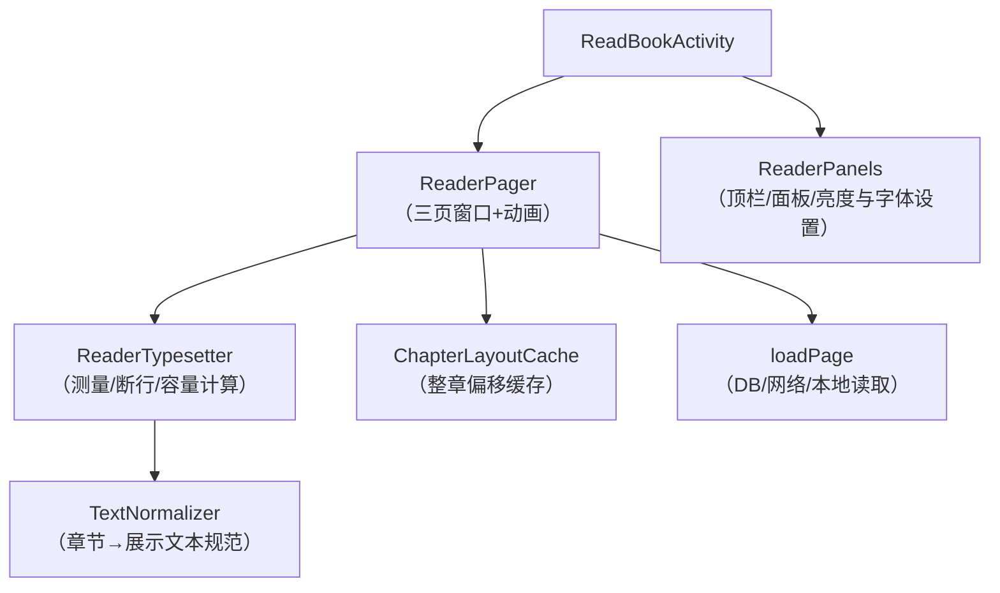
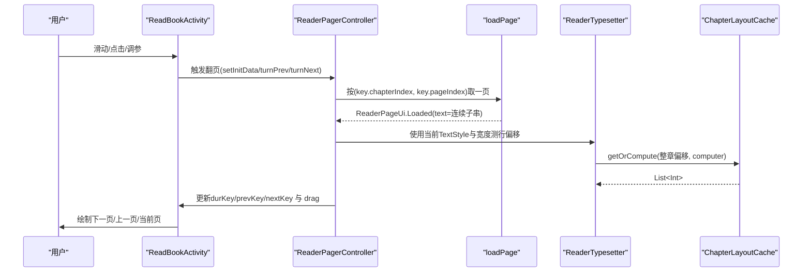
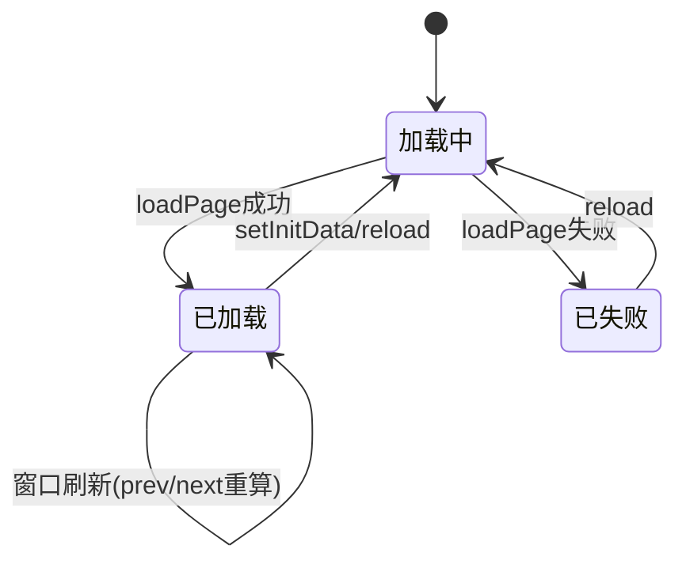
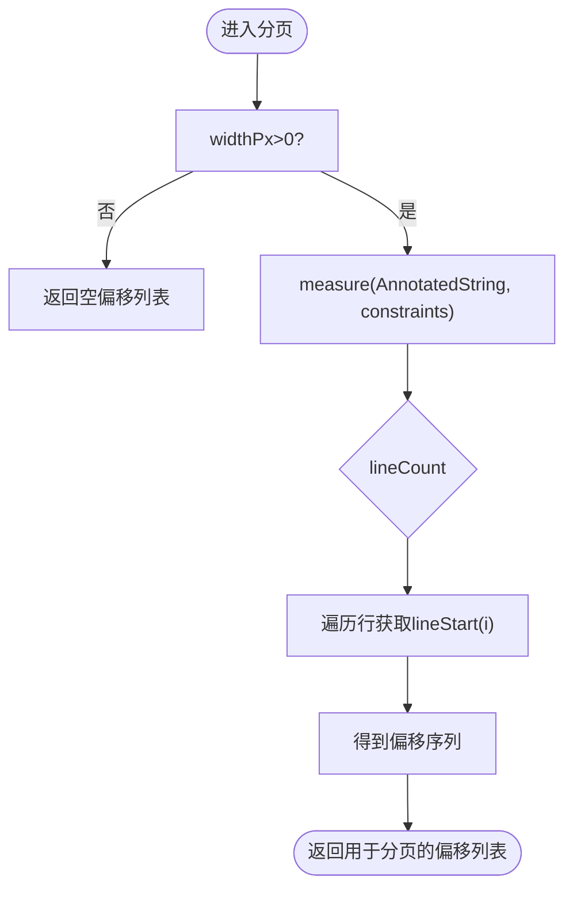
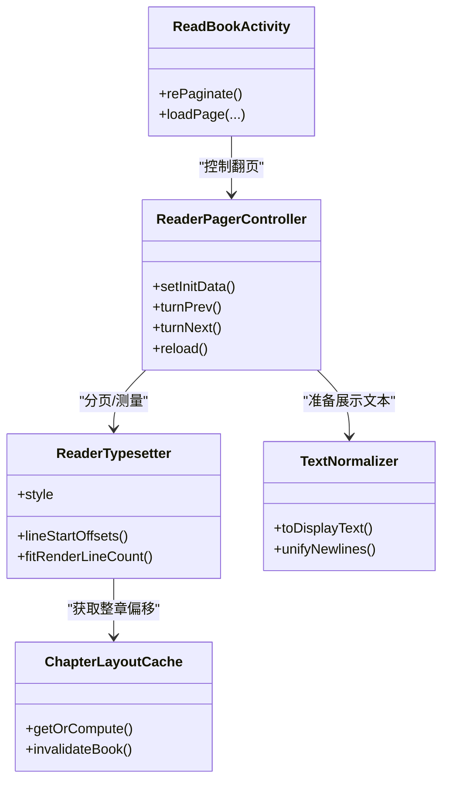
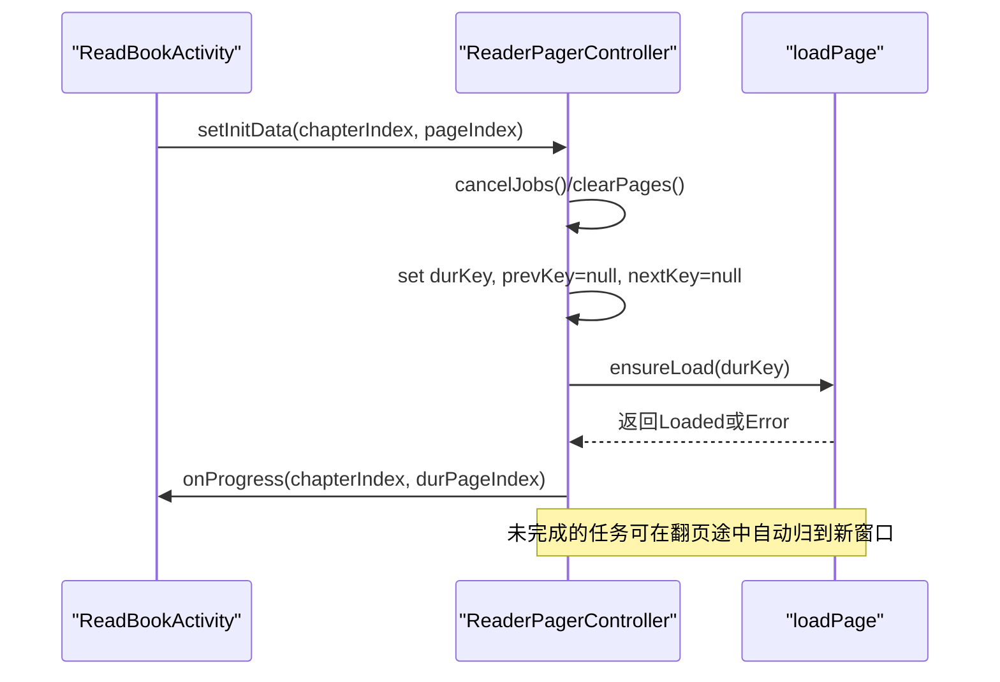

# 阅读器界面组件

<cite>
**本文引用的文件**
- [ReaderPager.kt](file://module_book/src/main/java/com/ebook/book/reader/ReaderPager.kt)
- [ReaderPanels.kt](file://module_book/src/main/java/com/ebook/book/reader/ReaderPanels.kt)
- [ChapterLayoutCache.kt](file://module_book/src/main/java/com/ebook/book/reader/ChapterLayoutCache.kt)
- [ReaderTypesetter.kt](file://module_book/src/main/java/com/ebook/book/reader/ReaderTypesetter.kt)
- [TextNormalizer.kt](file://lib_book_common/src/main/java/com/ebook/common/text/TextNormalizer.kt)
- [ReadBookActivity.kt](file://module_book/src/main/java/com/ebook/book/ReadBookActivity.kt)
</cite>

## 目录
1. [简介](#简介)
2. [项目结构与职责划分](#项目结构与职责划分)
3. [核心组件总览](#核心组件总览)
4. [架构概览](#架构概览)
5. [详细组件分析](#详细组件分析)
6. [依赖关系分析](#依赖关系分析)
7. [性能考量](#性能考量)
8. [疑难排查指南](#疑难排查指南)
9. [结论与最佳实践](#结论与最佳实践)
10. [附录：关键流程图与时序图](#附录：关键流程图与时序图)

## 简介
本文件面向 Jetpack Compose 实现的网络与本地书籍阅读器 UI，围绕分页翻页、阅读体验、排版渲染、面板交互、手势处理、主题与无障碍等维度，给出从架构到细节的系统化文档。重点说明 ReaderPager 的分页机制与动画、ReaderPanels 的配置界面、ChapterLayoutCache 的布局缓存与长文性能优化、ReaderTypesetter 的排版引擎与断行/分页算法，以及横竖屏、暗色模式与无障碍的适配策略。

## 项目结构与职责划分
- module_book 的 reader 包承担阅读 UI 的核心能力：翻页容器与控制器、配置面板、页面级状态与动画。
- lib_book_common 提供文本规范化能力，保障段落与展示文本稳定生成，避免存储侧污染。
- ReadBookActivity 作为组合与协调层，负责把排版样式、加载策略、面板切换、手势调度串联起来。

**图示来源**
- [ReaderPager.kt:71-200](file://module_book/src/main/java/com/ebook/book/reader/ReaderPager.kt#L71-L200)
- [ReaderTypesetter.kt:28-135](file://module_book/src/main/java/com/ebook/book/reader/ReaderTypesetter.kt#L28-L135)
- [ChapterLayoutCache.kt:7-49](file://module_book/src/main/java/com/ebook/book/reader/ChapterLayoutCache.kt#L7-L49)
- [TextNormalizer.kt:4-101](file://lib_book_common/src/main/java/com/ebook/common/text/TextNormalizer.kt#L4-L101)

**章节来源**
- [ReaderPager.kt:71-200](file://module_book/src/main/java/com/ebook/book/reader/ReaderPager.kt#L71-L200)
- [ReaderPanels.kt:131-178](file://module_book/src/main/java/com/ebook/book/reader/ReaderPanels.kt#L131-L178)
- [ChapterLayoutCache.kt:7-49](file://module_book/src/main/java/com/ebook/book/reader/ChapterLayoutCache.kt#L7-L49)
- [ReaderTypesetter.kt:28-135](file://module_book/src/main/java/com/ebook/book/reader/ReaderTypesetter.kt#L28-L135)
- [TextNormalizer.kt:4-101](file://lib_book_common/src/main/java/com/ebook/common/text/TextNormalizer.kt#L4-L101)

## 核心组件总览
- ReaderPager：承载“三页窗口”的分页视图与控制器，维护 dur/prev/next 三个页标识，提供拖拽与程序化翻页、动画与阈值判定。
- ReaderTypesetter：基于 Compose TextMeasurer 的排版引擎，负责按当前 TextStyle 与约束测量并输出每行起始偏移及可视行数。
- ChapterLayoutCache：以（内容引用、字号、宽度）为键缓存整章段落起始偏移，避免同章 N 次重排导致的 O(N×章长) 重复计算。
- ReaderPanels：阅读器 chrome 层，含顶栏、章节/亮度/字体/设置/下载面板，提供主题切换、字体/行距滑块等交互。
- TextNormalizer：章节文本规范化工具，将原始章节转为稳定段落与展示文本，保证排版与段评锚点一致。
- ReadBookActivity：编排者，持有 ReaderTypesetter、控制面板状态、处理手势、驱动翻页。

**章节来源**
- [ReaderPager.kt:71-200](file://module_book/src/main/java/com/ebook/book/reader/ReaderPager.kt#L71-L200)
- [ReaderTypesetter.kt:28-135](file://module_book/src/main/java/com/ebook/book/reader/ReaderTypesetter.kt#L28-L135)
- [ChapterLayoutCache.kt:7-49](file://module_book/src/main/java/com/ebook/book/reader/ChapterLayoutCache.kt#L7-L49)
- [ReaderPanels.kt:131-178](file://module_book/src/main/java/com/ebook/book/reader/ReaderPanels.kt#L131-L178)
- [TextNormalizer.kt:4-101](file://lib_book_common/src/main/java/com/ebook/common/text/TextNormalizer.kt#L4-L101)

## 架构概览
阅读器的数据流以“排版即渲染”的单向契约为核心：分页与渲染共用同一个 TextStyle 与 TextMeasurer，确保切出的段落与最终渲染一致；同时通过 ChapterLayoutCache 对昂贵的整章偏移计算进行结果复用。

**图示来源**
- [ReaderPager.kt:112-200](file://module_book/src/main/java/com/ebook/book/reader/ReaderPager.kt#L112-L200)
- [ReaderTypesetter.kt:28-135](file://module_book/src/main/java/com/ebook/book/reader/ReaderTypesetter.kt#L28-L135)
- [ChapterLayoutCache.kt:7-49](file://module_book/src/main/java/com/ebook/book/reader/ChapterLayoutCache.kt#L7-L49)
- [ReadBookActivity.kt](file://module_book/src/main/java/com/ebook/book/ReadBookActivity.kt)

## 详细组件分析

### ReaderPager：分页管理与动画
- 三页窗口：维护当前页（dur）、上一页（prev）、下一页（next），保证三者互异且至少一侧存在，避免死端。
- 竞态与去重：按 ReaderPageKey 在途 job 与已 Loaded 的页双重去重；中途跳转会取消所有任务，避免覆盖。
- 加载流程：ensureLoad 将 Loading → 成功置 Loaded 并触发窗口重算，失败置 Error 支持重试 reload。
- 动画与手势：drag 表示横向位移，配合 isMoving 锁；翻页阈值（30dp 换算 px）决定滑入或回弹。
- 进度回调：setInitData/onProgress 驱动菜单标题与章节滑条位置同步。

**图示来源**
- [ReaderPager.kt:112-200](file://module_book/src/main/java/com/ebook/book/reader/ReaderPager.kt#L112-L200)

**章节来源**
- [ReaderPager.kt:64-111](file://module_book/src/main/java/com/ebook/book/reader/ReaderPager.kt#L64-L111)
- [ReaderPager.kt:112-200](file://module_book/src/main/java/com/ebook/book/reader/ReaderPager.kt#L112-L200)

### ReaderTypesetter：排版引擎与分页算法
- 同源契约：分页与渲染必须共用同一 TextStyle、TextMeasurer、密度与约束，确保“切多少行=能放得下多少行”。
- lineStartOffsets：按给定 widthPx 测量整段，输出每行的起始字符偏移列表，供 ReaderPager 切出连续正文子串。
- fitRenderLineCount：以探针文本逐行探测可视高度内能容纳的行数，避免公式估算带来的累计误差。
- readerBodyTextStyle：统一字号与行高，并固定 lineHeightStyle 避免主题隐式解析差异导致行数漂移。

**图示来源**
- [ReaderTypesetter.kt:52-81](file://module_book/src/main/java/com/ebook/book/reader/ReaderTypesetter.kt#L52-L81)

**章节来源**
- [ReaderTypesetter.kt:28-135](file://module_book/src/main/java/com/ebook/book/reader/ReaderTypesetter.kt#L28-L135)

### ChapterLayoutCache：整章排版偏移缓存
- 缓存键：contentRef + fontSizeSp + widthPx，任一变化均重建，防止换页后错位。
- 并发安全：LinkedHashMap 用 Collections.synchronizedMap 包装，getOrCompute 在同步块内完成 check-then-act，防止并发预加载重复计算。
- 容量管理：默认容量约“当前章±前后各两章”，移除最久未使用项以满足 LRU 语义。
- 失效策略：按 BookStore.cacheMarker(bookId) 匹配 contentRef 片段，批量清除与某书相关的条目。

**章节来源**
- [ChapterLayoutCache.kt:7-49](file://module_book/src/main/java/com/ebook/book/reader/ChapterLayoutCache.kt#L7-L49)

### ReaderPanels：配置界面与主题/字体/行距
- 顶栏：显示书名+当前章节标题，具备返回与更多入口，边缘区域采用 statusBarsPadding 适配沉浸式状态栏。
- 面板枚举：NONE/CHAPTER/LIGHT/FONT/SETTING/DOWNLOAD，集中管理五种弹窗面板的显隐。
- 主题与视觉：使用 Material3 Surface、Icons 与公共设计令牌，顶部面板带有圆角与阴影浮于正文。
- 字体与行距：底栏与面板内提供字体大小与行间距调节控件，通过改变 ReaderTypesetter.style 触发重新排版。
- 章节/亮度/下载面板：提供章节快速定位、屏幕亮度调节与离线下载入口。

**章节来源**
- [ReaderPanels.kt:123-178](file://module_book/src/main/java/com/ebook/book/reader/ReaderPanels.kt#L123-L178)
- [ReaderPanels.kt:180-210](file://module_book/src/main/java/com/ebook/book/reader/ReaderPanels.kt#L180-L210)

### 文本规范化与段落展示
- 不污染存储：章节原文保存“切分后、规范化前”的原始文本，仅在读取时规范化，便于规则调整可逆。
- 缩进策略：段落首缩进由 toDisplayText 统一添加 INDENT（两个全角空格），避免历史空白与现规则冲突。
- 换行清洗：unifyNewlines 将 CRLF 统一为 LF，避免 Compose 吞掉 \n 造成段落合并的问题。
- 段落清理：cleanParagraph/cleanParagraphs 去除 BOM、折叠连续空白、丢弃首尾空白，并过滤空行。

**章节来源**
- [TextNormalizer.kt:4-101](file://lib_book_common/src/main/java/com/ebook/common/text/TextNormalizer.kt#L4-L101)

## 依赖关系分析
- ReadBookActivity 依赖 ReaderPagerController 与 ReaderPanels，并通过 rememberReaderTypesetter 持有排版引擎。
- ReaderTypesetter 依赖 Compose TextMeasurer、Density 与统一样式，提供纯函数式的测量能力。
- ChapterLayoutCache 依赖 BookStore 提供的缓存标记，仅做结构化的内存缓存，不感知 I/O。
- ReaderPager 通过 ReaderPageKey 抽象章节与页码，将加载逻辑解耦，利于测试与替换数据源。

**图示来源**
- [ReaderPager.kt:112-200](file://module_book/src/main/java/com/ebook/book/reader/ReaderPager.kt#L112-L200)
- [ReaderTypesetter.kt:28-135](file://module_book/src/main/java/com/ebook/book/reader/ReaderTypesetter.kt#L28-L135)
- [ChapterLayoutCache.kt:7-49](file://module_book/src/main/java/com/ebook/book/reader/ChapterLayoutCache.kt#L7-L49)
- [TextNormalizer.kt:4-101](file://lib_book_common/src/main/java/com/ebook/common/text/TextNormalizer.kt#L4-L101)

**章节来源**
- [ReaderPager.kt:112-200](file://module_book/src/main/java/com/ebook/book/reader/ReaderPager.kt#L112-L200)
- [ReaderTypesetter.kt:28-135](file://module_book/src/main/java/com/ebook/book/reader/ReaderTypesetter.kt#L28-L135)
- [ChapterLayoutCache.kt:7-49](file://module_book/src/main/java/com/ebook/book/reader/ChapterLayoutCache.kt#L7-L49)
- [TextNormalizer.kt:4-101](file://lib_book_common/src/main/java/com/ebook/common/text/TextNormalizer.kt#L4-L101)

## 性能考量
- 整章重排成本收敛：ChapterLayoutCache 将 lineStartOffsets 的结果按（内容、字号、宽度）缓存，同章翻页不再重复测量。
- 并发安全的缓存访问：通过 synchronized 包裹 getOrCompute，防止多协程并发 Miss 引发重复计算与 map 结构损坏。
- 合理容量：LRU 容量默认 5，覆盖当前章与相邻章节的预读区间，避免过大内存占用。
- 避免渲染与分页不一致：统一 TextStyle，避免因测量与渲染差异造成行数偏差，减少二次重排。
- 异步加载与去重：ReaderPagerController 以 ReaderPageKey 去重在途 Job 与已完成 Loaded 的页，减少冗余 DB/网络请求。

[本节为通用性能建议与代码中既有实现总结，无需特定文件片段引用]

## 疑难排查指南
- 正文接不上或丢字
  - 检查是否使用了统一的 TextStyle 与 TextMeasurer；确认 lineStartOffsets 与渲染端一致。
  - 核查 TextNormalizer 的统一换行与段落清洗逻辑是否生效，尤其是 CRLF→LF。
- 页数异常或多出一行
  - 检查 fitRenderLineCount 的可视高度输入是否与 UI 实际高度一致；避免公式估算替代实测。
- 缓存命中错误（旧字号显示错页）
  - 确认缓存键包含 fontSizeSp 与 widthPx；改参后需重排并刷新窗口。
- 并发下的缓存被破坏
  - 确保使用 getOrCompute 并在同步块内执行；勿自行拆分 get/put。
- 面板状态异常或卡顿
  - 检查面板显隐枚举 ReaderPanel 是否正确切换；避免过多动画叠加导致 isMoving 锁失效。
- 无障碍读屏与导航
  - 为关键控件补充 contentDescription 等语义信息；滑条组件设置 progressBarRangeInfo 以便读屏。

**章节来源**
- [ReaderPanels.kt:180-210](file://module_book/src/main/java/com/ebook/book/reader/ReaderPanels.kt#L180-L210)
- [ReaderPager.kt:112-200](file://module_book/src/main/java/com/ebook/book/reader/ReaderPager.kt#L112-L200)
- [ChapterLayoutCache.kt:7-49](file://module_book/src/main/java/com/ebook/book/reader/ChapterLayoutCache.kt#L7-L49)
- [ReaderTypesetter.kt:28-135](file://module_book/src/main/java/com/ebook/book/reader/ReaderTypesetter.kt#L28-L135)

## 结论与最佳实践
- 分页与渲染必须同源：统一 TextStyle 与 TextMeasurer 是一切计算与呈现正确性的基石。
- 大对象与昂贵计算的缓存收益显著：ChapterLayoutCache 将 O(N) 整章测量结果复用至分页阶段。
- 严格的状态机不变量：三页窗口 keys 互异且至少一侧非空，能避免无效翻页与死端。
- 文本规范化前置：只读时规范，不污染持久化内容，保证规则演进可逆。
- UI 设计与系统适配：遵循 edge-to-edge 边距与沉浸栏避让；使用 Material3 组件统一风格。
- 自定义组件规范：尽量使用 CompositionLocal 传递样式、避免散落的魔法值；用常量对象收敛局部尺寸与节奏。
- 无障碍：为关键交互元素提供可读描述和语义信息，帮助辅助设备理解阅读进度与操作目的。
- 横竖屏适配：页面宽度变化时应触发 rePaginate 与缓存键重构，确保行数与分页随之更新。
- 动画与手势：isMoving 防抖并禁用并发动画；拖动阈值与阻尼要兼顾流畅与可操作性。

[本节为经验性总结，不涉及具体代码引用]

## 附录：关键流程图与时序图

### ReaderPagerController 初始化与跳转时序

**图示来源**
- [ReaderPager.kt:154-168](file://module_book/src/main/java/com/ebook/book/reader/ReaderPager.kt#L154-L168)
- [ReaderPager.kt:176-200](file://module_book/src/main/java/com/ebook/book/reader/ReaderPager.kt#L176-L200)
- [ReadBookActivity.kt](file://module_book/src/main/java/com/ebook/book/ReadBookActivity.kt)

### 章节文本渲染流水线

**图示来源**
- [TextNormalizer.kt:4-101](file://lib_book_common/src/main/java/com/ebook/common/text/TextNormalizer.kt#L4-L101)
- [ReaderTypesetter.kt:28-135](file://module_book/src/main/java/com/ebook/book/reader/ReaderTypesetter.kt#L28-L135)
- [ChapterLayoutCache.kt:7-49](file://module_book/src/main/java/com/ebook/book/reader/ChapterLayoutCache.kt#L7-L49)
- [ReaderPager.kt:64-111](file://module_book/src/main/java/com/ebook/book/reader/ReaderPager.kt#L64-L111)