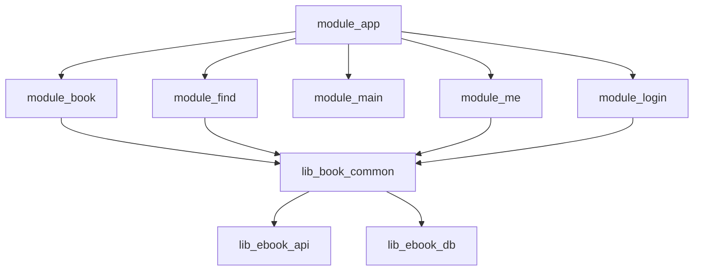
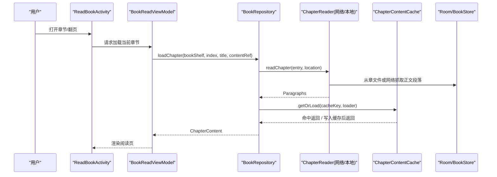
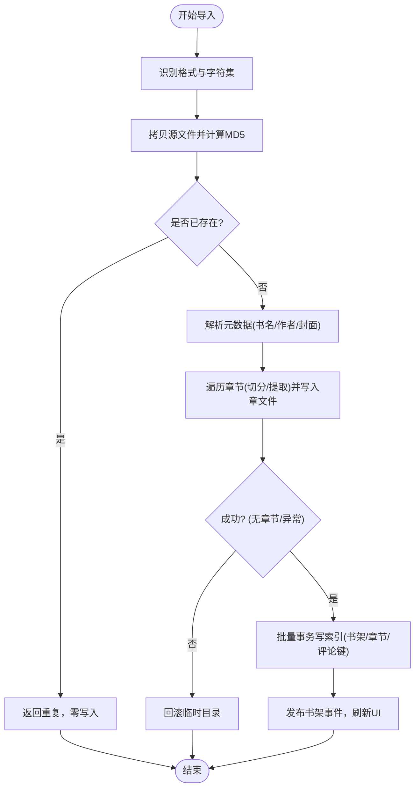
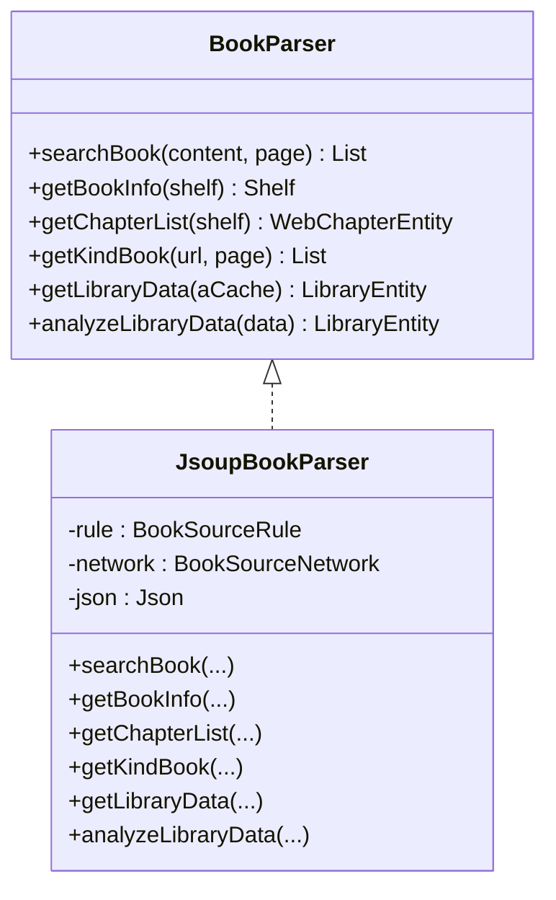
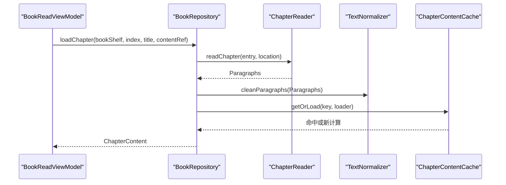
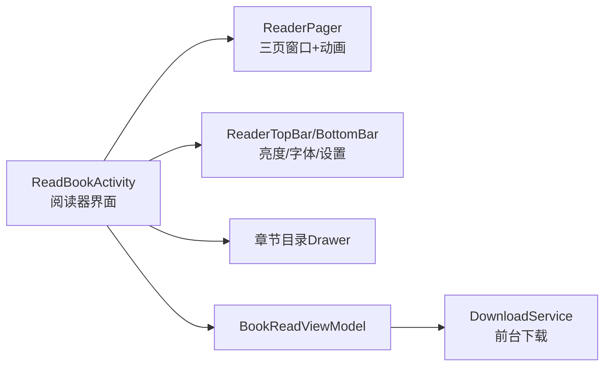
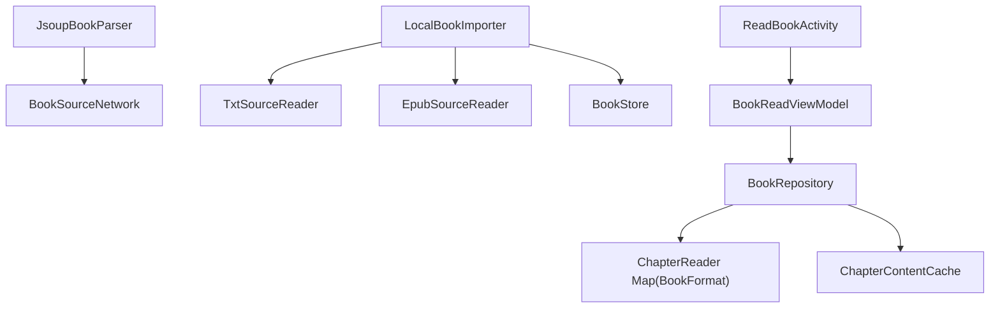

# 阅读系统

<cite>
**本文引用的文件列表**
- [README.md](file://README.md)
- [AGENTS.md](file://AGENTS.md)
- [docs/adr/0017-local-book-multi-format-support.md](file://docs/adr/0017-local-book-multi-format-support.md)
- [docs/adr/0016-multi-book-source-architecture.md](file://docs/adr/0016-multi-book-source-architecture.md)
- [docs/superpowers/specs/2026-09-04-local-book-import-design.md](file://docs/superpowers/specs/2026-09-04-local-book-import-design.md)
- [lib_book_common/src/main/java/com/ebook/common/analyze/source/BookParser.kt](file://lib_book_common/src/main/java/com/ebook/common/analyze/source/BookParser.kt)
- [lib_book_common/src/main/java/com/ebook/common/analyze/source/JsoupBookParser.kt](file://lib_book_common/src/main/java/com/ebook/common/analyze/source/JsoupBookParser.kt)
- [lib_book_common/src/main/java/com/ebook/common/importer/LocalBookImporter.kt](file://lib_book_common/src/main/java/com/ebook/common/importer/LocalBookImporter.kt)
- [lib_book_common/src/main/java/com/ebook/common/analyze/local/TxtSourceReader.kt](file://lib_book_common/src/main/java/com/ebook/common/analyze/local/TxtSourceReader.kt)
- [lib_book_common/src/main/java/com/ebook/common/analyze/local/EpubSourceReader.kt](file://lib_book_common/src/main/java/com/ebook/common/analyze/local/EpubSourceReader.kt)
- [lib_book_common/src/main/java/com/ebook/common/repository/BookRepository.kt](file://lib_book_common/src/main/java/com/ebook/common/repository/BookRepository.kt)
- [lib_book_common/src/main/java/com/ebook/common/store/ChapterContentCache.kt](file://lib_book_common/src/main/java/com/ebook/common/store/ChapterContentCache.kt)
- [module_book/src/main/java/com/ebook/book/ReadBookActivity.kt](file://module_book/src/main/java/com/ebook/book/ReadBookActivity.kt)
- [module_book/src/main/java/com/ebook/book/mvvm/viewmodel/BookReadViewModel.kt](file://module_book/src/main/java/com/ebook/book/mvvm/viewmodel/BookReadViewModel.kt)
</cite>

## 目录
1. [简介](#简介)
2. [项目结构](#项目结构)
3. [核心组件](#核心组件)
4. [架构总览](#架构总览)
5. [详细组件分析](#详细组件分析)
6. [依赖关系分析](#依赖关系分析)
7. [性能考虑](#性能考虑)
8. [故障排查指南](#故障排查指南)
9. [结论](#结论)
10. [附录](#附录)

## 简介
本项目为 Android 小说阅读器，基于 MVVM + Jetpack Compose，提供本地书籍导入（TXT、EPUB）、在线书源解析与下载、阅读器界面交互、阅读进度与书签管理、离线下载等能力。整体遵循多模块分层：业务模块 → lib_book_common → lib_ebook_api → lib_ebook_db。文档面向开发者与产品技术读者，既说明宏观架构又深入代码级实现。

**章节来源**
- [README.md:10-30](file://README.md#L10-L30)

## 项目结构
项目采用多模块 Gradle 工程。功能层由 module_app 汇总组合；阅读与管理在 module_book，书城搜索在 module_find；领域共享逻辑与通用库集中在 lib_book_common；网络层在 lib_ebook_api；持久化实体与 DAO 在 lib_ebook_db。所有页面使用 Compose，阅读器亦迁移到 Compose。

**图表来源**
- [AGENTS.md:39-54](file://AGENTS.md#L39-L54)

**章节来源**
- [AGENTS.md:39-54](file://AGENTS.md#L39-L54)
- [README.md:86-103](file://README.md#L86-L103)

## 核心组件
- 书源解析抽象与规则驱动解析器
- 本地书籍导入流水线（TXT/EPUB）
- 阅读统一读取管线（章节内容、分页缓存）
- 阅读器 UI（Compose），主题、字体、翻页动画等
- 阅读进度与书签的持久化与同步
- 离线下载的前台服务调度

**章节来源**
- [lib_book_common/src/main/java/com/ebook/common/analyze/source/BookParser.kt:9-20](file://lib_book_common/src/main/java/com/ebook/common/analyze/source/BookParser.kt#L9-L20)
- [lib_book_common/src/main/java/com/ebook/common/importer/LocalBookImporter.kt:34-56](file://lib_book_common/src/main/java/com/ebook/common/importer/LocalBookImporter.kt#L34-L56)
- [lib_book_common/src/main/java/com/ebook/common/repository/BookRepository.kt:164-199](file://lib_book_common/src/main/java/com/ebook/common/repository/BookRepository.kt#L164-L199)
- [module_book/src/main/java/com/ebook/book/ReadBookActivity.kt:81-126](file://module_book/src/main/java/com/ebook/book/ReadBookActivity.kt#L81-L126)
- [module_book/src/main/java/com/ebook/book/mvvm/viewmodel/BookReadViewModel.kt:73-99](file://module_book/src/main/java/com/ebook/book/mvvm/viewmodel/BookReadViewModel.kt#L73-L99)

## 架构总览
阅读系统围绕“来源抽象 + 统一读取管线”构建：
- 书源解析：基于 JSON 规则的 JsoupBookParser，负责搜索、详情、目录、分类页、书库数据。
- 本地导入：LocalBookImporter 按扩展名路由至 TxtSourceReader 或 EpubSourceReader，切分章节并落盘，生成评论键与索引行。
- 统一读取：BookRepository.loadChapter 根据 BookFormat 选择 ChapterReader，经 TextNormalizer 规范化后写入 ChapterContentCache。
- UI 层：ReadBookActivity/BookReadViewModel 组织 ReaderPager、ReaderTypesetter、面板与菜单，完成主题、字体、翻页与亮度等体验优化。
- 下载：DownloadService 通过前台服务异步拉取章节。

**图表来源**
- [lib_book_common/src/main/java/com/ebook/common/repository/BookRepository.kt:180-199](file://lib_book_common/src/main/java/com/ebook/common/repository/BookRepository.kt#L180-L199)
- [lib_book_common/src/main/java/com/ebook/common/store/ChapterContentCache.kt:37-42](file://lib_book_common/src/main/java/com/ebook/common/store/ChapterContentCache.kt#L37-L42)
- [module_book/src/main/java/com/ebook/book/mvvm/viewmodel/BookReadViewModel.kt:92-99](file://module_book/src/main/java/com/ebook/book/mvvm/viewmodel/BookReadViewModel.kt#L92-L99)
- [module_book/src/main/java/com/ebook/book/ReadBookActivity.kt:130-141](file://module_book/src/main/java/com/ebook/book/ReadBookActivity.kt#L130-L141)

## 详细组件分析

### 本地书籍导入（TXT/EPUB）
- 格式路由：按扩展名识别 TXT 与 EPUB，调用对应的 SourceReader。
- 切分与落盘：TXT 通过章节切分器将纯文本按正则匹配分段；EPUB 借助容器 OPF 的 spine 顺序逐章提取 XHTML 正文段落，均写入 BookStore 对应章节文件。
- 元数据与封面：TXT 从文件名解析书名/作者；EPUB 解析 metadata 获取书名/作者，支持 EPUB3/EPUB2 两种封面声明方式导出至暂存目录。
- 去重与入库：先拷贝并计算内容 MD5，重复直接返回；不重复则批量事务写入书架、书籍信息、章节索引及作品关联键（comment_key）。
- 事件与回显：导入完成发布书架新增事件，刷新 UI。

**图表来源**
- [lib_book_common/src/main/java/com/ebook/common/importer/LocalBookImporter.kt:62-144](file://lib_book_common/src/main/java/com/ebook/common/importer/LocalBookImporter.kt#L62-L144)
- [lib_book_common/src/main/java/com/ebook/common/analyze/local/TxtSourceReader.kt:25-38](file://lib_book_common/src/main/java/com/ebook/common/analyze/local/TxtSourceReader.kt#L25-L38)
- [lib_book_common/src/main/java/com/ebook/common/analyze/local/EpubSourceReader.kt:29-74](file://lib_book_common/src/main/java/com/ebook/common/analyze/local/EpubSourceReader.kt#L29-L74)

**章节来源**
- [docs/adr/0017-local-book-multi-format-support.md:15-38](file://docs/adr/0017-local-book-multi-format-support.md#L15-L38)
- [docs/superpowers/specs/2026-09-04-local-book-import-design.md:136-184](file://docs/superpowers/specs/2026-09-04-local-book-import-design.md#L136-L184)

### 在线书源解析（JSON 规则 + JsoupBookParser）
- 规则驱动：以 BookSourceRule（搜索、详情、目录、分类页）声明式配置站点结构。
- 解析流程：
  - 搜索：URL 模板与请求体经 ListPageUrl 处理页码渲染；抓 HTML 后用 JsoupHelper 抽取书目字段。
  - 详情：按规则抓取标题、作者、简介、封面、目录 URL。
  - 目录：按规则定位列表，反转排序与序号重置可选。
  - 发现/书库：分类页与首页同样经由规则抽取。
- 扩展性：新增书源只需维护 JSON 规则，无需修改代码。

**图表来源**
- [lib_book_common/src/main/java/com/ebook/common/analyze/source/BookParser.kt:9-20](file://lib_book_common/src/main/java/com/ebook/common/analyze/source/BookParser.kt#L9-L20)
- [lib_book_common/src/main/java/com/ebook/common/analyze/source/JsoupBookParser.kt:29-166](file://lib_book_common/src/main/java/com/ebook/common/analyze/source/JsoupBookParser.kt#L29-L166)

**章节来源**
- [README.md:19-23](file://README.md#L19-L23)
- [lib_book_common/src/main/java/com/ebook/common/analyze/source/JsoupBookParser.kt:37-95](file://lib_book_common/src/main/java/com/ebook/common/analyze/source/JsoupBookParser.kt#L37-L95)
- [lib_book_common/src/main/java/com/ebook/common/analyze/source/JsoupBookParser.kt:98-166](file://lib_book_common/src/main/java/com/ebook/common/analyze/source/JsoupBookParser.kt#L98-L166)

### 阅读统一读取与缓存
- 统一入口：BookRepository.loadChapter 接收 BookShelfEntity、章节索引、标题与 contentRef，按 BookFormat 路由到 ChapterReader（网络 vs 本地）。
- 规范处理：读取后执行段落清洗与缩进补全，保证渲染一致。
- 内存缓存：ChapterContentCache 按 contentRef 保留当前章和前后各一章，减少翻章时重复读盘/解码成本；支持按书失效与清空。
- 缺失处理：空章节不落缓存，避免展示空页。

**图表来源**
- [lib_book_common/src/main/java/com/ebook/common/repository/BookRepository.kt:180-199](file://lib_book_common/src/main/java/com/ebook/common/repository/BookRepository.kt#L180-L199)
- [lib_book_common/src/main/java/com/ebook/common/store/ChapterContentCache.kt:21-42](file://lib_book_common/src/main/java/com/ebook/common/store/ChapterContentCache.kt#L21-L42)

**章节来源**
- [AGENTS.md:150-157](file://AGENTS.md#L150-L157)
- [lib_book_common/src/main/java/com/ebook/common/store/ChapterContentCache.kt:7-59](file://lib_book_common/src/main/java/com/ebook/common/store/ChapterContentCache.kt#L7-L59)

### 阅读器界面（Compose）
- 阅读页：ReadBookActivity 承载 ReaderPager/ReaderTypesetter，封装三页窗口状态机、布局缓存、顶部/底部面板（亮度、字体、设置）、章节目录抽屉。
- 主题与字体：豁免系统深色模式，按阅读背景主题渲染；提供字号调节与自定义样式参数。
- 翻页动画：结合 ReaderPager 与动画可见性控制，提供切换时的视觉反馈。
- 下载入口：支持一键选择章节下载到前台服务（受系统前台配额限制）。

**图表来源**
- [module_book/src/main/java/com/ebook/book/ReadBookActivity.kt:81-126](file://module_book/src/main/java/com/ebook/book/ReadBookActivity.kt#L81-L126)
- [module_book/src/main/java/com/ebook/book/mvvm/viewmodel/BookReadViewModel.kt:73-90](file://module_book/src/main/java/com/ebook/book/mvvm/viewmodel/BookReadViewModel.kt#L73-L90)

**章节来源**
- [AGENTS.md:160-176](file://AGENTS.md#L160-L176)
- [module_book/src/main/java/com/ebook/book/ReadBookActivity.kt:174-195](file://module_book/src/main/java/com/ebook/book/ReadBookActivity.kt#L174-L195)

### 阅读进度、书签与章节跳转
- 进度保存：BookReadViewModel.saveProgress 更新 durChapter/durChapterPage，并通过 BookRepository.saveProgress 持久化与事件上报。
- 书架归属检查：checkInShelf 判断当前书是否在书架，决定进入阅读页的提示与行为。
- 章节跳转：ViewModel 提供 getChapterTitle/getChapterSize/getChapter 等辅助方法，供 UI 展示目录与定位当前章。

**章节来源**
- [module_book/src/main/java/com/ebook/book/mvvm/viewmodel/BookReadViewModel.kt:33-61](file://module_book/src/main/java/com/ebook/book/mvvm/viewmodel/BookReadViewModel.kt#L33-L61)
- [module_book/src/main/java/com/ebook/book/mvvm/viewmodel/BookReadViewModel.kt:92-112](file://module_book/src/main/java/com/ebook/book/mvvm/viewmodel/BookReadViewModel.kt#L92-L112)

### 数据模型与会话约定要点
- 多书源架构规划：未来按 tag 字段明确书源归属，支持聚合搜索与阅读中换源；当前代码仍走全局 parser 默认源。
- 会话与 token：认证采用双 token，静默续期，权限白名单客户端仅携带 token 访问受限 host，书源请求使用纯净客户端。
- 表单契约：HTTP 恒 200 信封 + 五位业务码，传输/业务/客户端三层异常分治。

**章节来源**
- [docs/adr/0016-multi-book-source-architecture.md:3-14](file://docs/adr/0016-multi-book-source-architecture.md#L3-L14)
- [AGENTS.md:136-137](file://AGENTS.md#L136-L137)
- [AGENTS.md:120-125](file://AGENTS.md#L120-L125)

## 依赖关系分析
- 组件耦合：JsoupBookParser 依赖网络与规则，本地导入依赖 SourceReader/BStore/DAO，读取管线解耦了来源（网络/本地），仅关注 chapter reader 与缓存。
- 注入与模块化：通过 Hilt 在 ViewModel/Repository/Importing 等层注入依赖；跨模块走 Provider/TheRouter。
- 数据库与存储：Room DAO 承担书架/章节索引/评论键等读写；BookStore 负责章文件与封面落盘，ChapterContentCache 做内存加速。

**图表来源**
- [lib_book_common/src/main/java/com/ebook/common/importer/LocalBookImporter.kt:45-56](file://lib_book_common/src/main/java/com/ebook/common/importer/LocalBookImporter.kt#L45-L56)
- [lib_book_common/src/main/java/com/ebook/common/repository/BookRepository.kt:41-50](file://lib_book_common/src/main/java/com/ebook/common/repository/BookRepository.kt#L41-L50)
- [module_book/src/main/java/com/ebook/book/mvvm/viewmodel/BookReadViewModel.kt:21-26](file://module_book/src/main/java/com/ebook/book/mvvm/viewmodel/BookReadViewModel.kt#L21-L26)

**章节来源**
- [AGENTS.md:39-54](file://AGENTS.md#L39-L54)
- [lib_book_common/src/main/java/com/ebook/common/importer/LocalBookImporter.kt:163-170](file://lib_book_common/src/main/java/com/ebook/common/importer/LocalBookImporter.kt#L163-L170)
- [lib_book_common/src/main/java/com/ebook/common/store/ChapterContentCache.kt:21-42](file://lib_book_common/src/main/java/com/ebook/common/store/ChapterContentCache.kt#L21-L42)

## 性能考虑
- 导入性能优化：导入改为“只读一次源文件并流式写章文件”，批量事务落库，避免旧实现多次全量扫描与重复 REPLACE；性能基线测试已准备，待人工验证。
- 读取性能：引入 ChapterContentCache，容量=3，覆盖当前章与前后一页，显著降低翻页时重复 IO；规范化在读取层集中执行，避免存储侧脏写。
- 下载与前台服务：受 dataSync 配额限制，拉起统一走 DownloadService.start；失败任务重试耗尽才出队，避免常驻通知无法停止。
- 解析与分页：列表页通过 ListPageUrl 统一页码渲染与首页处理；章节跟进优先判定原始章节 URL，防止串章导致冗余请求。

**章节来源**
- [docs/superpowers/specs/2026-09-04-local-book-import-design.md:136-151](file://docs/superpowers/specs/2026-09-04-local-book-import-design.md#L136-L151)
- [lib_book_common/src/main/java/com/ebook/common/store/ChapterContentCache.kt:7-20](file://lib_book_common/src/main/java/com/ebook/common/store/ChapterContentCache.kt#L7-L20)
- [AGENTS.md:138-139](file://AGENTS.md#L138-L139)
- [lib_book_common/src/main/java/com/ebook/common/analyze/source/JsoupBookParser.kt:47-62](file://lib_book_common/src/main/java/com/ebook/common/analyze/source/JsoupBookParser.kt#L47-L62)

## 故障排查指南
- 导入失败（空章/非 ZIP）：检查 epub/txt 文件完整性与 container.xml、spine、XHTML 内容；确认 Reader 是否注册到对应 format。
- 阅读页空白：查看 loadChapter 是否命中缓存或 reader 路由；若内容为空会被丢弃，需检查上游是否有段落输出或网络抓取失败。
- 下载通知无法停止：检查是否因 dataSync 配额用尽被拒绝启动；确认任务队列是否包含失败未出队的项。
- 列表无限重复：校验 ruleFind.url/searchUrl 模板是否含 {{page}}，并确保 mergeBookPage 按 noteUrl 去重且末页正确置 hasMore=false。

**章节来源**
- [lib_book_common/src/main/java/com/ebook/common/importer/LocalBookImporter.kt:82-94](file://lib_book_common/src/main/java/com/ebook/common/importer/LocalBookImporter.kt#L82-L94)
- [lib_book_common/src/main/java/com/ebook/common/repository/BookRepository.kt:191-199](file://lib_book_common/src/main/java/com/ebook/common/repository/BookRepository.kt#L191-L199)
- [AGENTS.md:138-139](file://AGENTS.md#L138-L139)

## 结论
该阅读系统通过“来源抽象 + 统一读取 + 强缓存 + Compose UI”的组合，实现了高可用与良好的用户体验：本地导入支持主流格式、在线书源可规则化快速适配、阅读器具备完善的主题与交互能力、数据层与网络层清晰分工。后续重点方向包括多书源共存、聚合搜索与阅读中换源、以及更丰富的内容格式支持与渲染优化。

## 附录
- 多书源规划细节参见 ADR-0016 文档。
- 本地导入重构设计详见 specs 文档。
- 单书源解析能力与扩展点参考 JsoupBookParser。